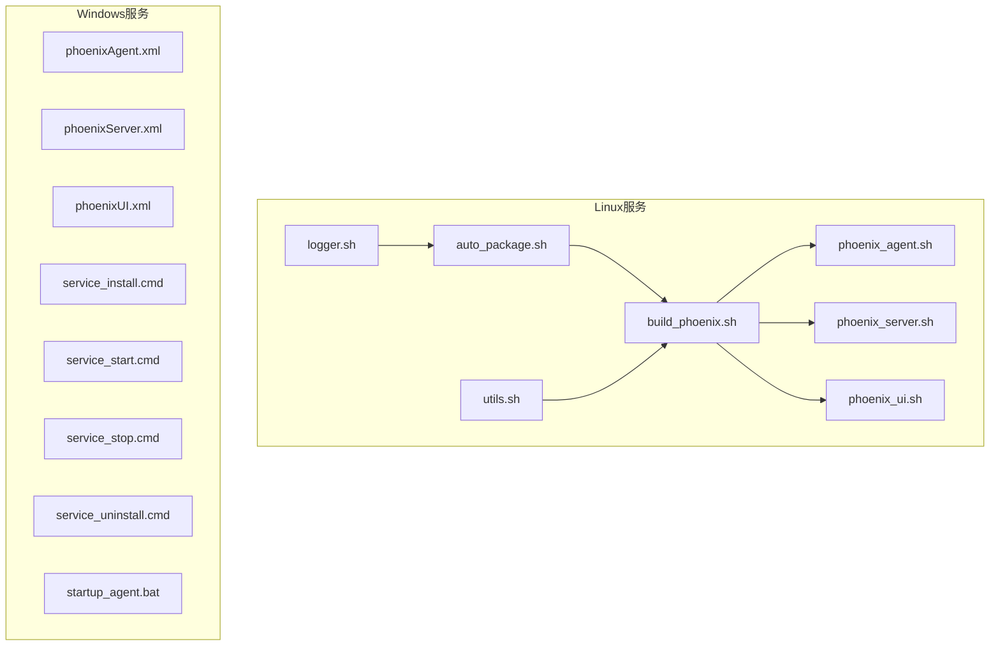
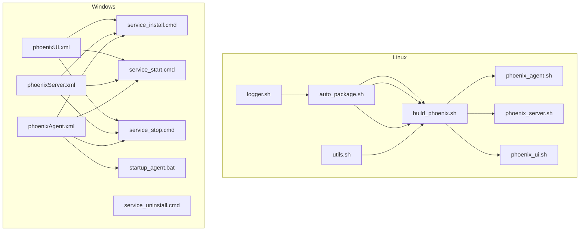
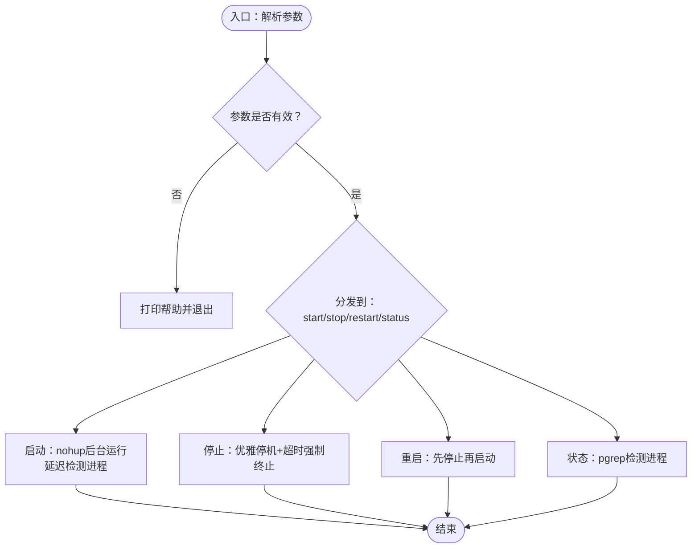
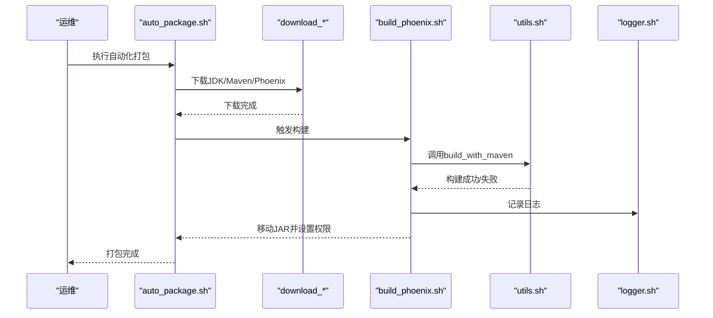
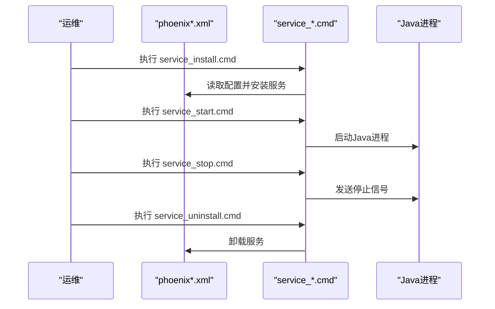
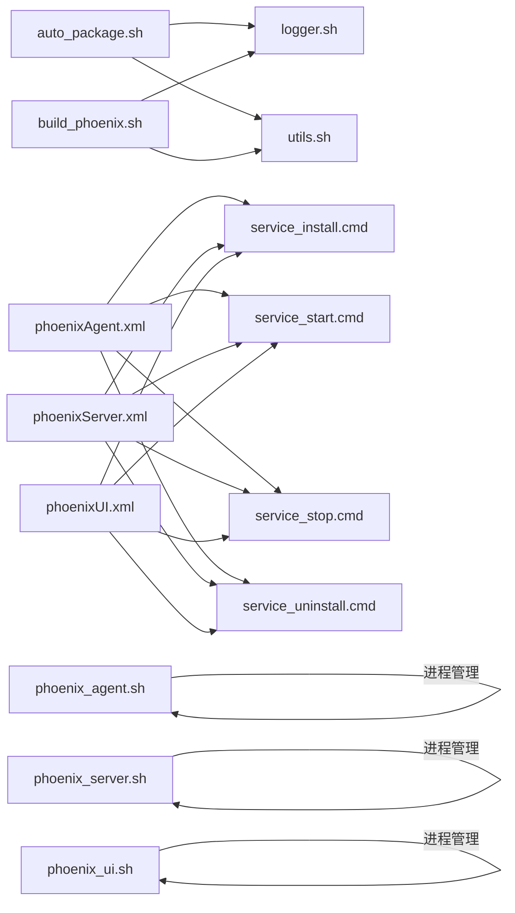

# 系统服务安装

<cite>
**本文引用的文件**
- [phoenix_agent.sh](file://doc/LinuxServices/phoenix-agent/phoenix_agent.sh)
- [phoenix_server.sh](file://doc/LinuxServices/phoenix-server/phoenix_server.sh)
- [phoenix_ui.sh](file://doc/LinuxServices/phoenix-ui/phoenix_ui.sh)
- [auto_package.sh](file://doc/LinuxServices/auto_package.sh)
- [build_phoenix.sh](file://doc/LinuxServices/build_phoenix.sh)
- [utils.sh](file://doc/LinuxServices/utils.sh)
- [logger.sh](file://doc/LinuxServices/logger.sh)
- [phoenixAgent.xml](file://doc/WindowsServices/phoenix-agent/phoenixAgent.xml)
- [phoenixServer.xml](file://doc/WindowsServices/phoenix-server/phoenixServer.xml)
- [phoenixUI.xml](file://doc/WindowsServices/phoenix-ui/phoenixUI.xml)
- [service_install.cmd](file://doc/WindowsServices/phoenix-agent/service_install.cmd)
- [service_start.cmd](file://doc/WindowsServices/phoenix-agent/service_start.cmd)
- [service_stop.cmd](file://doc/WindowsServices/phoenix-agent/service_stop.cmd)
- [service_uninstall.cmd](file://doc/WindowsServices/phoenix-agent/service_uninstall.cmd)
- [startup_agent.bat](file://doc/WindowsServices/phoenix-agent/startup_agent.bat)
</cite>

## 目录
1. [简介](#简介)
2. [项目结构](#项目结构)
3. [核心组件](#核心组件)
4. [架构总览](#架构总览)
5. [详细组件分析](#详细组件分析)
6. [依赖关系分析](#依赖关系分析)
7. [性能考虑](#性能考虑)
8. [故障排查指南](#故障排查指南)
9. [结论](#结论)
10. [附录](#附录)

## 简介
本文件面向Phoenix监控系统的运维与开发人员，提供完整的系统服务安装与维护指南。内容覆盖：
- Linux服务安装脚本的使用方法：服务注册、启动脚本配置、日志管理、开机自启设置
- Windows服务安装脚本的操作流程：服务安装、启动、停止、卸载的全生命周期管理
- 服务配置文件详解：进程管理、资源限制、环境变量、日志输出等
- 服务监控与维护：状态查看、日志管理、异常处理与运维操作
- 最佳实践与常见问题解决方案、故障排除与性能优化建议

## 项目结构
Phoenix监控系统的服务相关脚本集中在doc目录下，按平台与模块划分：
- Linux服务脚本与工具：位于doc/LinuxServices，包含各子模块的启动脚本与自动化打包工具
- Windows服务脚本与配置：位于doc/WindowsServices，包含WinSW配置文件与批处理脚本

图表来源
- [phoenix_agent.sh:1-140](file://doc/LinuxServices/phoenix-agent/phoenix_agent.sh#L1-L140)
- [phoenix_server.sh:1-140](file://doc/LinuxServices/phoenix-server/phoenix_server.sh#L1-L140)
- [phoenix_ui.sh:1-140](file://doc/LinuxServices/phoenix-ui/phoenix_ui.sh#L1-L140)
- [auto_package.sh:1-24](file://doc/LinuxServices/auto_package.sh#L1-L24)
- [build_phoenix.sh:1-48](file://doc/LinuxServices/build_phoenix.sh#L1-L48)
- [utils.sh:1-222](file://doc/LinuxServices/utils.sh#L1-L222)
- [logger.sh:1-121](file://doc/LinuxServices/logger.sh#L1-L121)
- [phoenixAgent.xml:1-314](file://doc/WindowsServices/phoenix-agent/phoenixAgent.xml#L1-L314)
- [phoenixServer.xml:1-314](file://doc/WindowsServices/phoenix-server/phoenixServer.xml#L1-L314)
- [phoenixUI.xml:1-314](file://doc/WindowsServices/phoenix-ui/phoenixUI.xml#L1-L314)
- [service_install.cmd:1-1](file://doc/WindowsServices/phoenix-agent/service_install.cmd#L1-L1)
- [service_start.cmd:1-1](file://doc/WindowsServices/phoenix-agent/service_start.cmd#L1-L1)
- [service_stop.cmd:1-3](file://doc/WindowsServices/phoenix-agent/service_stop.cmd#L1-L3)
- [service_uninstall.cmd:1-1](file://doc/WindowsServices/phoenix-agent/service_uninstall.cmd#L1-L1)
- [startup_agent.bat:1-4](file://doc/WindowsServices/phoenix-agent/startup_agent.bat#L1-L4)

章节来源
- [phoenix_agent.sh:1-140](file://doc/LinuxServices/phoenix-agent/phoenix_agent.sh#L1-L140)
- [phoenix_server.sh:1-140](file://doc/LinuxServices/phoenix-server/phoenix_server.sh#L1-L140)
- [phoenix_ui.sh:1-140](file://doc/LinuxServices/phoenix-ui/phoenix_ui.sh#L1-L140)
- [auto_package.sh:1-24](file://doc/LinuxServices/auto_package.sh#L1-L24)
- [build_phoenix.sh:1-48](file://doc/LinuxServices/build_phoenix.sh#L1-L48)
- [utils.sh:1-222](file://doc/LinuxServices/utils.sh#L1-L222)
- [logger.sh:1-121](file://doc/LinuxServices/logger.sh#L1-L121)
- [phoenixAgent.xml:1-314](file://doc/WindowsServices/phoenix-agent/phoenixAgent.xml#L1-L314)
- [phoenixServer.xml:1-314](file://doc/WindowsServices/phoenix-server/phoenixServer.xml#L1-L314)
- [phoenixUI.xml:1-314](file://doc/WindowsServices/phoenix-ui/phoenixUI.xml#L1-L314)
- [service_install.cmd:1-1](file://doc/WindowsServices/phoenix-agent/service_install.cmd#L1-L1)
- [service_start.cmd:1-1](file://doc/WindowsServices/phoenix-agent/service_start.cmd#L1-L1)
- [service_stop.cmd:1-3](file://doc/WindowsServices/phoenix-agent/service_stop.cmd#L1-L3)
- [service_uninstall.cmd:1-1](file://doc/WindowsServices/phoenix-agent/service_uninstall.cmd#L1-L1)
- [startup_agent.bat:1-4](file://doc/WindowsServices/phoenix-agent/startup_agent.bat#L1-L4)

## 核心组件
- Linux启动脚本：分别针对agent、server、ui模块，提供start/stop/restart/status四类操作，内置进程检测、优雅停机与强制终止逻辑
- 自动化打包脚本：封装下载依赖、构建项目、移动可执行JAR的完整流程
- Windows服务配置：基于WinSW的XML配置，定义服务ID、描述、启动参数、日志策略、环境变量等
- 日志与工具：统一日志输出格式化、下载与解压工具、Maven构建工具函数

章节来源
- [phoenix_agent.sh:1-140](file://doc/LinuxServices/phoenix-agent/phoenix_agent.sh#L1-L140)
- [phoenix_server.sh:1-140](file://doc/LinuxServices/phoenix-server/phoenix_server.sh#L1-L140)
- [phoenix_ui.sh:1-140](file://doc/LinuxServices/phoenix-ui/phoenix_ui.sh#L1-L140)
- [auto_package.sh:1-24](file://doc/LinuxServices/auto_package.sh#L1-L24)
- [build_phoenix.sh:1-48](file://doc/LinuxServices/build_phoenix.sh#L1-L48)
- [utils.sh:139-222](file://doc/LinuxServices/utils.sh#L139-L222)
- [logger.sh:1-121](file://doc/LinuxServices/logger.sh#L1-L121)
- [phoenixAgent.xml:96-102](file://doc/WindowsServices/phoenix-agent/phoenixAgent.xml#L96-L102)
- [phoenixServer.xml:96-102](file://doc/WindowsServices/phoenix-server/phoenixServer.xml#L96-L102)
- [phoenixUI.xml:96-102](file://doc/WindowsServices/phoenix-ui/phoenixUI.xml#L96-L102)

## 架构总览
Phoenix监控系统的服务安装与运行分为两大平台：
- Linux：通过shell脚本进行进程管理与日志输出，支持自动化打包与构建
- Windows：通过WinSW将Java进程包装为Windows服务，提供稳定的服务生命周期管理与日志滚动

图表来源
- [phoenix_agent.sh:1-140](file://doc/LinuxServices/phoenix-agent/phoenix_agent.sh#L1-L140)
- [phoenix_server.sh:1-140](file://doc/LinuxServices/phoenix-server/phoenix_server.sh#L1-L140)
- [phoenix_ui.sh:1-140](file://doc/LinuxServices/phoenix-ui/phoenix_ui.sh#L1-L140)
- [auto_package.sh:1-24](file://doc/LinuxServices/auto_package.sh#L1-L24)
- [build_phoenix.sh:1-48](file://doc/LinuxServices/build_phoenix.sh#L1-L48)
- [utils.sh:1-222](file://doc/LinuxServices/utils.sh#L1-L222)
- [logger.sh:1-121](file://doc/LinuxServices/logger.sh#L1-L121)
- [phoenixAgent.xml:1-314](file://doc/WindowsServices/phoenix-agent/phoenixAgent.xml#L1-L314)
- [phoenixServer.xml:1-314](file://doc/WindowsServices/phoenix-server/phoenixServer.xml#L1-L314)
- [phoenixUI.xml:1-314](file://doc/WindowsServices/phoenix-ui/phoenixUI.xml#L1-L314)
- [service_install.cmd:1-1](file://doc/WindowsServices/phoenix-agent/service_install.cmd#L1-L1)
- [service_start.cmd:1-1](file://doc/WindowsServices/phoenix-agent/service_start.cmd#L1-L1)
- [service_stop.cmd:1-3](file://doc/WindowsServices/phoenix-agent/service_stop.cmd#L1-L3)
- [service_uninstall.cmd:1-1](file://doc/WindowsServices/phoenix-agent/service_uninstall.cmd#L1-L1)
- [startup_agent.bat:1-4](file://doc/WindowsServices/phoenix-agent/startup_agent.bat#L1-L4)

## 详细组件分析

### Linux服务脚本（agent/server/ui）
- 功能概览
  - 提供start/stop/restart/status命令
  - 进程检测基于可执行JAR文件名匹配
  - 优雅停机：多次轮询进程存活，超时后强制终止
  - 启动采用nohup后台运行，延迟检测启动结果
- 关键配置
  - 可执行JAR名称、服务名称、启动命令、最大重试次数、每次等待秒数
- 日志与输出
  - 启动/停止/状态输出统一格式，便于运维查看
- 使用示例
  - ./phoenix_agent.sh start
  - ./phoenix_server.sh stop
  - ./phoenix_ui.sh status

图表来源
- [phoenix_agent.sh:109-140](file://doc/LinuxServices/phoenix-agent/phoenix_agent.sh#L109-L140)
- [phoenix_server.sh:109-140](file://doc/LinuxServices/phoenix-server/phoenix_server.sh#L109-L140)
- [phoenix_ui.sh:109-140](file://doc/LinuxServices/phoenix-ui/phoenix_ui.sh#L109-L140)

章节来源
- [phoenix_agent.sh:1-140](file://doc/LinuxServices/phoenix-agent/phoenix_agent.sh#L1-L140)
- [phoenix_server.sh:1-140](file://doc/LinuxServices/phoenix-server/phoenix_server.sh#L1-L140)
- [phoenix_ui.sh:1-140](file://doc/LinuxServices/phoenix-ui/phoenix_ui.sh#L1-L140)

### Linux自动化打包与构建
- 流程概览
  - 下载OpenJDK与Maven
  - 下载Phoenix源码
  - 使用Maven构建项目并生成可执行JAR
  - 移动JAR至目标目录并移除执行权限
- 关键点
  - 使用utils.sh中的build_with_maven函数，支持自定义本地仓库
  - logger.sh提供统一日志输出
  - 目录约定：/data/phoenix/.env作为主机数据目录

图表来源
- [auto_package.sh:1-24](file://doc/LinuxServices/auto_package.sh#L1-L24)
- [build_phoenix.sh:1-48](file://doc/LinuxServices/build_phoenix.sh#L1-L48)
- [utils.sh:139-222](file://doc/LinuxServices/utils.sh#L139-L222)
- [logger.sh:1-121](file://doc/LinuxServices/logger.sh#L1-L121)

章节来源
- [auto_package.sh:1-24](file://doc/LinuxServices/auto_package.sh#L1-L24)
- [build_phoenix.sh:1-48](file://doc/LinuxServices/build_phoenix.sh#L1-L48)
- [utils.sh:139-222](file://doc/LinuxServices/utils.sh#L139-L222)
- [logger.sh:1-121](file://doc/LinuxServices/logger.sh#L1-L121)

### Windows服务配置（WinSW）
- 配置要点
  - 服务ID、显示名称、描述
  - 可执行文件：java
  - 启动参数：-jar <jar文件> --spring.profiles.active=prod
  - 日志：按大小滚动，保留8个文件，单文件阈值10MB
  - 环境变量：继承JAVA_HOME
  - 启动模式：Automatic（开机自启）
  - 停止超时：60秒
- 生命周期脚本
  - 安装：service_install.cmd
  - 启动：service_start.cmd
  - 停止：service_stop.cmd
  - 卸载：service_uninstall.cmd
  - 启动脚本（非服务模式）：startup_agent.bat

图表来源
- [phoenixAgent.xml:36-102](file://doc/WindowsServices/phoenix-agent/phoenixAgent.xml#L36-L102)
- [phoenixServer.xml:36-102](file://doc/WindowsServices/phoenix-server/phoenixServer.xml#L36-L102)
- [phoenixUI.xml:36-102](file://doc/WindowsServices/phoenix-ui/phoenixUI.xml#L36-L102)
- [service_install.cmd:1-1](file://doc/WindowsServices/phoenix-agent/service_install.cmd#L1-L1)
- [service_start.cmd:1-1](file://doc/WindowsServices/phoenix-agent/service_start.cmd#L1-L1)
- [service_stop.cmd:1-3](file://doc/WindowsServices/phoenix-agent/service_stop.cmd#L1-L3)
- [service_uninstall.cmd:1-1](file://doc/WindowsServices/phoenix-agent/service_uninstall.cmd#L1-L1)
- [startup_agent.bat:1-4](file://doc/WindowsServices/phoenix-agent/startup_agent.bat#L1-L4)

章节来源
- [phoenixAgent.xml:1-314](file://doc/WindowsServices/phoenix-agent/phoenixAgent.xml#L1-L314)
- [phoenixServer.xml:1-314](file://doc/WindowsServices/phoenix-server/phoenixServer.xml#L1-L314)
- [phoenixUI.xml:1-314](file://doc/WindowsServices/phoenix-ui/phoenixUI.xml#L1-L314)
- [service_install.cmd:1-1](file://doc/WindowsServices/phoenix-agent/service_install.cmd#L1-L1)
- [service_start.cmd:1-1](file://doc/WindowsServices/phoenix-agent/service_start.cmd#L1-L1)
- [service_stop.cmd:1-3](file://doc/WindowsServices/phoenix-agent/service_stop.cmd#L1-L3)
- [service_uninstall.cmd:1-1](file://doc/WindowsServices/phoenix-agent/service_uninstall.cmd#L1-L1)
- [startup_agent.bat:1-4](file://doc/WindowsServices/phoenix-agent/startup_agent.bat#L1-L4)

### Linux服务配置文件详解
- 进程管理
  - 可执行JAR名称、服务名称、启动命令
  - 进程检测：pgrep按JAR文件名匹配
  - 优雅停机：循环等待进程退出，超时后强制kill -9
- 资源限制
  - 启动脚本未显式设置内存或线程池参数，可通过启动命令追加JVM参数
- 环境变量
  - 通过启动命令传入--spring.profiles.active=prod
- 日志输出
  - 启动脚本使用nohup重定向输出至/dev/null，适合后台运行
  - 建议结合系统日志或应用日志配置进行集中收集

章节来源
- [phoenix_agent.sh:10-20](file://doc/LinuxServices/phoenix-agent/phoenix_agent.sh#L10-L20)
- [phoenix_server.sh:10-20](file://doc/LinuxServices/phoenix-server/phoenix_server.sh#L10-L20)
- [phoenix_ui.sh:10-20](file://doc/LinuxServices/phoenix-ui/phoenix_ui.sh#L10-L20)
- [phoenix_agent.sh:23-31](file://doc/LinuxServices/phoenix-agent/phoenix_agent.sh#L23-L31)
- [phoenix_server.sh:23-31](file://doc/LinuxServices/phoenix-server/phoenix_server.sh#L23-L31)
- [phoenix_ui.sh:23-31](file://doc/LinuxServices/phoenix-ui/phoenix_ui.sh#L23-L31)
- [phoenix_agent.sh:77-101](file://doc/LinuxServices/phoenix-agent/phoenix_agent.sh#L77-L101)
- [phoenix_server.sh:77-101](file://doc/LinuxServices/phoenix-server/phoenix_server.sh#L77-L101)
- [phoenix_ui.sh:77-101](file://doc/LinuxServices/phoenix-ui/phoenix_ui.sh#L77-L101)

### Windows服务配置文件详解
- 进程管理
  - executable为java，arguments为JAR启动参数
  - stopparentprocessfirst=true，优先停止父进程
  - stoptimeout=60 sec，允许较长的优雅停机时间
- 资源限制
  - 未在配置中显式设置JVM参数，可在arguments中追加
- 环境变量
  - env节点继承JAVA_HOME
- 日志输出
  - log mode=roll-by-size，单文件阈值10MB，保留8个文件
  - logpath指向%BASE%\serviceLogs

章节来源
- [phoenixAgent.xml:96-102](file://doc/WindowsServices/phoenix-agent/phoenixAgent.xml#L96-L102)
- [phoenixServer.xml:96-102](file://doc/WindowsServices/phoenix-server/phoenixServer.xml#L96-L102)
- [phoenixUI.xml:96-102](file://doc/WindowsServices/phoenix-ui/phoenixUI.xml#L96-L102)
- [phoenixAgent.xml:135-142](file://doc/WindowsServices/phoenix-agent/phoenixAgent.xml#L135-L142)
- [phoenixServer.xml:135-142](file://doc/WindowsServices/phoenix-server/phoenixServer.xml#L135-L142)
- [phoenixUI.xml:135-142](file://doc/WindowsServices/phoenix-ui/phoenixUI.xml#L135-L142)
- [phoenixAgent.xml:243-246](file://doc/WindowsServices/phoenix-agent/phoenixAgent.xml#L243-L246)
- [phoenixServer.xml:243-246](file://doc/WindowsServices/phoenix-server/phoenixServer.xml#L243-L246)
- [phoenixUI.xml:243-246](file://doc/WindowsServices/phoenix-ui/phoenixUI.xml#L243-L246)
- [phoenixAgent.xml:225](file://doc/WindowsServices/phoenix-agent/phoenixAgent.xml#L225)
- [phoenixServer.xml:225](file://doc/WindowsServices/phoenix-server/phoenixServer.xml#L225)
- [phoenixUI.xml:225](file://doc/WindowsServices/phoenix-ui/phoenixUI.xml#L225)

## 依赖关系分析
- Linux侧
  - auto_package.sh依赖logger.sh与utils.sh
  - build_phoenix.sh依赖utils.sh与logger.sh
  - 各模块启动脚本独立，但共享相同的进程检测与优雅停机策略
- Windows侧
  - 各模块的XML配置共享相似结构，仅在id/name/arguments上差异化
  - 通过service_*.cmd实现安装、启动、停止、卸载

图表来源
- [auto_package.sh:5-6](file://doc/LinuxServices/auto_package.sh#L5-L6)
- [build_phoenix.sh:5-8](file://doc/LinuxServices/build_phoenix.sh#L5-L8)
- [phoenix_agent.sh:1-140](file://doc/LinuxServices/phoenix-agent/phoenix_agent.sh#L1-L140)
- [phoenix_server.sh:1-140](file://doc/LinuxServices/phoenix-server/phoenix_server.sh#L1-L140)
- [phoenix_ui.sh:1-140](file://doc/LinuxServices/phoenix-ui/phoenix_ui.sh#L1-L140)
- [phoenixAgent.xml:36-102](file://doc/WindowsServices/phoenix-agent/phoenixAgent.xml#L36-L102)
- [phoenixServer.xml:36-102](file://doc/WindowsServices/phoenix-server/phoenixServer.xml#L36-L102)
- [phoenixUI.xml:36-102](file://doc/WindowsServices/phoenix-ui/phoenixUI.xml#L36-L102)
- [service_install.cmd:1-1](file://doc/WindowsServices/phoenix-agent/service_install.cmd#L1-L1)
- [service_start.cmd:1-1](file://doc/WindowsServices/phoenix-agent/service_start.cmd#L1-L1)
- [service_stop.cmd:1-3](file://doc/WindowsServices/phoenix-agent/service_stop.cmd#L1-L3)
- [service_uninstall.cmd:1-1](file://doc/WindowsServices/phoenix-agent/service_uninstall.cmd#L1-L1)

章节来源
- [auto_package.sh:1-24](file://doc/LinuxServices/auto_package.sh#L1-L24)
- [build_phoenix.sh:1-48](file://doc/LinuxServices/build_phoenix.sh#L1-L48)
- [utils.sh:1-222](file://doc/LinuxServices/utils.sh#L1-L222)
- [logger.sh:1-121](file://doc/LinuxServices/logger.sh#L1-L121)
- [phoenixAgent.xml:1-314](file://doc/WindowsServices/phoenix-agent/phoenixAgent.xml#L1-L314)
- [phoenixServer.xml:1-314](file://doc/WindowsServices/phoenix-server/phoenixServer.xml#L1-L314)
- [phoenixUI.xml:1-314](file://doc/WindowsServices/phoenix-ui/phoenixUI.xml#L1-L314)
- [service_install.cmd:1-1](file://doc/WindowsServices/phoenix-agent/service_install.cmd#L1-L1)
- [service_start.cmd:1-1](file://doc/WindowsServices/phoenix-agent/service_start.cmd#L1-L1)
- [service_stop.cmd:1-3](file://doc/WindowsServices/phoenix-agent/service_stop.cmd#L1-L3)
- [service_uninstall.cmd:1-1](file://doc/WindowsServices/phoenix-agent/service_uninstall.cmd#L1-L1)

## 性能考虑
- Linux
  - 启动脚本默认后台运行且屏蔽标准输出，适合生产环境
  - 建议结合系统日志与应用日志配置，避免I/O瓶颈
  - 如需调整JVM参数，可在启动命令中追加
- Windows
  - 停止超时设为60秒，适用于较大数据量的优雅停机
  - 日志滚动阈值与保留数量可根据磁盘空间与审计需求调整
  - 建议在arguments中增加JVM参数以优化内存与GC行为

[本节为通用建议，无需特定文件来源]

## 故障排查指南
- Linux常见问题
  - 启动失败：检查JAR是否存在、权限是否正确、端口占用情况
  - 进程未退出：确认优雅停机策略是否生效，必要时手动kill
  - 日志缺失：nohup输出被重定向至/dev/null，建议启用应用日志或系统日志
- Windows常见问题
  - 服务无法启动：检查phoenix*.xml中的arguments与logpath路径
  - 停止缓慢：确认stoptimeout设置是否合理
  - 日志过大：调整roll-by-size的阈值与保留数量
- 通用排查步骤
  - 查看服务状态与日志
  - 检查JVM参数与环境变量
  - 核对网络与数据库连接配置

章节来源
- [phoenix_agent.sh:77-101](file://doc/LinuxServices/phoenix-agent/phoenix_agent.sh#L77-L101)
- [phoenix_server.sh:77-101](file://doc/LinuxServices/phoenix-server/phoenix_server.sh#L77-L101)
- [phoenix_ui.sh:77-101](file://doc/LinuxServices/phoenix-ui/phoenix_ui.sh#L77-L101)
- [phoenixAgent.xml:135-142](file://doc/WindowsServices/phoenix-agent/phoenixAgent.xml#L135-L142)
- [phoenixServer.xml:135-142](file://doc/WindowsServices/phoenix-server/phoenixServer.xml#L135-L142)
- [phoenixUI.xml:135-142](file://doc/WindowsServices/phoenix-ui/phoenixUI.xml#L135-L142)
- [phoenixAgent.xml:243-246](file://doc/WindowsServices/phoenix-agent/phoenixAgent.xml#L243-L246)
- [phoenixServer.xml:243-246](file://doc/WindowsServices/phoenix-server/phoenixServer.xml#L243-L246)
- [phoenixUI.xml:243-246](file://doc/WindowsServices/phoenix-ui/phoenixUI.xml#L243-L246)

## 结论
本文档提供了Phoenix监控系统在Linux与Windows平台上的完整服务安装与运维指南。通过标准化的启动脚本、WinSW配置与自动化打包流程，能够快速部署并稳定运行agent、server、ui三大模块。建议在生产环境中结合系统日志与应用日志进行集中管理，并根据业务规模调整JVM参数与日志策略。

[本节为总结性内容，无需特定文件来源]

## 附录
- 最佳实践
  - Linux：使用nohup后台运行，结合系统日志与应用日志；在启动命令中追加JVM参数
  - Windows：通过WinSW统一管理服务生命周期；合理设置日志滚动与保留策略
- 常见问题
  - 启动失败：检查JAR路径、权限与端口占用
  - 停止缓慢：调整stoptimeout或优化应用优雅停机逻辑
  - 日志过大：调整日志滚动阈值与保留数量

[本节为通用建议，无需特定文件来源]