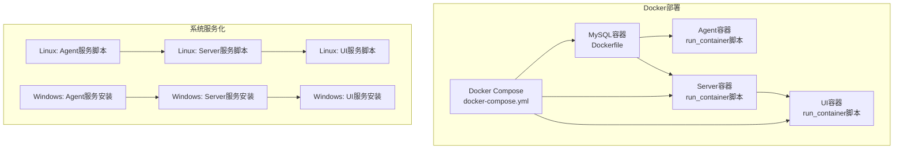
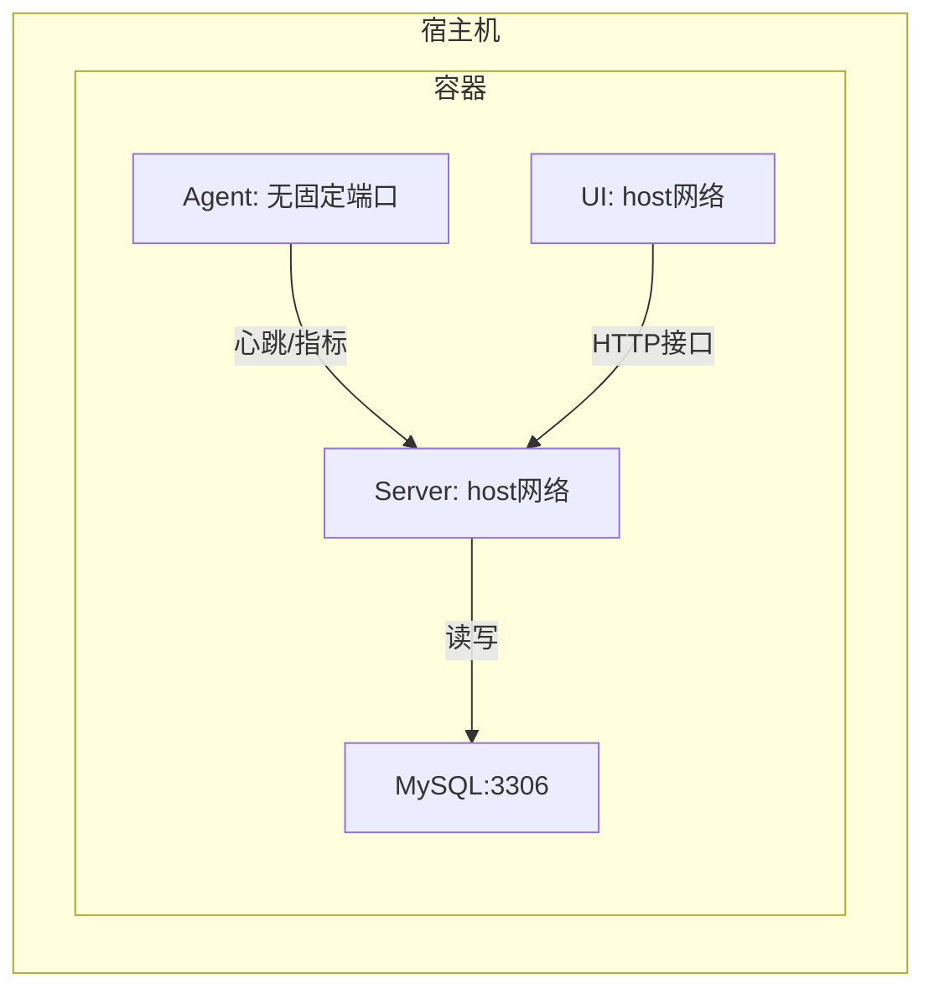
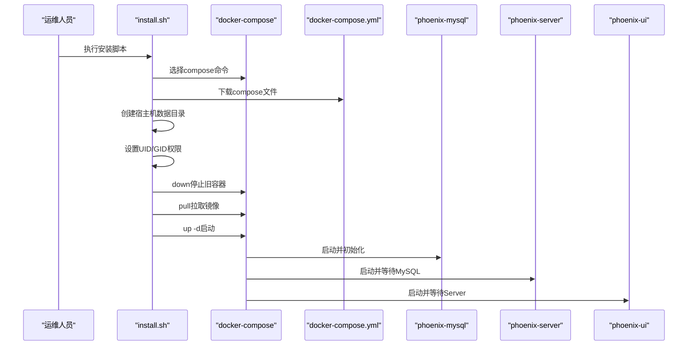
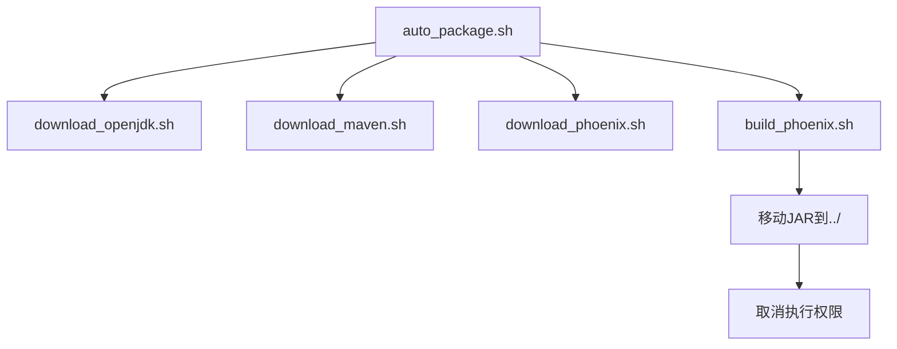
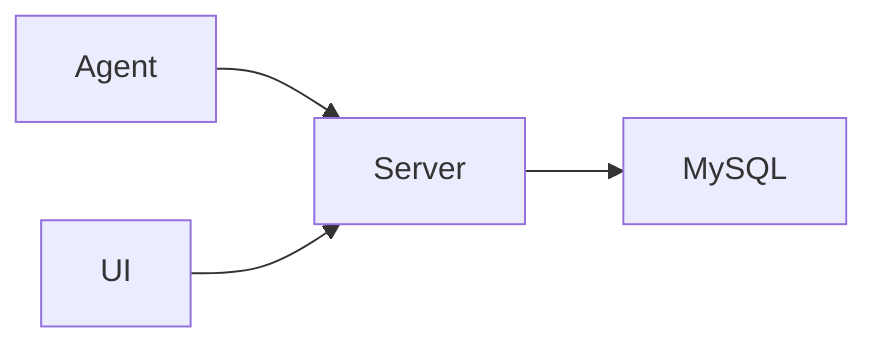

# 部署与运维

<cite>
**本文引用的文件**
- [doc/Docker/install.sh](file://doc/Docker/install.sh)
- [doc/Docker/mysql/Dockerfile](file://doc/Docker/mysql/Dockerfile)
- [doc/Docker/phoenix-agent/run_container.1.2.6.RELEASE-CR5.sh](file://doc/Docker/phoenix-agent/run_container.1.2.6.RELEASE-CR5.sh)
- [doc/Docker/phoenix-server/run_container.1.2.6.RELEASE-CR5.sh](file://doc/Docker/phoenix-server/run_container.1.2.6.RELEASE-CR5.sh)
- [doc/Docker/phoenix-ui/run_container.1.2.6.RELEASE-CR5.sh](file://doc/Docker/phoenix-ui/run_container.1.2.6.RELEASE-CR5.sh)
- [doc/DockerCompose/docker-compose.1.2.6.RELEASE-CR5.yml](file://doc/DockerCompose/docker-compose.1.2.6.RELEASE-CR5.yml)
- [doc/DockerCompose/install.sh](file://doc/DockerCompose/install.sh)
- [doc/LinuxServices/auto_package.sh](file://doc/LinuxServices/auto_package.sh)
- [doc/LinuxServices/build_phoenix.sh](file://doc/LinuxServices/build_phoenix.sh)
- [doc/LinuxServices/download_maven.sh](file://doc/LinuxServices/download_maven.sh)
- [doc/LinuxServices/download_openjdk.sh](file://doc/LinuxServices/download_openjdk.sh)
- [doc/LinuxServices/download_phoenix.sh](file://doc/LinuxServices/download_phoenix.sh)
- [doc/LinuxServices/logger.sh](file://doc/LinuxServices/logger.sh)
- [doc/LinuxServices/utils.sh](file://doc/LinuxServices/utils.sh)
- [doc/LinuxServices/phoenix-agent/phoenix_agent.sh](file://doc/LinuxServices/phoenix-agent/phoenix_agent.sh)
- [doc/LinuxServices/phoenix-server/phoenix_server.sh](file://doc/LinuxServices/phoenix-server/phoenix_server.sh)
- [doc/LinuxServices/phoenix-ui/phoenix_ui.sh](file://doc/LinuxServices/phoenix-ui/phoenix_ui.sh)
- [doc/WindowsServices/phoenix-agent/service_install.cmd](file://doc/WindowsServices/phoenix-agent/service_install.cmd)
- [doc/WindowsServices/phoenix-server/service_install.cmd](file://doc/WindowsServices/phoenix-server/service_install.cmd)
- [doc/WindowsServices/phoenix-ui/service_install.cmd](file://doc/WindowsServices/phoenix-ui/service_install.cmd)
- [phoenix-server/src/main/docker/Dockerfile](file://phoenix-server/src/main/docker/Dockerfile)
- [phoenix-ui/src/main/docker/Dockerfile](file://phoenix-ui/src/main/docker/Dockerfile)
- [phoenix-agent/src/main/docker/Dockerfile](file://phoenix-agent/src/main/docker/Dockerfile)
</cite>

## 目录
1. [简介](#简介)
2. [项目结构](#项目结构)
3. [核心组件](#核心组件)
4. [架构总览](#架构总览)
5. [详细组件分析](#详细组件分析)
6. [依赖分析](#依赖分析)
7. [性能考虑](#性能考虑)
8. [故障排除指南](#故障排除指南)
9. [结论](#结论)
10. [附录](#附录)

## 简介
本文件面向Phoenix监控系统的部署与运维，覆盖以下主题：
- Docker单容器部署与镜像构建、容器编排、网络与存储配置
- Linux系统服务化部署（JAR直启、日志、开机自启）
- Windows系统服务化部署（可执行封装与服务注册）
- Kubernetes容器编排部署策略（镜像、Deployment、Service、Ingress、ConfigMap、Secret）
- 性能优化建议（JVM、数据库连接池、缓存、网络）
- 健康检查与监控自身运行状态
- 故障排除与备份恢复、滚动升级最佳实践

## 项目结构
Phoenix由三大核心模块组成：Agent采集器、Server服务端、UI界面。配套提供Docker、Docker Compose、Linux/Windows服务化部署脚本与安装包。

图表来源
- [doc/Docker/mysql/Dockerfile:1-28](file://doc/Docker/mysql/Dockerfile#L1-L28)
- [doc/Docker/phoenix-agent/run_container.1.2.6.RELEASE-CR5.sh](file://doc/Docker/phoenix-agent/run_container.1.2.6.RELEASE-CR5.sh)
- [doc/Docker/phoenix-server/run_container.1.2.6.RELEASE-CR5.sh](file://doc/Docker/phoenix-server/run_container.1.2.6.RELEASE-CR5.sh)
- [doc/Docker/phoenix-ui/run_container.1.2.6.RELEASE-CR5.sh](file://doc/Docker/phoenix-ui/run_container.1.2.6.RELEASE-CR5.sh)
- [doc/DockerCompose/docker-compose.1.2.6.RELEASE-CR5.yml:1-68](file://doc/DockerCompose/docker-compose.1.2.6.RELEASE-CR5.yml#L1-L68)
- [doc/LinuxServices/phoenix-agent/phoenix_agent.sh:1-140](file://doc/LinuxServices/phoenix-agent/phoenix_agent.sh#L1-L140)
- [doc/LinuxServices/phoenix-server/phoenix_server.sh:1-140](file://doc/LinuxServices/phoenix-server/phoenix_server.sh#L1-L140)
- [doc/LinuxServices/phoenix-ui/phoenix_ui.sh:1-140](file://doc/LinuxServices/phoenix-ui/phoenix_ui.sh#L1-L140)
- [doc/WindowsServices/phoenix-agent/service_install.cmd:1-1](file://doc/WindowsServices/phoenix-agent/service_install.cmd#L1-L1)
- [doc/WindowsServices/phoenix-server/service_install.cmd:1-1](file://doc/WindowsServices/phoenix-server/service_install.cmd#L1-L1)
- [doc/WindowsServices/phoenix-ui/service_install.cmd:1-1](file://doc/WindowsServices/phoenix-ui/service_install.cmd#L1-L1)

章节来源
- [doc/Docker/install.sh:1-22](file://doc/Docker/install.sh#L1-L22)
- [doc/Docker/mysql/Dockerfile:1-28](file://doc/Docker/mysql/Dockerfile#L1-L28)
- [doc/Docker/phoenix-agent/run_container.1.2.6.RELEASE-CR5.sh](file://doc/Docker/phoenix-agent/run_container.1.2.6.RELEASE-CR5.sh)
- [doc/Docker/phoenix-server/run_container.1.2.6.RELEASE-CR5.sh](file://doc/Docker/phoenix-server/run_container.1.2.6.RELEASE-CR5.sh)
- [doc/Docker/phoenix-ui/run_container.1.2.6.RELEASE-CR5.sh](file://doc/Docker/phoenix-ui/run_container.1.2.6.RELEASE-CR5.sh)
- [doc/DockerCompose/docker-compose.1.2.6.RELEASE-CR5.yml:1-68](file://doc/DockerCompose/docker-compose.1.2.6.RELEASE-CR5.yml#L1-L68)
- [doc/DockerCompose/install.sh:1-99](file://doc/DockerCompose/install.sh#L1-L99)
- [doc/LinuxServices/phoenix-agent/phoenix_agent.sh:1-140](file://doc/LinuxServices/phoenix-agent/phoenix_agent.sh#L1-L140)
- [doc/LinuxServices/phoenix-server/phoenix_server.sh:1-140](file://doc/LinuxServices/phoenix-server/phoenix_server.sh#L1-L140)
- [doc/LinuxServices/phoenix-ui/phoenix_ui.sh:1-140](file://doc/LinuxServices/phoenix-ui/phoenix_ui.sh#L1-L140)
- [doc/WindowsServices/phoenix-agent/service_install.cmd:1-1](file://doc/WindowsServices/phoenix-agent/service_install.cmd#L1-L1)
- [doc/WindowsServices/phoenix-server/service_install.cmd:1-1](file://doc/WindowsServices/phoenix-server/service_install.cmd#L1-L1)
- [doc/WindowsServices/phoenix-ui/service_install.cmd:1-1](file://doc/WindowsServices/phoenix-ui/service_install.cmd#L1-L1)

## 核心组件
- Agent采集器：负责业务侧指标采集与心跳上报，支持HTTP、TCP、数据库、JVM等多维度监控。
- Server服务端：接收Agent上报数据，提供告警、存储、调度与对外接口。
- UI界面：提供可视化监控面板、告警记录、系统配置与用户管理。

章节来源
- [phoenix-agent/src/main/docker/Dockerfile](file://phoenix-agent/src/main/docker/Dockerfile)
- [phoenix-server/src/main/docker/Dockerfile](file://phoenix-server/src/main/docker/Dockerfile)
- [phoenix-ui/src/main/docker/Dockerfile](file://phoenix-ui/src/main/docker/Dockerfile)

## 架构总览
Phoenix采用“MySQL + Agent + Server + UI”的分层架构。Docker Compose通过host网络模式简化端口暴露；Agent与Server之间通过私有协议通信；UI通过Server提供的REST接口访问数据。

图表来源
- [doc/DockerCompose/docker-compose.1.2.6.RELEASE-CR5.yml:10-67](file://doc/DockerCompose/docker-compose.1.2.6.RELEASE-CR5.yml#L10-L67)

## 详细组件分析

### Docker单容器部署
- MySQL容器
  - 基于官方镜像，设置时区、初始化脚本挂载、健康检查、端口暴露与数据卷声明。
  - 建议生产环境使用外部持久化卷与只读配置卷。
- Agent/Server/UI容器
  - 提供run_container脚本用于快速拉起容器，便于演示与测试。
  - 生产建议结合Docker Compose或Kubernetes进行编排。

章节来源
- [doc/Docker/mysql/Dockerfile:1-28](file://doc/Docker/mysql/Dockerfile#L1-L28)
- [doc/Docker/phoenix-agent/run_container.1.2.6.RELEASE-CR5.sh](file://doc/Docker/phoenix-agent/run_container.1.2.6.RELEASE-CR5.sh)
- [doc/Docker/phoenix-server/run_container.1.2.6.RELEASE-CR5.sh](file://doc/Docker/phoenix-server/run_container.1.2.6.RELEASE-CR5.sh)
- [doc/Docker/phoenix-ui/run_container.1.2.6.RELEASE-CR5.sh](file://doc/Docker/phoenix-ui/run_container.1.2.6.RELEASE-CR5.sh)

### Docker Compose编排
- 服务关系
  - phoenix-mysql：提供数据库，限制内存资源，暴露3307:3306。
  - phoenix-server：使用host网络，挂载liblog与config卷，依赖mysql。
  - phoenix-ui：使用host网络，挂载liblog与config卷，依赖mysql与server。
- 存储与日志
  - 数据目录统一在宿主机/data/phoenix下，分别映射至各组件。
  - 日志驱动为json-file，单文件大小与轮转数限制。
- 网络
  - host网络模式减少NAT开销，便于直接绑定低端口与内网互通。

图表来源
- [doc/DockerCompose/install.sh:1-99](file://doc/DockerCompose/install.sh#L1-L99)
- [doc/DockerCompose/docker-compose.1.2.6.RELEASE-CR5.yml:1-68](file://doc/DockerCompose/docker-compose.1.2.6.RELEASE-CR5.yml#L1-L68)

章节来源
- [doc/DockerCompose/install.sh:1-99](file://doc/DockerCompose/install.sh#L1-L99)
- [doc/DockerCompose/docker-compose.1.2.6.RELEASE-CR5.yml:1-68](file://doc/DockerCompose/docker-compose.1.2.6.RELEASE-CR5.yml#L1-L68)

### Linux系统服务化部署
- 自动化打包流程
  - 下载JDK/Maven → 下载源码 → 构建项目 → 移动可执行JAR至目标目录。
- 服务脚本能力
  - 支持start/stop/restart/status，内置进程查询、优雅关闭与强制终止逻辑。
  - 通过nohup后台运行，避免终端断开会话导致进程退出。
- 运行参数
  - Server/UI在启动命令中设置了特定系统属性以优化数据库连接池行为。

图表来源
- [doc/LinuxServices/auto_package.sh:1-24](file://doc/LinuxServices/auto_package.sh#L1-L24)
- [doc/LinuxServices/build_phoenix.sh:1-48](file://doc/LinuxServices/build_phoenix.sh#L1-L48)

章节来源
- [doc/LinuxServices/auto_package.sh:1-24](file://doc/LinuxServices/auto_package.sh#L1-L24)
- [doc/LinuxServices/build_phoenix.sh:1-48](file://doc/LinuxServices/build_phoenix.sh#L1-L48)
- [doc/LinuxServices/download_maven.sh](file://doc/LinuxServices/download_maven.sh)
- [doc/LinuxServices/download_openjdk.sh](file://doc/LinuxServices/download_openjdk.sh)
- [doc/LinuxServices/download_phoenix.sh](file://doc/LinuxServices/download_phoenix.sh)
- [doc/LinuxServices/logger.sh](file://doc/LinuxServices/logger.sh)
- [doc/LinuxServices/utils.sh](file://doc/LinuxServices/utils.sh)
- [doc/LinuxServices/phoenix-agent/phoenix_agent.sh:1-140](file://doc/LinuxServices/phoenix-agent/phoenix_agent.sh#L1-L140)
- [doc/LinuxServices/phoenix-server/phoenix_server.sh:1-140](file://doc/LinuxServices/phoenix-server/phoenix_server.sh#L1-L140)
- [doc/LinuxServices/phoenix-ui/phoenix_ui.sh:1-140](file://doc/LinuxServices/phoenix-ui/phoenix_ui.sh#L1-L140)

### Windows系统服务化部署
- 服务安装
  - 通过service_install.cmd调用对应可执行文件完成服务注册。
- 启动与控制
  - 提供start/stop/status/uninstall等命令脚本，便于运维管理。

章节来源
- [doc/WindowsServices/phoenix-agent/service_install.cmd:1-1](file://doc/WindowsServices/phoenix-agent/service_install.cmd#L1-L1)
- [doc/WindowsServices/phoenix-server/service_install.cmd:1-1](file://doc/WindowsServices/phoenix-server/service_install.cmd#L1-L1)
- [doc/WindowsServices/phoenix-ui/service_install.cmd:1-1](file://doc/WindowsServices/phoenix-ui/service_install.cmd#L1-L1)

### Kubernetes部署策略（概念性说明）
- 镜像与标签
  - 使用Docker Compose中已有的镜像地址作为参考，确保版本一致。
- Deployment
  - 为每个组件创建Deployment，设置副本数、资源限制与就绪/存活探针。
- Service
  - 为Server与UI分别创建ClusterIP或LoadBalancer类型的Service，暴露REST接口。
- Ingress
  - 通过Ingress控制器暴露UI访问入口，配置证书与域名。
- ConfigMap/Secret
  - 将应用配置与敏感信息（如数据库密码）放入Secret，通过挂载或环境变量注入。
- 卷与持久化
  - 为MySQL与各组件的日志目录配置PersistentVolumeClaim。
- 滚动升级
  - 设置maxUnavailable与maxSurge，结合Readiness Probe保障零停机更新。

（本节为概念性说明，不直接分析具体文件）

## 依赖分析
- 组件耦合
  - UI依赖Server；Server依赖MySQL；Agent独立运行，向Server上报数据。
- 外部依赖
  - MySQL为唯一持久化依赖；Agent与Server通过网络通信。
- 编排耦合
  - Docker Compose通过depends_on保证启动顺序；host网络降低端口管理复杂度。

图表来源
- [doc/DockerCompose/docker-compose.1.2.6.RELEASE-CR5.yml:41-67](file://doc/DockerCompose/docker-compose.1.2.6.RELEASE-CR5.yml#L41-L67)

章节来源
- [doc/DockerCompose/docker-compose.1.2.6.RELEASE-CR5.yml:1-68](file://doc/DockerCompose/docker-compose.1.2.6.RELEASE-CR5.yml#L1-L68)

## 性能考虑
- JVM参数调优
  - 建议根据CPU与内存资源设置堆大小、GC策略与线程池大小，结合实际负载压测确定。
- 数据库连接池优化
  - Server/UI已设置特定系统属性以优化连接池行为，建议结合数据库规格与并发量调整连接池大小与超时参数。
- 缓存策略优化
  - 对热点查询结果进行本地缓存，降低数据库压力；注意缓存一致性与失效策略。
- 网络连接优化
  - Agent与Server间采用长连接与批量上报；UI与Server间合理设置超时与重试。
- 存储与日志
  - 控制日志文件大小与轮转数量，避免磁盘打满；对慢查询与异常日志建立告警。

（本节为通用指导，不直接分析具体文件）

## 故障排除指南
- Docker部署
  - 权限问题：宿主机目录归属UID/GID需与容器期望一致，否则需提升权限或调整脚本。
  - 端口冲突：host网络模式下需确保低端口可用，或修改映射端口。
  - 健康检查失败：检查MySQL初始化脚本与账号权限，确认健康检查命令可用。
- Linux服务化
  - 进程未启动：查看nohup输出与进程PID；确认JDK路径与JAR位置正确。
  - 优雅关闭无效：适当增加等待时间或检查进程阻塞点。
- Windows服务化
  - 服务安装失败：确认可执行文件存在且路径正确；以管理员身份运行安装脚本。
- 数据库问题
  - 连接超时：检查网络连通性、防火墙与数据库最大连接数。
  - 初始化失败：核对初始化SQL与字符集设置。

章节来源
- [doc/DockerCompose/install.sh:69-77](file://doc/DockerCompose/install.sh#L69-L77)
- [doc/Docker/mysql/Dockerfile:17-25](file://doc/Docker/mysql/Dockerfile#L17-L25)
- [doc/LinuxServices/phoenix-server/phoenix_server.sh:77-101](file://doc/LinuxServices/phoenix-server/phoenix_server.sh#L77-L101)
- [doc/LinuxServices/phoenix-ui/phoenix_ui.sh:77-101](file://doc/LinuxServices/phoenix-ui/phoenix_ui.sh#L77-L101)
- [doc/WindowsServices/phoenix-agent/service_install.cmd:1-1](file://doc/WindowsServices/phoenix-agent/service_install.cmd#L1-L1)
- [doc/WindowsServices/phoenix-server/service_install.cmd:1-1](file://doc/WindowsServices/phoenix-server/service_install.cmd#L1-L1)
- [doc/WindowsServices/phoenix-ui/service_install.cmd:1-1](file://doc/WindowsServices/phoenix-ui/service_install.cmd#L1-L1)

## 结论
Phoenix提供了从单容器到编排、从Linux到Windows的全栈部署方案。建议生产环境优先采用Docker Compose或Kubernetes进行编排，并结合资源限制、健康检查与日志轮转完善运维体系。通过合理的JVM与数据库参数、缓存与网络优化，可显著提升系统稳定性与性能。

## 附录

### Docker镜像构建要点
- 基于官方基础镜像，设置时区、健康检查与数据卷。
- 为Agent/Server/UI分别构建镜像，确保端口与卷挂载符合运行需求。

章节来源
- [doc/Docker/mysql/Dockerfile:1-28](file://doc/Docker/mysql/Dockerfile#L1-L28)
- [phoenix-agent/src/main/docker/Dockerfile](file://phoenix-agent/src/main/docker/Dockerfile)
- [phoenix-server/src/main/docker/Dockerfile](file://phoenix-server/src/main/docker/Dockerfile)
- [phoenix-ui/src/main/docker/Dockerfile](file://phoenix-ui/src/main/docker/Dockerfile)

### 运维最佳实践
- 备份策略
  - MySQL定期快照与逻辑备份；配置文件与日志目录纳入备份范围。
- 恢复演练
  - 定期进行离线恢复演练，验证备份完整性与恢复时效。
- 滚动升级
  - 采用分批升级策略，结合Readiness Probe与探针延迟，确保流量平稳迁移。

（本节为通用指导，不直接分析具体文件）