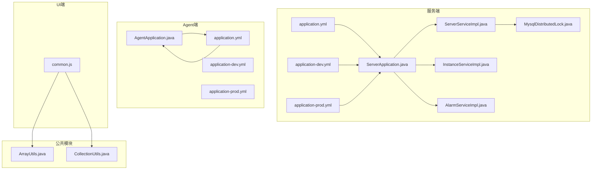
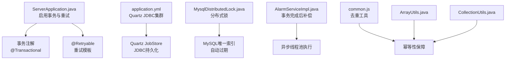
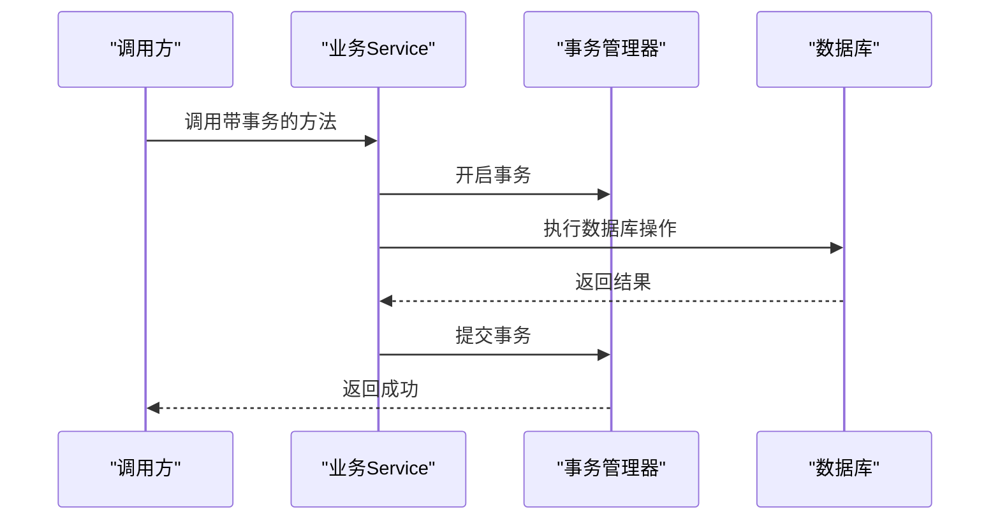
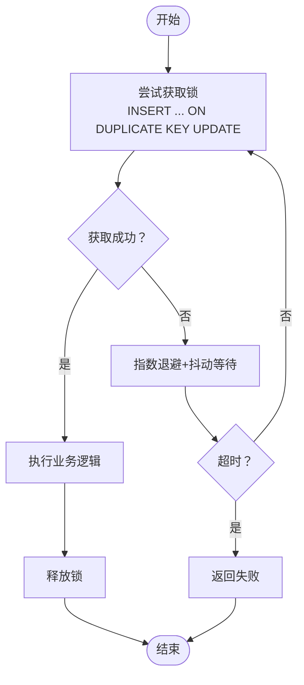
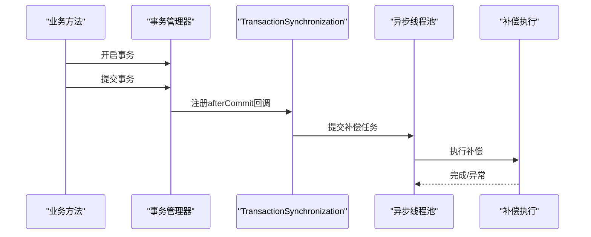
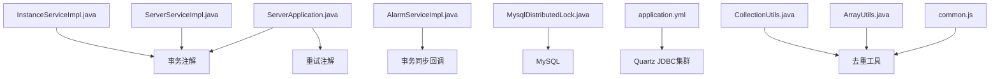

# 分布式事务配置

<cite>
**本文引用的文件**
- [application.yml](file://phoenix-server/src/main/resources/application.yml)
- [application-dev.yml](file://phoenix-server/src/main/resources/application-dev.yml)
- [application-prod.yml](file://phoenix-server/src/main/resources/application-prod.yml)
- [MysqlDistributedLock.java](file://phoenix-server/src/main/java/com/gitee/pifeng/monitoring/server/business/server/core/MysqlDistributedLock.java)
- [InstanceServiceImpl.java](file://phoenix-server/src/main/java/com/gitee/pifeng/monitoring/server/business/server/service/impl/InstanceServiceImpl.java)
- [ServerServiceImpl.java](file://phoenix-server/src/main/java/com/gitee/pifeng/monitoring/server/business/server/service/impl/ServerServiceImpl.java)
- [AlarmServiceImpl.java](file://phoenix-server/src/main/java/com/gitee/pifeng/monitoring/server/business/server/service/impl/AlarmServiceImpl.java)
- [ServerApplication.java](file://phoenix-server/src/main/java/com/gitee/pifeng/monitoring/server/ServerApplication.java)
- [application.yml](file://phoenix-agent/src/main/resources/application.yml)
- [application-dev.yml](file://phoenix-agent/src/main/resources/application-dev.yml)
- [application-prod.yml](file://phoenix-agent/src/main/resources/application-prod.yml)
- [common.js](file://phoenix-ui/src/main/resources/static/js/common.js)
- [ArrayUtils.java](file://phoenix-common/phoenix-common-core/src/main/java/com/gitee/pifeng/monitoring/common/util/ArrayUtils.java)
- [CollectionUtils.java](file://phoenix-common/phoenix-common-core/src/main/java/com/gitee/pifeng/monitoring/common/util/CollectionUtils.java)
</cite>

## 目录
1. [简介](#简介)
2. [项目结构](#项目结构)
3. [核心组件](#核心组件)
4. [架构总览](#架构总览)
5. [详细组件分析](#详细组件分析)
6. [依赖关系分析](#依赖关系分析)
7. [性能考量](#性能考量)
8. [故障排查指南](#故障排查指南)
9. [结论](#结论)
10. [附录](#附录)

## 简介
本文件面向Phoenix监控系统在分布式环境下的事务配置与实现，重点围绕以下主题展开：
- 分布式事务模式：两阶段提交、三阶段提交、TCC事务、Saga事务等模式的配置思路与落地要点
- 事务协调：事务管理器配置、参与者注册、事务状态管理等协调功能的配置参数
- 补偿机制：补偿操作定义、补偿策略选择、补偿执行监控等补偿机制的配置方法
- 幂等性保障：幂等性标识、重复检测、去重处理等幂等性保障功能的配置
- 监控与管理：事务状态跟踪、超时处理、异常恢复等监控管理功能的配置

说明：Phoenix监控系统在现有代码中并未直接实现标准的两阶段提交、三阶段提交、TCC或Saga事务框架。系统通过MySQL分布式锁、事务注解、重试机制、异步补偿与幂等工具等手段，组合实现分布式一致性与可靠性保障。本文将结合代码与配置，给出可落地的配置建议与最佳实践。

## 项目结构
Phoenix由服务端、Agent端、UI端与公共模块组成，分布式事务相关能力主要集中在服务端与公共工具模块：
- 服务端（phoenix-server）：包含事务注解、重试、分布式锁、告警补偿等核心逻辑
- Agent端（phoenix-agent）：负责采集与上报，具备重试能力
- UI端（phoenix-ui）：前端工具函数用于去重与集合处理
- 公共模块（phoenix-common）：提供数组与集合去重工具

**图表来源**
- [ServerApplication.java:14-29](file://phoenix-server/src/main/java/com/gitee/pifeng/monitoring/server/ServerApplication.java#L14-L29)
- [ServerServiceImpl.java:189-247](file://phoenix-server/src/main/java/com/gitee/pifeng/monitoring/server/business/server/service/impl/ServerServiceImpl.java#L189-L247)
- [InstanceServiceImpl.java:40-78](file://phoenix-server/src/main/java/com/gitee/pifeng/monitoring/server/business/server/service/impl/InstanceServiceImpl.java#L40-L78)
- [AlarmServiceImpl.java:160-170](file://phoenix-server/src/main/java/com/gitee/pifeng/monitoring/server/business/server/service/impl/AlarmServiceImpl.java#L160-L170)
- [MysqlDistributedLock.java:76-118](file://phoenix-server/src/main/java/com/gitee/pifeng/monitoring/server/business/server/core/MysqlDistributedLock.java#L76-L118)
- [application.yml:67-105](file://phoenix-server/src/main/resources/application.yml#L67-L105)
- [application-dev.yml:1-38](file://phoenix-server/src/main/resources/application-dev.yml#L1-L38)
- [application-prod.yml:1-38](file://phoenix-server/src/main/resources/application-prod.yml#L1-L38)
- [AgentApplication.java:10-24](file://phoenix-agent/src/main/java/com/gitee/pifeng/monitoring/agent/AgentApplication.java#L10-L24)
- [application.yml:1-111](file://phoenix-agent/src/main/resources/application.yml#L1-L111)
- [application-dev.yml:1-3](file://phoenix-agent/src/main/resources/application-dev.yml#L1-L3)
- [application-prod.yml:1-3](file://phoenix-agent/src/main/resources/application-prod.yml#L1-L3)
- [common.js:168-219](file://phoenix-ui/src/main/resources/static/js/common.js#L168-L219)
- [ArrayUtils.java:38-51](file://phoenix-common/phoenix-common-core/src/main/java/com/gitee/pifeng/monitoring/common/util/ArrayUtils.java#L38-L51)
- [CollectionUtils.java:45-48](file://phoenix-common/phoenix-common-core/src/main/java/com/gitee/pifeng/monitoring/common/util/CollectionUtils.java#L45-L48)

**章节来源**
- [application.yml:67-105](file://phoenix-server/src/main/resources/application.yml#L67-L105)
- [application-dev.yml:1-38](file://phoenix-server/src/main/resources/application-dev.yml#L1-L38)
- [application-prod.yml:1-38](file://phoenix-server/src/main/resources/application-prod.yml#L1-L38)
- [application.yml:1-111](file://phoenix-agent/src/main/resources/application.yml#L1-L111)
- [application-dev.yml:1-3](file://phoenix-agent/src/main/resources/application-dev.yml#L1-L3)
- [application-prod.yml:1-3](file://phoenix-agent/src/main/resources/application-prod.yml#L1-L3)

## 核心组件
- 事务注解与隔离：服务端广泛使用@Transactional与@Retryable，配合Spring声明式事务与重试模板，实现业务一致性与容错
- 分布式锁：基于MySQL唯一索引与自动过期的分布式锁，用于关键路径的互斥控制与去重
- 告警补偿：基于事务完成后同步回调的异步补偿执行，避免阻塞主流程
- 幂等工具：前端与公共模块提供去重工具，辅助实现幂等性保障

**章节来源**
- [InstanceServiceImpl.java:40-78](file://phoenix-server/src/main/java/com/gitee/pifeng/monitoring/server/business/server/service/impl/InstanceServiceImpl.java#L40-L78)
- [ServerServiceImpl.java:189-247](file://phoenix-server/src/main/java/com/gitee/pifeng/monitoring/server/business/server/service/impl/ServerServiceImpl.java#L189-L247)
- [AlarmServiceImpl.java:160-170](file://phoenix-server/src/main/java/com/gitee/pifeng/monitoring/server/business/server/service/impl/AlarmServiceImpl.java#L160-L170)
- [MysqlDistributedLock.java:76-118](file://phoenix-server/src/main/java/com/gitee/pifeng/monitoring/server/business/server/core/MysqlDistributedLock.java#L76-L118)
- [common.js:168-219](file://phoenix-ui/src/main/resources/static/js/common.js#L168-L219)
- [ArrayUtils.java:38-51](file://phoenix-common/phoenix-common-core/src/main/java/com/gitee/pifeng/monitoring/common/util/ArrayUtils.java#L38-L51)
- [CollectionUtils.java:45-48](file://phoenix-common/phoenix-common-core/src/main/java/com/gitee/pifeng/monitoring/common/util/CollectionUtils.java#L45-L48)

## 架构总览
Phoenix分布式事务相关能力的总体架构如下：
- 服务端通过@EnableTransactionManagement与@Transactional实现本地事务边界
- 通过Quartz JDBC集群配置实现跨节点的定时任务一致性
- 通过MySQL分布式锁实现跨实例的互斥与去重
- 通过@Retryable与线程池实现补偿与重试
- 前端与公共模块提供去重工具，辅助幂等性保障

**图表来源**
- [ServerApplication.java:14-29](file://phoenix-server/src/main/java/com/gitee/pifeng/monitoring/server/ServerApplication.java#L14-L29)
- [application.yml:67-105](file://phoenix-server/src/main/resources/application.yml#L67-L105)
- [MysqlDistributedLock.java:76-118](file://phoenix-server/src/main/java/com/gitee/pifeng/monitoring/server/business/server/core/MysqlDistributedLock.java#L76-L118)
- [AlarmServiceImpl.java:160-170](file://phoenix-server/src/main/java/com/gitee/pifeng/monitoring/server/business/server/service/impl/AlarmServiceImpl.java#L160-L170)
- [common.js:168-219](file://phoenix-ui/src/main/resources/static/js/common.js#L168-L219)
- [ArrayUtils.java:38-51](file://phoenix-common/phoenix-common-core/src/main/java/com/gitee/pifeng/monitoring/common/util/ArrayUtils.java#L38-L51)
- [CollectionUtils.java:45-48](file://phoenix-common/phoenix-common-core/src/main/java/com/gitee/pifeng/monitoring/common/util/CollectionUtils.java#L45-L48)

## 详细组件分析

### 事务协调与配置
- 事务管理器配置
  - 服务端通过@EnableTransactionManagement启用事务管理
  - 事务注解使用@Transactional标注关键业务方法，确保数据库操作的原子性
  - 重试机制通过@EnableRetry与@Retryable实现，结合线程池与异常分类，提升可靠性
- 参与者注册
  - 服务端各业务Service作为事务参与者，通过Spring容器管理与事务传播行为协作
- 事务状态管理
  - 通过Quartz JDBC集群配置，实现跨节点的作业状态一致性与分布式锁

**图表来源**
- [ServerApplication.java:14-29](file://phoenix-server/src/main/java/com/gitee/pifeng/monitoring/server/ServerApplication.java#L14-L29)
- [InstanceServiceImpl.java:40-78](file://phoenix-server/src/main/java/com/gitee/pifeng/monitoring/server/business/server/service/impl/InstanceServiceImpl.java#L40-L78)
- [ServerServiceImpl.java:189-247](file://phoenix-server/src/main/java/com/gitee/pifeng/monitoring/server/business/server/service/impl/ServerServiceImpl.java#L189-L247)

**章节来源**
- [ServerApplication.java:14-29](file://phoenix-server/src/main/java/com/gitee/pifeng/monitoring/server/ServerApplication.java#L14-L29)
- [application.yml:67-105](file://phoenix-server/src/main/resources/application.yml#L67-L105)
- [InstanceServiceImpl.java:40-78](file://phoenix-server/src/main/java/com/gitee/pifeng/monitoring/server/business/server/service/impl/InstanceServiceImpl.java#L40-L78)
- [ServerServiceImpl.java:189-247](file://phoenix-server/src/main/java/com/gitee/pifeng/monitoring/server/business/server/service/impl/ServerServiceImpl.java#L189-L247)

### 分布式锁与去重
- 分布式锁实现
  - 基于MySQL唯一索引与ON DUPLICATE KEY UPDATE抢占过期锁
  - 支持自动过期与后台定时清理，避免死锁与堆积
  - 采用指数退避+抖动的轮询策略，降低DB压力
- 去重策略
  - 前端common.js与公共模块ArrayUtils/CollectionUtils提供去重工具
  - 建议在业务关键路径（如告警去重、配置更新）使用分布式锁

**图表来源**
- [MysqlDistributedLock.java:76-118](file://phoenix-server/src/main/java/com/gitee/pifeng/monitoring/server/business/server/core/MysqlDistributedLock.java#L76-L118)
- [MysqlDistributedLock.java:206-225](file://phoenix-server/src/main/java/com/gitee/pifeng/monitoring/server/business/server/core/MysqlDistributedLock.java#L206-L225)
- [common.js:168-219](file://phoenix-ui/src/main/resources/static/js/common.js#L168-L219)
- [ArrayUtils.java:38-51](file://phoenix-common/phoenix-common-core/src/main/java/com/gitee/pifeng/monitoring/common/util/ArrayUtils.java#L38-L51)
- [CollectionUtils.java:45-48](file://phoenix-common/phoenix-common-core/src/main/java/com/gitee/pifeng/monitoring/common/util/CollectionUtils.java#L45-L48)

**章节来源**
- [MysqlDistributedLock.java:76-118](file://phoenix-server/src/main/java/com/gitee/pifeng/monitoring/server/business/server/core/MysqlDistributedLock.java#L76-L118)
- [MysqlDistributedLock.java:156-169](file://phoenix-server/src/main/java/com/gitee/pifeng/monitoring/server/business/server/core/MysqlDistributedLock.java#L156-L169)
- [common.js:168-219](file://phoenix-ui/src/main/resources/static/js/common.js#L168-L219)
- [ArrayUtils.java:38-51](file://phoenix-common/phoenix-common-core/src/main/java/com/gitee/pifeng/monitoring/common/util/ArrayUtils.java#L38-L51)
- [CollectionUtils.java:45-48](file://phoenix-common/phoenix-common-core/src/main/java/com/gitee/pifeng/monitoring/common/util/CollectionUtils.java#L45-L48)

### 补偿机制配置
- 补偿操作定义
  - 告警补偿在事务完成后通过afterCommit回调异步执行，避免阻塞主流程
- 补偿策略选择
  - 使用线程池异步执行，结合@Retryable实现重试
- 补偿执行监控
  - 告警记录入库后，异步执行补偿，异常记录日志

**图表来源**
- [AlarmServiceImpl.java:160-170](file://phoenix-server/src/main/java/com/gitee/pifeng/monitoring/server/business/server/service/impl/AlarmServiceImpl.java#L160-L170)

**章节来源**
- [AlarmServiceImpl.java:160-170](file://phoenix-server/src/main/java/com/gitee/pifeng/monitoring/server/business/server/service/impl/AlarmServiceImpl.java#L160-L170)

### 幂等性保障配置
- 幂等性标识
  - 建议在业务请求中携带幂等性标识（如请求ID），并在分布式锁或去重工具中使用
- 重复检测
  - 前端与公共模块提供去重工具，可用于页面数据与集合去重
- 去重处理
  - 在关键路径（如告警去重、配置更新）使用分布式锁与去重工具相结合

**章节来源**
- [common.js:168-219](file://phoenix-ui/src/main/resources/static/js/common.js#L168-L219)
- [ArrayUtils.java:38-51](file://phoenix-common/phoenix-common-core/src/main/java/com/gitee/pifeng/monitoring/common/util/ArrayUtils.java#L38-L51)
- [CollectionUtils.java:45-48](file://phoenix-common/phoenix-common-core/src/main/java/com/gitee/pifeng/monitoring/common/util/CollectionUtils.java#L45-L48)
- [MysqlDistributedLock.java:76-118](file://phoenix-server/src/main/java/com/gitee/pifeng/monitoring/server/business/server/core/MysqlDistributedLock.java#L76-L118)

### 监控与管理
- 事务状态跟踪
  - 通过Quartz JDBC集群配置，实现跨节点的作业状态一致性
- 超时处理
  - 服务端并行处理设置超时时间，超时则取消子任务并返回错误
- 异常恢复
  - 通过@Retryable与线程池实现补偿与重试，异常记录日志

**章节来源**
- [application.yml:67-105](file://phoenix-server/src/main/resources/application.yml#L67-L105)
- [ServerServiceImpl.java:230-247](file://phoenix-server/src/main/java/com/gitee/pifeng/monitoring/server/business/server/service/impl/ServerServiceImpl.java#L230-L247)

## 依赖关系分析
Phoenix分布式事务相关组件之间的依赖关系如下：
- ServerApplication启用事务与重试
- 业务Service依赖事务注解与重试
- 分布式锁依赖MySQL与Quartz
- 告警补偿依赖事务同步回调与线程池
- 前端与公共模块提供去重工具

**图表来源**
- [ServerApplication.java:14-29](file://phoenix-server/src/main/java/com/gitee/pifeng/monitoring/server/ServerApplication.java#L14-L29)
- [ServerServiceImpl.java:189-247](file://phoenix-server/src/main/java/com/gitee/pifeng/monitoring/server/business/server/service/impl/ServerServiceImpl.java#L189-L247)
- [InstanceServiceImpl.java:40-78](file://phoenix-server/src/main/java/com/gitee/pifeng/monitoring/server/business/server/service/impl/InstanceServiceImpl.java#L40-L78)
- [AlarmServiceImpl.java:160-170](file://phoenix-server/src/main/java/com/gitee/pifeng/monitoring/server/business/server/service/impl/AlarmServiceImpl.java#L160-L170)
- [MysqlDistributedLock.java:76-118](file://phoenix-server/src/main/java/com/gitee/pifeng/monitoring/server/business/server/core/MysqlDistributedLock.java#L76-L118)
- [application.yml:67-105](file://phoenix-server/src/main/resources/application.yml#L67-L105)
- [common.js:168-219](file://phoenix-ui/src/main/resources/static/js/common.js#L168-L219)
- [ArrayUtils.java:38-51](file://phoenix-common/phoenix-common-core/src/main/java/com/gitee/pifeng/monitoring/common/util/ArrayUtils.java#L38-L51)
- [CollectionUtils.java:45-48](file://phoenix-common/phoenix-common-core/src/main/java/com/gitee/pifeng/monitoring/common/util/CollectionUtils.java#L45-L48)

**章节来源**
- [ServerApplication.java:14-29](file://phoenix-server/src/main/java/com/gitee/pifeng/monitoring/server/ServerApplication.java#L14-L29)
- [application.yml:67-105](file://phoenix-server/src/main/resources/application.yml#L67-L105)
- [MysqlDistributedLock.java:76-118](file://phoenix-server/src/main/java/com/gitee/pifeng/monitoring/server/business/server/core/MysqlDistributedLock.java#L76-L118)
- [AlarmServiceImpl.java:160-170](file://phoenix-server/src/main/java/com/gitee/pifeng/monitoring/server/business/server/service/impl/AlarmServiceImpl.java#L160-L170)
- [common.js:168-219](file://phoenix-ui/src/main/resources/static/js/common.js#L168-L219)
- [ArrayUtils.java:38-51](file://phoenix-common/phoenix-common-core/src/main/java/com/gitee/pifeng/monitoring/common/util/ArrayUtils.java#L38-L51)
- [CollectionUtils.java:45-48](file://phoenix-common/phoenix-common-core/src/main/java/com/gitee/pifeng/monitoring/common/util/CollectionUtils.java#L45-L48)

## 性能考量
- 事务注解与重试：合理设置事务边界，避免过长事务；重试次数与退避策略需结合业务特性调整
- 分布式锁：锁粒度与过期时间需平衡一致性与性能；后台清理与概率清理降低DB压力
- 并行处理：服务端并行处理设置超时，避免长时间阻塞
- 前端去重：在数据量较大时，优先使用后端去重工具，减少前端负担

## 故障排查指南
- 事务异常
  - 检查事务注解与异常类型，确认是否抛出受检异常或特定异常导致回滚
- 分布式锁失败
  - 检查锁Key与Owner长度限制、唯一索引状态、过期时间设置与后台清理任务
- 补偿未执行
  - 检查事务完成后回调是否注册、线程池是否可用、异常日志
- 去重失效
  - 检查去重工具使用方式与数据结构，确保幂等性标识正确传递

**章节来源**
- [MysqlDistributedLock.java:184-225](file://phoenix-server/src/main/java/com/gitee/pifeng/monitoring/server/business/server/core/MysqlDistributedLock.java#L184-L225)
- [AlarmServiceImpl.java:183-192](file://phoenix-server/src/main/java/com/gitee/pifeng/monitoring/server/business/server/service/impl/AlarmServiceImpl.java#L183-L192)
- [ServerServiceImpl.java:230-247](file://phoenix-server/src/main/java/com/gitee/pifeng/monitoring/server/business/server/service/impl/ServerServiceImpl.java#L230-L247)

## 结论
Phoenix监控系统通过事务注解、重试机制、分布式锁、异步补偿与去重工具，构建了面向分布式场景的一致性与可靠性保障体系。虽然未直接引入两阶段提交、三阶段提交、TCC或Saga等标准事务框架，但通过上述组合拳，能够在大多数业务场景下满足一致性与可用性的需求。建议在关键路径严格使用分布式锁与幂等工具，在补偿与重试方面结合业务特性优化退避策略与超时配置。

## 附录
- 配置文件位置
  - 服务端：application.yml、application-dev.yml、application-prod.yml
  - Agent端：application.yml、application-dev.yml、application-prod.yml
- 关键类与方法
  - 分布式锁：MysqlDistributedLock.tryLock、releaseLock
  - 事务注解：InstanceServiceImpl.operateMonitorInstance、ServerServiceImpl.operateServer
  - 补偿执行：AlarmServiceImpl.asyncExecuteAlarm
  - 去重工具：common.js、ArrayUtils、CollectionUtils