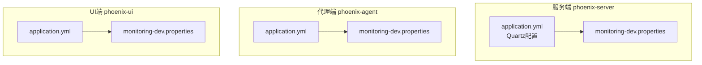
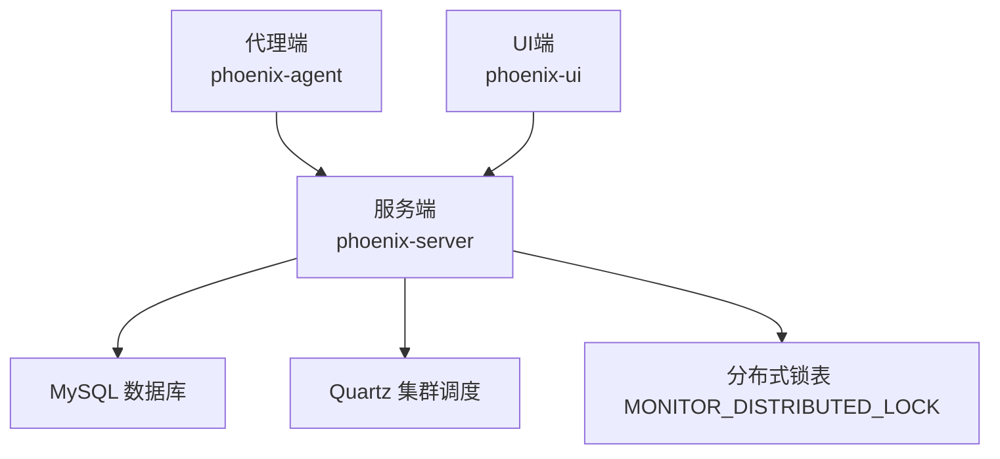
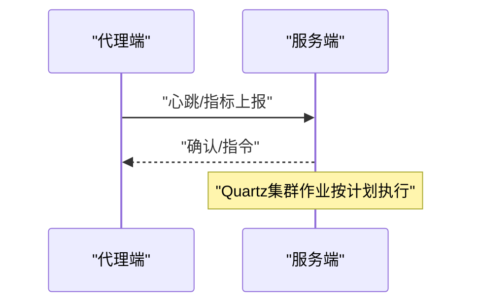
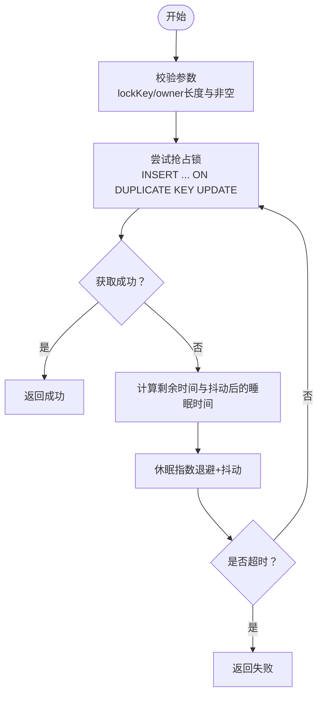
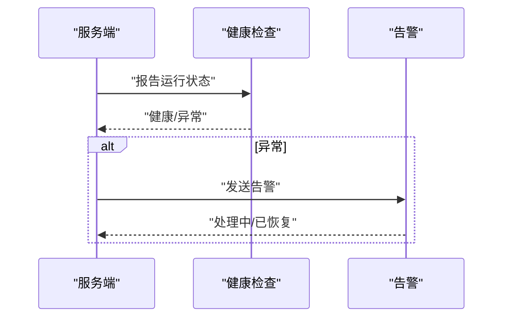
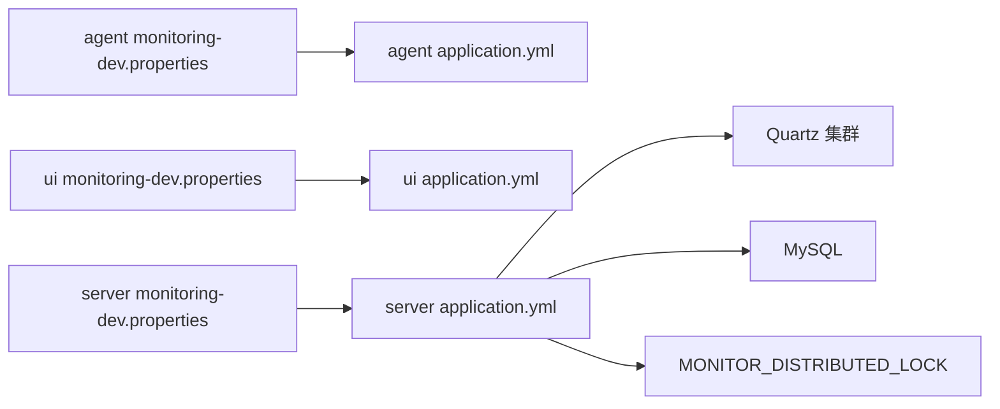

# 分布式配置

<cite>
**本文引用的文件**
- [application.yml](file://phoenix-server/src/main/resources/application.yml)
- [application-dev.yml](file://phoenix-server/src/main/resources/application-dev.yml)
- [application-prod.yml](file://phoenix-server/src/main/resources/application-prod.yml)
- [application.yml](file://phoenix-agent/src/main/resources/application.yml)
- [application.yml](file://phoenix-ui/src/main/resources/application.yml)
- [QuartzConfig.java](file://phoenix-server/src/main/java/com/gitee/pifeng/monitoring/server/config/QuartzConfig.java)
- [MysqlDistributedLock.java](file://phoenix-server/src/main/java/com/gitee/pifeng/monitoring/server/business/server/core/MysqlDistributedLock.java)
- [phoenix.sql](file://doc/数据库设计/sql/mysql/phoenix.sql)
- [monitoring-dev.properties](file://phoenix-agent/src/main/resources/monitoring-dev.properties)
- [monitoring-dev.properties](file://phoenix-server/src/main/resources/monitoring-dev.properties)
- [monitoring-dev.properties](file://phoenix-ui/src/main/resources/monitoring-dev.properties)
- [MonitoringAgentDevConfig.java](file://phoenix-agent/src/main/java/com/gitee/pifeng/monitoring/agent/config/MonitoringAgentDevConfig.java)
- [MonitoringUiDevConfig.java](file://phoenix-ui/src/main/java/com/gitee/pifeng/monitoring/ui/config/phoenix/MonitoringUiDevConfig.java)
- [ServerLoadAverageMonitor.java](file://phoenix-server/src/main/java/com/gitee/pifeng/monitoring/server/business/server/monitor/server/ServerLoadAverageMonitor.java)
</cite>

## 目录
1. [简介](#简介)
2. [项目结构](#项目结构)
3. [核心组件](#核心组件)
4. [架构总览](#架构总览)
5. [详细组件分析](#详细组件分析)
6. [依赖关系分析](#依赖关系分析)
7. [性能考量](#性能考量)
8. [故障排查指南](#故障排查指南)
9. [结论](#结论)
10. [附录](#附录)

## 简介
本文件面向Phoenix监控系统在分布式场景下的配置与运维，围绕以下目标展开：
- 集群配置：节点发现、成员管理、负载均衡相关参数与实践
- 分布式锁：MySQL实现原理、参数配置与使用建议
- 数据同步：一致性、复制策略与冲突解决思路
- 故障转移：主备切换、健康检查与自动恢复
- 分布式事务：协调、补偿与幂等性保障
- 分布式部署最佳实践：网络拓扑、性能调优与监控告警

## 项目结构
Phoenix由三端构成：服务端（Server）、代理端（Agent）、UI端（UI）。各端均采用Spring Boot，具备独立的配置文件与运行端口，便于水平扩展与隔离。

图表来源
- [application.yml:1-271](file://phoenix-server/src/main/resources/application.yml#L1-L271)
- [application.yml:1-111](file://phoenix-agent/src/main/resources/application.yml#L1-L111)
- [application.yml:1-238](file://phoenix-ui/src/main/resources/application.yml#L1-L238)
- [monitoring-dev.properties:1-41](file://phoenix-server/src/main/resources/monitoring-dev.properties#L1-L41)
- [monitoring-dev.properties:1-41](file://phoenix-agent/src/main/resources/monitoring-dev.properties#L1-L41)
- [monitoring-dev.properties:1-41](file://phoenix-ui/src/main/resources/monitoring-dev.properties#L1-L41)

章节来源
- [application.yml:1-271](file://phoenix-server/src/main/resources/application.yml#L1-L271)
- [application.yml:1-111](file://phoenix-agent/src/main/resources/application.yml#L1-L111)
- [application.yml:1-238](file://phoenix-ui/src/main/resources/application.yml#L1-L238)

## 核心组件
- 服务端配置与Quartz集群化：服务端通过Quartz JDBC持久化与集群开关，实现跨实例的作业调度一致性与高可用。
- 分布式锁：基于MySQL的MONITOR_DISTRIBUTED_LOCK表，提供“抢占式”加锁与自动过期清理。
- 通信与实例元信息：各端通过monitoring-dev.properties配置HTTP通信URL、实例名称、心跳频率等，统一接入服务端。
- 健康与负载：服务端包含负载监控与告警流程，支撑故障转移与自动恢复的前置条件。

章节来源
- [application.yml:67-104](file://phoenix-server/src/main/resources/application.yml#L67-L104)
- [QuartzConfig.java:1-399](file://phoenix-server/src/main/java/com/gitee/pifeng/monitoring/server/config/QuartzConfig.java#L1-L399)
- [MysqlDistributedLock.java:32-247](file://phoenix-server/src/main/java/com/gitee/pifeng/monitoring/server/business/server/core/MysqlDistributedLock.java#L32-L247)
- [monitoring-dev.properties:1-41](file://phoenix-server/src/main/resources/monitoring-dev.properties#L1-L41)
- [monitoring-dev.properties:1-41](file://phoenix-agent/src/main/resources/monitoring-dev.properties#L1-L41)
- [monitoring-dev.properties:1-41](file://phoenix-ui/src/main/resources/monitoring-dev.properties#L1-L41)

## 架构总览
Phoenix在分布式环境下以“服务端中心化 + 代理端/客户端采集 + UI可视化”的模式运行。服务端负责：
- 作业调度（Quartz集群）
- 分布式锁（MySQL）
- 数据存储与告警
- 健康与负载监控

图表来源
- [application.yml:116-184](file://phoenix-server/src/main/resources/application.yml#L116-L184)
- [application.yml:67-104](file://phoenix-server/src/main/resources/application.yml#L67-L104)
- [phoenix.sql:141-155](file://doc/数据库设计/sql/mysql/phoenix.sql#L141-L155)

## 详细组件分析

### 集群配置与节点管理
- Quartz集群化
  - 通过JDBC持久化与isClustered开启集群模式，clusterCheckinInterval设置节点心跳周期，threadPool线程数决定并发能力。
  - 服务端启动时自动初始化调度器，等待作业完成再优雅停机。
- 实例元信息与通信
  - 各端通过monitoring-dev.properties配置HTTP通信URL、实例名称、心跳频率等，确保跨实例的一致性与可观测性。
- 负载均衡
  - 服务端未内置LB组件，建议通过外部反向代理或容器编排实现多实例横向扩展与流量分发。

图表来源
- [application.yml:67-104](file://phoenix-server/src/main/resources/application.yml#L67-L104)
- [monitoring-dev.properties:10-11](file://phoenix-agent/src/main/resources/monitoring-dev.properties#L10-L11)

章节来源
- [application.yml:67-104](file://phoenix-server/src/main/resources/application.yml#L67-L104)
- [monitoring-dev.properties:10-29](file://phoenix-agent/src/main/resources/monitoring-dev.properties#L10-L29)
- [monitoring-dev.properties:10-29](file://phoenix-server/src/main/resources/monitoring-dev.properties#L10-L29)
- [monitoring-dev.properties:10-29](file://phoenix-ui/src/main/resources/monitoring-dev.properties#L10-L29)

### 分布式锁配置与使用
- 表结构与字段
  - 锁键（LOCK_KEY，VARCHAR(128)）、持有者（OWNER，VARCHAR(32)）、过期时间（EXPIRE_TIME，含毫秒精度）。
  - 主键LOCK_KEY，配合EXPIRE_TIME索引，支持清理过期锁。
- 加锁策略
  - 抢占式：INSERT ... ON DUPLICATE KEY UPDATE，若过期则替换持有者与过期时间；否则竞争失败。
  - 自动过期：通过EXPIRE_TIME字段与后台定时清理任务防止死锁。
- 重试与抖动
  - 采用指数退避+随机抖动，避免“对齐效应”，降低数据库压力。
- 释放锁
  - 仅持有者可释放，DELETE WHERE LOCK_KEY = ? AND OWNER = ?。
- 清理任务
  - 定时清理过期锁，限制单次清理数量，降低对数据库的瞬时冲击。

图表来源
- [MysqlDistributedLock.java:76-118](file://phoenix-server/src/main/java/com/gitee/pifeng/monitoring/server/business/server/core/MysqlDistributedLock.java#L76-L118)
- [MysqlDistributedLock.java:156-169](file://phoenix-server/src/main/java/com/gitee/pifeng/monitoring/server/business/server/core/MysqlDistributedLock.java#L156-L169)
- [phoenix.sql:141-155](file://doc/数据库设计/sql/mysql/phoenix.sql#L141-L155)

章节来源
- [MysqlDistributedLock.java:32-247](file://phoenix-server/src/main/java/com/gitee/pifeng/monitoring/server/business/server/core/MysqlDistributedLock.java#L32-L247)
- [phoenix.sql:141-155](file://doc/数据库设计/sql/mysql/phoenix.sql#L141-L155)

### 数据同步配置
- 一致性与复制策略
  - 服务端通过Quartz作业周期性执行各类监控任务，结合数据库JDBC持久化，确保跨实例作业状态一致。
  - 建议：对关键业务数据采用“先写数据库，再发布事件/触发作业”的双写策略，降低数据不同步风险。
- 冲突解决
  - 对于重复执行或竞态条件，依赖分布式锁与幂等设计（例如按时间窗口去重、唯一键约束）。
- 传输与序列化
  - 各端通过monitoring-dev.properties配置HTTP通信参数（超时、连接池等待等），确保跨实例通信稳定。

章节来源
- [application.yml:116-184](file://phoenix-server/src/main/resources/application.yml#L116-L184)
- [monitoring-dev.properties:10-17](file://phoenix-agent/src/main/resources/monitoring-dev.properties#L10-L17)
- [monitoring-dev.properties:10-17](file://phoenix-server/src/main/resources/monitoring-dev.properties#L10-L17)
- [monitoring-dev.properties:10-17](file://phoenix-ui/src/main/resources/monitoring-dev.properties#L10-L17)

### 故障转移与高可用
- 健康检查与端点
  - 服务端暴露health与shutdown端点，生产环境建议限制访问地址，仅本地可关闭。
- 负载与告警
  - 服务端提供服务器负载监控与告警流程，支持根据阈值触发告警与恢复通知。
- 自动恢复
  - 结合Quartz集群与分布式锁，可在主节点故障时由其他实例接管作业与锁资源。

图表来源
- [application.yml:219-234](file://phoenix-server/src/main/resources/application.yml#L219-L234)
- [ServerLoadAverageMonitor.java:99-237](file://phoenix-server/src/main/java/com/gitee/pifeng/monitoring/server/business/server/monitor/server/ServerLoadAverageMonitor.java#L99-L237)

章节来源
- [application.yml:219-234](file://phoenix-server/src/main/resources/application.yml#L219-L234)
- [ServerLoadAverageMonitor.java:99-237](file://phoenix-server/src/main/java/com/gitee/pifeng/monitoring/server/business/server/monitor/server/ServerLoadAverageMonitor.java#L99-L237)

### 分布式事务配置与管理
- 事务协调
  - 服务端通过Quartz集群化与数据库JDBC持久化，确保跨实例的作业执行一致性。
- 幂等性
  - 在业务层通过唯一键、幂等Token、时间窗口去重等方式保证重复执行的安全性。
- 补偿机制
  - 对于失败的作业，建议在Quartz中启用重试策略或引入补偿任务，结合监控告警及时修复。

章节来源
- [application.yml:67-104](file://phoenix-server/src/main/resources/application.yml#L67-L104)
- [QuartzConfig.java:1-399](file://phoenix-server/src/main/java/com/gitee/pifeng/monitoring/server/config/QuartzConfig.java#L1-L399)

### 分布式部署最佳实践
- 网络拓扑
  - 代理端与UI端通过HTTP通信指向服务端，建议在同一VPC内部署，降低网络延迟。
- 性能调优
  - 调整Quartz线程池大小与作业调度间隔，避免热点时段数据库压力过大。
  - 合理设置分布式锁的过期时间与清理周期，平衡安全与性能。
- 监控告警
  - 启用服务端健康端点与负载监控，结合邮件告警通道，实现故障自动发现与恢复。

章节来源
- [application.yml:219-234](file://phoenix-server/src/main/resources/application.yml#L219-L234)
- [monitoring-dev.properties:10-29](file://phoenix-agent/src/main/resources/monitoring-dev.properties#L10-L29)
- [monitoring-dev.properties:10-29](file://phoenix-ui/src/main/resources/monitoring-dev.properties#L10-L29)

## 依赖关系分析
- 服务端依赖MySQL作为数据与Quartz持久化存储，依赖Quartz实现集群化作业调度。
- 代理端与UI端通过HTTP与服务端交互，依赖monitoring-dev.properties进行实例与通信配置。
- 分布式锁依赖MONITOR_DISTRIBUTED_LOCK表，需与数据库连接池与事务策略配合使用。

图表来源
- [application.yml:116-184](file://phoenix-server/src/main/resources/application.yml#L116-L184)
- [application.yml:1-111](file://phoenix-agent/src/main/resources/application.yml#L1-L111)
- [application.yml:1-238](file://phoenix-ui/src/main/resources/application.yml#L1-L238)
- [monitoring-dev.properties:1-41](file://phoenix-agent/src/main/resources/monitoring-dev.properties#L1-L41)
- [monitoring-dev.properties:1-41](file://phoenix-ui/src/main/resources/monitoring-dev.properties#L1-L41)
- [monitoring-dev.properties:1-41](file://phoenix-server/src/main/resources/monitoring-dev.properties#L1-L41)
- [phoenix.sql:141-155](file://doc/数据库设计/sql/mysql/phoenix.sql#L141-L155)

章节来源
- [application.yml:116-184](file://phoenix-server/src/main/resources/application.yml#L116-L184)
- [phoenix.sql:141-155](file://doc/数据库设计/sql/mysql/phoenix.sql#L141-L155)

## 性能考量
- 数据库连接池与SQL优化
  - Druid连接池参数（初始大小、最大活跃、最大等待、PS缓存等）影响整体吞吐与延迟，建议根据QPS与峰值合理配置。
- Quartz线程与作业粒度
  - 线程池大小与作业执行间隔需与数据库承载能力匹配，避免抖动与阻塞。
- 分布式锁抖动与退避
  - 指数退避+抖动可显著降低数据库争用，但需关注锁持有者的超时设置与清理策略。

章节来源
- [application.yml:116-184](file://phoenix-server/src/main/resources/application.yml#L116-L184)
- [application.yml:67-104](file://phoenix-server/src/main/resources/application.yml#L67-L104)
- [MysqlDistributedLock.java:76-118](file://phoenix-server/src/main/java/com/gitee/pifeng/monitoring/server/business/server/core/MysqlDistributedLock.java#L76-L118)

## 故障排查指南
- 健康端点与日志
  - 通过management端点查看健康状态，结合日志级别定位问题。
- 分布式锁常见问题
  - 锁无法释放：确认持有者标识与过期时间；检查清理任务是否正常执行。
  - 死锁风险：缩短过期时间、增加清理频率、避免长事务。
- 通信异常
  - 检查monitoring-dev.properties中的HTTP URL与超时参数，确认网络连通性。

章节来源
- [application.yml:219-234](file://phoenix-server/src/main/resources/application.yml#L219-L234)
- [monitoring-dev.properties:10-17](file://phoenix-agent/src/main/resources/monitoring-dev.properties#L10-L17)
- [monitoring-dev.properties:10-17](file://phoenix-server/src/main/resources/monitoring-dev.properties#L10-L17)
- [monitoring-dev.properties:10-17](file://phoenix-ui/src/main/resources/monitoring-dev.properties#L10-L17)

## 结论
Phoenix在分布式场景下通过Quartz集群化、MySQL分布式锁与统一的实例配置，实现了跨实例的作业一致性、并发控制与可观测性。结合健康检查与负载监控，可进一步完善故障转移与自动恢复能力。建议在生产环境中严格控制锁过期与清理策略，优化数据库连接池与Quartz线程池，并通过告警体系实现闭环运维。

## 附录
- 开发环境配置加载
  - 代理端与UI端在开发环境通过配置类加载monitoring-dev.properties，确保实例与通信参数生效。

章节来源
- [MonitoringAgentDevConfig.java:18-37](file://phoenix-agent/src/main/java/com/gitee/pifeng/monitoring/agent/config/MonitoringAgentDevConfig.java#L18-L37)
- [MonitoringUiDevConfig.java:18-37](file://phoenix-ui/src/main/java/com/gitee/pifeng/monitoring/ui/config/phoenix/MonitoringUiDevConfig.java#L18-L37)