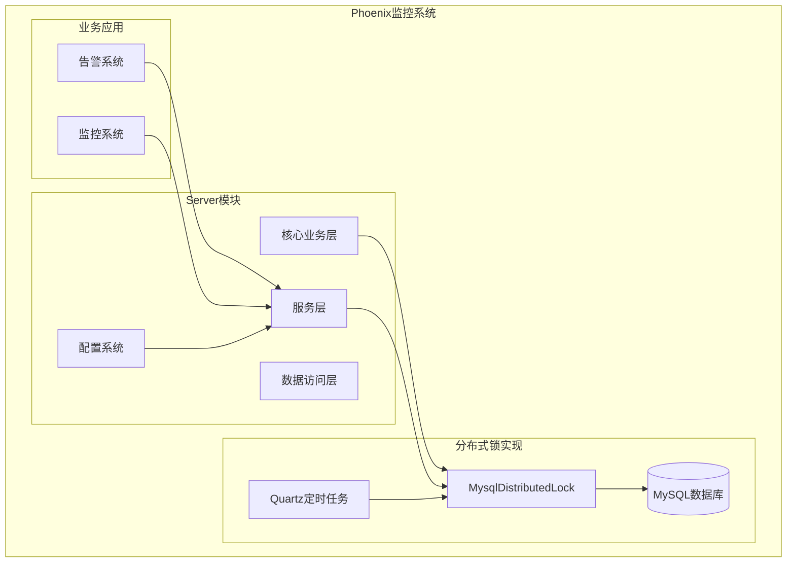
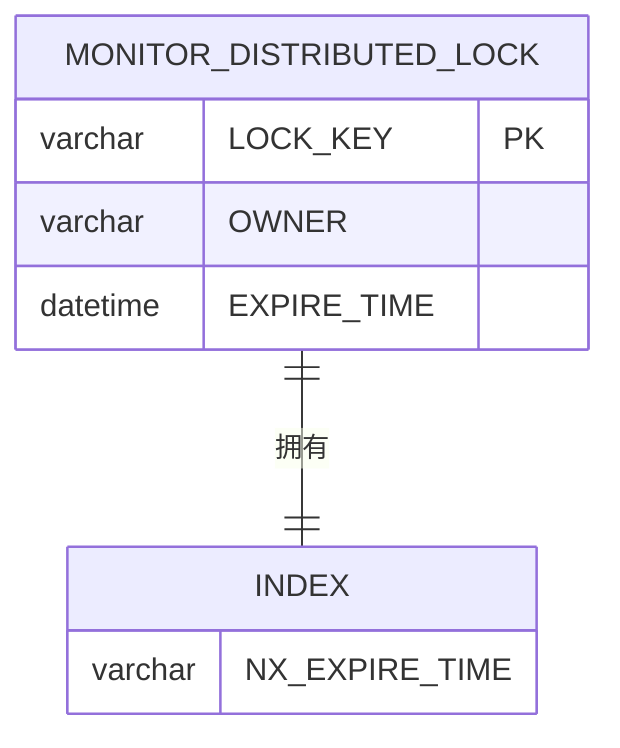
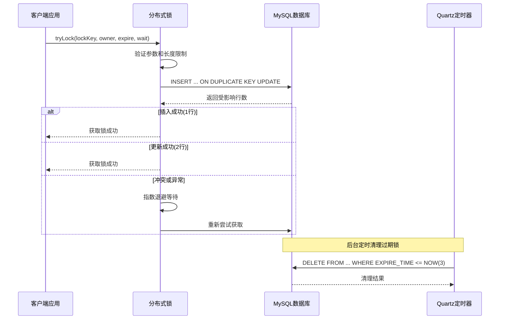
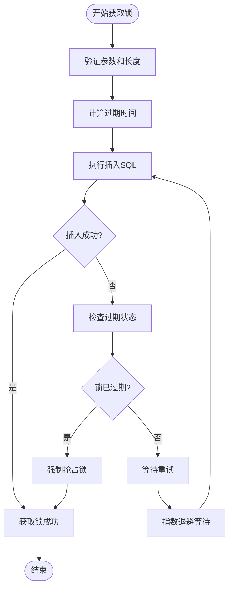
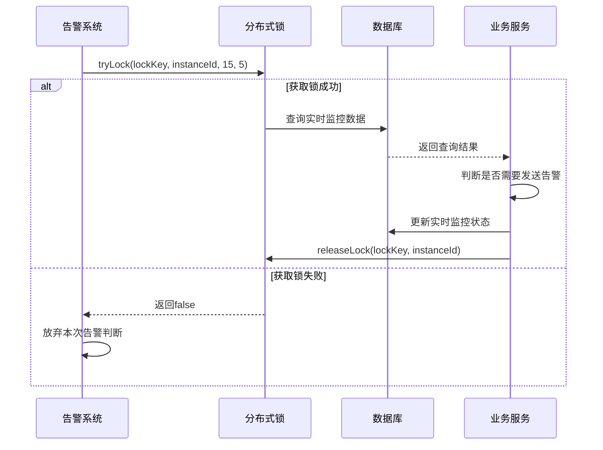
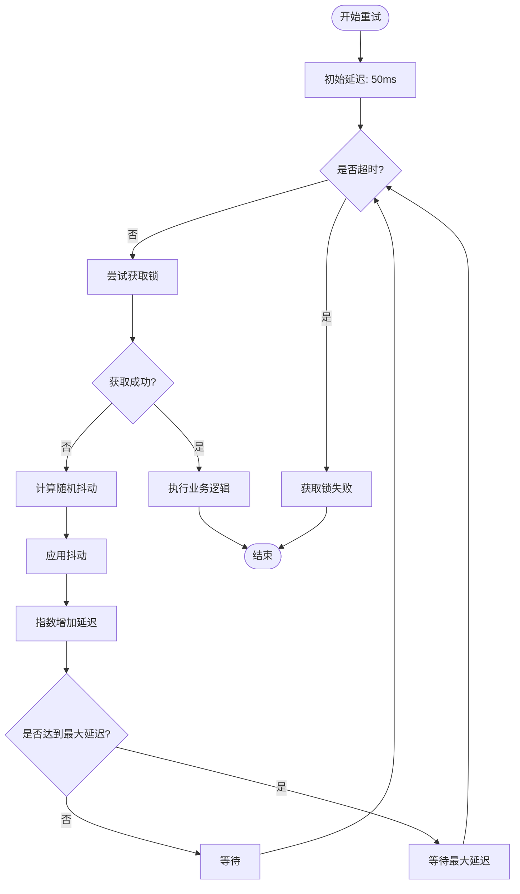
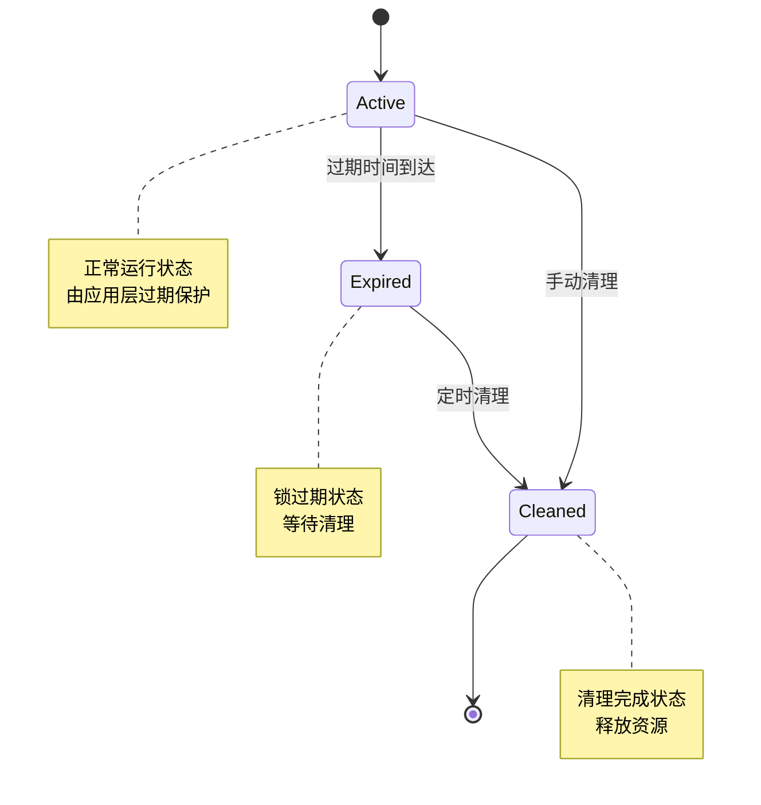
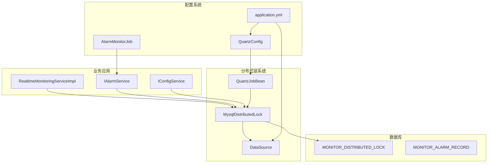

# 分布式锁配置

<cite>
**本文档引用的文件**
- [MysqlDistributedLock.java](file://phoenix-server/src/main/java/com/gitee/pifeng/monitoring/server/business/server/core/MysqlDistributedLock.java)
- [RealtimeMonitoringServiceImpl.java](file://phoenix-server/src/main/java/com/gitee/pifeng/monitoring/server/business/server/service/impl/RealtimeMonitoringServiceImpl.java)
- [phoenix.sql](file://doc/数据库设计/sql/mysql/phoenix.sql)
- [application.yml](file://phoenix-server/src/main/resources/application.yml)
- [QuartzConfig.java](file://phoenix-server/src/main/java/com/gitee/pifeng/monitoring/server/config/QuartzConfig.java)
- [AlarmMonitorJob.java](file://phoenix-server/src/main/java/com/gitee/pifeng/monitoring/server/business/server/monitor/AlarmMonitorJob.java)
</cite>

## 目录
1. [简介](#简介)
2. [项目结构](#项目结构)
3. [核心组件](#核心组件)
4. [架构概览](#架构概览)
5. [详细组件分析](#详细组件分析)
6. [依赖关系分析](#依赖关系分析)
7. [性能考虑](#性能考虑)
8. [故障处理指南](#故障处理指南)
9. [结论](#结论)
10. [附录](#附录)

## 简介

Phoenix监控系统的分布式锁配置实现了基于MySQL的可靠分布式锁机制。该实现采用独特的"抢占过期锁"策略，通过数据库唯一索引和自动过期机制确保锁的安全性和可靠性。

本分布式锁系统具有以下核心特性：
- 基于MySQL唯一索引的锁机制
- 自动过期和清理机制
- 指数退避算法和动态休眠
- 死锁防护和异常处理
- 性能优化的数据库压力控制

## 项目结构

Phoenix监控系统采用分层架构设计，分布式锁作为核心基础设施位于server模块的核心业务层：



**图表来源**
- [MysqlDistributedLock.java:33-36](file://phoenix-server/src/main/java/com/gitee/pifeng/monitoring/server/business/server/core/MysqlDistributedLock.java#L33-L36)
- [RealtimeMonitoringServiceImpl.java:13-14](file://phoenix-server/src/main/java/com/gitee/pifeng/monitoring/server/business/server/service/impl/RealtimeMonitoringServiceImpl.java#L13-L14)

**章节来源**
- [MysqlDistributedLock.java:20-32](file://phoenix-server/src/main/java/com/gitee/pifeng/monitoring/server/business/server/core/MysqlDistributedLock.java#L20-L32)
- [application.yml:67-105](file://phoenix-server/src/main/resources/application.yml#L67-L105)

## 核心组件

### 分布式锁核心实现

MysqlDistributedLock类是整个分布式锁系统的核心，提供了完整的锁获取、释放和清理功能：

#### 主要特性
- **唯一索引保护**：基于LOCK_KEY的唯一索引确保锁的互斥性
- **自动过期**：EXPIRE_TIME字段提供自动过期机制
- **毫秒精度**：支持DATETIME(3)的毫秒级时间精度
- **死锁防护**：通过过期时间和唯一索引避免死锁

#### 核心方法
- `tryLock()`：带自动过期的锁获取方法
- `releaseLock()`：锁释放方法
- `executeInternal()`：后台过期锁清理方法

**章节来源**
- [MysqlDistributedLock.java:33-61](file://phoenix-server/src/main/java/com/gitee/pifeng/monitoring/server/business/server/core/MysqlDistributedLock.java#L33-L61)

### 数据库表结构

分布式锁依赖专门的数据库表结构，确保数据的一致性和完整性：



**图表来源**
- [phoenix.sql:144-155](file://doc/数据库设计/sql/mysql/phoenix.sql#L144-L155)

**章节来源**
- [phoenix.sql:144-155](file://doc/数据库设计/sql/mysql/phoenix.sql#L144-L155)

## 架构概览

分布式锁系统采用"抢占过期锁"的独特设计模式，通过数据库层面的原子操作确保锁的安全性：



**图表来源**
- [MysqlDistributedLock.java:76-118](file://phoenix-server/src/main/java/com/gitee/pifeng/monitoring/server/business/server/core/MysqlDistributedLock.java#L76-L118)
- [MysqlDistributedLock.java:156-169](file://phoenix-server/src/main/java/com/gitee/pifeng/monitoring/server/business/server/core/MysqlDistributedLock.java#L156-L169)

## 详细组件分析

### 分布式锁实现原理

#### 基于唯一索引的锁机制

分布式锁的核心实现依赖于MySQL的唯一索引约束和ON DUPLICATE KEY UPDATE语法：



**图表来源**
- [MysqlDistributedLock.java:184-225](file://phoenix-server/src/main/java/com/gitee/pifeng/monitoring/server/business/server/core/MysqlDistributedLock.java#L184-L225)

#### 自动过期机制

系统实现了双重过期保护机制：

1. **应用层过期**：在获取锁时设置合理的过期时间
2. **数据库层过期**：通过后台定时任务清理过期锁

**章节来源**
- [MysqlDistributedLock.java:184-204](file://phoenix-server/src/main/java/com/gitee/pifeng/monitoring/server/business/server/core/MysqlDistributedLock.java#L184-L204)
- [MysqlDistributedLock.java:156-169](file://phoenix-server/src/main/java/com/gitee/pifeng/monitoring/server/business/server/core/MysqlDistributedLock.java#L156-L169)

### 配置参数详解

#### 锁名称配置

| 参数 | 默认值 | 最大长度 | 说明 |
|------|--------|----------|------|
| lockKey | 无 | 128字符 | 锁的唯一标识符，必须全局唯一 |
| owner | 无 | 32字符 | 锁持有者的标识，建议使用IP:PORT格式 |

#### 时间参数配置

| 参数 | 建议值 | 最小值 | 说明 |
|------|--------|--------|------|
| expireSeconds | 15秒 | 5秒 | 锁的自动过期时间 |
| waitSeconds | 5秒 | 1秒 | 获取锁的最大等待时间 |

#### 性能参数配置

| 参数 | 建议值 | 说明 |
|------|--------|------|
| delayNanos | 50ms | 初始等待时间 |
| maxDelayNanos | 500ms | 最大等待间隔 |
| jitter | ±50% | 随机抖动范围 |

**章节来源**
- [MysqlDistributedLock.java:38-50](file://phoenix-server/src/main/java/com/gitee/pifeng/monitoring/server/business/server/core/MysqlDistributedLock.java#L38-L50)
- [MysqlDistributedLock.java:76-87](file://phoenix-server/src/main/java/com/gitee/pifeng/monitoring/server/business/server/core/MysqlDistributedLock.java#L76-L87)

### 使用示例

#### 基本使用模式

```java
// 获取分布式锁
String lockKey = "alarm_judge:" + typeEnumName + ":" + alarmCode;
String instanceId = InstanceGenerator.getInstanceId();
boolean lockAcquired = mysqlDistributedLock.tryLock(lockKey, instanceId, 15, 5);

if (lockAcquired) {
    try {
        // 执行业务逻辑
        performCriticalOperation();
    } finally {
        // 释放锁
        mysqlDistributedLock.releaseLock(lockKey, instanceId);
    }
} else {
    // 处理获取锁失败
    log.warn("获取分布式锁超时");
}
```

#### 在告警系统中的应用

在RealtimeMonitoringServiceImpl中，分布式锁用于防止重复发送相同告警：



**图表来源**
- [RealtimeMonitoringServiceImpl.java:76-159](file://phoenix-server/src/main/java/com/gitee/pifeng/monitoring/server/business/server/service/impl/RealtimeMonitoringServiceImpl.java#L76-L159)

**章节来源**
- [RealtimeMonitoringServiceImpl.java:76-159](file://phoenix-server/src/main/java/com/gitee/pifeng/monitoring/server/business/server/service/impl/RealtimeMonitoringServiceImpl.java#L76-L159)

### 性能优化配置

#### 指数退避算法

系统实现了智能的指数退避机制，有效平衡了响应速度和数据库压力：



**图表来源**
- [MysqlDistributedLock.java:76-118](file://phoenix-server/src/main/java/com/gitee/pifeng/monitoring/server/business/server/core/MysqlDistributedLock.java#L76-L118)

#### 动态休眠机制

系统采用了动态休眠策略，避免多个线程同时唤醒造成数据库压力：

- **初期快速重试**：锁刚释放时快速重试，提高响应速度
- **后期降低频率**：随着等待时间增加，指数增加休眠时间
- **随机抖动**：±50%的随机抖动，避免"对齐效应"

#### 数据库压力控制

通过以下机制控制数据库压力：

1. **概率清理**：约20%的请求触发过期锁清理
2. **批量清理**：每次清理限制1000条记录
3. **毫秒级时间精度**：精确的时间控制避免过早清理

**章节来源**
- [MysqlDistributedLock.java:76-118](file://phoenix-server/src/main/java/com/gitee/pifeng/monitoring/server/business/server/core/MysqlDistributedLock.java#L76-L118)
- [MysqlDistributedLock.java:156-169](file://phoenix-server/src/main/java/com/gitee/pifeng/monitoring/server/business/server/core/MysqlDistributedLock.java#L156-L169)

### 故障处理机制

#### 过期清理策略

系统实现了多层次的过期清理机制：



**图表来源**
- [MysqlDistributedLock.java:156-169](file://phoenix-server/src/main/java/com/gitee/pifeng/monitoring/server/business/server/core/MysqlDistributedLock.java#L156-L169)

#### 异常处理策略

系统采用渐进式的异常处理策略：

1. **参数验证异常**：立即抛出IllegalArgumentException
2. **数据库异常**：记录日志但不中断业务流程
3. **线程中断**：正确处理InterruptedException并返回false

#### 重试机制

系统实现了智能的重试机制：

- **指数退避**：50ms → 100ms → 200ms → 400ms → 500ms
- **最大重试时间**：受waitSeconds参数限制
- **随机抖动**：避免多个线程同时重试

**章节来源**
- [MysqlDistributedLock.java:184-225](file://phoenix-server/src/main/java/com/gitee/pifeng/monitoring/server/business/server/core/MysqlDistributedLock.java#L184-L225)

## 依赖关系分析

### 组件依赖关系



**图表来源**
- [MysqlDistributedLock.java:60-61](file://phoenix-server/src/main/java/com/gitee/pifeng/monitoring/server/business/server/core/MysqlDistributedLock.java#L60-L61)
- [RealtimeMonitoringServiceImpl.java:42-43](file://phoenix-server/src/main/java/com/gitee/pifeng/monitoring/server/business/server/service/impl/RealtimeMonitoringServiceImpl.java#L42-L43)

### 配置依赖

分布式锁系统依赖于Spring Boot的自动配置和Quartz定时任务配置：

**章节来源**
- [application.yml:67-105](file://phoenix-server/src/main/resources/application.yml#L67-L105)
- [QuartzConfig.java:25-399](file://phoenix-server/src/main/java/com/gitee/pifeng/monitoring/server/config/QuartzConfig.java#L25-L399)

## 性能考虑

### 数据库性能优化

#### 索引设计
- **主键索引**：LOCK_KEY的唯一索引确保锁的互斥性
- **过期时间索引**：EXPIRE_TIME的索引支持高效的过期清理

#### SQL优化
- **原子操作**：使用INSERT ... ON DUPLICATE KEY UPDATE实现原子性
- **批量清理**：LIMIT 1000限制单次清理数量
- **毫秒精度**：DATETIME(3)提供精确的时间控制

### 内存和CPU优化

#### 连接管理
- **独立连接**：每次操作使用独立的数据库连接
- **自动提交**：确保操作的原子性
- **连接池**：利用Spring的DataSource连接池

#### 内存使用
- **参数验证**：在进入数据库操作前进行参数验证
- **异常处理**：避免异常情况下的内存泄漏

### 并发性能

#### 竞争处理
- **指数退避**：有效减少数据库竞争
- **随机抖动**：避免多个线程同时竞争
- **超时控制**：防止无限等待

#### 资源管理
- **连接复用**：连接池中的连接复用
- **异常恢复**：自动处理数据库连接异常

## 故障处理指南

### 常见问题诊断

#### 锁获取失败
**症状**：tryLock方法返回false
**可能原因**：
1. 锁已被其他实例持有
2. 参数验证失败（长度超限）
3. 数据库连接异常
4. 等待时间不足

**解决方案**：
1. 检查lockKey和owner参数长度
2. 增加waitSeconds参数值
3. 查看数据库连接状态
4. 检查系统日志

#### 锁释放失败
**症状**：releaseLock方法返回false
**可能原因**：
1. 锁已被自动清理
2. owner参数不匹配
3. 数据库操作异常

**解决方案**：
1. 确认锁的生命周期
2. 检查owner参数的正确性
3. 查看数据库异常日志

#### 过期锁清理问题
**症状**：系统中存在大量过期锁
**可能原因**：
1. 定时任务未正常执行
2. 数据库清理操作失败
3. 系统负载过高

**解决方案**：
1. 检查Quartz定时任务配置
2. 验证数据库权限设置
3. 监控系统资源使用情况

### 监控和日志

#### 关键日志信息
- **获取锁成功**：记录lockKey和owner信息
- **获取锁失败**：记录失败原因和参数
- **释放锁**：记录释放结果
- **过期清理**：记录清理数量和时间

#### 性能监控指标
- **锁获取成功率**
- **平均等待时间**
- **数据库连接使用率**
- **过期锁清理效率**

**章节来源**
- [MysqlDistributedLock.java:131-144](file://phoenix-server/src/main/java/com/gitee/pifeng/monitoring/server/business/server/core/MysqlDistributedLock.java#L131-L144)
- [MysqlDistributedLock.java:156-169](file://phoenix-server/src/main/java/com/gitee/pifeng/monitoring/server/business/server/core/MysqlDistributedLock.java#L156-L169)

## 结论

Phoenix监控系统的分布式锁配置实现了高可靠性的分布式锁机制。通过基于MySQL唯一索引的"抢占过期锁"设计，系统在保证锁安全性的同时，提供了良好的性能表现和故障恢复能力。

### 主要优势

1. **高可靠性**：基于数据库唯一索引的原子操作
2. **自动恢复**：完善的过期清理和异常处理机制
3. **性能优化**：指数退避和动态休眠算法
4. **易于使用**：简单的API接口和配置方式

### 适用场景

- **低频关键路径操作**：如告警去重、配置更新
- **跨进程互斥**：需要在不同实例间协调的操作
- **资源保护**：需要防止并发访问的共享资源

### 最佳实践

1. **合理设置过期时间**：确保业务逻辑在过期前完成
2. **监控锁使用情况**：定期检查锁获取成功率和等待时间
3. **优化参数配置**：根据实际负载调整重试参数
4. **异常处理**：在finally块中确保锁的释放

## 附录

### 配置参考

#### 基础配置
```yaml
# 数据源配置
spring:
  datasource:
    type: com.alibaba.druid.pool.DruidDataSource
    druid:
      max-active: 500
      max-wait: 60000

# Quartz配置
spring:
  quartz:
    job-store-type: jdbc
    wait-for-jobs-to-complete-on-shutdown: true
```

#### 分布式锁参数建议

| 场景 | expireSeconds | waitSeconds | 说明 |
|------|---------------|-------------|------|
| 告警去重 | 15 | 5 | 低频操作，响应优先 |
| 配置更新 | 30 | 10 | 中等频率，稳定性优先 |
| 数据同步 | 60 | 20 | 高频操作，稳定性优先 |

### 故障排查清单

- [ ] 检查数据库连接状态
- [ ] 验证锁参数长度限制
- [ ] 确认Quartz定时任务正常运行
- [ ] 监控数据库性能指标
- [ ] 检查系统日志中的异常信息