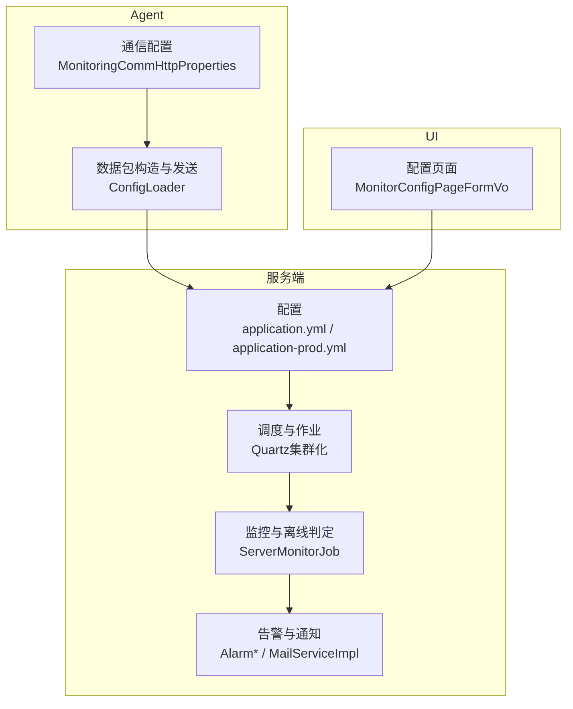
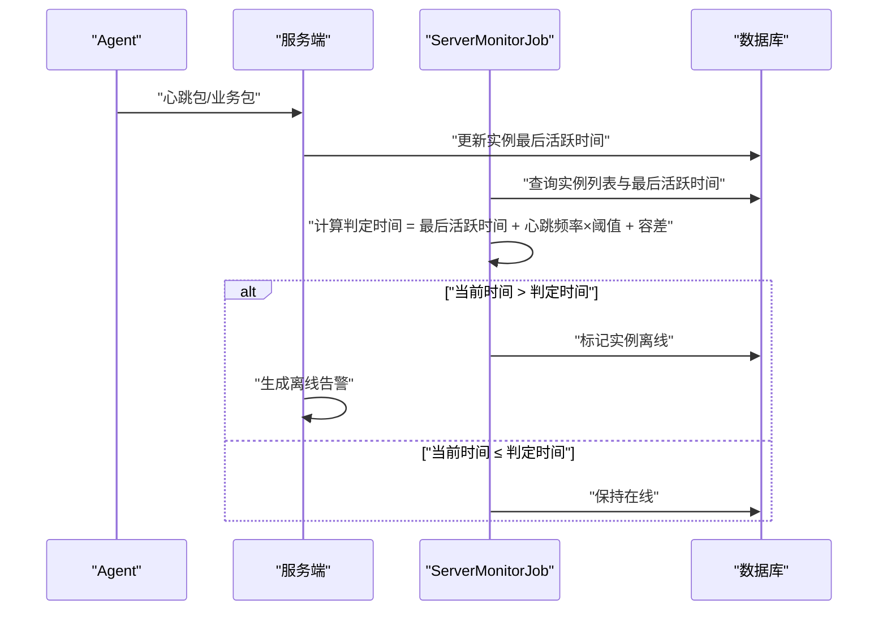
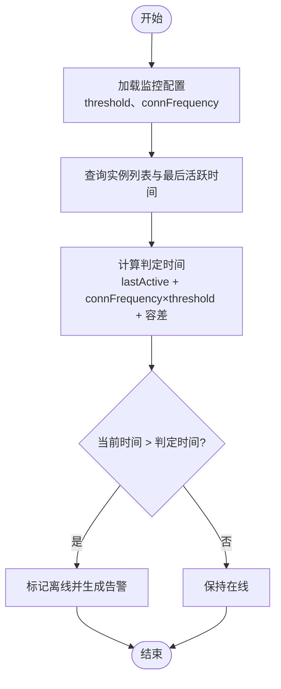
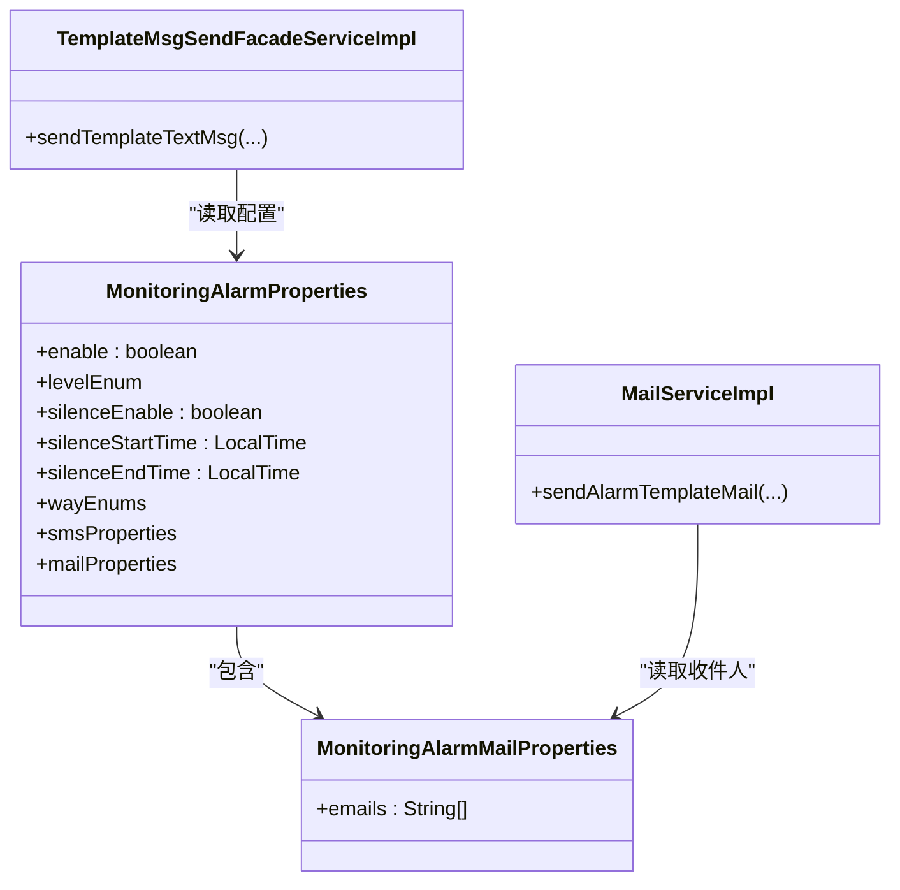
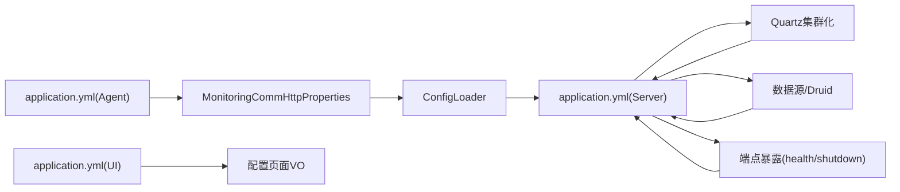

# 故障转移配置

<cite>
**本文引用的文件**
- [application.yml](file://phoenix-server/src/main/resources/application.yml)
- [application-prod.yml](file://phoenix-server/src/main/resources/application-prod.yml)
- [application.yml](file://phoenix-agent/src/main/resources/application.yml)
- [application.yml](file://phoenix-ui/src/main/resources/application.yml)
- [MonitoringProperties.java](file://phoenix-common/Phoenix-common-core/src/main/java/com/gitee/pifeng/monitoring/common/property/server/MonitoringProperties.java)
- [MonitoringServerProperties.java](file://phoenix-common/Phoenix-common-core/src/main/java/com/gitee/pifeng/monitoring/common/property/server/MonitoringServerProperties.java)
- [MonitoringServerStatusProperties.java](file://phoenix-common/Phoenix-common-core/src/main/java/com/gitee/pifeng/monitoring/common/property/server/MonitoringServerStatusProperties.java)
- [MonitoringAlarmProperties.java](file://phoenix-common/Phoenix-common-core/src/main/java/com/gitee/pifeng/monitoring/common/property/server/MonitoringAlarmProperties.java)
- [MonitoringAlarmMailProperties.java](file://phoenix-common/Phoenix-common-core/src/main/java/com/gitee/pifeng/monitoring/common/property/server/MonitoringAlarmMailProperties.java)
- [MonitoringCommHttpProperties.java](file://phoenix-common/Phoenix-common-core/src/main/java/com/gitee/pifeng/monitoring/common/property/client/MonitoringCommHttpProperties.java)
- [ConfigLoader.java](file://phoenix-client/phoenix-client-core/src/main/java/com/gitee/pifeng/monitoring/plug/core/ConfigLoader.java)
- [MonitoringConfigPropertiesLoader.java](file://phoenix-server/src/main/java/com/gitee/pifeng/monitoring/server/business/server/core/MonitoringConfigPropertiesLoader.java)
- [ServerMonitorJob.java](file://phoenix-server/src/main/java/com/gitee/pifeng/monitoring/server/business/server/monitor/server/ServerMonitorJob.java)
- [MailServiceImpl.java](file://phoenix-server/src/main/java/com/gitee/pifeng/monitoring/server/business/server/service/impl/MailServiceImpl.java)
- [AlarmRecordDetailServiceImpl.java](file://phoenix-server/src/main/java/com/gitee/pifeng/monitoring/server/business/server/service/impl/AlarmRecordDetailServiceImpl.java)
- [TemplateMsgSendFacadeServiceImpl.java](file://phoenix-server/src/main/java/com/gitee/pifeng/monitoring/server/business/server/service/impl/TemplateMsgSendFacadeServiceImpl.java)
- [AlarmServiceImpl.java](file://phoenix-server/src/main/java/com/gitee/pifeng/monitoring/server/business/server/service/impl/AlarmServiceImpl.java)
- [phoenix.sql](file://doc/数据库设计/sql/mysql/phoenix.sql)
</cite>

## 目录
1. [简介](#简介)
2. [项目结构](#项目结构)
3. [核心组件](#核心组件)
4. [架构总览](#架构总览)
5. [详细组件分析](#详细组件分析)
6. [依赖分析](#依赖分析)
7. [性能考量](#性能考量)
8. [故障排查指南](#故障排查指南)
9. [结论](#结论)
10. [附录](#附录)

## 简介
本文件面向Phoenix监控系统的故障转移配置，围绕“主备切换”“健康检查”“自动恢复”“高可用部署”“监控与告警”五个维度，结合代码与配置，给出可落地的配置说明与最佳实践。重点涵盖：
- 主节点选举与备节点监控：基于心跳与阈值判定的离线/恢复流程
- 健康检查策略：检查间隔、失败阈值、恢复判断
- 自动恢复：故障检测、自动重启、数据恢复、服务恢复
- 高可用：多活部署、负载分担、流量切换
- 监控与告警：切换事件记录、故障日志、告警通知

## 项目结构
Phoenix由三部分组成：服务端（Server）、Agent（探针）、UI（前端）。服务端负责采集、存储、告警与调度；Agent负责采集目标实例指标并上报；UI负责可视化与配置管理。

图表来源
- [application.yml:67-104](file://phoenix-server/src/main/resources/application.yml#L67-L104)
- [application-prod.yml:11-14](file://phoenix-server/src/main/resources/application-prod.yml#L11-L14)
- [MonitoringCommHttpProperties.java:20-42](file://phoenix-common/Phoenix-common-core/src/main/java/com/gitee/pifeng/monitoring/common/property/client/MonitoringCommHttpProperties.java#L20-L42)
- [ConfigLoader.java:388-402](file://phoenix-client/phoenix-client-core/src/main/java/com/gitee/pifeng/monitoring/plug/core/ConfigLoader.java#L388-L402)
- [ServerMonitorJob.java:130-150](file://phoenix-server/src/main/java/com/gitee/pifeng/monitoring/server/business/server/monitor/server/ServerMonitorJob.java#L130-L150)
- [MailServiceImpl.java:76-88](file://phoenix-server/src/main/java/com/gitee/pifeng/monitoring/server/business/server/service/impl/MailServiceImpl.java#L76-L88)

章节来源
- [application.yml:1-271](file://phoenix-server/src/main/resources/application.yml#L1-L271)
- [application.yml:1-111](file://phoenix-agent/src/main/resources/application.yml#L1-L111)
- [application.yml:1-238](file://phoenix-ui/src/main/resources/application.yml#L1-L238)

## 核心组件
- 监控配置属性模型：集中定义监控阈值、告警策略、服务器/网络/TCP/HTTP/实例/数据库等子配置项
- 通信配置：客户端与服务端交互的URL、连接超时、套接字超时、连接池等待超时
- 服务端监控作业：基于心跳与阈值判定离线/恢复
- 告警与通知：静默时段、告警级别、邮件模板与发送

章节来源
- [MonitoringProperties.java:14-61](file://phoenix-common/Phoenix-common-core/src/main/java/com/gitee/pifeng/monitoring/common/property/server/MonitoringProperties.java#L14-L61)
- [MonitoringServerProperties.java:14-51](file://phoenix-common/Phoenix-common-core/src/main/java/com/gitee/pifeng/monitoring/common/property/server/MonitoringServerProperties.java#L14-L51)
- [MonitoringServerStatusProperties.java:14-31](file://phoenix-common/Phoenix-common-core/src/main/java/com/gitee/pifeng/monitoring/common/property/server/MonitoringServerStatusProperties.java#L14-L31)
- [MonitoringAlarmProperties.java:18-65](file://phoenix-common/Phoenix-common-core/src/main/java/com/gitee/pifeng/monitoring/common/property/server/MonitoringAlarmProperties.java#L18-L65)
- [MonitoringAlarmMailProperties.java:14-26](file://phoenix-common/Phoenix-common-core/src/main/java/com/gitee/pifeng/monitoring/common/property/server/MonitoringAlarmMailProperties.java#L14-L26)
- [MonitoringCommHttpProperties.java:16-42](file://phoenix-common/Phoenix-common-core/src/main/java/com/gitee/pifeng/monitoring/common/property/client/MonitoringCommHttpProperties.java#L16-L42)
- [ConfigLoader.java:388-402](file://phoenix-client/phoenix-client-core/src/main/java/com/gitee/pifeng/monitoring/plug/core/ConfigLoader.java#L388-L402)

## 架构总览
Phoenix的故障转移以“心跳+阈值”为核心：Agent周期性上报心跳包，服务端根据“心跳频率×阈值+容差”计算判定时间；若超过判定时间未收到心跳，则标记离线并触发告警；恢复后清除离线状态并发送恢复告警。

图表来源
- [ServerMonitorJob.java:130-150](file://phoenix-server/src/main/java/com/gitee/pifeng/monitoring/server/business/server/monitor/server/ServerMonitorJob.java#L130-L150)
- [MonitoringConfigPropertiesLoader.java:144-176](file://phoenix-server/src/main/java/com/gitee/pifeng/monitoring/server/business/server/core/MonitoringConfigPropertiesLoader.java#L144-L176)

## 详细组件分析

### 主备切换与离线判定
- 切换依据：实例最后活跃时间、心跳频率、监控阈值、容差（固定秒数）
- 触发条件：当前时间超过“最后活跃时间 + 心跳频率×阈值 + 容差”
- 动作：离线标记、告警生成；恢复时清除离线状态并发送恢复告警

图表来源
- [ServerMonitorJob.java:130-150](file://phoenix-server/src/main/java/com/gitee/pifeng/monitoring/server/business/server/monitor/server/ServerMonitorJob.java#L130-L150)
- [MonitoringConfigPropertiesLoader.java:144-176](file://phoenix-server/src/main/java/com/gitee/pifeng/monitoring/server/business/server/core/MonitoringConfigPropertiesLoader.java#L144-L176)

章节来源
- [ServerMonitorJob.java:130-150](file://phoenix-server/src/main/java/com/gitee/pifeng/monitoring/server/business/server/monitor/server/ServerMonitorJob.java#L130-L150)
- [MonitoringConfigPropertiesLoader.java:144-176](file://phoenix-server/src/main/java/com/gitee/pifeng/monitoring/server/business/server/core/MonitoringConfigPropertiesLoader.java#L144-L176)

### 健康检查配置
- 检查策略：基于心跳频率与阈值的“宽限期”判定
- 检查间隔：由实例心跳频率决定，服务端按“频率×阈值+容差”计算
- 失败阈值：threshold（整型，单位秒级影响判定窗口）
- 恢复判断：只要再次收到心跳即视为恢复，清除离线状态并发送恢复告警

章节来源
- [MonitoringProperties.java:21-24](file://phoenix-common/Phoenix-common-core/src/main/java/com/gitee/pifeng/monitoring/common/property/server/MonitoringProperties.java#L21-L24)
- [ServerMonitorJob.java:138-150](file://phoenix-server/src/main/java/com/gitee/pifeng/monitoring/server/business/server/monitor/server/ServerMonitorJob.java#L138-L150)

### 自动恢复配置
- 故障检测：心跳缺失超过判定时间即离线
- 自动重启：服务端未内置自动拉起Agent的逻辑，需结合外部编排（如容器编排/进程守护）实现
- 数据恢复：离线/恢复状态写入数据库，UI可查看历史记录
- 服务恢复：恢复后清除离线状态并生成恢复告警

章节来源
- [ServerMonitorJob.java:145-150](file://phoenix-server/src/main/java/com/gitee/pifeng/monitoring/server/business/server/monitor/server/ServerMonitorJob.java#L145-L150)
- [AlarmRecordDetailServiceImpl.java:136-151](file://phoenix-server/src/main/java/com/gitee/pifeng/monitoring/server/business/server/service/impl/AlarmRecordDetailServiceImpl.java#L136-L151)

### 高可用配置选项
- 多活部署：Quartz集群化（分布式节点有效性检查、线程池规模、持久化）
- 负载分担：Agent按实例维度上报，服务端按心跳频率与阈值分散判定
- 流量切换：系统未提供自动流量切流能力，需结合外部负载均衡/网关实现

章节来源
- [application.yml:67-104](file://phoenix-server/src/main/resources/application.yml#L67-L104)

### 监控与告警配置
- 告警静默：可配置时间段内不发送告警
- 告警级别：INFO/WARN/ERROR/FATAL
- 告警方式：短信/邮件等（邮件收件人配置）
- 告警模板：HTML模板邮件发送
- 记录落库：告警记录与明细表，包含告警方式、接收人、状态等

图表来源
- [MonitoringAlarmProperties.java:18-65](file://phoenix-common/Phoenix-common-core/src/main/java/com/gitee/pifeng/monitoring/common/property/server/MonitoringAlarmProperties.java#L18-L65)
- [MonitoringAlarmMailProperties.java:14-26](file://phoenix-common/Phoenix-common-core/src/main/java/com/gitee/pifeng/monitoring/common/property/server/MonitoringAlarmMailProperties.java#L14-L26)
- [TemplateMsgSendFacadeServiceImpl.java:69-85](file://phoenix-server/src/main/java/com/gitee/pifeng/monitoring/server/business/server/service/impl/TemplateMsgSendFacadeServiceImpl.java#L69-L85)
- [MailServiceImpl.java:76-88](file://phoenix-server/src/main/java/com/gitee/pifeng/monitoring/server/business/server/service/impl/MailServiceImpl.java#L76-L88)

章节来源
- [MonitoringAlarmProperties.java:18-65](file://phoenix-common/Phoenix-common-core/src/main/java/com/gitee/pifeng/monitoring/common/property/server/MonitoringAlarmProperties.java#L18-L65)
- [MonitoringAlarmMailProperties.java:14-26](file://phoenix-common/Phoenix-common-core/src/main/java/com/gitee/pifeng/monitoring/common/property/server/MonitoringAlarmMailProperties.java#L14-L26)
- [AlarmServiceImpl.java:221-243](file://phoenix-server/src/main/java/com/gitee/pifeng/monitoring/server/business/server/service/impl/AlarmServiceImpl.java#L221-L243)
- [MailServiceImpl.java:76-88](file://phoenix-server/src/main/java/com/gitee/pifeng/monitoring/server/business/server/service/impl/MailServiceImpl.java#L76-L88)
- [AlarmRecordDetailServiceImpl.java:136-151](file://phoenix-server/src/main/java/com/gitee/pifeng/monitoring/server/business/server/service/impl/AlarmRecordDetailServiceImpl.java#L136-L151)
- [phoenix.sql:76-89](file://doc/数据库设计/sql/mysql/phoenix.sql#L76-L89)

## 依赖分析
- 服务端配置依赖：Quartz集群化、数据源、Druid监控、端点暴露
- Agent通信依赖：HTTP URL、连接/套接字/连接池等待超时
- 告警依赖：邮件模板、收件人配置、静默时段、告警级别

图表来源
- [application.yml:67-104](file://phoenix-server/src/main/resources/application.yml#L67-L104)
- [application.yml:117-184](file://phoenix-server/src/main/resources/application.yml#L117-L184)
- [application.yml:219-234](file://phoenix-server/src/main/resources/application.yml#L219-L234)
- [application.yml:1-111](file://phoenix-agent/src/main/resources/application.yml#L1-L111)
- [MonitoringCommHttpProperties.java:16-42](file://phoenix-common/Phoenix-common-core/src/main/java/com/gitee/pifeng/monitoring/common/property/client/MonitoringCommHttpProperties.java#L16-L42)
- [ConfigLoader.java:388-402](file://phoenix-client/phoenix-client-core/src/main/java/com/gitee/pifeng/monitoring/plug/core/ConfigLoader.java#L388-L402)
- [application.yml:1-238](file://phoenix-ui/src/main/resources/application.yml#L1-L238)

章节来源
- [application.yml:67-104](file://phoenix-server/src/main/resources/application.yml#L67-L104)
- [application.yml:117-184](file://phoenix-server/src/main/resources/application.yml#L117-L184)
- [application.yml:219-234](file://phoenix-server/src/main/resources/application.yml#L219-L234)
- [application.yml:1-111](file://phoenix-agent/src/main/resources/application.yml#L1-L111)
- [application.yml:1-238](file://phoenix-ui/src/main/resources/application.yml#L1-L238)

## 性能考量
- 心跳频率与阈值：过短的频率或过低的阈值可能导致频繁误判；过长的频率或过高的阈值会延迟故障发现
- 容差：固定秒数的容差用于缓解瞬时抖动
- Quartz集群：线程池规模与持久化配置影响调度稳定性
- 数据库连接池：Druid参数需结合实例规模与峰值QPS调优
- 告警静默：避免在业务低峰期重复告警噪声

## 故障排查指南
- Agent无法上报
  - 检查通信配置：URL、连接/套接字/连接池等待超时
  - 检查服务端端点：health/shutdown是否可访问
- 误报/漏报
  - 调整threshold与心跳频率，评估容差
  - 查看实例最后活跃时间与判定时间
- 告警未送达
  - 检查静默时段、告警级别、邮件收件人
  - 查看告警记录明细表状态
- 数据库连接问题
  - 检查数据源URL、账号密码、Druid监控视图

章节来源
- [ConfigLoader.java:388-402](file://phoenix-client/phoenix-client-core/src/main/java/com/gitee/pifeng/monitoring/plug/core/ConfigLoader.java#L388-L402)
- [application.yml:219-234](file://phoenix-server/src/main/resources/application.yml#L219-L234)
- [application.yml:117-184](file://phoenix-server/src/main/resources/application.yml#L117-L184)
- [MonitoringAlarmProperties.java:36-48](file://phoenix-common/Phoenix-common-core/src/main/java/com/gitee/pifeng/monitoring/common/property/server/MonitoringAlarmProperties.java#L36-L48)
- [AlarmRecordDetailServiceImpl.java:136-151](file://phoenix-server/src/main/java/com/gitee/pifeng/monitoring/server/business/server/service/impl/AlarmRecordDetailServiceImpl.java#L136-L151)
- [phoenix.sql:76-89](file://doc/数据库设计/sql/mysql/phoenix.sql#L76-L89)

## 结论
Phoenix通过“心跳+阈值”的离线判定机制实现了基础的故障转移能力，配合Quartz集群化与Druid监控，满足多活部署与高可用需求。自动恢复方面，系统提供离线/恢复状态与告警闭环，但未内置自动重启Agent的能力，需结合外部编排实现。建议在生产环境合理设置心跳频率、阈值与静默时段，并完善邮件告警与数据库监控，确保故障转移过程可追踪、可恢复、可告警。

## 附录
- 关键配置要点速览
  - 服务端：Quartz集群化、数据源/Druid、端点暴露
  - Agent：HTTP通信URL与超时
  - 监控：threshold、心跳频率、容差
  - 告警：静默时段、告警级别、邮件收件人

章节来源
- [application.yml:67-104](file://phoenix-server/src/main/resources/application.yml#L67-L104)
- [application.yml:117-184](file://phoenix-server/src/main/resources/application.yml#L117-L184)
- [application.yml:219-234](file://phoenix-server/src/main/resources/application.yml#L219-L234)
- [application.yml:1-111](file://phoenix-agent/src/main/resources/application.yml#L1-L111)
- [MonitoringProperties.java:21-24](file://phoenix-common/Phoenix-common-core/src/main/java/com/gitee/pifeng/monitoring/common/property/server/MonitoringProperties.java#L21-L24)
- [MonitoringAlarmProperties.java:36-48](file://phoenix-common/Phoenix-common-core/src/main/java/com/gitee/pifeng/monitoring/common/property/server/MonitoringAlarmProperties.java#L36-L48)
- [MonitoringAlarmMailProperties.java:21-24](file://phoenix-common/Phoenix-common-core/src/main/java/com/gitee/pifeng/monitoring/common/property/server/MonitoringAlarmMailProperties.java#L21-L24)