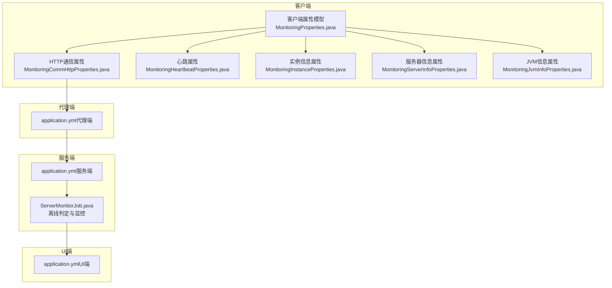
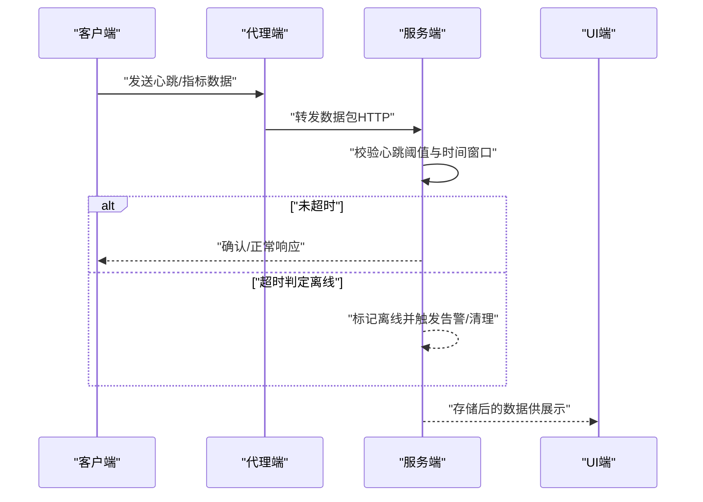
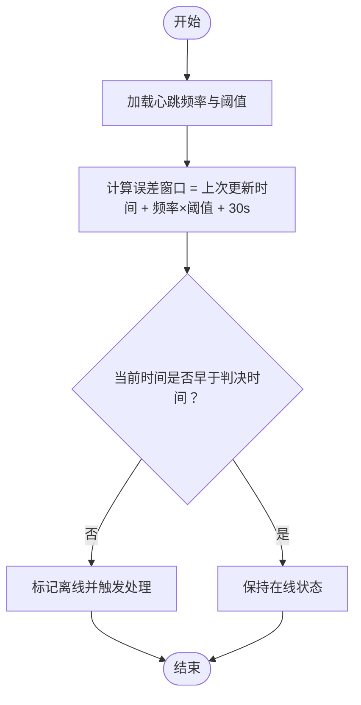
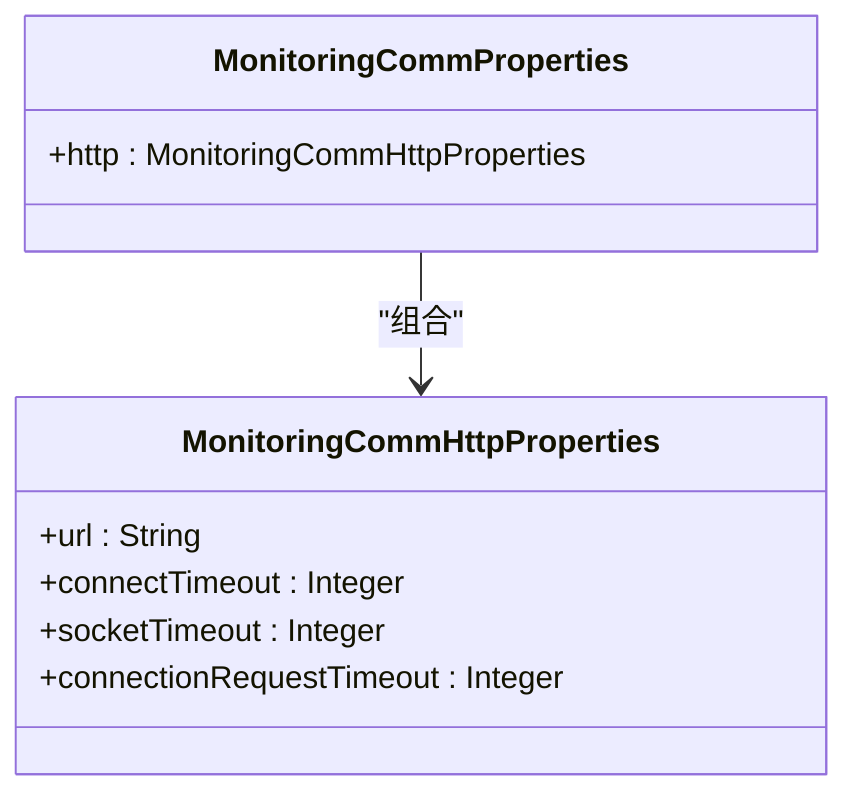
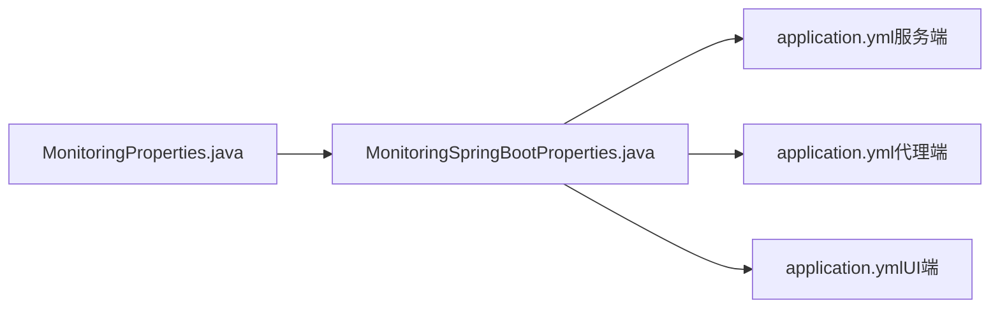

# 数据同步配置

<cite>
**本文引用的文件**
- [application.yml（服务端）](file://phoenix-server/src/main/resources/application.yml)
- [application.yml（代理端）](file://phoenix-agent/src/main/resources/application.yml)
- [application.yml（UI端）](file://phoenix-ui/src/main/resources/application.yml)
- [ZipUtils.java](file://phoenix-common/phoenix-common-core/src/main/java/com/gitee/pifeng/monitoring/common/util/ZipUtils.java)
- [MonitoringProperties.java（客户端）](file://phoenix-common/phoenix-common-core/src/main/java/com/gitee/pifeng/monitoring/common/property/client/MonitoringProperties.java)
- [MonitoringCommProperties.java（客户端）](file://phoenix-common/phoenix-common-core/src/main/java/com/gitee/pifeng/monitoring/common/property/client/MonitoringCommProperties.java)
- [MonitoringCommHttpProperties.java（客户端）](file://phoenix-common/phoenix-common-core/src/main/java/com/gitee/pifeng/monitoring/common/property/client/MonitoringCommHttpProperties.java)
- [MonitoringHeartbeatProperties.java（客户端）](file://phoenix-common/phoenix-common-core/src/main/java/com/gitee/pifeng/monitoring/common/property/client/MonitoringHeartbeatProperties.java)
- [MonitoringInstanceProperties.java（客户端）](file://phoenix-common/phoenix-common-core/src/main/java/com/gitee/pifeng/monitoring/common/property/client/MonitoringInstanceProperties.java)
- [MonitoringServerInfoProperties.java（客户端）](file://phoenix-common/phoenix-common-core/src/main/java/com/gitee/pifeng/monitoring/common/property/client/MonitoringServerInfoProperties.java)
- [MonitoringJvmInfoProperties.java（客户端）](file://phoenix-common/phoenix-common-core/src/main/java/com/gitee/pifeng/monitoring/common/property/client/MonitoringJvmInfoProperties.java)
- [MonitoringSpringBootProperties.java（Spring Boot属性绑定）](file://phoenix-client/phoenix-client-spring-boot-starter/src/main/java/com/gitee/pifeng/monitoring/starter/property/MonitoringSpringBootProperties.java)
- [ServerMonitorJob.java](file://phoenix-server/src/main/java/com/gitee/pifeng/monitoring/server/business/server/monitor/server/ServerMonitorJob.java)
</cite>

## 目录
1. [简介](#简介)
2. [项目结构](#项目结构)
3. [核心组件](#核心组件)
4. [架构总览](#架构总览)
5. [详细组件分析](#详细组件分析)
6. [依赖分析](#依赖分析)
7. [性能考量](#性能考量)
8. [故障排查指南](#故障排查指南)
9. [结论](#结论)
10. [附录](#附录)

## 简介
本文件面向Phoenix监控系统在“数据同步配置”方面的实践与最佳实践，围绕以下主题展开：
- 数据一致性保障：如何通过心跳阈值、离线判定等机制实现“最终一致性”的稳定运行；如何在配置层面体现“强一致/最终一致/读写一致”的取舍。
- 复制策略：主从复制、多主复制、增量同步、全量同步的配置思路与落地要点。
- 冲突解决：时间戳冲突、版本号冲突、最后写入获胜（LWW）等策略的配置与实施建议。
- 性能优化：批量发送、异步复制、压缩传输等优化手段的配置与效果评估。
- 监控与管理：同步状态监控、延迟检测、故障恢复等运维能力的配置与使用。

说明：Phoenix监控系统以“客户端采集 -> 代理端汇聚 -> 服务端存储/处理 -> UI展示”的链路为主，数据同步主要体现在客户端与服务端之间的消息传递与落库流程。本文将结合代码中的配置类与运行逻辑，给出可操作的配置建议与可视化图示。

## 项目结构
Phoenix由三端构成：服务端（Server）、代理端（Agent）、UI端（UI）。三者均采用Spring Boot工程，具备独立的application.yml配置与运行环境。客户端侧通过统一的属性模型（MonitoringProperties）进行配置绑定，便于在Spring Boot环境中集中管理。

图表来源
- [application.yml（服务端）:1-271](file://phoenix-server/src/main/resources/application.yml#L1-L271)
- [application.yml（代理端）:1-111](file://phoenix-agent/src/main/resources/application.yml#L1-L111)
- [application.yml（UI端）:1-238](file://phoenix-ui/src/main/resources/application.yml#L1-L238)
- [MonitoringProperties.java（客户端）:1-55](file://phoenix-common/phoenix-common-core/src/main/java/com/gitee/pifeng/monitoring/common/property/client/MonitoringProperties.java#L1-L55)
- [MonitoringCommHttpProperties.java（客户端）:1-43](file://phoenix-common/phoenix-common-core/src/main/java/com/gitee/pifeng/monitoring/common/property/client/MonitoringCommHttpProperties.java#L1-L43)
- [MonitoringHeartbeatProperties.java（客户端）:1-28](file://phoenix-common/phoenix-common-core/src/main/java/com/gitee/pifeng/monitoring/common/property/client/MonitoringHeartbeatProperties.java#L1-L28)
- [MonitoringInstanceProperties.java（客户端）:1-48](file://phoenix-common/phoenix-common-core/src/main/java/com/gitee/pifeng/monitoring/common/property/client/MonitoringInstanceProperties.java#L1-L48)
- [MonitoringServerInfoProperties.java（客户端）:1-43](file://phoenix-common/phoenix-common-core/src/main/java/com/gitee/pifeng/monitoring/common/property/client/MonitoringServerInfoProperties.java#L1-L43)
- [MonitoringJvmInfoProperties.java（客户端）:1-33](file://phoenix-common/phoenix-common-core/src/main/java/com/gitee/pifeng/monitoring/common/property/client/MonitoringJvmInfoProperties.java#L1-L33)
- [ServerMonitorJob.java:130-150](file://phoenix-server/src/main/java/com/gitee/pifeng/monitoring/server/business/server/monitor/server/ServerMonitorJob.java#L130-L150)

章节来源
- [application.yml（服务端）:1-271](file://phoenix-server/src/main/resources/application.yml#L1-L271)
- [application.yml（代理端）:1-111](file://phoenix-agent/src/main/resources/application.yml#L1-L111)
- [application.yml（UI端）:1-238](file://phoenix-ui/src/main/resources/application.yml#L1-L238)

## 核心组件
- 客户端属性模型（MonitoringProperties）：集中定义安全、通信、心跳、实例、服务器、JVM等配置项，便于在Spring Boot中通过前缀“phoenix.monitoring”进行绑定。
- 通信属性（MonitoringCommProperties/HttpProperties）：定义服务端URL、连接超时、等待超时、连接池获取超时等，直接影响数据同步的可靠性与性能。
- 心跳属性（MonitoringHeartbeatProperties）：定义心跳频率，用于服务端判定客户端存活与离线。
- 实例信息、服务器信息、JVM信息属性：用于标识实例身份、采集频率与目标IP等，间接影响同步路径与落库策略。
- Spring Boot属性绑定（MonitoringSpringBootProperties）：将MonitoringProperties暴露为Spring Bean，实现配置注入。
- 服务端离线判定（ServerMonitorJob）：基于心跳阈值与时间窗口，判定客户端离线并触发后续处理。

章节来源
- [MonitoringProperties.java（客户端）:1-55](file://phoenix-common/phoenix-common-core/src/main/java/com/gitee/pifeng/monitoring/common/property/client/MonitoringProperties.java#L1-L55)
- [MonitoringCommProperties.java（客户端）:1-28](file://phoenix-common/phoenix-common-core/src/main/java/com/gitee/pifeng/monitoring/common/property/client/MonitoringCommProperties.java#L1-L28)
- [MonitoringCommHttpProperties.java（客户端）:1-43](file://phoenix-common/phoenix-common-core/src/main/java/com/gitee/pifeng/monitoring/common/property/client/MonitoringCommHttpProperties.java#L1-L43)
- [MonitoringHeartbeatProperties.java（客户端）:1-28](file://phoenix-common/phoenix-common-core/src/main/java/com/gitee/pifeng/monitoring/common/property/client/MonitoringHeartbeatProperties.java#L1-L28)
- [MonitoringInstanceProperties.java（客户端）:1-48](file://phoenix-common/phoenix-common-core/src/main/java/com/gitee/pifeng/monitoring/common/property/client/MonitoringInstanceProperties.java#L1-L48)
- [MonitoringServerInfoProperties.java（客户端）:1-43](file://phoenix-common/phoenix-common-core/src/main/java/com/gitee/pifeng/monitoring/common/property/client/MonitoringServerInfoProperties.java#L1-L43)
- [MonitoringJvmInfoProperties.java（客户端）:1-33](file://phoenix-common/phoenix-common-core/src/main/java/com/gitee/pifeng/monitoring/common/property/client/MonitoringJvmInfoProperties.java#L1-L33)
- [MonitoringSpringBootProperties.java（Spring Boot属性绑定）:1-23](file://phoenix-client/phoenix-client-spring-boot-starter/src/main/java/com/gitee/pifeng/monitoring/starter/property/MonitoringSpringBootProperties.java#L1-L23)
- [ServerMonitorJob.java:130-150](file://phoenix-server/src/main/java/com/gitee/pifeng/monitoring/server/business/server/monitor/server/ServerMonitorJob.java#L130-L150)

## 架构总览
Phoenix的数据同步以“心跳+阈值”的最终一致性模型为核心，客户端定期上报心跳与指标，服务端根据心跳频率与阈值计算允许的误差窗口，超出则判定离线。该模型天然偏向最终一致性，适合高可用与低耦合场景。

图表来源
- [ServerMonitorJob.java:130-150](file://phoenix-server/src/main/java/com/gitee/pifeng/monitoring/server/business/server/monitor/server/ServerMonitorJob.java#L130-L150)
- [application.yml（服务端）:1-271](file://phoenix-server/src/main/resources/application.yml#L1-L271)
- [application.yml（代理端）:1-111](file://phoenix-agent/src/main/resources/application.yml#L1-L111)
- [application.yml（UI端）:1-238](file://phoenix-ui/src/main/resources/application.yml#L1-L238)

## 详细组件分析

### 1) 心跳与离线判定（最终一致性基础）
- 配置要点
  - 心跳频率（rate）：决定上报周期，影响延迟与带宽占用。
  - 阈值（threshold）：服务端用于计算允许误差时间，配合心跳频率形成“容忍窗口”。
  - 误差窗口：服务端以“上次更新时间 + 心跳频率 × 阈值 + 固定偏移”作为判决基准，超时即离线。
- 行为特征
  - 在误差窗口内，即使短暂失联也会被视作在线，避免抖动误判。
  - 超出窗口后进入离线流程，触发后续告警与资源回收。

图表来源
- [ServerMonitorJob.java:130-150](file://phoenix-server/src/main/java/com/gitee/pifeng/monitoring/server/business/server/monitor/server/ServerMonitorJob.java#L130-L150)

章节来源
- [MonitoringHeartbeatProperties.java（客户端）:1-28](file://phoenix-common/phoenix-common-core/src/main/java/com/gitee/pifeng/monitoring/common/property/client/MonitoringHeartbeatProperties.java#L1-L28)
- [ServerMonitorJob.java:130-150](file://phoenix-server/src/main/java/com/gitee/pifeng/monitoring/server/business/server/monitor/server/ServerMonitorJob.java#L130-L150)

### 2) 通信与传输（可靠性与性能）
- 通信属性
  - 服务端URL：客户端上报的目标地址。
  - 连接超时、套接字超时、连接池获取超时：分别控制建立连接、等待响应、从连接池借出连接的时限，直接影响失败重试与拥塞保护。
- 配置建议
  - 在网络波动较大的场景，适当增大超时阈值，减少误判失败。
  - 对于高吞吐场景，合理设置连接池参数与并发任务数，避免阻塞。
- 压缩传输
  - 当字符串长度超过一定阈值（例如64KB）时，启用gzip压缩，显著降低带宽占用，提高传输效率。

图表来源
- [MonitoringCommProperties.java（客户端）:1-28](file://phoenix-common/phoenix-common-core/src/main/java/com/gitee/pifeng/monitoring/common/property/client/MonitoringCommProperties.java#L1-L28)
- [MonitoringCommHttpProperties.java（客户端）:1-43](file://phoenix-common/phoenix-common-core/src/main/java/com/gitee/pifeng/monitoring/common/property/client/MonitoringCommHttpProperties.java#L1-L43)

章节来源
- [MonitoringCommProperties.java（客户端）:1-28](file://phoenix-common/phoenix-common-core/src/main/java/com/gitee/pifeng/monitoring/common/property/client/MonitoringCommProperties.java#L1-L28)
- [MonitoringCommHttpProperties.java（客户端）:1-43](file://phoenix-common/phoenix-common-core/src/main/java/com/gitee/pifeng/monitoring/common/property/client/MonitoringCommHttpProperties.java#L1-L43)
- [ZipUtils.java:1-54](file://phoenix-common/phoenix-common-core/src/main/java/com/gitee/pifeng/monitoring/common/util/ZipUtils.java#L1-L54)

### 3) 数据一致性保障（强一致/最终一致/读写一致）
- 最终一致性（推荐）
  - 通过心跳阈值与误差窗口实现“容忍窗口内”的稳定性，避免瞬时抖动导致的误判。
  - 适用于高可用与跨地域场景，强调可用性与分区容错。
- 强一致性（受限）
  - 代码中未直接体现强一致的“两阶段提交/法定人数”等机制；若需强一致，可在业务层引入外部共识组件或变更数据流为“请求-确认”模式。
- 读写一致（建议）
  - 在客户端侧对同一指标的多次写入进行去重或版本合并，避免重复写入造成的数据漂移。
  - 在服务端侧对同一实例的指标进行幂等写入，确保重复请求不会产生副作用。

章节来源
- [ServerMonitorJob.java:130-150](file://phoenix-server/src/main/java/com/gitee/pifeng/monitoring/server/business/server/monitor/server/ServerMonitorJob.java#L130-L150)

### 4) 复制策略（主从/多主/增量/全量）
- 主从复制
  - 通过单一服务端作为“主”，代理端/客户端向其上报，服务端负责聚合与落库。此模式简单可靠，适合大多数场景。
- 多主复制
  - 若需高可用与无单点，可在多个服务端之间建立“多主”同步，结合冲突解决策略（见下一节）实现数据收敛。
- 增量同步
  - 客户端按心跳周期上报差异数据，服务端仅处理新增/变更，降低带宽与存储压力。
- 全量同步
  - 在初始化或修复阶段使用，客户端一次性上报完整快照，随后切换为增量同步。

说明：上述策略为配置与流程层面的建议，具体实现需结合业务与外部系统（如数据库/消息队列）能力进行扩展。

### 5) 冲突解决（时间戳/版本号/LWW）
- 时间戳冲突
  - 以“最新时间戳优先”或“时间戳+实例标识”的复合键进行去重与覆盖。
- 版本号冲突
  - 使用单调递增版本号，版本更高的记录覆盖版本较低的记录。
- 最后写入获胜（LWW）
  - 以写入时间为准，较新的写入覆盖旧写入；可结合实例ID形成唯一键，避免跨实例冲突。
- 建议
  - 在客户端侧对同一指标的多次写入进行合并与去重。
  - 在服务端侧对重复键进行幂等处理，确保并发写入的安全性。

### 6) 性能优化（批量/异步/压缩）
- 批量同步
  - 将多个指标打包为批次上报，减少HTTP请求数量与连接开销。
- 异步复制
  - 客户端使用异步线程池发送数据，避免阻塞主线程；服务端采用异步任务处理，提升吞吐。
- 压缩传输
  - 对大文本/JSON进行gzip压缩，降低带宽占用；代码中已提供64KB阈值判断逻辑。

章节来源
- [ZipUtils.java:1-54](file://phoenix-common/phoenix-common-core/src/main/java/com/gitee/pifeng/monitoring/common/util/ZipUtils.java#L1-L54)

### 7) 监控与管理（状态/延迟/故障恢复）
- 同步状态监控
  - 通过UI端查看实例列表、心跳状态、离线记录等，辅助定位问题。
- 延迟检测
  - 结合心跳频率与阈值，计算“允许误差时间”，用于评估网络与系统延迟。
- 故障恢复
  - 离线后重新上线会触发数据补报与状态恢复；建议在代理端与服务端均配置健康检查与重试策略。

章节来源
- [application.yml（UI端）:1-238](file://phoenix-ui/src/main/resources/application.yml#L1-L238)
- [ServerMonitorJob.java:130-150](file://phoenix-server/src/main/java/com/gitee/pifeng/monitoring/server/business/server/monitor/server/ServerMonitorJob.java#L130-L150)

## 依赖分析
客户端属性模型通过Spring Boot属性绑定暴露为Bean，服务端与UI端分别维护独立的application.yml，形成清晰的职责分离与配置隔离。

图表来源
- [MonitoringProperties.java（客户端）:1-55](file://phoenix-common/phoenix-common-core/src/main/java/com/gitee/pifeng/monitoring/common/property/client/MonitoringProperties.java#L1-L55)
- [MonitoringSpringBootProperties.java（Spring Boot属性绑定）:1-23](file://phoenix-client/phoenix-client-spring-boot-starter/src/main/java/com/gitee/pifeng/monitoring/starter/property/MonitoringSpringBootProperties.java#L1-L23)
- [application.yml（服务端）:1-271](file://phoenix-server/src/main/resources/application.yml#L1-L271)
- [application.yml（代理端）:1-111](file://phoenix-agent/src/main/resources/application.yml#L1-L111)
- [application.yml（UI端）:1-238](file://phoenix-ui/src/main/resources/application.yml#L1-L238)

章节来源
- [MonitoringSpringBootProperties.java（Spring Boot属性绑定）:1-23](file://phoenix-client/phoenix-client-spring-boot-starter/src/main/java/com/gitee/pifeng/monitoring/starter/property/MonitoringSpringBootProperties.java#L1-L23)

## 性能考量
- 心跳频率与阈值的权衡：频率越高，延迟越低但带宽与CPU占用越高；阈值越大，抗抖动能力越强但离线感知越慢。
- 传输优化：启用gzip压缩、批量上报、异步发送，可显著降低网络与服务端压力。
- 连接与线程：合理设置HTTP超时与连接池参数，避免在高负载下出现连接饥饿或堆积。

## 故障排查指南
- 离线频繁
  - 检查心跳频率与阈值配置是否合理，网络是否存在抖动。
  - 查看服务端日志与UI端离线记录，定位异常实例。
- 传输失败
  - 检查服务端URL、超时参数与代理端连通性。
  - 关注gzip压缩阈值与响应大小，避免过大响应导致超时。
- 数据重复/冲突
  - 在客户端侧启用去重与版本合并，在服务端侧确保幂等写入。

章节来源
- [application.yml（服务端）:1-271](file://phoenix-server/src/main/resources/application.yml#L1-L271)
- [application.yml（代理端）:1-111](file://phoenix-agent/src/main/resources/application.yml#L1-L111)
- [application.yml（UI端）:1-238](file://phoenix-ui/src/main/resources/application.yml#L1-L238)
- [ZipUtils.java:1-54](file://phoenix-common/phoenix-common-core/src/main/java/com/gitee/pifeng/monitoring/common/util/ZipUtils.java#L1-L54)
- [ServerMonitorJob.java:130-150](file://phoenix-server/src/main/java/com/gitee/pifeng/monitoring/server/business/server/monitor/server/ServerMonitorJob.java#L130-L150)

## 结论
Phoenix监控系统通过“心跳+阈值”的最终一致性模型，结合压缩、批量与异步等优化手段，实现了高可用与低耦合的数据同步方案。对于强一致与多主复制等高级需求，可在现有基础上引入外部共识或变更数据流为“请求-确认”模式。通过合理的配置与监控，可有效保障数据同步的稳定性与可观测性。

## 附录
- 配置前缀与关键项
  - 前缀：phoenix.monitoring
  - 关键项：comm.http.url、comm.http.connect-timeout、comm.http.socket-timeout、comm.http.connection-request-timeout、heartbeat.rate、instance.order/endpoint/name/desc/language、serverInfo.enable/userSigarEnable/rate/ip、jvmInfo.enable/rate

章节来源
- [MonitoringSpringBootProperties.java（Spring Boot属性绑定）:1-23](file://phoenix-client/phoenix-client-spring-boot-starter/src/main/java/com/gitee/pifeng/monitoring/starter/property/MonitoringSpringBootProperties.java#L1-L23)
- [MonitoringCommHttpProperties.java（客户端）:1-43](file://phoenix-common/phoenix-common-core/src/main/java/com/gitee/pifeng/monitoring/common/property/client/MonitoringCommHttpProperties.java#L1-L43)
- [MonitoringHeartbeatProperties.java（客户端）:1-28](file://phoenix-common/phoenix-common-core/src/main/java/com/gitee/pifeng/monitoring/common/property/client/MonitoringHeartbeatProperties.java#L1-L28)
- [MonitoringInstanceProperties.java（客户端）:1-48](file://phoenix-common/phoenix-common-core/src/main/java/com/gitee/pifeng/monitoring/common/property/client/MonitoringInstanceProperties.java#L1-L48)
- [MonitoringServerInfoProperties.java（客户端）:1-43](file://phoenix-common/phoenix-common-core/src/main/java/com/gitee/pifeng/monitoring/common/property/client/MonitoringServerInfoProperties.java#L1-L43)
- [MonitoringJvmInfoProperties.java（客户端）:1-33](file://phoenix-common/phoenix-common-core/src/main/java/com/gitee/pifeng/monitoring/common/property/client/MonitoringJvmInfoProperties.java#L1-L33)