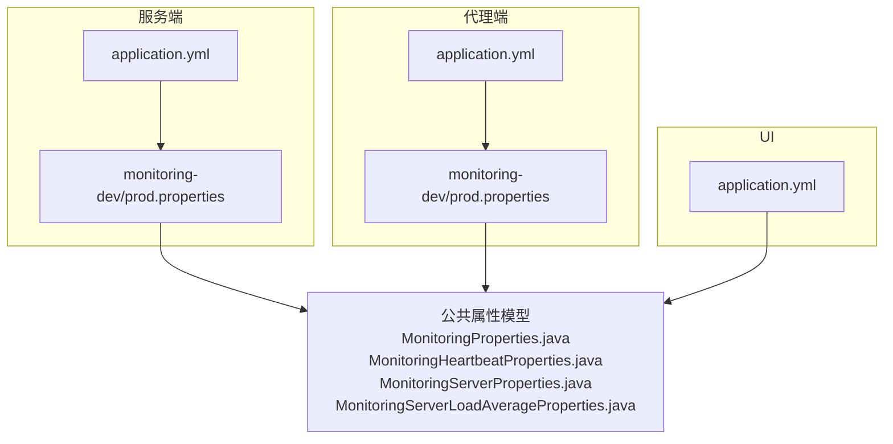
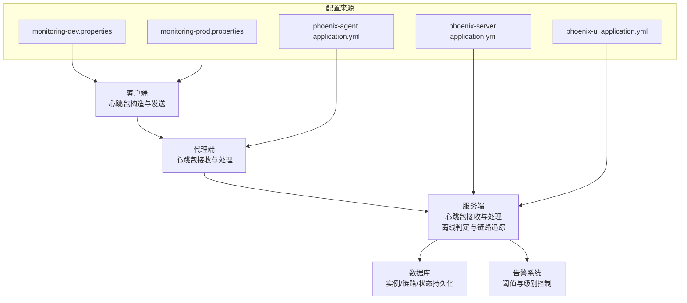
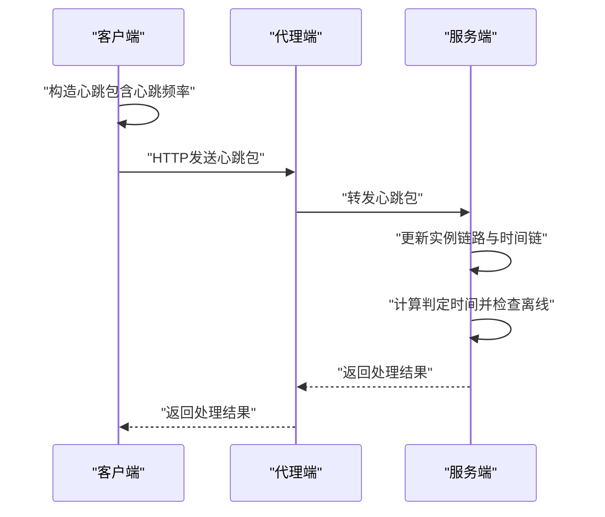
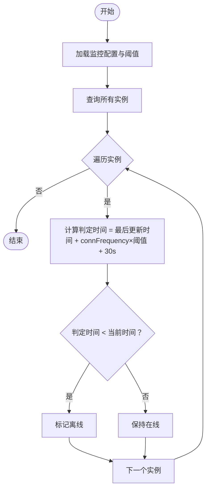
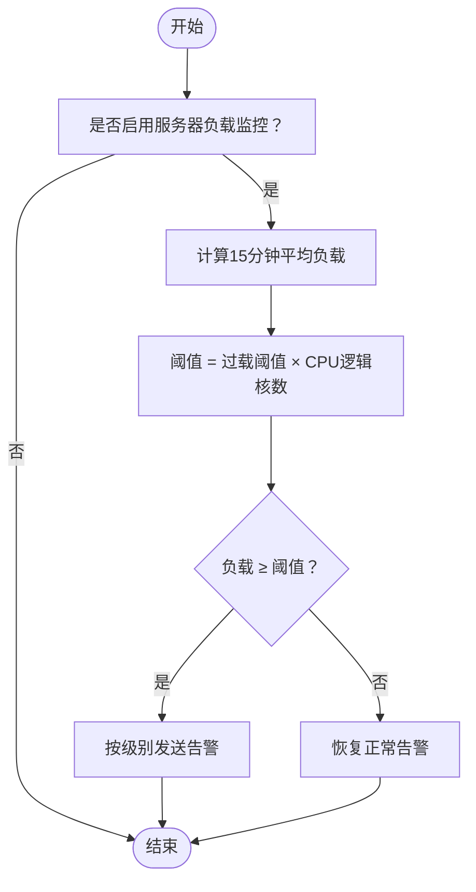
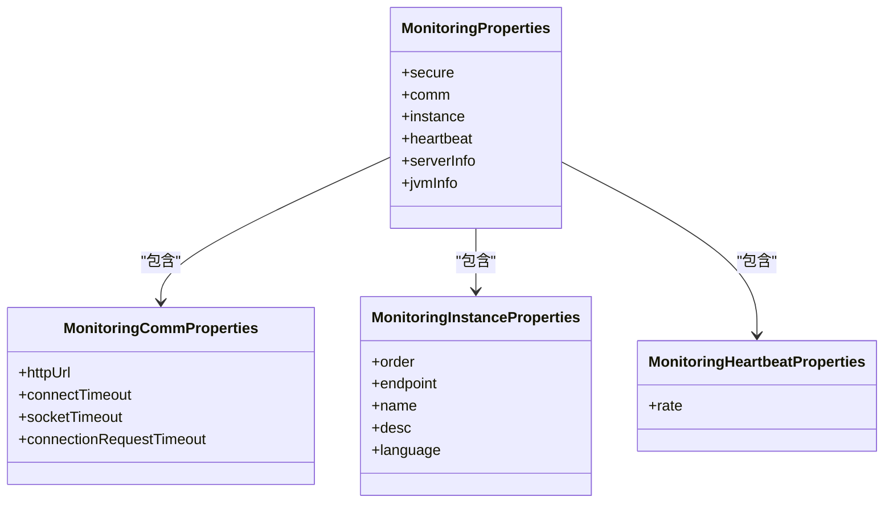
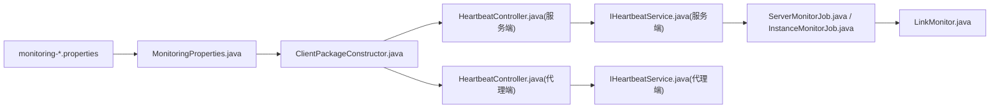

# 集群管理配置

<cite>
**本文引用的文件**
- [application.yml](file://phoenix-server/src/main/resources/application.yml)
- [application.yml](file://phoenix-agent/src/main/resources/application.yml)
- [application.yml](file://phoenix-ui/src/main/resources/application.yml)
- [monitoring-dev.properties](file://phoenix-server/src/main/resources/monitoring-dev.properties)
- [monitoring-dev.properties](file://phoenix-agent/src/main/resources/monitoring-dev.properties)
- [monitoring-prod.properties](file://phoenix-server/src/main/resources/monitoring-prod.properties)
- [monitoring-prod.properties](file://phoenix-agent/src/main/resources/monitoring-prod.properties)
- [MonitoringProperties.java](file://phoenix-common/Phoenix-common-core/src/main/java/com/gitee/pifeng/monitoring/common/property/client/MonitoringProperties.java)
- [MonitoringHeartbeatProperties.java](file://phoenix-common/Phoenix-common-core/src/main/java/com/gitee/pifeng/monitoring/common/property/client/MonitoringHeartbeatProperties.java)
- [MonitoringServerLoadAverageProperties.java](file://phoenix-common/Phoenix-common-core/src/main/java/com/gitee/pifeng/monitoring/common/property/server/MonitoringServerLoadAverageProperties.java)
- [MonitoringServerProperties.java](file://phoenix-common/Phoenix-common-core/src/main/java/com/gitee/pifeng/monitoring/common/property/server/MonitoringServerProperties.java)
- [ClientPackageConstructor.java](file://phoenix-client/phoenix-client-core/src/main/java/com/gitee/pifeng/monitoring/plug/core/ClientPackageConstructor.java)
- [HeartbeatController.java](file://phoenix-server/src/main/java/com/gitee/pifeng/monitoring/server/business/server/controller/HeartbeatController.java)
- [HeartbeatController.java](file://phoenix-agent/src/main/java/com/gitee/pifeng/monitoring/agent/business/client/controller/HeartbeatController.java)
- [IHeartbeatService.java](file://phoenix-server/src/main/java/com/gitee/pifeng/monitoring/server/business/server/service/IHeartbeatService.java)
- [IHeartbeatService.java](file://phoenix-agent/src/main/java/com/gitee/pifeng/monitoring/agent/business/client/service/IHeartbeatService.java)
- [ServerMonitorJob.java](file://phoenix-server/src/main/java/com/gitee/pifeng/monitoring/server/business/server/monitor/server/ServerMonitorJob.java)
- [InstanceMonitorJob.java](file://phoenix-server/src/main/java/com/gitee/pifeng/monitoring/server/business/server/monitor/instance/InstanceMonitorJob.java)
- [LinkMonitor.java](file://phoenix-server/src/main/java/com/gitee/pifeng/monitoring/server/business/server/monitor/LinkMonitor.java)
- [MonitoringConfigPropertiesLoader.java](file://phoenix-server/src/main/java/com/gitee/pifeng/monitoring/server/business/server/core/MonitoringConfigPropertiesLoader.java)
- [config.html](file://phoenix-ui/src/main/resources/templates/set/config.html)
</cite>

## 目录
1. [简介](#简介)
2. [项目结构](#项目结构)
3. [核心组件](#核心组件)
4. [架构总览](#架构总览)
5. [详细组件分析](#详细组件分析)
6. [依赖关系分析](#依赖关系分析)
7. [性能考量](#性能考量)
8. [故障排查指南](#故障排查指南)
9. [结论](#结论)
10. [附录](#附录)

## 简介
本文件面向Phoenix监控系统集群管理配置，围绕以下目标展开：
- 集群节点发现与动态成员管理：节点注册、心跳检测、离线判定与链路追踪
- 负载均衡与故障转移：基于心跳与阈值的健康状态评估与故障检测
- 集群通信：HTTP通信协议、超时参数、实例端点类型
- 集群状态监控与管理：节点健康检查、状态同步、故障检测与告警
- 集群部署最佳实践：网络规划、性能调优、监控告警

## 项目结构
Phoenix由服务端、代理端、客户端与UI四部分组成，配置文件主要分布在各模块的资源目录中，分别包含Spring Boot通用配置与监控专用属性。

**图表来源**
- [application.yml:1-271](file://phoenix-server/src/main/resources/application.yml#L1-L271)
- [application.yml:1-111](file://phoenix-agent/src/main/resources/application.yml#L1-L111)
- [application.yml:1-238](file://phoenix-ui/src/main/resources/application.yml#L1-L238)
- [monitoring-dev.properties:1-41](file://phoenix-server/src/main/resources/monitoring-dev.properties#L1-L41)
- [monitoring-dev.properties:1-41](file://phoenix-agent/src/main/resources/monitoring-dev.properties#L1-L41)
- [monitoring-prod.properties:1-41](file://phoenix-server/src/main/resources/monitoring-prod.properties#L1-L41)
- [monitoring-prod.properties:1-41](file://phoenix-agent/src/main/resources/monitoring-prod.properties#L1-L41)
- [MonitoringProperties.java:1-56](file://phoenix-common/Phoenix-common-core/src/main/java/com/gitee/pifeng/monitoring/common/property/client/MonitoringProperties.java#L1-L56)
- [MonitoringHeartbeatProperties.java:1-27](file://phoenix-common/Phoenix-common-core/src/main/java/com/gitee/pifeng/monitoring/common/property/client/MonitoringHeartbeatProperties.java#L1-L27)
- [MonitoringServerProperties.java:1-52](file://phoenix-common/Phoenix-common-core/src/main/java/com/gitee/pifeng/monitoring/common/property/server/MonitoringServerProperties.java#L1-L52)
- [MonitoringServerLoadAverageProperties.java:1-41](file://phoenix-common/Phoenix-common-core/src/main/java/com/gitee/pifeng/monitoring/common/property/server/MonitoringServerLoadAverageProperties.java#L1-L41)

**章节来源**
- [application.yml:1-271](file://phoenix-server/src/main/resources/application.yml#L1-L271)
- [application.yml:1-111](file://phoenix-agent/src/main/resources/application.yml#L1-L111)
- [application.yml:1-238](file://phoenix-ui/src/main/resources/application.yml#L1-L238)

## 核心组件
- 监控属性模型：集中定义安全、通信、实例、心跳、服务器信息、JVM信息等配置项，供各模块加载与使用。
- 心跳配置：心跳频率、通信URL、超时参数、实例端点类型等。
- 服务器负载配置：是否监控、告警开关、过载阈值与告警级别。
- 心跳包构造：客户端根据配置构造心跳包并发送至服务端。

**章节来源**
- [MonitoringProperties.java:1-56](file://phoenix-common/Phoenix-common-core/src/main/java/com/gitee/pifeng/monitoring/common/property/client/MonitoringProperties.java#L1-L56)
- [MonitoringHeartbeatProperties.java:1-27](file://phoenix-common/Phoenix-common-core/src/main/java/com/gitee/pifeng/monitoring/common/property/client/MonitoringHeartbeatProperties.java#L1-L27)
- [MonitoringServerProperties.java:1-52](file://phoenix-common/Phoenix-common-core/src/main/java/com/gitee/pifeng/monitoring/common/property/server/MonitoringServerProperties.java#L1-L52)
- [MonitoringServerLoadAverageProperties.java:1-41](file://phoenix-common/Phoenix-common-core/src/main/java/com/gitee/pifeng/monitoring/common/property/server/MonitoringServerLoadAverageProperties.java#L1-L41)
- [ClientPackageConstructor.java:205-245](file://phoenix-client/phoenix-client-core/src/main/java/com/gitee/pifeng/monitoring/plug/core/ClientPackageConstructor.java#L205-L245)

## 架构总览
Phoenix集群管理以“客户端-代理端-服务端”三层协作实现节点注册、心跳检测与状态同步。客户端负责采集与上报，代理端作为中间层转发与处理，服务端负责聚合、存储与告警。

**图表来源**
- [ClientPackageConstructor.java:205-245](file://phoenix-client/phoenix-client-core/src/main/java/com/gitee/pifeng/monitoring/plug/core/ClientPackageConstructor.java#L205-L245)
- [HeartbeatController.java:61-77](file://phoenix-server/src/main/java/com/gitee/pifeng/monitoring/server/business/server/controller/HeartbeatController.java#L61-L77)
- [HeartbeatController.java:36-55](file://phoenix-agent/src/main/java/com/gitee/pifeng/monitoring/agent/business/client/controller/HeartbeatController.java#L36-L55)
- [monitoring-dev.properties:1-41](file://phoenix-server/src/main/resources/monitoring-dev.properties#L1-L41)
- [monitoring-prod.properties:1-41](file://phoenix-server/src/main/resources/monitoring-prod.properties#L1-L41)
- [application.yml:1-271](file://phoenix-server/src/main/resources/application.yml#L1-L271)
- [application.yml:1-111](file://phoenix-agent/src/main/resources/application.yml#L1-L111)
- [application.yml:1-238](file://phoenix-ui/src/main/resources/application.yml#L1-L238)

## 详细组件分析

### 节点注册与心跳检测
- 节点注册：客户端按配置周期发送心跳包，服务端接收并记录实例链路与时间链，用于后续状态同步与故障检测。
- 心跳频率：由心跳属性控制，客户端构造心跳包时读取该配置。
- 心跳超时与容差：服务端通过“最后更新时间 + 连接频率 × 阈值 + 30秒”计算判定时间，超过当前时间即判定离线。

**图表来源**
- [ClientPackageConstructor.java:205-245](file://phoenix-client/phoenix-client-core/src/main/java/com/gitee/pifeng/monitoring/plug/core/ClientPackageConstructor.java#L205-L245)
- [HeartbeatController.java:61-77](file://phoenix-server/src/main/java/com/gitee/pifeng/monitoring/server/business/server/controller/HeartbeatController.java#L61-L77)
- [HeartbeatController.java:36-55](file://phoenix-agent/src/main/java/com/gitee/pifeng/monitoring/agent/business/client/controller/HeartbeatController.java#L36-L55)
- [ServerMonitorJob.java:130-150](file://phoenix-server/src/main/java/com/gitee/pifeng/monitoring/server/business/server/monitor/server/ServerMonitorJob.java#L130-L150)
- [LinkMonitor.java:75-99](file://phoenix-server/src/main/java/com/gitee/pifeng/monitoring/server/business/server/monitor/LinkMonitor.java#L75-L99)

**章节来源**
- [MonitoringHeartbeatProperties.java:1-27](file://phoenix-common/Phoenix-common-core/src/main/java/com/gitee/pifeng/monitoring/common/property/client/MonitoringHeartbeatProperties.java#L1-L27)
- [ClientPackageConstructor.java:205-245](file://phoenix-client/phoenix-client-core/src/main/java/com/gitee/pifeng/monitoring/plug/core/ClientPackageConstructor.java#L205-L245)
- [ServerMonitorJob.java:130-150](file://phoenix-server/src/main/java/com/gitee/pifeng/monitoring/server/business/server/monitor/server/ServerMonitorJob.java#L130-L150)
- [LinkMonitor.java:75-99](file://phoenix-server/src/main/java/com/gitee/pifeng/monitoring/server/business/server/monitor/LinkMonitor.java#L75-L99)

### 动态成员管理与离线判定
- 实例离线判定：服务端遍历实例，依据“最后心跳时间 + 容差”与当前时间比较，超时则标记离线。
- 链路追踪：服务端维护实例链与时间链，避免自环与空链，更新根节点时间与链路状态。
- 配置入口：阈值与实例连接频率来自监控配置加载器，结合实例表中的connFrequency字段参与判定。

**图表来源**
- [ServerMonitorJob.java:130-150](file://phoenix-server/src/main/java/com/gitee/pifeng/monitoring/server/business/server/monitor/server/ServerMonitorJob.java#L130-L150)
- [InstanceMonitorJob.java:128-150](file://phoenix-server/src/main/java/com/gitee/pifeng/monitoring/server/business/server/monitor/instance/InstanceMonitorJob.java#L128-L150)
- [MonitoringConfigPropertiesLoader.java:118-144](file://phoenix-server/src/main/java/com/gitee/pifeng/monitoring/server/business/server/core/MonitoringConfigPropertiesLoader.java#L118-L144)

**章节来源**
- [ServerMonitorJob.java:130-150](file://phoenix-server/src/main/java/com/gitee/pifeng/monitoring/server/business/server/monitor/server/ServerMonitorJob.java#L130-L150)
- [InstanceMonitorJob.java:128-150](file://phoenix-server/src/main/java/com/gitee/pifeng/monitoring/server/business/server/monitor/instance/InstanceMonitorJob.java#L128-L150)
- [MonitoringConfigPropertiesLoader.java:118-144](file://phoenix-server/src/main/java/com/gitee/pifeng/monitoring/server/business/server/core/MonitoringConfigPropertiesLoader.java#L118-L144)

### 负载均衡与故障转移
- 负载均衡：系统通过“15分钟平均负载阈值 × CPU逻辑核数”进行过载判定，结合告警级别与预设阈值进行分级告警。
- 故障转移：当实例或服务器负载过载或离线时，系统通过告警与状态变更通知上层治理策略，实现故障隔离与流量切换。
- 配置项：服务器负载监控开关、告警开关、过载阈值与告警级别。

**图表来源**
- [MonitoringServerLoadAverageProperties.java:1-41](file://phoenix-common/Phoenix-common-core/src/main/java/com/gitee/pifeng/monitoring/common/property/server/MonitoringServerLoadAverageProperties.java#L1-L41)
- [MonitoringServerProperties.java:1-52](file://phoenix-common/Phoenix-common-core/src/main/java/com/gitee/pifeng/monitoring/common/property/server/MonitoringServerProperties.java#L1-L52)
- [ServerLoadAverageMonitor.java:122-259](file://phoenix-server/src/main/java/com/gitee/pifeng/monitoring/server/business/server/monitor/server/ServerLoadAverageMonitor.java#L122-L259)

**章节来源**
- [MonitoringServerLoadAverageProperties.java:1-41](file://phoenix-common/Phoenix-common-core/src/main/java/com/gitee/pifeng/monitoring/common/property/server/MonitoringServerLoadAverageProperties.java#L1-L41)
- [MonitoringServerProperties.java:1-52](file://phoenix-common/Phoenix-common-core/src/main/java/com/gitee/pifeng/monitoring/common/property/server/MonitoringServerProperties.java#L1-L52)
- [ServerLoadAverageMonitor.java:122-259](file://phoenix-server/src/main/java/com/gitee/pifeng/monitoring/server/business/server/monitor/server/ServerLoadAverageMonitor.java#L122-L259)

### 集群通信配置
- 通信协议：HTTP，支持连接超时、Socket超时、连接请求超时等参数。
- 实例端点类型：server/agent/client/ui，用于区分实例角色与职责。
- 实例标识：实例名称、描述、语言、顺序等，便于集群内识别与排序。

**图表来源**
- [MonitoringProperties.java:1-56](file://phoenix-common/Phoenix-common-core/src/main/java/com/gitee/pifeng/monitoring/common/property/client/MonitoringProperties.java#L1-L56)
- [monitoring-dev.properties:10-29](file://phoenix-server/src/main/resources/monitoring-dev.properties#L10-L29)
- [monitoring-prod.properties:10-29](file://phoenix-server/src/main/resources/monitoring-prod.properties#L10-L29)

**章节来源**
- [monitoring-dev.properties:10-29](file://phoenix-server/src/main/resources/monitoring-dev.properties#L10-L29)
- [monitoring-prod.properties:10-29](file://phoenix-server/src/main/resources/monitoring-prod.properties#L10-L29)
- [MonitoringProperties.java:1-56](file://phoenix-common/Phoenix-common-core/src/main/java/com/gitee/pifeng/monitoring/common/property/client/MonitoringProperties.java#L1-L56)

### 集群状态监控与管理
- 健康检查：通过心跳包与离线判定实现节点健康状态评估。
- 状态同步：链路与时间链同步，确保跨节点路径可见与可追踪。
- 故障检测：结合阈值与负载监控，实现异常与过载的快速识别与告警。

**章节来源**
- [LinkMonitor.java:75-99](file://phoenix-server/src/main/java/com/gitee/pifeng/monitoring/server/business/server/monitor/LinkMonitor.java#L75-L99)
- [ServerMonitorJob.java:130-150](file://phoenix-server/src/main/java/com/gitee/pifeng/monitoring/server/business/server/monitor/server/ServerMonitorJob.java#L130-L150)
- [MonitoringServerLoadAverageProperties.java:1-41](file://phoenix-common/Phoenix-common-core/src/main/java/com/gitee/pifeng/monitoring/common/property/server/MonitoringServerLoadAverageProperties.java#L1-L41)

## 依赖关系分析
- 配置加载：各模块通过application.yml与monitoring-*.properties加载配置，公共属性模型统一定义。
- 控制器与服务：心跳控制器负责接收心跳包，服务接口负责业务处理与结果封装。
- 任务调度：定时任务扫描实例与服务器状态，结合阈值与配置进行离线与告警处理。

**图表来源**
- [ClientPackageConstructor.java:205-245](file://phoenix-client/phoenix-client-core/src/main/java/com/gitee/pifeng/monitoring/plug/core/ClientPackageConstructor.java#L205-L245)
- [HeartbeatController.java:61-77](file://phoenix-server/src/main/java/com/gitee/pifeng/monitoring/server/business/server/controller/HeartbeatController.java#L61-L77)
- [HeartbeatController.java:36-55](file://phoenix-agent/src/main/java/com/gitee/pifeng/monitoring/agent/business/client/controller/HeartbeatController.java#L36-L55)
- [IHeartbeatService.java:1-29](file://phoenix-server/src/main/java/com/gitee/pifeng/monitoring/server/business/server/service/IHeartbeatService.java#L1-L29)
- [IHeartbeatService.java:1-28](file://phoenix-agent/src/main/java/com/gitee/pifeng/monitoring/agent/business/client/service/IHeartbeatService.java#L1-L28)
- [ServerMonitorJob.java:130-150](file://phoenix-server/src/main/java/com/gitee/pifeng/monitoring/server/business/server/monitor/server/ServerMonitorJob.java#L130-L150)
- [InstanceMonitorJob.java:128-150](file://phoenix-server/src/main/java/com/gitee/pifeng/monitoring/server/business/server/monitor/instance/InstanceMonitorJob.java#L128-L150)
- [LinkMonitor.java:75-99](file://phoenix-server/src/main/java/com/gitee/pifeng/monitoring/server/business/server/monitor/LinkMonitor.java#L75-L99)

**章节来源**
- [ClientPackageConstructor.java:205-245](file://phoenix-client/phoenix-client-core/src/main/java/com/gitee/pifeng/monitoring/plug/core/ClientPackageConstructor.java#L205-L245)
- [HeartbeatController.java:61-77](file://phoenix-server/src/main/java/com/gitee/pifeng/monitoring/server/business/server/controller/HeartbeatController.java#L61-L77)
- [HeartbeatController.java:36-55](file://phoenix-agent/src/main/java/com/gitee/pifeng/monitoring/agent/business/client/controller/HeartbeatController.java#L36-L55)
- [IHeartbeatService.java:1-29](file://phoenix-server/src/main/java/com/gitee/pifeng/monitoring/server/business/server/service/IHeartbeatService.java#L1-L29)
- [IHeartbeatService.java:1-28](file://phoenix-agent/src/main/java/com/gitee/pifeng/monitoring/agent/business/client/service/IHeartbeatService.java#L1-L28)
- [ServerMonitorJob.java:130-150](file://phoenix-server/src/main/java/com/gitee/pifeng/monitoring/server/business/server/monitor/server/ServerMonitorJob.java#L130-L150)
- [InstanceMonitorJob.java:128-150](file://phoenix-server/src/main/java/com/gitee/pifeng/monitoring/server/business/server/monitor/instance/InstanceMonitorJob.java#L128-L150)
- [LinkMonitor.java:75-99](file://phoenix-server/src/main/java/com/gitee/pifeng/monitoring/server/business/server/monitor/LinkMonitor.java#L75-L99)

## 性能考量
- 心跳频率与超时：合理设置心跳频率与HTTP超时，避免频繁心跳导致压力过大或误判离线。
- 阈值与容差：阈值与容差参数影响离线判定的敏感度，需结合业务峰值与SLA调整。
- 负载监控：服务器负载阈值与告警级别应与硬件规格匹配，避免误报或漏报。
- 数据库连接池：服务端数据库连接池参数需与并发量匹配，防止阻塞与泄漏。

## 故障排查指南
- 心跳不通：检查通信URL、超时参数与实例端点类型；确认服务端与代理端端口可达。
- 频繁离线：核查心跳频率与阈值设置，确认网络抖动与系统负载是否超出阈值。
- 告警异常：检查服务器负载配置中的告警开关与级别，确认实例是否启用监控与告警。
- UI配置：通过UI页面配置监控与告警参数，确保与后端配置一致。

**章节来源**
- [monitoring-dev.properties:10-29](file://phoenix-server/src/main/resources/monitoring-dev.properties#L10-L29)
- [monitoring-prod.properties:10-29](file://phoenix-server/src/main/resources/monitoring-prod.properties#L10-L29)
- [config.html:488-558](file://phoenix-ui/src/main/resources/templates/set/config.html#L488-L558)

## 结论
Phoenix集群管理通过统一的配置模型与心跳机制实现了节点注册、动态成员管理与状态同步。结合阈值与负载监控，系统具备完善的故障检测与告警能力。通过合理配置心跳频率、超时参数与负载阈值，可在保证稳定性的同时提升集群的可观测性与可维护性。

## 附录
- 配置文件位置参考：
  - 服务端：application.yml、monitoring-dev/prod.properties
  - 代理端：application.yml、monitoring-dev/prod.properties
  - UI：application.yml
- 关键类参考：
  - MonitoringProperties、MonitoringHeartbeatProperties、MonitoringServerProperties、MonitoringServerLoadAverageProperties
  - ClientPackageConstructor、HeartbeatController、IHeartbeatService、ServerMonitorJob、InstanceMonitorJob、LinkMonitor