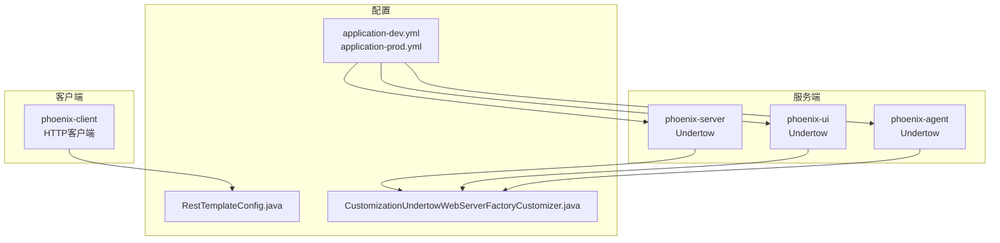
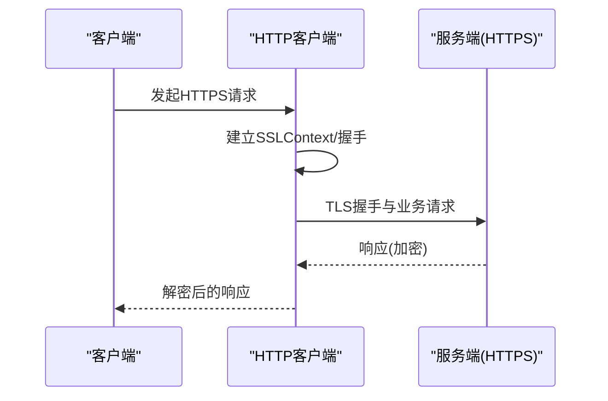
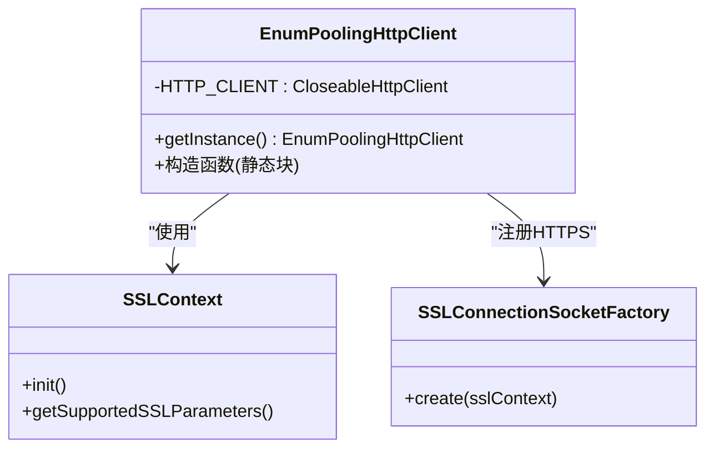
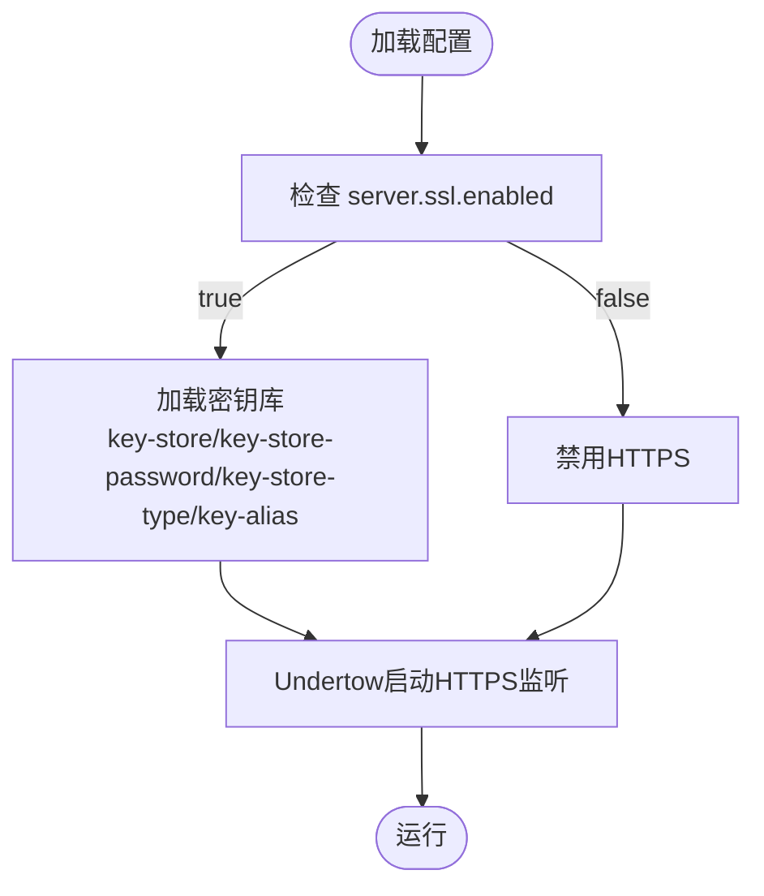
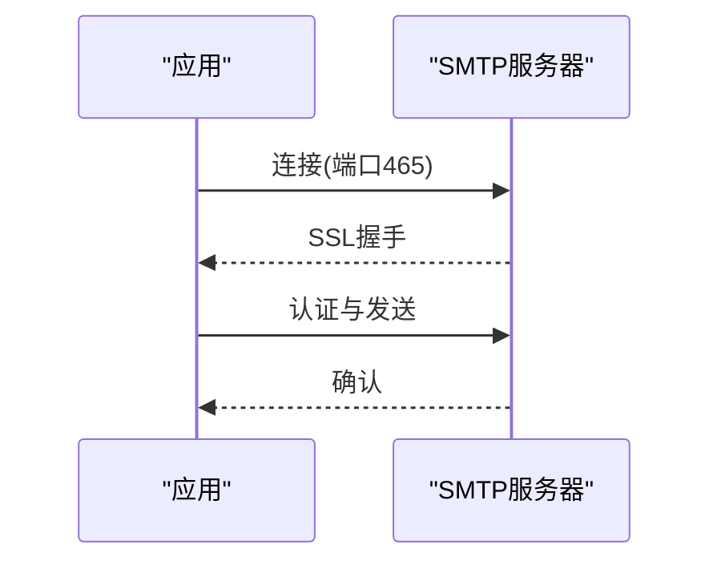
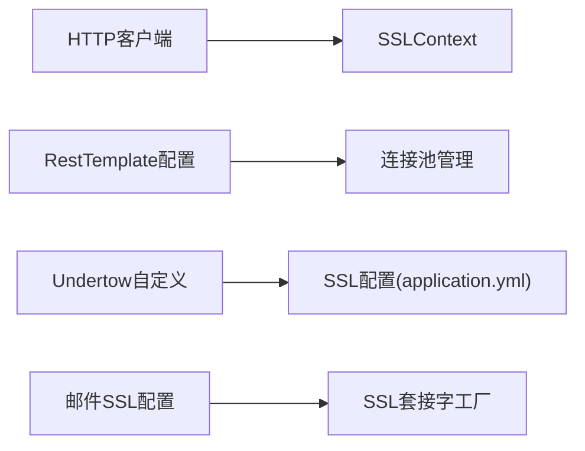

# SSL证书配置

<cite>
**本文引用的文件**
- [phoenix-client 核心模块 HTTP 客户端配置](file://phoenix-client/phoenix-client-core/src/main/java/com/gitee/pifeng/monitoring/plug/core/EnumPoolingHttpClient.java)
- [phoenix-server 应用配置（开发环境）](file://phoenix-server/src/main/resources/application-dev.yml)
- [phoenix-server 应用配置（生产环境）](file://phoenix-server/src/main/resources/application-prod.yml)
- [phoenix-ui 应用配置（开发环境）](file://phoenix-ui/src/main/resources/application-dev.yml)
- [phoenix-ui 应用配置（生产环境）](file://phoenix-ui/src/main/resources/application-prod.yml)
- [phoenix-server RestTemplate 客户端配置](file://phoenix-server/src/main/java/com/gitee/pifeng/monitoring/server/config/RestTemplateConfig.java)
- [phoenix-agent RestTemplate 客户端配置](file://phoenix-agent/src/main/java/com/gitee/pifeng/monitoring/agent/config/RestTemplateConfig.java)
- [phoenix-server Undertow 自定义配置](file://phoenix-server/src/main/java/com/gitee/pifeng/monitoring/common/web/core/CustomizationUndertowWebServerFactoryCustomizer.java)
- [phoenix-ui Undertow 自定义配置](file://phoenix-ui/src/main/java/com/gitee/pifeng/monitoring/common/web/core/CustomizationUndertowWebServerFactoryCustomizer.java)
- [phoenix-agent Undertow 自定义配置](file://phoenix-agent/src/main/java/com/gitee/pifeng/monitoring/common/web/core/CustomizationUndertowWebServerFactoryCustomizer.java)
- [phoenix-server Windows 服务配置示例（含HTTPS注释）](file://doc/WindowsServices/phoenix-server/phoenixServer.xml)
- [phoenix-ui Windows 服务配置示例（含HTTPS注释）](file://doc/WindowsServices/phoenix-ui/phoenixUI.xml)
- [phoenix-agent Windows 服务配置示例（含HTTPS注释）](file://doc/WindowsServices/phoenix-agent/phoenixAgent.xml)
</cite>

## 目录
1. [简介](#简介)
2. [项目结构](#项目结构)
3. [核心组件](#核心组件)
4. [架构总览](#架构总览)
5. [详细组件分析](#详细组件分析)
6. [依赖关系分析](#依赖关系分析)
7. [性能考量](#性能考量)
8. [故障排除指南](#故障排除指南)
9. [结论](#结论)
10. [附录](#附录)

## 简介
本指南面向Phoenix监控系统的SSL/TLS证书配置，结合代码库中的实际配置与实现，系统阐述以下内容：
- SSL/TLS证书的安全保障作用：数据加密、身份验证、完整性保护
- 证书申请与安装：自签名证书、CA机构证书、通配符证书
- 证书格式转换与管理：PEM、DER、JKS、PFX互转与证书链配置
- 证书更新与自动化：Let's Encrypt、自动续期脚本、监控告警
- 性能优化：TLS版本、加密套件、会话复用
- 故障排除：证书过期、格式错误、兼容性问题

## 项目结构
Phoenix项目采用多模块架构，SSL/TLS相关内容主要分布在以下位置：
- 客户端HTTP通信：phoenix-client 核心模块中基于Apache HttpClient的连接池与SSL上下文配置
- 服务端Web容器：phoenix-server、phoenix-ui、phoenix-agent均使用Undertow，具备HTTP/HTTPS能力
- 配置文件：各模块的application.yml中包含SSL开关与证书库配置项
- 外部集成：邮件发送使用SMTP/SSL与STARTTLS配置

**图表来源**
- [phoenix-client 核心模块 HTTP 客户端配置:111-157](file://phoenix-client/phoenix-client-core/src/main/java/com/gitee/pifeng/monitoring/plug/core/EnumPoolingHttpClient.java#L111-L157)
- [phoenix-server 应用配置（开发环境）:1-38](file://phoenix-server/src/main/resources/application-dev.yml#L1-L38)
- [phoenix-ui 应用配置（开发环境）:1-49](file://phoenix-ui/src/main/resources/application-dev.yml#L1-L49)
- [phoenix-server Undertow 自定义配置:37-54](file://phoenix-server/src/main/java/com/gitee/pifeng/monitoring/common/web/core/CustomizationUndertowWebServerFactoryCustomizer.java#L37-L54)

**章节来源**
- [phoenix-client 核心模块 HTTP 客户端配置:111-157](file://phoenix-client/phoenix-client-core/src/main/java/com/gitee/pifeng/monitoring/plug/core/EnumPoolingHttpClient.java#L111-L157)
- [phoenix-server 应用配置（开发环境）:1-38](file://phoenix-server/src/main/resources/application-dev.yml#L1-L38)
- [phoenix-ui 应用配置（开发环境）:1-49](file://phoenix-ui/src/main/resources/application-dev.yml#L1-L49)

## 核心组件
- HTTP客户端SSL配置：基于Apache HttpClient的连接池与SSLContext，支持HTTPS与信任策略
- Undertow Web容器：内置HTTP/HTTPS支持，可通过配置启用SSL
- 邮件发送SSL：SMTP/SSL与STARTTLS配置，确保邮件传输安全
- Windows服务配置：示例中包含HTTPS认证的注释说明

**章节来源**
- [phoenix-client 核心模块 HTTP 客户端配置:111-157](file://phoenix-client/phoenix-client-core/src/main/java/com/gitee/pifeng/monitoring/plug/core/EnumPoolingHttpClient.java#L111-L157)
- [phoenix-server 应用配置（开发环境）:17-38](file://phoenix-server/src/main/resources/application-dev.yml#L17-L38)
- [phoenix-ui 应用配置（开发环境）:1-49](file://phoenix-ui/src/main/resources/application-dev.yml#L1-L49)
- [phoenix-server Windows 服务配置示例（含HTTPS注释）:275-277](file://doc/WindowsServices/phoenix-server/phoenixServer.xml#L275-L277)
- [phoenix-ui Windows 服务配置示例（含HTTPS注释）:275-277](file://doc/WindowsServices/phoenix-ui/phoenixUI.xml#L275-L277)
- [phoenix-agent Windows 服务配置示例（含HTTPS注释）:275-277](file://doc/WindowsServices/phoenix-agent/phoenixAgent.xml#L275-L277)

## 架构总览
Phoenix的SSL/TLS涉及客户端与服务端两大方向：
- 客户端：通过HTTP客户端发起HTTPS请求，使用统一的SSLContext与连接池
- 服务端：Undertow作为Web容器，支持HTTP/HTTPS，配置项位于application.yml中
- 邮件：SMTP/SSL与STARTTLS确保邮件通道安全

**图表来源**
- [phoenix-client 核心模块 HTTP 客户端配置:126-143](file://phoenix-client/phoenix-client-core/src/main/java/com/gitee/pifeng/monitoring/plug/core/EnumPoolingHttpClient.java#L126-L143)

## 详细组件分析

### 组件A：HTTP客户端SSL配置
- 功能概述：创建并配置SSLContext，注册HTTPS Socket工厂，构建连接池，支持HTTPS请求
- 关键点：
  - 使用SSLContext与信任策略，支持系统默认回退
  - 注册HTTP/HTTPS协议工厂，统一连接池管理
  - 超时与连接池参数可调，满足高并发场景

**图表来源**
- [phoenix-client 核心模块 HTTP 客户端配置:111-157](file://phoenix-client/phoenix-client-core/src/main/java/com/gitee/pifeng/monitoring/plug/core/EnumPoolingHttpClient.java#L111-L157)

**章节来源**
- [phoenix-client 核心模块 HTTP 客户端配置:111-157](file://phoenix-client/phoenix-client-core/src/main/java/com/gitee/pifeng/monitoring/plug/core/EnumPoolingHttpClient.java#L111-L157)

### 组件B：服务端SSL配置（基于Undertow）
- 功能概述：通过application.yml启用HTTPS，证书库路径与别名在配置中预留
- 关键点：
  - server.ssl.enabled 控制HTTPS开关
  - key-store、key-store-password、key-store-type、key-alias 等为证书库相关配置项
  - Undertow自定义配置可调整超时与缓冲等参数

**图表来源**
- [phoenix-ui 应用配置（开发环境）:2-12](file://phoenix-ui/src/main/resources/application-dev.yml#L2-L12)
- [phoenix-ui 应用配置（生产环境）:2-12](file://phoenix-ui/src/main/resources/application-prod.yml#L2-L12)

**章节来源**
- [phoenix-ui 应用配置（开发环境）:2-12](file://phoenix-ui/src/main/resources/application-dev.yml#L2-L12)
- [phoenix-ui 应用配置（生产环境）:2-12](file://phoenix-ui/src/main/resources/application-prod.yml#L2-L12)
- [phoenix-server Undertow 自定义配置:37-54](file://phoenix-server/src/main/java/com/gitee/pifeng/monitoring/common/web/core/CustomizationUndertowWebServerFactoryCustomizer.java#L37-L54)

### 组件C：邮件发送SSL配置
- 功能概述：SMTP/SSL与STARTTLS配置，确保邮件传输安全
- 关键点：
  - mail.smtp.ssl.enabled 启用SSL
  - mail.smtp.starttls.enable 与 required 控制STARTTLS
  - socketFactory.port/class/fallback 指定SSL套接字工厂

**图表来源**
- [phoenix-server 应用配置（开发环境）:25-38](file://phoenix-server/src/main/resources/application-dev.yml#L25-L38)
- [phoenix-server 应用配置（生产环境）:25-38](file://phoenix-server/src/main/resources/application-prod.yml#L25-L38)

**章节来源**
- [phoenix-server 应用配置（开发环境）:25-38](file://phoenix-server/src/main/resources/application-dev.yml#L25-L38)
- [phoenix-server 应用配置（生产环境）:25-38](file://phoenix-server/src/main/resources/application-prod.yml#L25-L38)

### 组件D：Windows服务中的HTTPS认证示例
- 功能概述：Windows服务配置示例中包含HTTPS认证注释，便于理解安全认证流程
- 关键点：
  - 示例展示了通过HTTPS进行安全认证的配置思路
  - 适用于服务启动时的外部资源下载与认证场景

**章节来源**
- [phoenix-server Windows 服务配置示例（含HTTPS注释）:275-277](file://doc/WindowsServices/phoenix-server/phoenixServer.xml#L275-L277)
- [phoenix-ui Windows 服务配置示例（含HTTPS注释）:275-277](file://doc/WindowsServices/phoenix-ui/phoenixUI.xml#L275-L277)
- [phoenix-agent Windows 服务配置示例（含HTTPS注释）:275-277](file://doc/WindowsServices/phoenix-agent/phoenixAgent.xml#L275-L277)

## 依赖关系分析
- 客户端依赖：HTTP客户端依赖SSLContext与连接池，用于HTTPS请求
- 服务端依赖：Undertow依赖application.yml中的SSL配置，实现HTTPS监听
- 邮件依赖：SMTP配置依赖SSL与STARTTLS参数，确保传输安全

**图表来源**
- [phoenix-client 核心模块 HTTP 客户端配置:111-157](file://phoenix-client/phoenix-client-core/src/main/java/com/gitee/pifeng/monitoring/plug/core/EnumPoolingHttpClient.java#L111-L157)
- [phoenix-server RestTemplate 客户端配置:95-116](file://phoenix-server/src/main/java/com/gitee/pifeng/monitoring/server/config/RestTemplateConfig.java#L95-L116)
- [phoenix-agent RestTemplate 客户端配置:98-115](file://phoenix-agent/src/main/java/com/gitee/pifeng/monitoring/agent/config/RestTemplateConfig.java#L98-L115)
- [phoenix-server 应用配置（开发环境）:25-38](file://phoenix-server/src/main/resources/application-dev.yml#L25-L38)
- [phoenix-ui 应用配置（开发环境）:2-12](file://phoenix-ui/src/main/resources/application-dev.yml#L2-L12)

**章节来源**
- [phoenix-client 核心模块 HTTP 客户端配置:111-157](file://phoenix-client/phoenix-client-core/src/main/java/com/gitee/pifeng/monitoring/plug/core/EnumPoolingHttpClient.java#L111-L157)
- [phoenix-server RestTemplate 客户端配置:95-116](file://phoenix-server/src/main/java/com/gitee/pifeng/monitoring/server/config/RestTemplateConfig.java#L95-L116)
- [phoenix-agent RestTemplate 客户端配置:98-115](file://phoenix-agent/src/main/java/com/gitee/pifeng/monitoring/agent/config/RestTemplateConfig.java#L98-L115)
- [phoenix-server 应用配置（开发环境）:25-38](file://phoenix-server/src/main/resources/application-dev.yml#L25-L38)
- [phoenix-ui 应用配置（开发环境）:2-12](file://phoenix-ui/src/main/resources/application-dev.yml#L2-L12)

## 性能考量
- TLS版本与加密套件：在客户端SSLContext中可配置支持的协议与套件，建议优先使用现代TLS版本与高性能套件
- 连接池与超时：合理设置连接池大小、连接超时与Socket配置，避免高并发下的连接池耗尽
- Undertow超时参数：通过自定义配置调整Idle Timeout、Request Parse Timeout等，提升抗慢连接攻击能力
- 会话复用：在服务端启用会话复用可显著降低握手开销，提升吞吐量

**章节来源**
- [phoenix-client 核心模块 HTTP 客户端配置:126-157](file://phoenix-client/phoenix-client-core/src/main/java/com/gitee/pifeng/monitoring/plug/core/EnumPoolingHttpClient.java#L126-L157)
- [phoenix-server Undertow 自定义配置:37-54](file://phoenix-server/src/main/java/com/gitee/pifeng/monitoring/common/web/core/CustomizationUndertowWebServerFactoryCustomizer.java#L37-L54)
- [phoenix-ui Undertow 自定义配置:37-54](file://phoenix-ui/src/main/java/com/gitee/pifeng/monitoring/common/web/core/CustomizationUndertowWebServerFactoryCustomizer.java#L37-L54)
- [phoenix-agent Undertow 自定义配置:37-54](file://phoenix-agent/src/main/java/com/gitee/pifeng/monitoring/common/web/core/CustomizationUndertowWebServerFactoryCustomizer.java#L37-L54)

## 故障排除指南
- 证书过期：检查证书有效期，及时续期；在生产环境中配置自动监控与告警
- 格式错误：确认证书格式（PEM/PKCS12/JKS/PFX）与配置项一致；证书链完整
- 兼容性问题：确保客户端与服务端支持相同的TLS版本与加密套件；必要时降级或升级
- 握手失败：检查SSLContext初始化与信任策略；核对主机名校验逻辑
- 连接池耗尽：增大连接池上限或缩短超时时间；优化请求处理逻辑

**章节来源**
- [phoenix-client 核心模块 HTTP 客户端配置:126-136](file://phoenix-client/phoenix-client-core/src/main/java/com/gitee/pifeng/monitoring/plug/core/EnumPoolingHttpClient.java#L126-L136)
- [phoenix-server 应用配置（开发环境）:25-38](file://phoenix-server/src/main/resources/application-dev.yml#L25-L38)
- [phoenix-ui 应用配置（开发环境）:2-12](file://phoenix-ui/src/main/resources/application-dev.yml#L2-L12)

## 结论
Phoenix监控系统在SSL/TLS方面提供了完善的基础设施：客户端通过HTTP客户端实现HTTPS请求，服务端通过Undertow支持HTTPS监听，邮件发送采用SMTP/SSL与STARTTLS保障传输安全。结合合理的性能优化与故障排除策略，可为企业级部署提供可靠的安全保障。

## 附录
- 证书申请与安装：根据实际需求选择自签名、CA机构或通配符证书，并正确配置密钥库与别名
- 证书格式转换：PEM/PKCS12/JKS/PFX之间的转换需遵循标准流程，确保私钥与证书链完整
- 自动化运维：结合Let's Encrypt与定时任务实现证书自动续期，并配置监控告警
- 性能优化：优先TLS 1.3、现代加密套件与会话复用，配合连接池与超时参数调优