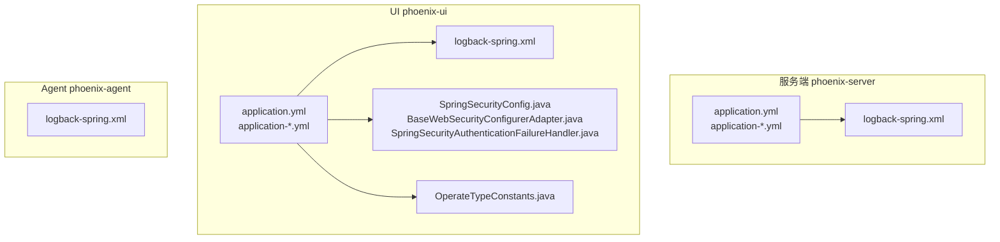
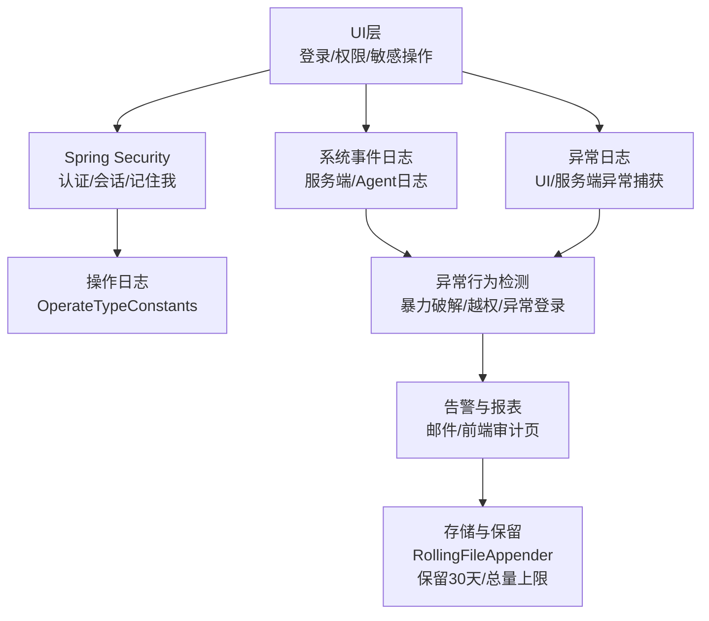
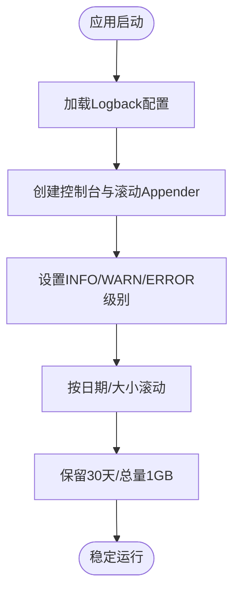
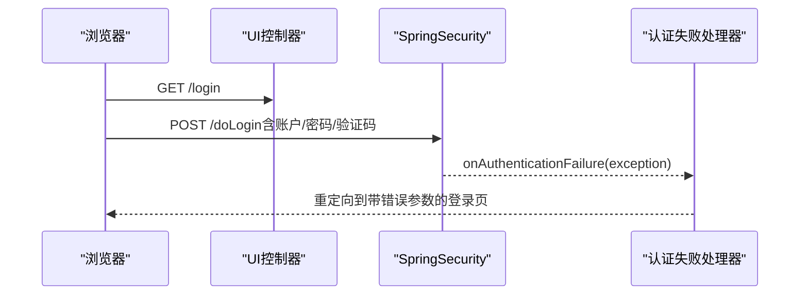
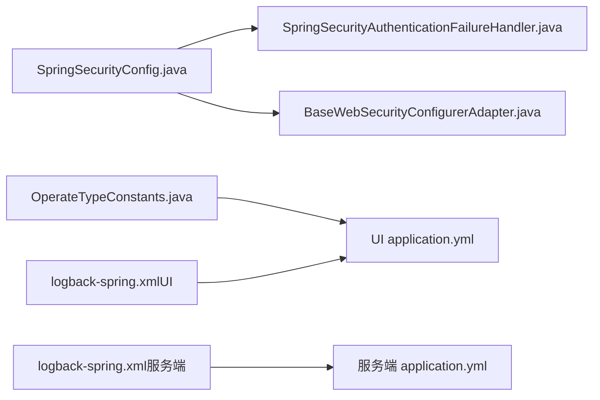

# 安全审计配置

<cite>
**本文引用的文件**
- [application.yml](file://phoenix-server/src/main/resources/application.yml)
- [application-dev.yml](file://phoenix-server/src/main/resources/application-dev.yml)
- [application-prod.yml](file://phoenix-server/src/main/resources/application-prod.yml)
- [logback-spring.xml（服务端）](file://phoenix-server/src/main/resources/logback-spring.xml)
- [application.yml（UI）](file://phoenix-ui/src/main/resources/application.yml)
- [application-dev.yml（UI）](file://phoenix-ui/src/main/resources/application-dev.yml)
- [application-prod.yml（UI）](file://phoenix-ui/src/main/resources/application-prod.yml)
- [logback-spring.xml（UI）](file://phoenix-ui/src/main/resources/logback-spring.xml)
- [logback-spring.xml（Agent）](file://phoenix-agent/src/main/resources/logback-spring.xml)
- [SpringSecurityConfig.java](file://phoenix-ui/src/main/java/com/gitee/pifeng/monitoring/ui/config/springsecurity/SpringSecurityConfig.java)
- [BaseWebSecurityConfigurerAdapter.java](file://phoenix-ui/src/main/java/com/gitee/pifeng/monitoring/ui/config/springsecurity/BaseWebSecurityConfigurerAdapter.java)
- [SpringSecurityAuthenticationFailureHandler.java](file://phoenix-ui/src/main/java/com/gitee/pifeng/monitoring/ui/config/springsecurity/SpringSecurityAuthenticationFailureHandler.java)
- [OperateTypeConstants.java](file://phoenix-ui/src/main/java/com/gitee/pifeng/monitoring/ui/constant/OperateTypeConstants.java)
</cite>

## 目录
1. [简介](#简介)
2. [项目结构](#项目结构)
3. [核心组件](#核心组件)
4. [架构总览](#架构总览)
5. [详细组件分析](#详细组件分析)
6. [依赖关系分析](#依赖关系分析)
7. [性能考量](#性能考量)
8. [故障排查指南](#故障排查指南)
9. [结论](#结论)
10. [附录](#附录)

## 简介
本文件面向Phoenix监控系统的安全审计配置，围绕操作日志、系统事件日志、异常日志的记录策略与配置方法展开，结合登录尝试监控、权限变更监控、敏感操作监控等安全事件检测与告警机制，提供异常行为检测（异常登录、暴力破解防护、越权访问）的配置指南。同时，说明审计日志的数据结构与存储策略（字段定义、存储格式、保留周期），以及日志查询、统计分析与报表生成的使用方法，并给出合规性要求与配置建议。

## 项目结构
Phoenix由三部分组成：服务端（phoenix-server）、UI（phoenix-ui）、Agent（phoenix-agent）。各模块均具备独立的日志配置与安全配置，便于在不同环境（开发/生产）下灵活切换。

图表来源
- [application.yml（服务端）:1-271](file://phoenix-server/src/main/resources/application.yml#L1-L271)
- [application.yml（UI）:1-238](file://phoenix-ui/src/main/resources/application.yml#L1-L238)
- [logback-spring.xml（服务端）:1-120](file://phoenix-server/src/main/resources/logback-spring.xml#L1-L120)
- [logback-spring.xml（UI）:1-120](file://phoenix-ui/src/main/resources/logback-spring.xml#L1-L120)
- [logback-spring.xml（Agent）:1-120](file://phoenix-agent/src/main/resources/logback-spring.xml#L1-L120)
- [SpringSecurityConfig.java:1-236](file://phoenix-ui/src/main/java/com/gitee/pifeng/monitoring/ui/config/springsecurity/SpringSecurityConfig.java#L1-L236)
- [BaseWebSecurityConfigurerAdapter.java:1-52](file://phoenix-ui/src/main/java/com/gitee/pifeng/monitoring/ui/config/springsecurity/BaseWebSecurityConfigurerAdapter.java#L1-L52)
- [SpringSecurityAuthenticationFailureHandler.java:1-67](file://phoenix-ui/src/main/java/com/gitee/pifeng/monitoring/ui/config/springsecurity/SpringSecurityAuthenticationFailureHandler.java#L1-L67)
- [OperateTypeConstants.java:1-64](file://phoenix-ui/src/main/java/com/gitee/pifeng/monitoring/ui/constant/OperateTypeConstants.java#L1-L64)

章节来源
- [application.yml（服务端）:1-271](file://phoenix-server/src/main/resources/application.yml#L1-L271)
- [application.yml（UI）:1-238](file://phoenix-ui/src/main/resources/application.yml#L1-L238)
- [logback-spring.xml（服务端）:1-120](file://phoenix-server/src/main/resources/logback-spring.xml#L1-L120)
- [logback-spring.xml（UI）:1-120](file://phoenix-ui/src/main/resources/logback-spring.xml#L1-L120)
- [logback-spring.xml（Agent）:1-120](file://phoenix-agent/src/main/resources/logback-spring.xml#L1-L120)

## 核心组件
- 日志基础设施：基于Logback的滚动日志配置，按天分片、按大小轮转、设定保留周期与总量上限。
- 安全框架：Spring Security集成，支持自认证与CAS第三方认证，登录失败处理与验证码校验。
- 操作日志：统一的操作类型常量，用于标识登录、登出、新增、更新、删除、查询、导出、访问页面、控制、测试等操作。
- 系统事件与异常：服务端与UI各自独立的日志配置，确保系统事件与异常可被分别采集与归档。
- 配置隔离：开发与生产环境的application-*.yml分离，便于差异化部署与审计策略落地。

章节来源
- [logback-spring.xml（服务端）:24-47](file://phoenix-server/src/main/resources/logback-spring.xml#L24-L47)
- [logback-spring.xml（UI）:24-47](file://phoenix-ui/src/main/resources/logback-spring.xml#L24-L47)
- [SpringSecurityConfig.java:111-166](file://phoenix-ui/src/main/java/com/gitee/pifeng/monitoring/ui/config/springsecurity/SpringSecurityConfig.java#L111-L166)
- [OperateTypeConstants.java:11-64](file://phoenix-ui/src/main/java/com/gitee/pifeng/monitoring/ui/constant/OperateTypeConstants.java#L11-L64)

## 架构总览
Phoenix的安全审计体系以“日志采集—事件分类—异常检测—告警与报表”为主线，贯穿UI登录、权限变更、敏感操作等关键场景。

图表来源
- [SpringSecurityConfig.java:111-166](file://phoenix-ui/src/main/java/com/gitee/pifeng/monitoring/ui/config/springsecurity/SpringSecurityConfig.java#L111-L166)
- [OperateTypeConstants.java:11-64](file://phoenix-ui/src/main/java/com/gitee/pifeng/monitoring/ui/constant/OperateTypeConstants.java#L11-L64)
- [logback-spring.xml（UI）:24-47](file://phoenix-ui/src/main/resources/logback-spring.xml#L24-L47)
- [logback-spring.xml（服务端）:24-47](file://phoenix-server/src/main/resources/logback-spring.xml#L24-L47)

## 详细组件分析

### 日志基础设施与存储策略
- 存储位置：服务端、UI、Agent分别在独立目录下滚动保存日志。
- 分割策略：按日期与文件大小滚动，避免单文件过大。
- 保留策略：最多保留30天，总量上限1GB，防止磁盘占用无限增长。
- 输出级别：根日志级别为INFO，同时输出控制台与多文件Appender（包含WARN、ERROR专用文件）。

图表来源
- [logback-spring.xml（服务端）:24-47](file://phoenix-server/src/main/resources/logback-spring.xml#L24-L47)
- [logback-spring.xml（UI）:24-47](file://phoenix-ui/src/main/resources/logback-spring.xml#L24-L47)
- [logback-spring.xml（Agent）:24-47](file://phoenix-agent/src/main/resources/logback-spring.xml#L24-L47)

章节来源
- [logback-spring.xml（服务端）:1-120](file://phoenix-server/src/main/resources/logback-spring.xml#L1-L120)
- [logback-spring.xml（UI）:1-120](file://phoenix-ui/src/main/resources/logback-spring.xml#L1-L120)
- [logback-spring.xml（Agent）:1-120](file://phoenix-agent/src/main/resources/logback-spring.xml#L1-L120)

### 操作日志记录机制
- 操作类型常量：集中定义登录、登出、新增、更新、删除、查询、导出、访问页面、控制、测试等操作类型，便于统一识别与统计。
- 记录范围：登录/登出、用户管理、资源变更、导出报表、页面访问等关键业务流程。
- 建议扩展：在业务层统一埋点，结合操作类型常量与当前用户、IP、时间、结果等上下文，形成标准化审计轨迹。

章节来源
- [OperateTypeConstants.java:11-64](file://phoenix-ui/src/main/java/com/gitee/pifeng/monitoring/ui/constant/OperateTypeConstants.java#L11-L64)

### 系统事件日志
- 服务端与UI均开启Undertow访问日志，目录位于各自日志目录下的undertow子目录，格式为common。
- 结合Logback滚动策略，系统事件与异常可与业务日志一致地进行归档与清理。

章节来源
- [application.yml（服务端）:8-18](file://phoenix-server/src/main/resources/application.yml#L8-L18)
- [application.yml（UI）:14-26](file://phoenix-ui/src/main/resources/application.yml#L14-L26)
- [logback-spring.xml（服务端）:1-120](file://phoenix-server/src/main/resources/logback-spring.xml#L1-L120)
- [logback-spring.xml（UI）:1-120](file://phoenix-ui/src/main/resources/logback-spring.xml#L1-L120)

### 异常日志
- UI与服务端均采用独立的ERROR专用Appender，确保异常信息单独落盘，便于快速定位问题。
- 建议在异常处理器中补充关键上下文（如用户、IP、请求URI、参数摘要等），并结合异常类型进行分级处理。

章节来源
- [logback-spring.xml（UI）:80-109](file://phoenix-ui/src/main/resources/logback-spring.xml#L80-L109)
- [logback-spring.xml（服务端）:80-109](file://phoenix-server/src/main/resources/logback-spring.xml#L80-L109)

### 安全事件监控：登录尝试监控
- 登录流程：UI通过Spring Security配置登录页、登录处理URL、认证失败处理器与验证码过滤器（可选）。
- 失败处理：认证失败时根据异常类型重定向至带参数的登录页，便于前端提示与后续审计。
- 会话与记住我：支持会话并发控制、超时与过期处理，配合审计可识别异常登录行为。

图表来源
- [SpringSecurityConfig.java:111-166](file://phoenix-ui/src/main/java/com/gitee/pifeng/monitoring/ui/config/springsecurity/SpringSecurityConfig.java#L111-L166)
- [SpringSecurityAuthenticationFailureHandler.java:38-64](file://phoenix-ui/src/main/java/com/gitee/pifeng/monitoring/ui/config/springsecurity/SpringSecurityAuthenticationFailureHandler.java#L38-L64)

章节来源
- [SpringSecurityConfig.java:111-166](file://phoenix-ui/src/main/java/com/gitee/pifeng/monitoring/ui/config/springsecurity/SpringSecurityConfig.java#L111-L166)
- [SpringSecurityAuthenticationFailureHandler.java:1-67](file://phoenix-ui/src/main/java/com/gitee/pifeng/monitoring/ui/config/springsecurity/SpringSecurityAuthenticationFailureHandler.java#L1-L67)

### 权限变更监控
- 权限变更通常发生在用户管理、角色分配、资源授权等操作中。建议在对应业务接口处统一埋点，记录操作类型、操作人、目标对象、变更前后状态、IP、时间与结果。
- 与操作日志常量配合，形成完整的权限变更审计链路。

章节来源
- [OperateTypeConstants.java:24-36](file://phoenix-ui/src/main/java/com/gitee/pifeng/monitoring/ui/constant/OperateTypeConstants.java#L24-L36)

### 敏感操作监控
- 敏感操作包括但不限于删除、导出、批量变更等。建议在接口层增加统一埋点，记录操作上下文与结果，结合异常日志进行联动分析。
- 对于高风险操作，可引入二次确认与审批流程，并在审计中体现审批状态。

章节来源
- [OperateTypeConstants.java:24-46](file://phoenix-ui/src/main/java/com/gitee/pifeng/monitoring/ui/constant/OperateTypeConstants.java#L24-L46)

### 异常行为检测配置指南
- 异常登录检测：基于登录失败日志与IP聚合统计，识别短时间内来自同一IP的多次失败尝试，触发告警。
- 暴力破解防护：结合登录失败阈值与封禁策略（如临时封禁IP或账户），在UI侧可结合验证码与登录限制策略。
- 越权访问检测：通过接口访问日志与权限注解（prePostEnabled已启用）结合，识别未授权访问尝试，记录用户、资源、权限与结果。

章节来源
- [SpringSecurityConfig.java:36-38](file://phoenix-ui/src/main/java/com/gitee/pifeng/monitoring/ui/config/springsecurity/SpringSecurityConfig.java#L36-L38)
- [application.yml（UI）:14-26](file://phoenix-ui/src/main/resources/application.yml#L14-L26)

### 审计日志的数据结构与存储
- 字段建议（示例维度）：时间戳、用户标识、IP地址、操作类型（参考操作类型常量）、资源标识、请求参数摘要、结果状态、耗时、异常信息摘要。
- 存储格式：文本行式日志，按天分片，保留30天，总量不超过1GB。
- 保留周期：按配置文件设置，生产环境建议结合磁盘容量与合规要求调整。

章节来源
- [logback-spring.xml（服务端）:28-38](file://phoenix-server/src/main/resources/logback-spring.xml#L28-L38)
- [logback-spring.xml（UI）:28-38](file://phoenix-ui/src/main/resources/logback-spring.xml#L28-L38)
- [OperateTypeConstants.java:11-64](file://phoenix-ui/src/main/java/com/gitee/pifeng/monitoring/ui/constant/OperateTypeConstants.java#L11-L64)

### 审计日志的查询与分析
- 查询入口：UI模板中提供“日志-操作”、“日志-异常”等页面，支持按时间段、操作类型、用户、IP等条件检索。
- 统计分析：结合日志滚动策略与保留周期，定期生成登录成功率、异常分布、高频操作TOP等报表。
- 报表生成：建议在服务端或Agent侧定期汇总日志并生成固定格式报表，满足合规审计需求。

章节来源
- [application.yml（UI）:1-238](file://phoenix-ui/src/main/resources/application.yml#L1-L238)

### 合规性要求与配置建议
- 审计标准：确保操作日志、系统事件日志、异常日志完整、不可抵赖、可追溯。
- 报告格式：建议采用结构化日志（如JSON）与固定字段清单，便于自动化解析与报表生成。
- 法规遵循：结合所在地区与行业要求（如网络安全法、等级保护等），明确日志保留期限与访问控制策略。

章节来源
- [application.yml（服务端）:1-271](file://phoenix-server/src/main/resources/application.yml#L1-L271)
- [application.yml（UI）:1-238](file://phoenix-ui/src/main/resources/application.yml#L1-L238)

## 依赖关系分析
- UI层依赖Spring Security进行认证与会话管理，登录失败处理器负责将异常映射到登录页参数，便于前端提示与审计。
- 日志配置相互独立但策略一致，服务端与UI均采用RollingFileAppender并设置保留策略。
- 操作类型常量为审计提供统一语义，便于跨模块一致性。

图表来源
- [SpringSecurityConfig.java:111-166](file://phoenix-ui/src/main/java/com/gitee/pifeng/monitoring/ui/config/springsecurity/SpringSecurityConfig.java#L111-L166)
- [SpringSecurityAuthenticationFailureHandler.java:38-64](file://phoenix-ui/src/main/java/com/gitee/pifeng/monitoring/ui/config/springsecurity/SpringSecurityAuthenticationFailureHandler.java#L38-L64)
- [BaseWebSecurityConfigurerAdapter.java:18-49](file://phoenix-ui/src/main/java/com/gitee/pifeng/monitoring/ui/config/springsecurity/BaseWebSecurityConfigurerAdapter.java#L18-L49)
- [OperateTypeConstants.java:11-64](file://phoenix-ui/src/main/java/com/gitee/pifeng/monitoring/ui/constant/OperateTypeConstants.java#L11-L64)
- [logback-spring.xml（UI）:24-47](file://phoenix-ui/src/main/resources/logback-spring.xml#L24-L47)
- [logback-spring.xml（服务端）:24-47](file://phoenix-server/src/main/resources/logback-spring.xml#L24-L47)
- [application.yml（UI）:1-238](file://phoenix-ui/src/main/resources/application.yml#L1-L238)
- [application.yml（服务端）:1-271](file://phoenix-server/src/main/resources/application.yml#L1-L271)

章节来源
- [SpringSecurityConfig.java:1-236](file://phoenix-ui/src/main/java/com/gitee/pifeng/monitoring/ui/config/springsecurity/SpringSecurityConfig.java#L1-L236)
- [SpringSecurityAuthenticationFailureHandler.java:1-67](file://phoenix-ui/src/main/java/com/gitee/pifeng/monitoring/ui/config/springsecurity/SpringSecurityAuthenticationFailureHandler.java#L1-L67)
- [BaseWebSecurityConfigurerAdapter.java:1-52](file://phoenix-ui/src/main/java/com/gitee/pifeng/monitoring/ui/config/springsecurity/BaseWebSecurityConfigurerAdapter.java#L1-L52)
- [OperateTypeConstants.java:1-64](file://phoenix-ui/src/main/java/com/gitee/pifeng/monitoring/ui/constant/OperateTypeConstants.java#L1-L64)
- [logback-spring.xml（UI）:1-120](file://phoenix-ui/src/main/resources/logback-spring.xml#L1-L120)
- [logback-spring.xml（服务端）:1-120](file://phoenix-server/src/main/resources/logback-spring.xml#L1-L120)
- [application.yml（UI）:1-238](file://phoenix-ui/src/main/resources/application.yml#L1-L238)
- [application.yml（服务端）:1-271](file://phoenix-server/src/main/resources/application.yml#L1-L271)

## 性能考量
- 日志滚动与保留：按天分片与总量上限可有效控制磁盘占用，避免I/O放大。
- 会话并发与超时：合理设置最大会话数与过期策略，减少会话冲突与资源浪费。
- 认证失败处理：将失败原因映射到登录页参数，避免重复提交与无效计算。

## 故障排查指南
- 登录失败无提示：检查认证失败处理器是否正确设置默认失败URL与参数映射。
- 验证码异常：根据异常消息重定向到相应错误参数，前端据此提示“验证码为空/不存在/已过期/校验失败”。
- 日志未生成：确认Logback配置是否加载、日志目录是否存在且可写、Rolling策略是否生效。

章节来源
- [SpringSecurityAuthenticationFailureHandler.java:38-64](file://phoenix-ui/src/main/java/com/gitee/pifeng/monitoring/ui/config/springsecurity/SpringSecurityAuthenticationFailureHandler.java#L38-L64)
- [logback-spring.xml（UI）:1-120](file://phoenix-ui/src/main/resources/logback-spring.xml#L1-L120)

## 结论
Phoenix的安全审计配置以日志基础设施为核心，结合Spring Security的认证与会话管理，形成覆盖登录、权限变更、敏感操作的审计闭环。通过统一的操作类型常量与独立的异常日志Appender，系统能够在开发与生产环境中稳定落地审计策略，并为异常行为检测与合规报告提供可靠支撑。

## 附录
- 开发与生产环境差异：服务端与UI的application-*.yml分别定义了数据库连接、邮件配置与认证策略，部署时需按环境选择对应配置文件。
- 配置加载顺序：application.yml作为基础配置，application-dev.yml与application-prod.yml按激活profile覆盖基础项。

章节来源
- [application.yml（服务端）:56-58](file://phoenix-server/src/main/resources/application.yml#L56-L58)
- [application-dev.yml（服务端）:1-38](file://phoenix-server/src/main/resources/application-dev.yml#L1-L38)
- [application-prod.yml（服务端）:1-38](file://phoenix-server/src/main/resources/application-prod.yml#L1-L38)
- [application.yml（UI）:65-67](file://phoenix-ui/src/main/resources/application.yml#L65-L67)
- [application-dev.yml（UI）:1-49](file://phoenix-ui/src/main/resources/application-dev.yml#L1-L49)
- [application-prod.yml（UI）:1-39](file://phoenix-ui/src/main/resources/application-prod.yml#L1-L39)