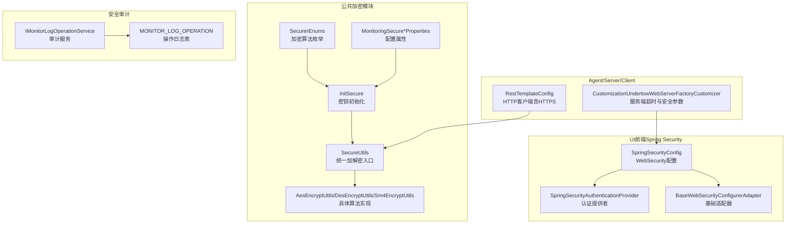
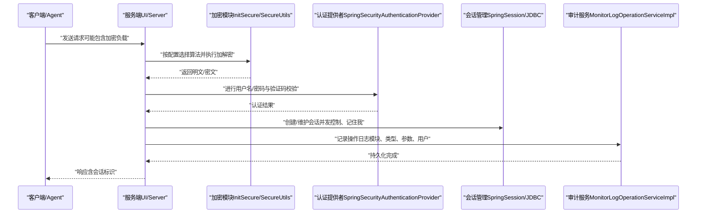
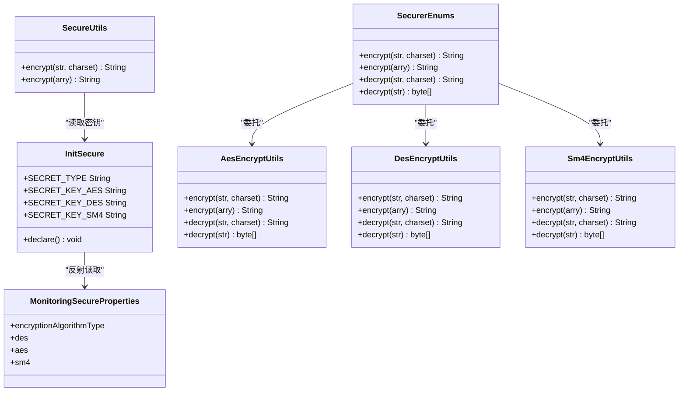
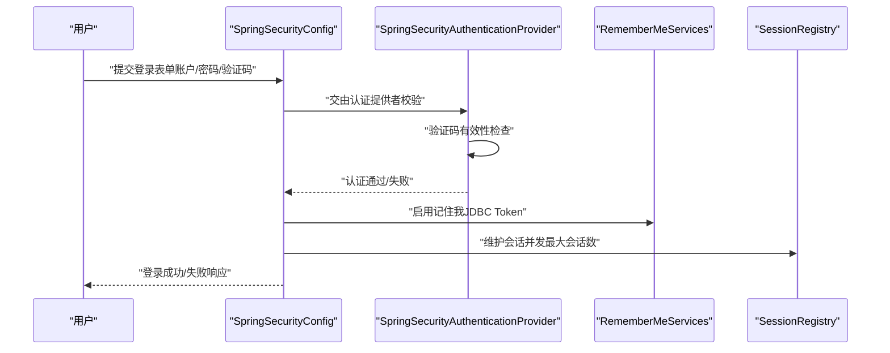
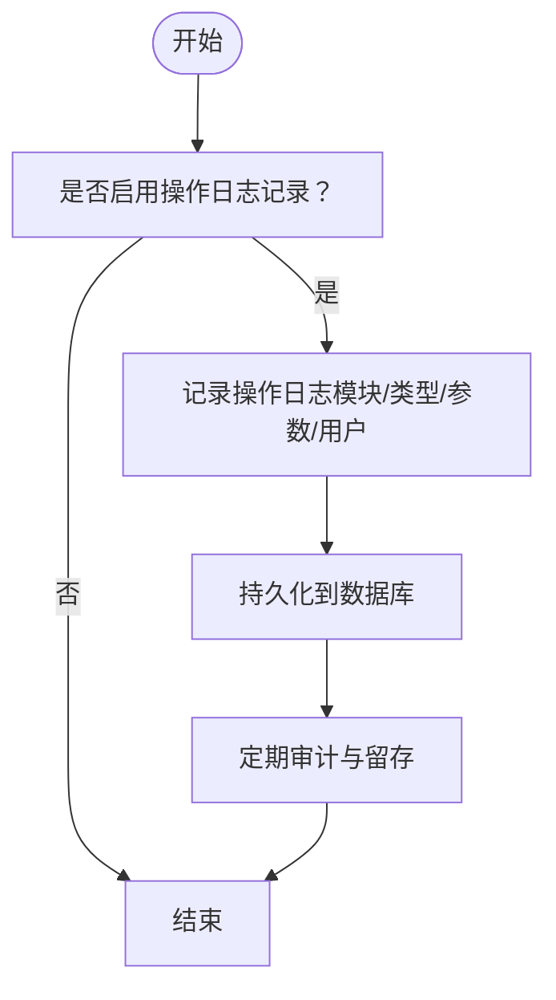
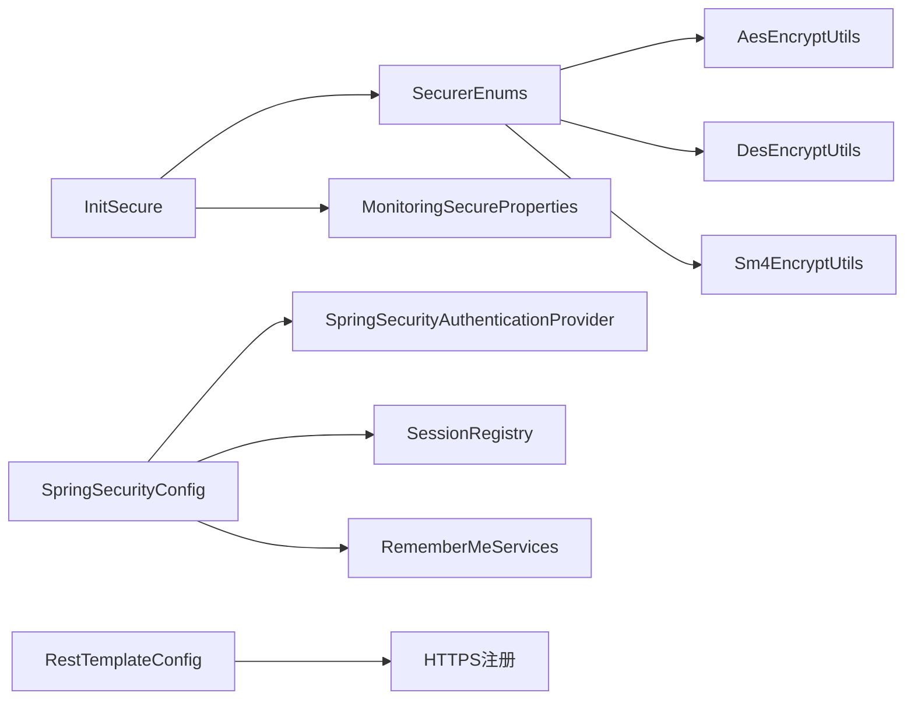

# 安全配置

<cite>
**本文引用的文件**
- [SecurerEnums.java](file://phoenix-common/phoenix-common-core/src/main/java/com/gitee/pifeng/monitoring/common/constant/SecurerEnums.java)
- [InitSecure.java](file://phoenix-common/phoenix-common-core/src/main/java/com/gitee/pifeng/monitoring/common/init/InitSecure.java)
- [MonitoringSecureProperties.java](file://phoenix-common/phoenix-common-core/src/main/java/com/gitee/pifeng/monitoring/common/property/client/MonitoringSecureProperties.java)
- [MonitoringSecureAesProperties.java](file://phoenix-common/phoenix-common-core/src/main/java/com/gitee/pifeng/monitoring/common/property/client/MonitoringSecureAesProperties.java)
- [MonitoringSecureDesProperties.java](file://phoenix-common/phoenix-common-core/src/main/java/com/gitee/pifeng/monitoring/common/property/client/MonitoringSecureDesProperties.java)
- [MonitoringSecureSm4Properties.java](file://phoenix-common/phoenix-common-core/src/main/java/com/gitee/pifeng/monitoring/common/property/client/MonitoringSecureSm4Properties.java)
- [AesEncryptUtils.java](file://phoenix-common/phoenix-common-core/src/main/java/com/gitee/pifeng/monitoring/common/util/secure/AesEncryptUtils.java)
- [DesEncryptUtils.java](file://phoenix-common/phoenix-common-core/src/main/java/com/gitee/pifeng/monitoring/common/util/secure/DesEncryptUtils.java)
- [Sm4EncryptUtils.java](file://phoenix-common/phoenix-common-core/src/main/java/com/gitee/pifeng/monitoring/common/util/secure/Sm4EncryptUtils.java)
- [SecureUtils.java](file://phoenix-common/phoenix-common-core/src/main/java/com/gitee/pifeng/monitoring/common/util/secure/SecureUtils.java)
- [SpringSecurityConfig.java](file://phoenix-ui/src/main/java/com/gitee/pifeng/monitoring/ui/config/springsecurity/SpringSecurityConfig.java)
- [SpringSecurityAuthenticationProvider.java](file://phoenix-ui/src/main/java/com/gitee/pifeng/monitoring/ui/config/springsecurity/SpringSecurityAuthenticationProvider.java)
- [BaseWebSecurityConfigurerAdapter.java](file://phoenix-ui/src/main/java/com/gitee/pifeng/monitoring/ui/config/springsecurity/BaseWebSecurityConfigurerAdapter.java)
- [application.yml](file://phoenix-ui/src/main/resources/application.yml)
- [IMonitorLogOperationService.java](file://phoenix-ui/src/main/java/com/gitee/pifeng/monitoring/ui/business/web/service/IMonitorLogOperationService.java)
- [IMonitorLogOperationDao.java](file://phoenix-ui/src/main/java/com/gitee/pifeng/monitoring/ui/business/web/dao/IMonitorLogOperationDao.java)
- [MonitorLogOperationServiceImpl.java](file://phoenix-ui/src/main/java/com/gitee/pifeng/monitoring/ui/business/web/service/impl/MonitorLogOperationServiceImpl.java)
- [phoenix.sql](file://doc/数据库设计/sql/mysql/phoenix.sql)
- [RestTemplateConfig.java（客户端）](file://phoenix-client/phoenix-client-core/src/main/java/com/gitee/pifeng/monitoring/plug/core/EnumPoolingHttpClient.java)
- [RestTemplateConfig.java（服务端）](file://phoenix-server/src/main/java/com/gitee/pifeng/monitoring/server/config/RestTemplateConfig.java)
- [RestTemplateConfig.java（Agent）](file://phoenix-agent/src/main/java/com/gitee/pifeng/monitoring/agent/config/RestTemplateConfig.java)
- [CustomizationUndertowWebServerFactoryCustomizer.java](file://phoenix-common/phoenix-common-web/src/main/java/com/gitee/pifeng/monitoring/common/web/core/CustomizationUndertowWebServerFactoryCustomizer.java)
</cite>

## 目录
1. [简介](#简介)
2. [项目结构](#项目结构)
3. [核心组件](#核心组件)
4. [架构总览](#架构总览)
5. [详细组件分析](#详细组件分析)
6. [依赖分析](#依赖分析)
7. [性能考量](#性能考量)
8. [故障排查指南](#故障排查指南)
9. [结论](#结论)
10. [附录](#附录)

## 简介
本文件面向Phoenix监控系统的安全配置，围绕以下目标展开：
- 数据传输加密配置：AES、DES、SM4等算法的配置与使用方法，以及算法与密钥长度的选择建议
- 访问控制配置：用户认证、权限控制、角色管理与Spring Security集成
- SSL/TLS证书配置：证书申请、安装、配置与更新的完整流程
- 安全审计配置：操作日志记录、安全事件监控与异常行为检测
- Spring Security配置：认证提供者、过滤器链、会话管理等组件
- 最佳实践：密码策略、会话安全、CSRF防护等安全措施

## 项目结构
Phoenix采用多模块分层架构，安全相关能力分布在公共加密模块、UI前端（Spring Security）、Agent与Server的HTTP通信模块中，并通过数据库表支撑安全审计。

图表来源
- [SecurerEnums.java:18-94](file://phoenix-common/phoenix-common-core/src/main/java/com/gitee/pifeng/monitoring/common/constant/SecurerEnums.java#L18-L94)
- [InitSecure.java:50-87](file://phoenix-common/phoenix-common-core/src/main/java/com/gitee/pifeng/monitoring/common/init/InitSecure.java#L50-L87)
- [SecureUtils.java:34-40](file://phoenix-common/phoenix-common-core/src/main/java/com/gitee/pifeng/monitoring/common/util/secure/SecureUtils.java#L34-L40)
- [AesEncryptUtils.java:30-33](file://phoenix-common/phoenix-common-core/src/main/java/com/gitee/pifeng/monitoring/common/util/secure/AesEncryptUtils.java#L30-L33)
- [DesEncryptUtils.java:30-33](file://phoenix-common/phoenix-common-core/src/main/java/com/gitee/pifeng/monitoring/common/util/secure/DesEncryptUtils.java#L30-L33)
- [Sm4EncryptUtils.java:30-33](file://phoenix-common/phoenix-common-core/src/main/java/com/gitee/pifeng/monitoring/common/util/secure/Sm4EncryptUtils.java#L30-L33)
- [MonitoringSecureProperties.java:23-45](file://phoenix-common/phoenix-common-core/src/main/java/com/gitee/pifeng/monitoring/common/property/client/MonitoringSecureProperties.java#L23-L45)
- [SpringSecurityConfig.java:96-166](file://phoenix-ui/src/main/java/com/gitee/pifeng/monitoring/ui/config/springsecurity/SpringSecurityConfig.java#L96-L166)
- [SpringSecurityAuthenticationProvider.java:48-91](file://phoenix-ui/src/main/java/com/gitee/pifeng/monitoring/ui/config/springsecurity/SpringSecurityAuthenticationProvider.java#L48-L91)
- [BaseWebSecurityConfigurerAdapter.java:18-49](file://phoenix-ui/src/main/java/com/gitee/pifeng/monitoring/ui/config/springsecurity/BaseWebSecurityConfigurerAdapter.java#L18-L49)
- [RestTemplateConfig.java（客户端）:139-143](file://phoenix-client/phoenix-client-core/src/main/java/com/gitee/pifeng/monitoring/plug/core/EnumPoolingHttpClient.java#L139-L143)
- [CustomizationUndertowWebServerFactoryCustomizer.java:44-51](file://phoenix-common/phoenix-common-web/src/main/java/com/gitee/pifeng/monitoring/common/web/core/CustomizationUndertowWebServerFactoryCustomizer.java#L44-L51)
- [IMonitorLogOperationService.java:39-77](file://phoenix-ui/src/main/java/com/gitee/pifeng/monitoring/ui/business/web/service/IMonitorLogOperationService.java#L39-L77)
- [phoenix.sql:500-520](file://doc/数据库设计/sql/mysql/phoenix.sql#L500-L520)

章节来源
- [application.yml:1-238](file://phoenix-ui/src/main/resources/application.yml#L1-L238)

## 核心组件
- 加密算法与密钥管理
  - 加密算法枚举：AES、DES、SM4
  - 统一加解密入口：根据运行时配置动态选择算法
  - 密钥初始化：通过反射从配置对象中提取密钥
- 认证与授权
  - 自定义认证提供者：支持登录验证码校验与密码编码器
  - Web安全配置：登录、记住我、会话并发控制、退出登录、头部安全策略
- 传输安全
  - HTTP客户端支持HTTPS
  - Undertow服务端超时与安全参数定制
- 安全审计
  - 操作日志表与服务接口
  - 支持删除与清空操作日志

章节来源
- [SecurerEnums.java:18-94](file://phoenix-common/phoenix-common-core/src/main/java/com/gitee/pifeng/monitoring/common/constant/SecurerEnums.java#L18-L94)
- [InitSecure.java:50-87](file://phoenix-common/phoenix-common-core/src/main/java/com/gitee/pifeng/monitoring/common/init/InitSecure.java#L50-L87)
- [SecureUtils.java:34-40](file://phoenix-common/phoenix-common-core/src/main/java/com/gitee/pifeng/monitoring/common/util/secure/SecureUtils.java#L34-L40)
- [SpringSecurityConfig.java:96-166](file://phoenix-ui/src/main/java/com/gitee/pifeng/monitoring/ui/config/springsecurity/SpringSecurityConfig.java#L96-L166)
- [SpringSecurityAuthenticationProvider.java:48-91](file://phoenix-ui/src/main/java/com/gitee/pifeng/monitoring/ui/config/springsecurity/SpringSecurityAuthenticationProvider.java#L48-L91)
- [RestTemplateConfig.java（客户端）:139-143](file://phoenix-client/phoenix-client-core/src/main/java/com/gitee/pifeng/monitoring/plug/core/EnumPoolingHttpClient.java#L139-L143)
- [CustomizationUndertowWebServerFactoryCustomizer.java:44-51](file://phoenix-common/phoenix-common-web/src/main/java/com/gitee/pifeng/monitoring/common/web/core/CustomizationUndertowWebServerFactoryCustomizer.java#L44-L51)
- [IMonitorLogOperationService.java:39-77](file://phoenix-ui/src/main/java/com/gitee/pifeng/monitoring/ui/business/web/service/IMonitorLogOperationService.java#L39-L77)

## 架构总览
下图展示了从配置加载到加解密执行、从认证到会话管理、从HTTP传输到安全审计的整体流程。

图表来源
- [InitSecure.java:50-87](file://phoenix-common/phoenix-common-core/src/main/java/com/gitee/pifeng/monitoring/common/init/InitSecure.java#L50-L87)
- [SecureUtils.java:34-40](file://phoenix-common/phoenix-common-core/src/main/java/com/gitee/pifeng/monitoring/common/util/secure/SecureUtils.java#L34-L40)
- [SpringSecurityAuthenticationProvider.java:64-91](file://phoenix-ui/src/main/java/com/gitee/pifeng/monitoring/ui/config/springsecurity/SpringSecurityAuthenticationProvider.java#L64-L91)
- [SpringSecurityConfig.java:112-166](file://phoenix-ui/src/main/java/com/gitee/pifeng/monitoring/ui/config/springsecurity/SpringSecurityConfig.java#L112-L166)
- [MonitorLogOperationServiceImpl.java:103-143](file://phoenix-ui/src/main/java/com/gitee/pifeng/monitoring/ui/business/web/service/impl/MonitorLogOperationServiceImpl.java#L103-L143)

## 详细组件分析

### 数据传输加密配置（AES/DES/SM4）
- 配置加载
  - 通过反射从配置对象中读取加密算法类型与密钥，分别支持DES、AES、SM4
  - 若未加载到配置，加解密功能将被禁用
- 算法实现
  - AES/DES/SM4均基于Base64解码的密钥进行加解密
  - 提供字符串与字节数组两种加解密入口
- 使用建议
  - 优先选择AES，兼顾性能与安全性
  - SM4适用于国产化合规场景
  - DES已不推荐使用，仅用于兼容历史系统

图表来源
- [SecurerEnums.java:18-94](file://phoenix-common/phoenix-common-core/src/main/java/com/gitee/pifeng/monitoring/common/constant/SecurerEnums.java#L18-L94)
- [InitSecure.java:50-87](file://phoenix-common/phoenix-common-core/src/main/java/com/gitee/pifeng/monitoring/common/init/InitSecure.java#L50-L87)
- [SecureUtils.java:34-40](file://phoenix-common/phoenix-common-core/src/main/java/com/gitee/pifeng/monitoring/common/util/secure/SecureUtils.java#L34-L40)
- [AesEncryptUtils.java:30-33](file://phoenix-common/phoenix-common-core/src/main/java/com/gitee/pifeng/monitoring/common/util/secure/AesEncryptUtils.java#L30-L33)
- [DesEncryptUtils.java:30-33](file://phoenix-common/phoenix-common-core/src/main/java/com/gitee/pifeng/monitoring/common/util/secure/DesEncryptUtils.java#L30-L33)
- [Sm4EncryptUtils.java:30-33](file://phoenix-common/phoenix-common-core/src/main/java/com/gitee/pifeng/monitoring/common/util/secure/Sm4EncryptUtils.java#L30-L33)
- [MonitoringSecureProperties.java:23-45](file://phoenix-common/phoenix-common-core/src/main/java/com/gitee/pifeng/monitoring/common/property/client/MonitoringSecureProperties.java#L23-L45)

章节来源
- [SecurerEnums.java:18-94](file://phoenix-common/phoenix-common-core/src/main/java/com/gitee/pifeng/monitoring/common/constant/SecurerEnums.java#L18-L94)
- [InitSecure.java:50-87](file://phoenix-common/phoenix-common-core/src/main/java/com/gitee/pifeng/monitoring/common/init/InitSecure.java#L50-L87)
- [MonitoringSecureProperties.java:23-45](file://phoenix-common/phoenix-common-core/src/main/java/com/gitee/pifeng/monitoring/common/property/client/MonitoringSecureProperties.java#L23-L45)
- [MonitoringSecureAesProperties.java:21-29](file://phoenix-common/phoenix-common-core/src/main/java/com/gitee/pifeng/monitoring/common/property/client/MonitoringSecureAesProperties.java#L21-L29)
- [MonitoringSecureDesProperties.java:21-29](file://phoenix-common/phoenix-common-core/src/main/java/com/gitee/pifeng/monitoring/common/property/client/MonitoringSecureDesProperties.java#L21-L29)
- [MonitoringSecureSm4Properties.java:21-29](file://phoenix-common/phoenix-common-core/src/main/java/com/gitee/pifeng/monitoring/common/property/client/MonitoringSecureSm4Properties.java#L21-L29)
- [AesEncryptUtils.java:30-33](file://phoenix-common/phoenix-common-core/src/main/java/com/gitee/pifeng/monitoring/common/util/secure/AesEncryptUtils.java#L30-L33)
- [DesEncryptUtils.java:30-33](file://phoenix-common/phoenix-common-core/src/main/java/com/gitee/pifeng/monitoring/common/util/secure/DesEncryptUtils.java#L30-L33)
- [Sm4EncryptUtils.java:30-33](file://phoenix-common/phoenix-common-core/src/main/java/com/gitee/pifeng/monitoring/common/util/secure/Sm4EncryptUtils.java#L30-L33)
- [SecureUtils.java:34-40](file://phoenix-common/phoenix-common-core/src/main/java/com/gitee/pifeng/monitoring/common/util/secure/SecureUtils.java#L34-L40)

### 访问控制与认证（Spring Security）
- 认证提供者
  - 支持登录验证码校验与过期控制
  - 结合BCrypt密码编码器进行密码比对
- Web安全配置
  - 登录页、登出、验证码接口放行
  - 任意请求需认证
  - 记住我（JDBC持久化token）
  - 会话并发控制（Spring Session + JDBC）
  - 退出登录清理Cookie与失效会话
  - 禁用frameOptions与缓存以满足UI需求
- 基础适配器
  - 统一忽略静态资源与健康端点

图表来源
- [SpringSecurityConfig.java:96-166](file://phoenix-ui/src/main/java/com/gitee/pifeng/monitoring/ui/config/springsecurity/SpringSecurityConfig.java#L96-L166)
- [SpringSecurityAuthenticationProvider.java:64-91](file://phoenix-ui/src/main/java/com/gitee/pifeng/monitoring/ui/config/springsecurity/SpringSecurityAuthenticationProvider.java#L64-L91)
- [BaseWebSecurityConfigurerAdapter.java:18-49](file://phoenix-ui/src/main/java/com/gitee/pifeng/monitoring/ui/config/springsecurity/BaseWebSecurityConfigurerAdapter.java#L18-L49)

章节来源
- [SpringSecurityConfig.java:96-166](file://phoenix-ui/src/main/java/com/gitee/pifeng/monitoring/ui/config/springsecurity/SpringSecurityConfig.java#L96-L166)
- [SpringSecurityAuthenticationProvider.java:48-91](file://phoenix-ui/src/main/java/com/gitee/pifeng/monitoring/ui/config/springsecurity/SpringSecurityAuthenticationProvider.java#L48-L91)
- [BaseWebSecurityConfigurerAdapter.java:18-49](file://phoenix-ui/src/main/java/com/gitee/pifeng/monitoring/ui/config/springsecurity/BaseWebSecurityConfigurerAdapter.java#L18-L49)
- [application.yml:51-57](file://phoenix-ui/src/main/resources/application.yml#L51-L57)

### SSL/TLS证书配置（HTTPS）
- 客户端/Agent/Server的HTTP客户端均注册了HTTPS协议
- 建议在生产环境为UI/Server配置HTTPS，确保数据传输加密
- 证书申请与安装流程（通用步骤）
  - 生成私钥与CSR
  - 申请/签发证书（自签/CA）
  - 安装证书至服务器（JKS/PKCS#12）
  - 配置反向代理或容器证书路径
  - 更新客户端信任库（如需双向TLS）
  - 验证证书链与有效期
  - 定期更新证书并轮换密钥

章节来源
- [RestTemplateConfig.java（客户端）:139-143](file://phoenix-client/phoenix-client-core/src/main/java/com/gitee/pifeng/monitoring/plug/core/EnumPoolingHttpClient.java#L139-L143)
- [RestTemplateConfig.java（服务端）:95-116](file://phoenix-server/src/main/java/com/gitee/pifeng/monitoring/server/config/RestTemplateConfig.java#L95-L116)
- [RestTemplateConfig.java（Agent）:98-115](file://phoenix-agent/src/main/java/com/gitee/pifeng/monitoring/agent/config/RestTemplateConfig.java#L98-L115)

### 安全审计配置（操作日志与异常监控）
- 数据模型
  - 操作日志表包含模块、类型、描述、请求/响应参数、用户ID等字段
- 服务能力
  - 分页查询、删除、清空操作日志
- 使用建议
  - 对敏感操作（新增/编辑/删除/配置变更）强制记录
  - 定期备份审计数据，设置保留周期
  - 建立异常日志表（系统异常）与操作日志联动分析

图表来源
- [IMonitorLogOperationService.java:39-77](file://phoenix-ui/src/main/java/com/gitee/pifeng/monitoring/ui/business/web/service/IMonitorLogOperationService.java#L39-L77)
- [IMonitorLogOperationDao.java:14-26](file://phoenix-ui/src/main/java/com/gitee/pifeng/monitoring/ui/business/web/dao/IMonitorLogOperationDao.java#L14-L26)
- [MonitorLogOperationServiceImpl.java:103-143](file://phoenix-ui/src/main/java/com/gitee/pifeng/monitoring/ui/business/web/service/impl/MonitorLogOperationServiceImpl.java#L103-L143)
- [phoenix.sql:500-520](file://doc/数据库设计/sql/mysql/phoenix.sql#L500-L520)

章节来源
- [IMonitorLogOperationService.java:39-77](file://phoenix-ui/src/main/java/com/gitee/pifeng/monitoring/ui/business/web/service/IMonitorLogOperationService.java#L39-L77)
- [IMonitorLogOperationDao.java:14-26](file://phoenix-ui/src/main/java/com/gitee/pifeng/monitoring/ui/business/web/dao/IMonitorLogOperationDao.java#L14-L26)
- [MonitorLogOperationServiceImpl.java:103-143](file://phoenix-ui/src/main/java/com/gitee/pifeng/monitoring/ui/business/web/service/impl/MonitorLogOperationServiceImpl.java#L103-L143)
- [phoenix.sql:500-520](file://doc/数据库设计/sql/mysql/phoenix.sql#L500-L520)

### Spring Security配置要点
- 认证提供者
  - 自定义DaoAuthenticationProvider，扩展验证码校验
  - 密码编码器使用BCrypt
- 过滤器链
  - 登录、记住我、会话管理、退出登录、头部安全策略
- 会话管理
  - JDBC存储、SpringSessionRememberMeServices、SessionRegistry并发控制
- 配置开关
  - 通过配置项控制是否启用自认证模式

章节来源
- [SpringSecurityConfig.java:96-166](file://phoenix-ui/src/main/java/com/gitee/pifeng/monitoring/ui/config/springsecurity/SpringSecurityConfig.java#L96-L166)
- [SpringSecurityAuthenticationProvider.java:48-91](file://phoenix-ui/src/main/java/com/gitee/pifeng/monitoring/ui/config/springsecurity/SpringSecurityAuthenticationProvider.java#L48-L91)
- [application.yml:38-39](file://phoenix-ui/src/main/resources/application.yml#L38-L39)

## 依赖分析
- 加密模块依赖
  - SecurerEnums作为统一入口，委托具体算法工具类
  - InitSecure通过反射读取配置属性，提供密钥常量
- 安全模块依赖
  - SpringSecurityConfig依赖认证提供者与会话组件
  - UI忽略静态资源与健康端点，减少安全压力
- 传输安全依赖
  - HTTP客户端注册HTTPS协议，服务端超时参数降低慢连接风险

图表来源
- [SecurerEnums.java:18-94](file://phoenix-common/phoenix-common-core/src/main/java/com/gitee/pifeng/monitoring/common/constant/SecurerEnums.java#L18-L94)
- [InitSecure.java:50-87](file://phoenix-common/phoenix-common-core/src/main/java/com/gitee/pifeng/monitoring/common/init/InitSecure.java#L50-L87)
- [SpringSecurityConfig.java:96-166](file://phoenix-ui/src/main/java/com/gitee/pifeng/monitoring/ui/config/springsecurity/SpringSecurityConfig.java#L96-L166)
- [RestTemplateConfig.java（客户端）:139-143](file://phoenix-client/phoenix-client-core/src/main/java/com/gitee/pifeng/monitoring/plug/core/EnumPoolingHttpClient.java#L139-L143)

章节来源
- [SecurerEnums.java:18-94](file://phoenix-common/phoenix-common-core/src/main/java/com/gitee/pifeng/monitoring/common/constant/SecurerEnums.java#L18-L94)
- [InitSecure.java:50-87](file://phoenix-common/phoenix-common-core/src/main/java/com/gitee/pifeng/monitoring/common/init/InitSecure.java#L50-L87)
- [SpringSecurityConfig.java:96-166](file://phoenix-ui/src/main/java/com/gitee/pifeng/monitoring/ui/config/springsecurity/SpringSecurityConfig.java#L96-L166)
- [RestTemplateConfig.java（客户端）:139-143](file://phoenix-client/phoenix-client-core/src/main/java/com/gitee/pifeng/monitoring/plug/core/EnumPoolingHttpClient.java#L139-L143)

## 性能考量
- 加密性能
  - AES通常优于DES，SM4在国产化场景具备优势
  - 建议在高并发场景使用AES并合理设置密钥长度
- 会话与连接
  - Spring Session JDBC存储与并发控制需结合业务量评估
  - Undertow超时参数有助于抵御慢连接攻击
- 日志与审计
  - 审计日志写入数据库可能带来IO压力，建议异步落盘或分区归档

## 故障排查指南
- 加密功能异常
  - 检查配置对象是否正确加载，确认密钥字段名称与反射读取一致
  - 确认密钥Base64编码正确
- 认证失败
  - 核对验证码是否过期或为空
  - 检查BCrypt编码器与数据库密码一致性
- 会话问题
  - 检查JDBC Token表是否创建成功
  - 确认SessionRegistry与RememberMeServices配置
- 审计日志缺失
  - 检查操作日志服务是否调用持久化接口
  - 确认数据库表结构与字段映射

章节来源
- [InitSecure.java:50-87](file://phoenix-common/phoenix-common-core/src/main/java/com/gitee/pifeng/monitoring/common/init/InitSecure.java#L50-L87)
- [SpringSecurityAuthenticationProvider.java:64-91](file://phoenix-ui/src/main/java/com/gitee/pifeng/monitoring/ui/config/springsecurity/SpringSecurityAuthenticationProvider.java#L64-L91)
- [SpringSecurityConfig.java:112-166](file://phoenix-ui/src/main/java/com/gitee/pifeng/monitoring/ui/config/springsecurity/SpringSecurityConfig.java#L112-L166)
- [IMonitorLogOperationService.java:39-77](file://phoenix-ui/src/main/java/com/gitee/pifeng/monitoring/ui/business/web/service/IMonitorLogOperationService.java#L39-L77)

## 结论
Phoenix的安全配置围绕“加密、认证、传输、审计”四条主线构建：通过统一的加密入口与配置加载机制保障数据传输安全；借助Spring Security实现强认证与细粒度授权；通过HTTPS与服务端超时参数强化传输与服务端安全；通过操作日志与异常监控完善安全审计闭环。建议在生产环境优先采用AES加密、启用HTTPS、严格管理会话并发，并持续优化审计策略与密钥轮换流程。

## 附录
- 最佳实践清单
  - 密码策略：使用BCrypt，强制复杂度与定期轮换
  - 会话安全：启用Spring Session JDBC、限制最大会话数、设置超时
  - CSRF防护：在Spring Security中启用CSRF（如适用）
  - 证书管理：定期更新证书、轮换密钥、监控到期
  - 审计留痕：对敏感操作强制记录，定期备份与合规审查