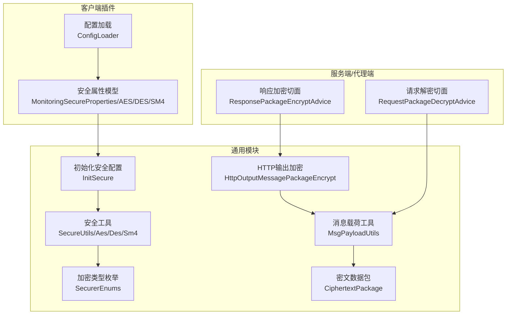
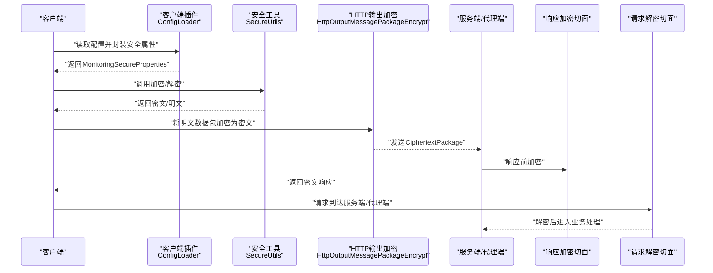
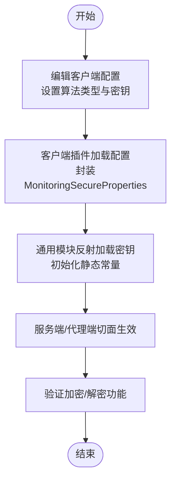
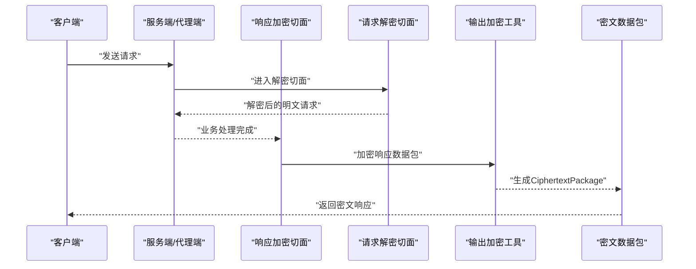
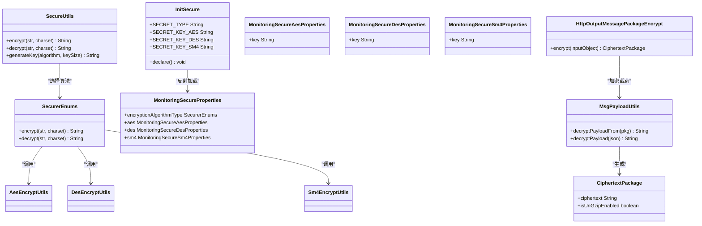

# 数据传输加密配置

<cite>
**本文引用的文件**
- [AesEncryptUtils.java](file://phoenix-common/phoenix-common-core/src/main/java/com/gitee/pifeng/monitoring/common/util/secure/AesEncryptUtils.java)
- [DesEncryptUtils.java](file://phoenix-common/phoenix-common-core/src/main/java/com/gitee/pifeng/monitoring/common/util/secure/DesEncryptUtils.java)
- [Sm4EncryptUtils.java](file://phoenix-common/phoenix-common-core/src/main/java/com/gitee/pifeng/monitoring/common/util/secure/Sm4EncryptUtils.java)
- [SecurerEnums.java](file://phoenix-common/phoenix-common-core/src/main/java/com/gitee/pifeng/monitoring/common/constant/SecurerEnums.java)
- [ISecurer.java](file://phoenix-common/phoenix-common-core/src/main/java/com/gitee/pifeng/monitoring/common/inf/ISecurer.java)
- [InitSecure.java](file://phoenix-common/phoenix-common-core/src/main/java/com/gitee/pifeng/monitoring/common/init/InitSecure.java)
- [SecureUtils.java](file://phoenix-common/phoenix-common-core/src/main/java/com/gitee/pifeng/monitoring/common/util/secure/SecureUtils.java)
- [MonitoringSecureProperties.java](file://phoenix-common/phoenix-common-core/src/main/java/com/gitee/pifeng/monitoring/common/property/client/MonitoringSecureProperties.java)
- [MonitoringSecureAesProperties.java](file://phoenix-common/phoenix-common-core/src/main/java/com/gitee/pifeng/monitoring/common/property/client/MonitoringSecureAesProperties.java)
- [MonitoringSecureDesProperties.java](file://phoenix-common/phoenix-common-core/src/main/java/com/gitee/pifeng/monitoring/common/property/client/MonitoringSecureDesProperties.java)
- [MonitoringSecureSm4Properties.java](file://phoenix-common/phoenix-common-core/src/main/java/com/gitee/pifeng/monitoring/common/property/client/MonitoringSecureSm4Properties.java)
- [ConfigLoader.java](file://phoenix-client/phoenix-client-core/src/main/java/com/gitee/pifeng/monitoring/plug/core/ConfigLoader.java)
- [HttpOutputMessagePackageEncrypt.java](file://phoenix-common/phoenix-common-web/src/main/java/com/gitee/pifeng/monitoring/common/web/core/http/HttpOutputMessagePackageEncrypt.java)
- [MsgPayloadUtils.java](file://phoenix-common/phoenix-common-core/src/main/java/com/gitee/pifeng/monitoring/common/util/MsgPayloadUtils.java)
- [ResponsePackageEncryptAdvice.java（服务端）](file://phoenix-server/src/main/java/com/gitee/pifeng/monitoring/server/business/server/component/ResponsePackageEncryptAdvice.java)
- [RequestPackageDecryptAdvice.java（服务端）](file://phoenix-server/src/main/java/com/gitee/pifeng/monitoring/server/business/server/component/RequestPackageDecryptAdvice.java)
- [ResponsePackageEncryptAdvice.java（代理端）](file://phoenix-agent/src/main/java/com/gitee/pifeng/monitoring/agent/component/ResponsePackageEncryptAdvice.java)
- [RequestPackageDecryptAdvice.java（代理端）](file://phoenix-agent/src/main/java/com/gitee/pifeng/monitoring/agent/component/RequestPackageDecryptAdvice.java)
- [CiphertextPackage.java](file://phoenix-common/phoenix-common-core/src/main/java/com/gitee/pifeng/monitoring/common/dto/CiphertextPackage.java)
- [monitoring.properties](file://phoenix-client/phoenix-client-core/src/main/resources/monitoring.properties)
</cite>

## 目录
1. [简介](#简介)
2. [项目结构](#项目结构)
3. [核心组件](#核心组件)
4. [架构总览](#架构总览)
5. [详细组件分析](#详细组件分析)
6. [依赖关系分析](#依赖关系分析)
7. [性能考虑](#性能考虑)
8. [故障排除指南](#故障排除指南)
9. [结论](#结论)
10. [附录](#附录)

## 简介
本文件面向Phoenix监控系统的数据传输加密配置，围绕AES、DES、SM4三种对称加密算法，系统性阐述算法特性、安全对比、配置参数、切换流程、工具类使用方法、性能优化策略以及故障排除要点。文档以代码为依据，结合配置加载与运行时加密流程，帮助读者在生产环境中安全、稳定地完成加密配置与运维。

## 项目结构
Phoenix的数据传输加密能力由“通用模块”中的安全工具与“客户端插件”中的配置加载共同构成，服务端与代理端通过统一的响应加密与请求解密切面完成端到端的密文封装与解封。

图表来源
- [InitSecure.java:50-87](file://phoenix-common/phoenix-common-core/src/main/java/com/gitee/pifeng/monitoring/common/init/InitSecure.java#L50-L87)
- [ConfigLoader.java:204-232](file://phoenix-client/phoenix-client-core/src/main/java/com/gitee/pifeng/monitoring/plug/core/ConfigLoader.java#L204-L232)
- [HttpOutputMessagePackageEncrypt.java:29-38](file://phoenix-common/phoenix-common-web/src/main/java/com/gitee/pifeng/monitoring/common/web/core/http/HttpOutputMessagePackageEncrypt.java#L29-L38)
- [MsgPayloadUtils.java:85-102](file://phoenix-common/phoenix-common-core/src/main/java/com/gitee/pifeng/monitoring/common/util/MsgPayloadUtils.java#L85-L102)

章节来源
- [InitSecure.java:50-87](file://phoenix-common/phoenix-common-core/src/main/java/com/gitee/pifeng/monitoring/common/init/InitSecure.java#L50-L87)
- [ConfigLoader.java:204-232](file://phoenix-client/phoenix-client-core/src/main/java/com/gitee/pifeng/monitoring/plug/core/ConfigLoader.java#L204-L232)
- [HttpOutputMessagePackageEncrypt.java:29-38](file://phoenix-common/phoenix-common-web/src/main/java/com/gitee/pifeng/monitoring/common/web/core/http/HttpOutputMessagePackageEncrypt.java#L29-L38)
- [MsgPayloadUtils.java:85-102](file://phoenix-common/phoenix-common-core/src/main/java/com/gitee/pifeng/monitoring/common/util/MsgPayloadUtils.java#L85-L102)

## 核心组件
- 加密算法工具类
  - AES：[AesEncryptUtils.java:30-79](file://phoenix-common/phoenix-common-core/src/main/java/com/gitee/pifeng/monitoring/common/util/secure/AesEncryptUtils.java#L30-L79)
  - DES：[DesEncryptUtils.java:30-79](file://phoenix-common/phoenix-common-core/src/main/java/com/gitee/pifeng/monitoring/common/util/secure/DesEncryptUtils.java#L30-L79)
  - SM4：[Sm4EncryptUtils.java:30-79](file://phoenix-common/phoenix-common-core/src/main/java/com/gitee/pifeng/monitoring/common/util/secure/Sm4EncryptUtils.java#L30-L79)
- 统一接口与枚举
  - 接口：[ISecurer.java:13-65](file://phoenix-common/phoenix-common-core/src/main/java/com/gitee/pifeng/monitoring/common/inf/ISecurer.java#L13-L65)
  - 枚举：[SecurerEnums.java:18-94](file://phoenix-common/phoenix-common-core/src/main/java/com/gitee/pifeng/monitoring/common/constant/SecurerEnums.java#L18-L94)
- 安全工具与初始化
  - 工具：[SecureUtils.java:34-95](file://phoenix-common/phoenix-common-core/src/main/java/com/gitee/pifeng/monitoring/common/util/secure/SecureUtils.java#L34-L95)
  - 初始化：[InitSecure.java:50-87](file://phoenix-common/phoenix-common-core/src/main/java/com/gitee/pifeng/monitoring/common/init/InitSecure.java#L50-L87)
- 配置模型与加载
  - 属性模型：[MonitoringSecureProperties.java:23-45](file://phoenix-common/phoenix-common-core/src/main/java/com/gitee/pifeng/monitoring/common/property/client/MonitoringSecureProperties.java#L23-L45)
  - AES属性：[MonitoringSecureAesProperties.java:21-29](file://phoenix-common/phoenix-common-core/src/main/java/com/gitee/pifeng/monitoring/common/property/client/MonitoringSecureAesProperties.java#L21-L29)
  - DES属性：[MonitoringSecureDesProperties.java:21-29](file://phoenix-common/phoenix-common-core/src/main/java/com/gitee/pifeng/monitoring/common/property/client/MonitoringSecureDesProperties.java#L21-L29)
  - SM4属性：[MonitoringSecureSm4Properties.java:21-29](file://phoenix-common/phoenix-common-core/src/main/java/com/gitee/pifeng/monitoring/common/property/client/MonitoringSecureSm4Properties.java#L21-L29)
  - 配置加载：[ConfigLoader.java:204-232](file://phoenix-client/phoenix-client-core/src/main/java/com/gitee/pifeng/monitoring/plug/core/ConfigLoader.java#L204-L232)
- HTTP端到端加密
  - 输出加密：[HttpOutputMessagePackageEncrypt.java:29-38](file://phoenix-common/phoenix-common-web/src/main/java/com/gitee/pifeng/monitoring/common/web/core/http/HttpOutputMessagePackageEncrypt.java#L29-L38)
  - 切面加密：[ResponsePackageEncryptAdvice.java（服务端）:55-63](file://phoenix-server/src/main/java/com/gitee/pifeng/monitoring/server/business/server/component/ResponsePackageEncryptAdvice.java#L55-L63)
  - 切面解密：[RequestPackageDecryptAdvice.java（服务端）:31-36](file://phoenix-server/src/main/java/com/gitee/pifeng/monitoring/server/business/server/component/RequestPackageDecryptAdvice.java#L31-L36)
  - 切面加密（代理端）：[ResponsePackageEncryptAdvice.java（代理端）:55-63](file://phoenix-agent/src/main/java/com/gitee/pifeng/monitoring/agent/component/ResponsePackageEncryptAdvice.java#L55-L63)
  - 切面解密（代理端）：[RequestPackageDecryptAdvice.java（代理端）:28-37](file://phoenix-agent/src/main/java/com/gitee/pifeng/monitoring/agent/component/RequestPackageDecryptAdvice.java#L28-L37)
  - 载荷解密：[MsgPayloadUtils.java:85-102](file://phoenix-common/phoenix-common-core/src/main/java/com/gitee/pifeng/monitoring/common/util/MsgPayloadUtils.java#L85-L102)
  - 密文DTO：[CiphertextPackage.java:21-33](file://phoenix-common/phoenix-common-core/src/main/java/com/gitee/pifeng/monitoring/common/dto/CiphertextPackage.java#L21-L33)

章节来源
- [AesEncryptUtils.java:30-79](file://phoenix-common/phoenix-common-core/src/main/java/com/gitee/pifeng/monitoring/common/util/secure/AesEncryptUtils.java#L30-L79)
- [DesEncryptUtils.java:30-79](file://phoenix-common/phoenix-common-core/src/main/java/com/gitee/pifeng/monitoring/common/util/secure/DesEncryptUtils.java#L30-L79)
- [Sm4EncryptUtils.java:30-79](file://phoenix-common/phoenix-common-core/src/main/java/com/gitee/pifeng/monitoring/common/util/secure/Sm4EncryptUtils.java#L30-L79)
- [ISecurer.java:13-65](file://phoenix-common/phoenix-common-core/src/main/java/com/gitee/pifeng/monitoring/common/inf/ISecurer.java#L13-L65)
- [SecurerEnums.java:18-94](file://phoenix-common/phoenix-common-core/src/main/java/com/gitee/pifeng/monitoring/common/constant/SecurerEnums.java#L18-L94)
- [SecureUtils.java:34-95](file://phoenix-common/phoenix-common-core/src/main/java/com/gitee/pifeng/monitoring/common/util/secure/SecureUtils.java#L34-L95)
- [InitSecure.java:50-87](file://phoenix-common/phoenix-common-core/src/main/java/com/gitee/pifeng/monitoring/common/init/InitSecure.java#L50-L87)
- [MonitoringSecureProperties.java:23-45](file://phoenix-common/phoenix-common-core/src/main/java/com/gitee/pifeng/monitoring/common/property/client/MonitoringSecureProperties.java#L23-L45)
- [MonitoringSecureAesProperties.java:21-29](file://phoenix-common/phoenix-common-core/src/main/java/com/gitee/pifeng/monitoring/common/property/client/MonitoringSecureAesProperties.java#L21-L29)
- [MonitoringSecureDesProperties.java:21-29](file://phoenix-common/phoenix-common-core/src/main/java/com/gitee/pifeng/monitoring/common/property/client/MonitoringSecureDesProperties.java#L21-L29)
- [MonitoringSecureSm4Properties.java:21-29](file://phoenix-common/phoenix-common-core/src/main/java/com/gitee/pifeng/monitoring/common/property/client/MonitoringSecureSm4Properties.java#L21-L29)
- [ConfigLoader.java:204-232](file://phoenix-client/phoenix-client-core/src/main/java/com/gitee/pifeng/monitoring/plug/core/ConfigLoader.java#L204-L232)
- [HttpOutputMessagePackageEncrypt.java:29-38](file://phoenix-common/phoenix-common-web/src/main/java/com/gitee/pifeng/monitoring/common/web/core/http/HttpOutputMessagePackageEncrypt.java#L29-L38)
- [ResponsePackageEncryptAdvice.java（服务端）:55-63](file://phoenix-server/src/main/java/com/gitee/pifeng/monitoring/server/business/server/component/ResponsePackageEncryptAdvice.java#L55-L63)
- [RequestPackageDecryptAdvice.java（服务端）:31-36](file://phoenix-server/src/main/java/com/gitee/pifeng/monitoring/server/business/server/component/RequestPackageDecryptAdvice.java#L31-L36)
- [ResponsePackageEncryptAdvice.java（代理端）:55-63](file://phoenix-agent/src/main/java/com/gitee/pifeng/monitoring/agent/component/ResponsePackageEncryptAdvice.java#L55-L63)
- [RequestPackageDecryptAdvice.java（代理端）:28-37](file://phoenix-agent/src/main/java/com/gitee/pifeng/monitoring/agent/component/RequestPackageDecryptAdvice.java#L28-L37)
- [MsgPayloadUtils.java:85-102](file://phoenix-common/phoenix-common-core/src/main/java/com/gitee/pifeng/monitoring/common/util/MsgPayloadUtils.java#L85-L102)
- [CiphertextPackage.java:21-33](file://phoenix-common/phoenix-common-core/src/main/java/com/gitee/pifeng/monitoring/common/dto/CiphertextPackage.java#L21-L33)

## 架构总览
Phoenix在客户端侧加载配置，服务端/代理端通过Spring MVC切面拦截请求与响应，使用统一的安全工具链进行加密与解密，最终以密文数据包形式在网络上传输。

图表来源
- [ConfigLoader.java:204-232](file://phoenix-client/phoenix-client-core/src/main/java/com/gitee/pifeng/monitoring/plug/core/ConfigLoader.java#L204-L232)
- [SecureUtils.java:34-95](file://phoenix-common/phoenix-common-core/src/main/java/com/gitee/pifeng/monitoring/common/util/secure/SecureUtils.java#L34-L95)
- [HttpOutputMessagePackageEncrypt.java:29-38](file://phoenix-common/phoenix-common-web/src/main/java/com/gitee/pifeng/monitoring/common/web/core/http/HttpOutputMessagePackageEncrypt.java#L29-L38)
- [ResponsePackageEncryptAdvice.java（服务端）:55-63](file://phoenix-server/src/main/java/com/gitee/pifeng/monitoring/server/business/server/component/ResponsePackageEncryptAdvice.java#L55-L63)
- [RequestPackageDecryptAdvice.java（服务端）:31-36](file://phoenix-server/src/main/java/com/gitee/pifeng/monitoring/server/business/server/component/RequestPackageDecryptAdvice.java#L31-L36)

## 详细组件分析

### 加密算法与配置参数
- AES
  - 工具类：[AesEncryptUtils.java:30-79](file://phoenix-common/phoenix-common-core/src/main/java/com/gitee/pifeng/monitoring/common/util/secure/AesEncryptUtils.java#L30-L79)
  - 配置键：monitoring.secure.aes.key
  - 配置加载：[ConfigLoader.java:248-264](file://phoenix-client/phoenix-client-core/src/main/java/com/gitee/pifeng/monitoring/plug/core/ConfigLoader.java#L248-L264)
  - 属性模型：[MonitoringSecureAesProperties.java:21-29](file://phoenix-common/phoenix-common-core/src/main/java/com/gitee/pifeng/monitoring/common/property/client/MonitoringSecureAesProperties.java#L21-L29)
- DES
  - 工具类：[DesEncryptUtils.java:30-79](file://phoenix-common/phoenix-common-core/src/main/java/com/gitee/pifeng/monitoring/common/util/secure/DesEncryptUtils.java#L30-L79)
  - 配置键：monitoring.secure.des.key
  - 配置加载：[ConfigLoader.java:266-296](file://phoenix-client/phoenix-client-core/src/main/java/com/gitee/pifeng/monitoring/plug/core/ConfigLoader.java#L266-L296)
  - 属性模型：[MonitoringSecureDesProperties.java:21-29](file://phoenix-common/phoenix-common-core/src/main/java/com/gitee/pifeng/monitoring/common/property/client/MonitoringSecureDesProperties.java#L21-L29)
- SM4
  - 工具类：[Sm4EncryptUtils.java:30-79](file://phoenix-common/phoenix-common-core/src/main/java/com/gitee/pifeng/monitoring/common/util/secure/Sm4EncryptUtils.java#L30-L79)
  - 配置键：monitoring.secure.sm4.key
  - 配置加载：[ConfigLoader.java:312-320](file://phoenix-client/phoenix-client-core/src/main/java/com/gitee/pifeng/monitoring/plug/core/ConfigLoader.java#L312-L320)
  - 属性模型：[MonitoringSecureSm4Properties.java:21-29](file://phoenix-common/phoenix-common-core/src/main/java/com/gitee/pifeng/monitoring/common/property/client/MonitoringSecureSm4Properties.java#L21-L29)

章节来源
- [AesEncryptUtils.java:30-79](file://phoenix-common/phoenix-common-core/src/main/java/com/gitee/pifeng/monitoring/common/util/secure/AesEncryptUtils.java#L30-L79)
- [DesEncryptUtils.java:30-79](file://phoenix-common/phoenix-common-core/src/main/java/com/gitee/pifeng/monitoring/common/util/secure/DesEncryptUtils.java#L30-L79)
- [Sm4EncryptUtils.java:30-79](file://phoenix-common/phoenix-common-core/src/main/java/com/gitee/pifeng/monitoring/common/util/secure/Sm4EncryptUtils.java#L30-L79)
- [ConfigLoader.java:248-264](file://phoenix-client/phoenix-client-core/src/main/java/com/gitee/pifeng/monitoring/plug/core/ConfigLoader.java#L248-L264)
- [ConfigLoader.java:266-296](file://phoenix-client/phoenix-client-core/src/main/java/com/gitee/pifeng/monitoring/plug/core/ConfigLoader.java#L266-L296)
- [ConfigLoader.java:312-320](file://phoenix-client/phoenix-client-core/src/main/java/com/gitee/pifeng/monitoring/plug/core/ConfigLoader.java#L312-L320)
- [MonitoringSecureAesProperties.java:21-29](file://phoenix-common/phoenix-common-core/src/main/java/com/gitee/pifeng/monitoring/common/property/client/MonitoringSecureAesProperties.java#L21-L29)
- [MonitoringSecureDesProperties.java:21-29](file://phoenix-common/phoenix-common-core/src/main/java/com/gitee/pifeng/monitoring/common/property/client/MonitoringSecureDesProperties.java#L21-L29)
- [MonitoringSecureSm4Properties.java:21-29](file://phoenix-common/phoenix-common-core/src/main/java/com/gitee/pifeng/monitoring/common/property/client/MonitoringSecureSm4Properties.java#L21-L29)

### 加密算法切换流程
- 配置修改
  - 在客户端配置文件中设置加密算法类型与对应密钥键值，参考：[monitoring.properties:3-9](file://phoenix-client/phoenix-client-core/src/main/resources/monitoring.properties#L3-L9)
  - 客户端插件根据配置封装MonitoringSecureProperties，参考：[ConfigLoader.java:204-232](file://phoenix-client/phoenix-client-core/src/main/java/com/gitee/pifeng/monitoring/plug/core/ConfigLoader.java#L204-L232)
- 初始化加载
  - 通用模块通过反射加载配置并初始化密钥常量，参考：[InitSecure.java:50-87](file://phoenix-common/phoenix-common-core/src/main/java/com/gitee/pifeng/monitoring/common/init/InitSecure.java#L50-L87)
- 重启生效
  - 服务端/代理端的切面在启动时生效，无需额外重启；如需强制预热，可调用初始化声明方法，参考：[InitSecure.java:210-213](file://phoenix-common/phoenix-common-core/src/main/java/com/gitee/pifeng/monitoring/common/init/InitSecure.java#L210-L213)
- 数据迁移
  - 切换算法不影响已加密数据的存储格式，但需确保两端同时切换，避免跨版本兼容问题；如需批量重加密，应在业务层按需实现

图表来源
- [monitoring.properties:3-9](file://phoenix-client/phoenix-client-core/src/main/resources/monitoring.properties#L3-L9)
- [ConfigLoader.java:204-232](file://phoenix-client/phoenix-client-core/src/main/java/com/gitee/pifeng/monitoring/plug/core/ConfigLoader.java#L204-L232)
- [InitSecure.java:50-87](file://phoenix-common/phoenix-common-core/src/main/java/com/gitee/pifeng/monitoring/common/init/InitSecure.java#L50-L87)

章节来源
- [monitoring.properties:3-9](file://phoenix-client/phoenix-client-core/src/main/resources/monitoring.properties#L3-L9)
- [ConfigLoader.java:204-232](file://phoenix-client/phoenix-client-core/src/main/java/com/gitee/pifeng/monitoring/plug/core/ConfigLoader.java#L204-L232)
- [InitSecure.java:50-87](file://phoenix-common/phoenix-common-core/src/main/java/com/gitee/pifeng/monitoring/common/init/InitSecure.java#L50-L87)
- [InitSecure.java:210-213](file://phoenix-common/phoenix-common-core/src/main/java/com/gitee/pifeng/monitoring/common/init/InitSecure.java#L210-L213)

### 加密工具类使用方法
- 统一入口
  - 字符串加密/解密：[SecureUtils.java:34-95](file://phoenix-common/phoenix-common-core/src/main/java/com/gitee/pifeng/monitoring/common/util/secure/SecureUtils.java#L34-L95)
  - 密钥生成：[SecureUtils.java:108-110](file://phoenix-common/phoenix-common-core/src/main/java/com/gitee/pifeng/monitoring/common/util/secure/SecureUtils.java#L108-L110)
- 算法专用工具
  - AES：[AesEncryptUtils.java:30-79](file://phoenix-common/phoenix-common-core/src/main/java/com/gitee/pifeng/monitoring/common/util/secure/AesEncryptUtils.java#L30-L79)
  - DES：[DesEncryptUtils.java:30-79](file://phoenix-common/phoenix-common-core/src/main/java/com/gitee/pifeng/monitoring/common/util/secure/DesEncryptUtils.java#L30-L79)
  - SM4：[Sm4EncryptUtils.java:30-79](file://phoenix-common/phoenix-common-core/src/main/java/com/gitee/pifeng/monitoring/common/util/secure/Sm4EncryptUtils.java#L30-L79)
- 最佳实践
  - 使用统一的SecureUtils进行加解密，避免直接依赖具体算法
  - 密钥通过配置文件管理，避免硬编码
  - 对于二进制数据，优先使用字节数组加密接口

章节来源
- [SecureUtils.java:34-95](file://phoenix-common/phoenix-common-core/src/main/java/com/gitee/pifeng/monitoring/common/util/secure/SecureUtils.java#L34-L95)
- [SecureUtils.java:108-110](file://phoenix-common/phoenix-common-core/src/main/java/com/gitee/pifeng/monitoring/common/util/secure/SecureUtils.java#L108-L110)
- [AesEncryptUtils.java:30-79](file://phoenix-common/phoenix-common-core/src/main/java/com/gitee/pifeng/monitoring/common/util/secure/AesEncryptUtils.java#L30-L79)
- [DesEncryptUtils.java:30-79](file://phoenix-common/phoenix-common-core/src/main/java/com/gitee/pifeng/monitoring/common/util/secure/DesEncryptUtils.java#L30-L79)
- [Sm4EncryptUtils.java:30-79](file://phoenix-common/phoenix-common-core/src/main/java/com/gitee/pifeng/monitoring/common/util/secure/Sm4EncryptUtils.java#L30-L79)

### 端到端加密流程
- 响应加密
  - 切面捕获异常并加密响应：[ResponsePackageEncryptAdvice.java（服务端）:55-63](file://phoenix-server/src/main/java/com/gitee/pifeng/monitoring/server/business/server/component/ResponsePackageEncryptAdvice.java#L55-L63)
  - 代理端同理：[ResponsePackageEncryptAdvice.java（代理端）:55-63](file://phoenix-agent/src/main/java/com/gitee/pifeng/monitoring/agent/component/ResponsePackageEncryptAdvice.java#L55-L63)
  - 输出加密工具：[HttpOutputMessagePackageEncrypt.java:29-38](file://phoenix-common/phoenix-common-web/src/main/java/com/gitee/pifeng/monitoring/common/web/core/http/HttpOutputMessagePackageEncrypt.java#L29-L38)
- 请求解密
  - 切面启用解密：[RequestPackageDecryptAdvice.java（服务端）:31-36](file://phoenix-server/src/main/java/com/gitee/pifeng/monitoring/server/business/server/component/RequestPackageDecryptAdvice.java#L31-L36)
  - 代理端同理：[RequestPackageDecryptAdvice.java（代理端）:28-37](file://phoenix-agent/src/main/java/com/gitee/pifeng/monitoring/agent/component/RequestPackageDecryptAdvice.java#L28-L37)
- 密文载荷解密
  - 从密文数据包解密：[MsgPayloadUtils.java:85-102](file://phoenix-common/phoenix-common-core/src/main/java/com/gitee/pifeng/monitoring/common/util/MsgPayloadUtils.java#L85-L102)
  - 密文数据包模型：[CiphertextPackage.java:21-33](file://phoenix-common/phoenix-common-core/src/main/java/com/gitee/pifeng/monitoring/common/dto/CiphertextPackage.java#L21-L33)

图表来源
- [ResponsePackageEncryptAdvice.java（服务端）:55-63](file://phoenix-server/src/main/java/com/gitee/pifeng/monitoring/server/business/server/component/ResponsePackageEncryptAdvice.java#L55-L63)
- [RequestPackageDecryptAdvice.java（服务端）:31-36](file://phoenix-server/src/main/java/com/gitee/pifeng/monitoring/server/business/server/component/RequestPackageDecryptAdvice.java#L31-L36)
- [HttpOutputMessagePackageEncrypt.java:29-38](file://phoenix-common/phoenix-common-web/src/main/java/com/gitee/pifeng/monitoring/common/web/core/http/HttpOutputMessagePackageEncrypt.java#L29-L38)
- [CiphertextPackage.java:21-33](file://phoenix-common/phoenix-common-core/src/main/java/com/gitee/pifeng/monitoring/common/dto/CiphertextPackage.java#L21-L33)

章节来源
- [ResponsePackageEncryptAdvice.java（服务端）:55-63](file://phoenix-server/src/main/java/com/gitee/pifeng/monitoring/server/business/server/component/ResponsePackageEncryptAdvice.java#L55-L63)
- [RequestPackageDecryptAdvice.java（服务端）:31-36](file://phoenix-server/src/main/java/com/gitee/pifeng/monitoring/server/business/server/component/RequestPackageDecryptAdvice.java#L31-L36)
- [ResponsePackageEncryptAdvice.java（代理端）:55-63](file://phoenix-agent/src/main/java/com/gitee/pifeng/monitoring/agent/component/ResponsePackageEncryptAdvice.java#L55-L63)
- [RequestPackageDecryptAdvice.java（代理端）:28-37](file://phoenix-agent/src/main/java/com/gitee/pifeng/monitoring/agent/component/RequestPackageDecryptAdvice.java#L28-L37)
- [HttpOutputMessagePackageEncrypt.java:29-38](file://phoenix-common/phoenix-common-web/src/main/java/com/gitee/pifeng/monitoring/common/web/core/http/HttpOutputMessagePackageEncrypt.java#L29-L38)
- [MsgPayloadUtils.java:85-102](file://phoenix-common/phoenix-common-core/src/main/java/com/gitee/pifeng/monitoring/common/util/MsgPayloadUtils.java#L85-L102)
- [CiphertextPackage.java:21-33](file://phoenix-common/phoenix-common-core/src/main/java/com/gitee/pifeng/monitoring/common/dto/CiphertextPackage.java#L21-L33)

## 依赖关系分析
- 组件耦合
  - SecurerEnums作为算法选择的统一入口，依赖各算法工具类
  - InitSecure通过反射依赖ConfigLoader与MonitoringSecureProperties
  - SecureUtils依赖SecurerEnums与InitSecure提供的密钥常量
  - 切面依赖MsgPayloadUtils与HttpOutputMessagePackageEncrypt完成端到端加密
- 外部依赖
  - hutool加密库用于具体算法实现（AES/DES/SM4）

图表来源
- [SecurerEnums.java:18-94](file://phoenix-common/phoenix-common-core/src/main/java/com/gitee/pifeng/monitoring/common/constant/SecurerEnums.java#L18-L94)
- [AesEncryptUtils.java:30-79](file://phoenix-common/phoenix-common-core/src/main/java/com/gitee/pifeng/monitoring/common/util/secure/AesEncryptUtils.java#L30-L79)
- [DesEncryptUtils.java:30-79](file://phoenix-common/phoenix-common-core/src/main/java/com/gitee/pifeng/monitoring/common/util/secure/DesEncryptUtils.java#L30-L79)
- [Sm4EncryptUtils.java:30-79](file://phoenix-common/phoenix-common-core/src/main/java/com/gitee/pifeng/monitoring/common/util/secure/Sm4EncryptUtils.java#L30-L79)
- [SecureUtils.java:34-95](file://phoenix-common/phoenix-common-core/src/main/java/com/gitee/pifeng/monitoring/common/util/secure/SecureUtils.java#L34-L95)
- [InitSecure.java:50-87](file://phoenix-common/phoenix-common-core/src/main/java/com/gitee/pifeng/monitoring/common/init/InitSecure.java#L50-L87)
- [MonitoringSecureProperties.java:23-45](file://phoenix-common/phoenix-common-core/src/main/java/com/gitee/pifeng/monitoring/common/property/client/MonitoringSecureProperties.java#L23-L45)
- [MonitoringSecureAesProperties.java:21-29](file://phoenix-common/phoenix-common-core/src/main/java/com/gitee/pifeng/monitoring/common/property/client/MonitoringSecureAesProperties.java#L21-L29)
- [MonitoringSecureDesProperties.java:21-29](file://phoenix-common/phoenix-common-core/src/main/java/com/gitee/pifeng/monitoring/common/property/client/MonitoringSecureDesProperties.java#L21-L29)
- [MonitoringSecureSm4Properties.java:21-29](file://phoenix-common/phoenix-common-core/src/main/java/com/gitee/pifeng/monitoring/common/property/client/MonitoringSecureSm4Properties.java#L21-L29)
- [HttpOutputMessagePackageEncrypt.java:29-38](file://phoenix-common/phoenix-common-web/src/main/java/com/gitee/pifeng/monitoring/common/web/core/http/HttpOutputMessagePackageEncrypt.java#L29-L38)
- [MsgPayloadUtils.java:85-102](file://phoenix-common/phoenix-common-core/src/main/java/com/gitee/pifeng/monitoring/common/util/MsgPayloadUtils.java#L85-L102)
- [CiphertextPackage.java:21-33](file://phoenix-common/phoenix-common-core/src/main/java/com/gitee/pifeng/monitoring/common/dto/CiphertextPackage.java#L21-L33)

章节来源
- [SecurerEnums.java:18-94](file://phoenix-common/phoenix-common-core/src/main/java/com/gitee/pifeng/monitoring/common/constant/SecurerEnums.java#L18-L94)
- [SecureUtils.java:34-95](file://phoenix-common/phoenix-common-core/src/main/java/com/gitee/pifeng/monitoring/common/util/secure/SecureUtils.java#L34-L95)
- [InitSecure.java:50-87](file://phoenix-common/phoenix-common-core/src/main/java/com/gitee/pifeng/monitoring/common/init/InitSecure.java#L50-L87)
- [MonitoringSecureProperties.java:23-45](file://phoenix-common/phoenix-common-core/src/main/java/com/gitee/pifeng/monitoring/common/property/client/MonitoringSecureProperties.java#L23-L45)
- [HttpOutputMessagePackageEncrypt.java:29-38](file://phoenix-common/phoenix-common-web/src/main/java/com/gitee/pifeng/monitoring/common/web/core/http/HttpOutputMessagePackageEncrypt.java#L29-L38)
- [MsgPayloadUtils.java:85-102](file://phoenix-common/phoenix-common-core/src/main/java/com/gitee/pifeng/monitoring/common/util/MsgPayloadUtils.java#L85-L102)
- [CiphertextPackage.java:21-33](file://phoenix-common/phoenix-common-core/src/main/java/com/gitee/pifeng/monitoring/common/dto/CiphertextPackage.java#L21-L33)

## 性能考虑
- 预热初始化
  - 通过调用初始化声明方法触发静态初始化，避免首次加解密的类加载与反射开销，参考：[InitSecure.java:210-213](file://phoenix-common/phoenix-common-core/src/main/java/com/gitee/pifeng/monitoring/common/init/InitSecure.java#L210-L213)
- 批量与异步
  - 将多个小包合并为批次后再加密，减少网络往返与CPU开销
  - 对非关键路径的加密任务采用异步线程池处理，避免阻塞主线程
- 缓存机制
  - 缓存已解析的MonitoringSecureProperties与密钥常量，避免重复反射
  - 对频繁使用的密文/明文转换结果进行短期缓存（视业务场景而定）
- 算法选择
  - 在高并发场景优先选择硬件加速友好的算法（AES-NI等），Phoenix当前基于hutool实现，建议在部署环境开启相应JVM优化

[本节为通用性能建议，不直接分析具体文件]

## 故障排除指南
- 常见错误
  - 未加载到配置：初始化阶段记录警告并禁用加解密功能，参考：[InitSecure.java:74-81](file://phoenix-common/phoenix-common-core/src/main/java/com/gitee/pifeng/monitoring/common/init/InitSecure.java#L74-L81)
  - 密钥获取失败：反射获取密钥时记录错误并返回null，参考：[InitSecure.java:176-179](file://phoenix-common/phoenix-common-core/src/main/java/com/gitee/pifeng/monitoring/common/init/InitSecure.java#L176-L179)
  - 算法类型为空：未选择算法时返回原文，参考：[SecureUtils.java:36-38](file://phoenix-common/phoenix-common-core/src/main/java/com/gitee/pifeng/monitoring/common/util/secure/SecureUtils.java#L36-L38)
- 调试方法
  - 开启DEBUG日志查看加密前后的JSON内容，参考：[HttpOutputMessagePackageEncrypt.java:33-35](file://phoenix-common/phoenix-common-web/src/main/java/com/gitee/pifeng/monitoring/common/web/core/http/HttpOutputMessagePackageEncrypt.java#L33-L35)
  - 检查配置文件键值是否正确，参考：[monitoring.properties:3-9](file://phoenix-client/phoenix-client-core/src/main/resources/monitoring.properties#L3-L9)
- 解决方案
  - 确保客户端配置与服务端/代理端一致，密钥长度与格式符合要求
  - 如需临时禁用加密，清空算法类型配置，系统将直接透传明文
  - 对于异常响应，切面会统一加密并返回密文数据包，参考：[ResponsePackageEncryptAdvice.java（服务端）:55-63](file://phoenix-server/src/main/java/com/gitee/pifeng/monitoring/server/business/server/component/ResponsePackageEncryptAdvice.java#L55-L63)

章节来源
- [InitSecure.java:74-81](file://phoenix-common/phoenix-common-core/src/main/java/com/gitee/pifeng/monitoring/common/init/InitSecure.java#L74-L81)
- [InitSecure.java:176-179](file://phoenix-common/phoenix-common-core/src/main/java/com/gitee/pifeng/monitoring/common/init/InitSecure.java#L176-L179)
- [SecureUtils.java:36-38](file://phoenix-common/phoenix-common-core/src/main/java/com/gitee/pifeng/monitoring/common/util/secure/SecureUtils.java#L36-L38)
- [HttpOutputMessagePackageEncrypt.java:33-35](file://phoenix-common/phoenix-common-web/src/main/java/com/gitee/pifeng/monitoring/common/web/core/http/HttpOutputMessagePackageEncrypt.java#L33-L35)
- [monitoring.properties:3-9](file://phoenix-client/phoenix-client-core/src/main/resources/monitoring.properties#L3-L9)
- [ResponsePackageEncryptAdvice.java（服务端）:55-63](file://phoenix-server/src/main/java/com/gitee/pifeng/monitoring/server/business/server/component/ResponsePackageEncryptAdvice.java#L55-L63)

## 结论
Phoenix监控系统通过统一的加密工具链与配置加载机制，实现了AES、DES、SM4三种算法的灵活切换与安全传输。通过预热初始化、批量处理与缓存策略，可在保证安全性的前提下获得更优性能。建议在生产环境中严格管理密钥与配置，保持两端一致性，并结合故障排除清单快速定位问题。

[本节为总结性内容，不直接分析具体文件]

## 附录
- 配置键参考
  - 算法类型：monitoring.secure.encryption-algorithm-type
  - AES密钥：monitoring.secure.aes.key
  - DES密钥：monitoring.secure.des.key
  - SM4密钥：monitoring.secure.sm4.key
- 参考文件
  - [monitoring.properties:3-9](file://phoenix-client/phoenix-client-core/src/main/resources/monitoring.properties#L3-L9)
  - [ConfigLoader.java:204-232](file://phoenix-client/phoenix-client-core/src/main/java/com/gitee/pifeng/monitoring/plug/core/ConfigLoader.java#L204-L232)

章节来源
- [monitoring.properties:3-9](file://phoenix-client/phoenix-client-core/src/main/resources/monitoring.properties#L3-L9)
- [ConfigLoader.java:204-232](file://phoenix-client/phoenix-client-core/src/main/java/com/gitee/pifeng/monitoring/plug/core/ConfigLoader.java#L204-L232)