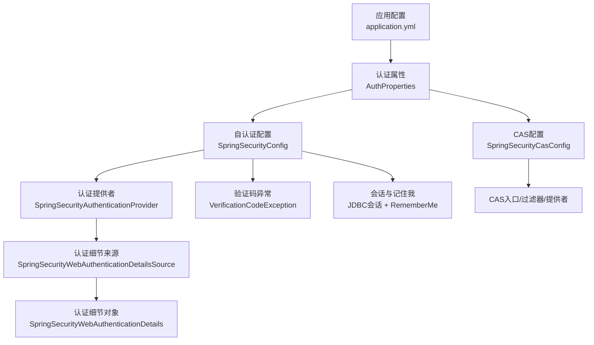
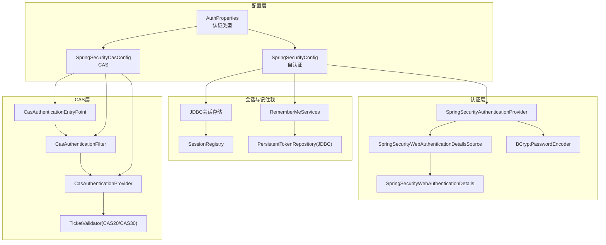
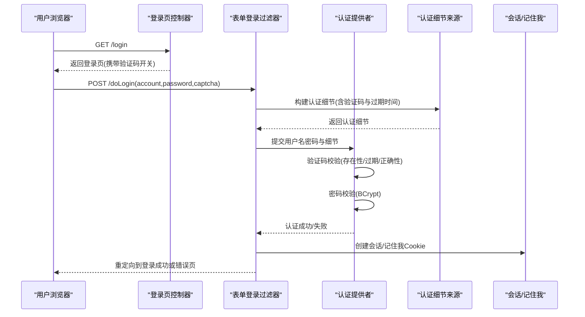
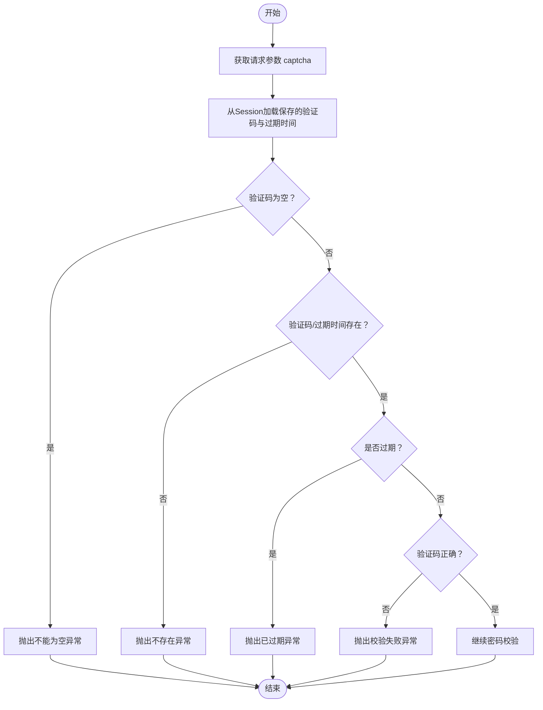
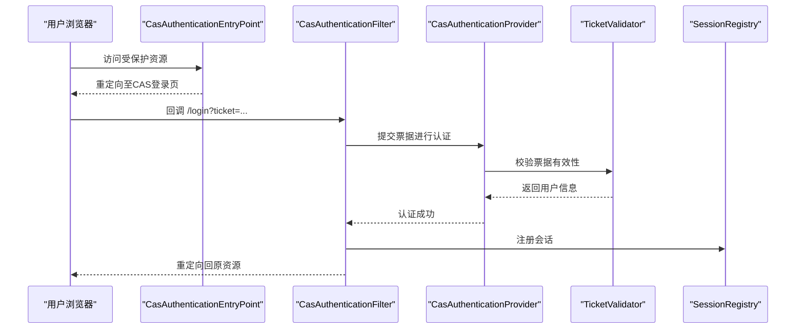
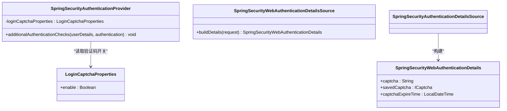
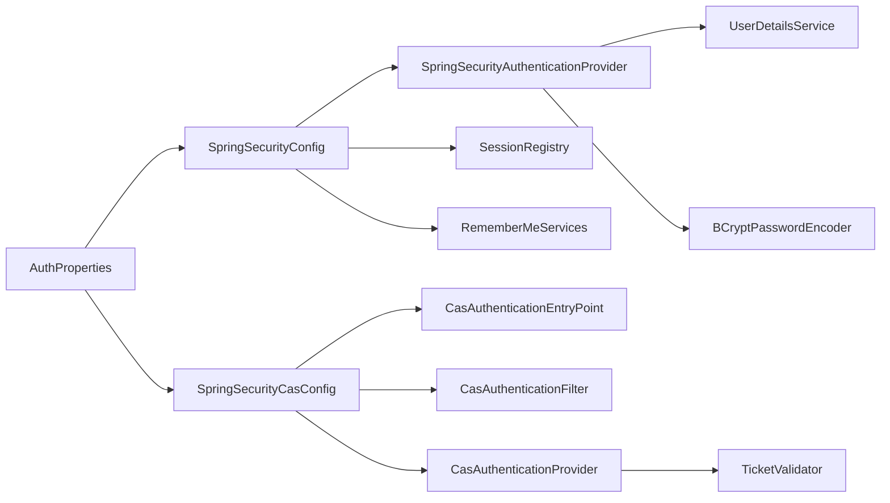

# 访问控制配置

<cite>
**本文引用的文件**
- [SpringSecurityConfig.java](file://phoenix-ui/src/main/java/com/gitee/pifeng/monitoring/ui/config/springsecurity/SpringSecurityConfig.java)
- [BaseWebSecurityConfigurerAdapter.java](file://phoenix-ui/src/main/java/com/gitee/pifeng/monitoring/ui/config/springsecurity/BaseWebSecurityConfigurerAdapter.java)
- [SpringSecurityAuthenticationProvider.java](file://phoenix-ui/src/main/java/com/gitee/pifeng/monitoring/ui/config/springsecurity/SpringSecurityAuthenticationProvider.java)
- [SpringSecurityWebAuthenticationDetails.java](file://phoenix-ui/src/main/java/com/gitee/pifeng/monitoring/ui/config/springsecurity/SpringSecurityWebAuthenticationDetails.java)
- [SpringSecurityWebAuthenticationDetailsSource.java](file://phoenix-ui/src/main/java/com/gitee/pifeng/monitoring/ui/config/springsecurity/SpringSecurityWebAuthenticationDetailsSource.java)
- [SpringSecurityVerificationCodeFilter.java](file://phoenix-ui/src/main/java/com/gitee/pifeng/monitoring/ui/config/springsecurity/SpringSecurityVerificationCodeFilter.java)
- [SpringSecurityCasConfig.java](file://phoenix-ui/src/main/java/com/gitee/pifeng/monitoring/ui/config/springsecurity/SpringSecurityCasConfig.java)
- [AuthProperties.java](file://phoenix-ui/src/main/java/com/gitee/pifeng/monitoring/ui/property/auth/AuthProperties.java)
- [LoginCaptchaProperties.java](file://phoenix-ui/src/main/java/com/gitee/pifeng/monitoring/ui/property/auth/selfauth/LoginCaptchaProperties.java)
- [CaptchaConstants.java](file://phoenix-ui/src/main/java/com/gitee/pifeng/monitoring/ui/constant/CaptchaConstants.java)
- [VerificationCodeException.java](file://phoenix-ui/src/main/java/com/gitee/pifeng/monitoring/ui/exception/VerificationCodeException.java)
- [LoginController.java](file://phoenix-ui/src/main/java/com/gitee/pifeng/monitoring/ui/business/web/controller/LoginController.java)
- [application.yml](file://phoenix-ui/src/main/resources/application.yml)
</cite>

## 目录
1. [简介](#简介)
2. [项目结构](#项目结构)
3. [核心组件](#核心组件)
4. [架构总览](#架构总览)
5. [详细组件分析](#详细组件分析)
6. [依赖分析](#依赖分析)
7. [性能考量](#性能考量)
8. [故障排除指南](#故障排除指南)
9. [结论](#结论)
10. [附录](#附录)

## 简介
本文件面向Phoenix监控系统的访问控制配置，围绕Spring Security在UI模块中的集成与扩展，系统性阐述以下主题：
- 用户认证机制：用户名密码认证、验证码验证、第三方认证（以CAS为例）的配置与联动
- 权限控制体系：基于URL的访问匹配、方法级权限注解、RBAC思想下的角色与权限模型
- 安全组件配置：认证提供者、认证细节、会话管理、记住我、异常处理、过滤器链
- 角色与权限设计：角色继承、权限粒度、最小权限等安全理念
- 安全拦截器：请求拦截、响应处理、异常处理
- 故障排除：认证失败、权限不足、会话超时等常见问题定位与修复

## 项目结构
Phoenix UI模块的安全配置集中在springsecurity包内，采用“自认证”和“第三方认证（CAS）”两种模式，通过配置属性动态切换。同时，验证码校验通过自定义认证流程与认证提供者结合，形成统一的认证体验。

图表来源
- [application.yml:1-238](file://phoenix-ui/src/main/resources/application.yml#L1-L238)
- [AuthProperties.java:1-27](file://phoenix-ui/src/main/java/com/gitee/pifeng/monitoring/ui/property/auth/AuthProperties.java#L1-L27)
- [SpringSecurityConfig.java:1-236](file://phoenix-ui/src/main/java/com/gitee/pifeng/monitoring/ui/config/springsecurity/SpringSecurityConfig.java#L1-L236)
- [SpringSecurityCasConfig.java:1-318](file://phoenix-ui/src/main/java/com/gitee/pifeng/monitoring/ui/config/springsecurity/SpringSecurityCasConfig.java#L1-L318)
- [SpringSecurityAuthenticationProvider.java:1-94](file://phoenix-ui/src/main/java/com/gitee/pifeng/monitoring/ui/config/springsecurity/SpringSecurityAuthenticationProvider.java#L1-L94)
- [SpringSecurityWebAuthenticationDetailsSource.java:1-27](file://phoenix-ui/src/main/java/com/gitee/pifeng/monitoring/ui/config/springsecurity/SpringSecurityWebAuthenticationDetailsSource.java#L1-L27)
- [SpringSecurityWebAuthenticationDetails.java:1-65](file://phoenix-ui/src/main/java/com/gitee/pifeng/monitoring/ui/config/springsecurity/SpringSecurityWebAuthenticationDetails.java#L1-L65)
- [VerificationCodeException.java:1-64](file://phoenix-ui/src/main/java/com/gitee/pifeng/monitoring/ui/exception/VerificationCodeException.java#L1-L64)

章节来源
- [application.yml:1-238](file://phoenix-ui/src/main/resources/application.yml#L1-L238)
- [AuthProperties.java:1-27](file://phoenix-ui/src/main/java/com/gitee/pifeng/monitoring/ui/property/auth/AuthProperties.java#L1-L27)

## 核心组件
- 自认证配置：基于表单登录、用户名密码参数映射、登录页与处理路径、失败处理器、验证码校验、会话与记住我、忽略静态资源与健康端点
- CAS第三方认证：基于CAS协议的入口、过滤器、提供者、单点注销与登出
- 认证提供者：扩展DaoAuthenticationProvider，集成验证码校验逻辑
- 认证细节：封装前端验证码与会话验证码、过期时间，传递给认证提供者
- 属性配置：认证类型、验证码开关、CAS服务端与客户端配置
- 控制器：登录页、登录成功、退出成功路由

章节来源
- [SpringSecurityConfig.java:33-236](file://phoenix-ui/src/main/java/com/gitee/pifeng/monitoring/ui/config/springsecurity/SpringSecurityConfig.java#L33-L236)
- [SpringSecurityCasConfig.java:42-318](file://phoenix-ui/src/main/java/com/gitee/pifeng/monitoring/ui/config/springsecurity/SpringSecurityCasConfig.java#L42-L318)
- [SpringSecurityAuthenticationProvider.java:28-94](file://phoenix-ui/src/main/java/com/gitee/pifeng/monitoring/ui/config/springsecurity/SpringSecurityAuthenticationProvider.java#L28-L94)
- [SpringSecurityWebAuthenticationDetailsSource.java:17-27](file://phoenix-ui/src/main/java/com/gitee/pifeng/monitoring/ui/config/springsecurity/SpringSecurityWebAuthenticationDetailsSource.java#L17-L27)
- [SpringSecurityWebAuthenticationDetails.java:20-65](file://phoenix-ui/src/main/java/com/gitee/pifeng/monitoring/ui/config/springsecurity/SpringSecurityWebAuthenticationDetails.java#L20-L65)
- [AuthProperties.java:17-27](file://phoenix-ui/src/main/java/com/gitee/pifeng/monitoring/ui/property/auth/AuthProperties.java#L17-L27)
- [LoginCaptchaProperties.java:14-24](file://phoenix-ui/src/main/java/com/gitee/pifeng/monitoring/ui/property/auth/selfauth/LoginCaptchaProperties.java#L14-L24)
- [LoginController.java:22-84](file://phoenix-ui/src/main/java/com/gitee/pifeng/monitoring/ui/business/web/controller/LoginController.java#L22-L84)

## 架构总览
下图展示了UI模块访问控制的整体架构：配置层根据认证类型选择自认证或CAS；认证提供者负责用户名密码与验证码校验；会话与记住我通过JDBC会话存储；忽略静态资源与特定端点；CAS模式下由CAS入口与过滤器接管登录流程。

图表来源
- [AuthProperties.java:17-27](file://phoenix-ui/src/main/java/com/gitee/pifeng/monitoring/ui/property/auth/AuthProperties.java#L17-L27)
- [SpringSecurityConfig.java:33-236](file://phoenix-ui/src/main/java/com/gitee/pifeng/monitoring/ui/config/springsecurity/SpringSecurityConfig.java#L33-L236)
- [SpringSecurityCasConfig.java:42-318](file://phoenix-ui/src/main/java/com/gitee/pifeng/monitoring/ui/config/springsecurity/SpringSecurityCasConfig.java#L42-L318)
- [SpringSecurityAuthenticationProvider.java:28-94](file://phoenix-ui/src/main/java/com/gitee/pifeng/monitoring/ui/config/springsecurity/SpringSecurityAuthenticationProvider.java#L28-L94)
- [SpringSecurityWebAuthenticationDetailsSource.java:17-27](file://phoenix-ui/src/main/java/com/gitee/pifeng/monitoring/ui/config/springsecurity/SpringSecurityWebAuthenticationDetailsSource.java#L17-L27)
- [SpringSecurityWebAuthenticationDetails.java:20-65](file://phoenix-ui/src/main/java/com/gitee/pifeng/monitoring/ui/config/springsecurity/SpringSecurityWebAuthenticationDetails.java#L20-L65)

## 详细组件分析

### 自认证配置（用户名密码 + 验证码）
- 登录参数与页面：用户名参数、密码参数、登录页、登录处理路径、成功/失败行为
- 验证码校验：通过认证提供者在密码校验前执行验证码校验，失败抛出自定义异常
- 会话与记住我：JDBC会话存储、SessionRegistry、RememberMeServices（有效期、参数名）
- 忽略资源：静态资源与健康/关闭端点
- 方法级权限：开启prePostEnabled，支持@PreAuthorize/@PostAuthorize等注解

图表来源
- [LoginController.java:41-49](file://phoenix-ui/src/main/java/com/gitee/pifeng/monitoring/ui/business/web/controller/LoginController.java#L41-L49)
- [SpringSecurityConfig.java:112-166](file://phoenix-ui/src/main/java/com/gitee/pifeng/monitoring/ui/config/springsecurity/SpringSecurityConfig.java#L112-L166)
- [SpringSecurityAuthenticationProvider.java:63-91](file://phoenix-ui/src/main/java/com/gitee/pifeng/monitoring/ui/config/springsecurity/SpringSecurityAuthenticationProvider.java#L63-L91)
- [SpringSecurityWebAuthenticationDetailsSource.java:21-24](file://phoenix-ui/src/main/java/com/gitee/pifeng/monitoring/ui/config/springsecurity/SpringSecurityWebAuthenticationDetailsSource.java#L21-L24)
- [SpringSecurityWebAuthenticationDetails.java:49-62](file://phoenix-ui/src/main/java/com/gitee/pifeng/monitoring/ui/config/springsecurity/SpringSecurityWebAuthenticationDetails.java#L49-L62)

章节来源
- [SpringSecurityConfig.java:80-166](file://phoenix-ui/src/main/java/com/gitee/pifeng/monitoring/ui/config/springsecurity/SpringSecurityConfig.java#L80-L166)
- [SpringSecurityAuthenticationProvider.java:63-91](file://phoenix-ui/src/main/java/com/gitee/pifeng/monitoring/ui/config/springsecurity/SpringSecurityAuthenticationProvider.java#L63-L91)
- [SpringSecurityWebAuthenticationDetailsSource.java:17-27](file://phoenix-ui/src/main/java/com/gitee/pifeng/monitoring/ui/config/springsecurity/SpringSecurityWebAuthenticationDetailsSource.java#L17-L27)
- [SpringSecurityWebAuthenticationDetails.java:20-65](file://phoenix-ui/src/main/java/com/gitee/pifeng/monitoring/ui/config/springsecurity/SpringSecurityWebAuthenticationDetails.java#L20-L65)
- [LoginController.java:41-49](file://phoenix-ui/src/main/java/com/gitee/pifeng/monitoring/ui/business/web/controller/LoginController.java#L41-L49)

### 验证码校验流程（算法流）

图表来源
- [SpringSecurityAuthenticationProvider.java:63-91](file://phoenix-ui/src/main/java/com/gitee/pifeng/monitoring/ui/config/springsecurity/SpringSecurityAuthenticationProvider.java#L63-L91)
- [VerificationCodeException.java:35-61](file://phoenix-ui/src/main/java/com/gitee/pifeng/monitoring/ui/exception/VerificationCodeException.java#L35-L61)
- [CaptchaConstants.java:11-24](file://phoenix-ui/src/main/java/com/gitee/pifeng/monitoring/ui/constant/CaptchaConstants.java#L11-L24)

章节来源
- [SpringSecurityAuthenticationProvider.java:63-91](file://phoenix-ui/src/main/java/com/gitee/pifeng/monitoring/ui/config/springsecurity/SpringSecurityAuthenticationProvider.java#L63-L91)
- [VerificationCodeException.java:15-64](file://phoenix-ui/src/main/java/com/gitee/pifeng/monitoring/ui/exception/VerificationCodeException.java#L15-L64)
- [CaptchaConstants.java:11-24](file://phoenix-ui/src/main/java/com/gitee/pifeng/monitoring/ui/constant/CaptchaConstants.java#L11-L24)

### CAS第三方认证配置
- 认证入口：CasAuthenticationEntryPoint，设置服务端登录URL与客户端服务信息
- 登录过滤器：CasAuthenticationFilter，绑定认证管理器与过滤路径
- 认证提供者：CasAuthenticationProvider，设置UserDetailsService、服务信息、票据验证器与密钥
- 票据验证器：根据配置选择CAS20或CAS30验证器
- 单点注销：SingleSignOutFilter与LogoutFilter，分别处理服务端注销回调与客户端登出

图表来源
- [SpringSecurityCasConfig.java:114-143](file://phoenix-ui/src/main/java/com/gitee/pifeng/monitoring/ui/config/springsecurity/SpringSecurityCasConfig.java#L114-L143)
- [SpringSecurityCasConfig.java:154-248](file://phoenix-ui/src/main/java/com/gitee/pifeng/monitoring/ui/config/springsecurity/SpringSecurityCasConfig.java#L154-L248)
- [SpringSecurityCasConfig.java:259-280](file://phoenix-ui/src/main/java/com/gitee/pifeng/monitoring/ui/config/springsecurity/SpringSecurityCasConfig.java#L259-L280)

章节来源
- [SpringSecurityCasConfig.java:81-143](file://phoenix-ui/src/main/java/com/gitee/pifeng/monitoring/ui/config/springsecurity/SpringSecurityCasConfig.java#L81-L143)
- [SpringSecurityCasConfig.java:154-248](file://phoenix-ui/src/main/java/com/gitee/pifeng/monitoring/ui/config/springsecurity/SpringSecurityCasConfig.java#L154-L248)
- [SpringSecurityCasConfig.java:259-280](file://phoenix-ui/src/main/java/com/gitee/pifeng/monitoring/ui/config/springsecurity/SpringSecurityCasConfig.java#L259-L280)

### 认证提供者与认证细节（类图）

图表来源
- [SpringSecurityAuthenticationProvider.java:28-94](file://phoenix-ui/src/main/java/com/gitee/pifeng/monitoring/ui/config/springsecurity/SpringSecurityAuthenticationProvider.java#L28-L94)
- [SpringSecurityWebAuthenticationDetailsSource.java:17-27](file://phoenix-ui/src/main/java/com/gitee/pifeng/monitoring/ui/config/springsecurity/SpringSecurityWebAuthenticationDetailsSource.java#L17-L27)
- [SpringSecurityWebAuthenticationDetails.java:20-65](file://phoenix-ui/src/main/java/com/gitee/pifeng/monitoring/ui/config/springsecurity/SpringSecurityWebAuthenticationDetails.java#L20-L65)
- [LoginCaptchaProperties.java:14-24](file://phoenix-ui/src/main/java/com/gitee/pifeng/monitoring/ui/property/auth/selfauth/LoginCaptchaProperties.java#L14-L24)

章节来源
- [SpringSecurityAuthenticationProvider.java:28-94](file://phoenix-ui/src/main/java/com/gitee/pifeng/monitoring/ui/config/springsecurity/SpringSecurityAuthenticationProvider.java#L28-L94)
- [SpringSecurityWebAuthenticationDetailsSource.java:17-27](file://phoenix-ui/src/main/java/com/gitee/pifeng/monitoring/ui/config/springsecurity/SpringSecurityWebAuthenticationDetailsSource.java#L17-L27)
- [SpringSecurityWebAuthenticationDetails.java:20-65](file://phoenix-ui/src/main/java/com/gitee/pifeng/monitoring/ui/config/springsecurity/SpringSecurityWebAuthenticationDetails.java#L20-L65)
- [LoginCaptchaProperties.java:14-24](file://phoenix-ui/src/main/java/com/gitee/pifeng/monitoring/ui/property/auth/selfauth/LoginCaptchaProperties.java#L14-L24)

### URL权限匹配与忽略规则
- 忽略静态资源与监控端点：避免进入Spring Security过滤链
- 登录相关路径：/login、/logout、/doLogin、/captcha.png等匿名可访问
- 其他请求均需认证

章节来源
- [BaseWebSecurityConfigurerAdapter.java:13-52](file://phoenix-ui/src/main/java/com/gitee/pifeng/monitoring/ui/config/springsecurity/BaseWebSecurityConfigurerAdapter.java#L13-L52)
- [SpringSecurityConfig.java:80-85](file://phoenix-ui/src/main/java/com/gitee/pifeng/monitoring/ui/config/springsecurity/SpringSecurityConfig.java#L80-L85)
- [SpringSecurityConfig.java:112-118](file://phoenix-ui/src/main/java/com/gitee/pifeng/monitoring/ui/config/springsecurity/SpringSecurityConfig.java#L112-L118)

### 会话管理与记住我
- JDBC会话存储：启用@EnableJdbcHttpSession，结合FindByIndexNameSessionRepository与SessionRegistry
- 会话超时与并发控制：invalidSessionUrl、maximumSessions、maxSessionsPreventsLogin、expiredUrl
- 记住我：SpringSessionRememberMeServices，JDBC持久化token

章节来源
- [SpringSecurityConfig.java:140-158](file://phoenix-ui/src/main/java/com/gitee/pifeng/monitoring/ui/config/springsecurity/SpringSecurityConfig.java#L140-L158)
- [SpringSecurityConfig.java:191-219](file://phoenix-ui/src/main/java/com/gitee/pifeng/monitoring/ui/config/springsecurity/SpringSecurityConfig.java#L191-L219)
- [application.yml:51-7](file://phoenix-ui/src/main/resources/application.yml#L51-L7)

### CSRF与头策略
- 默认禁用缓存与frameOptions，按需可在生产环境调整
- CSRF未显式配置，默认遵循Spring Security 5.7+的严格策略，如需兼容可按需开启

章节来源
- [SpringSecurityConfig.java:159-165](file://phoenix-ui/src/main/java/com/gitee/pifeng/monitoring/ui/config/springsecurity/SpringSecurityConfig.java#L159-L165)
- [SpringSecurityCasConfig.java:136-142](file://phoenix-ui/src/main/java/com/gitee/pifeng/monitoring/ui/config/springsecurity/SpringSecurityCasConfig.java#L136-L142)

## 依赖分析
- 配置选择：AuthProperties.type驱动条件装配，自认证与CAS互斥
- 组件耦合：认证提供者依赖UserDetailsService与PasswordEncoder；认证细节来源依赖请求上下文
- 会话与记住我：JDBC会话存储与Spring Session集成，SessionRegistry用于并发控制
- CAS组件：入口、过滤器、提供者、票据验证器、单点注销过滤器与登出过滤器

图表来源
- [AuthProperties.java:17-27](file://phoenix-ui/src/main/java/com/gitee/pifeng/monitoring/ui/property/auth/AuthProperties.java#L17-L27)
- [SpringSecurityConfig.java:33-236](file://phoenix-ui/src/main/java/com/gitee/pifeng/monitoring/ui/config/springsecurity/SpringSecurityConfig.java#L33-L236)
- [SpringSecurityCasConfig.java:42-318](file://phoenix-ui/src/main/java/com/gitee/pifeng/monitoring/ui/config/springsecurity/SpringSecurityCasConfig.java#L42-L318)
- [SpringSecurityAuthenticationProvider.java:28-94](file://phoenix-ui/src/main/java/com/gitee/pifeng/monitoring/ui/config/springsecurity/SpringSecurityAuthenticationProvider.java#L28-L94)

章节来源
- [AuthProperties.java:17-27](file://phoenix-ui/src/main/java/com/gitee/pifeng/monitoring/ui/property/auth/AuthProperties.java#L17-L27)
- [SpringSecurityConfig.java:33-236](file://phoenix-ui/src/main/java/com/gitee/pifeng/monitoring/ui/config/springsecurity/SpringSecurityConfig.java#L33-L236)
- [SpringSecurityCasConfig.java:42-318](file://phoenix-ui/src/main/java/com/gitee/pifeng/monitoring/ui/config/springsecurity/SpringSecurityCasConfig.java#L42-L318)
- [SpringSecurityAuthenticationProvider.java:28-94](file://phoenix-ui/src/main/java/com/gitee/pifeng/monitoring/ui/config/springsecurity/SpringSecurityAuthenticationProvider.java#L28-L94)

## 性能考量
- 会话存储：JDBC会话存储具备跨节点一致性，但相较内存会带来数据库IO开销；可通过合理的会话超时与并发策略平衡性能与安全
- 认证细节：验证码校验仅在登录阶段执行，成本较低；密码校验使用BCrypt，强度高但计算开销较大，建议在生产环境保持
- 静态资源忽略：大量忽略静态资源与端点，减少过滤链开销
- 响应压缩：开启Gzip压缩，降低网络传输成本

章节来源
- [application.yml:84-152](file://phoenix-ui/src/main/resources/application.yml#L84-L152)
- [SpringSecurityConfig.java:80-85](file://phoenix-ui/src/main/java/com/gitee/pifeng/monitoring/ui/config/springsecurity/SpringSecurityConfig.java#L80-L85)

## 故障排除指南
- 认证失败
  - 检查登录参数映射与登录处理路径是否一致
  - 确认密码编码器与存储密码一致（BCrypt）
  - 查看认证失败处理器返回的错误信息
- 验证码问题
  - 验证码为空、不存在、已过期、校验失败均有对应异常枚举，定位验证码会话与过期时间设置
  - 登录页需正确传递验证码开关状态
- 权限不足
  - 确认URL匹配规则与方法级注解是否生效（prePostEnabled已开启）
  - 检查用户角色与权限是否正确授予
- 会话超时/并发登录
  - 检查会话超时配置与maximumSessions策略
  - 查看invalidSessionUrl与expiredUrl跳转是否符合预期
- CAS相关
  - 确认服务端登录URL、客户端服务URL、票据验证器类型与密钥配置
  - 单点注销与登出过滤器顺序是否正确

章节来源
- [SpringSecurityConfig.java:112-166](file://phoenix-ui/src/main/java/com/gitee/pifeng/monitoring/ui/config/springsecurity/SpringSecurityConfig.java#L112-L166)
- [SpringSecurityCasConfig.java:114-143](file://phoenix-ui/src/main/java/com/gitee/pifeng/monitoring/ui/config/springsecurity/SpringSecurityCasConfig.java#L114-L143)
- [VerificationCodeException.java:35-61](file://phoenix-ui/src/main/java/com/gitee/pifeng/monitoring/ui/exception/VerificationCodeException.java#L35-L61)
- [LoginController.java:41-49](file://phoenix-ui/src/main/java/com/gitee/pifeng/monitoring/ui/business/web/controller/LoginController.java#L41-L49)

## 结论
Phoenix UI模块通过灵活的配置属性与多套安全适配器，实现了“自认证+验证码”与“CAS第三方认证”的无缝切换。认证提供者与认证细节的扩展，使验证码校验与密码校验在统一流程中完成；JDBC会话与记住我保障了跨节点的一致性与用户体验；方法级权限注解与URL匹配规则共同构成细粒度的访问控制体系。建议在生产环境中结合业务场景合理配置会话超时、并发策略与CAS参数，并持续优化静态资源忽略与响应压缩策略以提升整体性能与安全性。

## 附录
- 配置要点速查
  - 认证类型：phoenix.auth.type（self/third）
  - 自认证验证码：phoenix.auth.self-auth.login-captcha.enable
  - CAS服务端与客户端：phoenix.auth.third-auth.cas.*
  - 会话超时：server.servlet.session.timeout 或 spring.session.timeout
  - JDBC会话存储：spring.session.store-type=jdbc

章节来源
- [AuthProperties.java:17-27](file://phoenix-ui/src/main/java/com/gitee/pifeng/monitoring/ui/property/auth/AuthProperties.java#L17-L27)
- [LoginCaptchaProperties.java:14-24](file://phoenix-ui/src/main/java/com/gitee/pifeng/monitoring/ui/property/auth/selfauth/LoginCaptchaProperties.java#L14-L24)
- [application.yml:4-7](file://phoenix-ui/src/main/resources/application.yml#L4-L7)
- [application.yml:51-52](file://phoenix-ui/src/main/resources/application.yml#L51-L52)