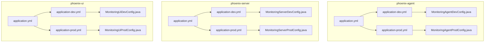
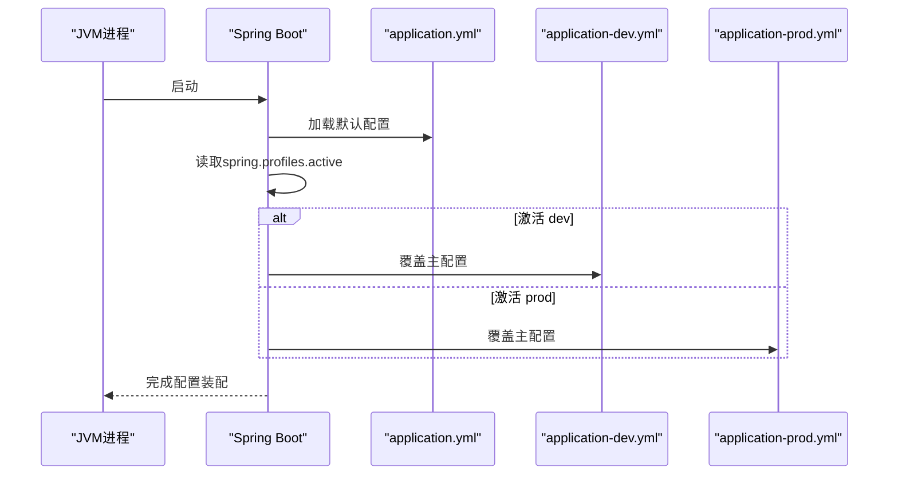
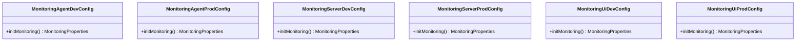
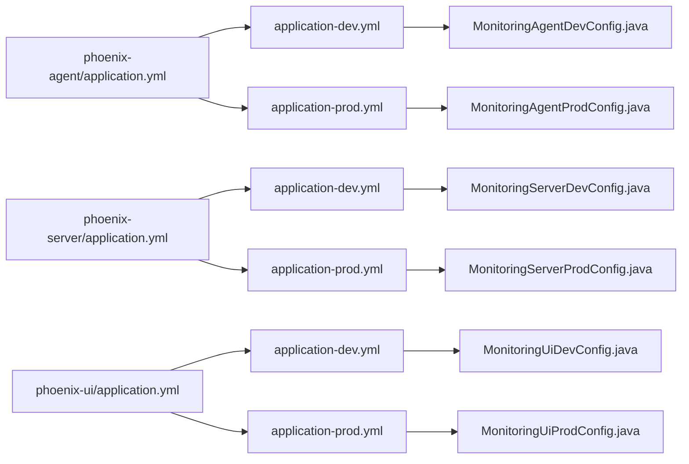

# 环境配置

<cite>
**本文引用的文件**
- [phoenix-agent/application.yml](file://phoenix-agent/src/main/resources/application.yml)
- [phoenix-agent/application-dev.yml](file://phoenix-agent/src/main/resources/application-dev.yml)
- [phoenix-agent/application-prod.yml](file://phoenix-agent/src/main/resources/application-prod.yml)
- [phoenix-server/application.yml](file://phoenix-server/src/main/resources/application.yml)
- [phoenix-server/application-dev.yml](file://phoenix-server/src/main/resources/application-dev.yml)
- [phoenix-server/application-prod.yml](file://phoenix-server/src/main/resources/application-prod.yml)
- [phoenix-ui/application.yml](file://phoenix-ui/src/main/resources/application.yml)
- [phoenix-ui/application-dev.yml](file://phoenix-ui/src/main/resources/application-dev.yml)
- [phoenix-ui/application-prod.yml](file://phoenix-ui/src/main/resources/application-prod.yml)
- [phoenix-agent/MonitoringAgentDevConfig.java](file://phoenix-agent/src/main/java/com/gitee/pifeng/monitoring/agent/config/MonitoringAgentDevConfig.java)
- [phoenix-agent/MonitoringAgentProdConfig.java](file://phoenix-agent/src/main/java/com/gitee/pifeng/monitoring/agent/config/MonitoringAgentProdConfig.java)
- [phoenix-server/MonitoringServerDevConfig.java](file://phoenix-server/src/main/java/com/gitee/pifeng/monitoring/server/config/phoenix/MonitoringServerDevConfig.java)
- [phoenix-server/MonitoringServerProdConfig.java](file://phoenix-server/src/main/java/com/gitee/pifeng/monitoring/server/config/phoenix/MonitoringServerProdConfig.java)
- [phoenix-ui/MonitoringUiDevConfig.java](file://phoenix-ui/src/main/java/com/gitee/pifeng/monitoring/ui/config/phoenix/MonitoringUiDevConfig.java)
- [phoenix-ui/MonitoringUiProdConfig.java](file://phoenix-ui/src/main/java/com/gitee/pifeng/monitoring/ui/config/phoenix/MonitoringUiProdConfig.java)
</cite>

## 目录
1. [简介](#简介)
2. [项目结构](#项目结构)
3. [核心组件](#核心组件)
4. [架构总览](#架构总览)
5. [详细组件分析](#详细组件分析)
6. [依赖关系分析](#依赖关系分析)
7. [性能考量](#性能考量)
8. [故障排查指南](#故障排查指南)
9. [结论](#结论)
10. [附录](#附录)

## 简介
本文件面向Phoenix监控系统的运维与开发人员，系统性梳理并对比开发环境(dev)、测试环境(test)、生产环境(prod)的配置差异与特性，重点覆盖以下方面：
- 端口配置、上下文路径、会话与压缩等服务层配置
- 数据库连接配置（含Druid连接池、MyBatis-Plus）
- 邮件告警配置（SMTP）
- Spring Profile激活与配置文件加载优先级
- 敏感信息的安全存储、配置文件版本管理与环境变量使用建议
- 不同层级的配置覆盖机制与最佳实践
- 提供可直接套用的配置模板与示例路径

## 项目结构
Phoenix由三个子模块构成：phoenix-agent（探针）、phoenix-server（服务端）、phoenix-ui（前端UI）。每个模块均包含标准的Spring Boot配置文件：
- application.yml：通用默认配置
- application-{profile}.yml：按环境覆盖的差异化配置
- 各模块还包含基于Profile的Java配置类，用于在不同环境下启用不同的监控属性加载

图表来源
- [phoenix-agent/application.yml:1-111](file://phoenix-agent/src/main/resources/application.yml#L1-L111)
- [phoenix-agent/application-dev.yml:1-3](file://phoenix-agent/src/main/resources/application-dev.yml#L1-L3)
- [phoenix-agent/application-prod.yml:1-3](file://phoenix-agent/src/main/resources/application-prod.yml#L1-L3)
- [phoenix-server/application.yml:1-271](file://phoenix-server/src/main/resources/application.yml#L1-L271)
- [phoenix-server/application-dev.yml:1-38](file://phoenix-server/src/main/resources/application-dev.yml#L1-L38)
- [phoenix-server/application-prod.yml:1-38](file://phoenix-server/src/main/resources/application-prod.yml#L1-L38)
- [phoenix-ui/application.yml:1-238](file://phoenix-ui/src/main/resources/application.yml#L1-L238)
- [phoenix-ui/application-dev.yml:1-49](file://phoenix-ui/src/main/resources/application-dev.yml#L1-L49)
- [phoenix-ui/application-prod.yml:1-39](file://phoenix-ui/src/main/resources/application-prod.yml#L1-L39)
- [phoenix-agent/MonitoringAgentDevConfig.java:1-38](file://phoenix-agent/src/main/java/com/gitee/pifeng/monitoring/agent/config/MonitoringAgentDevConfig.java#L1-L38)
- [phoenix-agent/MonitoringAgentProdConfig.java:1-38](file://phoenix-agent/src/main/java/com/gitee/pifeng/monitoring/agent/config/MonitoringAgentProdConfig.java#L1-L38)
- [phoenix-server/MonitoringServerDevConfig.java:1-38](file://phoenix-server/src/main/java/com/gitee/pifeng/monitoring/server/config/phoenix/MonitoringServerDevConfig.java#L1-L38)
- [phoenix-server/MonitoringServerProdConfig.java:1-38](file://phoenix-server/src/main/java/com/gitee/pifeng/monitoring/server/config/phoenix/MonitoringServerProdConfig.java#L1-L38)
- [phoenix-ui/MonitoringUiDevConfig.java:1-38](file://phoenix-ui/src/main/java/com/gitee/pifeng/monitoring/ui/config/phoenix/MonitoringUiDevConfig.java#L1-L38)
- [phoenix-ui/MonitoringUiProdConfig.java:1-38](file://phoenix-ui/src/main/java/com/gitee/pifeng/monitoring/ui/config/phoenix/MonitoringUiProdConfig.java#L1-L38)

章节来源
- [phoenix-agent/application.yml:1-111](file://phoenix-agent/src/main/resources/application.yml#L1-L111)
- [phoenix-server/application.yml:1-271](file://phoenix-server/src/main/resources/application.yml#L1-L271)
- [phoenix-ui/application.yml:1-238](file://phoenix-ui/src/main/resources/application.yml#L1-L238)

## 核心组件
- 应用主配置文件（application.yml）：定义默认服务端口、上下文路径、日志、Spring、管理端点、接口文档等基础配置，并通过profiles.active声明当前激活的Profile集合。
- 环境差异化配置（application-{profile}.yml）：覆盖主配置中的关键参数，如端口、数据库URL/凭据、邮件SMTP等。
- Profile专用Java配置类：以@Profile标注，按环境注入监控属性加载Bean，确保不同环境使用对应的属性文件。

章节来源
- [phoenix-agent/application.yml:48-50](file://phoenix-agent/src/main/resources/application.yml#L48-L50)
- [phoenix-server/application.yml:56-58](file://phoenix-server/src/main/resources/application.yml#L56-L58)
- [phoenix-ui/application.yml:65-67](file://phoenix-ui/src/main/resources/application.yml#L65-L67)

## 架构总览
下图展示了各模块在不同Profile下的配置覆盖关系与激活流程：

图表来源
- [phoenix-agent/application.yml:48-50](file://phoenix-agent/src/main/resources/application.yml#L48-L50)
- [phoenix-agent/application-dev.yml:1-3](file://phoenix-agent/src/main/resources/application-dev.yml#L1-L3)
- [phoenix-agent/application-prod.yml:1-3](file://phoenix-agent/src/main/resources/application-prod.yml#L1-L3)
- [phoenix-server/application.yml:56-58](file://phoenix-server/src/main/resources/application.yml#L56-L58)
- [phoenix-server/application-dev.yml:1-38](file://phoenix-server/src/main/resources/application-dev.yml#L1-L38)
- [phoenix-server/application-prod.yml:1-38](file://phoenix-server/src/main/resources/application-prod.yml#L1-L38)
- [phoenix-ui/application.yml:65-67](file://phoenix-ui/src/main/resources/application.yml#L65-L67)
- [phoenix-ui/application-dev.yml:1-49](file://phoenix-ui/src/main/resources/application-dev.yml#L1-L49)
- [phoenix-ui/application-prod.yml:1-39](file://phoenix-ui/src/main/resources/application-prod.yml#L1-L39)

## 详细组件分析

### 开发环境（dev）
- 服务端口与上下文路径
  - phoenix-agent：端口覆盖为12000
  - phoenix-server：端口覆盖为16000
  - phoenix-ui：端口覆盖为80（未启用SSL）
- 数据库连接
  - 使用本地MySQL（端口3306），用户名root，密码123456
  - Druid连接池参数与MyBatis-Plus配置保持默认或适度放宽
- 邮件配置（仅服务端）
  - SMTP主机、端口、SSL/TLS开关等已预置，便于本地告警联调
- Profile激活
  - 主配置中profiles.active默认指向dev，确保本地开发无需额外参数即可运行

章节来源
- [phoenix-agent/application-dev.yml:1-3](file://phoenix-agent/src/main/resources/application-dev.yml#L1-L3)
- [phoenix-server/application-dev.yml:1-38](file://phoenix-server/src/main/resources/application-dev.yml#L1-L38)
- [phoenix-server/application.yml:56-58](file://phoenix-server/src/main/resources/application.yml#L56-L58)
- [phoenix-ui/application-dev.yml:1-49](file://phoenix-ui/src/main/resources/application-dev.yml#L1-L49)

### 测试环境（test）
- 说明
  - 当前仓库未提供application-test.yml与对应Profile Java配置类
  - 建议在CI/CD流水线中通过环境变量或外部挂载覆盖关键参数（数据库、邮件、鉴权等）
- 最佳实践
  - 使用独立数据库实例与账号，避免与dev冲突
  - 通过spring.profiles.active=test激活测试Profile，结合CI环境变量实现无侵入覆盖

[本节为概念性说明，不直接分析具体文件，故无“章节来源”]

### 生产环境（prod）
- 服务端口与上下文路径
  - 三模块端口均为12000（agent）、16000（server）、80（UI），便于统一暴露与反向代理
- 数据库连接
  - 使用独立MySQL实例（端口3307），提供更强健的凭据与连接参数
- 邮件配置（仅服务端）
  - 提供完整的SMTP配置模板，需替换真实账号与授权码
- Profile激活
  - 主配置中profiles.active默认指向dev；生产环境需显式切换至prod

章节来源
- [phoenix-agent/application-prod.yml:1-3](file://phoenix-agent/src/main/resources/application-prod.yml#L1-L3)
- [phoenix-server/application-prod.yml:1-38](file://phoenix-server/src/main/resources/application-prod.yml#L1-L38)
- [phoenix-ui/application-prod.yml:1-39](file://phoenix-ui/src/main/resources/application-prod.yml#L1-L39)

### 配置文件加载与覆盖机制
- 加载顺序（从低优先级到高优先级）
  1) classpath:/application.yml
  2) classpath:/{module}/application.yml
  3) file:./application.yml
  4) file:./{module}/application.yml
  5) SPRING_APPLICATION_JSON（内嵌JSON）
  6) 环境变量
  7) 命令行参数
- 覆盖规则
  - 后加载项覆盖先加载项
  - 环境变量与命令行参数优先于application-{profile}.yml
  - 多Profile激活时，后激活的Profile覆盖先激活的Profile
- 模块内覆盖
  - application-{profile}.yml覆盖application.yml中同名键

章节来源
- [phoenix-agent/application.yml:48-50](file://phoenix-agent/src/main/resources/application.yml#L48-L50)
- [phoenix-server/application.yml:56-58](file://phoenix-server/src/main/resources/application.yml#L56-L58)
- [phoenix-ui/application.yml:65-67](file://phoenix-ui/src/main/resources/application.yml#L65-L67)

### 环境切换与Profile激活
- 方式一：主配置中设置spring.profiles.active
  - 适用于本地开发与测试环境的快速切换
- 方式二：命令行参数
  - 通过--spring.profiles.active=dev,prod多Profile组合
- 方式三：环境变量
  - 在容器或CI中设置SPRING_PROFILES_ACTIVE=dev,prod
- 多Profile叠加
  - 若同时激活dev与prod，后者覆盖前者同名键

章节来源
- [phoenix-agent/application.yml:48-50](file://phoenix-agent/src/main/resources/application.yml#L48-L50)
- [phoenix-server/application.yml:56-58](file://phoenix-server/src/main/resources/application.yml#L56-L58)
- [phoenix-ui/application.yml:65-67](file://phoenix-ui/src/main/resources/application.yml#L65-L67)

### 数据库连接配置（Druid + MyBatis-Plus）
- 关键要点
  - 数据源类型与Druid连接池参数在各模块application.yml中均有完整示例
  - MyBatis-Plus Mapper扫描路径、驼峰映射、数据库标识等已配置
  - 生产环境建议使用独立数据库实例与强口令
- 连接池参数建议
  - 根据QPS与并发调整初始连接、最大活跃连接、最大等待时间
  - 合理设置空闲检测与泄露检测参数，保障稳定性

章节来源
- [phoenix-server/application.yml:117-184](file://phoenix-server/src/main/resources/application.yml#L117-L184)
- [phoenix-server/application.yml:187-217](file://phoenix-server/src/main/resources/application.yml#L187-L217)
- [phoenix-ui/application.yml:85-151](file://phoenix-ui/src/main/resources/application.yml#L85-L151)
- [phoenix-ui/application.yml:155-184](file://phoenix-ui/src/main/resources/application.yml#L155-L184)

### 邮件配置（告警）
- 适用范围
  - 服务端模块提供完整的SMTP配置模板，便于邮件告警
- 关键参数
  - 主机、端口、协议、SSL/TLS、认证、编码等
- 安全建议
  - 密码与授权码通过环境变量或外部配置中心注入，避免硬编码

章节来源
- [phoenix-server/application-dev.yml:17-38](file://phoenix-server/src/main/resources/application-dev.yml#L17-L38)
- [phoenix-server/application-prod.yml:17-38](file://phoenix-server/src/main/resources/application-prod.yml#L17-L38)

### Profile专用Java配置类
- 作用
  - 通过@Profile("dev"/"prod")在不同环境注入监控属性加载Bean
  - 确保不同环境使用对应的monitoring-{env}.properties
- 示例
  - agent/server/ui模块均提供dev/prod两套配置类

图表来源
- [phoenix-agent/MonitoringAgentDevConfig.java:1-38](file://phoenix-agent/src/main/java/com/gitee/pifeng/monitoring/agent/config/MonitoringAgentDevConfig.java#L1-L38)
- [phoenix-agent/MonitoringAgentProdConfig.java:1-38](file://phoenix-agent/src/main/java/com/gitee/pifeng/monitoring/agent/config/MonitoringAgentProdConfig.java#L1-L38)
- [phoenix-server/MonitoringServerDevConfig.java:1-38](file://phoenix-server/src/main/java/com/gitee/pifeng/monitoring/server/config/phoenix/MonitoringServerDevConfig.java#L1-L38)
- [phoenix-server/MonitoringServerProdConfig.java:1-38](file://phoenix-server/src/main/java/com/gitee/pifeng/monitoring/server/config/phoenix/MonitoringServerProdConfig.java#L1-L38)
- [phoenix-ui/MonitoringUiDevConfig.java:1-38](file://phoenix-ui/src/main/java/com/gitee/pifeng/monitoring/ui/config/phoenix/MonitoringUiDevConfig.java#L1-L38)
- [phoenix-ui/MonitoringUiProdConfig.java:1-38](file://phoenix-ui/src/main/java/com/gitee/pifeng/monitoring/ui/config/phoenix/MonitoringUiProdConfig.java#L1-L38)

## 依赖关系分析
- 模块间耦合
  - 各模块的application.yml相互独立，仅通过Profile激活与覆盖机制产生间接关联
- Profile与配置文件的耦合
  - application.yml定义profiles.active，application-{profile}.yml提供覆盖，Profile Java配置类负责Bean注入
- 外部依赖
  - 数据库：MySQL（本地/独立实例）
  - 邮件：SMTP（QQ邮箱示例）
  - 日志：logback-spring.xml（classpath引入）

图表来源
- [phoenix-agent/application.yml:48-50](file://phoenix-agent/src/main/resources/application.yml#L48-L50)
- [phoenix-agent/application-dev.yml:1-3](file://phoenix-agent/src/main/resources/application-dev.yml#L1-L3)
- [phoenix-agent/application-prod.yml:1-3](file://phoenix-agent/src/main/resources/application-prod.yml#L1-L3)
- [phoenix-server/application.yml:56-58](file://phoenix-server/src/main/resources/application.yml#L56-L58)
- [phoenix-server/application-dev.yml:1-38](file://phoenix-server/src/main/resources/application-dev.yml#L1-L38)
- [phoenix-server/application-prod.yml:1-38](file://phoenix-server/src/main/resources/application-prod.yml#L1-L38)
- [phoenix-ui/application.yml:65-67](file://phoenix-ui/src/main/resources/application.yml#L65-L67)
- [phoenix-ui/application-dev.yml:1-49](file://phoenix-ui/src/main/resources/application-dev.yml#L1-L49)
- [phoenix-ui/application-prod.yml:1-39](file://phoenix-ui/src/main/resources/application-prod.yml#L1-L39)

## 性能考量
- 连接池参数
  - 根据业务QPS与峰值并发调整initial-size、max-active、max-wait
  - 合理设置test-while-idle与validation-query，平衡健康检查与性能
- 缓存与序列化
  - Caffeine缓存容量与过期策略需结合热点数据特征调优
  - Jackson时区与时效处理避免跨时区问题
- 管理端点与文档
  - management端点仅暴露必要能力，避免生产环境过度暴露
  - 接口文档在生产环境建议开启生产保护策略

[本节为通用指导，不直接分析具体文件，故无“章节来源”]

## 故障排查指南
- 端口占用
  - 检查application-{profile}.yml中的server.port是否与其他进程冲突
- 数据库连通性
  - 核对application-{profile}.yml中的driver-class-name、url、username、password
  - 使用独立数据库实例验证网络与权限
- Profile未生效
  - 确认spring.profiles.active是否正确设置（主配置、环境变量、命令行）
  - 多Profile叠加时注意覆盖顺序
- 邮件告警失败
  - 校验SMTP主机、端口、SSL/TLS、认证参数
  - 使用环境变量注入敏感信息，避免明文配置

章节来源
- [phoenix-agent/application-dev.yml:1-3](file://phoenix-agent/src/main/resources/application-dev.yml#L1-L3)
- [phoenix-server/application-dev.yml:1-38](file://phoenix-server/src/main/resources/application-dev.yml#L1-L38)
- [phoenix-server/application.yml:56-58](file://phoenix-server/src/main/resources/application.yml#L56-L58)
- [phoenix-ui/application-dev.yml:1-49](file://phoenix-ui/src/main/resources/application-dev.yml#L1-L49)

## 结论
- Phoenix在各模块中采用“主配置+Profile覆盖”的清晰分层，配合Profile Java配置类实现环境化Bean注入
- 开发环境强调易用性与本地联调便利，生产环境强调隔离与安全
- 建议在CI/CD中通过环境变量与外部配置中心注入敏感参数，严格遵循最小权限原则

[本节为总结性内容，不直接分析具体文件，故无“章节来源”]

## 附录

### 环境配置模板与示例路径
- 通用主配置
  - [phoenix-agent/application.yml:1-111](file://phoenix-agent/src/main/resources/application.yml#L1-L111)
  - [phoenix-server/application.yml:1-271](file://phoenix-server/src/main/resources/application.yml#L1-L271)
  - [phoenix-ui/application.yml:1-238](file://phoenix-ui/src/main/resources/application.yml#L1-L238)
- 开发环境
  - [phoenix-agent/application-dev.yml:1-3](file://phoenix-agent/src/main/resources/application-dev.yml#L1-L3)
  - [phoenix-server/application-dev.yml:1-38](file://phoenix-server/src/main/resources/application-dev.yml#L1-L38)
  - [phoenix-ui/application-dev.yml:1-49](file://phoenix-ui/src/main/resources/application-dev.yml#L1-L49)
- 生产环境
  - [phoenix-agent/application-prod.yml:1-3](file://phoenix-agent/src/main/resources/application-prod.yml#L1-L3)
  - [phoenix-server/application-prod.yml:1-38](file://phoenix-server/src/main/resources/application-prod.yml#L1-L38)
  - [phoenix-ui/application-prod.yml:1-39](file://phoenix-ui/src/main/resources/application-prod.yml#L1-L39)
- Profile专用Java配置类
  - agent：[MonitoringAgentDevConfig.java:1-38](file://phoenix-agent/src/main/java/com/gitee/pifeng/monitoring/agent/config/MonitoringAgentDevConfig.java#L1-L38)、[MonitoringAgentProdConfig.java:1-38](file://phoenix-agent/src/main/java/com/gitee/pifeng/monitoring/agent/config/MonitoringAgentProdConfig.java#L1-L38)
  - server：[MonitoringServerDevConfig.java:1-38](file://phoenix-server/src/main/java/com/gitee/pifeng/monitoring/server/config/phoenix/MonitoringServerDevConfig.java#L1-L38)、[MonitoringServerProdConfig.java:1-38](file://phoenix-server/src/main/java/com/gitee/pifeng/monitoring/server/config/phoenix/MonitoringServerProdConfig.java#L1-L38)
  - ui：[MonitoringUiDevConfig.java:1-38](file://phoenix-ui/src/main/java/com/gitee/pifeng/monitoring/ui/config/phoenix/MonitoringUiDevConfig.java#L1-L38)、[MonitoringUiProdConfig.java:1-38](file://phoenix-ui/src/main/java/com/gitee/pifeng/monitoring/ui/config/phoenix/MonitoringUiProdConfig.java#L1-L38)

### 最佳实践清单
- 敏感信息
  - 使用环境变量或配置中心注入数据库密码、邮件授权码
  - 避免将敏感信息提交至版本库
- 版本管理
  - application.yml作为基线，application-{profile}.yml仅保留差异
  - 通过分支/标签区分不同环境配置
- 环境变量
  - 在容器/CI中设置SPRING_PROFILES_ACTIVE与关键参数
  - 与命令行参数配合，实现灵活覆盖
- 配置覆盖
  - 明确加载顺序，必要时使用命令行参数强制覆盖
  - 对多Profile叠加场景，明确覆盖优先级

[本节为通用指导，不直接分析具体文件，故无“章节来源”]