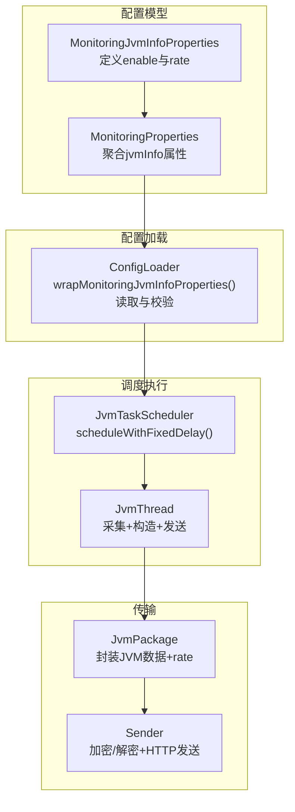
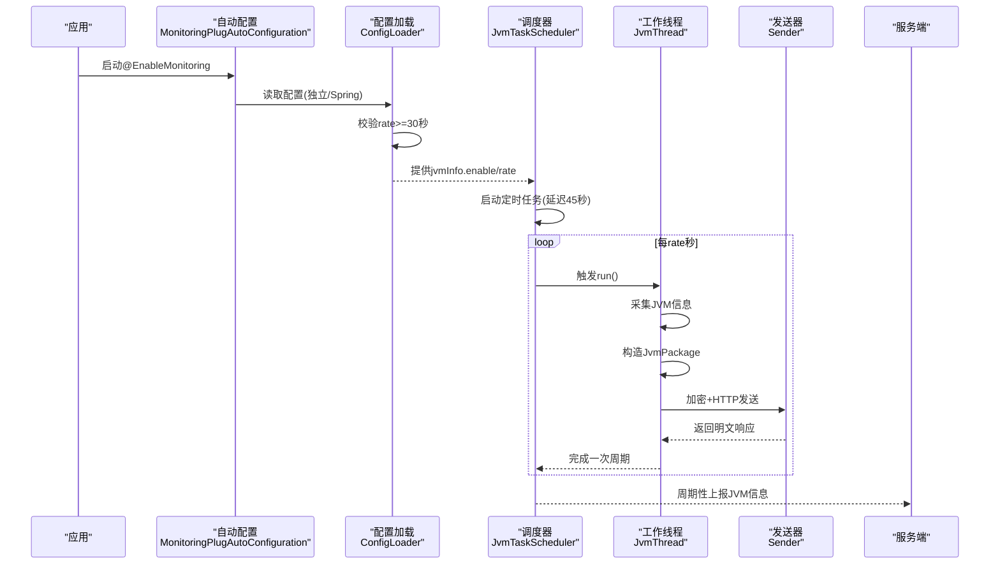
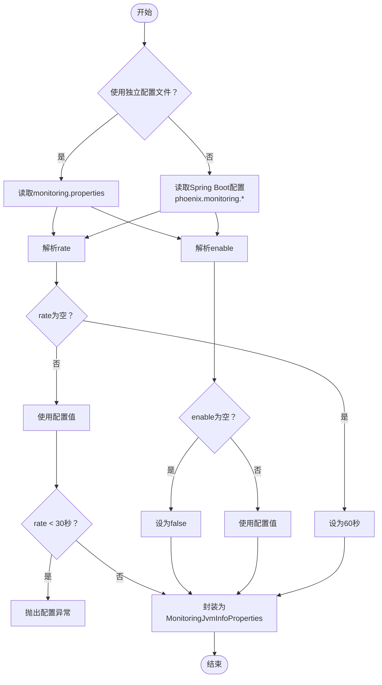
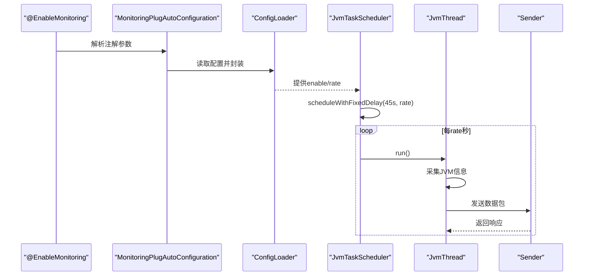
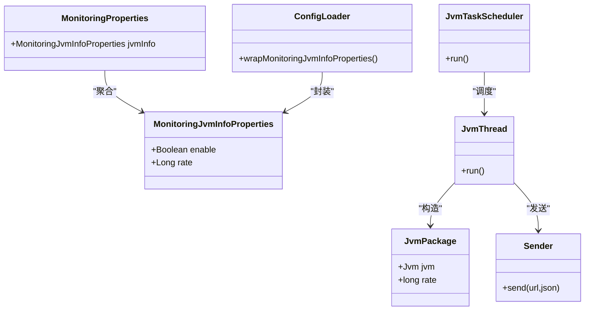

# JVM信息监控参数

<cite>
**本文引用的文件**
- [MonitoringJvmInfoProperties.java](file://phoenix-common\phoenix-common-core\src\main\java\com\gitee\pifeng\monitoring\common\property\client\MonitoringJvmInfoProperties.java)
- [MonitoringProperties.java](file://phoenix-common\phoenix-common-core\src\main\java\com\gitee\pifeng\monitoring\common\property\client\MonitoringProperties.java)
- [ConfigLoader.java](file://phoenix-client\phoenix-client-core\src\main\java\com\gitee\pifeng\monitoring\plug\core\ConfigLoader.java)
- [JvmTaskScheduler.java](file://phoenix-client\phoenix-client-core\src\main\java\com\gitee\pifeng\monitoring\plug\scheduler\JvmTaskScheduler.java)
- [JvmThread.java](file://phoenix-client\phoenix-client-core\src\main\java\com\gitee\pifeng\monitoring\plug\thread\JvmThread.java)
- [Sender.java](file://phoenix-client\phoenix-client-core\src\main\java\com\gitee\pifeng\monitoring\plug\core\Sender.java)
- [JvmPackage.java](file://phoenix-common\phoenix-common-core\src\main\java\com\gitee\pifeng\monitoring\common\dto\JvmPackage.java)
- [monitoring.properties](file://phoenix-client\phoenix-client-core\src\main\resources\monitoring.properties)
- [monitoring-dev.properties](file://phoenix-agent\src\main\resources\monitoring-dev.properties)
- [EnableMonitoring.java](file://phoenix-client\phoenix-client-spring-boot-starter\src\main\java\com\gitee\pifeng\monitoring\starter\annotation\EnableMonitoring.java)
- [MonitoringPlugAutoConfiguration.java](file://phoenix-client\phoenix-client-spring-boot-starter\src\main\java\com\gitee\pifeng\monitoring\starter\autoconfigure\MonitoringPlugAutoConfiguration.java)
- [MonitoringSpringBootProperties.java](file://phoenix-client\phoenix-client-spring-boot-starter\src\main\java\com\gitee\pifeng\monitoring\starter\property\MonitoringSpringBootProperties.java)
</cite>

## 目录
1. [简介](#简介)
2. [项目结构](#项目结构)
3. [核心组件](#核心组件)
4. [架构总览](#架构总览)
5. [详细组件分析](#详细组件分析)
6. [依赖关系分析](#依赖关系分析)
7. [性能考量](#性能考量)
8. [故障排查指南](#故障排查指南)
9. [结论](#结论)
10. [附录](#附录)

## 简介
本文围绕JVM信息监控参数进行系统化配置说明，重点解析MonitoringJvmInfoProperties类中的两个核心配置项：enable（是否采集）与rate（发送频率）。内容涵盖参数作用、设置方式、启用/禁用场景、频率对系统性能的影响、最佳实践以及具体配置示例，帮助用户结合自身应用特点合理设置JVM信息监控。

## 项目结构
JVM信息监控涉及客户端插件、自动配置、配置加载与调度执行等模块：
- 配置模型层：定义监控属性模型，包含JVM信息属性
- 配置加载层：负责读取独立配置或Spring Boot配置，并校验与封装
- 调度执行层：按配置启动定时任务，周期性采集并发送JVM信息
- 传输层：负责数据包构造、加解密与HTTP发送

图表来源
- [MonitoringJvmInfoProperties.java:20-32](file://phoenix-common\phoenix-common-core\src\main\java\com\gitee\pifeng\monitoring\common\property\client\MonitoringJvmInfoProperties.java#L20-L32)
- [MonitoringProperties.java:50-54](file://phoenix-common\phoenix-common-core\src\main\java\com\gitee\pifeng\monitoring\common\property\client\MonitoringProperties.java#L50-L54)
- [ConfigLoader.java:605-634](file://phoenix-client\phoenix-client-core\src\main\java\com\gitee\pifeng\monitoring\plug\core\ConfigLoader.java#L605-L634)
- [JvmTaskScheduler.java:40-48](file://phoenix-client\phoenix-client-core\src\main\java\com\gitee\pifeng\monitoring\plug\scheduler\JvmTaskScheduler.java#L40-L48)
- [JvmThread.java:40-73](file://phoenix-client\phoenix-client-core\src\main\java\com\gitee\pifeng\monitoring\plug\thread\JvmThread.java#L40-L73)
- [Sender.java:42-59](file://phoenix-client\phoenix-client-core\src\main\java\com\gitee\pifeng\monitoring\plug\core\Sender.java#L42-L59)
- [JvmPackage.java:21-33](file://phoenix-common\phoenix-common-core\src\main\java\com\gitee\pifeng\monitoring\common\dto\JvmPackage.java#L21-L33)

章节来源
- [MonitoringJvmInfoProperties.java:1-33](file://phoenix-common\phoenix-common-core\src\main\java\com\gitee\pifeng\monitoring\common\property\client\MonitoringJvmInfoProperties.java#L1-L33)
- [MonitoringProperties.java:1-56](file://phoenix-common\phoenix-common-core\src\main\java\com\gitee\pifeng\monitoring\common\property\client\MonitoringProperties.java#L1-L56)
- [ConfigLoader.java:592-636](file://phoenix-client\phoenix-client-core\src\main\java\com\gitee\pifeng\monitoring\plug\core\ConfigLoader.java#L592-L636)
- [JvmTaskScheduler.java:1-51](file://phoenix-client\phoenix-client-core\src\main\java\com\gitee\pifeng\monitoring\plug\scheduler\JvmTaskScheduler.java#L1-L51)
- [JvmThread.java:1-76](file://phoenix-client\phoenix-client-core\src\main\java\com\gitee\pifeng\monitoring\plug\thread\JvmThread.java#L1-L76)
- [Sender.java:1-61](file://phoenix-client\phoenix-client-core\src\main\java\com\gitee\pifeng\monitoring\plug\core\Sender.java#L1-L61)
- [JvmPackage.java:1-34](file://phoenix-common\phoenix-common-core\src\main\java\com\gitee\pifeng\monitoring\common\dto\JvmPackage.java#L1-L34)

## 核心组件
- MonitoringJvmInfoProperties：定义JVM信息监控的两个关键配置项
  - enable：布尔型，控制是否采集并发送JVM信息
  - rate：长整型，单位秒，控制发送频率，存在最小阈值限制
- ConfigLoader.wrapMonitoringJvmInfoProperties：负责从独立配置或Spring配置读取上述参数，进行默认值填充与合法性校验
- JvmTaskScheduler.run：在enable为true时，按rate启动固定频率的定时任务
- JvmThread.run：采集JVM信息、构造数据包、发送到服务端
- Sender：负责数据包加解密与HTTP发送
- JvmPackage：承载JVM数据与发送频率字段

章节来源
- [MonitoringJvmInfoProperties.java:20-32](file://phoenix-common\phoenix-common-core\src\main\java\com\gitee\pifeng\monitoring\common\property\client\MonitoringJvmInfoProperties.java#L20-L32)
- [ConfigLoader.java:605-634](file://phoenix-client\phoenix-client-core\src\main\java\com\gitee\pifeng\monitoring\plug\core\ConfigLoader.java#L605-L634)
- [JvmTaskScheduler.java:40-48](file://phoenix-client\phoenix-client-core\src\main\java\com\gitee\pifeng\monitoring\plug\scheduler\JvmTaskScheduler.java#L40-L48)
- [JvmThread.java:40-73](file://phoenix-client\phoenix-client-core\src\main\java\com\gitee\pifeng\monitoring\plug\thread\JvmThread.java#L40-L73)
- [Sender.java:42-59](file://phoenix-client\phoenix-client-core\src\main\java\com\gitee\pifeng\monitoring\plug\core\Sender.java#L42-L59)
- [JvmPackage.java:21-33](file://phoenix-common\phoenix-common-core\src\main\java\com\gitee\pifeng\monitoring\common\dto\JvmPackage.java#L21-L33)

## 架构总览
下图展示JVM信息监控从配置到发送的端到端流程：

图表来源
- [MonitoringPlugAutoConfiguration.java:49-76](file://phoenix-client\phoenix-client-spring-boot-starter\src\main\java\com\gitee\pifeng\monitoring\starter\autoconfigure\MonitoringPlugAutoConfiguration.java#L49-L76)
- [ConfigLoader.java:605-634](file://phoenix-client\phoenix-client-core\src\main\java\com\gitee\pifeng\monitoring\plug\core\ConfigLoader.java#L605-L634)
- [JvmTaskScheduler.java:40-48](file://phoenix-client\phoenix-client-core\src\main\java\com\gitee\pifeng\monitoring\plug\scheduler\JvmTaskScheduler.java#L40-L48)
- [JvmThread.java:40-73](file://phoenix-client\phoenix-client-core\src\main\java\com\gitee\pifeng\monitoring\plug\thread\JvmThread.java#L40-L73)
- [Sender.java:42-59](file://phoenix-client\phoenix-client-core\src\main\java\com\gitee\pifeng\monitoring\plug\core\Sender.java#L42-L59)

## 详细组件分析

### enable 参数：控制JVM信息采集的开关
- 作用
  - 当为true时，系统按rate频率周期性采集并发送JVM信息
  - 当为false时，不启动JVM信息采集与发送任务
- 设置位置
  - 独立配置文件：monitoring.properties 中的 monitoring.jvm-info.enable
  - Spring Boot配置：phoenix.monitoring.jvmInfo.enable（通过MonitoringSpringBootProperties映射）
- 默认行为
  - 独立配置文件默认关闭（false）
  - Spring Boot配置默认未显式设置，遵循默认值策略
- 使用场景
  - 开发/测试环境：可按需开启，便于观察JVM状态
  - 生产环境：建议谨慎开启，避免额外开销
  - 资源受限容器/边缘节点：建议关闭或提高rate以降低频率

章节来源
- [monitoring.properties:38-41](file://phoenix-client\phoenix-client-core\src\main\resources\monitoring.properties#L38-L41)
- [MonitoringSpringBootProperties.java:17-22](file://phoenix-client\phoenix-client-spring-boot-starter\src\main\java\com\gitee\pifeng\monitoring\starter\property\MonitoringSpringBootProperties.java#L17-L22)
- [ConfigLoader.java:613-624](file://phoenix-client\phoenix-client-core\src\main\java\com\gitee\pifeng\monitoring\plug\core\ConfigLoader.java#L613-L624)
- [JvmTaskScheduler.java:40-48](file://phoenix-client\phoenix-client-core\src\main\java\com\gitee\pifeng\monitoring\plug\scheduler\JvmTaskScheduler.java#L40-L48)

### rate 参数：设置JVM信息发送频率
- 作用
  - 控制JVM信息采集与发送的时间间隔（单位：秒）
  - 存在最小阈值限制（最小30秒），低于该值将触发配置异常
- 设置位置
  - 独立配置文件：monitoring.jvm-info.rate
  - Spring Boot配置：phoenix.monitoring.jvmInfo.rate
- 默认行为
  - 独立配置文件默认60秒
  - Spring Boot配置默认未显式设置，遵循默认值策略
- 合法范围
  - 最小值：30秒
  - 建议值：根据业务需求与资源情况选择，如30~60秒用于高频观测，60~300秒用于常规监控

章节来源
- [monitoring.properties:40-41](file://phoenix-client\phoenix-client-core\src\main\resources\monitoring.properties#L40-L41)
- [monitoring-dev.properties:39-41](file://phoenix-agent\src\main\resources\monitoring-dev.properties#L39-L41)
- [ConfigLoader.java:611-629](file://phoenix-client\phoenix-client-core\src\main\java\com\gitee\pifeng\monitoring\plug\core\ConfigLoader.java#L611-L629)
- [JvmTaskScheduler.java:44-47](file://phoenix-client\phoenix-client-core\src\main\java\com\gitee\pifeng\monitoring\plug\scheduler\JvmTaskScheduler.java#L44-L47)

### 配置加载与封装流程
- 读取顺序
  - 若使用独立配置文件：从monitoring.properties读取
  - 若使用Spring Boot配置：从application.yml映射至phoenix.monitoring前缀
- 校验逻辑
  - rate必须≥30秒，否则抛出配置异常
  - enable为null时视为false
  - rate为null时采用默认值（60秒）
- 结果封装
  - 将结果写入MonitoringJvmInfoProperties并注入全局监控属性

图表来源
- [ConfigLoader.java:605-634](file://phoenix-client\phoenix-client-core\src\main\java\com\gitee\pifeng\monitoring\plug\core\ConfigLoader.java#L605-L634)

章节来源
- [ConfigLoader.java:605-634](file://phoenix-client\phoenix-client-core\src\main\java\com\gitee\pifeng\monitoring\plug\core\ConfigLoader.java#L605-L634)

### 启动与调度执行
- 启动入口
  - 通过@EnableMonitoring注解触发自动配置
  - 自动配置类根据参数决定使用独立配置文件还是Spring Boot配置
- 调度策略
  - 当enable为true时，按rate启动固定频率任务
  - 首次延迟45秒，随后每rate秒执行一次
- 执行内容
  - 采集JVM信息
  - 构造JvmPackage并发送
  - 记录耗时与异常

图表来源
- [EnableMonitoring.java:16-60](file://phoenix-client\phoenix-client-spring-boot-starter\src\main\java\com\gitee\pifeng\monitoring\starter\annotation\EnableMonitoring.java#L16-L60)
- [MonitoringPlugAutoConfiguration.java:49-76](file://phoenix-client\phoenix-client-spring-boot-starter\src\main\java\com\gitee\pifeng\monitoring\starter\autoconfigure\MonitoringPlugAutoConfiguration.java#L49-L76)
- [JvmTaskScheduler.java:40-48](file://phoenix-client\phoenix-client-core\src\main\java\com\gitee\pifeng\monitoring\plug\scheduler\JvmTaskScheduler.java#L40-L48)
- [JvmThread.java:40-73](file://phoenix-client\phoenix-client-core\src\main\java\com\gitee\pifeng\monitoring\plug\thread\JvmThread.java#L40-L73)
- [Sender.java:42-59](file://phoenix-client\phoenix-client-core\src\main\java\com\gitee\pifeng\monitoring\plug\core\Sender.java#L42-L59)

章节来源
- [EnableMonitoring.java:16-60](file://phoenix-client\phoenix-client-spring-boot-starter\src\main\java\com\gitee\pifeng\monitoring\starter\annotation\EnableMonitoring.java#L16-L60)
- [MonitoringPlugAutoConfiguration.java:49-76](file://phoenix-client\phoenix-client-spring-boot-starter\src\main\java\com\gitee\pifeng\monitoring\starter\autoconfigure\MonitoringPlugAutoConfiguration.java#L49-L76)
- [JvmTaskScheduler.java:40-48](file://phoenix-client\phoenix-client-core\src\main\java\com\gitee\pifeng\monitoring\plug\scheduler\JvmTaskScheduler.java#L40-L48)
- [JvmThread.java:40-73](file://phoenix-client\phoenix-client-core\src\main\java\com\gitee\pifeng\monitoring\plug\thread\JvmThread.java#L40-L73)
- [Sender.java:42-59](file://phoenix-client\phoenix-client-core\src\main\java\com\gitee\pifeng\monitoring\plug\core\Sender.java#L42-L59)

### 数据包与传输
- 数据包结构
  - JvmPackage包含JVM实体与rate字段，用于服务端识别发送频率
- 加解密与发送
  - Sender对请求体进行加密后发送，收到响应后再解密，保证传输安全
- 日志与耗时
  - 采集+发送过程记录耗时，超过临界值会输出警告日志

章节来源
- [JvmPackage.java:21-33](file://phoenix-common\phoenix-common-core\src\main\java\com\gitee\pifeng\monitoring\common\dto\JvmPackage.java#L21-L33)
- [Sender.java:42-59](file://phoenix-client\phoenix-client-core\src\main\java\com\gitee\pifeng\monitoring\plug\core\Sender.java#L42-L59)
- [JvmThread.java:60-72](file://phoenix-client\phoenix-client-core\src\main\java\com\gitee\pifeng\monitoring\plug\thread\JvmThread.java#L60-L72)

## 依赖关系分析
- 组件耦合
  - MonitoringJvmInfoProperties与MonitoringProperties聚合关系明确
  - ConfigLoader依赖于独立配置或Spring配置，统一产出MonitoringJvmInfoProperties
  - JvmTaskScheduler依赖ConfigLoader提供的配置，驱动JvmThread执行
  - JvmThread依赖JvmUtils采集JVM信息，依赖ClientPackageConstructor构造数据包，依赖Sender发送
- 外部依赖
  - HTTP客户端与加解密工具由Sender封装
  - 日志框架用于运行时告警与调试

图表来源
- [MonitoringJvmInfoProperties.java:20-32](file://phoenix-common\phoenix-common-core\src\main\java\com\gitee\pifeng\monitoring\common\property\client\MonitoringJvmInfoProperties.java#L20-L32)
- [MonitoringProperties.java:50-54](file://phoenix-common\phoenix-common-core\src\main\java\com\gitee\pifeng\monitoring\common\property\client\MonitoringProperties.java#L50-L54)
- [ConfigLoader.java:605-634](file://phoenix-client\phoenix-client-core\src\main\java\com\gitee\pifeng\monitoring\plug\core\ConfigLoader.java#L605-L634)
- [JvmTaskScheduler.java:40-48](file://phoenix-client\phoenix-client-core\src\main\java\com\gitee\pifeng\monitoring\plug\scheduler\JvmTaskScheduler.java#L40-L48)
- [JvmThread.java:40-73](file://phoenix-client\phoenix-client-core\src\main\java\com\gitee\pifeng\monitoring\plug\thread\JvmThread.java#L40-L73)
- [Sender.java:42-59](file://phoenix-client\phoenix-client-core\src\main\java\com\gitee\pifeng\monitoring\plug\core\Sender.java#L42-L59)
- [JvmPackage.java:21-33](file://phoenix-common\phoenix-common-core\src\main\java\com\gitee\pifeng\monitoring\common\dto\JvmPackage.java#L21-L33)

章节来源
- [MonitoringJvmInfoProperties.java:1-33](file://phoenix-common\phoenix-common-core\src\main\java\com\gitee\pifeng\monitoring\common\property\client\MonitoringJvmInfoProperties.java#L1-L33)
- [MonitoringProperties.java:1-56](file://phoenix-common\phoenix-common-core\src\main\java\com\gitee\pifeng\monitoring\common\property\client\MonitoringProperties.java#L1-L56)
- [ConfigLoader.java:605-634](file://phoenix-client\phoenix-client-core\src\main\java\com\gitee\pifeng\monitoring\plug\core\ConfigLoader.java#L605-L634)
- [JvmTaskScheduler.java:1-51](file://phoenix-client\phoenix-client-core\src\main\java\com\gitee\pifeng\monitoring\plug\scheduler\JvmTaskScheduler.java#L1-L51)
- [JvmThread.java:1-76](file://phoenix-client\phoenix-client-core\src\main\java\com\gitee\pifeng\monitoring\plug\thread\JvmThread.java#L1-L76)
- [Sender.java:1-61](file://phoenix-client\phoenix-client-core\src\main\java\com\gitee\pifeng\monitoring\plug\core\Sender.java#L1-L61)
- [JvmPackage.java:1-34](file://phoenix-common\phoenix-common-core\src\main\java\com\gitee\pifeng\monitoring\common\dto\JvmPackage.java#L1-L34)

## 性能考量
- enable=false：完全关闭JVM信息采集，无任何额外开销
- enable=true且rate较小（接近最小阈值30秒）：采集与发送更频繁，CPU与网络占用增加，适合高敏感场景
- enable=true且rate较大（如120~300秒）：降低采集频率，减少系统负载，适合常规监控
- 单次采集耗时：若超过临界值（默认5秒），日志会输出警告，提示关注JVM信息采集链路性能
- 网络与加解密：每次发送均进行加解密与HTTP请求，应结合服务端处理能力与带宽进行权衡

章节来源
- [JvmTaskScheduler.java:44-47](file://phoenix-client\phoenix-client-core\src\main\java\com\gitee\pifeng\monitoring\plug\scheduler\JvmTaskScheduler.java#L44-L47)
- [JvmThread.java:60-72](file://phoenix-client\phoenix-client-core\src\main\java\com\gitee\pifeng\monitoring\plug\thread\JvmThread.java#L60-L72)
- [ConfigLoader.java:626-629](file://phoenix-client\phoenix-client-core\src\main\java\com\gitee\pifeng\monitoring\plug\core\ConfigLoader.java#L626-L629)

## 故障排查指南
- 配置异常
  - 症状：启动时报错，提示“获取Java虚拟机信息频率最小不能小于30秒”
  - 原因：rate配置小于30秒
  - 处理：将rate调整为≥30秒
- 无数据上报
  - 症状：服务端未收到JVM信息
  - 排查：
    - 检查enable是否为true
    - 检查rate是否合理（≥30秒）
    - 检查网络连通性与服务端URL配置
- 性能问题
  - 症状：应用CPU升高或日志出现耗时警告
  - 排查：
    - 提高rate，降低采集频率
    - 检查服务端处理能力与网络状况
- 配置文件路径错误
  - 症状：注解参数解析失败
  - 处理：确保@EnableMonitoring的configFilePath以classpath:或filepath:开头

章节来源
- [ConfigLoader.java:626-629](file://phoenix-client\phoenix-client-core\src\main\java\com\gitee\pifeng\monitoring\plug\core\ConfigLoader.java#L626-L629)
- [JvmThread.java:54-60](file://phoenix-client\phoenix-client-core\src\main\java\com\gitee\pifeng\monitoring\plug\thread\JvmThread.java#L54-L60)
- [MonitoringPlugAutoConfiguration.java:88-97](file://phoenix-client\phoenix-client-spring-boot-starter\src\main\java\com\gitee\pifeng\monitoring\starter\autoconfigure\MonitoringPlugAutoConfiguration.java#L88-L97)

## 结论
- enable与rate共同决定了JVM信息监控的行为与开销
- 合理设置enable可避免不必要的资源消耗
- 合理设置rate可在可观测性与性能之间取得平衡
- 建议生产环境默认关闭JVM信息采集，按需开启并适当提高rate

## 附录

### 配置示例与最佳实践
- 示例一：开发环境高频观测
  - enable=true
  - rate=30
  - 适用：快速定位JVM相关问题
- 示例二：生产环境常规监控
  - enable=true
  - rate=120
  - 适用：日常运维观察
- 示例三：资源受限环境
  - enable=false
  - 或者
  - enable=true
  - rate=300
  - 适用：降低系统负担
- 示例四：Spring Boot集成
  - 在application.yml中设置phoenix.monitoring.jvmInfo.enable与phoenix.monitoring.jvmInfo.rate
  - 通过@EnableMonitoring(usingMonitoringConfigFile=false)直接复用Spring配置

章节来源
- [monitoring.properties:38-41](file://phoenix-client\phoenix-client-core\src\main\resources\monitoring.properties#L38-L41)
- [monitoring-dev.properties:38-41](file://phoenix-agent\src\main\resources\monitoring-dev.properties#L38-L41)
- [MonitoringSpringBootProperties.java:17-22](file://phoenix-client\phoenix-client-spring-boot-starter\src\main\java\com\gitee\pifeng\monitoring\starter\property\MonitoringSpringBootProperties.java#L17-L22)
- [EnableMonitoring.java:58-60](file://phoenix-client\phoenix-client-spring-boot-starter\src\main\java\com\gitee\pifeng\monitoring\starter\annotation\EnableMonitoring.java#L58-L60)