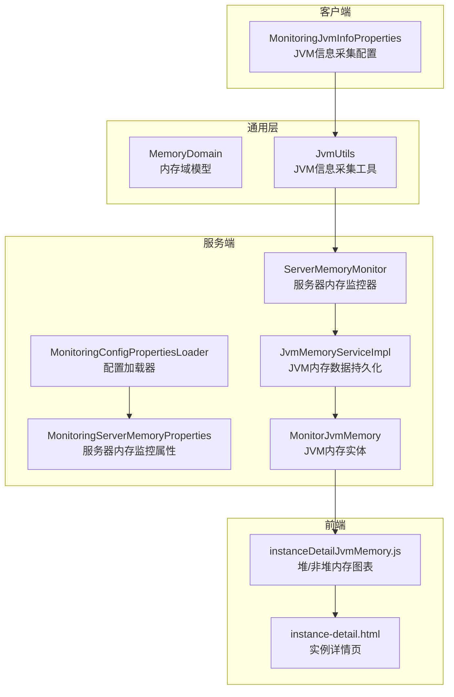
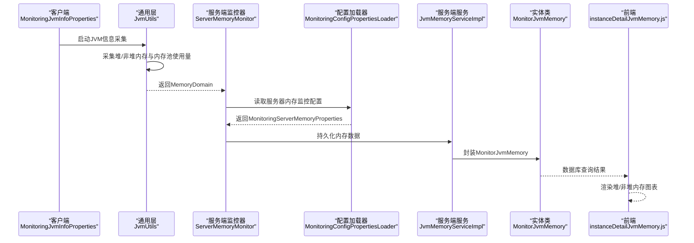
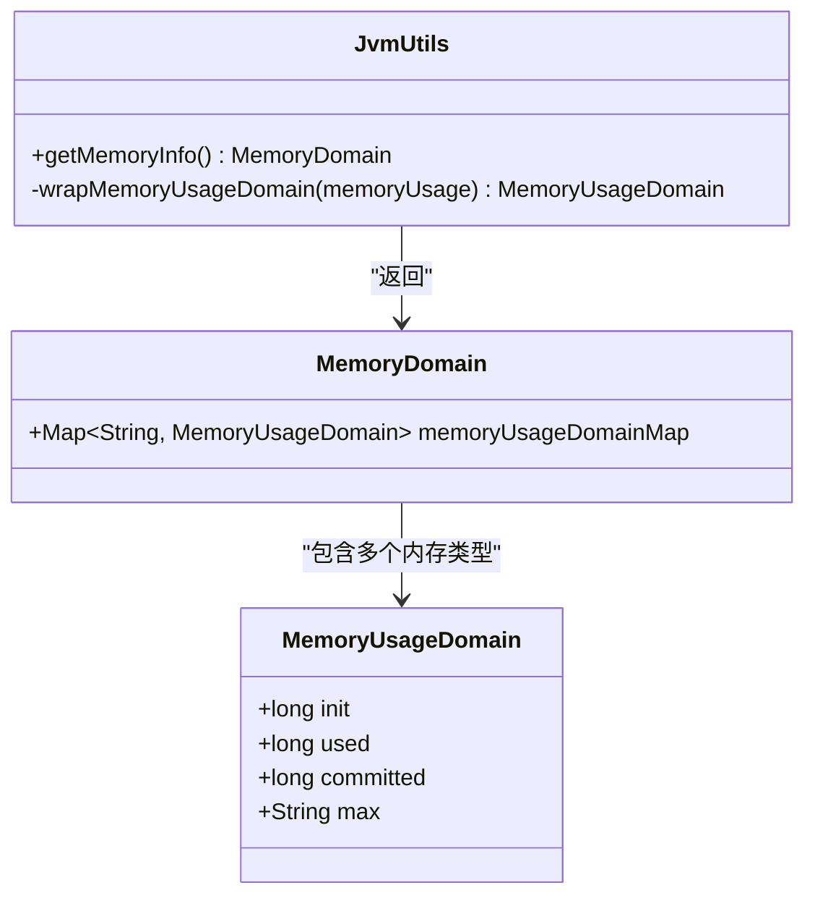
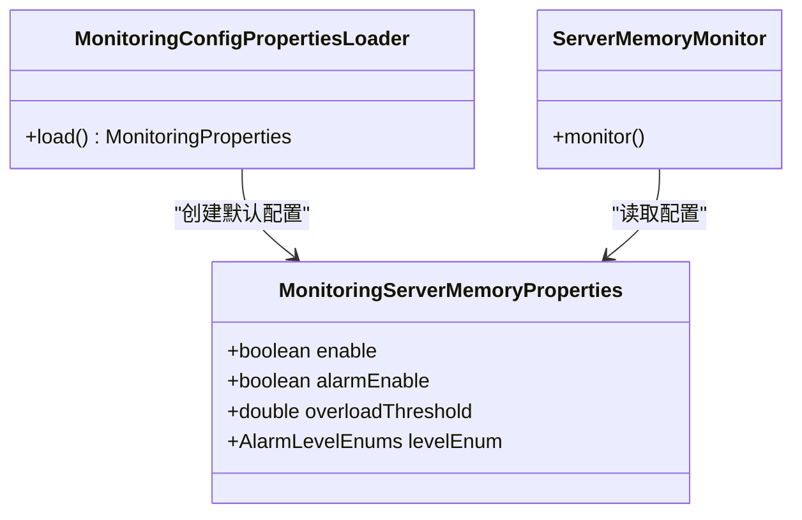
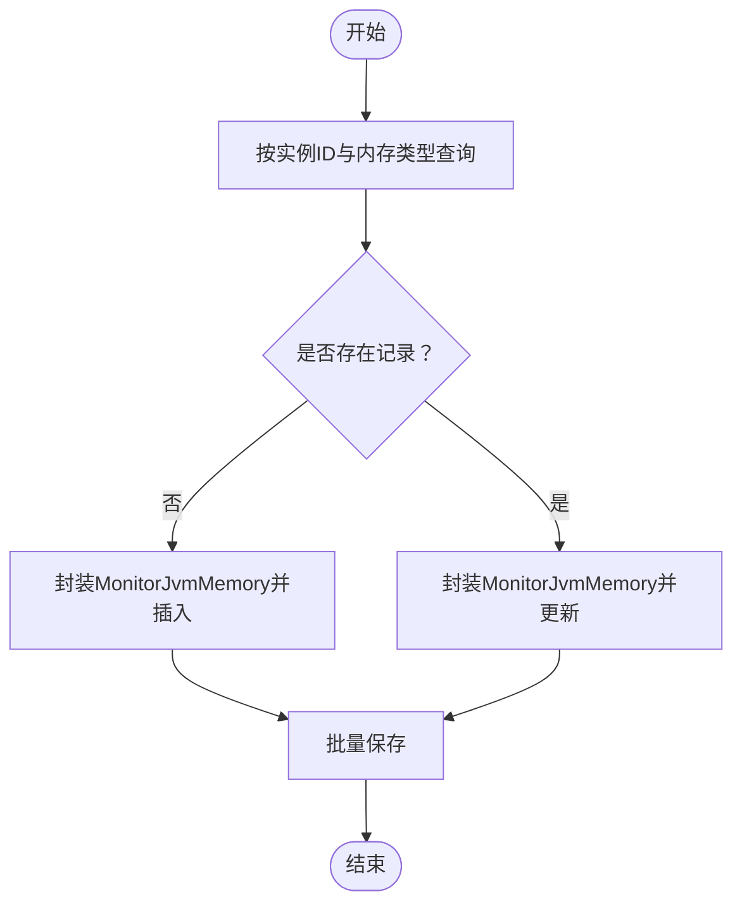
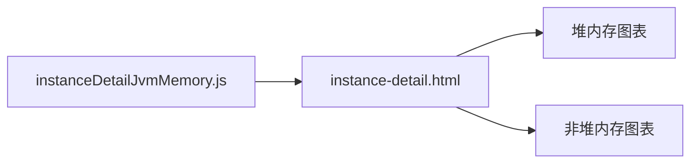
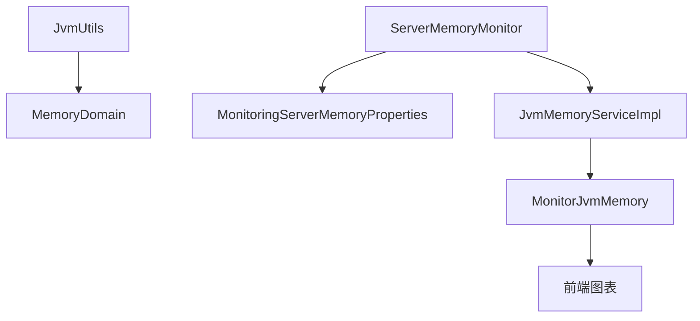

# JVM内存监控参数

<cite>
**本文引用的文件**
- [MemoryDomain.java](file://phoenix-common\phoenix-common-core\src\main\java\com\gitee\pifeng\monitoring\common\domain\jvm\MemoryDomain.java)
- [JvmUtils.java](file://phoenix-common\phoenix-common-core\src\main\java\com\gitee\pifeng\monitoring\common\util\jvm\JvmUtils.java)
- [MonitoringServerMemoryProperties.java](file://phoenix-common\phoenix-common-core\src\main\java\com\gitee\pifeng\monitoring\common\property\server\MonitoringServerMemoryProperties.java)
- [MonitoringConfigPropertiesLoader.java](file://phoenix-server\src\main\java\com\gitee\pifeng\monitoring\server\business\server\core\MonitoringConfigPropertiesLoader.java)
- [ServerMemoryMonitor.java](file://phoenix-server\src\main\java\com\gitee\pifeng\monitoring\server\business\server\monitor\server\ServerMemoryMonitor.java)
- [JvmMemoryServiceImpl.java](file://phoenix-server\src\main\java\com\gitee\pifeng\monitoring\server\business\server\service\impl\JvmMemoryServiceImpl.java)
- [MonitorJvmMemory.java](file://phoenix-server\src\main\java\com\gitee\pifeng\monitoring\server\business\server\entity\MonitorJvmMemory.java)
- [MonitoringJvmInfoProperties.java](file://phoenix-common\phoenix-common-core\src\main\java\com\gitee\pifeng\monitoring\common\property\client\MonitoringJvmInfoProperties.java)
- [instanceDetailJvmMemory.js](file://phoenix-ui\src\main\resources\static\modules\instance\instanceDetailJvmMemory.js)
- [instance-detail.html](file://phoenix-ui\src\main\resources\templates\instance\instance-detail.html)
</cite>

## 目录
1. [简介](#简介)
2. [项目结构](#项目结构)
3. [核心组件](#核心组件)
4. [架构总览](#架构总览)
5. [详细组件分析](#详细组件分析)
6. [依赖关系分析](#依赖关系分析)
7. [性能考量](#性能考量)
8. [故障排查指南](#故障排查指南)
9. [结论](#结论)
10. [附录](#附录)

## 简介
本文件围绕JVM内存监控参数展开，系统性梳理并解释了内存监控配置参数的设计与实现，重点覆盖以下方面：
- 堆内存使用率阈值设置与过载告警机制
- 非堆内存监控配置与数据采集
- 内存池维度的监控（新生代、老年代、元空间/永久代等）
- 内存监控指标的配置方法与最佳实践
- 如何通过监控参数及时发现并解决内存相关问题

在该代码库中，JVM内存监控由“客户端采集—服务端存储—前端展示”三层协同完成，配置参数主要集中在服务端配置加载器与服务端内存监控属性类中。

## 项目结构
JVM内存监控涉及的关键模块与文件如下：
- 通用领域模型与工具：MemoryDomain（内存域模型）、JvmUtils（JVM信息采集工具）
- 服务端配置与监控：MonitoringServerMemoryProperties（服务器内存监控属性）、MonitoringConfigPropertiesLoader（配置加载器）、ServerMemoryMonitor（服务器内存监控器）
- 服务端存储：JvmMemoryServiceImpl（JVM内存数据持久化）、MonitorJvmMemory（JVM内存实体）
- 客户端配置：MonitoringJvmInfoProperties（JVM信息采集开关与频率）
- 前端展示：instanceDetailJvmMemory.js（图表初始化）、instance-detail.html（页面模板）

**图表来源**
- [MonitoringJvmInfoProperties.java:1-33](file://phoenix-common\phoenix-common-core\src\main\java\com\gitee\pifeng\monitoring\common\property\client\MonitoringJvmInfoProperties.java#L1-L33)
- [MemoryDomain.java:1-65](file://phoenix-common\phoenix-common-core\src\main\java\com\gitee\pifeng\monitoring\common\domain\jvm\MemoryDomain.java#L1-L65)
- [JvmUtils.java:51-204](file://phoenix-common\phoenix-common-core\src\main\java\com\gitee\pifeng\monitoring\common\util\jvm\JvmUtils.java#L51-L204)
- [MonitoringServerMemoryProperties.java:1-43](file://phoenix-common\phoenix-common-core\src\main\java\com\gitee\pifeng\monitoring\common\property\server\MonitoringServerMemoryProperties.java#L1-L43)
- [MonitoringConfigPropertiesLoader.java:162-166](file://phoenix-server\src\main\java\com\gitee\pifeng\monitoring\server\business\server\core\MonitoringConfigPropertiesLoader.java#L162-L166)
- [ServerMemoryMonitor.java:90-193](file://phoenix-server\src\main\java\com\gitee\pifeng\monitoring\server\business\server\monitor\server\ServerMemoryMonitor.java#L90-L193)
- [JvmMemoryServiceImpl.java:60-81](file://phoenix-server\src\main\java\com\gitee\pifeng\monitoring\server\business\server\service\impl\JvmMemoryServiceImpl.java#L60-L81)
- [MonitorJvmMemory.java:1-64](file://phoenix-server\src\main\java\com\gitee\pifeng\monitoring\server\business\server\entity\MonitorJvmMemory.java#L1-L64)
- [instanceDetailJvmMemory.js:4-5](file://phoenix-ui\src\main\resources\static\modules\instance\instanceDetailJvmMemory.js#L4-L5)
- [instance-detail.html:65-66](file://phoenix-ui\src\main\resources\templates\instance\instance-detail.html#L65-L66)

**章节来源**
- [MonitoringJvmInfoProperties.java:1-33](file://phoenix-common\phoenix-common-core\src\main\java\com\gitee\pifeng\monitoring\common\property\client\MonitoringJvmInfoProperties.java#L1-L33)
- [MemoryDomain.java:1-65](file://phoenix-common\phoenix-common-core\src\main\java\com\gitee\pifeng\monitoring\common\domain\jvm\MemoryDomain.java#L1-L65)
- [JvmUtils.java:51-204](file://phoenix-common\phoenix-common-core\src\main\java\com\gitee\pifeng\monitoring\common\util\jvm\JvmUtils.java#L51-L204)
- [MonitoringServerMemoryProperties.java:1-43](file://phoenix-common\phoenix-common-core\src\main\java\com\gitee\pifeng\monitoring\common\property\server\MonitoringServerMemoryProperties.java#L1-L43)
- [MonitoringConfigPropertiesLoader.java:162-166](file://phoenix-server\src\main\java\com\gitee\pifeng\monitoring\server\business\server\core\MonitoringConfigPropertiesLoader.java#L162-L166)
- [ServerMemoryMonitor.java:90-193](file://phoenix-server\src\main\java\com\gitee\pifeng\monitoring\server\business\server\monitor\server\ServerMemoryMonitor.java#L90-L193)
- [JvmMemoryServiceImpl.java:60-81](file://phoenix-server\src\main\java\com\gitee\pifeng\monitoring\server\business\server\service\impl\JvmMemoryServiceImpl.java#L60-L81)
- [MonitorJvmMemory.java:1-64](file://phoenix-server\src\main\java\com\gitee\pifeng\monitoring\server\business\server\entity\MonitorJvmMemory.java#L1-L64)
- [instanceDetailJvmMemory.js:4-5](file://phoenix-ui\src\main\resources\static\modules\instance\instanceDetailJvmMemory.js#L4-L5)
- [instance-detail.html:65-66](file://phoenix-ui\src\main\resources\templates\instance\instance-detail.html#L65-L66)

## 核心组件
本节聚焦JVM内存监控参数的核心组成与职责：
- MemoryDomain：描述JVM内存域模型，包含不同内存类型的使用量映射，以及每种内存类型的初始、已用、提交、最大等字段。
- JvmUtils：负责从JVM MXBean采集堆内存、非堆内存及各内存池的使用情况，并封装为MemoryDomain。
- MonitoringServerMemoryProperties：服务端服务器内存监控属性，包含是否启用监控、是否启用告警、过载阈值、告警级别等。
- MonitoringConfigPropertiesLoader：加载监控配置，其中包含默认的服务器内存监控属性配置。
- ServerMemoryMonitor：服务端内存监控器，读取配置并执行监控逻辑。
- JvmMemoryServiceImpl：将采集到的内存数据持久化至数据库。
- MonitorJvmMemory：JVM内存数据的实体类，对应数据库表MONITOR_JVM_MEMORY。
- MonitoringJvmInfoProperties：客户端侧JVM信息采集的开关与采样频率配置。
- 前端脚本与模板：instanceDetailJvmMemory.js与instance-detail.html用于堆/非堆内存图表展示。

**章节来源**
- [MemoryDomain.java:1-65](file://phoenix-common\phoenix-common-core\src\main\java\com\gitee\pifeng\monitoring\common\domain\jvm\MemoryDomain.java#L1-L65)
- [JvmUtils.java:152-189](file://phoenix-common\phoenix-common-core\src\main\java\com\gitee\pifeng\monitoring\common\util\jvm\JvmUtils.java#L152-L189)
- [MonitoringServerMemoryProperties.java:1-43](file://phoenix-common\phoenix-common-core\src\main\java\com\gitee\pifeng\monitoring\common\property\server\MonitoringServerMemoryProperties.java#L1-L43)
- [MonitoringConfigPropertiesLoader.java:162-166](file://phoenix-server\src\main\java\com\gitee\pifeng\monitoring\server\business\server\core\MonitoringConfigPropertiesLoader.java#L162-L166)
- [ServerMemoryMonitor.java:90-193](file://phoenix-server\src\main\java\com\gitee\pifeng\monitoring\server\business\server\monitor\server\ServerMemoryMonitor.java#L90-L193)
- [JvmMemoryServiceImpl.java:60-81](file://phoenix-server\src\main\java\com\gitee\pifeng\monitoring\server\business\server\service\impl\JvmMemoryServiceImpl.java#L60-L81)
- [MonitorJvmMemory.java:1-64](file://phoenix-server\src\main\java\com\gitee\pifeng\monitoring\server\business\server\entity\MonitorJvmMemory.java#L1-L64)
- [MonitoringJvmInfoProperties.java:1-33](file://phoenix-common\phoenix-common-core\src\main\java\com\gitee\pifeng\monitoring\common\property\client\MonitoringJvmInfoProperties.java#L1-L33)
- [instanceDetailJvmMemory.js:4-5](file://phoenix-ui\src\main\resources\static\modules\instance\instanceDetailJvmMemory.js#L4-L5)
- [instance-detail.html:65-66](file://phoenix-ui\src\main\resources\templates\instance\instance-detail.html#L65-L66)

## 架构总览
下图展示了JVM内存监控从客户端采集到服务端存储再到前端展示的整体流程：

**图表来源**
- [MonitoringJvmInfoProperties.java:1-33](file://phoenix-common\phoenix-common-core\src\main\java\com\gitee\pifeng\monitoring\common\property\client\MonitoringJvmInfoProperties.java#L1-L33)
- [JvmUtils.java:152-189](file://phoenix-common\phoenix-common-core\src\main\java\com\gitee\pifeng\monitoring\common\util\jvm\JvmUtils.java#L152-L189)
- [MonitoringConfigPropertiesLoader.java:162-166](file://phoenix-server\src\main\java\com\gitee\pifeng\monitoring\server\business\server\core\MonitoringConfigPropertiesLoader.java#L162-L166)
- [ServerMemoryMonitor.java:90-193](file://phoenix-server\src\main\java\com\gitee\pifeng\monitoring\server\business\server\monitor\server\ServerMemoryMonitor.java#L90-L193)
- [JvmMemoryServiceImpl.java:60-81](file://phoenix-server\src\main\java\com\gitee\pifeng\monitoring\server\business\server\service\impl\JvmMemoryServiceImpl.java#L60-L81)
- [MonitorJvmMemory.java:1-64](file://phoenix-server\src\main\java\com\gitee\pifeng\monitoring\server\business\server\entity\MonitorJvmMemory.java#L1-L64)
- [instanceDetailJvmMemory.js:4-5](file://phoenix-ui\src\main\resources\static\modules\instance\instanceDetailJvmMemory.js#L4-L5)

## 详细组件分析

### 1) MemoryDomain与JvmUtils：内存域模型与采集
- MemoryDomain定义了内存使用量的统一结构，包含内存类型到使用量域的映射；每个使用量域包含初始、已用、提交、最大等字段。
- JvmUtils通过JVM MXBean获取堆内存、非堆内存与各内存池的使用量，并封装为MemoryDomain，供上层监控器使用。

**图表来源**
- [MemoryDomain.java:24-61](file://phoenix-common\phoenix-common-core\src\main\java\com\gitee\pifeng\monitoring\common\domain\jvm\MemoryDomain.java#L24-L61)
- [JvmUtils.java:152-189](file://phoenix-common\phoenix-common-core\src\main\java\com\gitee\pifeng\monitoring\common\util\jvm\JvmUtils.java#L152-L189)

**章节来源**
- [MemoryDomain.java:1-65](file://phoenix-common\phoenix-common-core\src\main\java\com\gitee\pifeng\monitoring\common\domain\jvm\MemoryDomain.java#L1-L65)
- [JvmUtils.java:152-189](file://phoenix-common\phoenix-common-core\src\main\java\com\gitee\pifeng\monitoring\common\util\jvm\JvmUtils.java#L152-L189)

### 2) MonitoringServerMemoryProperties：服务器内存监控配置
- enable：是否启用服务器内存监控
- alarmEnable：是否启用告警
- overloadThreshold：过载阈值（百分比）
- levelEnum：告警级别（INFO < WARN < ERROR < FATAL）

这些参数由MonitoringConfigPropertiesLoader在默认情况下进行初始化，ServerMemoryMonitor在执行监控时读取并应用。

**图表来源**
- [MonitoringServerMemoryProperties.java:20-42](file://phoenix-common\phoenix-common-core\src\main\java\com\gitee\pifeng\monitoring\common\property\server\MonitoringServerMemoryProperties.java#L20-L42)
- [MonitoringConfigPropertiesLoader.java:162-166](file://phoenix-server\src\main\java\com\gitee\pifeng\monitoring\server\business\server\core\MonitoringConfigPropertiesLoader.java#L162-L166)
- [ServerMemoryMonitor.java:90-193](file://phoenix-server\src\main\java\com\gitee\pifeng\monitoring\server\business\server\monitor\server\ServerMemoryMonitor.java#L90-L193)

**章节来源**
- [MonitoringServerMemoryProperties.java:1-43](file://phoenix-common\phoenix-common-core\src\main\java\com\gitee\pifeng\monitoring\common\property\server\MonitoringServerMemoryProperties.java#L1-L43)
- [MonitoringConfigPropertiesLoader.java:162-166](file://phoenix-server\src\main\java\com\gitee\pifeng\monitoring\server\business\server\core\MonitoringConfigPropertiesLoader.java#L162-L166)
- [ServerMemoryMonitor.java:90-193](file://phoenix-server\src\main\java\com\gitee\pifeng\monitoring\server\business\server\monitor\server\ServerMemoryMonitor.java#L90-L193)

### 3) JvmMemoryServiceImpl与MonitorJvmMemory：内存数据持久化
- JvmMemoryServiceImpl根据实例ID与内存类型查询数据库，若不存在则新增，存在则更新，同时写入init、used、committed、max等字段。
- MonitorJvmMemory对应数据库表MONITOR_JVM_MEMORY，用于存储JVM内存历史数据。

**图表来源**
- [JvmMemoryServiceImpl.java:60-81](file://phoenix-server\src\main\java\com\gitee\pifeng\monitoring\server\business\server\service\impl\JvmMemoryServiceImpl.java#L60-L81)
- [MonitorJvmMemory.java:27-64](file://phoenix-server\src\main\java\com\gitee\pifeng\monitoring\server\business\server\entity\MonitorJvmMemory.java#L27-L64)

**章节来源**
- [JvmMemoryServiceImpl.java:60-81](file://phoenix-server\src\main\java\com\gitee\pifeng\monitoring\server\business\server\service\impl\JvmMemoryServiceImpl.java#L60-L81)
- [MonitorJvmMemory.java:1-64](file://phoenix-server\src\main\java\com\gitee\pifeng\monitoring\server\business\server\entity\MonitorJvmMemory.java#L1-L64)

### 4) 客户端配置：MonitoringJvmInfoProperties
- enable：是否采集JVM信息
- rate：发送JVM信息的频率（毫秒）

该配置控制客户端侧的采集行为，影响JvmUtils的采集频率与触发时机。

**章节来源**
- [MonitoringJvmInfoProperties.java:1-33](file://phoenix-common\phoenix-common-core\src\main\java\com\gitee\pifeng\monitoring\common\property\client\MonitoringJvmInfoProperties.java#L1-L33)

### 5) 前端展示：堆/非堆内存图表
- instanceDetailJvmMemory.js初始化堆内存与非堆内存的ECharts图表
- instance-detail.html提供挂载图表的容器节点

**图表来源**
- [instanceDetailJvmMemory.js:4-5](file://phoenix-ui\src\main\resources\static\modules\instance\instanceDetailJvmMemory.js#L4-L5)
- [instance-detail.html:65-66](file://phoenix-ui\src\main\resources\templates\instance\instance-detail.html#L65-L66)

**章节来源**
- [instanceDetailJvmMemory.js:4-5](file://phoenix-ui\src\main\resources\static\modules\instance\instanceDetailJvmMemory.js#L4-L5)
- [instance-detail.html:65-66](file://phoenix-ui\src\main\resources\templates\instance\instance-detail.html#L65-L66)

## 依赖关系分析
- JvmUtils依赖JVM MXBean获取堆/非堆内存与内存池使用量，输出MemoryDomain供ServerMemoryMonitor消费。
- ServerMemoryMonitor依赖MonitoringConfigPropertiesLoader提供的MonitoringServerMemoryProperties配置，决定是否监控、是否告警、过载阈值与告警级别。
- JvmMemoryServiceImpl依赖MonitorJvmMemory实体进行数据持久化，支持历史趋势分析。
- 前端通过instanceDetailJvmMemory.js与instance-detail.html展示堆/非堆内存趋势。

**图表来源**
- [JvmUtils.java:152-189](file://phoenix-common\phoenix-common-core\src\main\java\com\gitee\pifeng\monitoring\common\util\jvm\JvmUtils.java#L152-L189)
- [MemoryDomain.java:24-61](file://phoenix-common\phoenix-common-core\src\main\java\com\gitee\pifeng\monitoring\common\domain\jvm\MemoryDomain.java#L24-L61)
- [ServerMemoryMonitor.java:90-193](file://phoenix-server\src\main\java\com\gitee\pifeng\monitoring\server\business\server\monitor\server\ServerMemoryMonitor.java#L90-L193)
- [MonitoringServerMemoryProperties.java:20-42](file://phoenix-common\phoenix-common-core\src\main\java\com\gitee\pifeng\monitoring\common\property\server\MonitoringServerMemoryProperties.java#L20-L42)
- [JvmMemoryServiceImpl.java:60-81](file://phoenix-server\src\main\java\com\gitee\pifeng\monitoring\server\business\server\service\impl\JvmMemoryServiceImpl.java#L60-L81)
- [MonitorJvmMemory.java:27-64](file://phoenix-server\src\main\java\com\gitee\pifeng\monitoring\server\business\server\entity\MonitorJvmMemory.java#L27-L64)

**章节来源**
- [JvmUtils.java:152-189](file://phoenix-common\phoenix-common-core\src\main\java\com\gitee\pifeng\monitoring\common\util\jvm\JvmUtils.java#L152-L189)
- [ServerMemoryMonitor.java:90-193](file://phoenix-server\src\main\java\com\gitee\pifeng\monitoring\server\business\server\monitor\server\ServerMemoryMonitor.java#L90-L193)
- [MonitoringServerMemoryProperties.java:1-43](file://phoenix-common\phoenix-common-core\src\main\java\com\gitee\pifeng\monitoring\common\property\server\MonitoringServerMemoryProperties.java#L1-L43)
- [JvmMemoryServiceImpl.java:60-81](file://phoenix-server\src\main\java\com\gitee\pifeng\monitoring\server\business\server\service\impl\JvmMemoryServiceImpl.java#L60-L81)
- [MonitorJvmMemory.java:1-64](file://phoenix-server\src\main\java\com\gitee\pifeng\monitoring\server\business\server\entity\MonitorJvmMemory.java#L1-L64)

## 性能考量
- 采样频率控制：客户端的rate参数直接影响JVM信息采集频率，过高的采样频率会增加客户端CPU与IO开销，建议结合业务负载与监控需求合理设置。
- 堆/非堆内存与内存池采集：JvmUtils会遍历所有内存池并封装为MemoryDomain，内存池数量较多时可能带来额外开销，建议关注关键池（如Eden、Survivor、Old、Metaspace/Perm）的监控优先级。
- 存储与查询：JvmMemoryServiceImpl按实例ID与内存类型进行查询与更新，建议确保数据库索引覆盖（实例ID、内存类型、时间戳），以降低查询成本。
- 前端渲染：堆/非堆内存图表在前端渲染，建议限制历史数据点数量或采用分页/聚合策略，避免大数据量导致的渲染卡顿。

[本节为通用性能建议，不直接分析具体文件]

## 故障排查指南
- 无法采集JVM信息
  - 检查客户端配置enable与rate是否正确设置
  - 确认JvmUtils能够访问JVM MXBean
- 告警未触发
  - 检查MonitoringServerMemoryProperties的alarmEnable与overloadThreshold是否符合预期
  - 确认ServerMemoryMonitor读取配置的路径与默认值
- 数据未入库
  - 检查JvmMemoryServiceImpl的查询条件与实体字段映射
  - 确认数据库表MONITOR_JVM_MEMORY的字段与实体一致
- 图表无数据
  - 检查instanceDetailJvmMemory.js与instance-detail.html的容器节点是否存在
  - 确认后端接口返回的数据格式与前端期望一致

**章节来源**
- [MonitoringJvmInfoProperties.java:1-33](file://phoenix-common\phoenix-common-core\src\main\java\com\gitee\pifeng\monitoring\common\property\client\MonitoringJvmInfoProperties.java#L1-L33)
- [MonitoringServerMemoryProperties.java:1-43](file://phoenix-common\phoenix-common-core\src\main\java\com\gitee\pifeng\monitoring\common\property\server\MonitoringServerMemoryProperties.java#L1-L43)
- [ServerMemoryMonitor.java:90-193](file://phoenix-server\src\main\java\com\gitee\pifeng\monitoring\server\business\server\monitor\server\ServerMemoryMonitor.java#L90-L193)
- [JvmMemoryServiceImpl.java:60-81](file://phoenix-server\src\main\java\com\gitee\pifeng\monitoring\server\business\server\service\impl\JvmMemoryServiceImpl.java#L60-L81)
- [MonitorJvmMemory.java:1-64](file://phoenix-server\src\main\java\com\gitee\pifeng\monitoring\server\business\server\entity\MonitorJvmMemory.java#L1-L64)
- [instanceDetailJvmMemory.js:4-5](file://phoenix-ui\src\main\resources\static\modules\instance\instanceDetailJvmMemory.js#L4-L5)
- [instance-detail.html:65-66](file://phoenix-ui\src\main\resources\templates\instance\instance-detail.html#L65-L66)

## 结论
本文件系统梳理了JVM内存监控参数的配置与实现，明确了堆/非堆内存与内存池的采集、存储与展示链路，并给出了采样频率、阈值与告警级别的配置要点与最佳实践建议。通过合理设置MonitoringJvmInfoProperties与MonitoringServerMemoryProperties，结合JvmMemoryServiceImpl的历史数据存储与前端图表展示，可有效支撑内存问题的早期发现与定位。

[本节为总结性内容，不直接分析具体文件]

## 附录

### A. 关键参数一览
- 客户端JVM信息采集
  - enable：是否采集JVM信息
  - rate：采集频率（毫秒）
- 服务器内存监控
  - enable：是否启用服务器内存监控
  - alarmEnable：是否启用告警
  - overloadThreshold：过载阈值（百分比）
  - levelEnum：告警级别（INFO/WARN/ERROR/FATAL）

**章节来源**
- [MonitoringJvmInfoProperties.java:1-33](file://phoenix-common\phoenix-common-core\src\main\java\com\gitee\pifeng\monitoring\common\property\client\MonitoringJvmInfoProperties.java#L1-L33)
- [MonitoringServerMemoryProperties.java:1-43](file://phoenix-common\phoenix-common-core\src\main\java\com\gitee\pifeng\monitoring\common\property\server\MonitoringServerMemoryProperties.java#L1-L43)

### B. 内存监控指标配置方法
- 堆内存使用率阈值设置
  - 在MonitoringServerMemoryProperties中设置overloadThreshold与levelEnum，结合ServerMemoryMonitor的监控逻辑实现告警
- 非堆内存监控配置
  - 通过JvmUtils采集非堆内存使用量，存储于MonitorJvmMemory，前端图表展示
- 内存池监控（新生代、老年代、元空间/永久代）
  - JvmUtils遍历内存池并封装为MemoryDomain，MonitorJvmMemory存储各池的init/used/committed/max，前端按池名展示

**章节来源**
- [JvmUtils.java:152-189](file://phoenix-common\phoenix-common-core\src\main\java\com\gitee\pifeng\monitoring\common\util\jvm\JvmUtils.java#L152-L189)
- [MonitorJvmMemory.java:1-64](file://phoenix-server\src\main\java\com\gitee\pifeng\monitoring\server\business\server\entity\MonitorJvmMemory.java#L1-L64)
- [instanceDetailJvmMemory.js:4-5](file://phoenix-ui\src\main\resources\static\modules\instance\instanceDetailJvmMemory.js#L4-L5)

### C. 最佳实践建议
- 合理设置采样频率：根据业务峰值与监控需求平衡rate，避免过度采集
- 阈值设置策略：结合历史水位与业务SLA设定overloadThreshold，告警级别按严重程度分级
- 内存性能调优：优先关注频繁Full GC、元空间溢出、老年代快速上升等信号，配合堆/非堆内存图表定位根因
- 告警联动：开启alarmEnable并结合levelEnum，确保关键阈值异常能及时通知

[本节为通用最佳实践建议，不直接分析具体文件]