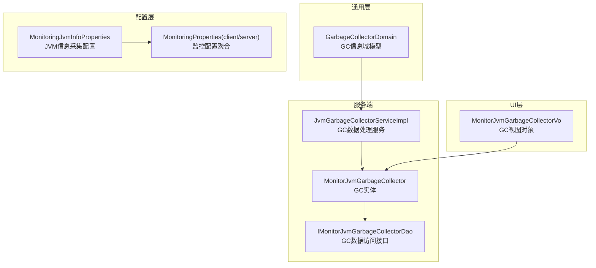
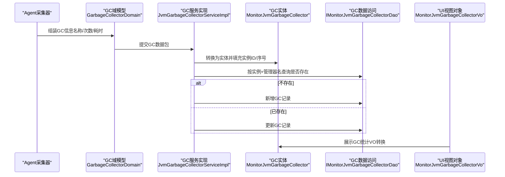
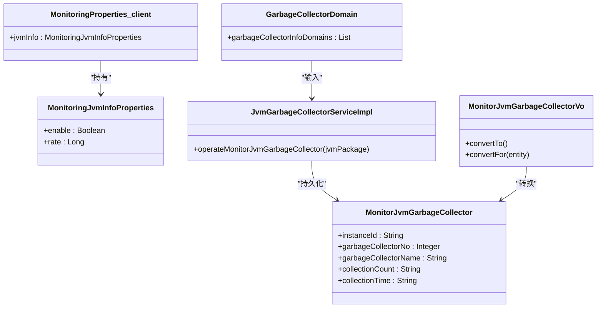

# JVM垃圾收集监控参数

<cite>
**本文引用的文件**
- [GarbageCollectorDomain.java](file://phoenix-common\phoenix-common-core\src\main\java\com\gitee\pifeng\monitoring\common\domain\jvm\GarbageCollectorDomain.java)
- [MonitorJvmGarbageCollector.java](file://phoenix-server\src\main\java\com\gitee\pifeng\monitoring\server\business\server\entity\MonitorJvmGarbageCollector.java)
- [MonitorJvmGarbageCollectorVo.java](file://phoenix-ui\src\main\java\com\gitee\pifeng\monitoring\ui\business\web\vo\MonitorJvmGarbageCollectorVo.java)
- [JvmGarbageCollectorServiceImpl.java](file://phoenix-server\src\main\java\com\gitee\pifeng\monitoring\server\business\server\service\impl\JvmGarbageCollectorServiceImpl.java)
- [phoenix.sql](file://doc\数据库设计\sql\mysql\phoenix.sql)
- [MonitoringProperties.java](file://phoenix-common\phoenix-common-core\src\main\java\com\gitee\pifeng\monitoring\common\property\client\MonitoringProperties.java)
- [MonitoringJvmInfoProperties.java](file://phoenix-common\phoenix-common-core\src\main\java\com\gitee\pifeng\monitoring\common\property\client\MonitoringJvmInfoProperties.java)
- [MonitoringProperties.java](file://phoenix-common\phoenix-common-core\src\main\java\com\gitee\pifeng\monitoring\common\property\server\MonitoringProperties.java)
</cite>

## 目录
1. [简介](#简介)
2. [项目结构](#项目结构)
3. [核心组件](#核心组件)
4. [架构概览](#架构概览)
5. [详细组件分析](#详细组件分析)
6. [依赖关系分析](#依赖关系分析)
7. [性能考虑](#性能考虑)
8. [故障排查指南](#故障排查指南)
9. [结论](#结论)

## 简介
本文件聚焦于JVM垃圾收集（GC）监控参数的配置与使用，基于项目中现有的GC监控模型与数据持久化结构，系统性阐述如何通过配置参数实现对不同GC算法（串行、并行、CMS、G1）的监控与告警。文档以“可操作”的方式给出参数配置建议、性能调优策略与常见问题排查方法，帮助用户通过合理的GC监控参数设置，及时发现并解决GC相关性能问题。

## 项目结构
围绕GC监控的关键模块分布如下：
- 通用领域模型：定义GC信息的数据结构与字段含义
- 服务端实体与DAO：负责GC数据的入库与查询
- UI视图对象：用于前端展示GC统计结果
- 业务服务：负责GC数据的入库与更新逻辑
- 配置属性：提供采集开关与采集频率等基础配置入口

图表来源
- [GarbageCollectorDomain.java:1-67](file://phoenix-common\phoenix-common-core\src\main\java\com\gitee\pifeng\monitoring\common\domain\jvm\GarbageCollectorDomain.java#L1-L67)
- [MonitorJvmGarbageCollector.java:1-77](file://phoenix-server\src\main\java\com\gitee\pifeng\monitoring\server\business\server\entity\MonitorJvmGarbageCollector.java#L1-L77)
- [JvmGarbageCollectorServiceImpl.java:58-76](file://phoenix-server\src\main\java\com\gitee\pifeng\monitoring\server\business\server\service\impl\JvmGarbageCollectorServiceImpl.java#L58-L76)
- [MonitorJvmGarbageCollectorVo.java:42-93](file://phoenix-ui\src\main\java\com\gitee\pifeng\monitoring\ui\business\web\vo\MonitorJvmGarbageCollectorVo.java#L42-L93)
- [MonitoringJvmInfoProperties.java:1-32](file://phoenix-common\phoenix-common-core\src\main\java\com\gitee\pifeng\monitoring\common\property\client\MonitoringJvmInfoProperties.java#L1-L32)
- [MonitoringProperties.java:1-56](file://phoenix-common\phoenix-common-core\src\main\java\com\gitee\pifeng\monitoring\common\property\client\MonitoringProperties.java#L1-L56)

章节来源
- [GarbageCollectorDomain.java:1-67](file://phoenix-common\phoenix-common-core\src\main\java\com\gitee\pifeng\monitoring\common\domain\jvm\GarbageCollectorDomain.java#L1-L67)
- [MonitorJvmGarbageCollector.java:1-77](file://phoenix-server\src\main\java\com\gitee\pifeng\monitoring\server\business\server\entity\MonitorJvmGarbageCollector.java#L1-L77)
- [MonitorJvmGarbageCollectorVo.java:42-93](file://phoenix-ui\src\main\java\com\gitee\pifeng\monitoring\ui\business\web\vo\MonitorJvmGarbageCollectorVo.java#L42-L93)
- [JvmGarbageCollectorServiceImpl.java:58-76](file://phoenix-server\src\main\java\com\gitee\pifeng\monitoring\server\business\server\service\impl\JvmGarbageCollectorServiceImpl.java#L58-L76)
- [MonitoringJvmInfoProperties.java:1-32](file://phoenix-common\phoenix-common-core\src\main\java\com\gitee\pifeng\monitoring\common\property\client\MonitoringJvmInfoProperties.java#L1-L32)
- [MonitoringProperties.java:1-56](file://phoenix-common\phoenix-common-core\src\main\java\com\gitee\pifeng\monitoring\common\property\client\MonitoringProperties.java#L1-L56)

## 核心组件
- GC域模型（GarbageCollectorDomain）：封装一次采样中的所有GC管理器信息，包含每个管理器的名称、累计GC次数与累计GC耗时（毫秒）。该模型是采集与传输的基础载体。
- GC实体（MonitorJvmGarbageCollector）：对应数据库表MONITOR_JVM_GARBAGE_COLLECTOR，用于存储实例维度的GC统计信息，字段覆盖采集模型并持久化。
- GC服务实现（JvmGarbageCollectorServiceImpl）：根据采集包解析GC信息，按实例与管理器维度进行去重与新增/更新逻辑。
- GC视图对象（MonitorJvmGarbageCollectorVo）：面向UI展示的VO，提供与实体之间的转换方法，便于前后端交互。
- JVM信息采集配置（MonitoringJvmInfoProperties）：提供是否采集JVM信息与采集频率的配置项，是GC监控数据采集的前置条件。

章节来源
- [GarbageCollectorDomain.java:1-67](file://phoenix-common\phoenix-common-core\src\main\java\com\gitee\pifeng\monitoring\common\domain\jvm\GarbageCollectorDomain.java#L1-L67)
- [MonitorJvmGarbageCollector.java:1-77](file://phoenix-server\src\main\java\com\gitee\pifeng\monitoring\server\business\server\entity\MonitorJvmGarbageCollector.java#L1-L77)
- [JvmGarbageCollectorServiceImpl.java:58-76](file://phoenix-server\src\main\java\com\gitee\pifeng\monitoring\server\business\server\service\impl\JvmGarbageCollectorServiceImpl.java#L58-L76)
- [MonitorJvmGarbageCollectorVo.java:42-93](file://phoenix-ui\src\main\java\com\gitee\pifeng\monitoring\ui\business\web\vo\MonitorJvmGarbageCollectorVo.java#L42-L93)
- [MonitoringJvmInfoProperties.java:1-32](file://phoenix-common\phoenix-common-core\src\main\java\com\gitee\pifeng\monitoring\common\property\client\MonitoringJvmInfoProperties.java#L1-L32)

## 架构概览
下图展示了从采集到入库再到展示的完整链路，以及与配置的关系：

图表来源
- [GarbageCollectorDomain.java:1-67](file://phoenix-common\phoenix-common-core\src\main\java\com\gitee\pifeng\monitoring\common\domain\jvm\GarbageCollectorDomain.java#L1-L67)
- [JvmGarbageCollectorServiceImpl.java:58-76](file://phoenix-server\src\main\java\com\gitee\pifeng\monitoring\server\business\server\service\impl\JvmGarbageCollectorServiceImpl.java#L58-L76)
- [MonitorJvmGarbageCollector.java:1-77](file://phoenix-server\src\main\java\com\gitee\pifeng\monitoring\server\business\server\entity\MonitorJvmGarbageCollector.java#L1-L77)
- [MonitorJvmGarbageCollectorVo.java:42-93](file://phoenix-ui\src\main\java\com\gitee\pifeng\monitoring\ui\business\web\vo\MonitorJvmGarbageCollectorVo.java#L42-L93)

## 详细组件分析

### GC域模型与数据结构
- 字段说明
  - 名称（name）：GC管理器名称（如G1 Young/G1 Old等），用于区分不同代或不同GC算法的子阶段
  - 累计GC次数（collectionCount）：自JVM启动以来的GC总次数
  - 累计GC耗时（collectionTime）：自JVM启动以来的GC总耗时（毫秒）
- 复杂度与性能
  - 单次采样通常包含多个管理器条目，整体复杂度与管理器数量线性相关
  - 建议在采集端避免频繁序列化/反序列化，减少网络开销

章节来源
- [GarbageCollectorDomain.java:1-67](file://phoenix-common\phoenix-common-core\src\main\java\com\gitee\pifeng\monitoring\common\domain\jvm\GarbageCollectorDomain.java#L1-L67)

### GC实体与数据库映射
- 表结构要点
  - 主键ID、实例ID、管理器序号、管理器名称、累计次数、累计耗时、插入/更新时间
  - 唯一索引：实例ID+管理器名称，确保同一实例下同名管理器唯一
- 设计意图
  - 支持跨时间窗口对比（通过累计次数与耗时计算增量）
  - 支持多实例、多管理器的并行存储与查询

章节来源
- [MonitorJvmGarbageCollector.java:1-77](file://phoenix-server\src\main\java\com\gitee\pifeng\monitoring\server\business\server\entity\MonitorJvmGarbageCollector.java#L1-L77)
- [phoenix.sql:329-342](file://doc\数据库设计\sql\mysql\phoenix.sql#L329-L342)

### GC服务实现与入库逻辑
- 关键流程
  - 解析采集包中的GC信息列表
  - 按实例ID与管理器名称查询是否存在
  - 不存在则新增，已存在则更新（保留首次入库时间）
- 性能与一致性
  - 使用唯一索引避免重复写入
  - 批量入库时建议合并更新，降低锁竞争

章节来源
- [JvmGarbageCollectorServiceImpl.java:58-76](file://phoenix-server\src\main\java\com\gitee\pifeng\monitoring\server\business\server\service\impl\JvmGarbageCollectorServiceImpl.java#L58-L76)

### UI视图对象与展示
- VO与实体的双向转换方法，便于前后端交互
- 字段覆盖采集模型，适配前端展示需求

章节来源
- [MonitorJvmGarbageCollectorVo.java:42-93](file://phoenix-ui\src\main\java\com\gitee\pifeng\monitoring\ui\business\web\vo\MonitorJvmGarbageCollectorVo.java#L42-L93)

### 配置属性与采集开关
- JVM信息采集配置（MonitoringJvmInfoProperties）
  - enable：是否采集JVM信息（含GC）
  - rate：采集频率（毫秒）
- 监控配置聚合（MonitoringProperties）
  - 包含安全、通信、心跳、服务器、JVM信息等配置项，GC监控依赖JVM信息采集开启

章节来源
- [MonitoringJvmInfoProperties.java:1-32](file://phoenix-common\phoenix-common-core\src\main\java\com\gitee\pifeng\monitoring\common\property\client\MonitoringJvmInfoProperties.java#L1-L32)
- [MonitoringProperties.java:1-56](file://phoenix-common\phoenix-common-core\src\main\java\com\gitee\pifeng\monitoring\common\property\client\MonitoringProperties.java#L1-L56)

## 依赖关系分析
- 采集端依赖MonitoringJvmInfoProperties控制是否采集JVM信息及采集频率
- 服务端通过JvmGarbageCollectorServiceImpl消费采集数据，写入MonitorJvmGarbageCollector
- UI层通过MonitorJvmGarbageCollectorVo读取并展示GC统计

图表来源
- [MonitoringJvmInfoProperties.java:1-32](file://phoenix-common\phoenix-common-core\src\main\java\com\gitee\pifeng\monitoring\common\property\client\MonitoringJvmInfoProperties.java#L1-L32)
- [MonitoringProperties.java:1-56](file://phoenix-common\phoenix-common-core\src\main\java\com\gitee\pifeng\monitoring\common\property\client\MonitoringProperties.java#L1-L56)
- [GarbageCollectorDomain.java:1-67](file://phoenix-common\phoenix-common-core\src\main\java\com\gitee\pifeng\monitoring\common\domain\jvm\GarbageCollectorDomain.java#L1-L67)
- [MonitorJvmGarbageCollector.java:1-77](file://phoenix-server\src\main\java\com\gitee\pifeng\monitoring\server\business\server\entity\MonitorJvmGarbageCollector.java#L1-L77)
- [JvmGarbageCollectorServiceImpl.java:58-76](file://phoenix-server\src\main\java\com\gitee\pifeng\monitoring\server\business\server\service\impl\JvmGarbageCollectorServiceImpl.java#L58-L76)
- [MonitorJvmGarbageCollectorVo.java:42-93](file://phoenix-ui\src\main\java\com\gitee\pifeng\monitoring\ui\business\web\vo\MonitorJvmGarbageCollectorVo.java#L42-L93)

## 性能考虑
- 采集频率（rate）
  - 建议根据业务吞吐与GC活跃程度调整：高GC压力场景可缩短至秒级，低GC压力场景可延长至数秒
  - 过短的采集间隔会增加CPU与网络开销，过长则可能错过关键波动
- 数据入库策略
  - 合并更新：对同一实例的多个管理器采用批量更新，减少事务开销
  - 增量计算：结合collectionCount与collectionTime计算单位时间GC次数与平均耗时，降低存储与查询压力
- 监控阈值与告警
  - 建议基于历史基线设定阈值，避免误报；对不同GC算法分别建立阈值（例如G1 Young与G1 Old）
  - 结合堆大小、新生代比例、GC停顿目标等参数综合评估

## 故障排查指南
- 采集不到GC数据
  - 检查MonitoringJvmInfoProperties.enable是否开启
  - 检查rate配置是否合理，过长可能导致数据延迟
- 数据重复或缺失
  - 检查唯一索引（实例ID+管理器名称）是否生效
  - 检查服务端入库逻辑是否正确执行新增/更新分支
- 展示异常
  - 检查VO与实体字段映射是否一致
  - 检查数据库连接与查询权限

章节来源
- [MonitoringJvmInfoProperties.java:1-32](file://phoenix-common\phoenix-common-core\src\main\java\com\gitee\pifeng\monitoring\common\property\client\MonitoringJvmInfoProperties.java#L1-L32)
- [JvmGarbageCollectorServiceImpl.java:58-76](file://phoenix-server\src\main\java\com\gitee\pifeng\monitoring\server\business\server\service\impl\JvmGarbageCollectorServiceImpl.java#L58-L76)
- [MonitorJvmGarbageCollector.java:1-77](file://phoenix-server\src\main\java\com\gitee\pifeng\monitoring\server\business\server\entity\MonitorJvmGarbageCollector.java#L1-L77)
- [MonitorJvmGarbageCollectorVo.java:42-93](file://phoenix-ui\src\main\java\com\gitee\pifeng\monitoring\ui\business\web\vo\MonitorJvmGarbageCollectorVo.java#L42-L93)

## 结论
本项目通过清晰的GC域模型、实体与服务实现，提供了面向多GC算法（串行、并行、CMS、G1）的统一监控能力。结合合理的采集频率与阈值配置，可有效识别GC异常并指导性能优化。建议在生产环境中：
- 明确各GC算法的监控阈值与报警策略
- 根据实例规模与业务特征动态调整采集频率
- 基于累计次数与耗时计算增量指标，持续跟踪GC行为变化