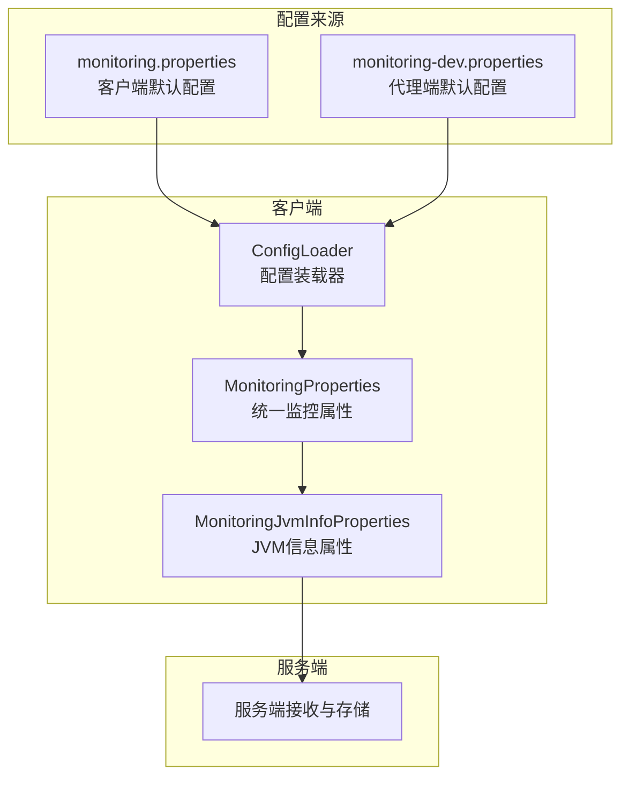
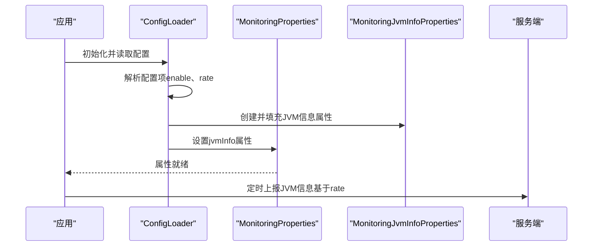
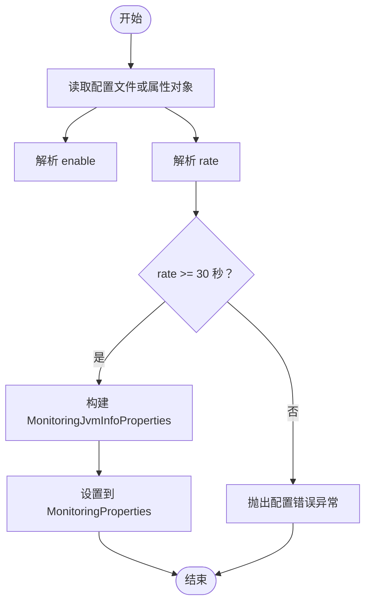
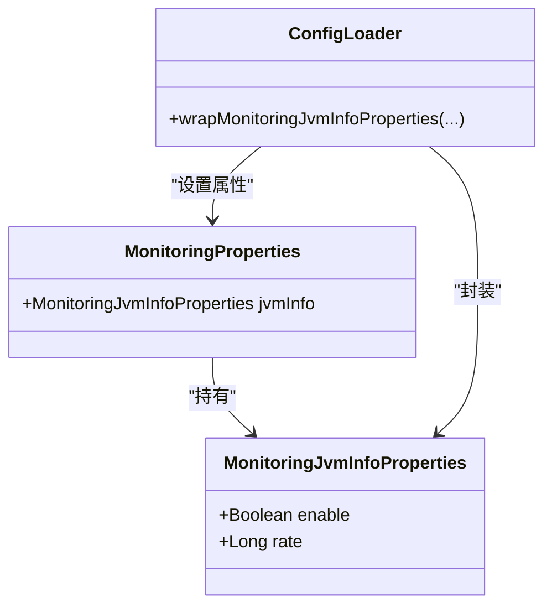

# JVM监控参数

<cite>
**本文引用的文件**
- [phoenix-common-core/src/main/java/com/gitee/pifeng/monitoring/common/property/client/MonitoringJvmInfoProperties.java](file://phoenix-common-core/src/main/java/com/gitee/pifeng/monitoring/common/property/client/MonitoringJvmInfoProperties.java)
- [phoenix-common-core/src/main/java/com/gitee/pifeng/monitoring/common/property/client/MonitoringProperties.java](file://phoenix-common-core/src/main/java/com/gitee/pifeng/monitoring/common/property/client/MonitoringProperties.java)
- [phoenix-client-core/src/main/java/com/gitee/pifeng/monitoring/plug/core/ConfigLoader.java](file://phoenix-client-core/src/main/java/com/gitee/pifeng/monitoring/plug/core/ConfigLoader.java)
- [phoenix-client-core/src/main/resources/monitoring.properties](file://phoenix-client-core/src/main/resources/monitoring.properties)
- [phoenix-agent/src/main/resources/monitoring-dev.properties](file://phoenix-agent/src/main/resources/monitoring-dev.properties)
- [phoenix-common-core/src/main/java/com/gitee/pifeng/monitoring/common/domain/jvm/GarbageCollectorDomain.java](file://phoenix-common-core/src/main/java/com/gitee/pifeng/monitoring/common/domain/jvm/GarbageCollectorDomain.java)
- [doc/数据库设计/sql/mysql/phoenix.sql](file://doc/数据库设计/sql/mysql/phoenix.sql)
</cite>

## 目录
1. [简介](#简介)
2. [项目结构](#项目结构)
3. [核心组件](#核心组件)
4. [架构概览](#架构概览)
5. [详细组件分析](#详细组件分析)
6. [依赖关系分析](#依赖关系分析)
7. [性能考量](#性能考量)
8. [故障排查指南](#故障排查指南)
9. [结论](#结论)
10. [附录](#附录)

## 简介
本文件面向Phoenix监控系统的JVM监控参数配置，围绕客户端侧的JVM信息采集与上报能力展开，重点说明以下方面：
- JVM信息监控参数（MonitoringJvmInfoProperties）的配置方法与生效流程
- 基于现有代码与配置文件可直接使用的参数项
- 当前代码库中尚未实现的JVM内存、线程、类加载、垃圾收集等高级监控参数的现状说明
- 结合数据库表结构对JVM监控数据存储的支撑说明
- 面向实际部署的配置建议与常见问题排查

## 项目结构
Phoenix监控系统由客户端插件、代理端、服务端与UI组成。JVM监控参数主要在客户端侧通过配置文件或属性类注入，并由客户端定时任务采集JVM信息后上报至服务端。

图表来源
- [phoenix-client-core/src/main/resources/monitoring.properties:38-41](file://phoenix-client-core/src/main/resources/monitoring.properties#L38-L41)
- [phoenix-agent/src/main/resources/monitoring-dev.properties:38-41](file://phoenix-agent/src/main/resources/monitoring-dev.properties#L38-L41)
- [phoenix-client-core/src/main/java/com/gitee/pifeng/monitoring/plug/core/ConfigLoader.java:605-634](file://phoenix-client-core/src/main/java/com/gitee/pifeng/monitoring/plug/core/ConfigLoader.java#L605-L634)
- [phoenix-common-core/src/main/java/com/gitee/pifeng/monitoring/common/property/client/MonitoringJvmInfoProperties.java:20-32](file://phoenix-common-core/src/main/java/com/gitee/pifeng/monitoring/common/property/client/MonitoringJvmInfoProperties.java#L20-L32)

章节来源
- [phoenix-client-core/src/main/resources/monitoring.properties:1-41](file://phoenix-client-core/src/main/resources/monitoring.properties#L1-L41)
- [phoenix-agent/src/main/resources/monitoring-dev.properties:1-41](file://phoenix-agent/src/main/resources/monitoring-dev.properties#L1-L41)
- [phoenix-client-core/src/main/java/com/gitee/pifeng/monitoring/plug/core/ConfigLoader.java:388-636](file://phoenix-client-core/src/main/java/com/gitee/pifeng/monitoring/plug/core/ConfigLoader.java#L388-L636)
- [phoenix-common-core/src/main/java/com/gitee/pifeng/monitoring/common/property/client/MonitoringJvmInfoProperties.java:1-33](file://phoenix-common-core/src/main/java/com/gitee/pifeng/monitoring/common/property/client/MonitoringJvmInfoProperties.java#L1-L33)

## 核心组件
- MonitoringJvmInfoProperties：定义JVM信息采集的开关与上报周期
- MonitoringProperties：统一监控属性容器，包含jvmInfo字段
- ConfigLoader：负责从配置文件或属性对象中解析并封装JVM信息参数
- 配置文件：monitoring.properties（客户端）、monitoring-dev.properties（代理端）

章节来源
- [phoenix-common-core/src/main/java/com/gitee/pifeng/monitoring/common/property/client/MonitoringJvmInfoProperties.java:20-32](file://phoenix-common-core/src/main/java/com/gitee/pifeng/monitoring/common/property/client/MonitoringJvmInfoProperties.java#L20-L32)
- [phoenix-common-core/src/main/java/com/gitee/pifeng/monitoring/common/property/client/MonitoringProperties.java:50-54](file://phoenix-common-core/src/main/java/com/gitee/pifeng/monitoring/common/property/client/MonitoringProperties.java#L50-L54)
- [phoenix-client-core/src/main/java/com/gitee/pifeng/monitoring/plug/core/ConfigLoader.java:605-634](file://phoenix-client-core/src/main/java/com/gitee/pifeng/monitoring/plug/core/ConfigLoader.java#L605-L634)

## 架构概览
JVM监控参数的配置与执行流程如下：

图表来源
- [phoenix-client-core/src/main/java/com/gitee/pifeng/monitoring/plug/core/ConfigLoader.java:605-634](file://phoenix-client-core/src/main/java/com/gitee/pifeng/monitoring/plug/core/ConfigLoader.java#L605-L634)
- [phoenix-common-core/src/main/java/com/gitee/pifeng/monitoring/common/property/client/MonitoringJvmInfoProperties.java:20-32](file://phoenix-common-core/src/main/java/com/gitee/pifeng/monitoring/common/property/client/MonitoringJvmInfoProperties.java#L20-L32)
- [phoenix-common-core/src/main/java/com/gitee/pifeng/monitoring/common/property/client/MonitoringProperties.java:50-54](file://phoenix-common-core/src/main/java/com/gitee/pifeng/monitoring/common/property/client/MonitoringProperties.java#L50-L54)

## 详细组件分析

### JVM信息监控参数（MonitoringJvmInfoProperties）
- 参数说明
  - enable：是否采集并上报JVM信息
  - rate：上报周期（秒），最小值为30秒
- 配置来源
  - 客户端默认配置文件：monitoring.properties
  - 代理端默认配置文件：monitoring-dev.properties
- 参数解析与校验
  - ConfigLoader负责从配置文件或属性对象中读取enable与rate
  - 若rate小于30秒，将抛出配置错误异常
  - 最终封装到MonitoringJvmInfoProperties并设置到MonitoringProperties

图表来源
- [phoenix-client-core/src/main/java/com/gitee/pifeng/monitoring/plug/core/ConfigLoader.java:605-634](file://phoenix-client-core/src/main/java/com/gitee/pifeng/monitoring/plug/core/ConfigLoader.java#L605-L634)
- [phoenix-client-core/src/main/resources/monitoring.properties:38-41](file://phoenix-client-core/src/main/resources/monitoring.properties#L38-L41)
- [phoenix-agent/src/main/resources/monitoring-dev.properties:38-41](file://phoenix-agent/src/main/resources/monitoring-dev.properties#L38-L41)

章节来源
- [phoenix-common-core/src/main/java/com/gitee/pifeng/monitoring/common/property/client/MonitoringJvmInfoProperties.java:20-32](file://phoenix-common-core/src/main/java/com/gitee/pifeng/monitoring/common/property/client/MonitoringJvmInfoProperties.java#L20-L32)
- [phoenix-client-core/src/main/java/com/gitee/pifeng/monitoring/plug/core/ConfigLoader.java:605-634](file://phoenix-client-core/src/main/java/com/gitee/pifeng/monitoring/plug/core/ConfigLoader.java#L605-L634)
- [phoenix-client-core/src/main/resources/monitoring.properties:38-41](file://phoenix-client-core/src/main/resources/monitoring.properties#L38-L41)
- [phoenix-agent/src/main/resources/monitoring-dev.properties:38-41](file://phoenix-agent/src/main/resources/monitoring-dev.properties#L38-L41)

### 关于JVM内存、线程、类加载、垃圾收集监控参数
- 现状说明
  - 在当前代码库中，未发现专门用于JVM内存、线程、类加载、垃圾收集的独立属性类
  - 代码中存在JVM相关领域模型（如GarbageCollectorDomain），用于承载GC信息，但未见对应的配置属性类
  - 数据库设计文件中包含JVM类加载与垃圾收集相关表结构，表明系统具备存储能力，但当前客户端侧未提供相应配置项
- 影响与建议
  - 若需启用更细粒度的JVM监控（如内存阈值、线程池状态、类加载速率等），需扩展相应的属性类并在客户端侧实现采集逻辑
  - 可参考现有MonitoringJvmInfoProperties的设计模式，新增对应属性类并完善ConfigLoader中的解析与封装逻辑

章节来源
- [phoenix-common-core/src/main/java/com/gitee/pifeng/monitoring/common/domain/jvm/GarbageCollectorDomain.java:1-66](file://phoenix-common-core/src/main/java/com/gitee/pifeng/monitoring/common/domain/jvm/GarbageCollectorDomain.java#L1-L66)
- [doc/数据库设计/sql/mysql/phoenix.sql:314-332](file://doc/数据库设计/sql/mysql/phoenix.sql#L314-L332)

## 依赖关系分析
- 组件耦合
  - MonitoringJvmInfoProperties被MonitoringProperties持有
  - ConfigLoader在初始化阶段解析配置并填充MonitoringJvmInfoProperties
- 外部依赖
  - 配置文件路径：客户端monitoring.properties、代理端monitoring-dev.properties
  - 服务端接收与存储：由服务端模块负责，客户端仅负责采集与上报

图表来源
- [phoenix-common-core/src/main/java/com/gitee/pifeng/monitoring/common/property/client/MonitoringProperties.java:50-54](file://phoenix-common-core/src/main/java/com/gitee/pifeng/monitoring/common/property/client/MonitoringProperties.java#L50-L54)
- [phoenix-common-core/src/main/java/com/gitee/pifeng/monitoring/common/property/client/MonitoringJvmInfoProperties.java:20-32](file://phoenix-common-core/src/main/java/com/gitee/pifeng/monitoring/common/property/client/MonitoringJvmInfoProperties.java#L20-L32)
- [phoenix-client-core/src/main/java/com/gitee/pifeng/monitoring/plug/core/ConfigLoader.java:605-634](file://phoenix-client-core/src/main/java/com/gitee/pifeng/monitoring/plug/core/ConfigLoader.java#L605-L634)

章节来源
- [phoenix-common-core/src/main/java/com/gitee/pifeng/monitoring/common/property/client/MonitoringProperties.java:18-56](file://phoenix-common-core/src/main/java/com/gitee/pifeng/monitoring/common/property/client/MonitoringProperties.java#L18-L56)
- [phoenix-common-core/src/main/java/com/gitee/pifeng/monitoring/common/property/client/MonitoringJvmInfoProperties.java:1-33](file://phoenix-common-core/src/main/java/com/gitee/pifeng/monitoring/common/property/client/MonitoringJvmInfoProperties.java#L1-L33)
- [phoenix-client-core/src/main/java/com/gitee/pifeng/monitoring/plug/core/ConfigLoader.java:605-634](file://phoenix-client-core/src/main/java/com/gitee/pifeng/monitoring/plug/core/ConfigLoader.java#L605-L634)

## 性能考量
- 上报频率（rate）直接影响网络与CPU开销
  - 建议根据业务负载与告警需求设置合理的上报周期
  - rate过小可能导致频繁上报造成资源消耗，过大则可能影响问题定位时效性
- enable开关用于按需启用JVM信息采集，避免不必要的开销
- 与服务端通信的超时参数（连接超时、套接字超时等）应在网络环境允许的前提下适当调整，确保上报稳定性

## 故障排查指南
- 配置项无效或未生效
  - 检查配置文件路径与键名是否正确
  - 确认enable与rate的取值符合预期
- 上报频率异常
  - 确认rate不小于30秒；若小于30秒，将触发配置错误异常
- 无法连接服务端
  - 检查monitoring.comm.http.url、connect-timeout、socket-timeout等通信参数
- 数据未入库
  - 确认服务端已正确接收并入库；数据库表结构支持JVM类加载与GC信息存储

章节来源
- [phoenix-client-core/src/main/java/com/gitee/pifeng/monitoring/plug/core/ConfigLoader.java:625-629](file://phoenix-client-core/src/main/java/com/gitee/pifeng/monitoring/plug/core/ConfigLoader.java#L625-L629)
- [phoenix-client-core/src/main/resources/monitoring.properties:10-17](file://phoenix-client-core/src/main/resources/monitoring.properties#L10-L17)
- [doc/数据库设计/sql/mysql/phoenix.sql:314-332](file://doc/数据库设计/sql/mysql/phoenix.sql#L314-L332)

## 结论
- 当前Phoenix客户端仅提供基础的JVM信息采集与上报能力，可通过enable与rate两个关键参数进行控制
- 对于更精细的JVM监控（内存、线程、类加载、GC等），当前代码库未提供对应的配置属性类，需结合业务需求扩展实现
- 建议在生产环境中根据应用特点与告警策略合理设置上报周期与开关，确保监控有效性的同时兼顾系统性能

## 附录
- 配置示例位置
  - 客户端默认配置：[monitoring.properties:38-41](file://phoenix-client-core/src/main/resources/monitoring.properties#L38-L41)
  - 代理端默认配置：[monitoring-dev.properties:38-41](file://phoenix-agent/src/main/resources/monitoring-dev.properties#L38-L41)
- 数据库存储支撑
  - 类加载信息表结构：[phoenix.sql:314-325](file://doc/数据库设计/sql/mysql/phoenix.sql#L314-L325)
  - 垃圾收集信息表结构：[phoenix.sql:327-332](file://doc/数据库设计/sql/mysql/phoenix.sql#L327-L332)