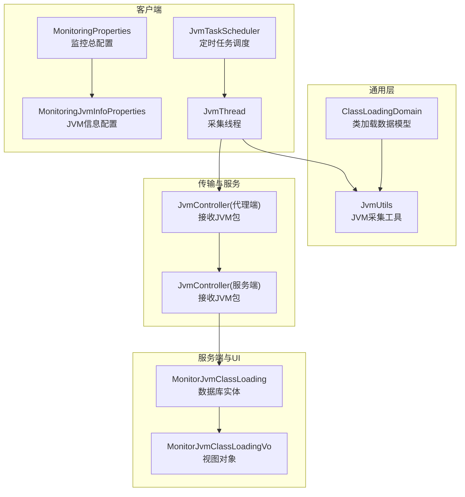
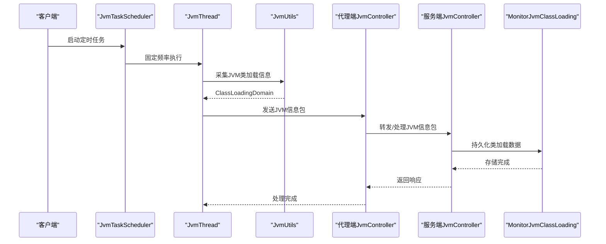
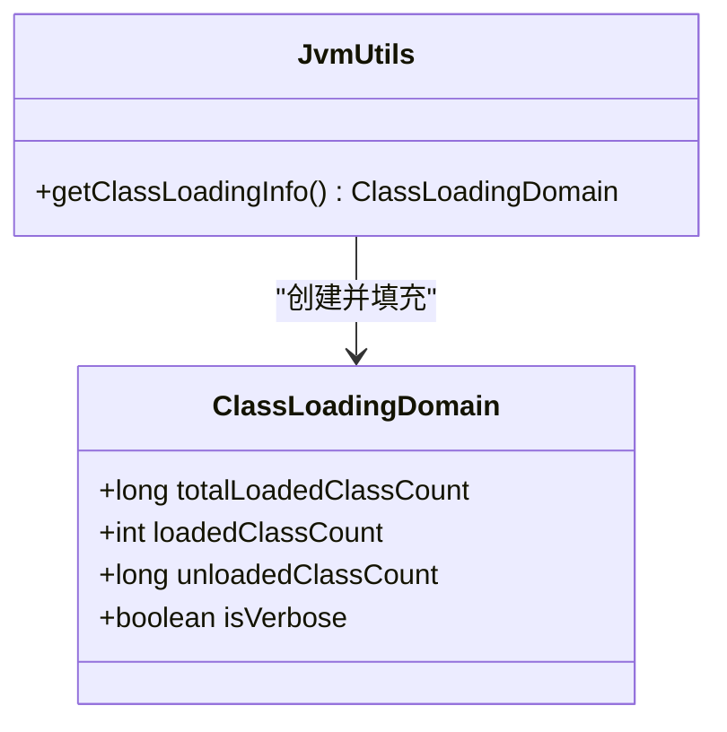
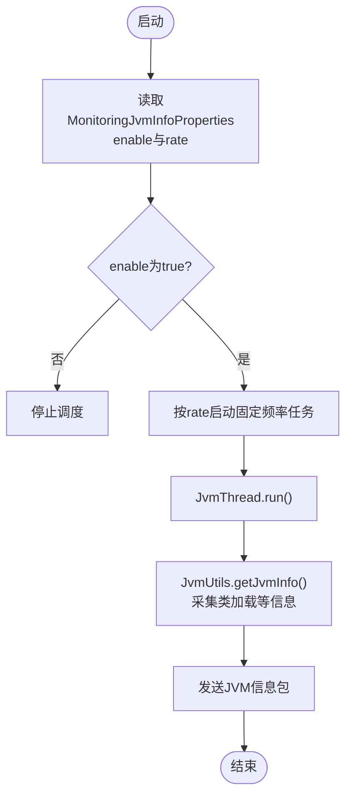
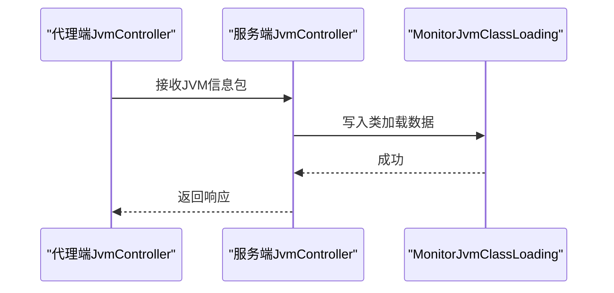
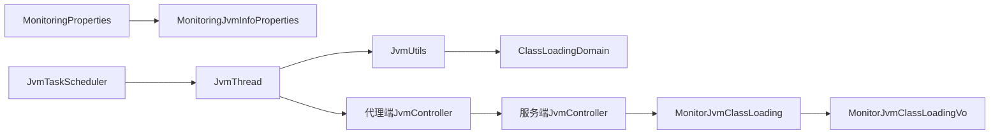

# JVM类加载监控参数

<cite>
**本文引用的文件**
- [ClassLoadingDomain.java](file://phoenix-common\phoenix-common-core\src\main\java\com\gitee\pifeng\monitoring\common\domain\jvm\ClassLoadingDomain.java)
- [JvmUtils.java](file://phoenix-common\phoenix-common-core\src\main\java\com\gitee\pifeng\monitoring\common\util\jvm\JvmUtils.java)
- [MonitoringJvmInfoProperties.java](file://phoenix-common\phoenix-common-core\src\main\java\com\gitee\pifeng\monitoring\common\property\client\MonitoringJvmInfoProperties.java)
- [MonitoringProperties.java](file://phoenix-common\phoenix-common-core\src\main\java\com\gitee\pifeng\monitoring\common\property\client\MonitoringProperties.java)
- [JvmTaskScheduler.java](file://phoenix-client\phoenix-client-core\src\main\java\com\gitee\pifeng\monitoring\plug\scheduler\JvmTaskScheduler.java)
- [JvmThread.java](file://phoenix-client\phoenix-client-core\src\main\java\com\gitee\pifeng\monitoring\plug\thread\JvmThread.java)
- [JvmController.java（代理端）](file://phoenix-agent\src\main\java\com\gitee\pifeng\monitoring\agent\business\client\controller\JvmController.java)
- [JvmController.java（服务端）](file://phoenix-server\src\main\java\com\gitee\pifeng\monitoring\server\business\server\controller\JvmController.java)
- [MonitorJvmClassLoading.java](file://phoenix-server\src\main\java\com\gitee\pifeng\monitoring\server\business\server\entity\MonitorJvmClassLoading.java)
- [MonitorJvmClassLoadingVo.java](file://phoenix-ui\src\main\java\com\gitee\pifeng\monitoring\ui\business\web\vo\MonitorJvmClassLoadingVo.java)
</cite>

## 目录
1. [简介](#简介)
2. [项目结构](#项目结构)
3. [核心组件](#核心组件)
4. [架构总览](#架构总览)
5. [详细组件分析](#详细组件分析)
6. [依赖分析](#依赖分析)
7. [性能考量](#性能考量)
8. [故障排查指南](#故障排查指南)
9. [结论](#结论)
10. [附录](#附录)

## 简介
本文件面向JVM类加载监控参数的配置与调优，围绕类加载数量、类卸载、类加载器性能与异常检测等关键维度，系统梳理Phoenix项目中与“类加载”相关的数据模型、采集流程、传输协议与存储展示路径。重点解释MonitoringJvmInfoProperties类中的类加载监控相关配置项，并给出可操作的配置指南与调优建议，帮助用户及时发现类加载相关问题与性能瓶颈。

## 项目结构
与类加载监控直接相关的代码分布在以下模块：
- 通用领域与工具：类加载数据模型、JVM采集工具
- 客户端插件：定时采集、封装与发送
- 代理端与服务端：接收、处理与持久化
- UI：展示类加载历史记录

图表来源
- [ClassLoadingDomain.java:22-43](file://phoenix-common\phoenix-common-core\src\main\java\com\gitee\pifeng\monitoring\common\domain\jvm\ClassLoadingDomain.java#L22-L43)
- [JvmUtils.java:134-141](file://phoenix-common\phoenix-common-core\src\main\java\com\gitee\pifeng\monitoring\common\util\jvm\JvmUtils.java#L134-L141)
- [MonitoringProperties.java:50-54](file://phoenix-common\phoenix-common-core\src\main\java\com\gitee\pifeng\monitoring\common\property\client\MonitoringProperties.java#L50-L54)
- [MonitoringJvmInfoProperties.java:20-32](file://phoenix-common\phoenix-common-core\src\main\java\com\gitee\pifeng\monitoring\common\property\client\MonitoringJvmInfoProperties.java#L20-L32)
- [JvmTaskScheduler.java:40-48](file://phoenix-client\phoenix-client-core\src\main\java\com\gitee\pifeng\monitoring\plug\scheduler\JvmTaskScheduler.java#L40-L48)
- [JvmThread.java:40-54](file://phoenix-client\phoenix-client-core\src\main\java\com\gitee\pifeng\monitoring\plug\thread\JvmThread.java#L40-L54)
- [JvmController.java（代理端）:50-53](file://phoenix-agent\src\main\java\com\gitee\pifeng\monitoring\agent\business\client\controller\JvmController.java#L50-L53)
- [JvmController.java（服务端）:62-74](file://phoenix-server\src\main\java\com\gitee\pifeng\monitoring\server\business\server\controller\JvmController.java#L62-L74)
- [MonitorJvmClassLoading.java:27-77](file://phoenix-server\src\main\java\com\gitee\pifeng\monitoring\server\business\server\entity\MonitorJvmClassLoading.java#L27-L77)
- [MonitorJvmClassLoadingVo.java:43-93](file://phoenix-ui\src\main\java\com\gitee\pifeng\monitoring\ui\business\web\vo\MonitorJvmClassLoadingVo.java#L43-L93)

章节来源
- [MonitoringProperties.java:18-55](file://phoenix-common\phoenix-common-core\src\main\java\com\gitee\pifeng\monitoring\common\property\client\MonitoringProperties.java#L18-L55)
- [MonitoringJvmInfoProperties.java:20-32](file://phoenix-common\phoenix-common-core\src\main\java\com\gitee\pifeng\monitoring\common\property\client\MonitoringJvmInfoProperties.java#L20-L32)

## 核心组件
- 类加载数据模型：ClassLoadingDomain封装了类加载总量、当前加载数、卸载数与verbose开关等字段，用于承载JVM MXBean中的类加载统计信息。
- JVM采集工具：JvmUtils通过ManagementFactory访问ClassLoadingMXBean并填充ClassLoadingDomain，确保采集到的指标与JVM真实状态一致。
- 客户端配置与调度：MonitoringJvmInfoProperties提供“是否启用类加载监控”和“采集频率”的配置；JvmTaskScheduler根据配置启动定时任务，JvmThread周期性采集并发送JVM包。
- 接收与持久化：代理端与服务端均提供JvmController接收JVM包；服务端将类加载信息持久化至MonitorJvmClassLoading表，供UI展示。

章节来源
- [ClassLoadingDomain.java:22-43](file://phoenix-common\phoenix-common-core\src\main\java\com\gitee\pifeng\monitoring\common\domain\jvm\ClassLoadingDomain.java#L22-L43)
- [JvmUtils.java:134-141](file://phoenix-common\phoenix-common-core\src\main\java\com\gitee\pifeng\monitoring\common\util\jvm\JvmUtils.java#L134-L141)
- [MonitoringJvmInfoProperties.java:20-32](file://phoenix-common\phoenix-common-core\src\main\java\com\gitee\pifeng\monitoring\common\property\client\MonitoringJvmInfoProperties.java#L20-L32)
- [JvmTaskScheduler.java:40-48](file://phoenix-client\phoenix-client-core\src\main\java\com\gitee\pifeng\monitoring\plug\scheduler\JvmTaskScheduler.java#L40-L48)
- [JvmThread.java:40-54](file://phoenix-client\phoenix-client-core\src\main\java\com\gitee\pifeng\monitoring\plug\thread\JvmThread.java#L40-L54)
- [MonitorJvmClassLoading.java:27-77](file://phoenix-server\src\main\java\com\gitee\pifeng\monitoring\server\business\server\entity\MonitorJvmClassLoading.java#L27-L77)

## 架构总览
下图展示了从客户端采集到服务端存储与展示的完整链路，重点标注类加载相关的关键节点。

图表来源
- [JvmTaskScheduler.java:40-48](file://phoenix-client\phoenix-client-core\src\main\java\com\gitee\pifeng\monitoring\plug\scheduler\JvmTaskScheduler.java#L40-L48)
- [JvmThread.java:40-54](file://phoenix-client\phoenix-client-core\src\main\java\com\gitee\pifeng\monitoring\plug\thread\JvmThread.java#L40-L54)
- [JvmUtils.java:134-141](file://phoenix-common\phoenix-common-core\src\main\java\com\gitee\pifeng\monitoring\common\util\jvm\JvmUtils.java#L134-L141)
- [JvmController.java（代理端）:50-53](file://phoenix-agent\src\main\java\com\gitee\pifeng\monitoring\agent\business\client\controller\JvmController.java#L50-L53)
- [JvmController.java（服务端）:62-74](file://phoenix-server\src\main\java\com\gitee\pifeng\monitoring\server\business\server\controller\JvmController.java#L62-L74)
- [MonitorJvmClassLoading.java:27-77](file://phoenix-server\src\main\java\com\gitee\pifeng\monitoring\server\business\server\entity\MonitorJvmClassLoading.java#L27-L77)

## 详细组件分析

### 类加载数据模型与采集
- ClassLoadingDomain包含四个核心字段：加载的类的总数、当前加载的类的总数、卸载的类总数、是否启用了类加载系统的详细输出。这些字段直接映射到JVM的ClassLoadingMXBean。
- JvmUtils.getClassLoadingInfo通过ManagementFactory获取ClassLoadingMXBean并填充上述字段，保证采集数据与JVM实时状态一致。

图表来源
- [ClassLoadingDomain.java:22-43](file://phoenix-common\phoenix-common-core\src\main\java\com\gitee\pifeng\monitoring\common\domain\jvm\ClassLoadingDomain.java#L22-L43)
- [JvmUtils.java:134-141](file://phoenix-common\phoenix-common-core\src\main\java\com\gitee\pifeng\monitoring\common\util\jvm\JvmUtils.java#L134-L141)

章节来源
- [ClassLoadingDomain.java:22-43](file://phoenix-common\phoenix-common-core\src\main\java\com\gitee\pifeng\monitoring\common\domain\jvm\ClassLoadingDomain.java#L22-L43)
- [JvmUtils.java:134-141](file://phoenix-common\phoenix-common-core\src\main\java\com\gitee\pifeng\monitoring\common\util\jvm\JvmUtils.java#L134-L141)

### 客户端配置与调度
- MonitoringJvmInfoProperties提供两个关键配置：
  - enable：是否采集Java虚拟机信息（含类加载）
  - rate：采集频率（秒），用于控制JvmTaskScheduler的固定延时周期
- JvmTaskScheduler在客户端读取MonitoringJvmInfoProperties后，按rate配置以固定频率调度JvmThread执行采集与发送。
- JvmThread在每次执行中调用JvmUtils采集JVM信息，封装为JvmPackage并通过Sender发送至服务端。

图表来源
- [MonitoringJvmInfoProperties.java:20-32](file://phoenix-common\phoenix-common-core\src\main\java\com\gitee\pifeng\monitoring\common\property\client\MonitoringJvmInfoProperties.java#L20-L32)
- [JvmTaskScheduler.java:40-48](file://phoenix-client\phoenix-client-core\src\main\java\com\gitee\pifeng\monitoring\plug\scheduler\JvmTaskScheduler.java#L40-L48)
- [JvmThread.java:40-54](file://phoenix-client\phoenix-client-core\src\main\java\com\gitee\pifeng\monitoring\plug\thread\JvmThread.java#L40-L54)

章节来源
- [MonitoringJvmInfoProperties.java:20-32](file://phoenix-common\phoenix-common-core\src\main\java\com\gitee\pifeng\monitoring\common\property\client\MonitoringJvmInfoProperties.java#L20-L32)
- [JvmTaskScheduler.java:40-48](file://phoenix-client\phoenix-client-core\src\main\java\com\gitee\pifeng\monitoring\plug\scheduler\JvmTaskScheduler.java#L40-L48)
- [JvmThread.java:40-54](file://phoenix-client\phoenix-client-core\src\main\java\com\gitee\pifeng\monitoring\plug\thread\JvmThread.java#L40-L54)

### 服务端接收与持久化
- 代理端与服务端均提供JvmController接收来自客户端的JVM信息包；服务端在处理后将类加载信息持久化到MonitorJvmClassLoading表，字段与ClassLoadingDomain一一对应。
- UI层通过MonitorJvmClassLoadingVo进行前后端数据转换与展示。

图表来源
- [JvmController.java（代理端）:50-53](file://phoenix-agent\src\main\java\com\gitee\pifeng\monitoring\agent\business\client\controller\JvmController.java#L50-L53)
- [JvmController.java（服务端）:62-74](file://phoenix-server\src\main\java\com\gitee\pifeng\monitoring\server\business\server\controller\JvmController.java#L62-L74)
- [MonitorJvmClassLoading.java:27-77](file://phoenix-server\src\main\java\com\gitee\pifeng\monitoring\server\business\server\entity\MonitorJvmClassLoading.java#L27-L77)

章节来源
- [JvmController.java（代理端）:50-53](file://phoenix-agent\src\main\java\com\gitee\pifeng\monitoring\agent\business\client\controller\JvmController.java#L50-L53)
- [JvmController.java（服务端）:62-74](file://phoenix-server\src\main\java\com\gitee\pifeng\monitoring\server\business\server\controller\JvmController.java#L62-L74)
- [MonitorJvmClassLoading.java:27-77](file://phoenix-server\src\main\java\com\gitee\pifeng\monitoring\server\business\server\entity\MonitorJvmClassLoading.java#L27-L77)

## 依赖分析
- 客户端配置依赖：MonitoringProperties聚合MonitoringJvmInfoProperties，JvmTaskScheduler与JvmThread依赖MonitoringJvmInfoProperties的enable与rate。
- 采集依赖：JvmThread依赖JvmUtils.getClassLoadingInfo，后者依赖ManagementFactory的ClassLoadingMXBean。
- 传输与存储依赖：代理端与服务端的JvmController负责接收与处理；服务端将类加载信息写入MonitorJvmClassLoading，UI通过MonitorJvmClassLoadingVo进行展示。

图表来源
- [MonitoringProperties.java:50-54](file://phoenix-common\phoenix-common-core\src\main\java\com\gitee\pifeng\monitoring\common\property\client\MonitoringProperties.java#L50-L54)
- [MonitoringJvmInfoProperties.java:20-32](file://phoenix-common\phoenix-common-core\src\main\java\com\gitee\pifeng\monitoring\common\property\client\MonitoringJvmInfoProperties.java#L20-L32)
- [JvmTaskScheduler.java:40-48](file://phoenix-client\phoenix-client-core\src\main\java\com\gitee\pifeng\monitoring\plug\scheduler\JvmTaskScheduler.java#L40-L48)
- [JvmThread.java:40-54](file://phoenix-client\phoenix-client-core\src\main\java\com\gitee\pifeng\monitoring\plug\thread\JvmThread.java#L40-L54)
- [JvmUtils.java:134-141](file://phoenix-common\phoenix-common-core\src\main\java\com\gitee\pifeng\monitoring\common\util\jvm\JvmUtils.java#L134-L141)
- [ClassLoadingDomain.java:22-43](file://phoenix-common\phoenix-common-core\src\main\java\com\gitee\pifeng\monitoring\common\domain\jvm\ClassLoadingDomain.java#L22-L43)
- [JvmController.java（代理端）:50-53](file://phoenix-agent\src\main\java\com\gitee\pifeng\monitoring\agent\business\client\controller\JvmController.java#L50-L53)
- [JvmController.java（服务端）:62-74](file://phoenix-server\src\main\java\com\gitee\pifeng\monitoring\server\business\server\controller\JvmController.java#L62-L74)
- [MonitorJvmClassLoading.java:27-77](file://phoenix-server\src\main\java\com\gitee\pifeng\monitoring\server\business\server\entity\MonitorJvmClassLoading.java#L27-L77)
- [MonitorJvmClassLoadingVo.java:43-93](file://phoenix-ui\src\main\java\com\gitee\pifeng\monitoring\ui\business\web\vo\MonitorJvmClassLoadingVo.java#L43-L93)

章节来源
- [MonitoringProperties.java:50-54](file://phoenix-common\phoenix-common-core\src\main\java\com\gitee\pifeng\monitoring\common\property\client\MonitoringProperties.java#L50-L54)
- [MonitoringJvmInfoProperties.java:20-32](file://phoenix-common\phoenix-common-core\src\main\java\com\gitee\pifeng\monitoring\common\property\client\MonitoringJvmInfoProperties.java#L20-L32)
- [JvmTaskScheduler.java:40-48](file://phoenix-client\phoenix-client-core\src\main\java\com\gitee\pifeng\monitoring\plug\scheduler\JvmTaskScheduler.java#L40-L48)
- [JvmThread.java:40-54](file://phoenix-client\phoenix-client-core\src\main\java\com\gitee\pifeng\monitoring\plug\thread\JvmThread.java#L40-L54)
- [JvmUtils.java:134-141](file://phoenix-common\phoenix-common-core\src\main\java\com\gitee\pifeng\monitoring\common\util\jvm\JvmUtils.java#L134-L141)
- [ClassLoadingDomain.java:22-43](file://phoenix-common\phoenix-common-core\src\main\java\com\gitee\pifeng\monitoring\common\domain\jvm\ClassLoadingDomain.java#L22-L43)
- [JvmController.java（代理端）:50-53](file://phoenix-agent\src\main\java\com\gitee\pifeng\monitoring\agent\business\client\controller\JvmController.java#L50-L53)
- [JvmController.java（服务端）:62-74](file://phoenix-server\src\main\java\com\gitee\pifeng\monitoring\server\business\server\controller\JvmController.java#L62-L74)
- [MonitorJvmClassLoading.java:27-77](file://phoenix-server\src\main\java\com\gitee\pifeng\monitoring\server\business\server\entity\MonitorJvmClassLoading.java#L27-L77)
- [MonitorJvmClassLoadingVo.java:43-93](file://phoenix-ui\src\main\java\com\gitee\pifeng\monitoring\ui\business\web\vo\MonitorJvmClassLoadingVo.java#L43-L93)

## 性能考量
- 采集频率（rate）直接影响CPU与网络开销：频率越高，采集与序列化开销越大，同时上报频次增加可能带来网络压力。建议结合业务峰值与告警策略设定合理间隔。
- 采集耗时监控：JvmThread在超过临界值时会输出警告日志，可用于评估采集对应用的影响。若频繁出现耗时告警，应考虑降低rate或优化网络/序列化环节。
- 传输与处理：服务端JvmController对JVM包处理耗时超过阈值会记录warn日志，提示处理链路可能存在瓶颈，需关注网络、解密/加解密与数据库写入性能。

章节来源
- [JvmTaskScheduler.java:40-48](file://phoenix-client\phoenix-client-core\src\main\java\com\gitee\pifeng\monitoring\plug\scheduler\JvmTaskScheduler.java#L40-L48)
- [JvmThread.java:61-72](file://phoenix-client\phoenix-client-core\src\main\java\com\gitee\pifeng\monitoring\plug\thread\JvmThread.java#L61-L72)
- [JvmController.java（服务端）:64-73](file://phoenix-server\src\main\java\com\gitee\pifeng\monitoring\server\business\server\controller\JvmController.java#L64-L73)

## 故障排查指南
- 无法采集类加载数据
  - 检查MonitoringJvmInfoProperties.enable是否为true，否则不会启动采集任务。
  - 检查rate配置是否合理，过小的间隔可能导致采集过于频繁而影响性能。
- 上报失败或超时
  - 关注JvmThread捕获的IO与网络异常日志，定位网络连通性与目标地址可达性。
  - 代理端与服务端的JvmController均会记录处理耗时与异常，便于快速定位瓶颈。
- 数据不一致或缺失
  - 确认服务端已正确接收并持久化MonitorJvmClassLoading记录；如无数据，检查服务端日志与数据库连接。
  - UI层MonitorJvmClassLoadingVo负责数据转换，如展示异常，检查前后端字段映射一致性。

章节来源
- [MonitoringJvmInfoProperties.java:20-32](file://phoenix-common\phoenix-common-core\src\main\java\com\gitee\pifeng\monitoring\common\property\client\MonitoringJvmInfoProperties.java#L20-L32)
- [JvmTaskScheduler.java:40-48](file://phoenix-client\phoenix-client-core\src\main\java\com\gitee\pifeng\monitoring\plug\scheduler\JvmTaskScheduler.java#L40-L48)
- [JvmThread.java:54-60](file://phoenix-client\phoenix-client-core\src\main\java\com\gitee\pifeng\monitoring\plug\thread\JvmThread.java#L54-L60)
- [JvmController.java（代理端）:50-53](file://phoenix-agent\src\main\java\com\gitee\pifeng\monitoring\agent\business\client\controller\JvmController.java#L50-L53)
- [JvmController.java（服务端）:62-74](file://phoenix-server\src\main\java\com\gitee\pifeng\monitoring\server\business\server\controller\JvmController.java#L62-L74)
- [MonitorJvmClassLoading.java:27-77](file://phoenix-server\src\main\java\com\gitee\pifeng\monitoring\server\business\server\entity\MonitorJvmClassLoading.java#L27-L77)
- [MonitorJvmClassLoadingVo.java:70-91](file://phoenix-ui\src\main\java\com\gitee\pifeng\monitoring\ui\business\web\vo\MonitorJvmClassLoadingVo.java#L70-L91)

## 结论
通过对Phoenix项目中类加载监控参数的系统梳理，可以明确：MonitoringJvmInfoProperties的enable与rate是类加载监控的核心配置；JvmUtils提供可靠的JVM采集能力；客户端定时任务与服务端接收处理形成闭环；最终数据落库并支持UI展示。基于此，建议在生产环境中以“低频采集+异常告警”为原则，结合业务峰值与资源占用情况动态调整rate，确保监控能力与系统稳定性平衡。

## 附录

### 类加载监控参数配置清单
- enable：是否启用类加载监控（布尔）。开启后客户端才会启动类加载采集任务。
- rate：采集频率（秒）。控制JvmTaskScheduler的固定延时周期，建议结合业务场景与资源占用评估设置。

章节来源
- [MonitoringJvmInfoProperties.java:20-32](file://phoenix-common\phoenix-common-core\src\main\java\com\gitee\pifeng\monitoring\common\property\client\MonitoringJvmInfoProperties.java#L20-L32)
- [MonitoringProperties.java:50-54](file://phoenix-common\phoenix-common-core\src\main\java\com\gitee\pifeng\monitoring\common\property\client\MonitoringProperties.java#L50-L54)