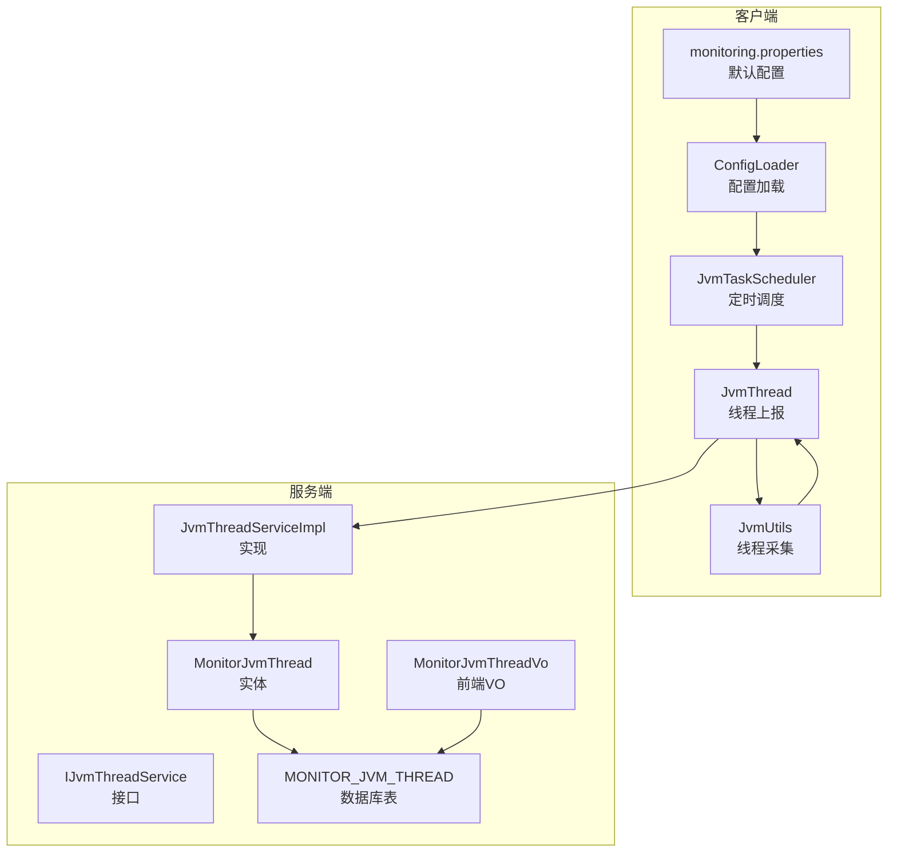
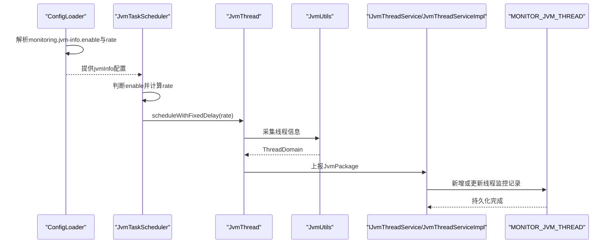
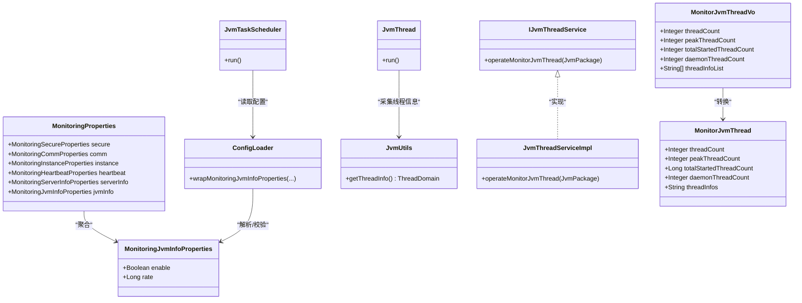

# JVM线程监控参数

<cite>
**本文引用的文件**
- [MonitoringJvmInfoProperties.java](file://phoenix-common\phoenix-common-core\src\main\java\com\gitee\pifeng\monitoring\common\property\client\MonitoringJvmInfoProperties.java)
- [MonitoringProperties.java](file://phoenix-common\phoenix-common-core\src\main\java\com\gitee\pifeng\monitoring\common\property\client\MonitoringProperties.java)
- [monitoring.properties](file://phoenix-client\phoenix-client-core\src\main\resources\monitoring.properties)
- [JvmUtils.java](file://phoenix-common\phoenix-common-core\src\main\java\com\gitee\pifeng\monitoring\common\util\jvm\JvmUtils.java)
- [ThreadDomain.java](file://phoenix-common\phoenix-common-core\src\main\java\com\gitee\pifeng\monitoring\common\domain\jvm\ThreadDomain.java)
- [JvmThread.java](file://phoenix-client\phoenix-client-core\src\main\java\com\gitee\pifeng\monitoring\plug\thread\JvmThread.java)
- [JvmTaskScheduler.java](file://phoenix-client\phoenix-client-core\src\main\java\com\gitee\pifeng\monitoring\plug\scheduler\JvmTaskScheduler.java)
- [ConfigLoader.java](file://phoenix-client\phoenix-client-core\src\main\java\com\gitee\pifeng\monitoring\plug\core\ConfigLoader.java)
- [MonitorJvmThread.java](file://phoenix-server\src\main\java\com\gitee\pifeng\monitoring\server\business\server\entity\MonitorJvmThread.java)
- [IJvmThreadService.java](file://phoenix-server\src\main\java\com\gitee\pifeng\monitoring\server\business\server\service\IJvmThreadService.java)
- [JvmThreadServiceImpl.java](file://phoenix-server\src\main\java\com\gitee\pifeng\monitoring\server\business\server\service\impl\JvmThreadServiceImpl.java)
- [MonitorJvmThreadVo.java](file://phoenix-ui\src\main\java\com\gitee\pifeng\monitoring\ui\business\web\vo\MonitorJvmThreadVo.java)
- [phoenix.sql](file://doc\数据库设计\sql\mysql\phoenix.sql)
</cite>

## 目录
1. [简介](#简介)
2. [项目结构](#项目结构)
3. [核心组件](#核心组件)
4. [架构总览](#架构总览)
5. [详细组件分析](#详细组件分析)
6. [依赖关系分析](#依赖关系分析)
7. [性能考量](#性能考量)
8. [故障排查指南](#故障排查指南)
9. [结论](#结论)
10. [附录](#附录)

## 简介
本文聚焦于JVM线程监控参数的配置与使用，围绕客户端侧的线程监控配置入口类MonitoringJvmInfoProperties展开，结合线程信息采集、封装、调度与上报流程，系统阐述如何通过合理配置线程监控参数，及时发现线程相关性能问题与异常情况。内容覆盖线程活跃度监控、线程池性能监控、线程阻塞检测等关键维度，并提供配置建议与最佳实践。

## 项目结构
JVM线程监控涉及客户端采集、调度与上报，以及服务端存储与展示三个层面：
- 客户端采集与调度
  - 配置加载与解析：ConfigLoader
  - 线程信息采集：JvmUtils
  - 上报线程：JvmThread
  - 调度器：JvmTaskScheduler
  - 默认配置：monitoring.properties
- 服务端存储与展示
  - 实体映射：MonitorJvmThread
  - 服务接口与实现：IJvmThreadService、JvmThreadServiceImpl
  - 前端VO：MonitorJvmThreadVo
  - 数据库表：MONITOR_JVM_THREAD

图表来源
- [ConfigLoader.java](file://phoenix-client\phoenix-client-core\src\main\java\com\gitee\pifeng\monitoring\plug\core\ConfigLoader.java)
- [JvmTaskScheduler.java](file://phoenix-client\phoenix-client-core\src\main\java\com\gitee\pifeng\monitoring\plug\scheduler\JvmTaskScheduler.java)
- [JvmThread.java](file://phoenix-client\phoenix-client-core\src\main\java\com\gitee\pifeng\monitoring\plug\thread\JvmThread.java)
- [JvmUtils.java](file://phoenix-common\phoenix-common-core\src\main\java\com\gitee\pifeng\monitoring\common\util\jvm\JvmUtils.java)
- [IJvmThreadService.java](file://phoenix-server\src\main\java\com\gitee\pifeng\monitoring\server\business\server\service\IJvmThreadService.java)
- [JvmThreadServiceImpl.java](file://phoenix-server\src\main\java\com\gitee\pifeng\monitoring\server\business\server\service\impl\JvmThreadServiceImpl.java)
- [MonitorJvmThread.java](file://phoenix-server\src\main\java\com\gitee\pifeng\monitoring\server\business\server\entity\MonitorJvmThread.java)
- [MonitorJvmThreadVo.java](file://phoenix-ui\src\main\java\com\gitee\pifeng\monitoring\ui\business\web\vo\MonitorJvmThreadVo.java)
- [phoenix.sql](file://doc\数据库设计\sql\mysql\phoenix.sql)

章节来源
- [monitoring.properties:38-41](file://phoenix-client\phoenix-client-core\src\main\resources\monitoring.properties#L38-L41)
- [MonitoringJvmInfoProperties.java:20-32](file://phoenix-common\phoenix-common-core\src\main\java\com\gitee\pifeng\monitoring\common\property\client\MonitoringJvmInfoProperties.java#L20-L32)
- [MonitoringProperties.java:50-54](file://phoenix-common\phoenix-common-core\src\main\java\com\gitee\pifeng\monitoring\common\property\client\MonitoringProperties.java#L50-L54)

## 核心组件
- MonitoringJvmInfoProperties：定义“是否采集Java虚拟机信息”和“发送频率”的配置项，作为客户端线程监控的开关与节拍控制。
- MonitoringProperties：聚合各类监控属性，其中包含jvmInfo子属性，供ConfigLoader统一加载。
- JvmUtils：基于JMX采集线程域信息，包括当前活动线程数、峰值、守护线程数、累计启动线程总数及线程详情列表。
- JvmThread：封装一次完整的线程信息采集、打包与上报流程。
- JvmTaskScheduler：根据配置决定是否启用线程监控任务，并按固定频率调度执行。
- ConfigLoader：负责从配置文件或MonitoringProperties注入中解析并校验线程监控参数。
- 服务端实体与服务：MonitorJvmThread、IJvmThreadService、JvmThreadServiceImpl将线程监控数据持久化至数据库。
- 前端VO：MonitorJvmThreadVo用于前后端交互展示。

章节来源
- [MonitoringJvmInfoProperties.java:20-32](file://phoenix-common\phoenix-common-core\src\main\java\com\gitee\pifeng\monitoring\common\property\client\MonitoringJvmInfoProperties.java#L20-L32)
- [MonitoringProperties.java:50-54](file://phoenix-common\phoenix-common-core\src\main\java\com\gitee\pifeng\monitoring\common\property\client\MonitoringProperties.java#L50-L54)
- [JvmUtils.java:102-123](file://phoenix-common\phoenix-common-core\src\main\java\com\gitee\pifeng\monitoring\common\util\jvm\JvmUtils.java#L102-L123)
- [JvmThread.java:40-73](file://phoenix-client\phoenix-client-core\src\main\java\com\gitee\pifeng\monitoring\plug\thread\JvmThread.java#L40-L73)
- [JvmTaskScheduler.java:40-48](file://phoenix-client\phoenix-client-core\src\main\java\com\gitee\pifeng\monitoring\plug\scheduler\JvmTaskScheduler.java#L40-L48)
- [ConfigLoader.java:605-634](file://phoenix-client\phoenix-client-core\src\main\java\com\gitee\pifeng\monitoring\plug\core\ConfigLoader.java#L605-L634)
- [MonitorJvmThread.java:44-69](file://phoenix-server\src\main\java\com\gitee\pifeng\monitoring\server\business\server\entity\MonitorJvmThread.java#L44-L69)
- [IJvmThreadService.java:15-27](file://phoenix-server\src\main\java\com\gitee\pifeng\monitoring\server\business\server\service\IJvmThreadService.java#L15-L27)
- [JvmThreadServiceImpl.java:41-77](file://phoenix-server\src\main\java\com\gitee\pifeng\monitoring\server\business\server\service\impl\JvmThreadServiceImpl.java#L41-L77)
- [MonitorJvmThreadVo.java:43-55](file://phoenix-ui\src\main\java\com\gitee\pifeng\monitoring\ui\business\web\vo\MonitorJvmThreadVo.java#L43-L55)

## 架构总览
下图展示了从配置加载到线程监控数据入库的关键路径，体现“配置—采集—调度—上报—存储—展示”的闭环。

图表来源
- [ConfigLoader.java:605-634](file://phoenix-client\phoenix-client-core\src\main\java\com\gitee\pifeng\monitoring\plug\core\ConfigLoader.java#L605-L634)
- [JvmTaskScheduler.java:40-48](file://phoenix-client\phoenix-client-core\src\main\java\com\gitee\pifeng\monitoring\plug\scheduler\JvmTaskScheduler.java#L40-L48)
- [JvmThread.java:40-73](file://phoenix-client\phoenix-client-core\src\main\java\com\gitee\pifeng\monitoring\plug\thread\JvmThread.java#L40-L73)
- [JvmUtils.java:102-123](file://phoenix-common\phoenix-common-core\src\main\java\com\gitee\pifeng\monitoring\common\util\jvm\JvmUtils.java#L102-L123)
- [IJvmThreadService.java:15-27](file://phoenix-server\src\main\java\com\gitee\pifeng\monitoring\server\business\server\service\IJvmThreadService.java#L15-L27)
- [JvmThreadServiceImpl.java:41-77](file://phoenix-server\src\main\java\com\gitee\pifeng\monitoring\server\business\server\service\impl\JvmThreadServiceImpl.java#L41-L77)
- [MonitorJvmThread.java:44-69](file://phoenix-server\src\main\java\com\gitee\pifeng\monitoring\server\business\server\entity\MonitorJvmThread.java#L44-L69)

## 详细组件分析

### 配置类：MonitoringJvmInfoProperties
- 字段说明
  - enable：是否采集Java虚拟机信息（线程监控开关）
  - rate：发送频率（秒），最小值为30秒
- 加载与校验
  - ConfigLoader在wrapMonitoringJvmInfoProperties中解析配置，若未设置则采用默认值；当rate小于30秒时抛出错误配置异常
- 使用位置
  - MonitoringProperties聚合该配置，供全局访问
  - JvmTaskScheduler读取enable与rate以决定是否启动定时任务及周期

章节来源
- [MonitoringJvmInfoProperties.java:20-32](file://phoenix-common\phoenix-common-core\src\main\java\com\gitee\pifeng\monitoring\common\property\client\MonitoringJvmInfoProperties.java#L20-L32)
- [MonitoringProperties.java:50-54](file://phoenix-common\phoenix-common-core\src\main\java\com\gitee\pifeng\monitoring\common\property\client\MonitoringProperties.java#L50-L54)
- [ConfigLoader.java:605-634](file://phoenix-client\phoenix-client-core\src\main\java\com\gitee\pifeng\monitoring\plug\core\ConfigLoader.java#L605-L634)
- [JvmTaskScheduler.java:40-48](file://phoenix-client\phoenix-client-core\src\main\java\com\gitee\pifeng\monitoring\plug\scheduler\JvmTaskScheduler.java#L40-L48)

### 数据模型：ThreadDomain
- 字段说明
  - threadCount：当前活动线程数
  - peakThreadCount：线程峰值
  - totalStartedThreadCount：已创建并已启动的线程总数
  - daemonThreadCount：当前活动守护线程数
  - threadInfos：所有线程信息字符串列表（已排序）
- 采集来源
  - JvmUtils通过ThreadMXBean.getAllThreadIds与getThreadInfo采集并封装

章节来源
- [ThreadDomain.java:24-51](file://phoenix-common\phoenix-common-core\src\main\java\com\gitee\pifeng\monitoring\common\domain\jvm\ThreadDomain.java#L24-L51)
- [JvmUtils.java:102-123](file://phoenix-common\phoenix-common-core\src\main\java\com\gitee\pifeng\monitoring\common\util\jvm\JvmUtils.java#L102-L123)

### 采集与上报：JvmThread
- 流程要点
  - 采集：调用JvmUtils.getJvmInfo，内部调用getThreadInfo获取ThreadDomain
  - 打包：通过ClientPackageConstructor构造JvmPackage
  - 上报：调用Sender发送至服务端URL
  - 性能观测：超过阈值会输出警告日志，便于定位慢采集问题
- 关联配置
  - enable与rate由ConfigLoader解析后，由JvmTaskScheduler驱动执行

章节来源
- [JvmThread.java:40-73](file://phoenix-client\phoenix-client-core\src\main\java\com\gitee\pifeng\monitoring\plug\thread\JvmThread.java#L40-L73)
- [JvmUtils.java:224-232](file://phoenix-common\phoenix-common-core\src\main\java\com\gitee\pifeng\monitoring\common\util\jvm\JvmUtils.java#L224-L232)

### 调度器：JvmTaskScheduler
- 行为逻辑
  - 读取ConfigLoader中的jvmInfo.enable与rate
  - 若启用，则以固定延迟（45秒）启动，随后按rate周期执行
- 设计意图
  - 避免多实例同时上报造成抖动，引入初始延迟

章节来源
- [JvmTaskScheduler.java:40-48](file://phoenix-client\phoenix-client-core\src\main\java\com\gitee\pifeng\monitoring\plug\scheduler\JvmTaskScheduler.java#L40-L48)

### 配置加载：ConfigLoader
- 关键逻辑
  - 优先使用MonitoringProperties注入；否则从properties文件读取
  - 对rate进行最小值校验（≥30秒）
  - 将解析结果写入MONITORING_PROPERTIES，供后续组件使用

章节来源
- [ConfigLoader.java:605-634](file://phoenix-client\phoenix-client-core\src\main\java\com\gitee\pifeng\monitoring\plug\core\ConfigLoader.java#L605-L634)

### 服务端存储与展示
- 存储
  - IJvmThreadService.operateMonitorJvmThread接收JvmPackage，提取ThreadDomain并持久化
  - JvmThreadServiceImpl根据instanceId判断新增或更新
- 展示
  - MonitorJvmThreadVo用于前端展示线程监控数据
- 数据库
  - MONITOR_JVM_THREAD表字段与ThreadDomain一致，支持线程活跃度、峰值、守护线程数与线程详情存储

章节来源
- [IJvmThreadService.java:15-27](file://phoenix-server\src\main\java\com\gitee\pifeng\monitoring\server\business\server\service\IJvmThreadService.java#L15-L27)
- [JvmThreadServiceImpl.java:41-77](file://phoenix-server\src\main\java\com\gitee\pifeng\monitoring\server\business\server\service\impl\JvmThreadServiceImpl.java#L41-L77)
- [MonitorJvmThread.java:44-69](file://phoenix-server\src\main\java\com\gitee\pifeng\monitoring\server\business\server\entity\MonitorJvmThread.java#L44-L69)
- [MonitorJvmThreadVo.java:43-55](file://phoenix-ui\src\main\java\com\gitee\pifeng\monitoring\ui\business\web\vo\MonitorJvmThreadVo.java#L43-L55)
- [phoenix.sql:440-449](file://doc\数据库设计\sql\mysql\phoenix.sql#L440-L449)

## 依赖关系分析
- 客户端侧
  - ConfigLoader依赖monitoring.properties与MonitoringProperties
  - JvmTaskScheduler依赖ConfigLoader提供的jvmInfo配置
  - JvmThread依赖JvmUtils采集数据并上报
- 服务端侧
  - IJvmThreadService与JvmThreadServiceImpl依赖ThreadDomain与MonitorJvmThread
  - MonitorJvmThreadVo用于UI层展示

图表来源
- [MonitoringJvmInfoProperties.java:20-32](file://phoenix-common\phoenix-common-core\src\main\java\com\gitee\pifeng\monitoring\common\property\client\MonitoringJvmInfoProperties.java#L20-L32)
- [MonitoringProperties.java:50-54](file://phoenix-common\phoenix-common-core\src\main\java\com\gitee\pifeng\monitoring\common\property\client\MonitoringProperties.java#L50-L54)
- [ConfigLoader.java:605-634](file://phoenix-client\phoenix-client-core\src\main\java\com\gitee\pifeng\monitoring\plug\core\ConfigLoader.java#L605-L634)
- [JvmTaskScheduler.java:40-48](file://phoenix-client\phoenix-client-core\src\main\java\com\gitee\pifeng\monitoring\plug\scheduler\JvmTaskScheduler.java#L40-L48)
- [JvmThread.java:40-73](file://phoenix-client\phoenix-client-core\src\main\java\com\gitee\pifeng\monitoring\plug\thread\JvmThread.java#L40-L73)
- [JvmUtils.java:102-123](file://phoenix-common\phoenix-common-core\src\main\java\com\gitee\pifeng\monitoring\common\util\jvm\JvmUtils.java#L102-L123)
- [IJvmThreadService.java:15-27](file://phoenix-server\src\main\java\com\gitee\pifeng\monitoring\server\business\server\service\IJvmThreadService.java#L15-L27)
- [JvmThreadServiceImpl.java:41-77](file://phoenix-server\src\main\java\com\gitee\pifeng\monitoring\server\business\server\service\impl\JvmThreadServiceImpl.java#L41-L77)
- [MonitorJvmThread.java:44-69](file://phoenix-server\src\main\java\com\gitee\pifeng\monitoring\server\business\server\entity\MonitorJvmThread.java#L44-L69)
- [MonitorJvmThreadVo.java:43-55](file://phoenix-ui\src\main\java\com\gitee\pifeng\monitoring\ui\business\web\vo\MonitorJvmThreadVo.java#L43-L55)

## 性能考量
- 采集频率与抖动控制
  - rate最小值为30秒，避免过于频繁的采集导致JMX开销增大
  - JvmTaskScheduler引入45秒初始延迟，降低多实例同时上报带来的瞬时压力
- 日志与耗时观测
  - JvmThread在超过阈值时输出警告日志，便于快速定位慢采集问题
- 数据持久化
  - JvmThreadServiceImpl对新增/更新采用条件判断，减少不必要的写操作
- 并发与一致性
  - 服务端实现注释说明不加事务以提升并发性能，对数据一致性要求相对宽松的场景适用

章节来源
- [ConfigLoader.java:625-634](file://phoenix-client\phoenix-client-core\src\main\java\com\gitee\pifeng\monitoring\plug\core\ConfigLoader.java#L625-L634)
- [JvmTaskScheduler.java:30-48](file://phoenix-client\phoenix-client-core\src\main\java\com\gitee\pifeng\monitoring\plug\scheduler\JvmTaskScheduler.java#L30-L48)
- [JvmThread.java:64-72](file://phoenix-client\phoenix-client-core\src\main\java\com\gitee\pifeng\monitoring\plug\thread\JvmThread.java#L64-L72)
- [JvmThreadServiceImpl.java:33-37](file://phoenix-server\src\main\java\com\gitee\pifeng\monitoring\server\business\server\service\impl\JvmThreadServiceImpl.java#L33-L37)

## 故障排查指南
- 配置参数错误
  - 现象：启动时报错提示“获取Java虚拟机信息频率最小不能小于30秒”
  - 排查：检查monitoring.jvm-info.rate是否小于30秒，或MonitoringJvmInfoProperties.rate是否小于30
- 未采集到线程信息
  - 现象：服务端无线程监控记录
  - 排查：确认monitoring.jvm-info.enable为true；检查JvmTaskScheduler是否被调用；核对JMX权限与网络连通性
- 上报失败
  - 现象：客户端日志出现IO或网络异常
  - 排查：检查monitoring.comm.http.*超时配置与服务端可达性；查看Sender调用链路
- 数据库写入异常
  - 现象：线程监控数据未入库或更新失败
  - 排查：确认数据库连接、表结构与字段映射一致；检查服务端重试策略与日志

章节来源
- [ConfigLoader.java:625-634](file://phoenix-client\phoenix-client-core\src\main\java\com\gitee\pifeng\monitoring\plug\core\ConfigLoader.java#L625-L634)
- [JvmTaskScheduler.java:40-48](file://phoenix-client\phoenix-client-core\src\main\java\com\gitee\pifeng\monitoring\plug\scheduler\JvmTaskScheduler.java#L40-L48)
- [JvmThread.java:54-60](file://phoenix-client\phoenix-client-core\src\main\java\com\gitee\pifeng\monitoring\plug\thread\JvmThread.java#L54-L60)
- [IJvmThreadService.java:15-27](file://phoenix-server\src\main\java\com\gitee\pifeng\monitoring\server\business\server\service\IJvmThreadService.java#L15-L27)
- [JvmThreadServiceImpl.java:41-77](file://phoenix-server\src\main\java\com\gitee\pifeng\monitoring\server\business\server\service\impl\JvmThreadServiceImpl.java#L41-L77)
- [MonitorJvmThread.java:44-69](file://phoenix-server\src\main\java\com\gitee\pifeng\monitoring\server\business\server\entity\MonitorJvmThread.java#L44-L69)

## 结论
通过MonitoringJvmInfoProperties与相关组件的协同，Phoenix实现了对JVM线程的可配置采集与上报。合理设置enable与rate，配合服务端的数据持久化与前端展示，能够有效支撑线程活跃度监控、线程池性能观察与潜在阻塞问题的早期发现。建议在生产环境遵循最小30秒的采集周期、引入初始延迟与耗时观测，以平衡监控精度与系统开销。

## 附录

### 配置项一览与建议
- monitoring.jvm-info.enable
  - 含义：是否采集Java虚拟机信息（线程监控开关）
  - 建议：默认关闭，按需开启；在问题定位阶段临时开启以获取更细粒度数据
- monitoring.jvm-info.rate
  - 含义：发送频率（秒），最小值为30秒
  - 建议：常规业务建议60–300秒；高峰期或问题定位阶段可缩短至60秒，但需关注JMX与网络开销
- monitoring.comm.http.*
  - 含义：HTTP通信超时配置（连接、套接字、连接请求）
  - 建议：与rate相匹配，确保上报不会因超时失败；网络不稳定时适当增大
- 监控指标解读建议
  - threadCount：持续异常升高可能表示线程泄漏或突发流量
  - peakThreadCount：峰值趋势可辅助容量规划
  - daemonThreadCount：守护线程异常增多需关注异步任务堆积
  - threadInfos：结合线程栈信息定位热点线程与阻塞点

章节来源
- [monitoring.properties:38-41](file://phoenix-client\phoenix-client-core\src\main\resources\monitoring.properties#L38-L41)
- [MonitoringJvmInfoProperties.java:20-32](file://phoenix-common\phoenix-common-core\src\main\java\com\gitee\pifeng\monitoring\common\property\client\MonitoringJvmInfoProperties.java#L20-L32)
- [ThreadDomain.java:24-51](file://phoenix-common\phoenix-common-core\src\main\java\com\gitee\pifeng\monitoring\common\domain\jvm\ThreadDomain.java#L24-L51)
- [JvmUtils.java:102-123](file://phoenix-common\phoenix-common-core\src\main\java\com\gitee\pifeng\monitoring\common\util\jvm\JvmUtils.java#L102-L123)