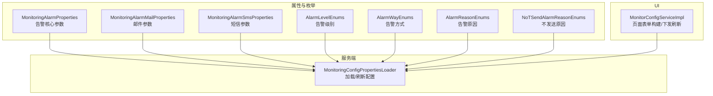
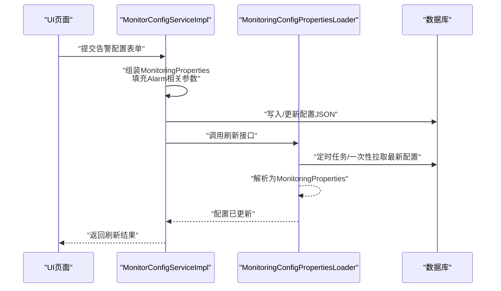
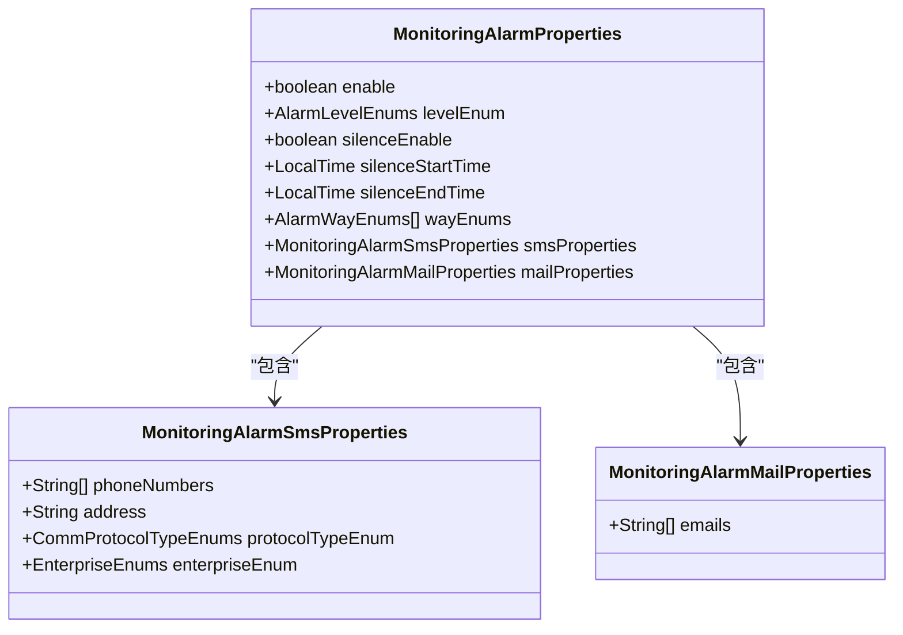
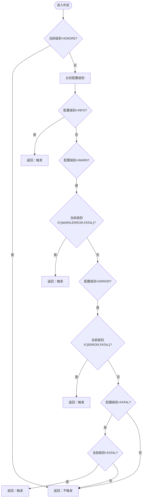
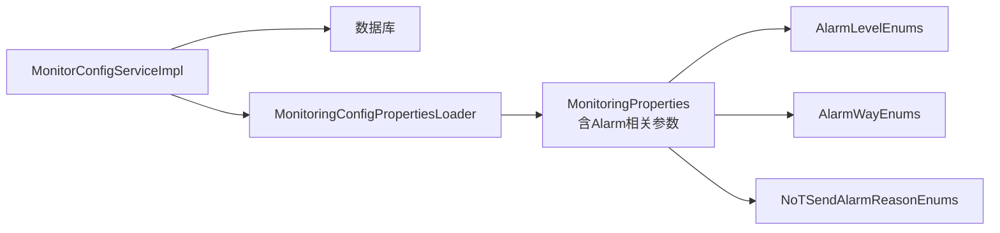

# 告警监控参数

<cite>
**本文引用的文件**
- [MonitoringAlarmProperties.java](file://phoenix-common/phoenix-common-core/src/main/java/com/gitee/pifeng/monitoring/common/property/server/MonitoringAlarmProperties.java)
- [MonitoringAlarmMailProperties.java](file://phoenix-common/phoenix-common-core/src/main/java/com/gitee/pifeng/monitoring/common/property/server/MonitoringAlarmMailProperties.java)
- [MonitoringAlarmSmsProperties.java](file://phoenix-common/phoenix-common-core/src/main/java/com/gitee/pifeng/monitoring/common/property/server/MonitoringAlarmSmsProperties.java)
- [AlarmLevelEnums.java](file://phoenix-common/phoenix-common-core/src/main/java/com/gitee/pifeng/monitoring/common/constant/alarm/AlarmLevelEnums.java)
- [AlarmWayEnums.java](file://phoenix-common/phoenix-common-core/src/main/java/com/gitee/pifeng/monitoring/common/constant/alarm/AlarmWayEnums.java)
- [AlarmReasonEnums.java](file://phoenix-common/phoenix-common-core/src/main/java/com/gitee/pifeng/monitoring/common/constant/alarm/AlarmReasonEnums.java)
- [NoTSendAlarmReasonEnums.java](file://phoenix-common/phoenix-common-core/src/main/java/com/gitee/pifeng/monitoring/common/constant/alarm/NoTSendAlarmReasonEnums.java)
- [MonitoringConfigPropertiesLoader.java](file://phoenix-server/src/main/java/com/gitee/pifeng/monitoring/server/business/server/core/MonitoringConfigPropertiesLoader.java)
- [MonitorConfigServiceImpl.java](file://phoenix-ui/src/main/java/com/gitee/pifeng/monitoring/ui/business/web/service/impl/MonitorConfigServiceImpl.java)
- [Alarm.java](file://phoenix-common/phoenix-common-core/src/main/java/com/gitee/pifeng/monitoring/common/domain/Alarm.java)
- [MonitorAlarmDefinition.java](file://phoenix-server/src/main/java/com/gitee/pifeng/monitoring/server/business/server/entity/MonitorAlarmDefinition.java)
- [MonitorAlarmRecord.java](file://phoenix-server/src/main/java/com/gitee/pifeng/monitoring/server/business/server/entity/MonitorAlarmRecord.java)
</cite>

## 目录
1. [简介](#简介)
2. [项目结构](#项目结构)
3. [核心组件](#核心组件)
4. [架构总览](#架构总览)
5. [详细组件分析](#详细组件分析)
6. [依赖关系分析](#依赖关系分析)
7. [性能与稳定性考量](#性能与稳定性考量)
8. [故障排查指南](#故障排查指南)
9. [结论](#结论)
10. [附录](#附录)

## 简介
本文件面向Phoenix监控系统管理员与开发人员，提供告警监控参数的完整配置说明。重点覆盖以下方面：
- 告警核心参数：阈值、级别、静默期、告警方式等
- 邮件告警参数：收件人、SMTP基础配置思路
- 短信告警参数：服务商接入、接口协议、企业标识、手机号码等
- 告警规则与通知策略：自定义规则、复合规则、升级机制、静默期与优先级
- 最佳实践与风暴防护策略：避免重复告警、降低噪声、提升可维护性

## 项目结构
告警配置涉及三部分：
- 属性模型层：定义告警相关配置的Java Bean与枚举
- 服务端加载层：从数据库加载并定时刷新配置
- UI配置层：提供页面表单编辑与下发刷新请求

图表来源
- [MonitoringAlarmProperties.java:1-65](file://phoenix-common/phoenix-common-core/src/main/java/com/gitee/pifeng/monitoring/common/property/server/MonitoringAlarmProperties.java#L1-L65)
- [MonitoringAlarmMailProperties.java:1-27](file://phoenix-common/phoenix-common-core/src/main/java/com/gitee/pifeng/monitoring/common/property/server/MonitoringAlarmMailProperties.java#L1-L27)
- [MonitoringAlarmSmsProperties.java:1-44](file://phoenix-common/phoenix-common-core/src/main/java/com/gitee/pifeng/monitoring/common/property/server/MonitoringAlarmSmsProperties.java#L1-L44)
- [AlarmLevelEnums.java:1-118](file://phoenix-common/phoenix-common-core/src/main/java/com/gitee/pifeng/monitoring/common/constant/alarm/AlarmLevelEnums.java#L1-L118)
- [AlarmWayEnums.java:1-94](file://phoenix-common/phoenix-common-core/src/main/java/com/gitee/pifeng/monitoring/common/constant/alarm/AlarmWayEnums.java#L1-L94)
- [AlarmReasonEnums.java:1-34](file://phoenix-common/phoenix-common-core/src/main/java/com/gitee/pifeng/monitoring/common/constant/alarm/AlarmReasonEnums.java#L1-L34)
- [NoTSendAlarmReasonEnums.java:1-78](file://phoenix-common/phoenix-common-core/src/main/java/com/gitee/pifeng/monitoring/common/constant/alarm/NoTSendAlarmReasonEnums.java#L1-L78)
- [MonitoringConfigPropertiesLoader.java:1-203](file://phoenix-server/src/main/java/com/gitee/pifeng/monitoring/server/business/server/core/MonitoringConfigPropertiesLoader.java#L1-L203)
- [MonitorConfigServiceImpl.java:1-282](file://phoenix-ui/src/main/java/com/gitee/pifeng/monitoring/ui/business/web/service/impl/MonitorConfigServiceImpl.java#L1-L282)

章节来源
- [MonitoringConfigPropertiesLoader.java:1-203](file://phoenix-server/src/main/java/com/gitee/pifeng/monitoring/server/business/server/core/MonitoringConfigPropertiesLoader.java#L1-L203)
- [MonitorConfigServiceImpl.java:1-282](file://phoenix-ui/src/main/java/com/gitee/pifeng/monitoring/ui/business/web/service/impl/MonitorConfigServiceImpl.java#L1-L282)

## 核心组件
本节聚焦告警核心参数的字段与语义，以及与之配套的枚举。

- 告警核心参数（MonitoringAlarmProperties）
  - 开关与级别：enable、levelEnum
  - 静默期：silenceEnable、silenceStartTime、silenceEndTime
  - 告警方式：wayEnums（支持多种方式组合）
  - 子配置：smsProperties、mailProperties

- 告警级别（AlarmLevelEnums）
  - 可选级别：IGNORE、INFO、WARN、ERROR、FATAL
  - 判定逻辑：当“当前级别”大于等于“配置级别”时触发告警；若配置为IGNORE则不触发

- 告警方式（AlarmWayEnums）
  - 可选方式：SMS、MAIL
  - 提供字符串与枚举互转工具

- 告警原因（AlarmReasonEnums）
  - NORMAL_2_ABNORMAL、ABNORMAL_2_NORMAL、DISCOVERY、IGNORE

- 不发送告警原因（NoTSendAlarmReasonEnums）
  - 包含：开关关闭、静默期、测试信息、低于配置级别、标题/内容为空、未配置告警方式等

章节来源
- [MonitoringAlarmProperties.java:1-65](file://phoenix-common/phoenix-common-core/src/main/java/com/gitee/pifeng/monitoring/common/property/server/MonitoringAlarmProperties.java#L1-L65)
- [AlarmLevelEnums.java:1-118](file://phoenix-common/phoenix-common-core/src/main/java/com/gitee/pifeng/monitoring/common/constant/alarm/AlarmLevelEnums.java#L1-L118)
- [AlarmWayEnums.java:1-94](file://phoenix-common/phoenix-common-core/src/main/java/com/gitee/pifeng/monitoring/common/constant/alarm/AlarmWayEnums.java#L1-L94)
- [AlarmReasonEnums.java:1-34](file://phoenix-common/phoenix-common-core/src/main/java/com/gitee/pifeng/monitoring/common/constant/alarm/AlarmReasonEnums.java#L1-L34)
- [NoTSendAlarmReasonEnums.java:1-78](file://phoenix-common/phoenix-common-core/src/main/java/com/gitee/pifeng/monitoring/common/constant/alarm/NoTSendAlarmReasonEnums.java#L1-L78)

## 架构总览
下图展示配置从UI提交到服务端生效的关键流程。

图表来源
- [MonitorConfigServiceImpl.java:135-279](file://phoenix-ui/src/main/java/com/gitee/pifeng/monitoring/ui/business/web/service/impl/MonitorConfigServiceImpl.java#L135-L279)
- [MonitoringConfigPropertiesLoader.java:98-200](file://phoenix-server/src/main/java/com/gitee/pifeng/monitoring/server/business/server/core/MonitoringConfigPropertiesLoader.java#L98-L200)

章节来源
- [MonitorConfigServiceImpl.java:1-282](file://phoenix-ui/src/main/java/com/gitee/pifeng/monitoring/ui/business/web/service/impl/MonitorConfigServiceImpl.java#L1-L282)
- [MonitoringConfigPropertiesLoader.java:1-203](file://phoenix-server/src/main/java/com/gitee/pifeng/monitoring/server/business/server/core/MonitoringConfigPropertiesLoader.java#L1-L203)

## 详细组件分析

### 告警核心参数（MonitoringAlarmProperties）
- enable：全局开关
- levelEnum：告警级别阈值（与AlarmLevelEnums配合）
- silenceEnable/silenceStartTime/silenceEndTime：静默期配置
- wayEnums：告警方式集合（如同时启用MAIL与SMS）
- smsProperties/mailProperties：短信/邮件子配置

图表来源
- [MonitoringAlarmProperties.java:1-65](file://phoenix-common/phoenix-common-core/src/main/java/com/gitee/pifeng/monitoring/common/property/server/MonitoringAlarmProperties.java#L1-L65)
- [MonitoringAlarmSmsProperties.java:1-44](file://phoenix-common/phoenix-common-core/src/main/java/com/gitee/pifeng/monitoring/common/property/server/MonitoringAlarmSmsProperties.java#L1-L44)
- [MonitoringAlarmMailProperties.java:1-27](file://phoenix-common/phoenix-common-core/src/main/java/com/gitee/pifeng/monitoring/common/property/server/MonitoringAlarmMailProperties.java#L1-L27)

章节来源
- [MonitoringAlarmProperties.java:1-65](file://phoenix-common/phoenix-common-core/src/main/java/com/gitee/pifeng/monitoring/common/property/server/MonitoringAlarmProperties.java#L1-L65)

### 邮件告警参数（MonitoringAlarmMailProperties）
- emails：收件人邮箱地址数组
- 配置入口：在UI侧通过分号分隔的字符串转换为数组后写入

章节来源
- [MonitoringAlarmMailProperties.java:1-27](file://phoenix-common/phoenix-common-core/src/main/java/com/gitee/pifeng/monitoring/common/property/server/MonitoringAlarmMailProperties.java#L1-L27)
- [MonitorConfigServiceImpl.java:137-158](file://phoenix-ui/src/main/java/com/gitee/pifeng/monitoring/ui/business/web/service/impl/MonitorConfigServiceImpl.java#L137-L158)

### 短信告警参数（MonitoringAlarmSmsProperties）
- phoneNumbers：手机号数组
- address：短信接口地址
- protocolTypeEnum：接口协议（HTTP等）
- enterpriseEnum：企业标识（用于区分不同厂商或版本）

章节来源
- [MonitoringAlarmSmsProperties.java:1-44](file://phoenix-common/phoenix-common-core/src/main/java/com/gitee/pifeng/monitoring/common/property/server/MonitoringAlarmSmsProperties.java#L1-L44)
- [MonitorConfigServiceImpl.java:140-145](file://phoenix-ui/src/main/java/com/gitee/pifeng/monitoring/ui/business/web/service/impl/MonitorConfigServiceImpl.java#L140-L145)

### 告警级别与判定（AlarmLevelEnums）
- 支持从字符串转为枚举
- isAlarm(config, current)：当current≥config时触发，IGNORE直接不触发

图表来源
- [AlarmLevelEnums.java:51-81](file://phoenix-common/phoenix-common-core/src/main/java/com/gitee/pifeng/monitoring/common/constant/alarm/AlarmLevelEnums.java#L51-L81)

章节来源
- [AlarmLevelEnums.java:1-118](file://phoenix-common/phoenix-common-core/src/main/java/com/gitee/pifeng/monitoring/common/constant/alarm/AlarmLevelEnums.java#L1-L118)

### 告警方式与字符串互转（AlarmWayEnums）
- 支持SMS、MAIL
- 提供字符串数组与枚举数组互转工具

章节来源
- [AlarmWayEnums.java:1-94](file://phoenix-common/phoenix-common-core/src/main/java/com/gitee/pifeng/monitoring/common/constant/alarm/AlarmWayEnums.java#L1-L94)

### 告警记录与定义（MonitorAlarmDefinition、MonitorAlarmRecord）
- MonitorAlarmDefinition：告警定义（类型、分类、级别、编码、标题、内容）
- MonitorAlarmRecord：告警记录（告警码、定义编码、类型、级别、方式、标题、内容、不发送原因）

章节来源
- [MonitorAlarmDefinition.java:1-95](file://phoenix-server/src/main/java/com/gitee/pifeng/monitoring/server/business/server/entity/MonitorAlarmDefinition.java#L1-L95)
- [MonitorAlarmRecord.java:1-93](file://phoenix-server/src/main/java/com/gitee/pifeng/monitoring/server/business/server/entity/MonitorAlarmRecord.java#L1-L93)

### 告警域对象（Alarm）
- alarmLevel、alarmReason、monitorType、monitorSubType、charset、isTest、title、msg、code、alertedEntityId、isIgnoreSilence
- 支持通过code关联到MonitorAlarmDefinition，覆盖级别/标题/内容

章节来源
- [Alarm.java:1-117](file://phoenix-common/phoenix-common-core/src/main/java/com/gitee/pifeng/monitoring/common/domain/Alarm.java#L1-L117)

## 依赖关系分析
- UI层负责将页面表单转换为MonitoringProperties并写入数据库，随后触发服务端刷新
- 服务端定时任务/一次性任务从数据库读取配置，解析为MonitoringProperties并更新内存缓存
- 告警判定依赖AlarmLevelEnums与AlarmWayEnums；不发送原因由NoTSendAlarmReasonEnums统一管理

图表来源
- [MonitorConfigServiceImpl.java:135-279](file://phoenix-ui/src/main/java/com/gitee/pifeng/monitoring/ui/business/web/service/impl/MonitorConfigServiceImpl.java#L135-L279)
- [MonitoringConfigPropertiesLoader.java:98-200](file://phoenix-server/src/main/java/com/gitee/pifeng/monitoring/server/business/server/core/MonitoringConfigPropertiesLoader.java#L98-L200)
- [AlarmLevelEnums.java:1-118](file://phoenix-common/phoenix-common-core/src/main/java/com/gitee/pifeng/monitoring/common/constant/alarm/AlarmLevelEnums.java#L1-L118)
- [AlarmWayEnums.java:1-94](file://phoenix-common/phoenix-common-core/src/main/java/com/gitee/pifeng/monitoring/common/constant/alarm/AlarmWayEnums.java#L1-L94)
- [NoTSendAlarmReasonEnums.java:1-78](file://phoenix-common/phoenix-common-core/src/main/java/com/gitee/pifeng/monitoring/common/constant/alarm/NoTSendAlarmReasonEnums.java#L1-L78)

章节来源
- [MonitorConfigServiceImpl.java:1-282](file://phoenix-ui/src/main/java/com/gitee/pifeng/monitoring/ui/business/web/service/impl/MonitorConfigServiceImpl.java#L1-L282)
- [MonitoringConfigPropertiesLoader.java:1-203](file://phoenix-server/src/main/java/com/gitee/pifeng/monitoring/server/business/server/core/MonitoringConfigPropertiesLoader.java#L1-L203)

## 性能与稳定性考量
- 配置刷新策略：服务端采用定时任务定期从数据库拉取最新配置，避免频繁IO与序列化开销
- 告警判定复杂度：级别比较为常数时间，整体开销极低
- 静默期控制：通过LocalTime范围快速判断，减少无效通知
- 建议
  - 控制告警方式数量，避免过多渠道导致延迟
  - 合理设置静默期，避开业务高峰时段
  - 使用合适的告警级别，避免“噪音”级别过多

[本节为通用建议，无需特定文件引用]

## 故障排查指南
- 常见不发送原因
  - 告警开关未开启
  - 处于静默期
  - 测试信息
  - 低于配置级别
  - 告警标题/内容为空
  - 未配置告警方式

- 排查步骤
  1. 检查MonitoringAlarmProperties.enable与levelEnum
  2. 确认当前时间是否处于silenceStartTime~silenceEndTime之间
  3. 校验wayEnums是否包含所需方式
  4. 查看MonitorAlarmRecord.notSendReason定位具体原因
  5. 若使用自定义业务告警，确认Alarm.code是否正确映射到MonitorAlarmDefinition

章节来源
- [NoTSendAlarmReasonEnums.java:1-78](file://phoenix-common/phoenix-common-core/src/main/java/com/gitee/pifeng/monitoring/common/constant/alarm/NoTSendAlarmReasonEnums.java#L1-L78)
- [MonitorAlarmRecord.java:1-93](file://phoenix-server/src/main/java/com/gitee/pifeng/monitoring/server/business/server/entity/MonitorAlarmRecord.java#L1-L93)

## 结论
通过上述参数与流程，Phoenix提供了灵活可控的告警体系：既能按级别与静默期精准过滤，又能组合多种通知渠道。配合UI配置与服务端自动刷新，可在不重启服务的情况下动态调整告警策略。建议结合业务场景合理设置级别、静默期与通知方式，并利用自定义告警编码实现统一治理。

[本节为总结，无需特定文件引用]

## 附录

### 告警规则与通知策略配置要点
- 自定义告警条件
  - 通过Alarm.code关联MonitorAlarmDefinition，统一管理级别、标题、内容
- 复合告警规则
  - 在应用侧聚合多个指标后生成Alarm，再交由统一判定与发送
- 告警升级机制
  - 可基于时间窗内重复告警次数或级别提升进行升级
- 通知优先级与静默期
  - 优先级由AlarmLevelEnums决定；静默期由MonitoringAlarmProperties控制
- 去重与风暴防护
  - 建议：同一指标同级别同内容在固定周期内仅发送一次；对高频波动指标设置更高阈值或更长静默期

[本节为通用指导，无需特定文件引用]