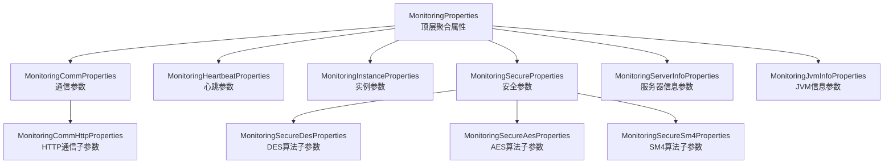
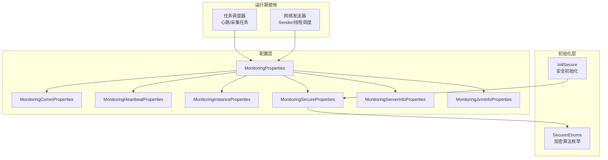
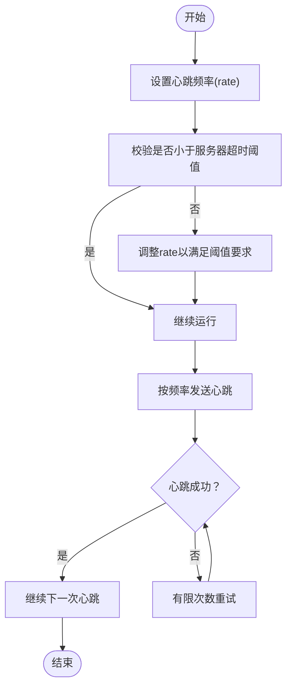
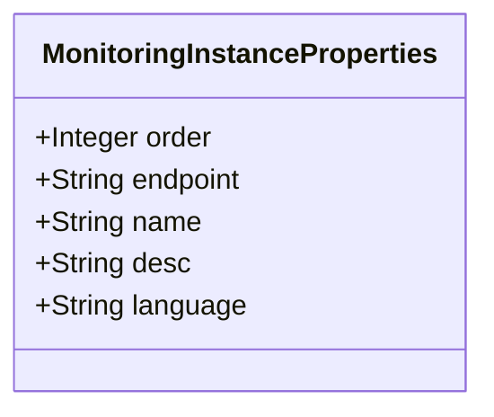
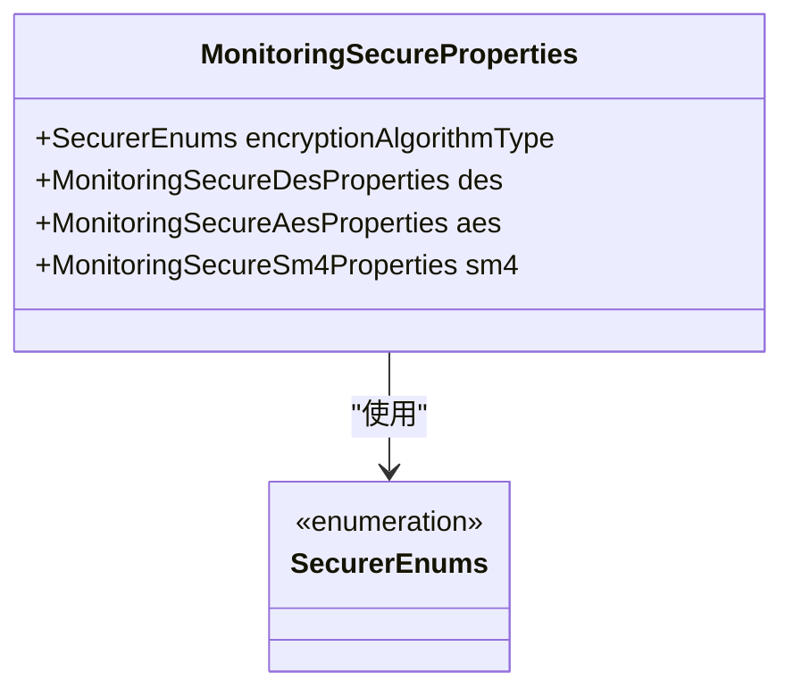
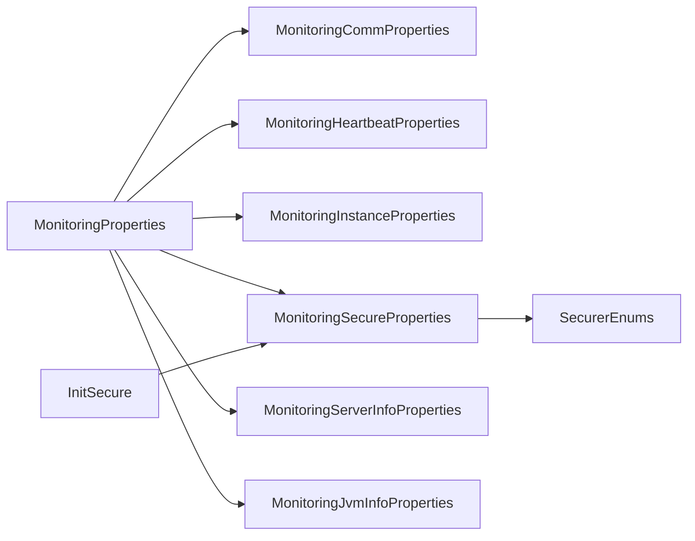

# 客户端监控参数

<cite>
**本文引用的文件**
- [MonitoringProperties.java](file://phoenix-common/phoenix-common-core/src/main/java/com/gitee/pifeng/monitoring/common/property/client/MonitoringProperties.java)
- [MonitoringCommProperties.java](file://phoenix-common/phoenix-common-core/src/main/java/com/gitee/pifeng/monitoring/common/property/client/MonitoringCommProperties.java)
- [MonitoringCommHttpProperties.java](file://phoenix-common/phoenix-common-core/src/main/java/com/gitee/pifeng/monitoring/common/property/client/MonitoringCommHttpProperties.java)
- [MonitoringHeartbeatProperties.java](file://phoenix-common/phoenix-common-core/src/main/java/com/gitee/pifeng/monitoring/common/property/client/MonitoringHeartbeatProperties.java)
- [MonitoringInstanceProperties.java](file://phoenix-common/phoenix-common-core/src/main/java/com/gitee/pifeng/monitoring/common/property/client/MonitoringInstanceProperties.java)
- [MonitoringSecureProperties.java](file://phoenix-common/phoenix-common-core/src/main/java/com/gitee/pifeng/monitoring/common/property/client/MonitoringSecureProperties.java)
- [MonitoringSecureDesProperties.java](file://phoenix-common/phoenix-common-core/src/main/java/com/gitee/pifeng/monitoring/common/property/client/MonitoringSecureDesProperties.java)
- [MonitoringSecureAesProperties.java](file://phoenix-common/phoenix-common-core/src/main/java/com/gitee/pifeng/monitoring/common/property/client/MonitoringSecureAesProperties.java)
- [MonitoringSecureSm4Properties.java](file://phoenix-common/phoenix-common-core/src/main/java/com/gitee/pifeng/monitoring/common/property/client/MonitoringSecureSm4Properties.java)
- [MonitoringServerInfoProperties.java](file://phoenix-common/phoenix-common-core/src/main/java/com/gitee/pifeng/monitoring/common/property/client/MonitoringServerInfoProperties.java)
- [MonitoringJvmInfoProperties.java](file://phoenix-common/phoenix-common-core/src/main/java/com/gitee/pifeng/monitoring/common/property/client/MonitoringJvmInfoProperties.java)
- [SecurerEnums.java](file://phoenix-common/phoenix-common-core/src/main/java/com/gitee/pifeng/monitoring/common/constant/SecurerEnums.java)
- [InitSecure.java](file://phoenix-common/phoenix-common-core/src/main/java/com/gitee/pifeng/monitoring/common/init/InitSecure.java)
- [application.yml](file://phoenix-client/phoenix-client-core/src/test/resources/application.yml)
- [monitoring.properties](file://phoenix-client/phoenix-client-core/src/test/resources/monitoring.properties)
</cite>

## 目录
1. [简介](#简介)
2. [项目结构](#项目结构)
3. [核心组件](#核心组件)
4. [架构总览](#架构总览)
5. [详细组件分析](#详细组件分析)
6. [依赖关系分析](#依赖关系分析)
7. [性能考虑](#性能考虑)
8. [故障排查指南](#故障排查指南)
9. [结论](#结论)
10. [附录](#附录)

## 简介
本文件面向Phoenix监控系统客户端侧的监控参数配置，围绕以下四类核心参数进行系统化说明：
- 通信参数（MonitoringCommProperties）：定义与服务器通信的HTTP相关配置，如超时、重试、连接池等。
- 心跳参数（MonitoringHeartbeatProperties）：定义心跳发送频率等关键指标，确保客户端与服务器保持健康连接。
- 应用程序监控参数（MonitoringInstanceProperties）：定义实例标识、端点类型、应用名称、语言等实例相关信息。
- 安全参数（MonitoringSecureProperties）：定义加密算法类型及具体算法的子配置（DES/AES/SM4），保障数据传输安全。

同时，文档结合实际代码结构与注释，给出参数作用机制与配置最佳实践，帮助开发者正确配置以获得准确可靠的监控数据。

## 项目结构
客户端监控参数位于公共模块的客户端属性包中，采用分层聚合的设计：顶层属性类（MonitoringProperties）聚合四大子属性类，每个子类再细分为更具体的子属性，形成清晰的层次化配置模型。

图表来源
- [MonitoringProperties.java:22-55](file://phoenix-common/phoenix-common-core/src/main/java/com/gitee/pifeng/monitoring/common/property/client/MonitoringProperties.java#L22-L55)
- [MonitoringCommProperties.java:20-27](file://phoenix-common/phoenix-common-core/src/main/java/com/gitee/pifeng/monitoring/common/property/client/MonitoringCommProperties.java#L20-L27)
- [MonitoringHeartbeatProperties.java:20-27](file://phoenix-common/phoenix-common-core/src/main/java/com/gitee/pifeng/monitoring/common/property/client/MonitoringHeartbeatProperties.java#L20-L27)
- [MonitoringInstanceProperties.java:20-47](file://phoenix-common/phoenix-common-core/src/main/java/com/gitee/pifeng/monitoring/common/property/client/MonitoringInstanceProperties.java#L20-L47)
- [MonitoringSecureProperties.java:23-45](file://phoenix-common/phoenix-common-core/src/main/java/com/gitee/pifeng/monitoring/common/property/client/MonitoringSecureProperties.java#L23-L45)
- [MonitoringServerInfoProperties.java](file://phoenix-common/phoenix-common-core/src/main/java/com/gitee/pifeng/monitoring/common/property/client/MonitoringServerInfoProperties.java)
- [MonitoringJvmInfoProperties.java](file://phoenix-common/phoenix-common-core/src/main/java/com/gitee/pifeng/monitoring/common/property/client/MonitoringJvmInfoProperties.java)

章节来源
- [MonitoringProperties.java:22-55](file://phoenix-common/phoenix-common-core/src/main/java/com/gitee/pifeng/monitoring/common/property/client/MonitoringProperties.java#L22-L55)

## 核心组件
本节对四大核心参数类进行逐项解析，并说明其在整体监控体系中的职责与交互方式。

- 顶层聚合类（MonitoringProperties）
  - 职责：统一承载安全、通信、实例、心跳、服务器信息、JVM信息等配置，作为客户端启动与运行期的唯一配置入口。
  - 关键点：注释明确指出某些属性名称不可随意改动，因为初始化流程会通过反射访问这些属性，保证配置加载的稳定性与一致性。

- 通信参数（MonitoringCommProperties）
  - 职责：封装与服务器通信相关的配置，当前包含HTTP通信子参数（MonitoringCommHttpProperties）。
  - 作用：为客户端发送心跳、采集数据、上报异常等操作提供网络层基础配置。

- 心跳参数（MonitoringHeartbeatProperties）
  - 职责：定义心跳发送频率（rate），用于维持客户端与服务器之间的活跃状态。
  - 作用：通过合理的频率设置，平衡网络开销与连接健康检测的及时性。

- 应用程序监控参数（MonitoringInstanceProperties）
  - 职责：定义客户端实例的元信息，包括实例次序、端点类型、名称、描述、语言等。
  - 作用：便于在监控平台中识别与区分不同实例，支持多实例场景下的精细化运维。

- 安全参数（MonitoringSecureProperties）
  - 职责：定义加密算法类型以及对应算法的子配置（DES/AES/SM4）。
  - 作用：保障客户端与服务器之间数据传输的安全性，防止敏感信息被窃听或篡改。

章节来源
- [MonitoringProperties.java:22-55](file://phoenix-common/phoenix-common-core/src/main/java/com/gitee/pifeng/monitoring/common/property/client/MonitoringProperties.java#L22-L55)
- [MonitoringCommProperties.java:20-27](file://phoenix-common/phoenix-common-core/src/main/java/com/gitee/pifeng/monitoring/common/property/client/MonitoringCommProperties.java#L20-L27)
- [MonitoringHeartbeatProperties.java:20-27](file://phoenix-common/phoenix-common-core/src/main/java/com/gitee/pifeng/monitoring/common/property/client/MonitoringHeartbeatProperties.java#L20-L27)
- [MonitoringInstanceProperties.java:20-47](file://phoenix-common/phoenix-common-core/src/main/java/com/gitee/pifeng/monitoring/common/property/client/MonitoringInstanceProperties.java#L20-L47)
- [MonitoringSecureProperties.java:23-45](file://phoenix-common/phoenix-common-core/src/main/java/com/gitee/pifeng/monitoring/common/property/client/MonitoringSecureProperties.java#L23-L45)

## 架构总览
下图展示了客户端监控参数在启动与运行期的整体交互关系，强调配置聚合、初始化与使用路径。

图表来源
- [MonitoringProperties.java:22-55](file://phoenix-common/phoenix-common-core/src/main/java/com/gitee/pifeng/monitoring/common/property/client/MonitoringProperties.java#L22-L55)
- [MonitoringSecureProperties.java:23-45](file://phoenix-common/phoenix-common-core/src/main/java/com/gitee/pifeng/monitoring/common/property/client/MonitoringSecureProperties.java#L23-L45)
- [SecurerEnums.java](file://phoenix-common/phoenix-common-core/src/main/java/com/gitee/pifeng/monitoring/common/constant/SecurerEnums.java)
- [InitSecure.java](file://phoenix-common/phoenix-common-core/src/main/java/com/gitee/pifeng/monitoring/common/init/InitSecure.java)

## 详细组件分析

### 通信参数（MonitoringCommProperties 与 MonitoringCommHttpProperties）
- 结构关系
  - MonitoringCommProperties 聚合 MonitoringCommHttpProperties，后者承载HTTP通信相关细节。
  - 当前版本仅包含HTTP子参数，后续可扩展TCP/UDP等其他协议的子配置。

- 配置要点
  - HTTP超时：建议根据网络环境与服务器响应能力设置合理的连接与读取超时，避免过短导致频繁超时，过长影响故障感知速度。
  - 重试策略：建议开启有限次数的幂等重试，配合退避算法降低雪崩风险。
  - 连接池：合理设置最大连接数与空闲连接回收策略，兼顾吞吐与资源占用。
  - 并发控制：结合任务调度器的线程池配置，避免过度并发造成服务器压力。

- 最佳实践
  - 在高延迟网络环境下适当提高超时阈值，但需配合心跳与离线检测机制共同使用。
  - 对于非幂等请求，谨慎启用自动重试，必要时在业务层做去重处理。
  - 监控连接池指标（活跃连接数、等待队列长度、拒绝次数），动态调优。

章节来源
- [MonitoringCommProperties.java:20-27](file://phoenix-common/phoenix-common-core/src/main/java/com/gitee/pifeng/monitoring/common/property/client/MonitoringCommProperties.java#L20-L27)
- [MonitoringCommHttpProperties.java](file://phoenix-common/phoenix-common-core/src/main/java/com/gitee/pifeng/monitoring/common/property/client/MonitoringCommHttpProperties.java)

### 心跳参数（MonitoringHeartbeatProperties）
- 结构关系
  - MonitoringHeartbeatProperties 仅包含心跳频率（rate）字段，用于控制心跳发送周期。

- 配置要点
  - 心跳间隔：应小于服务器端的超时阈值，确保在网络抖动情况下仍能维持连接有效。
  - 心跳超时阈值：由服务器端统一配置，客户端需与之匹配，避免误判离线。
  - 失败处理策略：当连续多次心跳失败后，应触发降级与重连逻辑，避免长时间无数据上报。

- 最佳实践
  - 将心跳频率设置为服务器端超时阈值的1/3~1/2，留足余量应对网络波动。
  - 在高负载场景下，适当降低心跳频率以减少带宽与CPU消耗。
  - 结合离线线程/任务的重连策略，实现快速恢复与平滑降级。

图表来源
- [MonitoringHeartbeatProperties.java:20-27](file://phoenix-common/phoenix-common-core/src/main/java/com/gitee/pifeng/monitoring/common/property/client/MonitoringHeartbeatProperties.java#L20-L27)

章节来源
- [MonitoringHeartbeatProperties.java:20-27](file://phoenix-common/phoenix-common-core/src/main/java/com/gitee/pifeng/monitoring/common/property/client/MonitoringHeartbeatProperties.java#L20-L27)

### 应用程序监控参数（MonitoringInstanceProperties）
- 结构关系
  - MonitoringInstanceProperties 包含实例次序、端点类型、名称、描述、语言等字段，用于标识与区分不同实例。

- 配置要点
  - 实例次序（order）：在同一集群内必须唯一，用于排序与展示。
  - 端点类型（endpoint）：标识实例角色（如客户端、代理端、服务端、UI端），便于分类统计。
  - 实例名称（name）与描述（desc）：建议具有业务含义，便于运维检索与告警定位。
  - 程序语言（language）：用于区分不同技术栈的实例，辅助跨语言监控分析。

- 最佳实践
  - 使用稳定的命名规范，结合环境与版本信息，避免同名冲突。
  - 端点类型与部署拓扑一致，确保监控面板的正确分组。
  - 描述信息简洁明确，包含关键业务属性（如模块、区域、机房）。

图表来源
- [MonitoringInstanceProperties.java:20-47](file://phoenix-common/phoenix-common-core/src/main/java/com/gitee/pifeng/monitoring/common/property/client/MonitoringInstanceProperties.java#L20-L47)

章节来源
- [MonitoringInstanceProperties.java:20-47](file://phoenix-common/phoenix-common-core/src/main/java/com/gitee/pifeng/monitoring/common/property/client/MonitoringInstanceProperties.java#L20-L47)

### 安全参数（MonitoringSecureProperties 及其子算法配置）
- 结构关系
  - MonitoringSecureProperties 指定加密算法类型（SecurerEnums），并包含DES/AES/SM4三种算法的子配置对象。
  - InitSecure 会在启动时通过反射访问这些属性，因此属性名称与结构需保持稳定。

- 配置要点
  - 加密算法类型（encryptionAlgorithmType）：从SecurerEnums中选择，决定数据加解密策略。
  - DES/AES/SM4子配置：分别对应不同算法的密钥、模式、填充等参数，需与服务器端保持一致。
  - 属性稳定性：注释明确指出属性名称不可随意改动，否则会影响初始化流程。

- 最佳实践
  - 优先选用AES或SM4等现代算法，确保安全性与性能平衡。
  - 密钥管理遵循最小权限与定期轮换原则，避免硬编码在配置文件中。
  - 与服务器端算法类型与密钥保持严格一致，确保双向加解密成功。
  - 在CI/CD流程中对密钥进行安全注入，避免泄露。

图表来源
- [MonitoringSecureProperties.java:23-45](file://phoenix-common/phoenix-common-core/src/main/java/com/gitee/pifeng/monitoring/common/property/client/MonitoringSecureProperties.java#L23-L45)
- [SecurerEnums.java](file://phoenix-common/phoenix-common-core/src/main/java/com/gitee/pifeng/monitoring/common/constant/SecurerEnums.java)

章节来源
- [MonitoringSecureProperties.java:23-45](file://phoenix-common/phoenix-common-core/src/main/java/com/gitee/pifeng/monitoring/common/property/client/MonitoringSecureProperties.java#L23-L45)
- [InitSecure.java](file://phoenix-common/phoenix-common-core/src/main/java/com/gitee/pifeng/monitoring/common/init/InitSecure.java)

## 依赖关系分析
- 组件耦合
  - MonitoringProperties 作为聚合根，与其他四个子属性类存在强聚合关系，体现“组合优于继承”的设计。
  - MonitoringSecureProperties 依赖 SecurerEnums 与 InitSecure 的反射机制，对属性名称与结构有约束。
  - MonitoringCommProperties 依赖 MonitoringCommHttpProperties 提供HTTP通信细节，便于扩展其他协议。

- 外部依赖
  - SecurerEnums 提供算法枚举，确保算法选择的一致性与可扩展性。
  - InitSecure 通过反射读取安全相关属性，要求属性名称稳定不变。

图表来源
- [MonitoringProperties.java:22-55](file://phoenix-common/phoenix-common-core/src/main/java/com/gitee/pifeng/monitoring/common/property/client/MonitoringProperties.java#L22-L55)
- [MonitoringSecureProperties.java:23-45](file://phoenix-common/phoenix-common-core/src/main/java/com/gitee/pifeng/monitoring/common/property/client/MonitoringSecureProperties.java#L23-L45)
- [SecurerEnums.java](file://phoenix-common/phoenix-common-core/src/main/java/com/gitee/pifeng/monitoring/common/constant/SecurerEnums.java)
- [InitSecure.java](file://phoenix-common/phoenix-common-core/src/main/java/com/gitee/pifeng/monitoring/common/init/InitSecure.java)

章节来源
- [MonitoringProperties.java:22-55](file://phoenix-common/phoenix-common-core/src/main/java/com/gitee/pifeng/monitoring/common/property/client/MonitoringProperties.java#L22-L55)
- [MonitoringSecureProperties.java:23-45](file://phoenix-common/phoenix-common-core/src/main/java/com/gitee/pifeng/monitoring/common/property/client/MonitoringSecureProperties.java#L23-L45)

## 性能考虑
- 心跳频率与网络开销
  - 合理的心跳频率能平衡连接健康检测与带宽/CPU消耗。建议参考服务器端超时阈值进行设置，并在高负载场景下调低频率。
- 通信超时与重试
  - 超时时间过短易误判，过长影响故障感知；重试次数应有限且具备退避策略，避免放大网络风暴。
- 连接池与并发
  - 连接池大小应与任务并发度匹配，避免过多空闲连接占用资源，也避免排队导致延迟。
- 加密开销
  - 现代算法（AES/SM4）在保证安全的同时具备较好性能；密钥轮换与缓存策略可减少频繁初始化带来的开销。

## 故障排查指南
- 心跳失败
  - 现象：服务器端标记实例离线，客户端未上报数据。
  - 排查：检查心跳频率是否小于服务器端超时阈值；确认网络连通性与防火墙策略；查看重试与降级逻辑是否生效。
- 安全初始化失败
  - 现象：启动时报错，无法完成安全初始化。
  - 排查：确认属性名称未被修改；检查加密算法类型与服务器端一致；核对密钥配置是否正确。
- 通信超时/重试过多
  - 现象：网络请求频繁超时或重试，影响性能。
  - 排查：调整HTTP超时与重试策略；优化服务器端响应时间；检查连接池配置。
- 实例信息不一致
  - 现象：监控平台显示实例名称或端点类型错误。
  - 排查：核对实例次序、端点类型、名称与描述的配置；确保命名规范与业务一致。

章节来源
- [MonitoringHeartbeatProperties.java:20-27](file://phoenix-common/phoenix-common-core/src/main/java/com/gitee/pifeng/monitoring/common/property/client/MonitoringHeartbeatProperties.java#L20-L27)
- [MonitoringSecureProperties.java:23-45](file://phoenix-common/phoenix-common-core/src/main/java/com/gitee/pifeng/monitoring/common/property/client/MonitoringSecureProperties.java#L23-L45)
- [InitSecure.java](file://phoenix-common/phoenix-common-core/src/main/java/com/gitee/pifeng/monitoring/common/init/InitSecure.java)

## 结论
Phoenix客户端监控参数通过分层聚合的设计，实现了配置的清晰性与可维护性。通信、心跳、实例与安全四大维度相互协作，既保证了数据上报的可靠性，又兼顾了性能与安全。遵循本文提供的最佳实践，可在不同网络与业务场景下获得稳定、准确的监控效果。

## 附录
- 配置文件示例位置
  - 客户端测试配置文件：[application.yml](file://phoenix-client/phoenix-client-core/src/test/resources/application.yml)
  - 客户端属性文件：[monitoring.properties](file://phoenix-client/phoenix-client-core/src/test/resources/monitoring.properties)