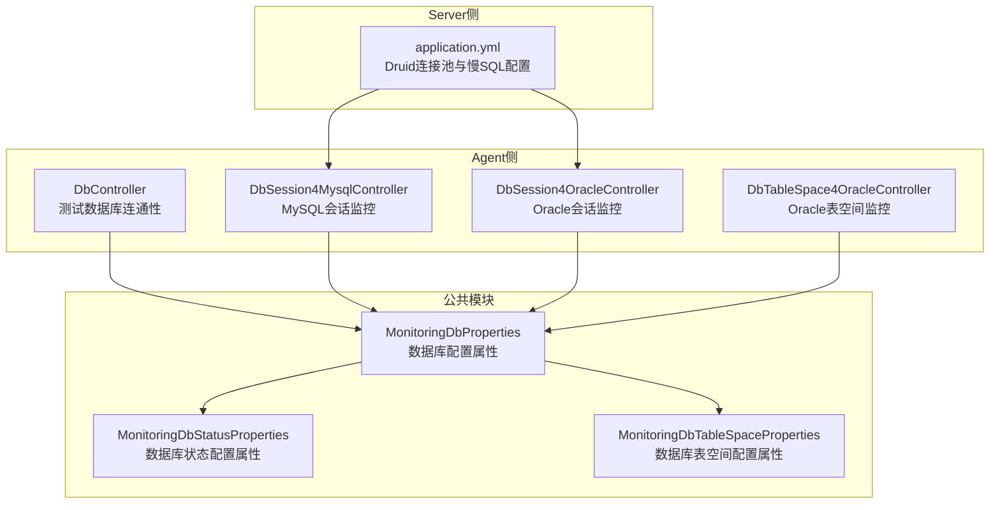
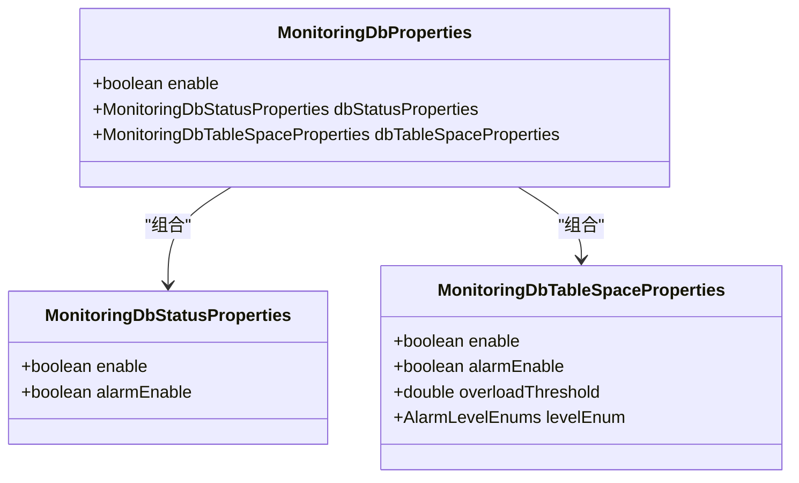
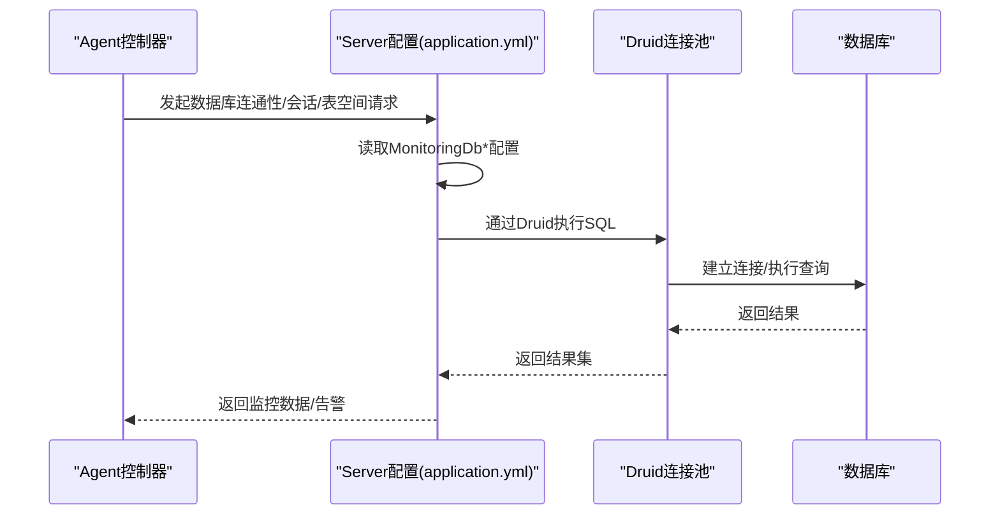
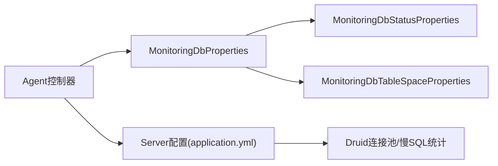

# 数据库监控参数

<cite>
**本文引用的文件**
- [MonitoringDbProperties.java](file://phoenix-common\phoenix-common-core\src\main\java\com\gitee\pifeng\monitoring\common\property\server\MonitoringDbProperties.java)
- [MonitoringDbStatusProperties.java](file://phoenix-common\phoenix-common-core\src\main\java\com\gitee\pifeng\monitoring\common\property\server\MonitoringDbStatusProperties.java)
- [MonitoringDbTableSpaceProperties.java](file://phoenix-common\phoenix-common-core\src\main\java\com\gitee\pifeng\monitoring\common\property\server\MonitoringDbTableSpaceProperties.java)
- [application.yml](file://phoenix-server\src\main\resources\application.yml)
- [DbController.java](file://phoenix-agent\src\main\java\com\gitee\pifeng\monitoring\agent\business\client\controller\DbController.java)
- [DbSession4MysqlController.java](file://phoenix-agent\src\main\java\com\gitee\pifeng\monitoring\agent\business\client\controller\DbSession4MysqlController.java)
- [DbSession4OracleController.java](file://phoenix-agent\src\main\java\com\gitee\pifeng\monitoring\agent\business\client\controller\DbSession4OracleController.java)
- [DbTableSpace4OracleController.java](file://phoenix-agent\src\main\java\com\gitee\pifeng\monitoring\agent\business\client\controller\DbTableSpace4OracleController.java)
</cite>

## 目录
1. [简介](#简介)
2. [项目结构](#项目结构)
3. [核心组件](#核心组件)
4. [架构总览](#架构总览)
5. [详细组件分析](#详细组件分析)
6. [依赖关系分析](#依赖关系分析)
7. [性能考量](#性能考量)
8. [故障排查指南](#故障排查指南)
9. [结论](#结论)
10. [附录](#附录)

## 简介
本文件面向Phoenix监控系统中“数据库监控参数”的配置与使用，围绕以下三类配置展开：
- 数据库连接监控参数（MonitoringDbProperties）
- 数据库状态监控参数（MonitoringDbStatusProperties）
- 数据库表空间监控参数（MonitoringDbTableSpaceProperties）

同时结合系统现有实现，给出不同数据库类型（MySQL、Oracle）的特定监控能力说明、最佳实践与故障排查建议，帮助用户建立完善的数据库监控体系。

## 项目结构
Phoenix监控系统由Agent、Server、UI三部分组成，数据库监控参数主要位于公共模块的属性类中，实际运行时由Server侧加载并生效。下图展示了与数据库监控参数相关的核心文件与职责：

图表来源
- [MonitoringDbProperties.java:1-37](file://phoenix-common\phoenix-common-core\src\main\java\com\gitee\pifeng\monitoring\common\property\server\MonitoringDbProperties.java#L1-L37)
- [MonitoringDbStatusProperties.java:1-32](file://phoenix-common\phoenix-common-core\src\main\java\com\gitee\pifeng\monitoring\common\property\server\MonitoringDbStatusProperties.java#L1-L32)
- [MonitoringDbTableSpaceProperties.java:1-43](file://phoenix-common\phoenix-common-core\src\main\java\com\gitee\pifeng\monitoring\common\property\server\MonitoringDbTableSpaceProperties.java#L1-L43)
- [DbController.java:1-61](file://phoenix-agent\src\main\java\com\gitee\pifeng\monitoring\agent\business\client\controller\DbController.java#L1-L61)
- [DbSession4MysqlController.java:1-77](file://phoenix-agent\src\main\java\com\gitee\pifeng\monitoring\agent\business\client\controller\DbSession4MysqlController.java#L1-L77)
- [DbSession4OracleController.java:1-77](file://phoenix-agent\src\main\java\com\gitee\pifeng\monitoring\agent\business\client\controller\DbSession4OracleController.java#L1-L77)
- [DbTableSpace4OracleController.java:1-77](file://phoenix-agent\src\main\java\com\gitee\pifeng\monitoring\agent\business\client\controller\DbTableSpace4OracleController.java#L1-L77)
- [application.yml:116-184](file://phoenix-server\src\main\resources\application.yml#L116-L184)

章节来源
- [MonitoringDbProperties.java:1-37](file://phoenix-common\phoenix-common-core\src\main\java\com\gitee\pifeng\monitoring\common\property\server\MonitoringDbProperties.java#L1-L37)
- [MonitoringDbStatusProperties.java:1-32](file://phoenix-common\phoenix-common-core\src\main\java\com\gitee\pifeng\monitoring\common\property\server\MonitoringDbStatusProperties.java#L1-L32)
- [MonitoringDbTableSpaceProperties.java:1-43](file://phoenix-common\phoenix-common-core\src\main\java\com\gitee\pifeng\monitoring\common\property\server\MonitoringDbTableSpaceProperties.java#L1-L43)
- [application.yml:116-184](file://phoenix-server\src\main\resources\application.yml#L116-L184)

## 核心组件
本节聚焦数据库监控参数的三大属性类及其职责边界：
- MonitoringDbProperties：聚合型配置入口，包含是否启用数据库监控、状态监控与表空间监控的子配置对象。
- MonitoringDbStatusProperties：数据库状态监控开关与告警开关。
- MonitoringDbTableSpaceProperties：表空间监控开关、告警开关、过载阈值与告警级别。

图表来源
- [MonitoringDbProperties.java:1-37](file://phoenix-common\phoenix-common-core\src\main\java\com\gitee\pifeng\monitoring\common\property\server\MonitoringDbProperties.java#L1-L37)
- [MonitoringDbStatusProperties.java:1-32](file://phoenix-common\phoenix-common-core\src\main\java\com\gitee\pifeng\monitoring\common\property\server\MonitoringDbStatusProperties.java#L1-L32)
- [MonitoringDbTableSpaceProperties.java:1-43](file://phoenix-common\phoenix-common-core\src\main\java\com\gitee\pifeng\monitoring\common\property\server\MonitoringDbTableSpaceProperties.java#L1-L43)

章节来源
- [MonitoringDbProperties.java:1-37](file://phoenix-common\phoenix-common-core\src\main\java\com\gitee\pifeng\monitoring\common\property\server\MonitoringDbProperties.java#L1-L37)
- [MonitoringDbStatusProperties.java:1-32](file://phoenix-common\phoenix-common-core\src\main\java\com\gitee\pifeng\monitoring\common\property\server\MonitoringDbStatusProperties.java#L1-L32)
- [MonitoringDbTableSpaceProperties.java:1-43](file://phoenix-common\phoenix-common-core\src\main\java\com\gitee\pifeng\monitoring\common\property\server\MonitoringDbTableSpaceProperties.java#L1-L43)

## 架构总览
数据库监控在Agent侧通过REST接口发起请求，Server侧根据配置决定是否启用监控与告警，并利用Druid连接池与慢SQL统计能力辅助诊断性能问题。

图表来源
- [DbController.java:1-61](file://phoenix-agent\src\main\java\com\gitee\pifeng\monitoring\agent\business\client\controller\DbController.java#L1-L61)
- [DbSession4MysqlController.java:1-77](file://phoenix-agent\src\main\java\com\gitee\pifeng\monitoring\agent\business\client\controller\DbSession4MysqlController.java#L1-L77)
- [DbSession4OracleController.java:1-77](file://phoenix-agent\src\main\java\com\gitee\pifeng\monitoring\agent\business\client\controller\DbSession4OracleController.java#L1-L77)
- [DbTableSpace4OracleController.java:1-77](file://phoenix-agent\src\main\java\com\gitee\pifeng\monitoring\agent\business\client\controller\DbTableSpace4OracleController.java#L1-L77)
- [application.yml:116-184](file://phoenix-server\src\main\resources\application.yml#L116-L184)

## 详细组件分析

### 数据库连接监控参数（MonitoringDbProperties）
- 职责：作为数据库监控的聚合入口，统一控制是否启用数据库监控，以及其子配置（状态监控、表空间监控）。
- 关键点：
  - enable：总开关，影响是否加载后续子配置。
  - dbStatusProperties：状态监控开关与告警开关。
  - dbTableSpaceProperties：表空间监控开关、告警开关、过载阈值与告警级别。

章节来源
- [MonitoringDbProperties.java:1-37](file://phoenix-common\phoenix-common-core\src\main\java\com\gitee\pifeng\monitoring\common\property\server\MonitoringDbProperties.java#L1-L37)

### 数据库状态监控参数（MonitoringDbStatusProperties）
- 职责：控制数据库可用性检查与告警行为。
- 关键点：
  - enable：是否启用数据库状态监控。
  - alarmEnable：是否启用告警。

章节来源
- [MonitoringDbStatusProperties.java:1-32](file://phoenix-common\phoenix-common-core\src\main\java\com\gitee\pifeng\monitoring\common\property\server\MonitoringDbStatusProperties.java#L1-L32)

### 数据库表空间监控参数（MonitoringDbTableSpaceProperties）
- 职责：控制表空间使用率监控与告警策略。
- 关键点：
  - enable：是否启用表空间监控。
  - alarmEnable：是否启用告警。
  - overloadThreshold：过载阈值（百分比），超过即触发告警。
  - levelEnum：告警级别（INFO/WARN/ERROR/FATAL），用于区分严重程度。

章节来源
- [MonitoringDbTableSpaceProperties.java:1-43](file://phoenix-common\phoenix-common-core\src\main\java\com\gitee\pifeng\monitoring\common\property\server\MonitoringDbTableSpaceProperties.java#L1-L43)

### 不同数据库类型的特定监控参数
- MySQL
  - 会话监控：通过MySQL会话控制器获取会话列表与结束会话。
  - 慢查询检测：Druid慢SQL统计配置可直接用于MySQL场景。
- Oracle
  - 会话监控：通过Oracle会话控制器获取会话列表与结束会话。
  - 表空间监控：通过Oracle表空间控制器获取表空间列表（按文件/全部）。
  - SQL执行计划监控：当前属性类未提供专门字段，需结合业务SQL与Druid监控进行分析。

章节来源
- [DbSession4MysqlController.java:1-77](file://phoenix-agent\src\main\java\com\gitee\pifeng\monitoring\agent\business\client\controller\DbSession4MysqlController.java#L1-L77)
- [DbSession4OracleController.java:1-77](file://phoenix-agent\src\main\java\com\gitee\pifeng\monitoring\agent\business\client\controller\DbSession4OracleController.java#L1-L77)
- [DbTableSpace4OracleController.java:1-77](file://phoenix-agent\src\main\java\com\gitee\pifeng\monitoring\agent\business\client\controller\DbTableSpace4OracleController.java#L1-L77)
- [application.yml:116-184](file://phoenix-server\src\main\resources\application.yml#L116-L184)

### 数据库连接池与慢SQL配置（Server侧）
- Druid连接池参数（示例关键项）：
  - initial-size：初始连接数
  - min-idle：最小空闲连接数
  - max-active：最大活动连接数
  - max-wait：获取连接最大等待时间
  - time-between-eviction-runs-millis：空闲检测周期
  - min-evictable-idle-time-millis：空闲连接最小存活时间
  - validation-query：连接有效性校验SQL
  - test-while-idle/test-on-borrow/test-on-return：连接有效性检测策略
  - remove-abandoned-timeout/log-abandoned：泄漏连接处理
  - pool-prepared-statements/max-pool-prepared-statement-per-connection-size：预编译语句缓存
  - connection-properties：慢SQL与SQL合并统计配置
- 作用：为数据库监控提供稳定的连接基础与慢SQL观测能力。

章节来源
- [application.yml:116-184](file://phoenix-server\src\main\resources\application.yml#L116-L184)

## 依赖关系分析
- 组件耦合：
  - MonitoringDbProperties聚合MonitoringDbStatusProperties与MonitoringDbTableSpaceProperties，体现高内聚低耦合。
  - Agent侧控制器通过统一的请求包服务调用Server，Server侧根据配置决定是否执行监控逻辑。
- 外部依赖：
  - Druid连接池与慢SQL统计能力，直接影响监控数据质量与性能诊断效果。

图表来源
- [MonitoringDbProperties.java:1-37](file://phoenix-common\phoenix-common-core\src\main\java\com\gitee\pifeng\monitoring\common\property\server\MonitoringDbProperties.java#L1-L37)
- [MonitoringDbStatusProperties.java:1-32](file://phoenix-common\phoenix-common-core\src\main\java\com\gitee\pifeng\monitoring\common\property\server\MonitoringDbStatusProperties.java#L1-L32)
- [MonitoringDbTableSpaceProperties.java:1-43](file://phoenix-common\phoenix-common-core\src\main\java\com\gitee\pifeng\monitoring\common\property\server\MonitoringDbTableSpaceProperties.java#L1-L43)
- [DbController.java:1-61](file://phoenix-agent\src\main\java\com\gitee\pifeng\monitoring\agent\business\client\controller\DbController.java#L1-L61)
- [application.yml:116-184](file://phoenix-server\src\main\resources\application.yml#L116-L184)

## 性能考量
- 连接池参数优化建议（基于现有配置思路）：
  - 初始连接数与最小空闲连接数：根据并发峰值与平均负载调整，避免频繁创建销毁连接。
  - 最大活动连接数：结合数据库最大连接限制与应用吞吐量设定，防止资源争用。
  - 获取连接超时时间：根据业务SLA设置，避免长队列阻塞。
  - 空闲检测周期与空闲连接最小存活时间：平衡资源回收与连接复用效率。
  - 预编译语句缓存：提升高频SQL执行性能，减少解析开销。
- 慢SQL与SQL合并统计：
  - 合理设置慢SQL阈值，结合业务场景动态调整，避免误报与漏报。
  - SQL合并统计有助于识别重复执行的SQL模式，指导优化。

章节来源
- [application.yml:116-184](file://phoenix-server\src\main\resources\application.yml#L116-L184)

## 故障排查指南
- 连接池相关问题
  - 现象：获取连接超时、连接泄漏、连接池耗尽。
  - 排查要点：核对max-wait、max-active、min-idle、remove-abandoned-timeout等参数；关注Druid Web监控页面的连接统计与慢SQL记录。
- 监控告警问题
  - 现象：表空间告警阈值设置不合理导致误报或漏报。
  - 排查要点：确认overloadThreshold与levelEnum配置是否符合业务基线；验证enable/alarmEnable开关状态。
- 数据库类型差异
  - MySQL：优先使用会话控制器进行会话排查；结合慢SQL统计定位热点SQL。
  - Oracle：通过表空间控制器与会话控制器分别排查表空间与会话问题；关注PSCache与预编译语句缓存配置。

章节来源
- [DbController.java:1-61](file://phoenix-agent\src\main\java\com\gitee\pifeng\monitoring\agent\business\client\controller\DbController.java#L1-L61)
- [DbSession4MysqlController.java:1-77](file://phoenix-agent\src\main\java\com\gitee\pifeng\monitoring\agent\business\client\controller\DbSession4MysqlController.java#L1-L77)
- [DbSession4OracleController.java:1-77](file://phoenix-agent\src\main\java\com\gitee\pifeng\monitoring\agent\business\client\controller\DbSession4OracleController.java#L1-L77)
- [DbTableSpace4OracleController.java:1-77](file://phoenix-agent\src\main\java\com\gitee\pifeng\monitoring\agent\business\client\controller\DbTableSpace4OracleController.java#L1-L77)
- [application.yml:116-184](file://phoenix-server\src\main\resources\application.yml#L116-L184)

## 结论
- MonitoringDbProperties作为数据库监控的聚合入口，将状态监控与表空间监控参数解耦，便于精细化配置。
- Server侧的Druid连接池与慢SQL统计为数据库监控提供了稳定的数据基础。
- 针对MySQL与Oracle的控制器实现了会话与表空间的差异化监控能力，满足多数据库场景需求。
- 建议结合业务基线合理设置连接池参数与告警阈值，持续优化监控策略与告警级别，构建稳健的数据库监控体系。

## 附录
- 配置清单（基于现有属性类与Server配置）
  - 数据库监控总开关：enable
  - 状态监控开关：dbStatusProperties.enable
  - 状态监控告警：dbStatusProperties.alarmEnable
  - 表空间监控开关：dbTableSpaceProperties.enable
  - 表空间监控告警：dbTableSpaceProperties.alarmEnable
  - 表空间过载阈值：dbTableSpaceProperties.overloadThreshold
  - 告警级别：dbTableSpaceProperties.levelEnum
  - 连接池关键参数：initial-size、min-idle、max-active、max-wait、validation-query、pool-prepared-statements、max-pool-prepared-statement-per-connection-size、connection-properties（慢SQL与SQL合并统计）

章节来源
- [MonitoringDbProperties.java:1-37](file://phoenix-common\phoenix-common-core\src\main\java\com\gitee\pifeng\monitoring\common\property\server\MonitoringDbProperties.java#L1-L37)
- [MonitoringDbStatusProperties.java:1-32](file://phoenix-common\phoenix-common-core\src\main\java\com\gitee\pifeng\monitoring\common\property\server\MonitoringDbStatusProperties.java#L1-L32)
- [MonitoringDbTableSpaceProperties.java:1-43](file://phoenix-common\phoenix-common-core\src\main\java\com\gitee\pifeng\monitoring\common\property\server\MonitoringDbTableSpaceProperties.java#L1-L43)
- [application.yml:116-184](file://phoenix-server\src\main\resources\application.yml#L116-L184)