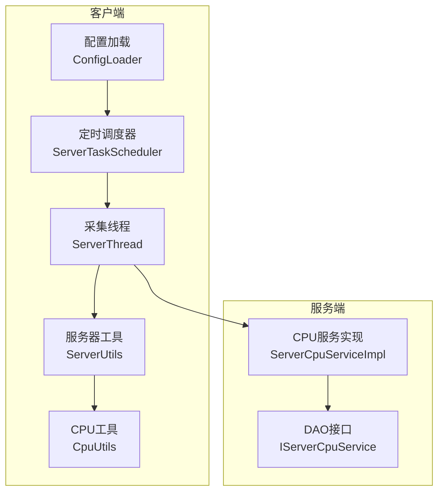
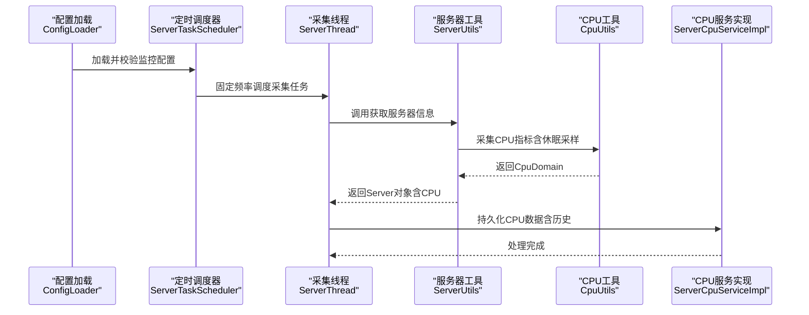
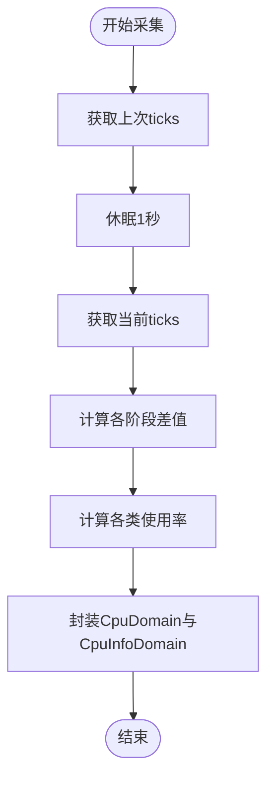
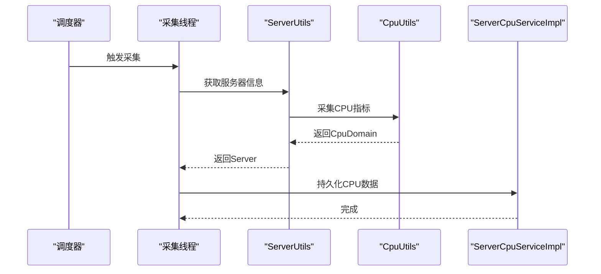
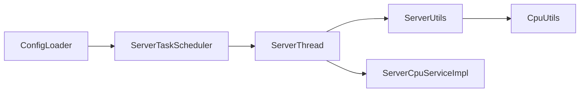

# CPU监控参数

<cite>
**本文引用的文件**
- [MonitoringServerCpuProperties.java](file://phoenix-common\phoenix-common-core\src\main\java\com\gitee\pifeng\monitoring\common\property\server\MonitoringServerCpuProperties.java)
- [MonitoringServerProperties.java](file://phoenix-common\phoenix-common-core\src\main\java\com\gitee\pifeng\monitoring\common\property\server\MonitoringServerProperties.java)
- [CpuDomain.java](file://phoenix-common\phoenix-common-core\src\main\java\com\gitee\pifeng\monitoring\common\domain\server\CpuDomain.java)
- [CpuUtils.java](file://phoenix-common\phoenix-common-core\src\main\java\com\gitee\pifeng\monitoring\common\util\server\oshi\CpuUtils.java)
- [ServerUtils.java](file://phoenix-common\phoenix-common-core\src\main\java\com\gitee\pifeng\monitoring\common\util\server\ServerUtils.java)
- [ServerTaskScheduler.java](file://phoenix-client\phoenix-client-core\src\main\java\com\gitee\pifeng\monitoring\plug\scheduler\ServerTaskScheduler.java)
- [ServerThread.java](file://phoenix-client\phoenix-client-core\src\main\java\com\gitee\pifeng\monitoring\plug\thread\ServerThread.java)
- [ServerCpuServiceImpl.java](file://phoenix-server\src\main\java\com\gitee\pifeng\monitoring\server\business\server\service\impl\ServerCpuServiceImpl.java)
- [IServerCpuService.java](file://phoenix-server\src\main\java\com\gitee\pifeng\monitoring\server\business\server\service\IServerCpuService.java)
- [monitoring-dev.properties](file://phoenix-server\src\main\resources\monitoring-dev.properties)
- [monitoring-prod.properties](file://phoenix-server\src\main\resources\monitoring-prod.properties)
- [ConfigLoader.java](file://phoenix-client\phoenix-client-core\src\main\java\com\gitee\pifeng\monitoring\plug\core\ConfigLoader.java)
</cite>

## 目录
1. [简介](#简介)
2. [项目结构](#项目结构)
3. [核心组件](#核心组件)
4. [架构总览](#架构总览)
5. [详细组件分析](#详细组件分析)
6. [依赖关系分析](#依赖关系分析)
7. [性能考量](#性能考量)
8. [故障排查指南](#故障排查指南)
9. [结论](#结论)
10. [附录](#附录)

## 简介
本文围绕Phoenix监控系统的CPU监控参数进行系统化配置与原理说明，重点聚焦于MonitoringServerCpuProperties类中的CPU监控核心配置项，包括：
- CPU使用率阈值设置
- 采样间隔与监控频率
- 核心数检测机制
- 不同操作系统下的CPU监控差异
- 最佳实践与参数调优建议
- 数据采集流程与处理机制

目标是帮助用户基于服务器规格与业务负载，合理配置CPU监控参数，平衡监控精度与系统开销。

## 项目结构
Phoenix监控系统采用“客户端采集 + 服务端存储”的分层架构。与CPU监控直接相关的模块分布如下：
- 客户端采集层：负责周期性采集CPU数据并封装为ServerPackage，定时发送至服务端
- 服务端存储层：接收CPU数据包，解析并持久化到数据库
- 工具与模型层：提供CPU域模型、OSHI/CPU工具类、服务器信息聚合工具

图表来源
- [ConfigLoader.java:57-59](file://phoenix-client\phoenix-client-core\src\main\java\com\gitee\pifeng\monitoring\plug\core\ConfigLoader.java#L57-L59)
- [ServerTaskScheduler.java:40-48](file://phoenix-client\phoenix-client-core\src\main\java\com\gitee\pifeng\monitoring\plug\scheduler\ServerTaskScheduler.java#L40-L48)
- [ServerThread.java:42-56](file://phoenix-client\phoenix-client-core\src\main\java\com\gitee\pifeng\monitoring\plug\thread\ServerThread.java#L42-L56)
- [ServerUtils.java:64-76](file://phoenix-common\phoenix-common-core\src\main\java\com\gitee\pifeng\monitoring\common\util\server\ServerUtils.java#L64-L76)
- [CpuUtils.java:33-93](file://phoenix-common\phoenix-common-core\src\main\java\com\gitee\pifeng\monitoring\common\util\server\oshi\CpuUtils.java#L33-L93)
- [ServerCpuServiceImpl.java:41-93](file://phoenix-server\src\main\java\com\gitee\pifeng\monitoring\server\business\server\service\impl\ServerCpuServiceImpl.java#L41-L93)
- [IServerCpuService.java:15-27](file://phoenix-server\src\main\java\com\gitee\pifeng\monitoring\server\business\server\service\IServerCpuService.java#L15-L27)

章节来源
- [ConfigLoader.java:57-59](file://phoenix-client\phoenix-client-core\src\main\java\com\gitee\pifeng\monitoring\plug\core\ConfigLoader.java#L57-L59)
- [ServerTaskScheduler.java:40-48](file://phoenix-client\phoenix-client-core\src\main\java\com\gitee\pifeng\monitoring\plug\scheduler\ServerTaskScheduler.java#L40-L48)
- [ServerThread.java:42-56](file://phoenix-client\phoenix-client-core\src\main\java\com\gitee\pifeng\monitoring\plug\thread\ServerThread.java#L42-L56)
- [ServerUtils.java:64-76](file://phoenix-common\phoenix-common-core\src\main\java\com\gitee\pifeng\monitoring\common\util\server\ServerUtils.java#L64-L76)
- [CpuUtils.java:33-93](file://phoenix-common\phoenix-common-core\src\main\java\com\gitee\pifeng\monitoring\common\util\server\oshi\CpuUtils.java#L33-L93)
- [ServerCpuServiceImpl.java:41-93](file://phoenix-server\src\main\java\com\gitee\pifeng\monitoring\server\business\server\service\impl\ServerCpuServiceImpl.java#L41-L93)
- [IServerCpuService.java:15-27](file://phoenix-server\src\main\java\com\gitee\pifeng\monitoring\server\business\server\service\IServerCpuService.java#L15-L27)

## 核心组件
本节聚焦CPU监控的关键配置与数据模型。

- MonitoringServerCpuProperties（CPU监控配置）
  - enable：是否启用CPU监控
  - alarmEnable：是否开启CPU过载告警
  - overloadThreshold：CPU使用率过载阈值（百分比）
  - levelEnum：告警示级（INFO < WARN < ERROR < FATAL）

- MonitoringServerProperties（服务器监控总开关）
  - 包含serverCpuProperties子配置，统一管理CPU监控开关与阈值

- CpuDomain（CPU域模型）
  - cpuNum：逻辑CPU核数
  - cpuList：每个逻辑CPU的指标集合，包含用户态、系统态、等待、空闲、综合使用率等

章节来源
- [MonitoringServerCpuProperties.java:20-42](file://phoenix-common\phoenix-common-core\src\main\java\com\gitee\pifeng\monitoring\common\property\server\MonitoringServerCpuProperties.java#L20-L42)
- [MonitoringServerProperties.java:19-51](file://phoenix-common\phoenix-common-core\src\main\java\com\gitee\pifeng\monitoring\common\property\server\MonitoringServerProperties.java#L19-L51)
- [CpuDomain.java:23-88](file://phoenix-common\phoenix-common-core\src\main\java\com\gitee\pifeng\monitoring\common\domain\server\CpuDomain.java#L23-L88)

## 架构总览
下图展示从配置加载到CPU数据采集、传输与入库的全链路：

图表来源
- [ConfigLoader.java:57-59](file://phoenix-client\phoenix-client-core\src\main\java\com\gitee\pifeng\monitoring\plug\core\ConfigLoader.java#L57-L59)
- [ServerTaskScheduler.java:40-48](file://phoenix-client\phoenix-client-core\src\main\java\com\gitee\pifeng\monitoring\plug\scheduler\ServerTaskScheduler.java#L40-L48)
- [ServerThread.java:42-56](file://phoenix-client\phoenix-client-core\src\main\java\com\gitee\pifeng\monitoring\plug\thread\ServerThread.java#L42-L56)
- [ServerUtils.java:64-76](file://phoenix-common\phoenix-common-core\src\main\java\com\gitee\pifeng\monitoring\common\util\server\ServerUtils.java#L64-L76)
- [CpuUtils.java:33-93](file://phoenix-common\phoenix-common-core\src\main\java\com\gitee\pifeng\monitoring\common\util\server\oshi\CpuUtils.java#L33-L93)
- [ServerCpuServiceImpl.java:41-93](file://phoenix-server\src\main\java\com\gitee\pifeng\monitoring\server\business\server\service\impl\ServerCpuServiceImpl.java#L41-L93)

## 详细组件分析

### CPU监控配置参数详解
- enable（是否启用CPU监控）
  - 影响采集线程是否参与CPU数据采集
  - 与serverInfo.enable共同决定是否发送服务器信息包

- alarmEnable（是否开启CPU过载告警）
  - 控制是否基于overloadThreshold触发告警

- overloadThreshold（CPU使用率阈值）
  - 单位为百分比，用于判断CPU是否处于过载状态
  - 与levelEnum配合决定告警示级

- levelEnum（告警示级）
  - 取值范围为INFO < WARN < ERROR < FATAL，用于区分告警严重程度

章节来源
- [MonitoringServerCpuProperties.java:20-42](file://phoenix-common\phoenix-common-core\src\main\java\com\gitee\pifeng\monitoring\common\property\server\MonitoringServerCpuProperties.java#L20-L42)
- [MonitoringServerProperties.java:19-51](file://phoenix-common\phoenix-common-core\src\main\java\com\gitee\pifeng\monitoring\common\property\server\MonitoringServerProperties.java#L19-L51)

### CPU使用率计算与采样机制
- 采样间隔
  - OSHI方式：CpuUtils在两次tick采样之间睡眠1秒，以计算CPU使用率
  - 该固定采样间隔确保使用率指标的可比性与稳定性

- 核心数检测
  - 通过OSHI获取逻辑CPU数量（logicalProcessorCount），作为cpuNum字段
  - 每个逻辑CPU生成独立的CpuInfoDomain条目

- 使用率构成
  - 用户态、系统态、等待、空闲、综合使用率等指标均按两次采样差值计算

图表来源
- [CpuUtils.java:33-93](file://phoenix-common\phoenix-common-core\src\main\java\com\gitee\pifeng\monitoring\common\util\server\oshi\CpuUtils.java#L33-L93)

章节来源
- [CpuUtils.java:33-93](file://phoenix-common\phoenix-common-core\src\main\java\com\gitee\pifeng\monitoring\common\util\server\oshi\CpuUtils.java#L33-L93)
- [CpuDomain.java:23-88](file://phoenix-common\phoenix-common-core\src\main\java\com\gitee\pifeng\monitoring\common\domain\server\CpuDomain.java#L23-L88)

### 监控频率与系统性能影响
- 采集频率
  - 服务器信息采集频率由serverInfo.rate控制（默认60秒，最小30秒）
  - 该频率同时影响CPU数据的采集周期

- 对系统性能的影响
  - 采样间隔固定为1秒，CPU使用率计算本身开销较小
  - 频率越低，采集压力越小；频率越高，实时性越好
  - 建议在高负载或资源紧张的服务器上适当降低频率

- 配置位置
  - 服务器端开发/生产配置文件中包含serverInfo.rate与serverInfo.enable等项

章节来源
- [ServerTaskScheduler.java:40-48](file://phoenix-client\phoenix-client-core\src\main\java\com\gitee\pifeng\monitoring\plug\scheduler\ServerTaskScheduler.java#L40-L48)
- [monitoring-dev.properties:30-33](file://phoenix-server\src\main\resources\monitoring-dev.properties#L30-L33)
- [monitoring-prod.properties:30-33](file://phoenix-server\src\main\resources\monitoring-prod.properties#L30-L33)

### 不同操作系统的CPU监控差异
- 采集方式选择
  - 通过serverInfo.user-sigar-enable控制使用Sigar或OSHI
  - 若启用Sigar，则优先使用Sigar采集CPU；否则使用OSHI

- OSHI方式
  - 通过OSHI硬件抽象层获取CPU指标，跨平台兼容性好
  - 依赖逻辑CPU数量与tick计数，适合通用场景

- Sigar方式
  - 通过Sigar底层系统接口采集，可能在特定平台表现更优
  - 需要额外依赖与平台支持

章节来源
- [ServerUtils.java:40-76](file://phoenix-common\phoenix-common-core\src\main\java\com\gitee\pifeng\monitoring\common\util\server\ServerUtils.java#L40-L76)
- [monitoring-dev.properties:36-37](file://phoenix-server\src\main\resources\monitoring-dev.properties#L36-L37)
- [monitoring-prod.properties:36-37](file://phoenix-server\src\main\resources\monitoring-prod.properties#L36-L37)

### 数据采集流程与处理机制
- 客户端采集
  - ConfigLoader加载配置后，ServerTaskScheduler按serverInfo.rate调度ServerThread
  - ServerThread调用ServerUtils获取服务器信息（含CPU），并通过Sender发送至服务端

- 服务端入库
  - ServerCpuServiceImpl接收ServerPackage，解析CpuDomain
  - 遍历每个逻辑CPU，查询是否存在对应记录；不存在则批量保存，存在则更新

图表来源
- [ServerTaskScheduler.java:40-48](file://phoenix-client\phoenix-client-core\src\main\java\com\gitee\pifeng\monitoring\plug\scheduler\ServerTaskScheduler.java#L40-L48)
- [ServerThread.java:42-56](file://phoenix-client\phoenix-client-core\src\main\java\com\gitee\pifeng\monitoring\plug\thread\ServerThread.java#L42-L56)
- [ServerUtils.java:64-76](file://phoenix-common\phoenix-common-core\src\main\java\com\gitee\pifeng\monitoring\common\util\server\ServerUtils.java#L64-L76)
- [CpuUtils.java:33-93](file://phoenix-common\phoenix-common-core\src\main\java\com\gitee\pifeng\monitoring\common\util\server\oshi\CpuUtils.java#L33-L93)
- [ServerCpuServiceImpl.java:41-93](file://phoenix-server\src\main\java\com\gitee\pifeng\monitoring\server\business\server\service\impl\ServerCpuServiceImpl.java#L41-L93)

章节来源
- [ServerThread.java:42-77](file://phoenix-client\phoenix-client-core\src\main\java\com\gitee\pifeng\monitoring\plug\thread\ServerThread.java#L42-L77)
- [ServerCpuServiceImpl.java:41-93](file://phoenix-server\src\main\java\com\gitee\pifeng\monitoring\server\business\server\service\impl\ServerCpuServiceImpl.java#L41-L93)

## 依赖关系分析
- 配置依赖
  - ConfigLoader负责解析monitoring.properties中的serverInfo与jvmInfo等配置项
  - serverInfo.enable与serverInfo.rate直接影响CPU数据采集的启停与频率

- 工具依赖
  - ServerUtils根据user-sigar-enable选择Sigar或OSHI路径
  - CpuUtils依赖OSHI进行tick采样与使用率计算

- 存储依赖
  - ServerCpuServiceImpl依赖MonitorServerCpu实体与DAO接口进行数据持久化

图表来源
- [ConfigLoader.java:57-59](file://phoenix-client\phoenix-client-core\src\main\java\com\gitee\pifeng\monitoring\plug\core\ConfigLoader.java#L57-L59)
- [ServerTaskScheduler.java:40-48](file://phoenix-client\phoenix-client-core\src\main\java\com\gitee\pifeng\monitoring\plug\scheduler\ServerTaskScheduler.java#L40-L48)
- [ServerThread.java:42-56](file://phoenix-client\phoenix-client-core\src\main\java\com\gitee\pifeng\monitoring\plug\thread\ServerThread.java#L42-L56)
- [ServerUtils.java:64-76](file://phoenix-common\phoenix-common-core\src\main\java\com\gitee\pifeng\monitoring\common\util\server\ServerUtils.java#L64-L76)
- [CpuUtils.java:33-93](file://phoenix-common\phoenix-common-core\src\main\java\com\gitee\pifeng\monitoring\common\util\server\oshi\CpuUtils.java#L33-L93)
- [ServerCpuServiceImpl.java:41-93](file://phoenix-server\src\main\java\com\gitee\pifeng\monitoring\server\business\server\service\impl\ServerCpuServiceImpl.java#L41-L93)

章节来源
- [ConfigLoader.java:57-59](file://phoenix-client\phoenix-client-core\src\main\java\com\gitee\pifeng\monitoring\plug\core\ConfigLoader.java#L57-L59)
- [ServerTaskScheduler.java:40-48](file://phoenix-client\phoenix-client-core\src\main\java\com\gitee\pifeng\monitoring\plug\scheduler\ServerTaskScheduler.java#L40-L48)
- [ServerThread.java:42-56](file://phoenix-client\phoenix-client-core\src\main\java\com\gitee\pifeng\monitoring\plug\thread\ServerThread.java#L42-L56)
- [ServerUtils.java:64-76](file://phoenix-common\phoenix-common-core\src\main\java\com\gitee\pifeng\monitoring\common\util\server\ServerUtils.java#L64-L76)
- [CpuUtils.java:33-93](file://phoenix-common\phoenix-common-core\src\main\java\com\gitee\pifeng\monitoring\common\util\server\oshi\CpuUtils.java#L33-L93)
- [ServerCpuServiceImpl.java:41-93](file://phoenix-server\src\main\java\com\gitee\pifeng\monitoring\server\business\server\service\impl\ServerCpuServiceImpl.java#L41-L93)

## 性能考量
- 采样开销
  - OSHI采样固定1秒间隔，计算量小，对CPU使用率影响极低
- 频率权衡
  - 高频采集提升实时性但增加网络与存储压力
  - 低频采集降低压力但可能错过短期峰值
- 平台差异
  - OSHI跨平台兼容性更好；Sigar在某些平台可能更高效
- 建议
  - 生产环境建议serverInfo.rate≥60秒，避免过度采集
  - 在高并发或资源紧张场景，可适度提高频率间隔

## 故障排查指南
- 告警未触发
  - 检查alarmEnable与overloadThreshold配置是否正确
  - 确认levelEnum与告警规则匹配

- CPU数据缺失
  - 确认serverInfo.enable已开启
  - 检查serverInfo.rate是否低于最小限制（30秒）

- 采集异常
  - 查看ServerThread日志中的耗时统计与异常栈
  - 确认OSHI/Sigar依赖是否可用

章节来源
- [ServerThread.java:64-77](file://phoenix-client\phoenix-client-core\src\main\java\com\gitee\pifeng\monitoring\plug\thread\ServerThread.java#L64-L77)
- [ConfigLoader.java:570-580](file://phoenix-client\phoenix-client-core\src\main\java\com\gitee\pifeng\monitoring\plug\core\ConfigLoader.java#L570-L580)

## 结论
- MonitoringServerCpuProperties提供了CPU监控的三大关键参数：开关、告警开关、过载阈值与告警示级
- 采样机制采用固定1秒间隔的OSHI/tick方式，确保使用率指标稳定
- 监控频率由serverInfo.rate控制，需在实时性与系统开销间取得平衡
- 建议结合业务负载与服务器规格，合理设置频率与阈值，以获得最佳监控效果

## 附录
- 关键配置项参考
  - serverInfo.enable：是否采集服务器信息
  - serverInfo.rate：采集频率（秒）
  - serverInfo.user-sigar-enable：是否使用Sigar采集
  - serverCpuProperties.enable/alarmEnable/overloadThreshold/levelEnum：CPU监控相关配置

章节来源
- [monitoring-dev.properties:30-37](file://phoenix-server\src\main\resources\monitoring-dev.properties#L30-L37)
- [monitoring-prod.properties:30-37](file://phoenix-server\src\main\resources\monitoring-prod.properties#L30-L37)
- [MonitoringServerCpuProperties.java:20-42](file://phoenix-common\phoenix-common-core\src\main\java\com\gitee\pifeng\monitoring\common\property\server\MonitoringServerCpuProperties.java#L20-L42)