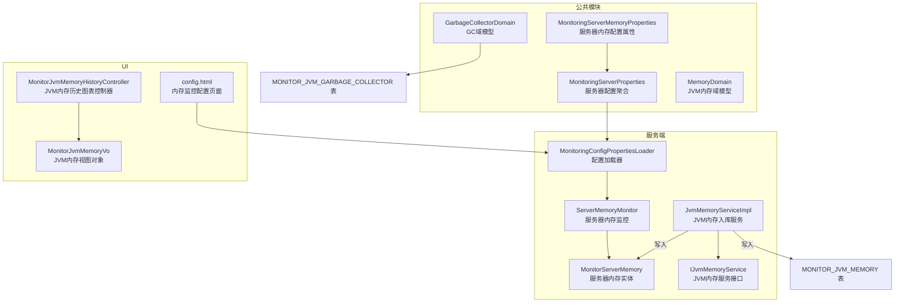
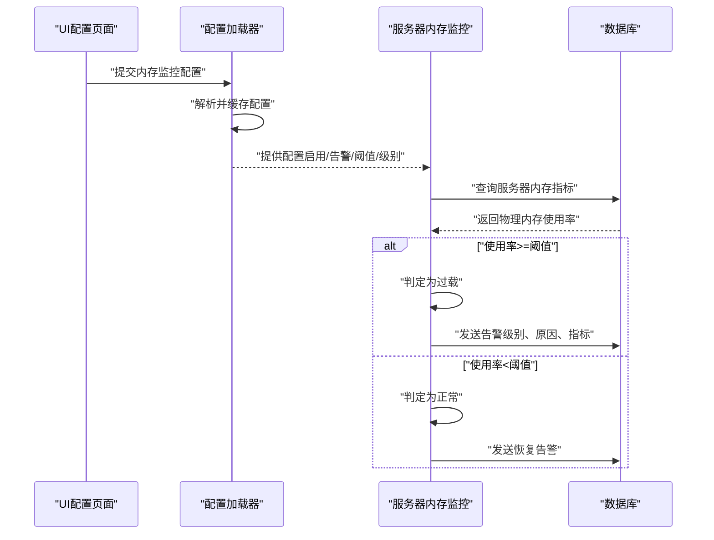
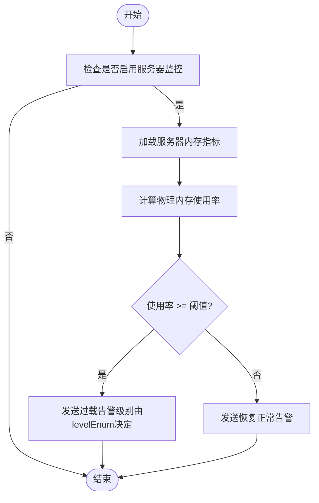
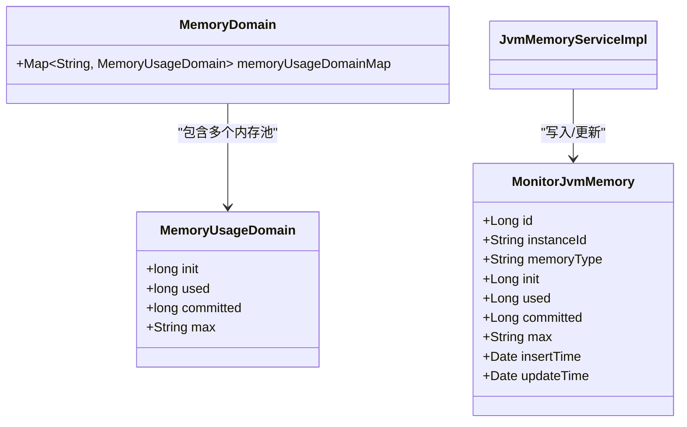
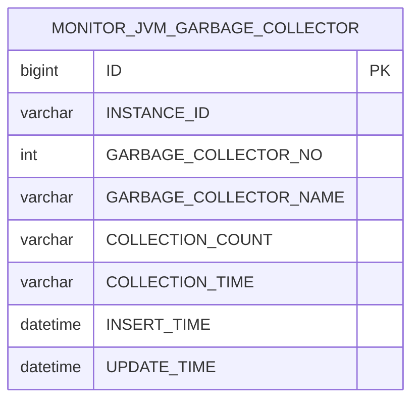
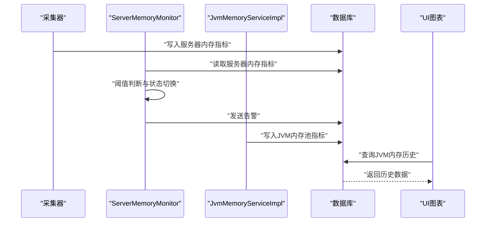
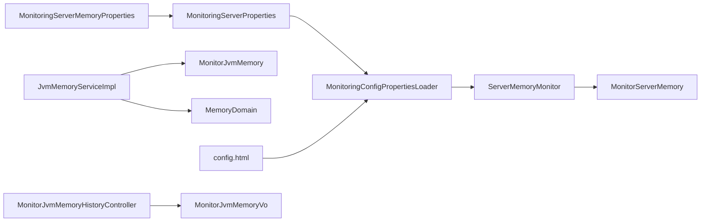

# 内存监控参数

<cite>
**本文引用的文件**
- [MonitoringServerMemoryProperties.java](file://phoenix-common/phoenix-common-core/src/main/java/com/gitee/pifeng/monitoring/common/property/server/MonitoringServerMemoryProperties.java)
- [MonitoringServerProperties.java](file://phoenix-common/phoenix-common-core/src/main/java/com/gitee/pifeng/monitoring/common/property/server/MonitoringServerProperties.java)
- [MonitoringConfigPropertiesLoader.java](file://phoenix-server/src/main/java/com/gitee/pifeng/monitoring/server/business/server/core/MonitoringConfigPropertiesLoader.java)
- [ServerMemoryMonitor.java](file://phoenix-server/src/main/java/com/gitee/pifeng/monitoring/server/business/server/monitor/server/ServerMemoryMonitor.java)
- [MonitorServerMemory.java](file://phoenix-server/src/main/java/com/gitee/pifeng/monitoring/server/business/server/entity/MonitorServerMemory.java)
- [JvmMemoryServiceImpl.java](file://phoenix-server/src/main/java/com/gitee/pifeng/monitoring/server/business/server/service/impl/JvmMemoryServiceImpl.java)
- [IJvmMemoryService.java](file://phoenix-server/src/main/java/com/gitee/pifeng/monitoring/server/business/server/service/IJvmMemoryService.java)
- [MemoryDomain.java](file://phoenix-common/phoenix-common-core/src/main/java/com/gitee/pifeng/monitoring/common/domain/jvm/MemoryDomain.java)
- [GarbageCollectorDomain.java](file://phoenix-common/phoenix-common-core/src/main/java/com/gitee/pifeng/monitoring/common/domain/jvm/GarbageCollectorDomain.java)
- [MonitorJvmMemory.java](file://phoenix-server/src/main/java/com/gitee/pifeng/monitoring/server/business/server/entity/MonitorJvmMemory.java)
- [MonitorJvmMemoryVo.java](file://phoenix-ui/src/main/java/com/gitee/pifeng/monitoring/ui/business/web/vo/MonitorJvmMemoryVo.java)
- [MonitorJvmMemoryHistoryController.java](file://phoenix-ui/src/main/java/com/gitee/pifeng/monitoring/ui/business/web/controller/MonitorJvmMemoryHistoryController.java)
- [config.html](file://phoenix-ui/src/main/resources/templates/set/config.html)
- [phoenix.sql](file://doc/数据库设计/sql/mysql/phoenix.sql)
</cite>

## 目录
1. [简介](#简介)
2. [项目结构](#项目结构)
3. [核心组件](#核心组件)
4. [架构总览](#架构总览)
5. [详细组件分析](#详细组件分析)
6. [依赖关系分析](#依赖关系分析)
7. [性能考量](#性能考量)
8. [故障排查指南](#故障排查指南)
9. [结论](#结论)
10. [附录](#附录)

## 简介
本文件面向Phoenix监控系统中“内存监控参数”的配置与使用，围绕MonitoringServerMemoryProperties类展开，系统化说明以下内容：
- 服务器内存监控的关键参数：启用开关、告警开关、过载阈值、告警级别
- 内存监控工作原理：物理内存使用率计算、阈值比较、异常/正常状态切换与告警发送
- JVM内存堆栈监控策略：按内存池类型采集、入库与历史对比
- 垃圾回收监控配置：GC次数与耗时统计的采集与存储
- 参数配置指南：不同场景下的阈值建议、监控频率优化、内存密集型应用的特殊配置
- 数据采集与处理流程：从采集到入库、从入库到告警的完整链路

## 项目结构
Phoenix监控系统在“服务端”和“公共模块”中分别实现了内存监控的配置、采集、存储与告警逻辑，并通过UI提供可视化配置入口。

**图表来源**
- [MonitoringServerMemoryProperties.java:1-43](file://phoenix-common/phoenix-common-core/src/main/java/com/gitee/pifeng/monitoring/common/property/server/MonitoringServerMemoryProperties.java#L1-L43)
- [MonitoringServerProperties.java:1-52](file://phoenix-common/phoenix-common-core/src/main/java/com/gitee/pifeng/monitoring/common/property/server/MonitoringServerProperties.java#L1-L52)
- [MonitoringConfigPropertiesLoader.java:1-203](file://phoenix-server/src/main/java/com/gitee/pifeng/monitoring/server/business/server/core/MonitoringConfigPropertiesLoader.java#L1-L203)
- [ServerMemoryMonitor.java:1-238](file://phoenix-server/src/main/java/com/gitee/pifeng/monitoring/server/business/server/monitor/server/ServerMemoryMonitor.java#L1-L238)
- [MonitorServerMemory.java:1-102](file://phoenix-server/src/main/java/com/gitee/pifeng/monitoring/server/business/server/entity/MonitorServerMemory.java#L1-L102)
- [JvmMemoryServiceImpl.java:1-95](file://phoenix-server/src/main/java/com/gitee/pifeng/monitoring/server/business/server/service/impl/JvmMemoryServiceImpl.java#L1-L95)
- [IJvmMemoryService.java:1-29](file://phoenix-server/src/main/java/com/gitee/pifeng/monitoring/server/business/server/service/IJvmMemoryService.java#L1-L29)
- [MemoryDomain.java:1-65](file://phoenix-common/phoenix-common-core/src/main/java/com/gitee/pifeng/monitoring/common/domain/jvm/MemoryDomain.java#L1-L65)
- [GarbageCollectorDomain.java:1-66](file://phoenix-common/phoenix-common-core/src/main/java/com/gitee/pifeng/monitoring/common/domain/jvm/GarbageCollectorDomain.java#L1-L66)
- [config.html:572-585](file://phoenix-ui/src/main/resources/templates/set/config.html#L572-L585)
- [MonitorJvmMemoryHistoryController.java:30-53](file://phoenix-ui/src/main/java/com/gitee/pifeng/monitoring/ui/business/web/controller/MonitorJvmMemoryHistoryController.java#L30-L53)
- [MonitorJvmMemoryVo.java:45-87](file://phoenix-ui/src/main/java/com/gitee/pifeng/monitoring/ui/business/web/vo/MonitorJvmMemoryVo.java#L45-L87)
- [phoenix.sql:329-361](file://doc/数据库设计/sql/mysql/phoenix.sql#L329-L361)

**章节来源**
- [MonitoringServerMemoryProperties.java:1-43](file://phoenix-common/phoenix-common-core/src/main/java/com/gitee/pifeng/monitoring/common/property/server/MonitoringServerMemoryProperties.java#L1-L43)
- [MonitoringServerProperties.java:1-52](file://phoenix-common/phoenix-common-core/src/main/java/com/gitee/pifeng/monitoring/common/property/server/MonitoringServerProperties.java#L1-L52)
- [MonitoringConfigPropertiesLoader.java:1-203](file://phoenix-server/src/main/java/com/gitee/pifeng/monitoring/server/business/server/core/MonitoringConfigPropertiesLoader.java#L1-L203)
- [ServerMemoryMonitor.java:1-238](file://phoenix-server/src/main/java/com/gitee/pifeng/monitoring/server/business/server/monitor/server/ServerMemoryMonitor.java#L1-L238)
- [MonitorServerMemory.java:1-102](file://phoenix-server/src/main/java/com/gitee/pifeng/monitoring/server/business/server/entity/MonitorServerMemory.java#L1-L102)
- [JvmMemoryServiceImpl.java:1-95](file://phoenix-server/src/main/java/com/gitee/pifeng/monitoring/server/business/server/service/impl/JvmMemoryServiceImpl.java#L1-L95)
- [IJvmMemoryService.java:1-29](file://phoenix-server/src/main/java/com/gitee/pifeng/monitoring/server/business/server/service/IJvmMemoryService.java#L1-L29)
- [MemoryDomain.java:1-65](file://phoenix-common/phoenix-common-core/src/main/java/com/gitee/pifeng/monitoring/common/domain/jvm/MemoryDomain.java#L1-L65)
- [GarbageCollectorDomain.java:1-66](file://phoenix-common/phoenix-common-core/src/main/java/com/gitee/pifeng/monitoring/common/domain/jvm/GarbageCollectorDomain.java#L1-L66)
- [config.html:572-585](file://phoenix-ui/src/main/resources/templates/set/config.html#L572-L585)
- [MonitorJvmMemoryHistoryController.java:30-53](file://phoenix-ui/src/main/java/com/gitee/pifeng/monitoring/ui/business/web/controller/MonitorJvmMemoryHistoryController.java#L30-L53)
- [MonitorJvmMemoryVo.java:45-87](file://phoenix-ui/src/main/java/com/gitee/pifeng/monitoring/ui/business/web/vo/MonitorJvmMemoryVo.java#L45-L87)
- [phoenix.sql:329-361](file://doc/数据库设计/sql/mysql/phoenix.sql#L329-L361)

## 核心组件
- MonitoringServerMemoryProperties：服务器内存监控的核心配置对象，包含启用开关、告警开关、过载阈值、告警级别四个字段。
- MonitoringServerProperties：服务器监控配置聚合对象，其中包含serverMemoryProperties作为子配置。
- MonitoringConfigPropertiesLoader：负责从数据库加载并缓存监控配置，支持定时刷新，默认提供内存监控的默认配置。
- ServerMemoryMonitor：服务器内存监控执行器，基于配置进行物理内存使用率判断、异常/正常状态切换与告警发送。
- MonitorServerMemory：服务器内存数据库实体，存储物理内存总量、使用量、使用率及交换区相关指标。
- JvmMemoryServiceImpl：JVM内存监控入库服务，按内存池类型写入MONITOR_JVM_MEMORY表。
- MemoryDomain：JVM内存域模型，包含不同内存池的使用量信息。
- GarbageCollectorDomain：GC域模型，包含各内存管理器的GC次数与耗时。
- UI相关：config.html提供内存监控参数配置界面；MonitorJvmMemoryHistoryController与MonitorJvmMemoryVo用于JVM内存历史图表展示与数据转换。

**章节来源**
- [MonitoringServerMemoryProperties.java:1-43](file://phoenix-common/phoenix-common-core/src/main/java/com/gitee/pifeng/monitoring/common/property/server/MonitoringServerMemoryProperties.java#L1-L43)
- [MonitoringServerProperties.java:1-52](file://phoenix-common/phoenix-common-core/src/main/java/com/gitee/pifeng/monitoring/common/property/server/MonitoringServerProperties.java#L1-L52)
- [MonitoringConfigPropertiesLoader.java:157-167](file://phoenix-server/src/main/java/com/gitee/pifeng/monitoring/server/business/server/core/MonitoringConfigPropertiesLoader.java#L157-L167)
- [ServerMemoryMonitor.java:82-127](file://phoenix-server/src/main/java/com/gitee/pifeng/monitoring/server/business/server/monitor/server/ServerMemoryMonitor.java#L82-L127)
- [MonitorServerMemory.java:26-102](file://phoenix-server/src/main/java/com/gitee/pifeng/monitoring/server/business/server/entity/MonitorServerMemory.java#L26-L102)
- [JvmMemoryServiceImpl.java:42-92](file://phoenix-server/src/main/java/com/gitee/pifeng/monitoring/server/business/server/service/impl/JvmMemoryServiceImpl.java#L42-L92)
- [MemoryDomain.java:24-65](file://phoenix-common/phoenix-common-core/src/main/java/com/gitee/pifeng/monitoring/common/domain/jvm/MemoryDomain.java#L24-L65)
- [GarbageCollectorDomain.java:24-66](file://phoenix-common/phoenix-common-core/src/main/java/com/gitee/pifeng/monitoring/common/domain/jvm/GarbageCollectorDomain.java#L24-L66)
- [config.html:572-585](file://phoenix-ui/src/main/resources/templates/set/config.html#L572-L585)
- [MonitorJvmMemoryHistoryController.java:30-53](file://phoenix-ui/src/main/java/com/gitee/pifeng/monitoring/ui/business/web/controller/MonitorJvmMemoryHistoryController.java#L30-L53)
- [MonitorJvmMemoryVo.java:45-87](file://phoenix-ui/src/main/java/com/gitee/pifeng/monitoring/ui/business/web/vo/MonitorJvmMemoryVo.java#L45-L87)

## 架构总览
下图展示了内存监控从配置到采集、入库、告警的总体流程。

**图表来源**
- [MonitoringConfigPropertiesLoader.java:197-200](file://phoenix-server/src/main/java/com/gitee/pifeng/monitoring/server/business/server/core/MonitoringConfigPropertiesLoader.java#L197-L200)
- [ServerMemoryMonitor.java:82-127](file://phoenix-server/src/main/java/com/gitee/pifeng/monitoring/server/business/server/monitor/server/ServerMemoryMonitor.java#L82-L127)
- [MonitorServerMemory.java:26-102](file://phoenix-server/src/main/java/com/gitee/pifeng/monitoring/server/business/server/entity/MonitorServerMemory.java#L26-L102)

## 详细组件分析

### MonitoringServerMemoryProperties：内存监控参数详解
- enable：是否启用服务器内存监控。关闭后不会进行任何内存监控与告警。
- alarmEnable：是否启用告警。即使监控启用，若告警关闭也不会发送告警。
- overloadThreshold：过载阈值（百分比）。当物理内存使用率≥该阈值时触发过载告警。
- levelEnum：告警级别。用于区分告警严重程度（如INFO/WARN/ERROR/FATAL）。

这些参数通过MonitoringConfigPropertiesLoader在系统启动时加载默认配置，并支持定时刷新以动态调整。

**章节来源**
- [MonitoringServerMemoryProperties.java:22-41](file://phoenix-common/phoenix-common-core/src/main/java/com/gitee/pifeng/monitoring/common/property/server/MonitoringServerMemoryProperties.java#L22-L41)
- [MonitoringConfigPropertiesLoader.java:162-163](file://phoenix-server/src/main/java/com/gitee/pifeng/monitoring/server/business/server/core/MonitoringConfigPropertiesLoader.java#L162-L163)

### 服务器内存监控工作原理
- 物理内存监控：从MonitorServerMemory读取menUsedPercent（使用率）、menTotal（总量）、menUsed（使用量），并与overloadThreshold比较。
- 异常/正常状态切换：使用率≥阈值为过载，否则为正常；分别发送“过载”或“恢复正常”告警。
- 告警控制：需同时满足“监控启用”和“告警启用”，且目标服务器处于“允许告警”状态才发送告警。
- 告警级别：由levelEnum指定，用于后续告警渠道与处理策略。

**图表来源**
- [ServerMemoryMonitor.java:82-127](file://phoenix-server/src/main/java/com/gitee/pifeng/monitoring/server/business/server/monitor/server/ServerMemoryMonitor.java#L82-L127)
- [MonitorServerMemory.java:44-63](file://phoenix-server/src/main/java/com/gitee/pifeng/monitoring/server/business/server/entity/MonitorServerMemory.java#L44-L63)

**章节来源**
- [ServerMemoryMonitor.java:82-127](file://phoenix-server/src/main/java/com/gitee/pifeng/monitoring/server/business/server/monitor/server/ServerMemoryMonitor.java#L82-L127)
- [MonitorServerMemory.java:44-63](file://phoenix-server/src/main/java/com/gitee/pifeng/monitoring/server/business/server/entity/MonitorServerMemory.java#L44-L63)

### JVM内存堆栈监控策略
- 数据模型：MemoryDomain包含不同内存池的使用量映射，每个内存池包含init/used/committed/max等字段。
- 入库策略：JvmMemoryServiceImpl按instanceId与memoryType进行去重，首次插入新增时间，重复则更新时间。
- 存储表：MONITOR_JVM_MEMORY表记录JVM内存池的初始量、使用量、提交量与最大量，便于历史趋势分析与异常定位。

**图表来源**
- [MemoryDomain.java:24-65](file://phoenix-common/phoenix-common-core/src/main/java/com/gitee/pifeng/monitoring/common/domain/jvm/MemoryDomain.java#L24-L65)
- [JvmMemoryServiceImpl.java:42-92](file://phoenix-server/src/main/java/com/gitee/pifeng/monitoring/server/business/server/service/impl/JvmMemoryServiceImpl.java#L42-L92)
- [MonitorJvmMemory.java:27-64](file://phoenix-server/src/main/java/com/gitee/pifeng/monitoring/server/business/server/entity/MonitorJvmMemory.java#L27-L64)
- [phoenix.sql:352-361](file://doc/数据库设计/sql/mysql/phoenix.sql#L352-L361)

**章节来源**
- [MemoryDomain.java:24-65](file://phoenix-common/phoenix-common-core/src/main/java/com/gitee/pifeng/monitoring/common/domain/jvm/MemoryDomain.java#L24-L65)
- [JvmMemoryServiceImpl.java:42-92](file://phoenix-server/src/main/java/com/gitee/pifeng/monitoring/server/business/server/service/impl/JvmMemoryServiceImpl.java#L42-L92)
- [MonitorJvmMemory.java:27-64](file://phoenix-server/src/main/java/com/gitee/pifeng/monitoring/server/business/server/entity/MonitorJvmMemory.java#L27-L64)
- [phoenix.sql:352-361](file://doc/数据库设计/sql/mysql/phoenix.sql#L352-L361)

### 垃圾回收监控配置
- 数据模型：GarbageCollectorDomain包含多个内存管理器的GC信息，包括collectionCount（总次数）与collectionTime（总耗时，毫秒）。
- 入库策略：按instanceId与内存管理器名称去重，首次插入新增时间，重复则更新时间。
- 存储表：MONITOR_JVM_GARBAGE_COLLECTOR表记录GC统计，用于分析GC行为与潜在内存问题。

**图表来源**
- [GarbageCollectorDomain.java:24-66](file://phoenix-common/phoenix-common-core/src/main/java/com/gitee/pifeng/monitoring/common/domain/jvm/GarbageCollectorDomain.java#L24-L66)
- [phoenix.sql:331-347](file://doc/数据库设计/sql/mysql/phoenix.sql#L331-L347)

**章节来源**
- [GarbageCollectorDomain.java:24-66](file://phoenix-common/phoenix-common-core/src/main/java/com/gitee/pifeng/monitoring/common/domain/jvm/GarbageCollectorDomain.java#L24-L66)
- [phoenix.sql:331-347](file://doc/数据库设计/sql/mysql/phoenix.sql#L331-L347)

### 内存监控参数配置指南
- 启用开关（enable）：建议在生产环境默认开启，以便及时发现内存压力。
- 告警开关（alarmEnable）：建议与业务SLA匹配，避免误报干扰。
- 过载阈值（overloadThreshold）：通用建议为80%-90%，具体需结合服务器规格与业务峰值波动调整。
- 告警级别（levelEnum）：建议将INFO用于轻度压力，WARN用于中度压力，ERROR用于重度压力，FATAL用于极端情况。
- 监控频率优化：默认配置为每5分钟刷新一次配置，可根据业务需求调整定时任务周期。
- 内存密集型应用：可适当降低阈值（如75%-85%）并提高告警级别，同时关注JVM内存池与GC指标联动。

**章节来源**
- [MonitoringConfigPropertiesLoader.java:162-163](file://phoenix-server/src/main/java/com/gitee/pifeng/monitoring/server/business/server/core/MonitoringConfigPropertiesLoader.java#L162-L163)
- [config.html:572-585](file://phoenix-ui/src/main/resources/templates/set/config.html#L572-L585)

### 内存监控数据采集与处理流程
- 采集：通过OSHI等底层库采集物理内存指标，封装为MonitorServerMemory。
- 入库：ServerMemoryMonitor读取指标并进行阈值判断；JvmMemoryServiceImpl按内存池类型写入MONITOR_JVM_MEMORY。
- 告警：根据配置与状态变化发送告警，支持多种告警级别与原因枚举。
- 可视化：UI通过MonitorJvmMemoryHistoryController与MonitorJvmMemoryVo提供历史图表与数据展示。

**图表来源**
- [ServerMemoryMonitor.java:82-127](file://phoenix-server/src/main/java/com/gitee/pifeng/monitoring/server/business/server/monitor/server/ServerMemoryMonitor.java#L82-L127)
- [JvmMemoryServiceImpl.java:42-92](file://phoenix-server/src/main/java/com/gitee/pifeng/monitoring/server/business/server/service/impl/JvmMemoryServiceImpl.java#L42-L92)
- [MonitorJvmMemoryHistoryController.java:30-53](file://phoenix-ui/src/main/java/com/gitee/pifeng/monitoring/ui/business/web/controller/MonitorJvmMemoryHistoryController.java#L30-L53)
- [MonitorJvmMemoryVo.java:45-87](file://phoenix-ui/src/main/java/com/gitee/pifeng/monitoring/ui/business/web/vo/MonitorJvmMemoryVo.java#L45-L87)

**章节来源**
- [ServerMemoryMonitor.java:82-127](file://phoenix-server/src/main/java/com/gitee/pifeng/monitoring/server/business/server/monitor/server/ServerMemoryMonitor.java#L82-L127)
- [JvmMemoryServiceImpl.java:42-92](file://phoenix-server/src/main/java/com/gitee/pifeng/monitoring/server/business/server/service/impl/JvmMemoryServiceImpl.java#L42-L92)
- [MonitorJvmMemoryHistoryController.java:30-53](file://phoenix-ui/src/main/java/com/gitee/pifeng/monitoring/ui/business/web/controller/MonitorJvmMemoryHistoryController.java#L30-L53)
- [MonitorJvmMemoryVo.java:45-87](file://phoenix-ui/src/main/java/com/gitee/pifeng/monitoring/ui/business/web/vo/MonitorJvmMemoryVo.java#L45-L87)

## 依赖关系分析
- MonitoringServerMemoryProperties被MonitoringServerProperties聚合，再由MonitoringConfigPropertiesLoader统一加载与刷新。
- ServerMemoryMonitor依赖配置加载器获取阈值与级别，并依赖数据库实体MonitorServerMemory进行指标读取。
- JvmMemoryServiceImpl依赖MemoryDomain与MonitorJvmMemory进行JVM内存池指标的入库与更新。
- UI通过config.html与MonitorJvmMemoryHistoryController对接配置与历史数据。

**图表来源**
- [MonitoringServerMemoryProperties.java:1-43](file://phoenix-common/phoenix-common-core/src/main/java/com/gitee/pifeng/monitoring/common/property/server/MonitoringServerMemoryProperties.java#L1-L43)
- [MonitoringServerProperties.java:1-52](file://phoenix-common/phoenix-common-core/src/main/java/com/gitee/pifeng/monitoring/common/property/server/MonitoringServerProperties.java#L1-L52)
- [MonitoringConfigPropertiesLoader.java:1-203](file://phoenix-server/src/main/java/com/gitee/pifeng/monitoring/server/business/server/core/MonitoringConfigPropertiesLoader.java#L1-L203)
- [ServerMemoryMonitor.java:1-238](file://phoenix-server/src/main/java/com/gitee/pifeng/monitoring/server/business/server/monitor/server/ServerMemoryMonitor.java#L1-L238)
- [MonitorServerMemory.java:1-102](file://phoenix-server/src/main/java/com/gitee/pifeng/monitoring/server/business/server/entity/MonitorServerMemory.java#L1-L102)
- [JvmMemoryServiceImpl.java:1-95](file://phoenix-server/src/main/java/com/gitee/pifeng/monitoring/server/business/server/service/impl/JvmMemoryServiceImpl.java#L1-L95)
- [MonitorJvmMemory.java:1-64](file://phoenix-server/src/main/java/com/gitee/pifeng/monitoring/server/business/server/entity/MonitorJvmMemory.java#L1-L64)
- [MemoryDomain.java:1-65](file://phoenix-common/phoenix-common-core/src/main/java/com/gitee/pifeng/monitoring/common/domain/jvm/MemoryDomain.java#L1-L65)
- [config.html:572-585](file://phoenix-ui/src/main/resources/templates/set/config.html#L572-L585)
- [MonitorJvmMemoryHistoryController.java:30-53](file://phoenix-ui/src/main/java/com/gitee/pifeng/monitoring/ui/business/web/controller/MonitorJvmMemoryHistoryController.java#L30-L53)
- [MonitorJvmMemoryVo.java:45-87](file://phoenix-ui/src/main/java/com/gitee/pifeng/monitoring/ui/business/web/vo/MonitorJvmMemoryVo.java#L45-L87)

**章节来源**
- [MonitoringServerMemoryProperties.java:1-43](file://phoenix-common/phoenix-common-core/src/main/java/com/gitee/pifeng/monitoring/common/property/server/MonitoringServerMemoryProperties.java#L1-L43)
- [MonitoringServerProperties.java:1-52](file://phoenix-common/phoenix-common-core/src/main/java/com/gitee/pifeng/monitoring/common/property/server/MonitoringServerProperties.java#L1-L52)
- [MonitoringConfigPropertiesLoader.java:1-203](file://phoenix-server/src/main/java/com/gitee/pifeng/monitoring/server/business/server/core/MonitoringConfigPropertiesLoader.java#L1-L203)
- [ServerMemoryMonitor.java:1-238](file://phoenix-server/src/main/java/com/gitee/pifeng/monitoring/server/business/server/monitor/server/ServerMemoryMonitor.java#L1-L238)
- [MonitorServerMemory.java:1-102](file://phoenix-server/src/main/java/com/gitee/pifeng/monitoring/server/business/server/entity/MonitorServerMemory.java#L1-L102)
- [JvmMemoryServiceImpl.java:1-95](file://phoenix-server/src/main/java/com/gitee/pifeng/monitoring/server/business/server/service/impl/JvmMemoryServiceImpl.java#L1-L95)
- [MonitorJvmMemory.java:1-64](file://phoenix-server/src/main/java/com/gitee/pifeng/monitoring/server/business/server/entity/MonitorJvmMemory.java#L1-L64)
- [MemoryDomain.java:1-65](file://phoenix-common/phoenix-common-core/src/main/java/com/gitee/pifeng/monitoring/common/domain/jvm/MemoryDomain.java#L1-L65)
- [config.html:572-585](file://phoenix-ui/src/main/resources/templates/set/config.html#L572-L585)
- [MonitorJvmMemoryHistoryController.java:30-53](file://phoenix-ui/src/main/java/com/gitee/pifeng/monitoring/ui/business/web/controller/MonitorJvmMemoryHistoryController.java#L30-L53)
- [MonitorJvmMemoryVo.java:45-87](file://phoenix-ui/src/main/java/com/gitee/pifeng/monitoring/ui/business/web/vo/MonitorJvmMemoryVo.java#L45-L87)

## 性能考量
- 配置刷新频率：默认每5分钟刷新一次配置，兼顾实时性与系统开销。
- JVM内存入库策略：采用按类型去重与批量插入/更新，减少数据库写放大。
- 告警发送控制：需同时满足监控与告警双开关，避免无效告警风暴。
- 监控粒度：服务器内存使用率与JVM内存池指标可并行采集，降低单点瓶颈。

## 故障排查指南
- 配置未生效：确认MonitoringConfigPropertiesLoader是否成功加载默认配置或数据库配置，并检查定时刷新任务是否运行。
- 告警未发送：检查enable/alarmEnable、服务器允许告警标志位、以及告警级别与原因枚举是否正确。
- 内存指标异常：核对MonitorServerMemory字段含义（总量、使用量、使用率、交换区等），确保采集路径正确。
- JVM内存历史缺失：确认JvmMemoryServiceImpl是否按instanceId与memoryType写入MONITOR_JVM_MEMORY表，检查数据库索引与唯一约束。

**章节来源**
- [MonitoringConfigPropertiesLoader.java:197-200](file://phoenix-server/src/main/java/com/gitee/pifeng/monitoring/server/business/server/core/MonitoringConfigPropertiesLoader.java#L197-L200)
- [ServerMemoryMonitor.java:193-203](file://phoenix-server/src/main/java/com/gitee/pifeng/monitoring/server/business/server/monitor/server/ServerMemoryMonitor.java#L193-L203)
- [MonitorServerMemory.java:44-63](file://phoenix-server/src/main/java/com/gitee/pifeng/monitoring/server/business/server/entity/MonitorServerMemory.java#L44-L63)
- [JvmMemoryServiceImpl.java:42-92](file://phoenix-server/src/main/java/com/gitee/pifeng/monitoring/server/business/server/service/impl/JvmMemoryServiceImpl.java#L42-L92)

## 结论
MonitoringServerMemoryProperties提供了服务器内存监控的最小可用配置集：启用开关、告警开关、过载阈值与告警级别。结合ServerMemoryMonitor的状态判断与告警发送逻辑，以及JvmMemoryServiceImpl的JVM内存池入库策略，形成了从采集、入库到告警的完整闭环。通过合理的阈值设定与监控频率优化，可在不同业务场景下平衡告警准确性与系统可观测性。

## 附录
- 默认配置示例：系统启动时会生成默认监控配置，包含服务器内存监控的默认阈值与级别。
- 数据库表结构：MONITOR_JVM_MEMORY与MONITOR_JVM_GARBAGE_COLLECTOR用于持久化JVM内存与GC统计，支撑历史分析与告警溯源。

**章节来源**
- [MonitoringConfigPropertiesLoader.java:162-167](file://phoenix-server/src/main/java/com/gitee/pifeng/monitoring/server/business/server/core/MonitoringConfigPropertiesLoader.java#L162-L167)
- [phoenix.sql:329-361](file://doc/数据库设计/sql/mysql/phoenix.sql#L329-L361)