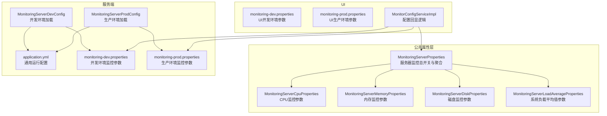
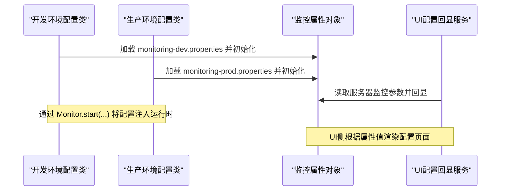
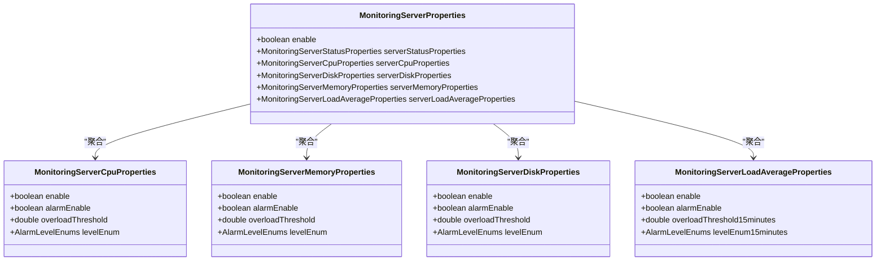

# 服务器监控参数

<cite>
**本文引用的文件**
- [phoenix-common 核心属性：MonitoringServerProperties.java](file://phoenix-common\phoenix-common-core\src\main\java\com\gitee\pifeng\monitoring\common\property\server\MonitoringServerProperties.java)
- [phoenix-common 核心属性：MonitoringServerCpuProperties.java](file://phoenix-common\phoenix-common-core\src\main\java\com\gitee\pifeng\monitoring\common\property\server\MonitoringServerCpuProperties.java)
- [phoenix-common 核心属性：MonitoringServerMemoryProperties.java](file://phoenix-common\phoenix-common-core\src\main\java\com\gitee\pifeng\monitoring\common\property\server\MonitoringServerMemoryProperties.java)
- [phoenix-common 核心属性：MonitoringServerDiskProperties.java](file://phoenix-common\phoenix-common-core\src\main\java\com\gitee\pifeng\monitoring\common\property\server\MonitoringServerDiskProperties.java)
- [phoenix-common 核心属性：MonitoringServerLoadAverageProperties.java](file://phoenix-common\phoenix-common-core\src\main\java\com\gitee\pifeng\monitoring\common\property\server\MonitoringServerLoadAverageProperties.java)
- [phoenix-server 应用配置：application.yml](file://phoenix-server\src\main\resources\application.yml)
- [phoenix-server 监控配置：monitoring-dev.properties](file://phoenix-server\src\main\resources\monitoring-dev.properties)
- [phoenix-server 监控配置：monitoring-prod.properties](file://phoenix-server\src\main\resources\monitoring-prod.properties)
- [phoenix-server 开发环境配置：MonitoringServerDevConfig.java](file://phoenix-server\src\main\java\com\gitee\pifeng\monitoring\server\config\phoenix\MonitoringServerDevConfig.java)
- [phoenix-server 生产环境配置：MonitoringServerProdConfig.java](file://phoenix-server\src\main\java\com\gitee\pifeng\monitoring\server\config\phoenix\MonitoringServerProdConfig.java)
- [phoenix-ui 监控配置：monitoring-dev.properties](file://phoenix-ui\src\main\resources\monitoring-dev.properties)
- [phoenix-ui 监控配置：monitoring-prod.properties](file://phoenix-ui\src\main\resources\monitoring-prod.properties)
- [phoenix-ui 配置回显：MonitorConfigServiceImpl.java](file://phoenix-ui\src\main\java\com\gitee\pifeng\monitoring\ui\business\web\service\impl\MonitorConfigServiceImpl.java)
</cite>

## 目录
1. [引言](#引言)
2. [项目结构](#项目结构)
3. [核心组件](#核心组件)
4. [架构总览](#架构总览)
5. [详细组件分析](#详细组件分析)
6. [依赖关系分析](#依赖关系分析)
7. [性能考量](#性能考量)
8. [故障排查指南](#故障排查指南)
9. [结论](#结论)
10. [附录](#附录)

## 引言
本文件面向Phoenix监控系统的服务器监控参数配置，聚焦于服务器硬件资源监控的关键参数，包括CPU、内存、磁盘、系统负载平均值等维度的阈值与告警策略。同时，结合UI侧的配置回显逻辑，给出可操作的参数调优建议与性能优化策略，帮助用户依据服务器规格与业务场景合理设定监控阈值，实现稳定可靠的运行保障。

## 项目结构
Phoenix监控系统由“客户端插桩”“服务端接收”“UI展示”三部分组成，服务器监控参数主要定义在公共模块的属性类中，并通过服务端的配置类加载到运行时上下文，最终在UI界面进行可视化配置与回显。

图表来源
- [phoenix-common 核心属性：MonitoringServerProperties.java:19-51](file://phoenix-common\phoenix-common-core\src\main\java\com\gitee\pifeng\monitoring\common\property\server\MonitoringServerProperties.java#L19-L51)
- [phoenix-server 应用配置：application.yml:1-271](file://phoenix-server\src\main\resources\application.yml#L1-L271)
- [phoenix-server 开发环境配置：MonitoringServerDevConfig.java:31-35](file://phoenix-server\src\main\java\com\gitee\pifeng\monitoring\server\config\phoenix\MonitoringServerDevConfig.java#L31-L35)
- [phoenix-server 生产环境配置：MonitoringServerProdConfig.java:31-35](file://phoenix-server\src\main\java\com\gitee\pifeng\monitoring\server\config\phoenix\MonitoringServerProdConfig.java#L31-L35)
- [phoenix-ui 配置回显：MonitorConfigServiceImpl.java:95-104](file://phoenix-ui\src\main\java\com\gitee\pifeng\monitoring\ui\business\web\service\impl\MonitorConfigServiceImpl.java#L95-L104)

章节来源
- [phoenix-common 核心属性：MonitoringServerProperties.java:19-51](file://phoenix-common\phoenix-common-core\src\main\java\com\gitee\pifeng\monitoring\common\property\server\MonitoringServerProperties.java#L19-L51)
- [phoenix-server 应用配置：application.yml:1-271](file://phoenix-server\src\main\resources\application.yml#L1-L271)

## 核心组件
本节梳理服务器监控参数的核心属性类及其职责边界，明确各组件的配置项与作用范围。

- 服务器监控总开关与聚合
  - 类型：MonitoringServerProperties
  - 职责：聚合服务器监控的子模块参数，包含是否启用总开关、状态、CPU、内存、磁盘、负载等子属性。
  - 关键字段：enable、serverStatusProperties、serverCpuProperties、serverDiskProperties、serverMemoryProperties、serverLoadAverageProperties。

- CPU监控参数
  - 类型：MonitoringServerCpuProperties
  - 职责：定义CPU维度的监控与告警策略。
  - 关键字段：enable、alarmEnable、overloadThreshold、levelEnum。

- 内存监控参数
  - 类型：MonitoringServerMemoryProperties
  - 职责：定义内存维度的监控与告警策略。
  - 关键字段：enable、alarmEnable、overloadThreshold、levelEnum。

- 磁盘监控参数
  - 类型：MonitoringServerDiskProperties
  - 职责：定义磁盘维度的监控与告警策略。
  - 关键字段：enable、alarmEnable、overloadThreshold、levelEnum。

- 系统负载平均值监控参数
  - 类型：MonitoringServerLoadAverageProperties
  - 职责：定义系统负载平均值的监控与告警策略。
  - 关键字段：enable、alarmEnable、overloadThreshold15minutes、levelEnum15minutes。

章节来源
- [phoenix-common 核心属性：MonitoringServerProperties.java:19-51](file://phoenix-common\phoenix-common-core\src\main\java\com\gitee\pifeng\monitoring\common\property\server\MonitoringServerProperties.java#L19-L51)
- [phoenix-common 核心属性：MonitoringServerCpuProperties.java:20-42](file://phoenix-common\phoenix-common-core\src\main\java\com\gitee\pifeng\monitoring\common\property\server\MonitoringServerCpuProperties.java#L20-L42)
- [phoenix-common 核心属性：MonitoringServerMemoryProperties.java:20-42](file://phoenix-common\phoenix-common-core\src\main\java\com\gitee\pifeng\monitoring\common\property\server\MonitoringServerMemoryProperties.java#L20-L42)
- [phoenix-common 核心属性：MonitoringServerDiskProperties.java:20-42](file://phoenix-common\phoenix-common-core\src\main\java\com\gitee\pifeng\monitoring\common\property\server\MonitoringServerDiskProperties.java#L20-L42)
- [phoenix-common 核心属性：MonitoringServerLoadAverageProperties.java:19-41](file://phoenix-common\phoenix-common-core\src\main\java\com\gitee\pifeng\monitoring\common\property\server\MonitoringServerLoadAverageProperties.java#L19-L41)

## 架构总览
服务器监控参数的加载与生效流程如下：

图表来源
- [phoenix-server 开发环境配置：MonitoringServerDevConfig.java:31-35](file://phoenix-server\src\main\java\com\gitee\pifeng\monitoring\server\config\phoenix\MonitoringServerDevConfig.java#L31-L35)
- [phoenix-server 生产环境配置：MonitoringServerProdConfig.java:31-35](file://phoenix-server\src\main\java\com\gitee\pifeng\monitoring\server\config\phoenix\MonitoringServerProdConfig.java#L31-L35)
- [phoenix-ui 配置回显：MonitorConfigServiceImpl.java:95-104](file://phoenix-ui\src\main\java\com\gitee\pifeng\monitoring\ui\business\web\service\impl\MonitorConfigServiceImpl.java#L95-L104)

## 详细组件分析

### CPU监控参数（MonitoringServerCpuProperties）
- 参数说明
  - enable：是否启用CPU监控
  - alarmEnable：是否启用CPU过载告警
  - overloadThreshold：CPU使用率过载阈值（百分比）
  - levelEnum：告警级别（INFO/WARN/ERROR/FATAL）

- 配置要点
  - 阈值设置需结合CPU核心数与业务峰值，避免误报或漏报
  - 建议在高并发场景适当提高阈值，以应对瞬时峰值
  - 告警级别应与业务SLA匹配，严重级别用于关键业务中断预警

- UI回显
  - UI通过读取serverCpuProperties的levelEnum等字段进行页面渲染

章节来源
- [phoenix-common 核心属性：MonitoringServerCpuProperties.java:20-42](file://phoenix-common\phoenix-common-core\src\main\java\com\gitee\pifeng\monitoring\common\property\server\MonitoringServerCpuProperties.java#L20-L42)
- [phoenix-ui 配置回显：MonitorConfigServiceImpl.java:95-96](file://phoenix-ui\src\main\java\com\gitee\pifeng\monitoring\ui\business\web\service\impl\MonitorConfigServiceImpl.java#L95-L96)

### 内存监控参数（MonitoringServerMemoryProperties）
- 参数说明
  - enable：是否启用内存监控
  - alarmEnable：是否启用内存过载告警
  - overloadThreshold：内存使用率过载阈值（百分比）
  - levelEnum：告警级别（INFO/WARN/ERROR/FATAL）

- 配置要点
  - 需关注堆外内存与直接内存，避免仅看堆内导致漏检
  - 对于长稳业务，建议结合GC周期与晋升失败指标综合评估
  - 建议在内存压力较大时降低阈值，提前预警

- UI回显
  - UI通过读取serverMemoryProperties的enable/alarmEnable/overloadThreshold/levelEnum等字段进行页面渲染

章节来源
- [phoenix-common 核心属性：MonitoringServerMemoryProperties.java:20-42](file://phoenix-common\phoenix-common-core\src\main\java\com\gitee\pifeng\monitoring\common\property\server\MonitoringServerMemoryProperties.java#L20-L42)
- [phoenix-ui 配置回显：MonitorConfigServiceImpl.java:104-105](file://phoenix-ui\src\main\java\com\gitee\pifeng\monitoring\ui\business\web\service\impl\MonitorConfigServiceImpl.java#L104-L105)

### 磁盘监控参数（MonitoringServerDiskProperties）
- 参数说明
  - enable：是否启用磁盘监控
  - alarmEnable：是否启用磁盘过载告警
  - overloadThreshold：磁盘使用率过载阈值（百分比）
  - levelEnum：告警级别（INFO/WARN/ERROR/FATAL）

- 配置要点
  - 需区分根分区、日志分区与数据分区，按分区用途设置差异化阈值
  - 结合IO等待时间与inode使用率，避免仅看容量导致的误判
  - 建议为日志与临时目录设置更严格阈值，保障系统稳定性

- UI回显
  - UI通过读取serverDiskProperties的enable/alarmEnable/overloadThreshold/levelEnum等字段进行页面渲染

章节来源
- [phoenix-common 核心属性：MonitoringServerDiskProperties.java:20-42](file://phoenix-common\phoenix-common-core\src\main\java\com\gitee\pifeng\monitoring\common\property\server\MonitoringServerDiskProperties.java#L20-L42)
- [phoenix-ui 配置回显：MonitorConfigServiceImpl.java:100-104](file://phoenix-ui\src\main\java\com\gitee\pifeng\monitoring\ui\business\web\service\impl\MonitorConfigServiceImpl.java#L100-L104)

### 系统负载平均值监控参数（MonitoringServerLoadAverageProperties）
- 参数说明
  - enable：是否启用系统负载平均值监控
  - alarmEnable：是否启用负载过载告警
  - overloadThreshold15minutes：15分钟负载平均值过载阈值
  - levelEnum15minutes：15分钟负载过载告警级别（INFO/WARN/ERROR/FATAL）

- 配置要点
  - 负载阈值通常与CPU核心数相关，建议按“核心数+1”作为参考基线
  - 高并发短连接场景下，负载可能长期高于核心数，需结合进程队列长度综合判断
  - 建议在业务低峰期适当提高阈值，避免频繁告警

- UI回显
  - UI通过读取serverLoadAverageProperties的enable/alarmEnable/overloadThreshold15minutes/levelEnum15minutes等字段进行页面渲染

章节来源
- [phoenix-common 核心属性：MonitoringServerLoadAverageProperties.java:19-41](file://phoenix-common\phoenix-common-core\src\main\java\com\gitee\pifeng\monitoring\common\property\server\MonitoringServerLoadAverageProperties.java#L19-L41)
- [phoenix-ui 配置回显：MonitorConfigServiceImpl.java:96-99](file://phoenix-ui\src\main\java\com\gitee\pifeng\monitoring\ui\business\web\service\impl\MonitorConfigServiceImpl.java#L96-L99)

### 网络监控参数（概念性说明）
- 概念说明
  - 网络监控参数通常包括带宽使用率、连接数限制、网络延迟等维度，用于评估网络链路健康度与业务可用性。
  - 在Phoenix现有代码中，网络监控参数未在服务器监控参数类中直接体现，但UI侧存在网络相关模块与历史数据展示，可用于补充网络层面的观测。

- 建议
  - 若需扩展网络监控，请在服务端新增网络监控属性类，并在UI侧增加对应配置项与图表展示。
  - 可结合系统自带的网络IO指标与第三方工具进行联动监控。

[本节为概念性说明，不直接分析具体文件，故无章节来源]

## 依赖关系分析
服务器监控参数的依赖关系如下：

图表来源
- [phoenix-common 核心属性：MonitoringServerProperties.java:19-51](file://phoenix-common\phoenix-common-core\src\main\java\com\gitee\pifeng\monitoring\common\property\server\MonitoringServerProperties.java#L19-L51)
- [phoenix-common 核心属性：MonitoringServerCpuProperties.java:20-42](file://phoenix-common\phoenix-common-core\src\main\java\com\gitee\pifeng\monitoring\common\property\server\MonitoringServerCpuProperties.java#L20-L42)
- [phoenix-common 核心属性：MonitoringServerMemoryProperties.java:20-42](file://phoenix-common\phoenix-common-core\src\main\java\com\gitee\pifeng\monitoring\common\property\server\MonitoringServerMemoryProperties.java#L20-L42)
- [phoenix-common 核心属性：MonitoringServerDiskProperties.java:20-42](file://phoenix-common\phoenix-common-core\src\main\java\com\gitee\pifeng\monitoring\common\property\server\MonitoringServerDiskProperties.java#L20-L42)
- [phoenix-common 核心属性：MonitoringServerLoadAverageProperties.java:19-41](file://phoenix-common\phoenix-common-core\src\main\java\com\gitee\pifeng\monitoring\common\property\server\MonitoringServerLoadAverageProperties.java#L19-L41)

## 性能考量
- 采样与上报频率
  - 服务器监控参数类本身不包含采样间隔字段，采样频率通常由采集端与上报端共同决定。建议在高并发场景下适当降低上报频率，减少对业务的影响。
- 阈值设置策略
  - CPU/内存/磁盘阈值应结合业务峰值与SLA设定，避免过于敏感导致误报，或过于宽松导致漏报。
  - 负载阈值建议按CPU核心数动态调整，配合进程队列长度综合评估。
- 告警级别与收敛
  - 不同级别的告警应匹配不同的响应优先级，建议在告警风暴期间启用静默或收敛策略，避免告警疲劳。
- 资源隔离
  - 对于日志、临时目录等关键路径，建议设置更严格的阈值，确保系统关键分区不会因空间耗尽而影响服务。

[本节为通用性能建议，不直接分析具体文件，故无章节来源]

## 故障排查指南
- 配置未生效
  - 检查当前激活的profile是否正确加载了对应的monitoring-*.properties文件
  - 确认服务端配置类是否成功初始化MonitoringProperties
- 阈值异常
  - 检查overloadThreshold与levelEnum的组合是否符合预期
  - 对于负载监控，确认overloadThreshold15minutes与levelEnum15minutes的设置是否合理
- UI配置回显异常
  - 检查MonitorConfigServiceImpl中对serverCpuProperties/serverMemoryProperties/serverDiskProperties/serverLoadAverageProperties的读取逻辑

章节来源
- [phoenix-server 开发环境配置：MonitoringServerDevConfig.java:31-35](file://phoenix-server\src\main\java\com\gitee\pifeng\monitoring\server\config\phoenix\MonitoringServerDevConfig.java#L31-L35)
- [phoenix-server 生产环境配置：MonitoringServerProdConfig.java:31-35](file://phoenix-server\src\main\java\com\gitee\pifeng\monitoring\server\config\phoenix\MonitoringServerProdConfig.java#L31-L35)
- [phoenix-ui 配置回显：MonitorConfigServiceImpl.java:95-104](file://phoenix-ui\src\main\java\com\gitee\pifeng\monitoring\ui\business\web\service\impl\MonitorConfigServiceImpl.java#L95-L104)

## 结论
本文基于Phoenix监控系统的公共属性类与服务端配置，系统性梳理了服务器硬件资源监控参数的配置要点与回显机制。通过合理设置CPU、内存、磁盘与系统负载的阈值与告警级别，并结合业务场景进行参数调优，可显著提升监控体系的准确性与可靠性。对于网络监控参数，建议在现有基础上扩展网络维度的监控能力，并在UI侧完善配置与展示。

## 附录
- 配置文件位置参考
  - 服务端开发环境：phoenix-server/src/main/resources/monitoring-dev.properties
  - 服务端生产环境：phoenix-server/src/main/resources/monitoring-prod.properties
  - UI开发环境：phoenix-ui/src/main/resources/monitoring-dev.properties
  - UI生产环境：phoenix-ui/src/main/resources/monitoring-prod.properties
- 关键类路径参考
  - 服务器监控聚合类：phoenix-common/.../MonitoringServerProperties.java
  - CPU监控类：phoenix-common/.../MonitoringServerCpuProperties.java
  - 内存监控类：phoenix-common/.../MonitoringServerMemoryProperties.java
  - 磁盘监控类：phoenix-common/.../MonitoringServerDiskProperties.java
  - 负载监控类：phoenix-common/.../MonitoringServerLoadAverageProperties.java