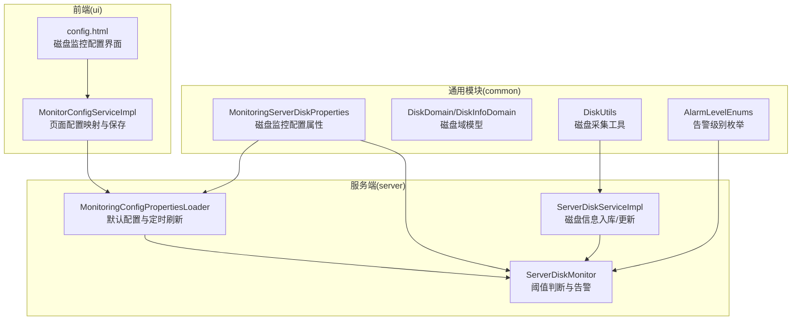
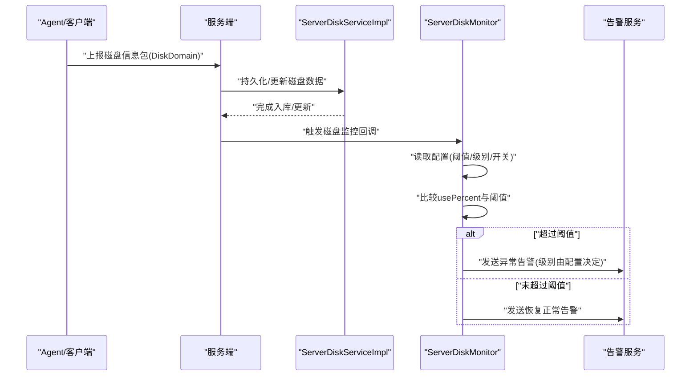
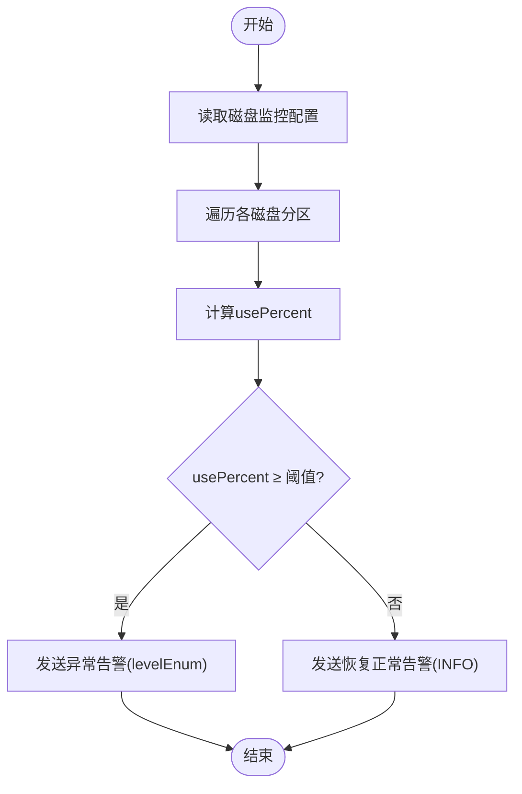
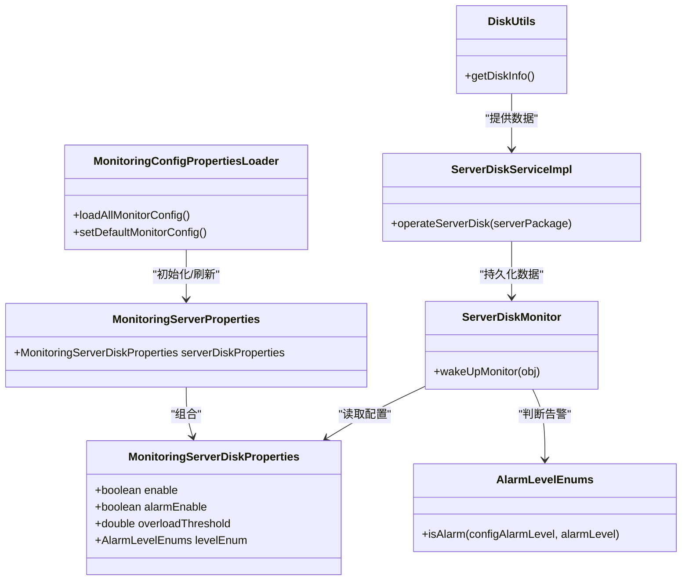

# 磁盘监控参数

<cite>
**本文引用的文件**
- [MonitoringServerDiskProperties.java](file://phoenix-common\phoenix-common-core\src\main\java\com\gitee\pifeng\monitoring\common\property\server\MonitoringServerDiskProperties.java)
- [MonitoringServerProperties.java](file://phoenix-common\phoenix-common-core\src\main\java\com\gitee\pifeng\monitoring\common\property\server\MonitoringServerProperties.java)
- [MonitoringConfigPropertiesLoader.java](file://phoenix-server\src\main\java\com\gitee\pifeng\monitoring\server\business\server\core\MonitoringConfigPropertiesLoader.java)
- [DiskDomain.java](file://phoenix-common\phoenix-common-core\src\main\java\com\gitee\pifeng\monitoring\common\domain\server\DiskDomain.java)
- [DiskUtils.java](file://phoenix-common\phoenix-common-core\src\main\java\com\gitee\pifeng\monitoring\common\util\server\oshi\DiskUtils.java)
- [ServerDiskMonitor.java](file://phoenix-server\src\main\java\com\gitee\pifeng\monitoring\server\business\server\monitor\server\ServerDiskMonitor.java)
- [ServerDiskServiceImpl.java](file://phoenix-server\src\main\java\com\gitee\pifeng\monitoring\server\business\server\service\impl\ServerDiskServiceImpl.java)
- [AlarmLevelEnums.java](file://phoenix-common\phoenix-common-core\src\main\java\com\gitee\pifeng\monitoring\common\constant\alarm\AlarmLevelEnums.java)
- [MonitorConfigServiceImpl.java](file://phoenix-ui\src\main\java\com\gitee\pifeng\monitoring\ui\business\web\service\impl\MonitorConfigServiceImpl.java)
- [config.html](file://phoenix-ui\src\main\resources\templates\set\config.html)
</cite>

## 目录
1. [简介](#简介)
2. [项目结构](#项目结构)
3. [核心组件](#核心组件)
4. [架构总览](#架构总览)
5. [详细组件分析](#详细组件分析)
6. [依赖关系分析](#依赖关系分析)
7. [性能考量](#性能考量)
8. [故障排查指南](#故障排查指南)
9. [结论](#结论)
10. [附录](#附录)

## 简介
本文件面向Phoenix监控系统的磁盘监控参数，围绕MonitoringServerDiskProperties类展开，系统化阐述磁盘空间使用率阈值、告警级别、启用与告警开关等核心配置项，并结合后端采集、处理、告警与前端配置界面，给出工作机制、参数策略与调优建议。文档同时覆盖不同文件系统类型的监控差异、容量规划与IO性能优化建议，帮助用户基于存储架构与业务需求合理配置磁盘监控。

## 项目结构
Phoenix磁盘监控涉及三层：通用模型与常量（common）、服务端采集与告警（server）、前端配置界面（ui）。磁盘监控的关键参数定义在通用模块的MonitoringServerDiskProperties中，服务端通过DiskUtils采集磁盘信息并持久化，再由ServerDiskMonitor进行阈值判断与告警发送，前端通过MonitorConfigServiceImpl将页面配置映射为MonitoringProperties并写入数据库，服务端定时拉取刷新。

图表来源
- [MonitoringServerDiskProperties.java:1-42](file://phoenix-common\phoenix-common-core\src\main\java\com\gitee\pifeng\monitoring\common\property\server\MonitoringServerDiskProperties.java#L1-L42)
- [DiskDomain.java:1-90](file://phoenix-common\phoenix-common-core\src\main\java\com\gitee\pifeng\monitoring\common\domain\server\DiskDomain.java#L1-L90)
- [DiskUtils.java:1-76](file://phoenix-common\phoenix-common-core\src\main\java\com\gitee\pifeng\monitoring\common\util\server\oshi\DiskUtils.java#L1-L76)
- [ServerDiskServiceImpl.java:1-96](file://phoenix-server\src\main\java\com\gitee\pifeng\monitoring\server\business\server\service\impl\ServerDiskServiceImpl.java#L1-L96)
- [ServerDiskMonitor.java:1-256](file://phoenix-server\src\main\java\com\gitee\pifeng\monitoring\server\business\server\monitor\server\ServerDiskMonitor.java#L1-L256)
- [MonitoringConfigPropertiesLoader.java:1-203](file://phoenix-server\src\main\java\com\gitee\pifeng\monitoring\server\business\server\core\MonitoringConfigPropertiesLoader.java#L1-L203)
- [MonitorConfigServiceImpl.java:200-282](file://phoenix-ui\src\main\java\com\gitee\pifeng\monitoring\ui\business\web\service\impl\MonitorConfigServiceImpl.java#L200-L282)
- [config.html:613-676](file://phoenix-ui\src\main\resources\templates\set\config.html#L613-L676)

章节来源
- [MonitoringServerDiskProperties.java:1-42](file://phoenix-common\phoenix-common-core\src\main\java\com\gitee\pifeng\monitoring\common\property\server\MonitoringServerDiskProperties.java#L1-L42)
- [MonitoringServerProperties.java:1-52](file://phoenix-common\phoenix-common-core\src\main\java\com\gitee\pifeng\monitoring\common\property\server\MonitoringServerProperties.java#L1-L52)
- [MonitoringConfigPropertiesLoader.java:158-167](file://phoenix-server\src\main\java\com\gitee\pifeng\monitoring\server\business\server\core\MonitoringConfigPropertiesLoader.java#L158-L167)

## 核心组件
- MonitoringServerDiskProperties：定义磁盘监控的核心参数，包括是否启用监控、是否启用告警、过载阈值、告警级别等。
- DiskDomain/DiskInfoDomain：封装磁盘采集结果，包含分区名称、挂载点、文件系统类型、总量/已用/可用/利用率等字段。
- DiskUtils：基于OSHI采集本地文件系统磁盘信息，过滤本地磁盘并计算利用率。
- ServerDiskServiceImpl：将采集到的磁盘信息持久化或更新至数据库。
- ServerDiskMonitor：按配置阈值判断磁盘使用率，触发正常/异常状态转换并发送告警。
- AlarmLevelEnums：定义告警级别（忽略/消息/警告/错误/严重），用于控制告警发送策略。
- UI配置映射：MonitorConfigServiceImpl将前端表单映射为MonitoringProperties，其中包含serverDiskProperties字段，保存到数据库并触发服务端刷新。

章节来源
- [MonitoringServerDiskProperties.java:20-42](file://phoenix-common\phoenix-common-core\src\main\java\com\gitee\pifeng\monitoring\common\property\server\MonitoringServerDiskProperties.java#L20-L42)
- [DiskDomain.java:23-87](file://phoenix-common\phoenix-common-core\src\main\java\com\gitee\pifeng\monitoring\common\domain\server\DiskDomain.java#L23-L87)
- [DiskUtils.java:38-75](file://phoenix-common\phoenix-common-core\src\main\java\com\gitee\pifeng\monitoring\common\util\server\oshi\DiskUtils.java#L38-L75)
- [ServerDiskServiceImpl.java:41-93](file://phoenix-server\src\main\java\com\gitee\pifeng\monitoring\server\business\server\service\impl\ServerDiskServiceImpl.java#L41-L93)
- [ServerDiskMonitor.java:84-136](file://phoenix-server\src\main\java\com\gitee\pifeng\monitoring\server\business\server\monitor\server\ServerDiskMonitor.java#L84-L136)
- [AlarmLevelEnums.java:13-117](file://phoenix-common\phoenix-common-core\src\main\java\com\gitee\pifeng\monitoring\common\constant\alarm\AlarmLevelEnums.java#L13-L117)
- [MonitorConfigServiceImpl.java:207-212](file://phoenix-ui\src\main\java\com\gitee\pifeng\monitoring\ui\business\web\service\impl\MonitorConfigServiceImpl.java#L207-L212)

## 架构总览
磁盘监控从采集到告警的端到端流程如下：

图表来源
- [ServerDiskServiceImpl.java:41-93](file://phoenix-server\src\main\java\com\gitee\pifeng\monitoring\server\business\server\service\impl\ServerDiskServiceImpl.java#L41-L93)
- [ServerDiskMonitor.java:84-136](file://phoenix-server\src\main\java\com\gitee\pifeng\monitoring\server\business\server\monitor\server\ServerDiskMonitor.java#L84-L136)
- [AlarmLevelEnums.java:51-81](file://phoenix-common\phoenix-common-core\src\main\java\com\gitee\pifeng\monitoring\common\constant\alarm\AlarmLevelEnums.java#L51-L81)

## 详细组件分析

### MonitoringServerDiskProperties：磁盘监控配置参数
- enable：是否启用服务器磁盘监控。若关闭，服务端不会对该主机的磁盘数据进行阈值判断与告警。
- alarmEnable：是否启用告警。即使超过阈值，若关闭告警，也不会发送告警消息。
- overloadThreshold：磁盘使用率阈值（百分比）。当某一分区的usePercent达到或超过该阈值时，触发异常告警。
- levelEnum：告警级别。与AlarmLevelEnums配合，决定是否发送告警及告警等级。

章节来源
- [MonitoringServerDiskProperties.java:22-40](file://phoenix-common\phoenix-common-core\src\main\java\com\gitee\pifeng\monitoring\common\property\server\MonitoringServerDiskProperties.java#L22-L40)
- [MonitoringServerProperties.java:36-39](file://phoenix-common\phoenix-common-core\src\main\java\com\gitee\pifeng\monitoring\common\property\server\MonitoringServerProperties.java#L36-L39)
- [MonitoringConfigPropertiesLoader.java:160-161](file://phoenix-server\src\main\java\com\gitee\pifeng\monitoring\server\business\server\core\MonitoringConfigPropertiesLoader.java#L160-L161)

### DiskDomain与DiskInfoDomain：磁盘数据模型
- 包含分区设备名、挂载点、文件系统类型名与类型、总量/已用/可用/剩余字节，以及usePercent利用率。
- 采集自OSHI的本地文件系统，确保仅监控本地磁盘，避免网络文件系统干扰。

章节来源
- [DiskDomain.java:23-87](file://phoenix-common\phoenix-common-core\src\main\java\com\gitee\pifeng\monitoring\common\domain\server\DiskDomain.java#L23-L87)
- [DiskUtils.java:38-75](file://phoenix-common\phoenix-common-core\src\main\java\com\gitee\pifeng\monitoring\common\util\server\oshi\DiskUtils.java#L38-L75)

### DiskUtils：磁盘采集逻辑
- 使用OSHI获取本地文件系统集合，遍历每个文件存储，填充总量、可用、剩余、已用与利用率。
- 利用四舍五入保留小数位，保证告警展示精度。

章节来源
- [DiskUtils.java:38-75](file://phoenix-common\phoenix-common-core\src\main\java\com\gitee\pifeng\monitoring\common\util\server\oshi\DiskUtils.java#L38-L75)

### ServerDiskServiceImpl：磁盘数据入库/更新
- 将采集到的磁盘信息按IP与序号（diskNo）匹配数据库记录，不存在则插入，存在则更新。
- 采用批量新增与逐条更新相结合的方式，兼顾性能与一致性。

章节来源
- [ServerDiskServiceImpl.java:41-93](file://phoenix-server\src\main\java\com\gitee\pifeng\monitoring\server\business\server\service\impl\ServerDiskServiceImpl.java#L41-L93)

### ServerDiskMonitor：阈值判断与告警
- 读取配置：enable/alarmEnable/overloadThreshold/levelEnum。
- 对每个分区计算usePercent并与阈值比较，超过阈值触发异常告警，否则发送恢复正常告警。
- 告警内容包含IP、服务器名、分区名、路径、总量/已用、使用率与时间戳等。
- 最终是否发送告警还受AlarmLevelEnums的isAlarm策略影响。

图表来源
- [ServerDiskMonitor.java:114-135](file://phoenix-server\src\main\java\com\gitee\pifeng\monitoring\server\business\server\monitor\server\ServerDiskMonitor.java#L114-L135)
- [AlarmLevelEnums.java:51-81](file://phoenix-common\phoenix-common-core\src\main\java\com\gitee\pifeng\monitoring\common\constant\alarm\AlarmLevelEnums.java#L51-L81)

章节来源
- [ServerDiskMonitor.java:84-136](file://phoenix-server\src\main\java\com\gitee\pifeng\monitoring\server\business\server\monitor\server\ServerDiskMonitor.java#L84-L136)
- [AlarmLevelEnums.java:51-81](file://phoenix-common\phoenix-common-core\src\main\java\com\gitee\pifeng\monitoring\common\constant\alarm\AlarmLevelEnums.java#L51-L81)

### 前端配置映射与界面
- MonitorConfigServiceImpl将页面表单字段映射为MonitoringProperties，其中serverDiskProperties包含enable/alarmEnable/overloadThreshold/levelEnum。
- config.html提供磁盘监控的“是否监控”“是否告警”“告警级别”等输入项，便于运维人员按需调整。

章节来源
- [MonitorConfigServiceImpl.java:207-212](file://phoenix-ui\src\main\java\com\gitee\pifeng\monitoring\ui\business\web\service\impl\MonitorConfigServiceImpl.java#L207-L212)
- [config.html:613-676](file://phoenix-ui\src\main\resources\templates\set\config.html#L613-L676)

## 依赖关系分析
- 配置依赖：MonitoringServerDiskProperties作为MonitoringServerProperties的一部分，被MonitoringConfigPropertiesLoader初始化并定时刷新。
- 数据依赖：DiskUtils采集的数据经ServerDiskServiceImpl入库，ServerDiskMonitor基于数据库记录进行阈值判断。
- 告警依赖：AlarmLevelEnums决定告警是否发送与级别，ServerDiskMonitor在满足条件时构建告警包并交由告警服务处理。

图表来源
- [MonitoringServerDiskProperties.java:19-42](file://phoenix-common\phoenix-common-core\src\main\java\com\gitee\pifeng\monitoring\common\property\server\MonitoringServerDiskProperties.java#L19-L42)
- [MonitoringServerProperties.java:19-51](file://phoenix-common\phoenix-common-core\src\main\java\com\gitee\pifeng\monitoring\common\property\server\MonitoringServerProperties.java#L19-L51)
- [MonitoringConfigPropertiesLoader.java:158-167](file://phoenix-server\src\main\java\com\gitee\pifeng\monitoring\server\business\server\core\MonitoringConfigPropertiesLoader.java#L158-L167)
- [DiskUtils.java:38-75](file://phoenix-common\phoenix-common-core\src\main\java\com\gitee\pifeng\monitoring\common\util\server\oshi\DiskUtils.java#L38-L75)
- [ServerDiskServiceImpl.java:41-93](file://phoenix-server\src\main\java\com\gitee\pifeng\monitoring\server\business\server\service\impl\ServerDiskServiceImpl.java#L41-L93)
- [ServerDiskMonitor.java:84-136](file://phoenix-server\src\main\java\com\gitee\pifeng\monitoring\server\business\server\monitor\server\ServerDiskMonitor.java#L84-L136)
- [AlarmLevelEnums.java:51-81](file://phoenix-common\phoenix-common-core\src\main\java\com\gitee\pifeng\monitoring\common\constant\alarm\AlarmLevelEnums.java#L51-L81)

章节来源
- [MonitoringServerDiskProperties.java:19-42](file://phoenix-common\phoenix-common-core\src\main\java\com\gitee\pifeng\monitoring\common\property\server\MonitoringServerDiskProperties.java#L19-L42)
- [MonitoringServerProperties.java:19-51](file://phoenix-common\phoenix-common-core\src\main\java\com\gitee\pifeng\monitoring\common\property\server\MonitoringServerProperties.java#L19-L51)
- [MonitoringConfigPropertiesLoader.java:158-167](file://phoenix-server\src\main\java\com\gitee\pifeng\monitoring\server\business\server\core\MonitoringConfigPropertiesLoader.java#L158-L167)
- [ServerDiskMonitor.java:84-136](file://phoenix-server\src\main\java\com\gitee\pifeng\monitoring\server\business\server\monitor\server\ServerDiskMonitor.java#L84-L136)

## 性能考量
- 采集频率与阈值设置：过低的阈值可能导致频繁告警与日志风暴；过高的阈值可能错过预警时机。建议结合业务峰值与容量规划综合设定。
- 批量入库策略：ServerDiskServiceImpl对新增与更新分别处理，减少不必要的事务开销，提升并发性能。
- 告警级别控制：AlarmLevelEnums的isAlarm策略可避免无关告警打扰，建议在生产环境将最低告警级别设为WARN或ERROR。
- IO延迟与健康检测：当前实现主要基于usePercent阈值判断，未直接暴露IO等待时间与健康状态检测参数。如需更细粒度的IO监控，可在Agent侧扩展采集指标并在服务端进行阈值配置。

## 故障排查指南
- 无法收到磁盘告警
  - 检查enable与alarmEnable是否均开启。
  - 确认levelEnum是否高于系统配置的最小告警级别。
  - 核对overloadThreshold是否合理，过高会导致长时间不触发。
- 磁盘利用率显示异常
  - 确认采集是否来自本地文件系统（DiskUtils仅过滤本地）。
  - 检查usePercent计算是否正确，关注四舍五入精度。
- 配置未生效
  - 前端保存后需触发服务端配置刷新，确认刷新接口调用成功。
  - 服务端定时任务每5分钟拉取一次最新配置，等待刷新周期。

章节来源
- [ServerDiskMonitor.java:208-218](file://phoenix-server\src\main\java\com\gitee\pifeng\monitoring\server\business\server\monitor\server\ServerDiskMonitor.java#L208-L218)
- [AlarmLevelEnums.java:51-81](file://phoenix-common\phoenix-common-core\src\main\java\com\gitee\pifeng\monitoring\common\constant\alarm\AlarmLevelEnums.java#L51-L81)
- [MonitoringConfigPropertiesLoader.java:197-200](file://phoenix-server\src\main\java\com\gitee\pifeng\monitoring\server\business\server\core\MonitoringConfigPropertiesLoader.java#L197-L200)

## 结论
Phoenix磁盘监控以MonitoringServerDiskProperties为核心配置载体，结合OSHI采集、数据库持久化与阈值判断，形成闭环的监控与告警机制。通过enable/alarmEnable/overloadThreshold/levelEnum四个关键参数，用户可灵活适配不同业务场景。建议在生产环境中采用合理的阈值与告警级别，结合容量规划与IO优化策略，持续迭代调优。

## 附录

### 参数配置策略与调优建议
- 不同文件系统类型的监控差异
  - 本地磁盘：DiskUtils默认仅采集本地文件系统，适合大多数服务器场景。
  - 网络文件系统：通常不在本地采集范围内，如需监控可考虑在Agent侧扩展采集并单独配置阈值。
- 容量规划建议
  - 为关键分区预留安全余量，阈值建议不低于80%，避免业务运行时因空间耗尽导致停机。
  - 对日志、缓存等增长型目录，适当降低阈值以提前预警。
- IO性能优化配置
  - 当前实现未直接暴露IO等待时间与健康状态检测参数。建议结合业务特性，在Agent侧增加IO队列长度、IOPS、延迟等指标采集，并在服务端通过MonitoringServerDiskProperties扩展对应阈值配置，实现更全面的IO健康监控。

章节来源
- [DiskUtils.java:44-45](file://phoenix-common\phoenix-common-core\src\main\java\com\gitee\pifeng\monitoring\common\util\server\oshi\DiskUtils.java#L44-L45)
- [MonitoringServerDiskProperties.java:22-40](file://phoenix-common\phoenix-common-core\src\main\java\com\gitee\pifeng\monitoring\common\property\server\MonitoringServerDiskProperties.java#L22-L40)