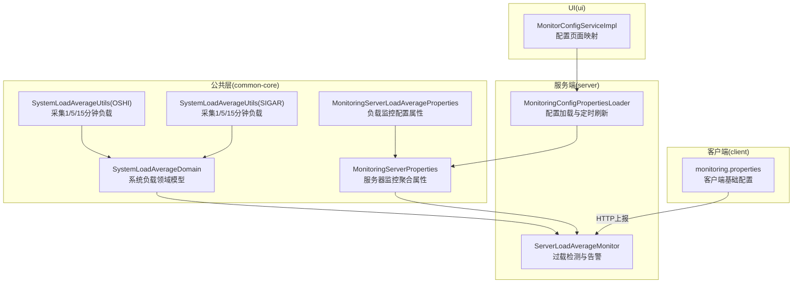
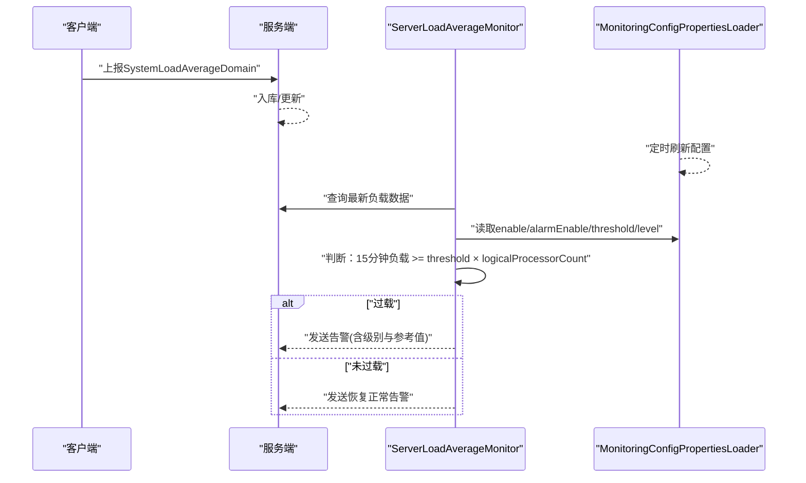
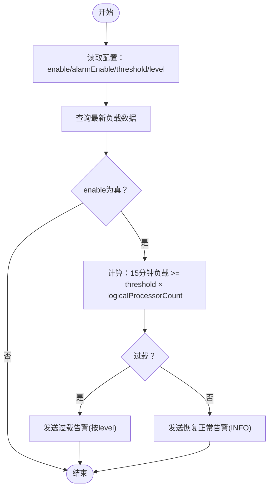
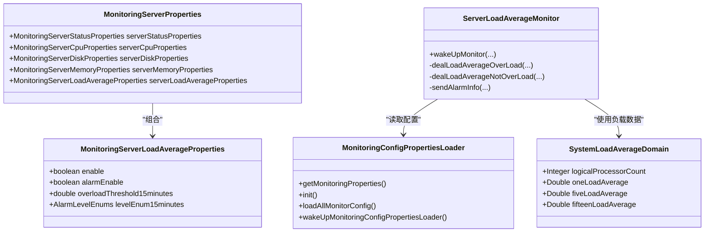

# 系统负载平均值监控参数

<cite>
**本文引用的文件**
- [MonitoringServerLoadAverageProperties.java](file://phoenix-common\phoenix-common-core\src\main\java\com\gitee\pifeng\monitoring\common\property\server\MonitoringServerLoadAverageProperties.java)
- [MonitoringServerProperties.java](file://phoenix-common\phoenix-common-core\src\main\java\com\gitee\pifeng\monitoring\common\property\server\MonitoringServerProperties.java)
- [SystemLoadAverageDomain.java](file://phoenix-common\phoenix-common-core\src\main\java\com\gitee\pifeng\monitoring\common\domain\server\SystemLoadAverageDomain.java)
- [SystemLoadAverageUtils.java（OSHI）](file://phoenix-common\phoenix-common-core\src\main\java\com\gitee\pifeng\monitoring\common\util\server\oshi\SystemLoadAverageUtils.java)
- [SystemLoadAverageUtils.java（SIGAR）](file://phoenix-common\phoenix-common-core\src\main\java\com\gitee\pifeng\monitoring\common\util\server\sigar\SystemLoadAverageUtils.java)
- [ServerLoadAverageMonitor.java](file://phoenix-server\src\main\java\com\gitee\pifeng\monitoring\server\business\server\monitor\server\ServerLoadAverageMonitor.java)
- [MonitoringConfigPropertiesLoader.java](file://phoenix-server\src\main\java\com\gitee\pifeng\monitoring\server\business\server\core\MonitoringConfigPropertiesLoader.java)
- [monitoring-dev.properties](file://phoenix-server\src\main\resources\monitoring-dev.properties)
- [monitoring.properties](file://phoenix-client\phoenix-client-core\src\main\resources\monitoring.properties)
- [MonitorConfigServiceImpl.java](file://phoenix-ui\src\main\java\com\gitee\pifeng\monitoring\ui\business\web\service\impl\MonitorConfigServiceImpl.java)
</cite>

## 目录
1. [简介](#简介)
2. [项目结构](#项目结构)
3. [核心组件](#核心组件)
4. [架构总览](#架构总览)
5. [详细组件分析](#详细组件分析)
6. [依赖关系分析](#依赖关系分析)
7. [性能考量](#性能考量)
8. [故障排查指南](#故障排查指南)
9. [结论](#结论)
10. [附录](#附录)

## 简介
本文件面向Phoenix监控系统的“系统负载平均值”监控参数，围绕MonitoringServerLoadAverageProperties类展开，系统性说明以下内容：
- 负载均衡阈值设置、进程队列长度监控、系统繁忙程度评估等关键参数
- 1分钟、5分钟、15分钟负载平均值的含义与应用场景
- 配置指南：不同CPU核心数下的阈值设定、异常检测策略、高并发场景优化
- 集群环境下配置方法与最佳实践

## 项目结构
与系统负载平均值监控相关的代码分布在如下模块：
- 公共模型与工具：common-core（领域模型、采集工具）
- 服务端：server（监控器、配置加载、数据库持久化）
- 客户端：client（采集端配置）
- UI：ui（配置页面映射）

图表来源
- [SystemLoadAverageDomain.java:22-44](file://phoenix-common\phoenix-common-core\src\main\java\com\gitee\pifeng\monitoring\common\domain\server\SystemLoadAverageDomain.java#L22-L44)
- [SystemLoadAverageUtils.java（OSHI）:28-42](file://phoenix-common\phoenix-common-core\src\main\java\com\gitee\pifeng\monitoring\common\util\server\oshi\SystemLoadAverageUtils.java#L28-L42)
- [SystemLoadAverageUtils.java（SIGAR）:30-54](file://phoenix-common\phoenix-common-core\src\main\java\com\gitee\pifeng\monitoring\common\util\server\sigar\SystemLoadAverageUtils.java#L30-L54)
- [MonitoringServerLoadAverageProperties.java:19-41](file://phoenix-common\phoenix-common-core\src\main\java\com\gitee\pifeng\monitoring\common\property\server\MonitoringServerLoadAverageProperties.java#L19-L41)
- [MonitoringServerProperties.java:19-51](file://phoenix-common\phoenix-common-core\src\main\java\com\gitee\pifeng\monitoring\common\property\server\MonitoringServerProperties.java#L19-L51)
- [ServerLoadAverageMonitor.java:84-131](file://phoenix-server\src\main\java\com\gitee\pifeng\monitoring\server\business\server\monitor\server\ServerLoadAverageMonitor.java#L84-L131)
- [MonitoringConfigPropertiesLoader.java:98-115](file://phoenix-server\src\main\java\com\gitee\pifeng\monitoring\server\business\server\core\MonitoringConfigPropertiesLoader.java#L98-L115)
- [monitoring.properties:10-41](file://phoenix-client\phoenix-client-core\src\main\resources\monitoring.properties#L10-L41)
- [MonitorConfigServiceImpl.java:95-104](file://phoenix-ui\src\main\java\com\gitee\pifeng\monitoring\ui\business\web\service\impl\MonitorConfigServiceImpl.java#L95-L104)

章节来源
- [MonitoringServerLoadAverageProperties.java:19-41](file://phoenix-common\phoenix-common-core\src\main\java\com\gitee\pifeng\monitoring\common\property\server\MonitoringServerLoadAverageProperties.java#L19-L41)
- [MonitoringServerProperties.java:19-51](file://phoenix-common\phoenix-common-core\src\main\java\com\gitee\pifeng\monitoring\common\property\server\MonitoringServerProperties.java#L19-L51)

## 核心组件
- MonitoringServerLoadAverageProperties：定义“是否监控”“是否告警”“15分钟过载阈值”“15分钟过载告警级别”等关键参数。
- SystemLoadAverageDomain：承载采集到的1分钟、5分钟、15分钟负载平均值及CPU逻辑核数。
- SystemLoadAverageUtils（OSHI/SIGAR）：跨平台采集系统负载平均值。
- ServerLoadAverageMonitor：基于阈值与CPU核数判定过载并触发告警。
- MonitoringConfigPropertiesLoader：从数据库加载监控配置，支持定时刷新。

章节来源
- [MonitoringServerLoadAverageProperties.java:19-41](file://phoenix-common\phoenix-common-core\src\main\java\com\gitee\pifeng\monitoring\common\property\server\MonitoringServerLoadAverageProperties.java#L19-L41)
- [SystemLoadAverageDomain.java:22-44](file://phoenix-common\phoenix-common-core\src\main\java\com\gitee\pifeng\monitoring\common\domain\server\SystemLoadAverageDomain.java#L22-L44)
- [SystemLoadAverageUtils.java（OSHI）:28-42](file://phoenix-common\phoenix-common-core\src\main\java\com\gitee\pifeng\monitoring\common\util\server\oshi\SystemLoadAverageUtils.java#L28-L42)
- [SystemLoadAverageUtils.java（SIGAR）:30-54](file://phoenix-common\phoenix-common-core\src\main\java\com\gitee\pifeng\monitoring\common\util\server\sigar\SystemLoadAverageUtils.java#L30-L54)
- [ServerLoadAverageMonitor.java:84-131](file://phoenix-server\src\main\java\com\gitee\pifeng\monitoring\server\business\server\monitor\server\ServerLoadAverageMonitor.java#L84-L131)
- [MonitoringConfigPropertiesLoader.java:98-115](file://phoenix-server\src\main\java\com\gitee\pifeng\monitoring\server\business\server\core\MonitoringConfigPropertiesLoader.java#L98-L115)

## 架构总览
系统负载平均值监控的关键流程：
- 客户端周期性采集系统负载（1/5/15分钟负载与CPU核数），封装为SystemLoadAverageDomain并上报服务端
- 服务端接收后存储于数据库，并由ServerLoadAverageMonitor按配置进行过载判定
- 过载阈值以“15分钟负载平均值 ≥ 阈值 × CPU逻辑核数”为条件
- 若满足过载且告警开启，则按配置级别发送告警

图表来源
- [ServerLoadAverageMonitor.java:84-131](file://phoenix-server\src\main\java\com\gitee\pifeng\monitoring\server\business\server\monitor\server\ServerLoadAverageMonitor.java#L84-L131)
- [MonitoringConfigPropertiesLoader.java:197-200](file://phoenix-server\src\main\java\com\gitee\pifeng\monitoring\server\business\server\core\MonitoringConfigPropertiesLoader.java#L197-L200)
- [SystemLoadAverageDomain.java:22-44](file://phoenix-common\phoenix-common-core\src\main\java\com\gitee\pifeng\monitoring\common\domain\server\SystemLoadAverageDomain.java#L22-L44)

## 详细组件分析

### MonitoringServerLoadAverageProperties 参数详解
- enable：是否启用服务器平均负载监控
- alarmEnable：是否启用告警
- overloadThreshold15minutes：15分钟过载阈值（相对值，单位为“核”）
- levelEnum15minutes：15分钟过载告警级别（INFO/WARN/ERROR/FATAL）

章节来源
- [MonitoringServerLoadAverageProperties.java:21-40](file://phoenix-common\phoenix-common-core\src\main\java\com\gitee\pifeng\monitoring\common\property\server\MonitoringServerLoadAverageProperties.java#L21-L40)

### SystemLoadAverageDomain 字段与含义
- logicalProcessorCount：CPU逻辑核数
- oneLoadAverage：1分钟负载平均值
- fiveLoadAverage：5分钟负载平均值
- fifteenLoadAverage：15分钟负载平均值

章节来源
- [SystemLoadAverageDomain.java:24-42](file://phoenix-common\phoenix-common-core\src\main\java\com\gitee\pifeng\monitoring\common\domain\server\SystemLoadAverageDomain.java#L24-L42)

### 采集实现（OSHI 与 SIGAR）
- OSHI实现：通过CentralProcessor获取最近1/5/15分钟负载数组，封装为SystemLoadAverageDomain
- SIGAR实现：Windows系统返回-1占位；非Windows系统读取LoadAverage，封装为SystemLoadAverageDomain

章节来源
- [SystemLoadAverageUtils.java（OSHI）:28-42](file://phoenix-common\phoenix-common-core\src\main\java\com\gitee\pifeng\monitoring\common\util\server\oshi\SystemLoadAverageUtils.java#L28-L42)
- [SystemLoadAverageUtils.java（SIGAR）:30-54](file://phoenix-common\phoenix-common-core\src\main\java\com\gitee\pifeng\monitoring\common\util\server\sigar\SystemLoadAverageUtils.java#L30-L54)

### 过载判定与告警流程
- 判定条件：15分钟负载平均值 ≥ 配置阈值 × CPU逻辑核数
- 正常/过载分别发送不同告警标题与级别
- 告警消息包含CPU核数、三档负载值、参考阈值（含“理想/过载/严重/告警”）

图表来源
- [ServerLoadAverageMonitor.java:84-131](file://phoenix-server\src\main\java\com\gitee\pifeng\monitoring\server\business\server\monitor\server\ServerLoadAverageMonitor.java#L84-L131)
- [ServerLoadAverageMonitor.java:176-193](file://phoenix-server\src\main\java\com\gitee\pifeng\monitoring\server\business\server\monitor\server\ServerLoadAverageMonitor.java#L176-L193)
- [ServerLoadAverageMonitor.java:212-283](file://phoenix-server\src\main\java\com\gitee\pifeng\monitoring\server\business\server\monitor\server\ServerLoadAverageMonitor.java#L212-L283)

章节来源
- [ServerLoadAverageMonitor.java:84-131](file://phoenix-server\src\main\java\com\gitee\pifeng\monitoring\server\business\server\monitor\server\ServerLoadAverageMonitor.java#L84-L131)
- [ServerLoadAverageMonitor.java:176-193](file://phoenix-server\src\main\java\com\gitee\pifeng\monitoring\server\business\server\monitor\server\ServerLoadAverageMonitor.java#L176-L193)
- [ServerLoadAverageMonitor.java:212-283](file://phoenix-server\src\main\java\com\gitee\pifeng\monitoring\server\business\server\monitor\server\ServerLoadAverageMonitor.java#L212-L283)

### 配置加载与持久化
- 初始化：从数据库读取配置，若无则设置默认值（含负载监控默认开启、告警默认开启、阈值1.0、级别INFO）
- 定时刷新：每5分钟从数据库拉取最新配置，覆盖内存中的配置对象

章节来源
- [MonitoringConfigPropertiesLoader.java:81-87](file://phoenix-server\src\main\java\com\gitee\pifeng\monitoring\server\business\server\core\MonitoringConfigPropertiesLoader.java#L81-L87)
- [MonitoringConfigPropertiesLoader.java:98-115](file://phoenix-server\src\main\java\com\gitee\pifeng\monitoring\server\business\server\core\MonitoringConfigPropertiesLoader.java#L98-L115)
- [MonitoringConfigPropertiesLoader.java:126-187](file://phoenix-server\src\main\java\com\gitee\pifeng\monitoring\server\business\server\core\MonitoringConfigPropertiesLoader.java#L126-L187)
- [MonitoringConfigPropertiesLoader.java:197-200](file://phoenix-server\src\main\java\com\gitee\pifeng\monitoring\server\business\server\core\MonitoringConfigPropertiesLoader.java#L197-L200)

### UI配置映射
- UI侧将配置映射到表单字段，包括“负载监控开关”“告警开关”“15分钟阈值”“15分钟级别”

章节来源
- [MonitorConfigServiceImpl.java:95-104](file://phoenix-ui\src\main\java\com\gitee\pifeng\monitoring\ui\business\web\service\impl\MonitorConfigServiceImpl.java#L95-L104)

## 依赖关系分析
- ServerLoadAverageMonitor依赖MonitoringConfigPropertiesLoader提供的配置
- 采集端通过OSHI或SIGAR工具获取SystemLoadAverageDomain
- UI通过MonitorConfigServiceImpl读取配置并回显

图表来源
- [MonitoringServerLoadAverageProperties.java:19-41](file://phoenix-common\phoenix-common-core\src\main\java\com\gitee\pifeng\monitoring\common\property\server\MonitoringServerLoadAverageProperties.java#L19-L41)
- [MonitoringServerProperties.java:19-51](file://phoenix-common\phoenix-common-core\src\main\java\com\gitee\pifeng\monitoring\common\property\server\MonitoringServerProperties.java#L19-L51)
- [SystemLoadAverageDomain.java:22-44](file://phoenix-common\phoenix-common-core\src\main\java\com\gitee\pifeng\monitoring\common\domain\server\SystemLoadAverageDomain.java#L22-L44)
- [ServerLoadAverageMonitor.java:43-74](file://phoenix-server\src\main\java\com\gitee\pifeng\monitoring\server\business\server\monitor\server\ServerLoadAverageMonitor.java#L43-L74)
- [MonitoringConfigPropertiesLoader.java:33-71](file://phoenix-server\src\main\java\com\gitee\pifeng\monitoring\server\business\server\core\MonitoringConfigPropertiesLoader.java#L33-L71)

章节来源
- [MonitoringServerLoadAverageProperties.java:19-41](file://phoenix-common\phoenix-common-core\src\main\java\com\gitee\pifeng\monitoring\common\property\server\MonitoringServerLoadAverageProperties.java#L19-L41)
- [MonitoringServerProperties.java:19-51](file://phoenix-common\phoenix-common-core\src\main\java\com\gitee\pifeng\monitoring\common\property\server\MonitoringServerProperties.java#L19-L51)
- [ServerLoadAverageMonitor.java:43-74](file://phoenix-server\src\main\java\com\gitee\pifeng\monitoring\server\business\server\monitor\server\ServerLoadAverageMonitor.java#L43-L74)
- [MonitoringConfigPropertiesLoader.java:33-71](file://phoenix-server\src\main\java\com\gitee\pifeng\monitoring\server\business\server\core\MonitoringConfigPropertiesLoader.java#L33-L71)

## 性能考量
- 采集频率：客户端可配置“服务器信息采集频率”，建议不低于30秒，避免过于频繁导致额外开销
- 判定复杂度：每次过载判定为O(1)，整体开销极低
- IO与网络：服务端入库与告警发送为主要IO路径，建议结合数据库索引与异步告警通道优化
- 并发场景：多实例并发上报时，注意数据库写入压力与告警风暴，可通过阈值与告警级别分级缓解

## 故障排查指南
- 采集失败
  - 现象：1/5/15分钟负载为空或为-1
  - 排查：确认操作系统是否为Windows（SIGAR在Windows返回-1）、OSHI依赖是否正确初始化
- 阈值误报/漏报
  - 现象：阈值设置不当导致频繁告警或未告警
  - 排查：结合CPU核数与阈值计算公式，调整overloadThreshold15minutes
- 告警未触发
  - 现象：负载异常但未收到告警
  - 排查：确认enable/alarmEnable均为true，且实例已开启监控与告警
- 配置未生效
  - 现象：修改阈值后未见变化
  - 排查：确认数据库配置已更新，且服务端定时任务已拉取最新配置

章节来源
- [SystemLoadAverageUtils.java（SIGAR）:32-40](file://phoenix-common\phoenix-common-core\src\main\java\com\gitee\pifeng\monitoring\common\util\server\sigar\SystemLoadAverageUtils.java#L32-L40)
- [MonitoringConfigPropertiesLoader.java:197-200](file://phoenix-server\src\main\java\com\gitee\pifeng\monitoring\server\business\server\core\MonitoringConfigPropertiesLoader.java#L197-L200)
- [ServerLoadAverageMonitor.java:212-225](file://phoenix-server\src\main\java\com\gitee\pifeng\monitoring\server\business\server\monitor\server\ServerLoadAverageMonitor.java#L212-L225)

## 结论
- Phoenix的系统负载平均值监控以“15分钟负载 ≥ 阈值×核数”的简单而稳健的规则为核心，兼顾了短期波动与长期趋势
- 通过enable/alarmEnable/threshold/level四个关键参数即可实现从“是否监控”到“如何告警”的全链路配置
- 在高并发与多实例场景下，建议结合CPU核数动态调整阈值、采用分级告警与限流策略，确保告警质量与系统稳定性

## 附录

### 参数配置指南与最佳实践
- 基础参数
  - enable：建议默认开启，便于持续观测
  - alarmEnable：建议默认开启，配合level分级使用
  - overloadThreshold15minutes：建议从1.0起调，结合业务峰值与核数逐步优化
  - levelEnum15minutes：建议将“过载/严重”映射到更高优先级告警级别
- CPU核数适配
  - 计算公式：过载阈值 = 阈值 × CPU逻辑核数
  - 小核服务器：阈值可略低；大核服务器：适当提高阈值
- 异常检测策略
  - 单一15分钟指标：适合稳定型业务
  - 多指标联动：可结合CPU使用率、内存与IO综合判定
- 高并发优化
  - 合理设置采集频率，避免过度采集
  - 使用分级告警与静默窗口，减少告警风暴
  - 在集群环境中统一阈值策略，避免局部抖动引发全局告警

章节来源
- [MonitoringServerLoadAverageProperties.java:21-40](file://phoenix-common\phoenix-common-core\src\main\java\com\gitee\pifeng\monitoring\common\property\server\MonitoringServerLoadAverageProperties.java#L21-L40)
- [ServerLoadAverageMonitor.java:232-246](file://phoenix-server\src\main\java\com\gitee\pifeng\monitoring\server\business\server\monitor\server\ServerLoadAverageMonitor.java#L232-L246)

### 集群环境配置方法
- 统一配置来源：通过数据库集中管理配置，服务端定时刷新
- 实例维度：可在UI中为不同实例单独开启/关闭监控与告警
- 通信与端点：客户端需正确配置HTTP通信URL与端点类型

章节来源
- [MonitoringConfigPropertiesLoader.java:98-115](file://phoenix-server\src\main\java\com\gitee\pifeng\monitoring\server\business\server\core\MonitoringConfigPropertiesLoader.java#L98-L115)
- [monitoring-dev.properties:10-21](file://phoenix-server\src\main\resources\monitoring-dev.properties#L10-L21)
- [monitoring.properties:10-21](file://phoenix-client\phoenix-client-core\src\main\resources\monitoring.properties#L10-L21)