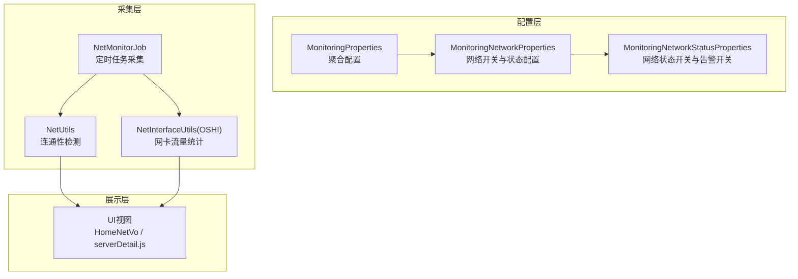
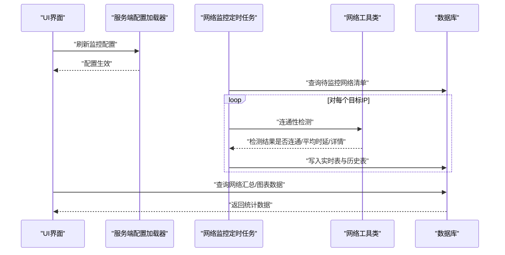
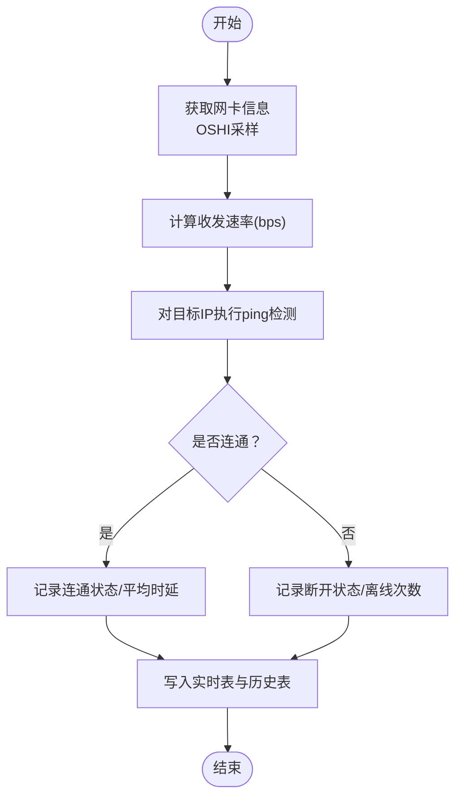
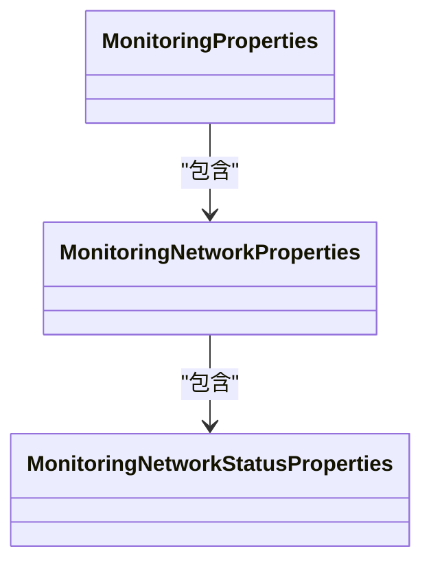

# 网络监控参数

<cite>
**本文引用的文件**
- [MonitoringNetworkProperties.java](file://phoenix-common\phoenix-common-core\src\main\java\com\gitee\pifeng\monitoring\common\property\server\MonitoringNetworkProperties.java)
- [MonitoringNetworkStatusProperties.java](file://phoenix-common\phoenix-common-core\src\main\java\com\gitee\pifeng\monitoring\common\property\server\MonitoringNetworkStatusProperties.java)
- [MonitoringProperties.java](file://phoenix-common\phoenix-common-core\src\main\java\com\gitee\pifeng\monitoring\common\property\server\MonitoringProperties.java)
- [MonitoringConfigPropertiesLoader.java](file://phoenix-server\src\main\java\com\gitee\pifeng\monitoring\server\business\server\core\MonitoringConfigPropertiesLoader.java)
- [MonitorConfigServiceImpl.java](file://phoenix-ui\src\main\java\com\gitee\pifeng\monitoring\ui\business\web\service\impl\MonitorConfigServiceImpl.java)
- [NetworkController.java（Agent）](file://phoenix-agent\src\main\java\com\gitee\pifeng\monitoring\agent\business\client\controller\NetworkController.java)
- [NetworkController.java（Server）](file://phoenix-server\src\main\java\com\gitee\pifeng\monitoring\server\business\server\controller\NetworkController.java)
- [NetUtils.java](file://phoenix-common\phoenix-common-core\src\main\java\com\gitee\pifeng\monitoring\common\util\server\NetUtils.java)
- [NetInterfaceUtils.java（OSHI）](file://phoenix-common\phoenix-common-core\src\main\java\com\gitee\pifeng\monitoring\common\util\server\oshi\NetInterfaceUtils.java)
- [MonitorNet.java](file://phoenix-server\src\main\java\com\gitee\pifeng\monitoring\server\business\server\entity\MonitorNet.java)
- [MonitorNetHistory.java](file://phoenix-server\src\main\java\com\gitee\pifeng\monitoring\server\business\server\entity\MonitorNetHistory.java)
- [NetMonitorJob.java](file://phoenix-server\src\main\java\com\gitee\pifeng\monitoring\server\business\server\monitor\net\NetMonitorJob.java)
- [HomeNetVo.java](file://phoenix-ui\src\main\java\com\gitee\pifeng\monitoring\ui\business\web\vo\HomeNetVo.java)
- [serverDetail.js](file://phoenix-ui\src\main\resources\static\modules\server\serverDetail.js)
</cite>

## 目录
1. [简介](#简介)
2. [项目结构](#项目结构)
3. [核心组件](#核心组件)
4. [架构总览](#架构总览)
5. [详细组件分析](#详细组件分析)
6. [依赖关系分析](#依赖关系分析)
7. [性能考量](#性能考量)
8. [故障排查指南](#故障排查指南)
9. [结论](#结论)
10. [附录](#附录)

## 简介
本文件面向Phoenix监控系统中的“网络监控”配置与工作机制，围绕以下目标展开：
- 全面梳理网络监控参数：包括MonitoringNetworkProperties与MonitoringNetworkStatusProperties两类配置对象及其字段语义
- 解释网络监控工作原理：接口监控、连通性检测、流量统计与连接状态检测
- 提供配置策略与最佳实践：不同网络环境下的参数设定、带宽峰值检测方法、网络性能优化建议
- 结合部署场景：解释不同架构下配置差异与落地建议

## 项目结构
Phoenix网络监控涉及三层：
- 配置层：服务端配置加载与持久化，UI侧配置编辑与下发
- 采集层：Agent侧网络探测与Server侧网络连通性测试
- 展示层：UI侧网络图表与汇总视图

**图表来源**
- [MonitoringProperties.java:14-61](file://phoenix-common\phoenix-common-core\src\main\java\com\gitee\pifeng\monitoring\common\property\server\MonitoringProperties.java#L14-L61)
- [MonitoringNetworkProperties.java:14-31](file://phoenix-common\phoenix-common-core\src\main\java\com\gitee\pifeng\monitoring\common\property\server\MonitoringNetworkProperties.java#L14-L31)
- [MonitoringNetworkStatusProperties.java:14-31](file://phoenix-common\phoenix-common-core\src\main\java\com\gitee\pifeng\monitoring\common\property\server\MonitoringNetworkStatusProperties.java#L14-L31)
- [NetMonitorJob.java:123-143](file://phoenix-server\src\main\java\com\gitee\pifeng\monitoring\server\business\server\monitor\net\NetMonitorJob.java#L123-L143)
- [NetUtils.java:377-456](file://phoenix-common\phoenix-common-core\src\main\java\com\gitee\pifeng\monitoring\common\util\server\NetUtils.java#L377-L456)
- [NetInterfaceUtils.java（OSHI）:40-111](file://phoenix-common\phoenix-common-core\src\main\java\com\gitee\pifeng\monitoring\common\util\server\oshi\NetInterfaceUtils.java#L40-L111)
- [HomeNetVo.java:25-42](file://phoenix-ui\src\main\java\com\gitee\pifeng\monitoring\ui\business\web\vo\HomeNetVo.java#L25-L42)
- [serverDetail.js:1968-1997](file://phoenix-ui\src\main\resources\static\modules\server\serverDetail.js#L1968-L1997)

**章节来源**
- [MonitoringProperties.java:14-61](file://phoenix-common\phoenix-common-core\src\main\java\com\gitee\pifeng\monitoring\common\property\server\MonitoringProperties.java#L14-L61)
- [MonitoringNetworkProperties.java:14-31](file://phoenix-common\phoenix-common-core\src\main\java\com\gitee\pifeng\monitoring\common\property\server\MonitoringNetworkProperties.java#L14-L31)
- [MonitoringNetworkStatusProperties.java:14-31](file://phoenix-common\phoenix-common-core\src\main\java\com\gitee\pifeng\monitoring\common\property\server\MonitoringNetworkStatusProperties.java#L14-L31)

## 核心组件
本节聚焦网络监控参数的配置对象与字段含义。

- MonitoringNetworkProperties（网络配置属性）
  - enable：是否启用网络监控
  - networkStatusProperties：网络状态配置对象
- MonitoringNetworkStatusProperties（网络状态配置属性）
  - enable：是否启用网络状态监控
  - alarmEnable：网络状态异常时是否触发告警

上述两个类均实现统一的ISuperBean契约，便于序列化/反序列化与跨模块传递。

此外，MonitoringProperties作为全局配置聚合对象，包含networkProperties字段，用于承载网络监控配置。

**章节来源**
- [MonitoringNetworkProperties.java:14-31](file://phoenix-common\phoenix-common-core\src\main\java\com\gitee\pifeng\monitoring\common\property\server\MonitoringNetworkProperties.java#L14-L31)
- [MonitoringNetworkStatusProperties.java:14-31](file://phoenix-common\phoenix-common-core\src\main\java\com\gitee\pifeng\monitoring\common\property\server\MonitoringNetworkStatusProperties.java#L14-L31)
- [MonitoringProperties.java:14-61](file://phoenix-common\phoenix-common-core\src\main\java\com\gitee\pifeng\monitoring\common\property\server\MonitoringProperties.java#L14-L61)

## 架构总览
Phoenix网络监控的端到端流程如下：
- 配置下发：UI编辑网络监控参数后，调用配置刷新接口，服务端加载最新配置并缓存
- 采集执行：定时任务扫描已配置的网络监控项，对目标IP进行连通性检测
- 数据存储：将每次检测结果写入实时表与历史表
- 可视化呈现：UI侧以图表形式展示网络连通率、平均响应时间、带宽趋势等

**图表来源**
- [MonitoringConfigPropertiesLoader.java:197-200](file://phoenix-server\src\main\java\com\gitee\pifeng\monitoring\server\business\server\core\MonitoringConfigPropertiesLoader.java#L197-L200)
- [MonitorConfigServiceImpl.java:264-279](file://phoenix-ui\src\main\java\com\gitee\pifeng\monitoring\ui\business\web\service\impl\MonitorConfigServiceImpl.java#L264-L279)
- [NetMonitorJob.java:123-143](file://phoenix-server\src\main\java\com\gitee\pifeng\monitoring\server\business\server\monitor\net\NetMonitorJob.java#L123-L143)
- [NetUtils.java:377-456](file://phoenix-common\phoenix-common-core\src\main\java\com\gitee\pifeng\monitoring\common\util\server\NetUtils.java#L377-L456)
- [MonitorNet.java:27-114](file://phoenix-server\src\main\java\com\gitee\pifeng\monitoring\server\business\server\entity\MonitorNet.java#L27-L114)
- [MonitorNetHistory.java:27-96](file://phoenix-server\src\main\java\com\gitee\pifeng\monitoring\server\business\server\entity\MonitorNetHistory.java#L27-L96)

## 详细组件分析

### 配置对象与参数详解
- MonitoringNetworkProperties
  - enable：控制是否对网络监控项进行采集与展示
  - networkStatusProperties：细粒度控制网络状态监控与告警
- MonitoringNetworkStatusProperties
  - enable：仅启用状态监控，不影响其他指标
  - alarmEnable：当enable为true时，决定异常是否触发告警

这些配置最终由服务端加载器注入到运行时配置中，定时任务按阈值重复检测目标IP连通性。

**章节来源**
- [MonitoringNetworkProperties.java:14-31](file://phoenix-common\phoenix-common-core\src\main\java\com\gitee\pifeng\monitoring\common\property\server\MonitoringNetworkProperties.java#L14-L31)
- [MonitoringNetworkStatusProperties.java:14-31](file://phoenix-common\phoenix-common-core\src\main\java\com\gitee\pifeng\monitoring\common\property\server\MonitoringNetworkStatusProperties.java#L14-L31)
- [MonitoringConfigPropertiesLoader.java:140-143](file://phoenix-server\src\main\java\com\gitee\pifeng\monitoring\server\business\server\core\MonitoringConfigPropertiesLoader.java#L140-L143)

### 网络监控工作原理
- 接口监控与流量统计
  - OSHI工具类通过系统硬件接口获取网卡列表、IP/MAC/掩码、收发字节数等
  - 两次采样间隔计算速率（bps），用于带宽使用率评估
- 连通性检测
  - 使用ping命令进行ICMP连通性检测，统计平均时延与详细日志
  - 支持Windows/Linux平台差异处理
- 连接状态检测
  - 通过Telnet客户端检测端口连通性（备用方案）

**图表来源**
- [NetInterfaceUtils.java（OSHI）:40-111](file://phoenix-common\phoenix-common-core\src\main\java\com\gitee\pifeng\monitoring\common\util\server\oshi\NetInterfaceUtils.java#L40-L111)
- [NetUtils.java:377-456](file://phoenix-common\phoenix-common-core\src\main\java\com\gitee\pifeng\monitoring\common\util\server\NetUtils.java#L377-L456)
- [MonitorNet.java:27-114](file://phoenix-server\src\main\java\com\gitee\pifeng\monitoring\server\business\server\entity\MonitorNet.java#L27-L114)
- [MonitorNetHistory.java:27-96](file://phoenix-server\src\main\java\com\gitee\pifeng\monitoring\server\business\server\entity\MonitorNetHistory.java#L27-L96)

**章节来源**
- [NetInterfaceUtils.java（OSHI）:40-111](file://phoenix-common\phoenix-common-core\src\main\java\com\gitee\pifeng\monitoring\common\util\server\oshi\NetInterfaceUtils.java#L40-L111)
- [NetUtils.java:377-456](file://phoenix-common\phoenix-common-core\src\main\java\com\gitee\pifeng\monitoring\common\util\server\NetUtils.java#L377-L456)

### 网络监控参数配置策略
- 不同网络环境下的配置
  - 内网环境：可适当降低阈值与检测频率，避免频繁告警
  - 外网/跨域：提高阈值与检测频率，关注抖动与时延
  - 虚拟化/容器：优先基于OSHI采样，确保网卡识别准确
- 带宽峰值检测方法
  - 基于两次采样间隔的bps计算，结合UI图表展示峰值与均值
  - 建议设置带宽阈值告警，结合离线次数与连通率综合判断
- 告警策略
  - enable与alarmEnable双开关控制，避免误报与漏报
  - 结合整体阈值（threshold）与网络检测结果，动态调整检测次数

**章节来源**
- [MonitoringNetworkProperties.java:14-31](file://phoenix-common\phoenix-common-core\src\main\java\com\gitee\pifeng\monitoring\common\property\server\MonitoringNetworkProperties.java#L14-L31)
- [MonitoringNetworkStatusProperties.java:14-31](file://phoenix-common\phoenix-common-core\src\main\java\com\gitee\pifeng\monitoring\common\property\server\MonitoringNetworkStatusProperties.java#L14-L31)
- [MonitoringConfigPropertiesLoader.java:140-143](file://phoenix-server\src\main\java\com\gitee\pifeng\monitoring\server\business\server\core\MonitoringConfigPropertiesLoader.java#L140-L143)

### 部署场景与最佳实践
- 单体架构
  - 配置集中管理，阈值与检测频率统一
- 分布式/微服务
  - 按环境/分组维度配置，区分开发/测试/生产阈值
  - 关注跨服务网络连通性，结合IP描述与监控分组定位问题
- 容器化
  - 使用OSHI采样，注意docker/lo网卡过滤逻辑
  - 建议固定IP或通过服务发现配合IP描述进行监控

**章节来源**
- [MonitorNet.java:27-114](file://phoenix-server\src\main\java\com\gitee\pifeng\monitoring\server\business\server\entity\MonitorNet.java#L27-L114)
- [MonitorNetHistory.java:27-96](file://phoenix-server\src\main\java\com\gitee\pifeng\monitoring\server\business\server\entity\MonitorNetHistory.java#L27-L96)
- [NetInterfaceUtils.java（OSHI）:125-135](file://phoenix-common\phoenix-common-core\src\main\java\com\gitee\pifeng\monitoring\common\util\server\oshi\NetInterfaceUtils.java#L125-L135)

## 依赖关系分析
- 配置对象依赖
  - MonitoringProperties聚合了MonitoringNetworkProperties
  - MonitoringNetworkProperties包含MonitoringNetworkStatusProperties
- 运行时依赖
  - 服务端配置加载器负责初始化与定时刷新
  - UI侧负责表单映射与配置下发
  - 定时任务依赖网络工具类执行连通性检测
  - 数据层包含实时表与历史表，支撑可视化与报表

**图表来源**
- [MonitoringProperties.java:14-61](file://phoenix-common\phoenix-common-core\src\main\java\com\gitee\pifeng\monitoring\common\property\server\MonitoringProperties.java#L14-L61)
- [MonitoringNetworkProperties.java:14-31](file://phoenix-common\phoenix-common-core\src\main\java\com\gitee\pifeng\monitoring\common\property\server\MonitoringNetworkProperties.java#L14-L31)
- [MonitoringNetworkStatusProperties.java:14-31](file://phoenix-common\phoenix-common-core\src\main\java\com\gitee\pifeng\monitoring\common\property\server\MonitoringNetworkStatusProperties.java#L14-L31)

**章节来源**
- [MonitoringProperties.java:14-61](file://phoenix-common\phoenix-common-core\src\main\java\com\gitee\pifeng\monitoring\common\property\server\MonitoringProperties.java#L14-L61)
- [MonitoringNetworkProperties.java:14-31](file://phoenix-common\phoenix-common-core\src\main\java\com\gitee\pifeng\monitoring\common\property\server\MonitoringNetworkProperties.java#L14-L31)
- [MonitoringNetworkStatusProperties.java:14-31](file://phoenix-common\phoenix-common-core\src\main\java\com\gitee\pifeng\monitoring\common\property\server\MonitoringNetworkStatusProperties.java#L14-L31)

## 性能考量
- 检测频率与阈值
  - 频繁ping会增加系统开销，建议根据业务SLA调整阈值与周期
- 平台差异
  - Windows/Linux的ping命令参数不同，需兼容处理
- 图表渲染
  - 带宽图表采用平滑折线与均值标注，避免瞬时峰值干扰
- 数据落库
  - 实时表与历史表分离，减少查询压力，支持滚动窗口统计

**章节来源**
- [NetUtils.java:401-456](file://phoenix-common\phoenix-common-core\src\main\java\com\gitee\pifeng\monitoring\common\util\server\NetUtils.java#L401-L456)
- [serverDetail.js:1968-1997](file://phoenix-ui\src\main\resources\static\modules\server\serverDetail.js#L1968-L1997)

## 故障排查指南
- 连通性检测失败
  - 检查目标IP可达性与防火墙策略
  - 查看ping详情与平均时延，定位网络抖动或丢包
- 带宽统计异常
  - 确认OSHI采样是否正确识别目标网卡
  - 检查docker/lo等虚拟网卡过滤逻辑
- 配置未生效
  - 确认UI已调用配置刷新接口
  - 检查服务端配置加载器是否定时刷新成功

**章节来源**
- [NetUtils.java:377-456](file://phoenix-common\phoenix-common-core\src\main\java\com\gitee\pifeng\monitoring\common\util\server\NetUtils.java#L377-L456)
- [NetInterfaceUtils.java（OSHI）:125-135](file://phoenix-common\phoenix-common-core\src\main\java\com\gitee\pifeng\monitoring\common\util\server\oshi\NetInterfaceUtils.java#L125-L135)
- [MonitorConfigServiceImpl.java:264-279](file://phoenix-ui\src\main\java\com\gitee\pifeng\monitoring\ui\business\web\service\impl\MonitorConfigServiceImpl.java#L264-L279)

## 结论
Phoenix网络监控通过“配置—采集—存储—展示”的闭环，实现了对网络连通性与带宽使用的可观测性。合理设置enable/alarmEnable与阈值，结合不同网络环境的差异化策略，可在保证稳定性的同时提升运维效率。建议在生产环境中采用分环境/分组的精细化配置，并持续优化检测频率与告警策略。

## 附录
- 关键参数速查
  - enable：是否启用网络监控
  - networkStatusProperties.enable：是否启用网络状态监控
  - networkStatusProperties.alarmEnable：网络状态异常是否告警
- 相关实体
  - 实时表：MONITOR_NET
  - 历史表：MONITOR_NET_HISTORY
- 相关接口
  - Agent侧：获取源IP、测试网络连通性
  - Server侧：获取源IP、测试网络连通性

**章节来源**
- [MonitorNet.java:27-114](file://phoenix-server\src\main\java\com\gitee\pifeng\monitoring\server\business\server\entity\MonitorNet.java#L27-L114)
- [MonitorNetHistory.java:27-96](file://phoenix-server\src\main\java\com\gitee\pifeng\monitoring\server\business\server\entity\MonitorNetHistory.java#L27-L96)
- [NetworkController.java（Agent）:52-77](file://phoenix-agent\src\main\java\com\gitee\pifeng\monitoring\agent\business\client\controller\NetworkController.java#L52-L77)
- [NetworkController.java（Server）:61-106](file://phoenix-server\src\main\java\com\gitee\pifeng\monitoring\server\business\server\controller\NetworkController.java#L61-L106)