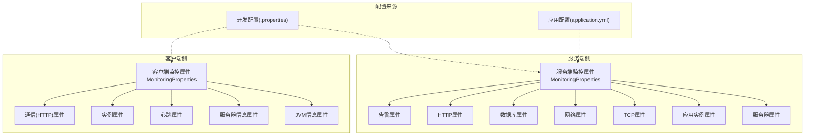
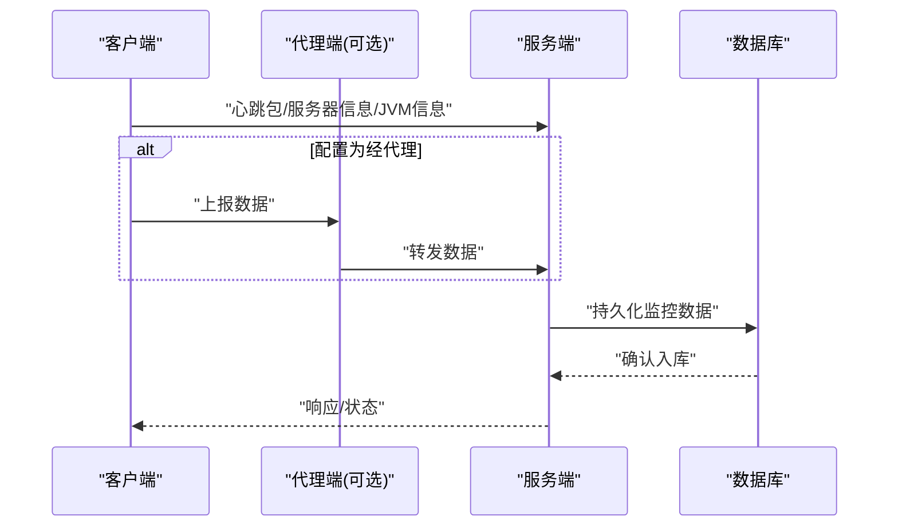
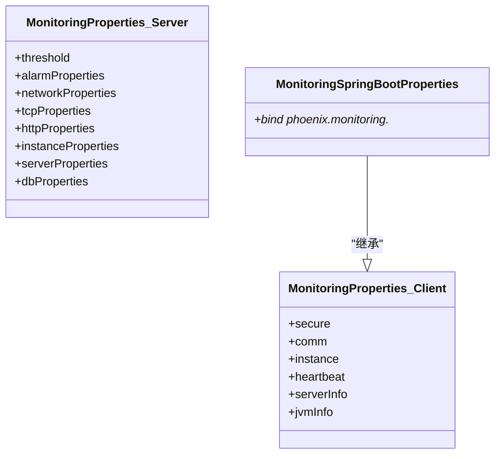

# 监控参数配置

<cite>
**本文引用的文件**
- [phoenix-client 核心配置文件](file://phoenix-client/phoenix-client-core/src/main/resources/monitoring.properties)
- [phoenix-agent 开发配置文件](file://phoenix-agent/src/main/resources/monitoring-dev.properties)
- [phoenix-server 开发配置文件](file://phoenix-server/src/main/resources/monitoring-dev.properties)
- [phoenix-ui 开发配置文件](file://phoenix-ui/src/main/resources/monitoring-dev.properties)
- [phoenix-agent 应用配置](file://phoenix-agent/src/main/resources/application.yml)
- [phoenix-server 应用配置](file://phoenix-server/src/main/resources/application.yml)
- [phoenix-ui 应用配置](file://phoenix-ui/src/main/resources/application.yml)
- [客户端监控属性聚合类](file://phoenix-common/phoenix-common-core/src/main/java/com/gitee/pifeng/monitoring/common/property/client/MonitoringProperties.java)
- [服务端监控属性聚合类](file://phoenix-common/phoenix-common-core/src/main/java/com/gitee/pifeng/monitoring/common/property/server/MonitoringProperties.java)
- [Spring Boot 自动装配属性类](file://phoenix-client/phoenix-client-spring-boot-starter/src/main/java/com/gitee/pifeng/monitoring/starter/property/MonitoringSpringBootProperties.java)
- [客户端属性：通信HTTP](file://phoenix-common/phoenix-common-core/src/main/java/com/gitee/pifeng/monitoring/common/property/client/MonitoringCommHttpProperties.java)
- [客户端属性：实例信息](file://phoenix-common/phoenix-common-core/src/main/java/com/gitee/pifeng/monitoring/common/property/client/MonitoringInstanceProperties.java)
- [客户端属性：心跳](file://phoenix-common/phoenix-common-core/src/main/java/com/gitee/pifeng/monitoring/common/property/client/MonitoringHeartbeatProperties.java)
- [客户端属性：服务器信息](file://phoenix-common/phoenix-common-core/src/main/java/com/gitee/pifeng/monitoring/common/property/client/MonitoringServerInfoProperties.java)
- [客户端属性：JVM信息](file://phoenix-common/phoenix-common-core/src/main/java/com/gitee/pifeng/monitoring/common/property/client/MonitoringJvmInfoProperties.java)
- [服务端属性：告警](file://phoenix-common/phoenix-common-core/src/main/java/com/gitee/pifeng/monitoring/common/property/server/MonitoringAlarmProperties.java)
- [服务端属性：HTTP](file://phoenix-common/phoenix-common-core/src/main/java/com/gitee/pifeng/monitoring/common/property/server/MonitoringHttpProperties.java)
- [服务端属性：数据库](file://phoenix-common/phoenix-common-core/src/main/java/com/gitee/pifeng/monitoring/common/property/server/MonitoringDbProperties.java)
- [服务端属性：网络/TCP](file://phoenix-common/phoenix-common-core/src/main/java/com/gitee/pifeng/monitoring/common/property/server/MonitoringNetworkProperties.java)
- [服务端属性：应用实例](file://phoenix-common/phoenix-common-core/src/main/java/com/gitee/pifeng/monitoring/common/property/server/MonitoringInstanceProperties.java)
- [服务端属性：服务器](file://phoenix-common/phoenix-common-core/src/main/java/com/gitee/pifeng/monitoring/common/property/server/MonitoringServerProperties.java)
</cite>

## 目录
1. [简介](#简介)
2. [项目结构](#项目结构)
3. [核心组件](#核心组件)
4. [架构总览](#架构总览)
5. [详细组件分析](#详细组件分析)
6. [依赖关系分析](#依赖关系分析)
7. [性能考量](#性能考量)
8. [故障排查指南](#故障排查指南)
9. [结论](#结论)
10. [附录](#附录)

## 简介
本文件面向Phoenix监控系统的使用者与运维人员，提供“客户端监控参数”、“服务器监控参数”、“数据库监控参数”、“JVM监控参数”以及“告警参数”的完整配置说明与最佳实践。文档基于仓库中的配置文件与公共属性类进行梳理，帮助您根据业务规模与资源状况，合理设置心跳间隔、采样频率、数据上报周期、监控开关、数据库连接池、慢查询阈值、JVM堆/GC/线程监控、告警阈值与级别等关键参数。

## 项目结构
Phoenix由四部分组成：客户端（采集并上报）、代理端（可选中间层）、服务端（接收与存储）、UI（可视化与告警管理）。各模块均提供独立的开发配置文件与应用配置文件，便于按环境切换与参数微调。

图表来源
- [客户端监控属性聚合类:1-56](file://phoenix-common/phoenix-common-core/src/main/java/com/gitee/pifeng/monitoring/common/property/client/MonitoringProperties.java#L1-L56)
- [服务端监控属性聚合类:1-62](file://phoenix-common/phoenix-common-core/src/main/java/com/gitee/pifeng/monitoring/common/property/server/MonitoringProperties.java#L1-L62)
- [phoenix-agent 开发配置文件:1-41](file://phoenix-agent/src/main/resources/monitoring-dev.properties#L1-L41)
- [phoenix-server 开发配置文件:1-41](file://phoenix-server/src/main/resources/monitoring-dev.properties#L1-L41)
- [phoenix-ui 开发配置文件:1-41](file://phoenix-ui/src/main/resources/monitoring-dev.properties#L1-L41)
- [phoenix-agent 应用配置:1-111](file://phoenix-agent/src/main/resources/application.yml#L1-L111)
- [phoenix-server 应用配置:1-271](file://phoenix-server/src/main/resources/application.yml#L1-L271)
- [phoenix-ui 应用配置:1-238](file://phoenix-ui/src/main/resources/application.yml#L1-L238)

章节来源
- [phoenix-client 核心配置文件:1-41](file://phoenix-client/phoenix-client-core/src/main/resources/monitoring.properties#L1-L41)
- [phoenix-agent 开发配置文件:1-41](file://phoenix-agent/src/main/resources/monitoring-dev.properties#L1-L41)
- [phoenix-server 开发配置文件:1-41](file://phoenix-server/src/main/resources/monitoring-dev.properties#L1-L41)
- [phoenix-ui 开发配置文件:1-41](file://phoenix-ui/src/main/resources/monitoring-dev.properties#L1-L41)
- [phoenix-agent 应用配置:1-111](file://phoenix-agent/src/main/resources/application.yml#L1-L111)
- [phoenix-server 应用配置:1-271](file://phoenix-server/src/main/resources/application.yml#L1-L271)
- [phoenix-ui 应用配置:1-238](file://phoenix-ui/src/main/resources/application.yml#L1-L238)

## 核心组件
- 客户端监控属性聚合类：统一承载安全、通信、实例、心跳、服务器信息、JVM信息等子属性，便于集中加载与使用。
- 服务端监控属性聚合类：统一承载阈值、告警、HTTP、数据库、网络/TCP、实例、服务器等子属性，便于集中配置与扩展。
- Spring Boot自动装配属性类：以统一前缀绑定到客户端属性聚合类，实现与Spring Boot的无缝集成。

章节来源
- [客户端监控属性聚合类:1-56](file://phoenix-common/phoenix-common-core/src/main/java/com/gitee/pifeng/monitoring/common/property/client/MonitoringProperties.java#L1-L56)
- [服务端监控属性聚合类:1-62](file://phoenix-common/phoenix-common-core/src/main/java/com/gitee/pifeng/monitoring/common/property/server/MonitoringProperties.java#L1-L62)
- [Spring Boot 自动装配属性类:1-23](file://phoenix-client/phoenix-client-spring-boot-starter/src/main/java/com/gitee/pifeng/monitoring/starter/property/MonitoringSpringBootProperties.java#L1-L23)

## 架构总览
客户端通过HTTP向服务端或代理端上报心跳、服务器信息、JVM信息等；服务端负责接收、存储与告警；UI负责展示与管理。

图表来源
- [phoenix-client 核心配置文件:10-17](file://phoenix-client/phoenix-client-core/src/main/resources/monitoring.properties#L10-L17)
- [phoenix-agent 开发配置文件:10-11](file://phoenix-agent/src/main/resources/monitoring-dev.properties#L10-L11)
- [phoenix-server 开发配置文件:10-11](file://phoenix-server/src/main/resources/monitoring-dev.properties#L10-L11)

## 详细组件分析

### 客户端监控参数配置
- 通信HTTP参数
  - HTTP通信URL：必填，指向服务端或代理端的统一入口。
  - 连接超时、Socket超时、连接池获取超时：均为毫秒级，建议结合网络与服务端处理能力调整。
- 实例参数
  - 实例次序、端点类型、实例名称、描述、语言：用于标识与分组展示。
- 心跳参数
  - 心跳上报频率（秒），最小不得低于固定阈值，建议根据网络稳定性与资源占用权衡。
- 服务器信息采集
  - 是否采集、上报频率、IP、是否使用Sigar采集：采集开关与频率需与服务端存储能力匹配。
- JVM信息采集
  - 是否采集、上报频率：JVM指标采集对性能有轻微影响，建议按需开启。

章节来源
- [phoenix-client 核心配置文件:10-41](file://phoenix-client/phoenix-client-core/src/main/resources/monitoring.properties#L10-L41)
- [客户端属性：通信HTTP](file://phoenix-common/phoenix-common-core/src/main/java/com/gitee/pifeng/monitoring/common/property/client/MonitoringCommHttpProperties.java)
- [客户端属性：实例信息](file://phoenix-common/phoenix-common-core/src/main/java/com/gitee/pifeng/monitoring/common/property/client/MonitoringInstanceProperties.java)
- [客户端属性：心跳](file://phoenix-common/phoenix-common-core/src/main/java/com/gitee/pifeng/monitoring/common/property/client/MonitoringHeartbeatProperties.java)
- [客户端属性：服务器信息](file://phoenix-common/phoenix-common-core/src/main/java/com/gitee/pifeng/monitoring/common/property/client/MonitoringServerInfoProperties.java)
- [客户端属性：JVM信息](file://phoenix-common/phoenix-common-core/src/main/java/com/gitee/pifeng/monitoring/common/property/client/MonitoringJvmInfoProperties.java)

### 服务器监控参数配置
- 通信与实例
  - 通信URL与客户端一致，实例端点类型为server。
- 心跳与采集
  - 心跳频率、服务器信息采集开关与频率、JVM信息采集开关与频率：与客户端保持一致的配置思路。
- 硬件资源监控
  - 服务器信息采集通常依赖底层库（如OSHI/Sigar），若启用Sigar，请确保运行环境具备相应依赖；未启用时由系统API采集，性能更稳定但指标粒度略有差异。
- 网络/TCP/HTTP
  - 网络与TCP监控参数用于探测连通性与延迟；HTTP监控参数用于追踪HTTP链路质量与异常。

章节来源
- [phoenix-server 开发配置文件:10-41](file://phoenix-server/src/main/resources/monitoring-dev.properties#L10-L41)
- [服务端属性：网络/TCP](file://phoenix-common/phoenix-common-core/src/main/java/com/gitee/pifeng/monitoring/common/property/server/MonitoringNetworkProperties.java)
- [服务端属性：HTTP](file://phoenix-common/phoenix-common-core/src/main/java/com/gitee/pifeng/monitoring/common/property/server/MonitoringHttpProperties.java)
- [服务端属性：应用实例](file://phoenix-common/phoenix-common-core/src/main/java/com/gitee/pifeng/monitoring/common/property/server/MonitoringInstanceProperties.java)
- [服务端属性：服务器](file://phoenix-common/phoenix-common-core/src/main/java/com/gitee/pifeng/monitoring/common/property/server/MonitoringServerProperties.java)

### 数据库监控参数配置
- 连接池配置
  - 初始化大小、最小空闲、最大活跃、最大等待、空闲回收周期、最小存活时间、校验SQL、空闲/借用/归还检测策略、泄露连接超时与日志等：这些参数直接影响数据库连接可用性与性能。
- 慢查询与统计
  - 合并SQL、慢SQL阈值、Web监控过滤器与视图Servlet、过滤器链（wall/config/encoding/stat/commons-log/slf4j）：用于慢SQL识别与统计分析。
- Druid监控与AOP
  - AOP模式匹配范围：用于织入监控埋点，建议与业务包路径一致。

章节来源
- [phoenix-server 应用配置:117-184](file://phoenix-server/src/main/resources/application.yml#L117-L184)
- [phoenix-ui 应用配置:85-152](file://phoenix-ui/src/main/resources/application.yml#L85-L152)
- [服务端属性：数据库](file://phoenix-common/phoenix-common-core/src/main/java/com/gitee/pifeng/monitoring/common/property/server/MonitoringDbProperties.java)

### JVM监控参数配置
- 客户端JVM采集
  - 是否采集、上报频率：JVM指标包含堆、非堆、GC、线程、类加载等，频率过高会增加采集开销。
- 服务端JVM采集
  - 服务端自身JVM运行参数由其应用配置决定（如日志级别、线程池、缓存等），建议结合业务QPS与峰值内存设置线程池大小与队列长度。
- 代理端JVM采集
  - 代理端同样支持JVM信息采集，参数与客户端一致。

章节来源
- [phoenix-client 核心配置文件:38-41](file://phoenix-client/phoenix-client-core/src/main/resources/monitoring.properties#L38-L41)
- [phoenix-agent 开发配置文件:38-41](file://phoenix-agent/src/main/resources/monitoring-dev.properties#L38-L41)
- [phoenix-server 开发配置文件:38-41](file://phoenix-server/src/main/resources/monitoring-dev.properties#L38-L41)
- [客户端属性：JVM信息](file://phoenix-common/phoenix-common-core/src/main/java/com/gitee/pifeng/monitoring/common/property/client/MonitoringJvmInfoProperties.java)
- [phoenix-agent 应用配置:22-31](file://phoenix-agent/src/main/resources/application.yml#L22-L31)
- [phoenix-server 应用配置:24-31](file://phoenix-server/src/main/resources/application.yml#L24-L31)
- [phoenix-ui 应用配置:31-38](file://phoenix-ui/src/main/resources/application.yml#L31-L38)

### 告警参数配置
- 告警阈值与级别
  - 阈值与告警级别在服务端属性中定义，建议结合历史基线与SLA设定，避免误报与漏报。
- 告警通道
  - 邮件与短信告警参数分别在告警属性中定义，需配置SMTP或短信网关参数。
- 告警抑制与静默
  - 可通过告警属性配置抑制策略（如同一指标在一定时间窗口内的重复告警抑制），减少噪声。

章节来源
- [服务端属性：告警](file://phoenix-common/phoenix-common-core/src/main/java/com/gitee/pifeng/monitoring/common/property/server/MonitoringAlarmProperties.java)
- [服务端监控属性聚合类:21-29](file://phoenix-common/phoenix-common-core/src/main/java/com/gitee/pifeng/monitoring/common/property/server/MonitoringProperties.java#L21-L29)

## 依赖关系分析
- 客户端属性绑定
  - Spring Boot自动装配属性类以统一前缀绑定到客户端属性聚合类，确保YAML与Properties配置的一致性。
- 服务端配置来源
  - 服务端除属性聚合类外，还通过application.yml进行线程池、缓存、数据源、Quartz、日志等运行时配置，这些配置与监控参数共同决定系统整体性能与稳定性。

图表来源
- [客户端监控属性聚合类:1-56](file://phoenix-common/phoenix-common-core/src/main/java/com/gitee/pifeng/monitoring/common/property/client/MonitoringProperties.java#L1-L56)
- [服务端监控属性聚合类:1-62](file://phoenix-common/phoenix-common-core/src/main/java/com/gitee/pifeng/monitoring/common/property/server/MonitoringProperties.java#L1-L62)
- [Spring Boot 自动装配属性类:1-23](file://phoenix-client/phoenix-client-spring-boot-starter/src/main/java/com/gitee/pifeng/monitoring/starter/property/MonitoringSpringBootProperties.java#L1-L23)

章节来源
- [Spring Boot 自动装配属性类:1-23](file://phoenix-client/phoenix-client-spring-boot-starter/src/main/java/com/gitee/pifeng/monitoring/starter/property/MonitoringSpringBootProperties.java#L1-L23)
- [客户端监控属性聚合类:1-56](file://phoenix-common/phoenix-common-core/src/main/java/com/gitee/pifeng/monitoring/common/property/client/MonitoringProperties.java#L1-L56)
- [服务端监控属性聚合类:1-62](file://phoenix-common/phoenix-common-core/src/main/java/com/gitee/pifeng/monitoring/common/property/server/MonitoringProperties.java#L1-L62)

## 性能考量
- 心跳与采集频率
  - 心跳与各类采集频率越短，实时性越好，但对网络与CPU/IO开销越大。建议在高并发场景适当延长频率，或采用批量上报策略。
- 服务器信息采集
  - Sigar采集性能更优但依赖系统库；若无Sigar，系统API采集更稳定。根据机器负载选择采集方案。
- JVM采集
  - JVM指标采集对目标进程有一定开销，建议仅在关键节点开启，或按业务波峰时段动态调整。
- 数据库连接池
  - 最大活跃连接数与最大等待时间需与数据库最大连接数与网络带宽匹配，避免连接抖动与超时。
- 慢SQL阈值
  - 慢SQL阈值过低会导致大量告警噪音，过高则可能掩盖性能问题。建议结合历史SQL执行时间分布设定。
- 日志与线程池
  - 服务端日志级别与线程池大小需平衡可观测性与吞吐量，避免日志风暴与线程饥饿。

## 故障排查指南
- 通信失败
  - 检查HTTP通信URL、连接/Socket/连接池获取超时配置是否合理；确认服务端/代理端可达且未限流。
- 采集为空
  - 确认服务器信息与JVM信息采集开关已开启，频率未设为过大；若使用Sigar，检查运行环境依赖。
- 数据库连接异常
  - 检查连接池初始大小、最小空闲、最大活跃、最大等待与泄露超时；关注慢SQL统计与Web监控过滤器配置。
- 告警不生效
  - 检查告警阈值与级别配置，确认邮件/短信通道参数正确；查看告警抑制策略是否导致静默。
- UI访问超时
  - 调整UI的接口访问超时与压缩配置，确保前端交互流畅。

章节来源
- [phoenix-client 核心配置文件:10-17](file://phoenix-client/phoenix-client-core/src/main/resources/monitoring.properties#L10-L17)
- [phoenix-server 应用配置:44-47](file://phoenix-server/src/main/resources/application.yml#L44-L47)
- [phoenix-ui 应用配置:53-56](file://phoenix-ui/src/main/resources/application.yml#L53-L56)
- [phoenix-agent 开发配置文件:30-41](file://phoenix-agent/src/main/resources/monitoring-dev.properties#L30-L41)
- [phoenix-server 开发配置文件:30-41](file://phoenix-server/src/main/resources/monitoring-dev.properties#L30-L41)
- [phoenix-ui 开发配置文件:30-41](file://phoenix-ui/src/main/resources/monitoring-dev.properties#L30-L41)

## 结论
通过本文档，您可以系统地理解Phoenix监控系统的各项参数配置，并结合业务场景进行优化。建议以“先稳定、后精细”的原则逐步收紧参数，优先保障系统稳定性与可观测性，再根据实际数据进行精细化调优。

## 附录
- 参数配置最佳实践
  - 心跳与采集频率：中小规模建议每30~60秒；大规模建议1~5分钟，配合批量上报。
  - 服务器信息采集：优先使用系统API，避免Sigar依赖；如需更高精度再启用Sigar。
  - JVM采集：仅在关键节点开启，或按业务波峰动态调整。
  - 数据库连接池：最大活跃连接数不超过数据库最大连接数，最大等待时间适配业务峰值。
  - 慢SQL阈值：以P95/P99 SQL耗时为基准，避免误报与漏报。
  - 告警策略：分级阈值+抑制策略+收敛窗口，减少噪音同时保留关键告警。