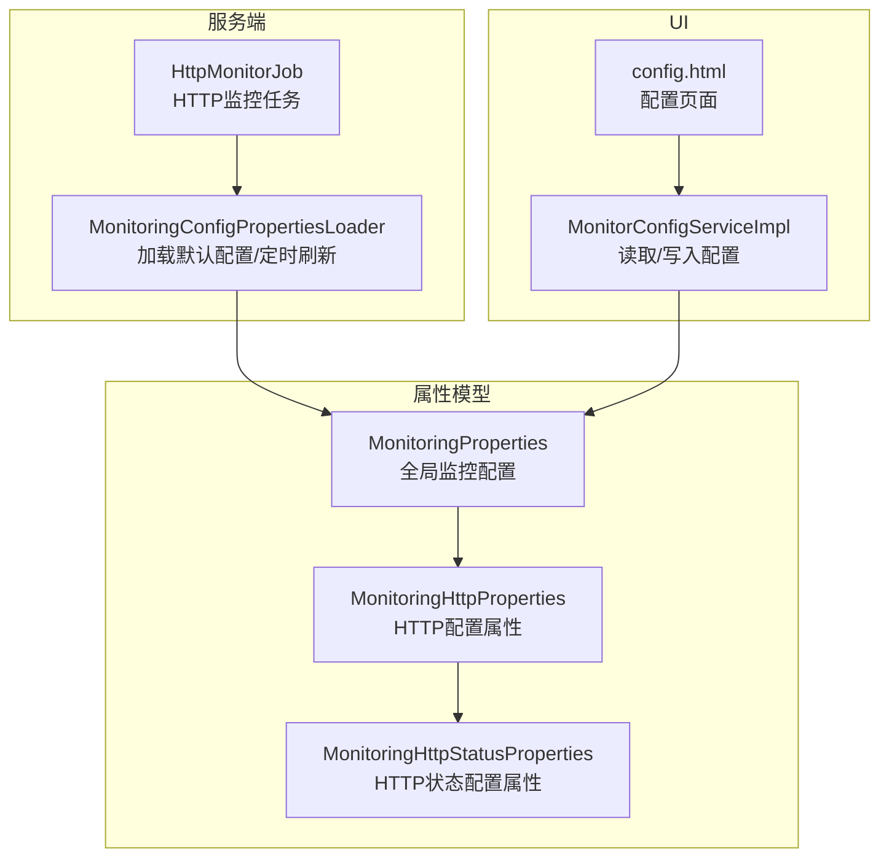
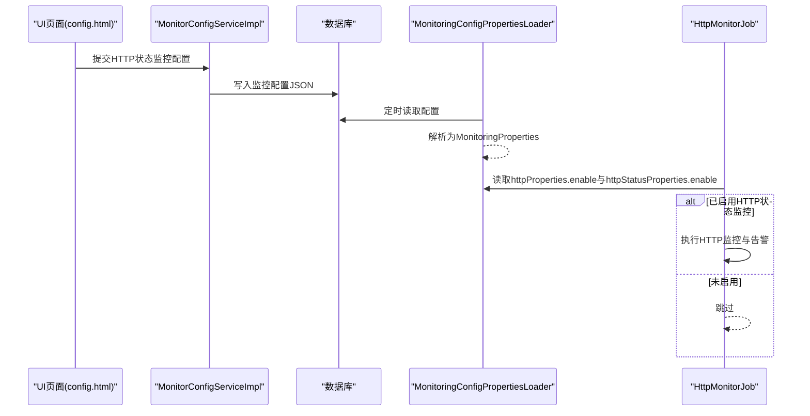
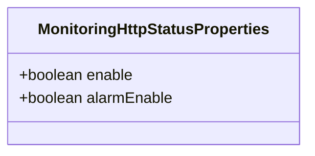
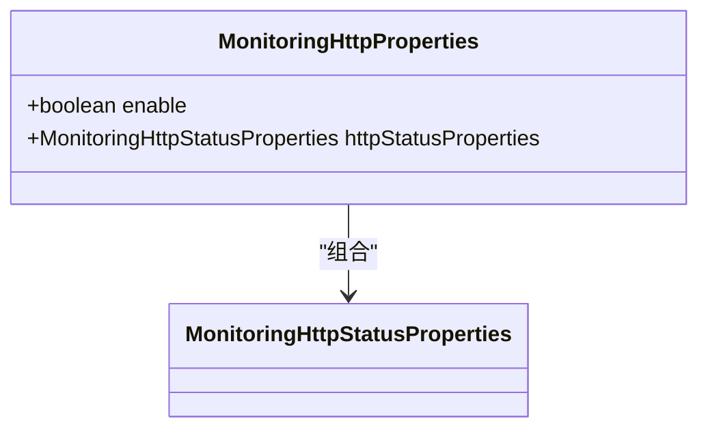
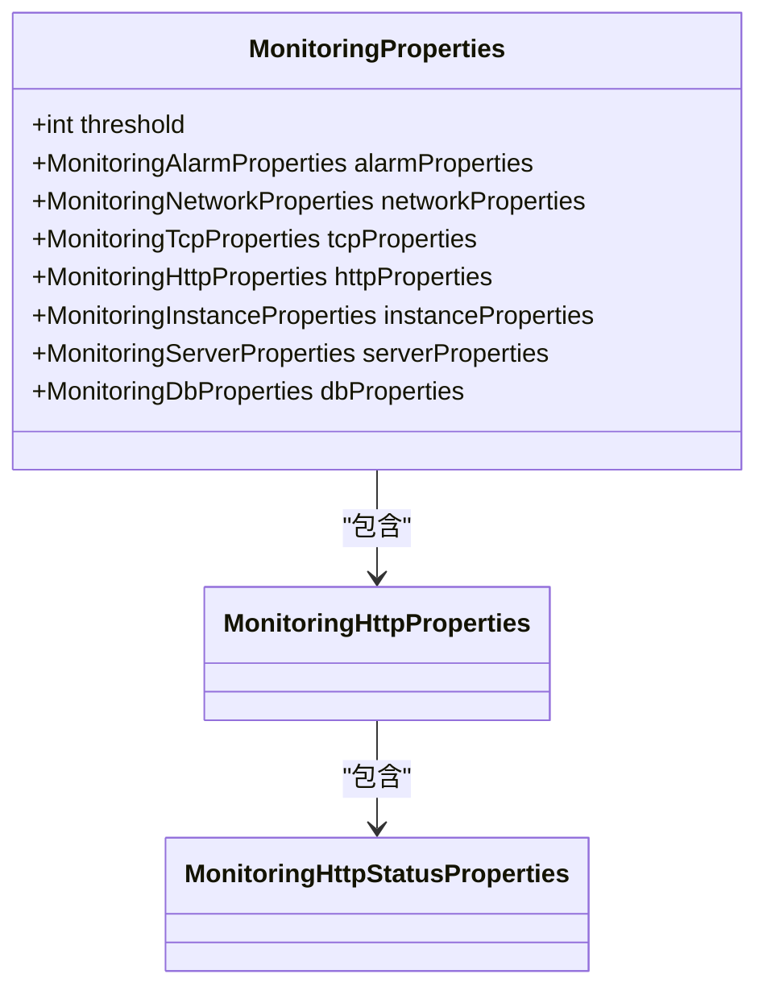
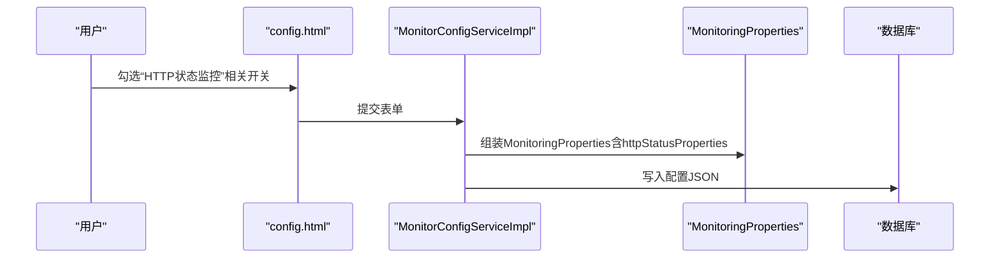
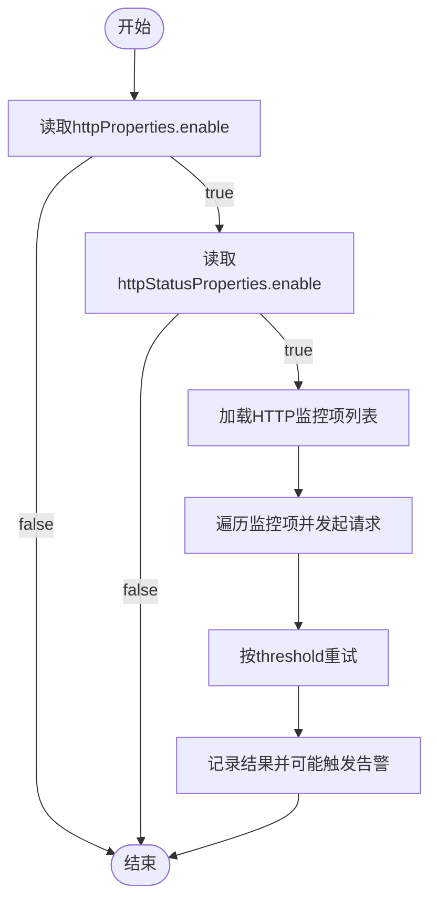
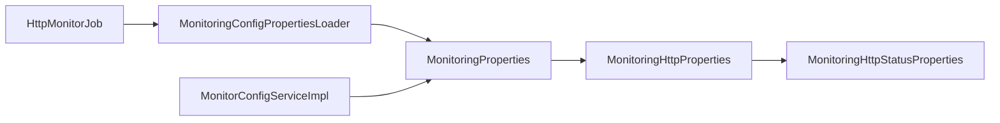

# HTTP状态监控参数

<cite>
**本文引用的文件**
- [MonitoringHttpStatusProperties.java](file://phoenix-common\phoenix-common-core\src\main\java\com\gitee\pifeng\monitoring\common\property\server\MonitoringHttpStatusProperties.java)
- [MonitoringHttpProperties.java](file://phoenix-common\phoenix-common-core\src\main\java\com\gitee\pifeng\monitoring\common\property\server\MonitoringHttpProperties.java)
- [MonitoringProperties.java](file://phoenix-common\phoenix-common-core\src\main\java\com\gitee\pifeng\monitoring\common\property\server\MonitoringProperties.java)
- [MonitoringConfigPropertiesLoader.java](file://phoenix-server\src\main\java\com\gitee\pifeng\monitoring\server\business\server\core\MonitoringConfigPropertiesLoader.java)
- [MonitorConfigServiceImpl.java](file://phoenix-ui\src\main\java\com\gitee\pifeng\monitoring\ui\business\web\service\impl\MonitorConfigServiceImpl.java)
- [HttpMonitorJob.java](file://phoenix-server\src\main\java\com\gitee\pifeng\monitoring\server\business\server\monitor\http\HttpMonitorJob.java)
- [config.html](file://phoenix-ui\src\main\resources\templates\set\config.html)
</cite>

## 目录
1. [简介](#简介)
2. [项目结构](#项目结构)
3. [核心组件](#核心组件)
4. [架构总览](#架构总览)
5. [详细组件分析](#详细组件分析)
6. [依赖关系分析](#依赖关系分析)
7. [性能考量](#性能考量)
8. [故障排查指南](#故障排查指南)
9. [结论](#结论)
10. [附录](#附录)

## 简介
本文件面向Phoenix监控系统中“HTTP状态监控”的配置与使用，聚焦于MonitoringHttpStatusProperties类及其在整体监控配置中的作用。当前仓库中HTTP状态监控参数仅包含两个布尔型开关：
- 是否监控HTTP状态（enable）
- 是否对HTTP状态告警（alarmEnable）

这些参数通过UI界面进行配置，由服务端加载并驱动HTTP监控任务执行。由于仓库中未提供HTTP慢请求阈值、状态码分类统计、可用性计算公式等扩展参数，本文将基于现有代码给出可操作的配置说明与最佳实践建议。

## 项目结构
围绕HTTP状态监控的关键文件分布如下：
- 属性模型层：MonitoringHttpStatusProperties、MonitoringHttpProperties、MonitoringProperties
- 服务端加载与调度：MonitoringConfigPropertiesLoader、HttpMonitorJob
- UI配置与持久化：MonitorConfigServiceImpl、config.html

图表来源
- [MonitoringHttpStatusProperties.java:18-30](file://phoenix-common\phoenix-common-core\src\main\java\com\gitee\pifeng\monitoring\common\property\server\MonitoringHttpStatusProperties.java#L18-L30)
- [MonitoringHttpProperties.java:18-30](file://phoenix-common\phoenix-common-core\src\main\java\com\gitee\pifeng\monitoring\common\property\server\MonitoringHttpProperties.java#L18-L30)
- [MonitoringProperties.java:19-61](file://phoenix-common\phoenix-common-core\src\main\java\com\gitee\pifeng\monitoring\common\property\server\MonitoringProperties.java#L19-L61)
- [MonitoringConfigPropertiesLoader.java:126-187](file://phoenix-server\src\main\java\com\gitee\pifeng\monitoring\server\business\server\core\MonitoringConfigPropertiesLoader.java#L126-L187)
- [MonitorConfigServiceImpl.java:175-182](file://phoenix-ui\src\main\java\com\gitee\pifeng\monitoring\ui\business\web\service\impl\MonitorConfigServiceImpl.java#L175-L182)
- [HttpMonitorJob.java:110-120](file://phoenix-server\src\main\java\com\gitee\pifeng\monitoring\server\business\server\monitor\http\HttpMonitorJob.java#L110-L120)
- [config.html:254-276](file://phoenix-ui\src\main\resources\templates\set\config.html#L254-L276)

章节来源
- [MonitoringHttpStatusProperties.java:1-31](file://phoenix-common\phoenix-common-core\src\main\java\com\gitee\pifeng\monitoring\common\property\server\MonitoringHttpStatusProperties.java#L1-L31)
- [MonitoringHttpProperties.java:1-31](file://phoenix-common\phoenix-common-core\src\main\java\com\gitee\pifeng\monitoring\common\property\server\MonitoringHttpProperties.java#L1-L31)
- [MonitoringProperties.java:1-62](file://phoenix-common\phoenix-common-core\src\main\java\com\gitee\pifeng\monitoring\common\property\server\MonitoringProperties.java#L1-L62)
- [MonitoringConfigPropertiesLoader.java:1-203](file://phoenix-server\src\main\java\com\gitee\pifeng\monitoring\server\business\server\core\MonitoringConfigPropertiesLoader.java#L1-L203)
- [MonitorConfigServiceImpl.java:1-282](file://phoenix-ui\src\main\java\com\gitee\pifeng\monitoring\ui\business\web\service\impl\MonitorConfigServiceImpl.java#L1-L282)
- [HttpMonitorJob.java:1-200](file://phoenix-server\src\main\java\com\gitee\pifeng\monitoring\server\business\server\monitor\http\HttpMonitorJob.java#L1-L200)
- [config.html:250-449](file://phoenix-ui\src\main\resources\templates\set\config.html#L250-L449)

## 核心组件
- MonitoringHttpStatusProperties
  - enable：控制是否启用HTTP状态监控
  - alarmEnable：控制HTTP状态监控是否触发告警
- MonitoringHttpProperties
  - enable：控制是否启用HTTP监控（包含状态监控）
  - httpStatusProperties：嵌套的HTTP状态监控配置对象
- MonitoringProperties
  - threshold：全局监控阈值（用于HTTP请求重试次数等逻辑）
  - httpProperties：HTTP监控配置入口

章节来源
- [MonitoringHttpStatusProperties.java:18-30](file://phoenix-common\phoenix-common-core\src\main\java\com\gitee\pifeng\monitoring\common\property\server\MonitoringHttpStatusProperties.java#L18-L30)
- [MonitoringHttpProperties.java:18-30](file://phoenix-common\phoenix-common-core\src\main\java\com\gitee\pifeng\monitoring\common\property\server\MonitoringHttpProperties.java#L18-L30)
- [MonitoringProperties.java:19-61](file://phoenix-common\phoenix-common-core\src\main\java\com\gitee\pifeng\monitoring\common\property\server\MonitoringProperties.java#L19-L61)

## 架构总览
HTTP状态监控的配置与执行流程如下：
- UI页面展示“HTTP状态监控”开关（是否监控、是否告警），提交后写入数据库
- 服务端定时加载配置，生成默认配置（含HTTP状态监控默认开启）
- HTTP监控任务根据配置决定是否执行监控与告警

图表来源
- [config.html:254-276](file://phoenix-ui\src\main\resources\templates\set\config.html#L254-L276)
- [MonitorConfigServiceImpl.java:175-182](file://phoenix-ui\src\main\java\com\gitee\pifeng\monitoring\ui\business\web\service\impl\MonitorConfigServiceImpl.java#L175-L182)
- [MonitoringConfigPropertiesLoader.java:126-187](file://phoenix-server\src\main\java\com\gitee\pifeng\monitoring\server\business\server\core\MonitoringConfigPropertiesLoader.java#L126-L187)
- [HttpMonitorJob.java:110-120](file://phoenix-server\src\main\java\com\gitee\pifeng\monitoring\server\business\server\monitor\http\HttpMonitorJob.java#L110-L120)

## 详细组件分析

### MonitoringHttpStatusProperties 类分析
该类定义了HTTP状态监控的两个关键布尔参数：
- enable：是否监控HTTP状态
- alarmEnable：是否对HTTP状态告警

图表来源
- [MonitoringHttpStatusProperties.java:18-30](file://phoenix-common\phoenix-common-core\src\main\java\com\gitee\pifeng\monitoring\common\property\server\MonitoringHttpStatusProperties.java#L18-L30)

章节来源
- [MonitoringHttpStatusProperties.java:1-31](file://phoenix-common\phoenix-common-core\src\main\java\com\gitee\pifeng\monitoring\common\property\server\MonitoringHttpStatusProperties.java#L1-L31)

### MonitoringHttpProperties 类分析
该类包含HTTP监控总开关与HTTP状态监控子配置：
- enable：是否启用HTTP监控
- httpStatusProperties：HTTP状态监控配置对象

图表来源
- [MonitoringHttpProperties.java:18-30](file://phoenix-common\phoenix-common-core\src\main\java\com\gitee\pifeng\monitoring\common\property\server\MonitoringHttpProperties.java#L18-L30)

章节来源
- [MonitoringHttpProperties.java:1-31](file://phoenix-common\phoenix-common-core\src\main\java\com\gitee\pifeng\monitoring\common\property\server\MonitoringHttpProperties.java#L1-L31)

### MonitoringProperties 与默认配置加载
- threshold：全局阈值，用于HTTP请求重试等逻辑
- httpProperties：HTTP监控配置入口
- 默认配置加载器会设置HTTP状态监控默认开启（enable=true, alarmEnable=true）

图表来源
- [MonitoringProperties.java:19-61](file://phoenix-common\phoenix-common-core\src\main\java\com\gitee\pifeng\monitoring\common\property\server\MonitoringProperties.java#L19-L61)
- [MonitoringConfigPropertiesLoader.java:126-187](file://phoenix-server\src\main\java\com\gitee\pifeng\monitoring\server\business\server\core\MonitoringConfigPropertiesLoader.java#L126-L187)

章节来源
- [MonitoringProperties.java:1-62](file://phoenix-common\phoenix-common-core\src\main\java\com\gitee\pifeng\monitoring\common\property\server\MonitoringProperties.java#L1-L62)
- [MonitoringConfigPropertiesLoader.java:126-187](file://phoenix-server\src\main\java\com\gitee\pifeng\monitoring\server\business\server\core\MonitoringConfigPropertiesLoader.java#L126-L187)

### UI配置与持久化
- UI页面提供“HTTP状态监控”开关（是否监控、是否告警）
- MonitorConfigServiceImpl将页面表单映射为MonitoringProperties并写入数据库
- 页面字段与属性对象的映射关系明确

图表来源
- [config.html:254-276](file://phoenix-ui\src\main\resources\templates\set\config.html#L254-L276)
- [MonitorConfigServiceImpl.java:175-182](file://phoenix-ui\src\main\java\com\gitee\pifeng\monitoring\ui\business\web\service\impl\MonitorConfigServiceImpl.java#L175-L182)

章节来源
- [config.html:250-449](file://phoenix-ui\src\main\resources\templates\set\config.html#L250-L449)
- [MonitorConfigServiceImpl.java:63-119](file://phoenix-ui\src\main\java\com\gitee\pifeng\monitoring\ui\business\web\service\impl\MonitorConfigServiceImpl.java#L63-L119)
- [MonitorConfigServiceImpl.java:135-282](file://phoenix-ui\src\main\java\com\gitee\pifeng\monitoring\ui\business\web\service\impl\MonitorConfigServiceImpl.java#L135-L282)

### HTTP监控任务执行流程
- HttpMonitorJob根据配置判断是否执行HTTP监控
- 若启用HTTP状态监控，则遍历HTTP监控项并发起请求
- 请求重试次数受全局threshold影响

图表来源
- [HttpMonitorJob.java:110-120](file://phoenix-server\src\main\java\com\gitee\pifeng\monitoring\server\business\server\monitor\http\HttpMonitorJob.java#L110-L120)
- [HttpMonitorJob.java:198-200](file://phoenix-server\src\main\java\com\gitee\pifeng\monitoring\server\business\server\monitor\http\HttpMonitorJob.java#L198-L200)

章节来源
- [HttpMonitorJob.java:109-159](file://phoenix-server\src\main\java\com\gitee\pifeng\monitoring\server\business\server\monitor\http\HttpMonitorJob.java#L109-L159)
- [MonitoringConfigPropertiesLoader.java:148-151](file://phoenix-server\src\main\java\com\gitee\pifeng\monitoring\server\business\server\core\MonitoringConfigPropertiesLoader.java#L148-L151)

## 依赖关系分析
- MonitoringProperties 组合 MonitoringHttpProperties
- MonitoringHttpProperties 组合 MonitoringHttpStatusProperties
- MonitoringConfigPropertiesLoader 默认设置HTTP状态监控为启用
- HttpMonitorJob 依赖 MonitoringConfigPropertiesLoader 的配置
- MonitorConfigServiceImpl 将UI表单映射为 MonitoringProperties 并持久化

图表来源
- [MonitoringProperties.java:19-61](file://phoenix-common\phoenix-common-core\src\main\java\com\gitee\pifeng\monitoring\common\property\server\MonitoringProperties.java#L19-L61)
- [MonitoringHttpProperties.java:18-30](file://phoenix-common\phoenix-common-core\src\main\java\com\gitee\pifeng\monitoring\common\property\server\MonitoringHttpProperties.java#L18-L30)
- [MonitoringHttpStatusProperties.java:18-30](file://phoenix-common\phoenix-common-core\src\main\java\com\gitee\pifeng\monitoring\common\property\server\MonitoringHttpStatusProperties.java#L18-L30)
- [MonitoringConfigPropertiesLoader.java:126-187](file://phoenix-server\src\main\java\com\gitee\pifeng\monitoring\server\business\server\core\MonitoringConfigPropertiesLoader.java#L126-L187)
- [HttpMonitorJob.java:110-120](file://phoenix-server\src\main\java\com\gitee\pifeng\monitoring\server\business\server\monitor\http\HttpMonitorJob.java#L110-L120)
- [MonitorConfigServiceImpl.java:175-182](file://phoenix-ui\src\main\java\com\gitee\pifeng\monitoring\ui\business\web\service\impl\MonitorConfigServiceImpl.java#L175-L182)

章节来源
- [MonitoringProperties.java:1-62](file://phoenix-common\phoenix-common-core\src\main\java\com\gitee\pifeng\monitoring\common\property\server\MonitoringProperties.java#L1-L62)
- [MonitoringHttpProperties.java:1-31](file://phoenix-common\phoenix-common-core\src\main\java\com\gitee\pifeng\monitoring\common\property\server\MonitoringHttpProperties.java#L1-L31)
- [MonitoringHttpStatusProperties.java:1-31](file://phoenix-common\phoenix-common-core\src\main\java\com\gitee\pifeng\monitoring\common\property\server\MonitoringHttpStatusProperties.java#L1-L31)
- [MonitoringConfigPropertiesLoader.java:1-203](file://phoenix-server\src\main\java\com\gitee\pifeng\monitoring\server\business\server\core\MonitoringConfigPropertiesLoader.java#L1-L203)
- [MonitorConfigServiceImpl.java:1-282](file://phoenix-ui\src\main\java\com\gitee\pifeng\monitoring\ui\business\web\service\impl\MonitorConfigServiceImpl.java#L1-L282)
- [HttpMonitorJob.java:1-200](file://phoenix-server\src\main\java\com\gitee\pifeng\monitoring\server\business\server\monitor\http\HttpMonitorJob.java#L1-L200)

## 性能考量
- 多线程并发：HTTP监控任务通过线程池并发处理多个监控项，提升吞吐
- 分片处理：将监控项按固定大小分组，避免单批过大导致阻塞
- 重试策略：受全局阈值影响，合理设置可平衡稳定性与响应时间

章节来源
- [HttpMonitorJob.java:127-154](file://phoenix-server\src\main\java\com\gitee\pifeng\monitoring\server\business\server\monitor\http\HttpMonitorJob.java#L127-L154)

## 故障排查指南
- 配置未生效
  - 检查UI页面是否正确勾选“HTTP状态监控”相关开关
  - 确认MonitorConfigServiceImpl已将配置写入数据库
  - 验证MonitoringConfigPropertiesLoader是否成功解析并加载配置
- 监控未执行
  - 确认HttpMonitorJob读取到的httpProperties.enable与httpStatusProperties.enable均为true
  - 检查服务端定时任务是否正常运行
- 告警未触发
  - 确认alarmEnable为true
  - 检查告警服务是否正常工作

章节来源
- [config.html:254-276](file://phoenix-ui\src\main\resources\templates\set\config.html#L254-L276)
- [MonitorConfigServiceImpl.java:175-182](file://phoenix-ui\src\main\java\com\gitee\pifeng\monitoring\ui\business\web\service\impl\MonitorConfigServiceImpl.java#L175-L182)
- [MonitoringConfigPropertiesLoader.java:126-187](file://phoenix-server\src\main\java\com\gitee\pifeng\monitoring\server\business\server\core\MonitoringConfigPropertiesLoader.java#L126-L187)
- [HttpMonitorJob.java:110-120](file://phoenix-server\src\main\java\com\gitee\pifeng\monitoring\server\business\server\monitor\http\HttpMonitorJob.java#L110-L120)

## 结论
- 当前仓库中HTTP状态监控参数仅包含两个布尔开关，分别控制“是否监控HTTP状态”和“是否对HTTP状态告警”
- UI与服务端均提供了完善的配置读取、写入与加载机制
- 由于未提供慢请求阈值、状态码分类统计、可用性计算公式等扩展参数，建议在实际部署中结合业务需求评估是否需要扩展或自定义实现

## 附录
- 配置最佳实践
  - 开启HTTP状态监控（enable=true）以覆盖基础可用性观测
  - 开启HTTP状态告警（alarmEnable=true）以便快速发现问题
  - 合理设置全局阈值（threshold），兼顾稳定性与响应速度
  - 定期检查监控任务执行日志，确保监控链路健康