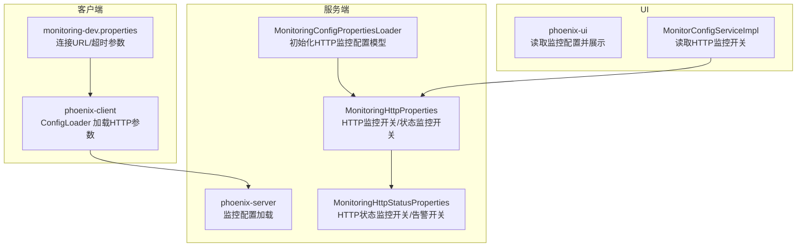
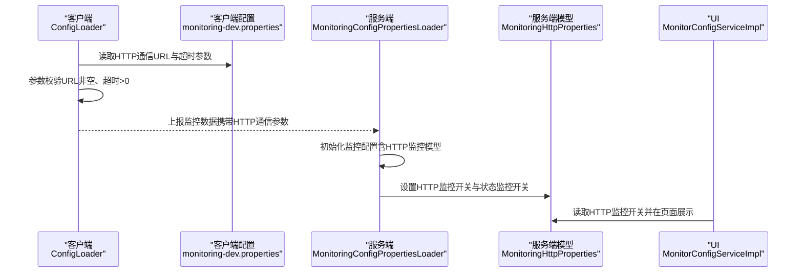
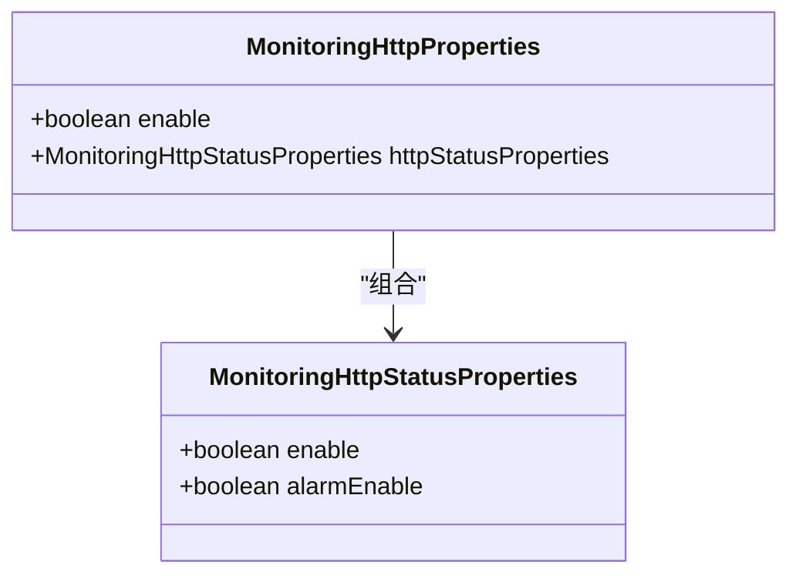
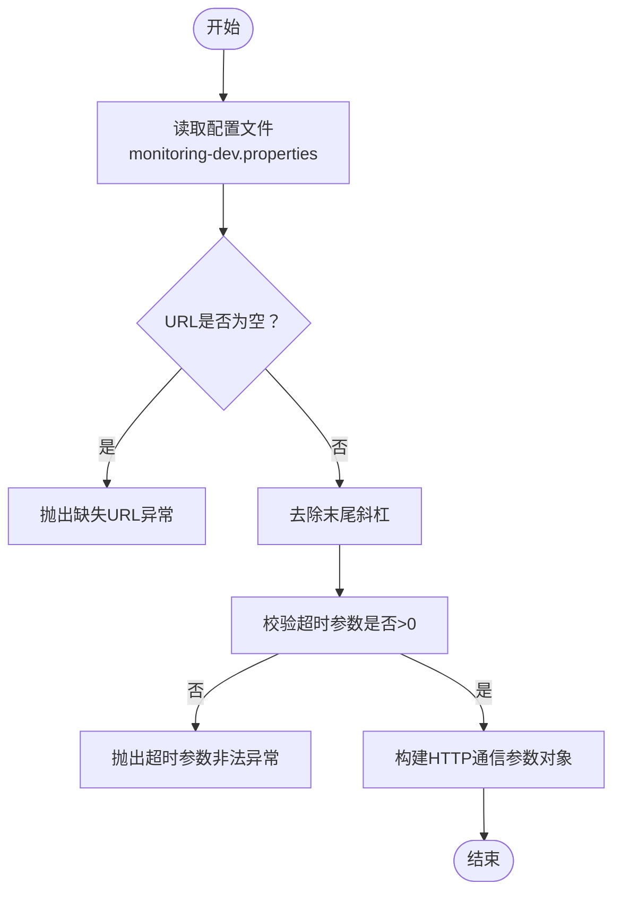
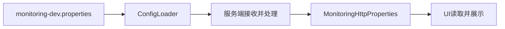

# HTTP监控参数

<cite>
**本文引用的文件**
- [MonitoringHttpProperties.java](file://phoenix-common/phoenix-common-core/src/main/java/com/gitee/pifeng/monitoring/common/property/server/MonitoringHttpProperties.java)
- [MonitoringHttpStatusProperties.java](file://phoenix-common/phoenix-common-core/src/main/java/com/gitee/pifeng/monitoring/common/property/server/MonitoringHttpStatusProperties.java)
- [ConfigLoader.java](file://phoenix-client/phoenix-client-core/src/main/java/com/gitee/pifeng/monitoring/plug/core/ConfigLoader.java)
- [monitoring-dev.properties（phoenix-agent）](file://phoenix-agent/src/main/resources/monitoring-dev.properties)
- [monitoring-dev.properties（phoenix-server）](file://phoenix-server/src/main/resources/monitoring-dev.properties)
- [monitoring-dev.properties（phoenix-ui）](file://phoenix-ui/src/main/resources/monitoring-dev.properties)
- [MonitoringConfigPropertiesLoader.java](file://phoenix-server/src/main/java/com/gitee/pifeng/monitoring/server/business/server/core/MonitoringConfigPropertiesLoader.java)
- [MonitorConfigServiceImpl.java](file://phoenix-ui/src/main/java/com/gitee/pifeng/monitoring/ui/business/web/service/impl/MonitorConfigServiceImpl.java)
</cite>

## 目录
1. [简介](#简介)
2. [项目结构](#项目结构)
3. [核心组件](#核心组件)
4. [架构总览](#架构总览)
5. [详细组件分析](#详细组件分析)
6. [依赖关系分析](#依赖关系分析)
7. [性能考量](#性能考量)
8. [故障排查指南](#故障排查指南)
9. [结论](#结论)
10. [附录](#附录)

## 简介
本文围绕Phoenix监控系统中的“HTTP监控参数”展开，聚焦于服务端侧的HTTP监控配置模型与客户端侧的HTTP通信参数加载流程，帮助读者理解并正确配置以下内容：
- HTTP请求监控开关与状态监控开关
- 响应时间阈值与错误率监控的配置入口
- HTTP请求超时设置（连接超时、等待数据超时、连接池获取超时）
- 并发连接与连接池相关参数的来源与影响
- 配置最佳实践与调优建议

## 项目结构
Phoenix监控系统由三端组成：Agent（采集端）、Server（服务端）、UI（可视化界面）。HTTP监控参数在服务端以配置模型的形式存在，客户端通过配置文件加载HTTP通信参数，最终用于向服务端上报监控数据。

图表来源
- [ConfigLoader.java:388-423](file://phoenix-client/phoenix-client-core/src/main/java/com/gitee/pifeng/monitoring/plug/core/ConfigLoader.java#L388-L423)
- [monitoring-dev.properties（phoenix-agent）:10-17](file://phoenix-agent/src/main/resources/monitoring-dev.properties#L10-L17)
- [MonitoringConfigPropertiesLoader.java:144-162](file://phoenix-server/src/main/java/com/gitee/pifeng/monitoring/server/business/server/core/MonitoringConfigPropertiesLoader.java#L144-L162)
- [MonitoringHttpProperties.java:18-30](file://phoenix-common/phoenix-common-core/src/main/java/com/gitee/pifeng/monitoring/common/property/server/MonitoringHttpProperties.java#L18-L30)
- [MonitoringHttpStatusProperties.java:18-30](file://phoenix-common/phoenix-common-core/src/main/java/com/gitee/pifeng/monitoring/common/property/server/MonitoringHttpStatusProperties.java#L18-L30)
- [MonitorConfigServiceImpl.java:65-76](file://phoenix-ui/src/main/java/com/gitee/pifeng/monitoring/ui/business/web/service/impl/MonitorConfigServiceImpl.java#L65-L76)

章节来源
- [ConfigLoader.java:388-423](file://phoenix-client/phoenix-client-core/src/main/java/com/gitee/pifeng/monitoring/plug/core/ConfigLoader.java#L388-L423)
- [monitoring-dev.properties（phoenix-agent）:10-17](file://phoenix-agent/src/main/resources/monitoring-dev.properties#L10-L17)
- [MonitoringConfigPropertiesLoader.java:144-162](file://phoenix-server/src/main/java/com/gitee/pifeng/monitoring/server/business/server/core/MonitoringConfigPropertiesLoader.java#L144-L162)
- [MonitoringHttpProperties.java:18-30](file://phoenix-common/phoenix-common-core/src/main/java/com/gitee/pifeng/monitoring/common/property/server/MonitoringHttpProperties.java#L18-L30)
- [MonitoringHttpStatusProperties.java:18-30](file://phoenix-common/phoenix-common-core/src/main/java/com/gitee/pifeng/monitoring/common/property/server/MonitoringHttpStatusProperties.java#L18-L30)
- [MonitorConfigServiceImpl.java:65-76](file://phoenix-ui/src/main/java/com/gitee/pifeng/monitoring/ui/business/web/service/impl/MonitorConfigServiceImpl.java#L65-L76)

## 核心组件
- 服务端HTTP监控配置模型
  - MonitoringHttpProperties：定义HTTP监控总开关与HTTP状态监控配置对象
  - MonitoringHttpStatusProperties：定义HTTP状态监控开关与告警开关
- 客户端HTTP通信参数加载
  - ConfigLoader：从配置文件读取HTTP通信URL与超时参数，并进行校验
- UI层配置读取
  - MonitorConfigServiceImpl：从监控配置中读取HTTP监控开关并在页面展示

章节来源
- [MonitoringHttpProperties.java:18-30](file://phoenix-common/phoenix-common-core/src/main/java/com/gitee/pifeng/monitoring/common/property/server/MonitoringHttpProperties.java#L18-L30)
- [MonitoringHttpStatusProperties.java:18-30](file://phoenix-common/phoenix-common-core/src/main/java/com/gitee/pifeng/monitoring/common/property/server/MonitoringHttpStatusProperties.java#L18-L30)
- [ConfigLoader.java:388-423](file://phoenix-client/phoenix-client-core/src/main/java/com/gitee/pifeng/monitoring/plug/core/ConfigLoader.java#L388-L423)
- [MonitorConfigServiceImpl.java:65-76](file://phoenix-ui/src/main/java/com/gitee/pifeng/monitoring/ui/business/web/service/impl/MonitorConfigServiceImpl.java#L65-L76)

## 架构总览
下图展示了HTTP监控参数在客户端与服务端之间的流转关系，以及UI层对配置的读取。

图表来源
- [ConfigLoader.java:388-423](file://phoenix-client/phoenix-client-core/src/main/java/com/gitee/pifeng/monitoring/plug/core/ConfigLoader.java#L388-L423)
- [monitoring-dev.properties（phoenix-agent）:10-17](file://phoenix-agent/src/main/resources/monitoring-dev.properties#L10-L17)
- [MonitoringConfigPropertiesLoader.java:144-162](file://phoenix-server/src/main/java/com/gitee/pifeng/monitoring/server/business/server/core/MonitoringConfigPropertiesLoader.java#L144-L162)
- [MonitoringHttpProperties.java:18-30](file://phoenix-common/phoenix-common-core/src/main/java/com/gitee/pifeng/monitoring/common/property/server/MonitoringHttpProperties.java#L18-L30)
- [MonitorConfigServiceImpl.java:65-76](file://phoenix-ui/src/main/java/com/gitee/pifeng/monitoring/ui/business/web/service/impl/MonitorConfigServiceImpl.java#L65-L76)

## 详细组件分析

### 服务端HTTP监控配置模型
- MonitoringHttpProperties
  - enable：HTTP监控总开关
  - httpStatusProperties：HTTP状态监控配置对象
- MonitoringHttpStatusProperties
  - enable：HTTP状态监控开关
  - alarmEnable：HTTP状态监控告警开关

图表来源
- [MonitoringHttpProperties.java:18-30](file://phoenix-common/phoenix-common-core/src/main/java/com/gitee/pifeng/monitoring/common/property/server/MonitoringHttpProperties.java#L18-L30)
- [MonitoringHttpStatusProperties.java:18-30](file://phoenix-common/phoenix-common-core/src/main/java/com/gitee/pifeng/monitoring/common/property/server/MonitoringHttpStatusProperties.java#L18-L30)

章节来源
- [MonitoringHttpProperties.java:18-30](file://phoenix-common/phoenix-common-core/src/main/java/com/gitee/pifeng/monitoring/common/property/server/MonitoringHttpProperties.java#L18-L30)
- [MonitoringHttpStatusProperties.java:18-30](file://phoenix-common/phoenix-common-core/src/main/java/com/gitee/pifeng/monitoring/common/property/server/MonitoringHttpStatusProperties.java#L18-L30)

### 客户端HTTP通信参数加载与校验
- ConfigLoader负责从配置文件读取HTTP通信参数，并进行必要校验：
  - 必填项：HTTP通信URL
  - 超时参数：连接超时、等待数据超时、连接池获取超时，均需大于0
  - URL末尾斜杠处理：去除末尾斜杠
- 对应配置项（来自各端的monitoring-dev.properties）：
  - monitoring.comm.http.url：HTTP通信URL
  - monitoring.comm.http.connect-timeout：连接超时（毫秒）
  - monitoring.comm.http.socket-timeout：等待数据超时（毫秒）
  - monitoring.comm.http.connection-request-timeout：从连接池获取连接的等待超时（毫秒）

图表来源
- [ConfigLoader.java:388-423](file://phoenix-client/phoenix-client-core/src/main/java/com/gitee/pifeng/monitoring/plug/core/ConfigLoader.java#L388-L423)
- [monitoring-dev.properties（phoenix-agent）:10-17](file://phoenix-agent/src/main/resources/monitoring-dev.properties#L10-L17)
- [monitoring-dev.properties（phoenix-server）:10-17](file://phoenix-server/src/main/resources/monitoring-dev.properties#L10-L17)
- [monitoring-dev.properties（phoenix-ui）:10-17](file://phoenix-ui/src/main/resources/monitoring-dev.properties#L10-L17)

章节来源
- [ConfigLoader.java:388-423](file://phoenix-client/phoenix-client-core/src/main/java/com/gitee/pifeng/monitoring/plug/core/ConfigLoader.java#L388-L423)
- [monitoring-dev.properties（phoenix-agent）:10-17](file://phoenix-agent/src/main/resources/monitoring-dev.properties#L10-L17)
- [monitoring-dev.properties（phoenix-server）:10-17](file://phoenix-server/src/main/resources/monitoring-dev.properties#L10-L17)
- [monitoring-dev.properties（phoenix-ui）:10-17](file://phoenix-ui/src/main/resources/monitoring-dev.properties#L10-L17)

### UI层对HTTP监控开关的读取
- MonitorConfigServiceImpl从监控配置中读取HTTP监控开关，并映射到页面表单对象，用于前端展示与编辑。

章节来源
- [MonitorConfigServiceImpl.java:65-76](file://phoenix-ui/src/main/java/com/gitee/pifeng/monitoring/ui/business/web/service/impl/MonitorConfigServiceImpl.java#L65-L76)

### 服务端初始化HTTP监控配置
- MonitoringConfigPropertiesLoader在服务端初始化监控配置时，会创建HTTP监控配置模型并设置默认值（例如开启HTTP监控与HTTP状态监控，并开启告警）。

章节来源
- [MonitoringConfigPropertiesLoader.java:144-162](file://phoenix-server/src/main/java/com/gitee/pifeng/monitoring/server/business/server/core/MonitoringConfigPropertiesLoader.java#L144-L162)

## 依赖关系分析
- 客户端依赖配置文件提供的HTTP通信参数，ConfigLoader负责解析与校验
- 服务端通过配置加载器初始化HTTP监控模型，供后续监控逻辑使用
- UI层读取服务端配置并展示HTTP监控开关

图表来源
- [monitoring-dev.properties（phoenix-agent）:10-17](file://phoenix-agent/src/main/resources/monitoring-dev.properties#L10-L17)
- [ConfigLoader.java:388-423](file://phoenix-client/phoenix-client-core/src/main/java/com/gitee/pifeng/monitoring/plug/core/ConfigLoader.java#L388-L423)
- [MonitoringHttpProperties.java:18-30](file://phoenix-common/phoenix-common-core/src/main/java/com/gitee/pifeng/monitoring/common/property/server/MonitoringHttpProperties.java#L18-L30)
- [MonitorConfigServiceImpl.java:65-76](file://phoenix-ui/src/main/java/com/gitee/pifeng/monitoring/ui/business/web/service/impl/MonitorConfigServiceImpl.java#L65-L76)

章节来源
- [monitoring-dev.properties（phoenix-agent）:10-17](file://phoenix-agent/src/main/resources/monitoring-dev.properties#L10-L17)
- [ConfigLoader.java:388-423](file://phoenix-client/phoenix-client-core/src/main/java/com/gitee/pifeng/monitoring/plug/core/ConfigLoader.java#L388-L423)
- [MonitoringHttpProperties.java:18-30](file://phoenix-common/phoenix-common-core/src/main/java/com/gitee/pifeng/monitoring/common/property/server/MonitoringHttpProperties.java#L18-L30)
- [MonitorConfigServiceImpl.java:65-76](file://phoenix-ui/src/main/java/com/gitee/pifeng/monitoring/ui/business/web/service/impl/MonitorConfigServiceImpl.java#L65-L76)

## 性能考量
- 超时参数设置
  - 连接超时：决定建立TCP连接的最长等待时间，过小可能导致网络抖动时频繁失败，过大则影响故障发现速度
  - 等待数据超时：决定从远端读取响应的最长等待时间，应结合业务接口平均耗时与SLA合理设置
  - 连接池获取超时：决定从连接池借用连接的最长等待时间，避免在高并发场景下因连接池枯竭导致排队
- 连接池与并发
  - 客户端侧的连接池大小与最大并发由底层HTTP客户端实现决定，需结合服务端处理能力与资源限制进行调优
  - 若服务端存在限流或熔断策略，应在客户端适当降低并发或增加重试退避
- 日志与可观测性
  - 适当提高与HTTP通信相关的日志级别有助于定位超时与连接问题，但需平衡日志开销

## 故障排查指南
- 常见问题与定位
  - 缺失HTTP通信URL：客户端在加载配置时会校验URL非空，若为空将抛出异常
  - 超时参数非法：连接超时、等待数据超时、连接池获取超时必须大于0，否则抛出异常
  - URL末尾斜杠：客户端会自动去除末尾斜杠，确保路径拼接正确
- 排查步骤
  - 检查monitoring-dev.properties中的URL与超时参数
  - 关注客户端启动日志中关于配置加载与异常提示
  - 在服务端确认HTTP监控模型已正确初始化（enable与alarmEnable）
  - 使用UI层查看HTTP监控开关状态，确认配置生效

章节来源
- [ConfigLoader.java:388-423](file://phoenix-client/phoenix-client-core/src/main/java/com/gitee/pifeng/monitoring/plug/core/ConfigLoader.java#L388-L423)
- [monitoring-dev.properties（phoenix-agent）:10-17](file://phoenix-agent/src/main/resources/monitoring-dev.properties#L10-L17)
- [MonitoringConfigPropertiesLoader.java:144-162](file://phoenix-server/src/main/java/com/gitee/pifeng/monitoring/server/business/server/core/MonitoringConfigPropertiesLoader.java#L144-L162)
- [MonitorConfigServiceImpl.java:65-76](file://phoenix-ui/src/main/java/com/gitee/pifeng/monitoring/ui/business/web/service/impl/MonitorConfigServiceImpl.java#L65-L76)

## 结论
- Phoenix监控系统的服务端提供了HTTP监控配置模型（MonitoringHttpProperties与MonitoringHttpStatusProperties），用于统一管理HTTP监控总开关与状态监控告警开关
- 客户端通过monitoring-dev.properties提供HTTP通信参数，ConfigLoader负责解析与校验，保障上报链路稳定
- UI层可读取HTTP监控开关，便于运维人员在界面上进行配置与核验
- 实际部署中，应结合业务SLA与服务端承载能力，合理设置超时参数与并发策略，以获得更可靠的HTTP监控效果

## 附录

### HTTP监控参数清单与说明
- 服务端配置模型
  - MonitoringHttpProperties.enable：HTTP监控总开关
  - MonitoringHttpStatusProperties.enable：HTTP状态监控开关
  - MonitoringHttpStatusProperties.alarmEnable：HTTP状态监控告警开关
- 客户端配置项（来自monitoring-dev.properties）
  - monitoring.comm.http.url：HTTP通信URL
  - monitoring.comm.http.connect-timeout：连接超时（毫秒）
  - monitoring.comm.http.socket-timeout：等待数据超时（毫秒）
  - monitoring.comm.http.connection-request-timeout：从连接池获取连接的等待超时（毫秒）

章节来源
- [MonitoringHttpProperties.java:18-30](file://phoenix-common/phoenix-common-core/src/main/java/com/gitee/pifeng/monitoring/common/property/server/MonitoringHttpProperties.java#L18-L30)
- [MonitoringHttpStatusProperties.java:18-30](file://phoenix-common/phoenix-common-core/src/main/java/com/gitee/pifeng/monitoring/common/property/server/MonitoringHttpStatusProperties.java#L18-L30)
- [monitoring-dev.properties（phoenix-agent）:10-17](file://phoenix-agent/src/main/resources/monitoring-dev.properties#L10-L17)
- [monitoring-dev.properties（phoenix-server）:10-17](file://phoenix-server/src/main/resources/monitoring-dev.properties#L10-L17)
- [monitoring-dev.properties（phoenix-ui）:10-17](file://phoenix-ui/src/main/resources/monitoring-dev.properties#L10-L17)