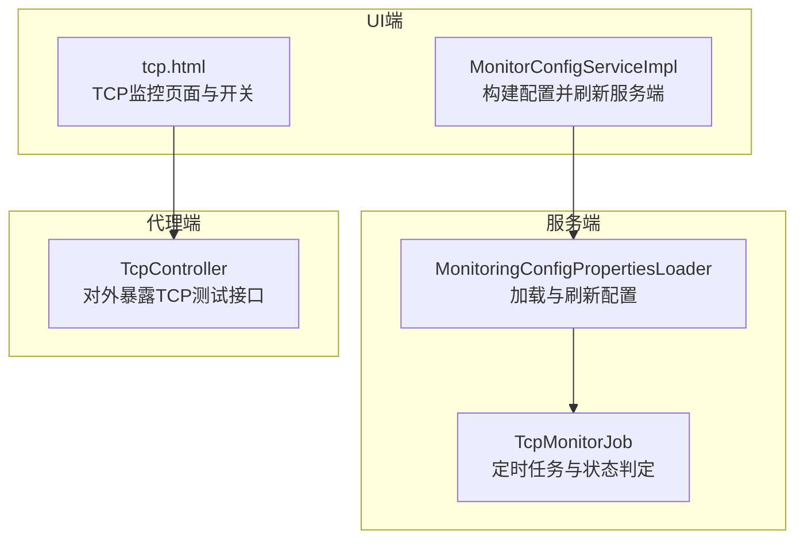
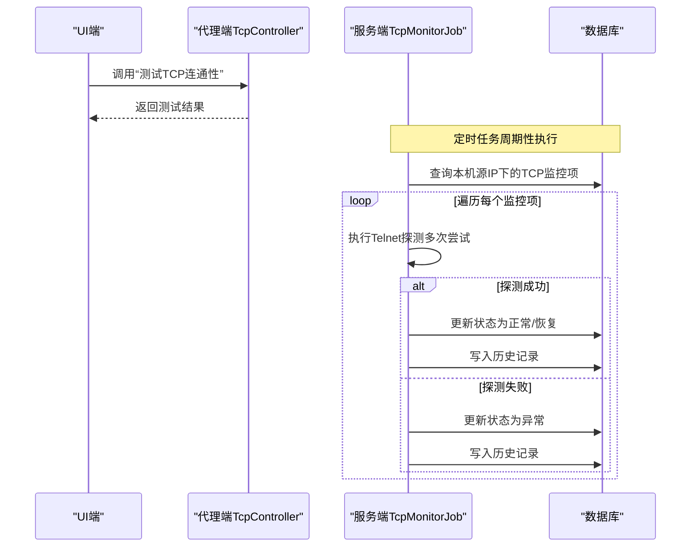
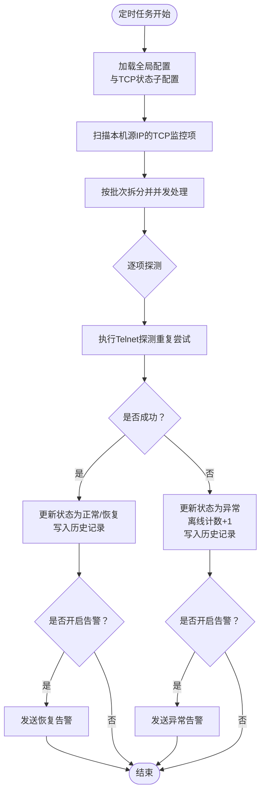
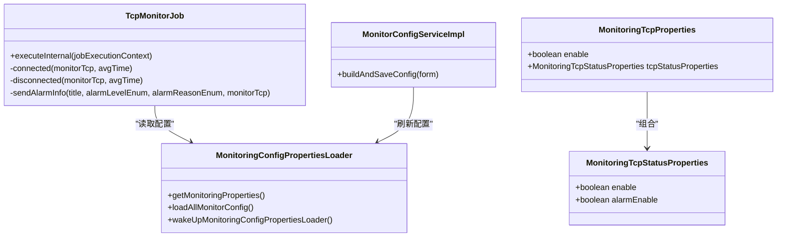

# TCP状态监控参数

<cite>
**本文引用的文件**
- [MonitoringTcpStatusProperties.java](file://phoenix-common\phoenix-common-core\src\main\java\com\gitee\pifeng\monitoring\common\property\server\MonitoringTcpStatusProperties.java)
- [MonitoringTcpProperties.java](file://phoenix-common\phoenix-common-core\src\main\java\com\gitee\pifeng\monitoring\common\property\server\MonitoringTcpProperties.java)
- [TcpMonitorJob.java](file://phoenix-server\src\main\java\com\gitee\pifeng\monitoring\server\business\server\monitor\tcp\TcpMonitorJob.java)
- [MonitoringConfigPropertiesLoader.java](file://phoenix-server\src\main\java\com\gitee\pifeng\monitoring\server\business\server\core\MonitoringConfigPropertiesLoader.java)
- [MonitorConfigServiceImpl.java](file://phoenix-ui\src\main\java\com\gitee\pifeng\monitoring\ui\business\web\service\impl\MonitorConfigServiceImpl.java)
- [TcpController.java](file://phoenix-agent\src\main\java\com\gitee\pifeng\monitoring\agent\business\client\controller\TcpController.java)
- [tcp.html](file://phoenix-ui\src\main\resources\templates\tcp\tcp.html)
- [application.yml（服务端）](file://phoenix-server\src\main\resources\application.yml)
- [application.yml（UI端）](file://phoenix-ui\src\main\resources\application.yml)
</cite>

## 目录
1. [简介](#简介)
2. [项目结构](#项目结构)
3. [核心组件](#核心组件)
4. [架构总览](#架构总览)
5. [详细组件分析](#详细组件分析)
6. [依赖关系分析](#依赖关系分析)
7. [性能考量](#性能考量)
8. [故障排查指南](#故障排查指南)
9. [结论](#结论)
10. [附录](#附录)

## 简介
本文件面向Phoenix监控系统的TCP状态监控参数配置，聚焦于MonitoringTcpStatusProperties类及其关联配置项的含义、作用与最佳实践。内容涵盖：
- TCP三次握手监控参数与四次挥手检测配置
- 连接池与线程池管理策略
- 握手超时设置、检测阈值、告警开关等参数的配置原则
- 如何通过TCP状态监控及时发现网络连接异常

## 项目结构
Phoenix由服务端、UI端、代理端三部分组成，TCP状态监控涉及以下关键模块：
- 服务端：负责定时扫描、Telnet探测、状态更新与告警下发
- UI端：提供TCP监控列表、开关配置与测试能力
- 代理端：提供TCP连通性测试接口，供UI侧调用验证

图表来源
- [TcpMonitorJob.java:102-170](file://phoenix-server\src\main\java\com\gitee\pifeng\monitoring\server\business\server\monitor\tcp\TcpMonitorJob.java#L102-L170)
- [MonitoringConfigPropertiesLoader.java:197-200](file://phoenix-server\src\main\java\com\gitee\pifeng\monitoring\server\business\server\core\MonitoringConfigPropertiesLoader.java#L197-L200)
- [MonitorConfigServiceImpl.java:167-174](file://phoenix-ui\src\main\java\com\gitee\pifeng\monitoring\ui\business\web\service\impl\MonitorConfigServiceImpl.java#L167-L174)
- [TcpController.java:52-58](file://phoenix-agent\src\main\java\com\gitee\pifeng\monitoring\agent\business\client\controller\TcpController.java#L52-L58)
- [tcp.html:207-236](file://phoenix-ui\src\main\resources\templates\tcp\tcp.html#L207-L236)

章节来源
- [application.yml（服务端）:67-100](file://phoenix-server\src\main\resources\application.yml#L67-L100)
- [application.yml（UI端）:76-151](file://phoenix-ui\src\main\resources\application.yml#L76-L151)

## 核心组件
- MonitoringTcpStatusProperties：定义TCP状态监控的两个关键开关
  - enable：是否监控TCP状态
  - alarmEnable：TCP状态异常/恢复时是否触发告警
- MonitoringTcpProperties：包含TCP整体开关与TCP状态子配置
- TcpMonitorJob：定时任务，负责扫描数据库中的TCP监控项，执行Telnet探测，更新状态与历史记录，并按需发送告警
- MonitoringConfigPropertiesLoader：加载默认配置或从数据库读取最新配置，定时刷新内存中的配置
- MonitorConfigServiceImpl：UI侧将页面表单映射为配置对象，写入数据库并触发服务端配置刷新
- TcpController：代理端提供TCP连通性测试接口，供UI侧“测试”按钮调用

章节来源
- [MonitoringTcpStatusProperties.java:18-30](file://phoenix-common\phoenix-common-core\src\main\java\com\gitee\pifeng\monitoring\common\property\server\MonitoringTcpStatusProperties.java#L18-L30)
- [MonitoringTcpProperties.java:18-30](file://phoenix-common\phoenix-common-core\src\main\java\com\gitee\pifeng\monitoring\common\property\server\MonitoringTcpProperties.java#L18-L30)
- [TcpMonitorJob.java:102-170](file://phoenix-server\src\main\java\com\gitee\pifeng\monitoring\server\business\server\monitor\tcp\TcpMonitorJob.java#L102-L170)
- [MonitoringConfigPropertiesLoader.java:126-187](file://phoenix-server\src\main\java\com\gitee\pifeng\monitoring\server\business\server\core\MonitoringConfigPropertiesLoader.java#L126-L187)
- [MonitorConfigServiceImpl.java:167-174](file://phoenix-ui\src\main\java\com\gitee\pifeng\monitoring\ui\business\web\service\impl\MonitorConfigServiceImpl.java#L167-L174)
- [TcpController.java:52-58](file://phoenix-agent\src\main\java\com\gitee\pifeng\monitoring\agent\business\client\controller\TcpController.java#L52-L58)

## 架构总览
TCP状态监控的配置与执行流程如下：

图表来源
- [TcpController.java:52-58](file://phoenix-agent\src\main\java\com\gitee\pifeng\monitoring\agent\business\client\controller\TcpController.java#L52-L58)
- [TcpMonitorJob.java:114-170](file://phoenix-server\src\main\java\com\gitee\pifeng\monitoring\server\business\server\monitor\tcp\TcpMonitorJob.java#L114-L170)

## 详细组件分析

### MonitoringTcpStatusProperties 参数详解
- enable（是否监控TCP状态）
  - 作用：控制是否对TCP状态进行监控与状态更新
  - 影响范围：若关闭，TcpMonitorJob不会扫描该类TCP监控项
- alarmEnable（告警开关）
  - 作用：控制TCP状态异常/恢复时是否发送告警
  - 影响范围：即使enable开启，若alarmEnable关闭，也不会产生告警

章节来源
- [MonitoringTcpStatusProperties.java:20-29](file://phoenix-common\phoenix-common-core\src\main\java\com\gitee\pifeng\monitoring\common\property\server\MonitoringTcpStatusProperties.java#L20-L29)
- [TcpMonitorJob.java:105-113](file://phoenix-server\src\main\java\com\gitee\pifeng\monitoring\server\business\server\monitor\tcp\TcpMonitorJob.java#L105-L113)
- [TcpMonitorJob.java:268-279](file://phoenix-server\src\main\java\com\gitee\pifeng\monitoring\server\business\server\monitor\tcp\TcpMonitorJob.java#L268-L279)

### MonitoringTcpProperties 与默认配置
- enable（是否监控TCP服务）
  - 控制TCP监控功能的整体开关
- tcpStatusProperties（TCP状态配置）
  - 包含enable与alarmEnable两个子开关
- 默认配置（首次加载或数据库无配置时）
  - TCP服务与TCP状态监控默认均开启
  - 告警默认开启

章节来源
- [MonitoringTcpProperties.java:18-30](file://phoenix-common\phoenix-common-core\src\main\java\com\gitee\pifeng\monitoring\common\property\server\MonitoringTcpProperties.java#L18-L30)
- [MonitoringConfigPropertiesLoader.java:144-147](file://phoenix-server\src\main\java\com\gitee\pifeng\monitoring\server\business\server\core\MonitoringConfigPropertiesLoader.java#L144-L147)
- [MonitoringConfigPropertiesLoader.java:175-186](file://phoenix-server\src\main\java\com\gitee\pifeng\monitoring\server\business\server\core\MonitoringConfigPropertiesLoader.java#L175-L186)

### TcpMonitorJob 执行逻辑与参数
- 扫描与并发
  - 仅扫描本机源IP的TCP监控项
  - 将监控项打散为批次，使用线程池并发处理，提升吞吐
- Telnet探测与阈值
  - 对每个监控项重复尝试Telnet，直到成功或达到阈值
  - 阈值来源于全局配置（threshold），用于控制探测次数
- 状态更新与历史记录
  - 成功：状态置为正常，记录平均耗时
  - 失败：状态置为异常，离线计数+1，记录平均耗时
  - 每次变更均写入历史表
- 告警策略
  - 异常告警：标题“TCP服务中断”，致命级别
  - 恢复告警：标题“TCP服务恢复”，信息级别
  - 告警是否发送受alarmEnable与监控项自身告警开关共同控制

图表来源
- [TcpMonitorJob.java:102-170](file://phoenix-server\src\main\java\com\gitee\pifeng\monitoring\server\business\server\monitor\tcp\TcpMonitorJob.java#L102-L170)
- [TcpMonitorJob.java:182-253](file://phoenix-server\src\main\java\com\gitee\pifeng\monitoring\server\business\server\monitor\tcp\TcpMonitorJob.java#L182-L253)
- [TcpMonitorJob.java:268-307](file://phoenix-server\src\main\java\com\gitee\pifeng\monitoring\server\business\server\monitor\tcp\TcpMonitorJob.java#L268-L307)

章节来源
- [TcpMonitorJob.java:102-170](file://phoenix-server\src\main\java\com\gitee\pifeng\monitoring\server\business\server\monitor\tcp\TcpMonitorJob.java#L102-L170)
- [TcpMonitorJob.java:141-150](file://phoenix-server\src\main\java\com\gitee\pifeng\monitoring\server\business\server\monitor\tcp\TcpMonitorJob.java#L141-L150)
- [TcpMonitorJob.java:182-253](file://phoenix-server\src\main\java\com\gitee\pifeng\monitoring\server\business\server\monitor\tcp\TcpMonitorJob.java#L182-L253)
- [TcpMonitorJob.java:268-307](file://phoenix-server\src\main\java\com\gitee\pifeng\monitoring\server\business\server\monitor\tcp\TcpMonitorJob.java#L268-L307)

### UI端配置与刷新机制
- 页面开关
  - “是否监控TCP状态”、“是否告警TCP状态”等开关由UI页面提供
- 配置映射
  - 将页面表单映射为MonitoringTcpStatusProperties与MonitoringTcpProperties对象
- 刷新服务端
  - 写入数据库后，调用服务端配置刷新接口，使服务端即时生效

章节来源
- [tcp.html:207-236](file://phoenix-ui\src\main\resources\templates\tcp\tcp.html#L207-L236)
- [MonitorConfigServiceImpl.java:167-174](file://phoenix-ui\src\main\java\com\gitee\pifeng\monitoring\ui\business\web\service\impl\MonitorConfigServiceImpl.java#L167-L174)
- [MonitorConfigServiceImpl.java:265-278](file://phoenix-ui\src\main\java\com\gitee\pifeng\monitoring\ui\business\web\service\impl\MonitorConfigServiceImpl.java#L265-L278)

### 代理端TCP测试接口
- 提供“测试TCP连通性”接口，便于UI侧快速验证目标主机与端口可达性
- 适用于添加或编辑TCP监控项前的连通性校验

章节来源
- [TcpController.java:52-58](file://phoenix-agent\src\main\java\com\gitee\pifeng\monitoring\agent\business\client\controller\TcpController.java#L52-L58)

## 依赖关系分析
- TcpMonitorJob依赖：
  - MonitoringConfigPropertiesLoader：获取全局配置（含threshold与TCP状态子配置）
  - ITcpService/ITcpHistoryService：读取与更新监控项及历史记录
  - IAlarmService：发送告警
  - 线程池：tcpMonitorThreadPoolExecutor
- 配置来源：
  - MonitoringConfigPropertiesLoader从数据库读取或设置默认配置
  - UI端通过MonitorConfigServiceImpl写入并触发刷新

图表来源
- [TcpMonitorJob.java:59-91](file://phoenix-server\src\main\java\com\gitee\pifeng\monitoring\server\business\server\monitor\tcp\TcpMonitorJob.java#L59-L91)
- [MonitoringConfigPropertiesLoader.java:55-71](file://phoenix-server\src\main\java\com\gitee\pifeng\monitoring\server\business\server\core\MonitoringConfigPropertiesLoader.java#L55-L71)
- [MonitorConfigServiceImpl.java:243-251](file://phoenix-ui\src\main\java\com\gitee\pifeng\monitoring\ui\business\web\service\impl\MonitorConfigServiceImpl.java#L243-L251)
- [MonitoringTcpProperties.java:18-30](file://phoenix-common\phoenix-common-core\src\main\java\com\gitee\pifeng\monitoring\common\property\server\MonitoringTcpProperties.java#L18-L30)
- [MonitoringTcpStatusProperties.java:18-30](file://phoenix-common\phoenix-common-core\src\main\java\com\gitee\pifeng\monitoring\common\property\server\MonitoringTcpStatusProperties.java#L18-L30)

章节来源
- [MonitoringConfigPropertiesLoader.java:197-200](file://phoenix-server\src\main\java\com\gitee\pifeng\monitoring\server\business\server\core\MonitoringConfigPropertiesLoader.java#L197-L200)
- [MonitorConfigServiceImpl.java:265-278](file://phoenix-ui\src\main\java\com\gitee\pifeng\monitoring\ui\business\web\service\impl\MonitorConfigServiceImpl.java#L265-L278)

## 性能考量
- 并发与批处理
  - TcpMonitorJob将监控项打散为固定大小的子列表，配合线程池并发处理，提高整体吞吐
- 探测次数与阈值
  - threshold决定每次探测的重复尝试次数，合理设置可平衡准确性与性能
- 数据库压力
  - 建议控制监控项数量与扫描频率，避免频繁写入历史表造成压力
- 线程池配置
  - 服务端Quartz线程池规模与任务并发度需结合实际监控规模评估

章节来源
- [TcpMonitorJob.java:117-121](file://phoenix-server\src\main\java\com\gitee\pifeng\monitoring\server\business\server\monitor\tcp\TcpMonitorJob.java#L117-L121)
- [application.yml（服务端）:88-92](file://phoenix-server\src\main\resources\application.yml#L88-L92)

## 故障排查指南
- TCP状态异常但未告警
  - 检查MonitoringTcpStatusProperties的alarmEnable是否开启
  - 检查监控项自身的告警开关是否开启
- TCP状态长期未知
  - 检查threshold是否过低导致探测失败
  - 检查目标主机与端口是否可达
- 告警未触发
  - 确认服务端配置已刷新（UI端保存后会触发刷新）
  - 检查服务端日志是否存在异常

章节来源
- [TcpMonitorJob.java:141-150](file://phoenix-server\src\main\java\com\gitee\pifeng\monitoring\server\business\server\monitor\tcp\TcpMonitorJob.java#L141-L150)
- [TcpMonitorJob.java:268-279](file://phoenix-server\src\main\java\com\gitee\pifeng\monitoring\server\business\server\monitor\tcp\TcpMonitorJob.java#L268-L279)
- [MonitorConfigServiceImpl.java:265-278](file://phoenix-ui\src\main\java\com\gitee\pifeng\monitoring\ui\business\web\service\impl\MonitorConfigServiceImpl.java#L265-L278)

## 结论
- TCP状态监控的核心在于“是否监控”和“是否告警”的双开关控制，以及探测阈值与并发策略的平衡
- 通过UI端的直观配置与代理端的连通性测试，可快速建立并验证TCP监控
- 建议根据业务场景合理设置阈值与并发度，确保既能及时发现异常，又不会对系统造成过大负担

## 附录

### 配置最佳实践
- 合理设置阈值（threshold）
  - 高并发或网络波动较大的环境可适当增大阈值，避免误报
  - 低延迟内网环境可保持较低阈值，提升检测灵敏度
- 告警策略
  - 生产环境建议开启alarmEnable，确保异常可被及时感知
  - 对关键链路可结合恢复告警，形成闭环
- 监控范围
  - 优先覆盖核心服务端口，逐步扩展至全量端口
  - 定期清理无效监控项，避免历史数据膨胀

### 关键参数一览
- MonitoringTcpStatusProperties
  - enable：是否监控TCP状态
  - alarmEnable：TCP状态异常/恢复时是否告警
- MonitoringTcpProperties
  - enable：是否监控TCP服务
  - tcpStatusProperties：TCP状态配置对象
- 全局阈值（threshold）
  - 控制Telnet探测的重复尝试次数

章节来源
- [MonitoringTcpStatusProperties.java:20-29](file://phoenix-common\phoenix-common-core\src\main\java\com\gitee\pifeng\monitoring\common\property\server\MonitoringTcpStatusProperties.java#L20-L29)
- [MonitoringTcpProperties.java:20-28](file://phoenix-common\phoenix-common-core\src\main\java\com\gitee\pifeng\monitoring\common\property\server\MonitoringTcpProperties.java#L20-L28)
- [TcpMonitorJob.java:141-150](file://phoenix-server\src\main\java\com\gitee\pifeng\monitoring\server\business\server\monitor\tcp\TcpMonitorJob.java#L141-L150)