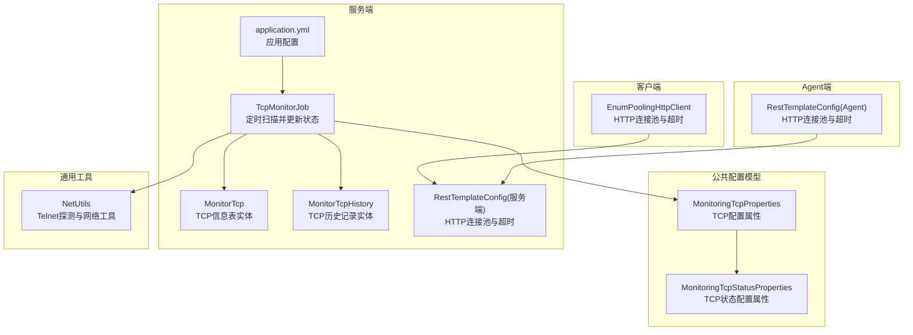
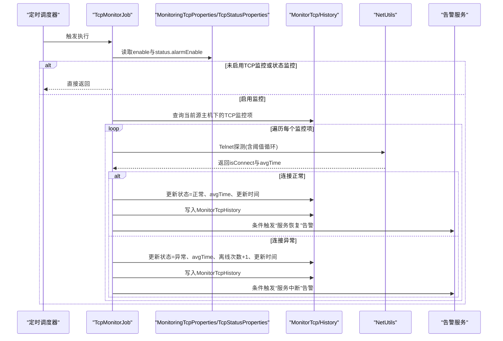
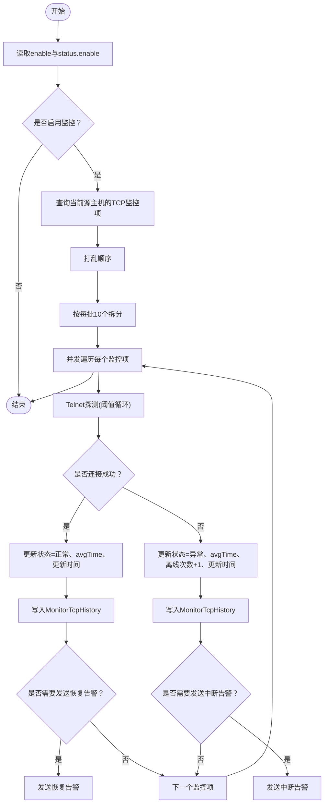
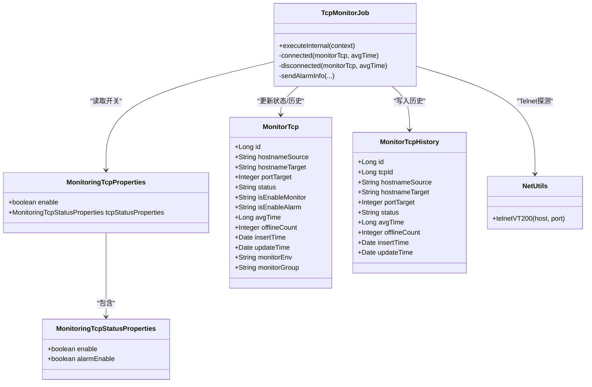

# TCP监控参数

<cite>
**本文引用的文件**
- [MonitoringTcpProperties.java](file://phoenix-common\phoenix-common-core\src\main\java\com\gitee\pifeng\monitoring\common\property\server\MonitoringTcpProperties.java)
- [MonitoringTcpStatusProperties.java](file://phoenix-common\phoenix-common-core\src\main\java\com\gitee\pifeng\monitoring\common\property\server\MonitoringTcpStatusProperties.java)
- [TcpMonitorJob.java](file://phoenix-server\src\main\java\com\gitee\pifeng\monitoring\server\business\server\monitor\tcp\TcpMonitorJob.java)
- [MonitorTcp.java](file://phoenix-server\src\main\java\com\gitee\pifeng\monitoring\server\business\server\entity\MonitorTcp.java)
- [MonitorTcpHistory.java](file://phoenix-server\src\main\java\com\gitee\pifeng\monitoring\server\business\server\entity\MonitorTcpHistory.java)
- [application.yml](file://phoenix-server\src\main\resources\application.yml)
- [RestTemplateConfig.java（服务端）](file://phoenix-server\src\main\java\com\gitee\pifeng\monitoring\server\config\RestTemplateConfig.java)
- [RestTemplateConfig.java（Agent端）](file://phoenix-agent\src\main\java\com\gitee\pifeng\monitoring\agent\config\RestTemplateConfig.java)
- [EnumPoolingHttpClient.java](file://phoenix-client\phoenix-client-core\src\main\java\com\gitee\pifeng\monitoring\plug\core\EnumPoolingHttpClient.java)
- [NetUtils.java](file://phoenix-common\phoenix-common-core\src\main\java\com\gitee\pifeng\monitoring\common\util\server\NetUtils.java)
- [phoenix.sql](file://doc\数据库设计\sql\mysql\phoenix.sql)
</cite>

## 目录
1. [简介](#简介)
2. [项目结构](#项目结构)
3. [核心组件](#核心组件)
4. [架构总览](#架构总览)
5. [详细组件分析](#详细组件分析)
6. [依赖关系分析](#依赖关系分析)
7. [性能考量](#性能考量)
8. [故障排查指南](#故障排查指南)
9. [结论](#结论)
10. [附录](#附录)

## 简介
本文件面向Phoenix监控系统中的TCP监控参数配置，围绕MonitoringTcpProperties类及其嵌套的MonitoringTcpStatusProperties，系统阐述TCP连接监控参数、连接状态检测配置、连接超时设置、连接池配置、重连机制等关键参数的作用与配置方法。同时结合服务端定时任务TcpMonitorJob的工作流程，给出TCP监控的最佳实践，帮助读者根据应用的连接特点合理调整参数，实现对网络连接质量的有效监控。

## 项目结构
与TCP监控参数直接相关的模块与文件如下：
- 配置属性模型：MonitoringTcpProperties、MonitoringTcpStatusProperties
- 业务实体：MonitorTcp、MonitorTcpHistory
- 定时监控任务：TcpMonitorJob
- 网络探测工具：NetUtils
- 连接池与超时配置：服务端RestTemplateConfig、Agent端RestTemplateConfig、客户端EnumPoolingHttpClient
- 应用配置：application.yml
- 数据库表结构：phoenix.sql

图表来源
- [MonitoringTcpProperties.java:18-30](file://phoenix-common\phoenix-common-core\src\main\java\com\gitee\pifeng\monitoring\common\property\server\MonitoringTcpProperties.java#L18-L30)
- [MonitoringTcpStatusProperties.java:18-30](file://phoenix-common\phoenix-common-core\src\main\java\com\gitee\pifeng\monitoring\common\property\server\MonitoringTcpStatusProperties.java#L18-L30)
- [TcpMonitorJob.java:102-170](file://phoenix-server\src\main\java\com\gitee\pifeng\monitoring\server\business\server\monitor\tcp\TcpMonitorJob.java#L102-L170)
- [MonitorTcp.java:25-112](file://phoenix-server\src\main\java\com\gitee\pifeng\monitoring\server\business\server\entity\MonitorTcp.java#L25-L112)
- [MonitorTcpHistory.java:25-94](file://phoenix-server\src\main\java\com\gitee\pifeng\monitoring\server\business\server\entity\MonitorTcpHistory.java#L25-L94)
- [application.yml:1-271](file://phoenix-server\src\main\resources\application.yml#L1-L271)
- [RestTemplateConfig.java（服务端）:115-141](file://phoenix-server\src\main\java\com\gitee\pifeng\monitoring\server\config\RestTemplateConfig.java#L115-L141)
- [RestTemplateConfig.java（Agent端）:98-138](file://phoenix-agent\src\main\java\com\gitee\pifeng\monitoring\agent\config\RestTemplateConfig.java#L98-L138)
- [EnumPoolingHttpClient.java:157-202](file://phoenix-client\phoenix-client-core\src\main\java\com\gitee\pifeng\monitoring\plug\core\EnumPoolingHttpClient.java#L157-L202)
- [NetUtils.java:1-53](file://phoenix-common\phoenix-common-core\src\main\java\com\gitee\pifeng\monitoring\common\util\server\NetUtils.java#L1-L53)

章节来源
- [MonitoringTcpProperties.java:18-30](file://phoenix-common\phoenix-common-core\src\main\java\com\gitee\pifeng\monitoring\common\property\server\MonitoringTcpProperties.java#L18-L30)
- [MonitoringTcpStatusProperties.java:18-30](file://phoenix-common\phoenix-common-core\src\main\java\com\gitee\pifeng\monitoring\common\property\server\MonitoringTcpStatusProperties.java#L18-L30)
- [TcpMonitorJob.java:102-170](file://phoenix-server\src\main\java\com\gitee\pifeng\monitoring\server\business\server\monitor\tcp\TcpMonitorJob.java#L102-L170)
- [MonitorTcp.java:25-112](file://phoenix-server\src\main\java\com\gitee\pifeng\monitoring\server\business\server\entity\MonitorTcp.java#L25-L112)
- [MonitorTcpHistory.java:25-94](file://phoenix-server\src\main\java\com\gitee\pifeng\monitoring\server\business\server\entity\MonitorTcpHistory.java#L25-L94)
- [application.yml:1-271](file://phoenix-server\src\main\resources\application.yml#L1-L271)
- [RestTemplateConfig.java（服务端）:115-141](file://phoenix-server\src\main\java\com\gitee\pifeng\monitoring\server\config\RestTemplateConfig.java#L115-L141)
- [RestTemplateConfig.java（Agent端）:98-138](file://phoenix-agent\src\main\java\com\gitee\pifeng\monitoring\agent\config\RestTemplateConfig.java#L98-L138)
- [EnumPoolingHttpClient.java:157-202](file://phoenix-client\phoenix-client-core\src\main\java\com\gitee\pifeng\monitoring\plug\core\EnumPoolingHttpClient.java#L157-L202)
- [NetUtils.java:1-53](file://phoenix-common\phoenix-common-core\src\main\java\com\gitee\pifeng\monitoring\common\util\server\NetUtils.java#L1-L53)

## 核心组件
- MonitoringTcpProperties：顶层TCP监控开关与TCP状态配置的聚合属性。
- MonitoringTcpStatusProperties：TCP状态监控开关与告警开关。
- TcpMonitorJob：定时扫描数据库中的TCP监控项，执行Telnet探测，更新状态与历史记录，并按需发送告警。
- MonitorTcp/MonitorTcpHistory：TCP监控记录与历史记录的实体映射。
- NetUtils：提供Telnet探测能力，返回连接结果与平均耗时。
- 连接池与超时配置：服务端、Agent端、客户端均提供HTTP连接池与超时参数配置，影响监控探测的稳定性与性能。

章节来源
- [MonitoringTcpProperties.java:18-30](file://phoenix-common\phoenix-common-core\src\main\java\com\gitee\pifeng\monitoring\common\property\server\MonitoringTcpProperties.java#L18-L30)
- [MonitoringTcpStatusProperties.java:18-30](file://phoenix-common\phoenix-common-core\src\main\java\com\gitee\pifeng\monitoring\common\property\server\MonitoringTcpStatusProperties.java#L18-L30)
- [TcpMonitorJob.java:102-170](file://phoenix-server\src\main\java\com\gitee\pifeng\monitoring\server\business\server\monitor\tcp\TcpMonitorJob.java#L102-L170)
- [MonitorTcp.java:25-112](file://phoenix-server\src\main\java\com\gitee\pifeng\monitoring\server\business\server\entity\MonitorTcp.java#L25-L112)
- [MonitorTcpHistory.java:25-94](file://phoenix-server\src\main\java\com\gitee\pifeng\monitoring\server\business\server\entity\MonitorTcpHistory.java#L25-L94)
- [NetUtils.java:1-53](file://phoenix-common\phoenix-common-core\src\main\java\com\gitee\pifeng\monitoring\common\util\server\NetUtils.java#L1-L53)

## 架构总览
TCP监控的整体流程如下：
- 服务端加载MonitoringTcpProperties与MonitoringTcpStatusProperties，决定是否启用TCP监控与TCP状态告警。
- 定时任务TcpMonitorJob按阈值重复探测目标主机端口，使用NetUtils进行Telnet探测。
- 探测结果更新MonitorTcp状态与平均耗时，并写入MonitorTcpHistory。
- 若满足告警条件，调用告警服务发送告警消息。

图表来源
- [TcpMonitorJob.java:102-170](file://phoenix-server\src\main\java\com\gitee\pifeng\monitoring\server\business\server\monitor\tcp\TcpMonitorJob.java#L102-L170)
- [MonitoringTcpProperties.java:18-30](file://phoenix-common\phoenix-common-core\src\main\java\com\gitee\pifeng\monitoring\common\property\server\MonitoringTcpProperties.java#L18-L30)
- [MonitoringTcpStatusProperties.java:18-30](file://phoenix-common\phoenix-common-core\src\main\java\com\gitee\pifeng\monitoring\common\property\server\MonitoringTcpStatusProperties.java#L18-L30)
- [MonitorTcp.java:25-112](file://phoenix-server\src\main\java\com\gitee\pifeng\monitoring\server\business\server\entity\MonitorTcp.java#L25-L112)
- [MonitorTcpHistory.java:25-94](file://phoenix-server\src\main\java\com\gitee\pifeng\monitoring\server\business\server\entity\MonitorTcpHistory.java#L25-L94)

## 详细组件分析

### MonitoringTcpProperties与MonitoringTcpStatusProperties
- MonitoringTcpProperties
  - enable：控制是否启用TCP服务监控。
  - tcpStatusProperties：包含TCP状态监控与告警的细粒度开关。
- MonitoringTcpStatusProperties
  - enable：控制是否监控TCP状态（连接是否可达）。
  - alarmEnable：控制TCP状态告警是否启用。

这些属性由服务端的TcpMonitorJob在执行前读取，决定后续流程是否继续。

章节来源
- [MonitoringTcpProperties.java:18-30](file://phoenix-common\phoenix-common-core\src\main\java\com\gitee\pifeng\monitoring\common\property\server\MonitoringTcpProperties.java#L18-L30)
- [MonitoringTcpStatusProperties.java:18-30](file://phoenix-common\phoenix-common-core\src\main\java\com\gitee\pifeng\monitoring\common\property\server\MonitoringTcpStatusProperties.java#L18-L30)
- [TcpMonitorJob.java:104-113](file://phoenix-server\src\main\java\com\gitee\pifeng\monitoring\server\business\server\monitor\tcp\TcpMonitorJob.java#L104-L113)

### TcpMonitorJob：TCP监控执行逻辑
- 参数读取
  - 读取MonitoringTcpProperties.enable与tcpStatusProperties.enable，若任一为false则直接返回。
- 数据查询与分片
  - 查询当前源主机下的所有TCP监控项，打乱顺序后按每批10个拆分，使用线程池并发处理。
- 探测与阈值循环
  - 对每个监控项执行Telnet探测，探测次数由threshold配置决定，若任一次成功则判定为连接正常。
- 状态更新与历史记录
  - 正常：状态=1，avgTime更新，写入历史记录。
  - 异常：状态=0，avgTime更新，离线次数+1，写入历史记录。
- 告警发送
  - 当tcpStatusProperties.alarmEnable为true且该监控项isEnableAlarm为启用时，发送相应告警。

图表来源
- [TcpMonitorJob.java:102-170](file://phoenix-server\src\main\java\com\gitee\pifeng\monitoring\server\business\server\monitor\tcp\TcpMonitorJob.java#L102-L170)
- [MonitoringTcpProperties.java:18-30](file://phoenix-common\phoenix-common-core\src\main\java\com\gitee\pifeng\monitoring\common\property\server\MonitoringTcpProperties.java#L18-L30)
- [MonitoringTcpStatusProperties.java:18-30](file://phoenix-common\phoenix-common-core\src\main\java\com\gitee\pifeng\monitoring\common\property\server\MonitoringTcpStatusProperties.java#L18-L30)

章节来源
- [TcpMonitorJob.java:102-170](file://phoenix-server\src\main\java\com\gitee\pifeng\monitoring\server\business\server\monitor\tcp\TcpMonitorJob.java#L102-L170)

### MonitorTcp与MonitorTcpHistory：数据模型
- MonitorTcp
  - 字段：源主机、目标主机、端口、描述、状态、是否启用监控、是否启用告警、平均耗时、离线次数、新增/更新时间、监控环境、监控分组。
- MonitorTcpHistory
  - 字段：关联主表ID、源主机、目标主机、端口、描述、状态、平均耗时、离线次数、新增/更新时间。

章节来源
- [MonitorTcp.java:25-112](file://phoenix-server\src\main\java\com\gitee\pifeng\monitoring\server\business\server\entity\MonitorTcp.java#L25-L112)
- [MonitorTcpHistory.java:25-94](file://phoenix-server\src\main\java\com\gitee\pifeng\monitoring\server\business\server\entity\MonitorTcpHistory.java#L25-L94)

### NetUtils：Telnet探测与网络工具
- 提供Telnet探测能力，返回连接结果与平均耗时，作为TcpMonitorJob的探测依据。
- 该工具在测试中有对应单元测试，验证其可用性。

章节来源
- [NetUtils.java:1-53](file://phoenix-common\phoenix-common-core\src\main\java\com\gitee\pifeng\monitoring\common\util\server\NetUtils.java#L1-L53)
- [TcpMonitorJob.java:142-150](file://phoenix-server\src\main\java\com\gitee\pifeng\monitoring\server\business\server\monitor\tcp\TcpMonitorJob.java#L142-L150)

### 连接池与超时配置：影响监控稳定性的关键参数
- 服务端HTTP连接池与超时
  - 连接超时、套接字超时、连接请求超时等参数来自配置，用于统一管理HTTP通信的超时行为。
- Agent端HTTP连接池与超时
  - 同样提供连接池大小、每路由最大连接、连接验证间隔、超时参数等配置。
- 客户端HTTP连接池与超时
  - 从公共配置中读取HTTP超时参数，构建连接池与请求配置，确保客户端监控请求的稳定性。

章节来源
- [RestTemplateConfig.java（服务端）:115-141](file://phoenix-server\src\main\java\com\gitee\pifeng\monitoring\server\config\RestTemplateConfig.java#L115-L141)
- [RestTemplateConfig.java（Agent端）:98-138](file://phoenix-agent\src\main\java\com\gitee\pifeng\monitoring\agent\config\RestTemplateConfig.java#L98-L138)
- [EnumPoolingHttpClient.java:157-202](file://phoenix-client\phoenix-client-core\src\main\java\com\gitee\pifeng\monitoring\plug\core\EnumPoolingHttpClient.java#L157-L202)

## 依赖关系分析
- TcpMonitorJob依赖MonitoringTcpProperties与MonitoringTcpStatusProperties进行开关控制。
- TcpMonitorJob依赖NetUtils进行连接探测。
- TcpMonitorJob依赖MonitorTcp与MonitorTcpHistory进行状态更新与历史记录写入。
- 连接池与超时配置分布在服务端、Agent端、客户端，统一保障HTTP通信的稳定性。

图表来源
- [MonitoringTcpProperties.java:18-30](file://phoenix-common\phoenix-common-core\src\main\java\com\gitee\pifeng\monitoring\common\property\server\MonitoringTcpProperties.java#L18-L30)
- [MonitoringTcpStatusProperties.java:18-30](file://phoenix-common\phoenix-common-core\src\main\java\com\gitee\pifeng\monitoring\common\property\server\MonitoringTcpStatusProperties.java#L18-L30)
- [TcpMonitorJob.java:102-170](file://phoenix-server\src\main\java\com\gitee\pifeng\monitoring\server\business\server\monitor\tcp\TcpMonitorJob.java#L102-L170)
- [MonitorTcp.java:25-112](file://phoenix-server\src\main\java\com\gitee\pifeng\monitoring\server\business\server\entity\MonitorTcp.java#L25-L112)
- [MonitorTcpHistory.java:25-94](file://phoenix-server\src\main\java\com\gitee\pifeng\monitoring\server\business\server\entity\MonitorTcpHistory.java#L25-L94)
- [NetUtils.java:1-53](file://phoenix-common\phoenix-common-core\src\main\java\com\gitee\pifeng\monitoring\common\util\server\NetUtils.java#L1-L53)

章节来源
- [TcpMonitorJob.java:102-170](file://phoenix-server\src\main\java\com\gitee\pifeng\monitoring\server\business\server\monitor\tcp\TcpMonitorJob.java#L102-L170)
- [MonitoringTcpProperties.java:18-30](file://phoenix-common\phoenix-common-core\src\main\java\com\gitee\pifeng\monitoring\common\property\server\MonitoringTcpProperties.java#L18-L30)
- [MonitoringTcpStatusProperties.java:18-30](file://phoenix-common\phoenix-common-core\src\main\java\com\gitee\pifeng\monitoring\common\property\server\MonitoringTcpStatusProperties.java#L18-L30)
- [MonitorTcp.java:25-112](file://phoenix-server\src\main\java\com\gitee\pifeng\monitoring\server\business\server\entity\MonitorTcp.java#L25-L112)
- [MonitorTcpHistory.java:25-94](file://phoenix-server\src\main\java\com\gitee\pifeng\monitoring\server\business\server\entity\MonitorTcpHistory.java#L25-L94)
- [NetUtils.java:1-53](file://phoenix-common\phoenix-common-core\src\main\java\com\gitee\pifeng\monitoring\common\util\server\NetUtils.java#L1-L53)

## 性能考量
- 连接池规模与并发
  - 服务端、Agent端、客户端均提供连接池最大连接数、每路由最大连接数、连接验证间隔等配置，应根据监控目标数量与并发需求合理设置，避免因连接池过小导致等待超时或连接不足。
- 超时参数
  - 连接超时、套接字超时、连接请求超时直接影响探测的及时性与成功率，应结合网络延迟与目标端口响应特性进行调优。
- 探测阈值与并发
  - TcpMonitorJob对每个监控项采用阈值循环探测，减少偶发抖动的影响；同时通过线程池与分批处理提升整体吞吐。
- 历史数据清理
  - MonitorTcpHistory支持按时间点清理历史数据，避免历史表无限增长影响性能。

章节来源
- [RestTemplateConfig.java（服务端）:115-141](file://phoenix-server\src\main\java\com\gitee\pifeng\monitoring\server\config\RestTemplateConfig.java#L115-L141)
- [RestTemplateConfig.java（Agent端）:98-138](file://phoenix-agent\src\main\java\com\gitee\pifeng\monitoring\agent\config\RestTemplateConfig.java#L98-L138)
- [EnumPoolingHttpClient.java:157-202](file://phoenix-client\phoenix-client-core\src\main\java\com\gitee\pifeng\monitoring\plug\core\EnumPoolingHttpClient.java#L157-L202)
- [TcpMonitorJob.java:120-124](file://phoenix-server\src\main\java\com\gitee\pifeng\monitoring\server\business\server\monitor\tcp\TcpMonitorJob.java#L120-L124)
- [TcpHistoryServiceImpl.java:33-41](file://phoenix-server\src\main\java\com\gitee\pifeng\monitoring\server\business\server\service\impl\TcpHistoryServiceImpl.java#L33-L41)

## 故障排查指南
- TCP监控未生效
  - 检查MonitoringTcpProperties.enable与tcpStatusProperties.enable是否均为true。
  - 确认TcpMonitorJob所在环境的定时任务是否正常运行。
- 探测频繁失败
  - 调整阈值循环次数，避免瞬时网络波动导致误判。
  - 检查连接池与超时参数，适当增大连接池容量或延长超时时间。
- 告警未触发
  - 确认tcpStatusProperties.alarmEnable为true。
  - 确认MonitorTcp中isEnableAlarm为启用。
- 历史数据过多
  - 启用或优化历史清理策略，定期清理过期历史记录。

章节来源
- [TcpMonitorJob.java:104-113](file://phoenix-server\src\main\java\com\gitee\pifeng\monitoring\server\business\server\monitor\tcp\TcpMonitorJob.java#L104-L113)
- [TcpMonitorJob.java:268-279](file://phoenix-server\src\main\java\com\gitee\pifeng\monitoring\server\business\server\monitor\tcp\TcpMonitorJob.java#L268-L279)
- [application.yml:1-271](file://phoenix-server\src\main\resources\application.yml#L1-L271)

## 结论
通过MonitoringTcpProperties与MonitoringTcpStatusProperties的组合配置，Phoenix实现了对TCP服务的可开关监控与告警控制。TcpMonitorJob基于阈值循环与并发处理，结合NetUtils的Telnet探测能力，形成稳定高效的TCP监控链路。配合服务端、Agent端、客户端的连接池与超时配置，可在不同网络环境下获得可靠的监控效果。建议根据业务场景调整阈值、连接池规模与超时参数，并建立历史数据清理策略，以获得更佳的监控体验与性能表现。

## 附录

### TCP监控参数配置清单与说明
- 顶层开关
  - enable：是否启用TCP服务监控。若为false，整个TCP监控流程不会执行。
- TCP状态监控开关
  - tcpStatusProperties.enable：是否监控TCP状态（连接可达性）。若为false，即使enable为true也不会执行状态检测。
- 告警开关
  - tcpStatusProperties.alarmEnable：是否启用TCP状态告警。仅在状态发生异常/恢复时按需发送告警。
- 探测阈值
  - threshold：对单个监控项进行多次Telnet探测，任一次成功即视为连接正常。用于降低偶发抖动的影响。
- 连接池与超时（服务端/Agent端/客户端）
  - 连接超时、套接字超时、连接请求超时：影响探测请求的稳定性与时效性。
  - 连接池最大连接数、每路由最大连接数、连接验证间隔：影响并发探测能力与资源占用。
- 数据库表结构要点
  - MONITOR_TCP：存储TCP监控项与当前状态。
  - MONITOR_TCP_HISTORY：存储TCP监控历史记录，便于趋势分析与回溯。

章节来源
- [MonitoringTcpProperties.java:18-30](file://phoenix-common\phoenix-common-core\src\main\java\com\gitee\pifeng\monitoring\common\property\server\MonitoringTcpProperties.java#L18-L30)
- [MonitoringTcpStatusProperties.java:18-30](file://phoenix-common\phoenix-common-core\src\main\java\com\gitee\pifeng\monitoring\common\property\server\MonitoringTcpStatusProperties.java#L18-L30)
- [TcpMonitorJob.java:141-150](file://phoenix-server\src\main\java\com\gitee\pifeng\monitoring\server\business\server\monitor\tcp\TcpMonitorJob.java#L141-L150)
- [RestTemplateConfig.java（服务端）:115-141](file://phoenix-server\src\main\java\com\gitee\pifeng\monitoring\server\config\RestTemplateConfig.java#L115-L141)
- [RestTemplateConfig.java（Agent端）:98-138](file://phoenix-agent\src\main\java\com\gitee\pifeng\monitoring\agent\config\RestTemplateConfig.java#L98-L138)
- [EnumPoolingHttpClient.java:157-202](file://phoenix-client\phoenix-client-core\src\main\java\com\gitee\pifeng\monitoring\plug\core\EnumPoolingHttpClient.java#L157-L202)
- [MonitorTcp.java:25-112](file://phoenix-server\src\main\java\com\gitee\pifeng\monitoring\server\business\server\entity\MonitorTcp.java#L25-L112)
- [MonitorTcpHistory.java:25-94](file://phoenix-server\src\main\java\com\gitee\pifeng\monitoring\server\business\server\entity\MonitorTcpHistory.java#L25-L94)
- [phoenix.sql:1113-1133](file://doc\数据库设计\sql\mysql\phoenix.sql#L1113-L1133)