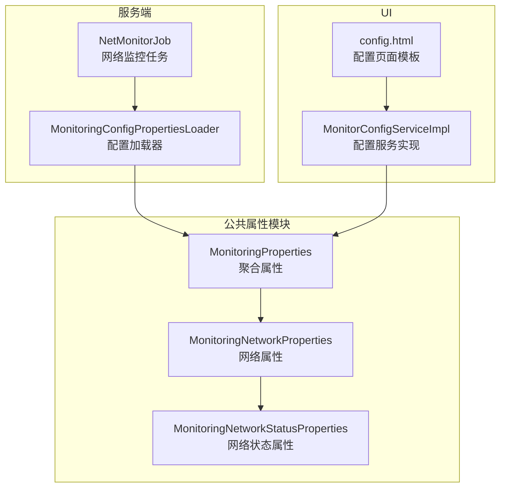
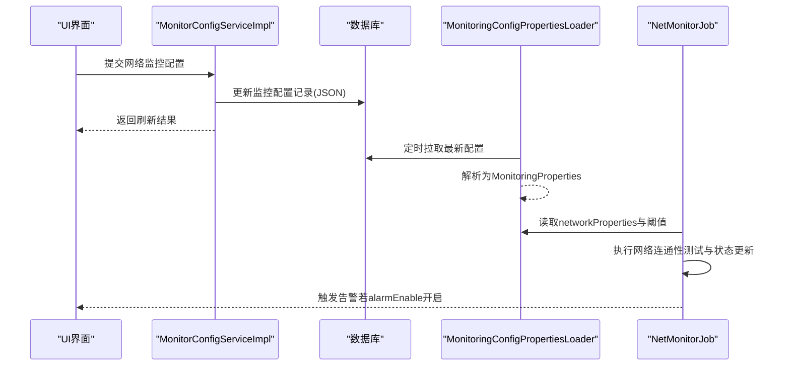
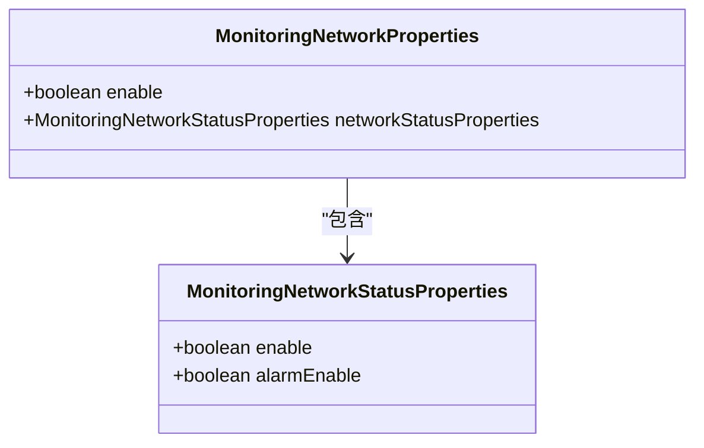
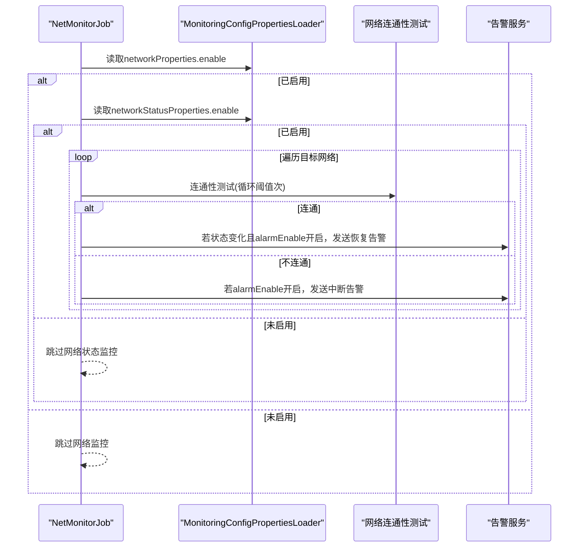
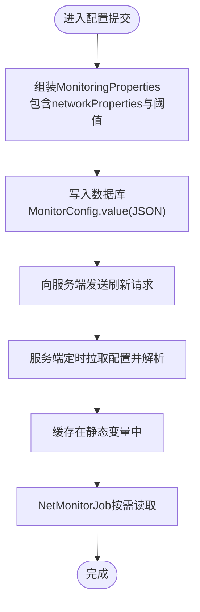
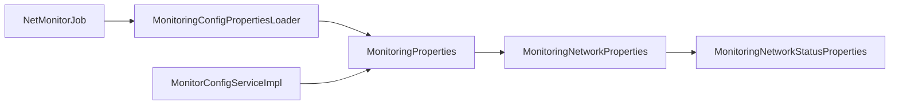

# 网络接口监控参数

<cite>
**本文引用的文件**
- [MonitoringNetworkProperties.java](file://phoenix-common/phoenix-common-core/src/main/java/com/gitee/pifeng/monitoring/common/property/server/MonitoringNetworkProperties.java)
- [MonitoringNetworkStatusProperties.java](file://phoenix-common/phoenix-common-core/src/main/java/com/gitee/pifeng/monitoring/common/property/server/MonitoringNetworkStatusProperties.java)
- [MonitoringProperties.java](file://phoenix-common/phoenix-common-core/src/main/java/com/gitee/pifeng/monitoring/common/property/server/MonitoringProperties.java)
- [MonitoringConfigPropertiesLoader.java](file://phoenix-server/src/main/java/com/gitee/pifeng/monitoring/server/business/server/core/MonitoringConfigPropertiesLoader.java)
- [NetMonitorJob.java](file://phoenix-server/src/main/java/com/gitee/pifeng/monitoring/server/business/server/monitor/net/NetMonitorJob.java)
- [MonitorConfigServiceImpl.java](file://phoenix-ui/src/main/java/com/gitee/pifeng/monitoring/ui/business/web/service/impl/MonitorConfigServiceImpl.java)
- [config.html](file://phoenix-ui/src/main/resources/templates/set/config.html)
</cite>

## 目录
1. [简介](#简介)
2. [项目结构](#项目结构)
3. [核心组件](#核心组件)
4. [架构总览](#架构总览)
5. [详细组件分析](#详细组件分析)
6. [依赖关系分析](#依赖关系分析)
7. [性能考量](#性能考量)
8. [故障排查指南](#故障排查指南)
9. [结论](#结论)
10. [附录](#附录)

## 简介
本文围绕Phoenix监控系统中的“网络接口监控参数”进行深入配置说明，重点聚焦于MonitoringNetworkProperties类及其子属性MonitoringNetworkStatusProperties所承载的网络监控能力。内容涵盖：
- 网络接口选择策略与过滤规则
- 带宽使用率阈值与网络延迟监控参数
- 丢包率检测阈值
- 监控频率与采样间隔配置
- 最佳实践与不同网络环境下的参数调优建议

## 项目结构
Phoenix监控系统采用分层与模块化设计，网络监控参数主要位于公共属性模块中，服务端负责加载与调度，UI负责配置与下发。

图表来源
- [MonitoringProperties.java:19-61](file://phoenix-common/phoenix-common-core/src/main/java/com/gitee/pifeng/monitoring/common/property/server/MonitoringProperties.java#L19-L61)
- [MonitoringNetworkProperties.java:19-31](file://phoenix-common/phoenix-common-core/src/main/java/com/gitee/pifeng/monitoring/common/property/server/MonitoringNetworkProperties.java#L19-L31)
- [MonitoringNetworkStatusProperties.java:19-31](file://phoenix-common/phoenix-common-core/src/main/java/com/gitee/pifeng/monitoring/common/property/server/MonitoringNetworkStatusProperties.java#L19-L31)
- [MonitoringConfigPropertiesLoader.java:33-202](file://phoenix-server/src/main/java/com/gitee/pifeng/monitoring/server/business/server/core/MonitoringConfigPropertiesLoader.java#L33-L202)
- [NetMonitorJob.java:54-309](file://phoenix-server/src/main/java/com/gitee/pifeng/monitoring/server/business/server/monitor/net/NetMonitorJob.java#L54-L309)
- [MonitorConfigServiceImpl.java:46-281](file://phoenix-ui/src/main/java/com/gitee/pifeng/monitoring/ui/business/web/service/impl/MonitorConfigServiceImpl.java#L46-L281)
- [config.html](file://phoenix-ui/src/main/resources/templates/set/config.html)

章节来源
- [MonitoringProperties.java:19-61](file://phoenix-common/phoenix-common-core/src/main/java/com/gitee/pifeng/monitoring/common/property/server/MonitoringProperties.java#L19-L61)
- [MonitoringNetworkProperties.java:19-31](file://phoenix-common/phoenix-common-core/src/main/java/com/gitee/pifeng/monitoring/common/property/server/MonitoringNetworkProperties.java#L19-L31)
- [MonitoringNetworkStatusProperties.java:19-31](file://phoenix-common/phoenix-common-core/src/main/java/com/gitee/pifeng/monitoring/common/property/server/MonitoringNetworkStatusProperties.java#L19-L31)

## 核心组件
本节对网络监控参数的核心类进行逐项解析，明确各字段含义、默认值与作用范围。

- MonitoringNetworkProperties（网络属性）
  - enable：是否启用网络监控
  - networkStatusProperties：网络状态监控的细粒度开关与告警开关
- MonitoringNetworkStatusProperties（网络状态属性）
  - enable：是否监控网络状态（如连通性）
  - alarmEnable：是否对网络状态异常/恢复发送告警

上述两个类均实现了ISuperBean，便于统一序列化与传输。

章节来源
- [MonitoringNetworkProperties.java:19-31](file://phoenix-common/phoenix-common-core/src/main/java/com/gitee/pifeng/monitoring/common/property/server/MonitoringNetworkProperties.java#L19-L31)
- [MonitoringNetworkStatusProperties.java:19-31](file://phoenix-common/phoenix-common-core/src/main/java/com/gitee/pifeng/monitoring/common/property/server/MonitoringNetworkStatusProperties.java#L19-L31)

## 架构总览
下图展示了网络监控参数在系统中的流转路径：UI配置页面收集参数 → 服务端配置加载器加载并缓存 → 服务端网络监控任务读取参数执行监控与告警。

图表来源
- [MonitorConfigServiceImpl.java:135-279](file://phoenix-ui/src/main/java/com/gitee/pifeng/monitoring/ui/business/web/service/impl/MonitorConfigServiceImpl.java#L135-L279)
- [MonitoringConfigPropertiesLoader.java:98-200](file://phoenix-server/src/main/java/com/gitee/pifeng/monitoring/server/business/server/core/MonitoringConfigPropertiesLoader.java#L98-L200)
- [NetMonitorJob.java:100-167](file://phoenix-server/src/main/java/com/gitee/pifeng/monitoring/server/business/server/monitor/net/NetMonitorJob.java#L100-L167)

## 详细组件分析

### MonitoringNetworkProperties 类分析
该类用于表达“网络监控”的总体开关与状态监控开关，其字段直接影响服务端是否执行网络监控任务。

图表来源
- [MonitoringNetworkProperties.java:19-31](file://phoenix-common/phoenix-common-core/src/main/java/com/gitee/pifeng/monitoring/common/property/server/MonitoringNetworkProperties.java#L19-L31)
- [MonitoringNetworkStatusProperties.java:19-31](file://phoenix-common/phoenix-common-core/src/main/java/com/gitee/pifeng/monitoring/common/property/server/MonitoringNetworkStatusProperties.java#L19-L31)

章节来源
- [MonitoringNetworkProperties.java:19-31](file://phoenix-common/phoenix-common-core/src/main/java/com/gitee/pifeng/monitoring/common/property/server/MonitoringNetworkProperties.java#L19-L31)
- [MonitoringNetworkStatusProperties.java:19-31](file://phoenix-common/phoenix-common-core/src/main/java/com/gitee/pifeng/monitoring/common/property/server/MonitoringNetworkStatusProperties.java#L19-L31)

### 监控流程与参数使用
服务端网络监控任务NetMonitorJob在执行时会读取配置加载器中的网络监控参数与全局阈值，以决定是否执行监控、如何判定连通性、以及是否触发告警。

图表来源
- [NetMonitorJob.java:100-167](file://phoenix-server/src/main/java/com/gitee/pifeng/monitoring/server/business/server/monitor/net/NetMonitorJob.java#L100-L167)
- [NetMonitorJob.java:179-307](file://phoenix-server/src/main/java/com/gitee/pifeng/monitoring/server/business/server/monitor/net/NetMonitorJob.java#L179-L307)
- [MonitoringConfigPropertiesLoader.java:140-143](file://phoenix-server/src/main/java/com/gitee/pifeng/monitoring/server/business/server/core/MonitoringConfigPropertiesLoader.java#L140-L143)

章节来源
- [NetMonitorJob.java:100-167](file://phoenix-server/src/main/java/com/gitee/pifeng/monitoring/server/business/server/monitor/net/NetMonitorJob.java#L100-L167)
- [NetMonitorJob.java:179-307](file://phoenix-server/src/main/java/com/gitee/pifeng/monitoring/server/business/server/monitor/net/NetMonitorJob.java#L179-L307)

### 参数配置入口与持久化
UI侧通过MonitorConfigServiceImpl将用户在页面上的配置转换为MonitoringProperties对象，并写入数据库；服务端配置加载器定时从数据库拉取最新配置，解析为MonitoringProperties并缓存，供NetMonitorJob读取。

图表来源
- [MonitorConfigServiceImpl.java:135-279](file://phoenix-ui/src/main/java/com/gitee/pifeng/monitoring/ui/business/web/service/impl/MonitorConfigServiceImpl.java#L135-L279)
- [MonitoringConfigPropertiesLoader.java:98-200](file://phoenix-server/src/main/java/com/gitee/pifeng/monitoring/server/business/server/core/MonitoringConfigPropertiesLoader.java#L98-L200)

章节来源
- [MonitorConfigServiceImpl.java:135-279](file://phoenix-ui/src/main/java/com/gitee/pifeng/monitoring/ui/business/web/service/impl/MonitorConfigServiceImpl.java#L135-L279)
- [MonitoringConfigPropertiesLoader.java:98-200](file://phoenix-server/src/main/java/com/gitee/pifeng/monitoring/server/business/server/core/MonitoringConfigPropertiesLoader.java#L98-L200)

## 依赖关系分析
- MonitoringProperties聚合了MonitoringNetworkProperties，作为顶层配置载体。
- MonitoringConfigPropertiesLoader负责从数据库加载并缓存MonitoringProperties，供各业务Job使用。
- NetMonitorJob在执行时依赖MonitoringProperties中的网络监控开关与告警开关。
- UI通过MonitorConfigServiceImpl将页面表单映射为MonitoringProperties并持久化。

图表来源
- [MonitoringProperties.java:19-61](file://phoenix-common/phoenix-common-core/src/main/java/com/gitee/pifeng/monitoring/common/property/server/MonitoringProperties.java#L19-L61)
- [MonitoringNetworkProperties.java:19-31](file://phoenix-common/phoenix-common-core/src/main/java/com/gitee/pifeng/monitoring/common/property/server/MonitoringNetworkProperties.java#L19-L31)
- [MonitoringNetworkStatusProperties.java:19-31](file://phoenix-common/phoenix-common-core/src/main/java/com/gitee/pifeng/monitoring/common/property/server/MonitoringNetworkStatusProperties.java#L19-L31)
- [MonitoringConfigPropertiesLoader.java:33-202](file://phoenix-server/src/main/java/com/gitee/pifeng/monitoring/server/business/server/core/MonitoringConfigPropertiesLoader.java#L33-L202)
- [NetMonitorJob.java:54-309](file://phoenix-server/src/main/java/com/gitee/pifeng/monitoring/server/business/server/monitor/net/NetMonitorJob.java#L54-L309)
- [MonitorConfigServiceImpl.java:46-281](file://phoenix-ui/src/main/java/com/gitee/pifeng/monitoring/ui/business/web/service/impl/MonitorConfigServiceImpl.java#L46-L281)

章节来源
- [MonitoringProperties.java:19-61](file://phoenix-common/phoenix-common-core/src/main/java/com/gitee/pifeng/monitoring/common/property/server/MonitoringProperties.java#L19-L61)
- [MonitoringConfigPropertiesLoader.java:33-202](file://phoenix-server/src/main/java/com/gitee/pifeng/monitoring/server/business/server/core/MonitoringConfigPropertiesLoader.java#L33-L202)
- [NetMonitorJob.java:54-309](file://phoenix-server/src/main/java/com/gitee/pifeng/monitoring/server/business/server/monitor/net/NetMonitorJob.java#L54-L309)
- [MonitorConfigServiceImpl.java:46-281](file://phoenix-ui/src/main/java/com/gitee/pifeng/monitoring/ui/business/web/service/impl/MonitorConfigServiceImpl.java#L46-L281)

## 性能考量
- 监控频率与采样间隔
  - 服务端网络监控任务通过“阈值循环”机制对目标进行多次探测，以提升连通性判断的稳定性。阈值越大，探测越稳健但耗时越长。
  - 服务端还支持针对不同监控类型的“连接频率”参数，结合阈值可推导出采样周期。例如应用实例与服务器监控中，采样周期=连接频率×阈值。
- 并发与吞吐
  - 网络监控任务内部使用线程池并发处理多个目标，有助于在目标较多时提升整体吞吐。
- 建议
  - 在高抖动网络中适当提高阈值，减少误报；在低抖动网络中降低阈值，提升检测灵敏度。
  - 控制目标数量与并发度，避免对网络与系统资源造成过大压力。

章节来源
- [NetMonitorJob.java:112-167](file://phoenix-server/src/main/java/com/gitee/pifeng/monitoring/server/business/server/monitor/net/NetMonitorJob.java#L112-L167)
- [NetMonitorJob.java:136-145](file://phoenix-server/src/main/java/com/gitee/pifeng/monitoring/server/business/server/monitor/net/NetMonitorJob.java#L136-L145)
- [MonitoringConfigPropertiesLoader.java:197-200](file://phoenix-server/src/main/java/com/gitee/pifeng/monitoring/server/business/server/core/MonitoringConfigPropertiesLoader.java#L197-L200)

## 故障排查指南
- 症状：网络监控未生效
  - 检查MonitoringNetworkProperties.enable与MonitoringNetworkStatusProperties.enable是否均为true
  - 确认服务端配置加载器已成功从数据库拉取并缓存配置
- 症状：告警未触发或频繁误报
  - 检查MonitoringNetworkStatusProperties.alarmEnable是否开启
  - 调整阈值以平衡误报与漏报
- 症状：监控任务执行缓慢
  - 评估目标数量与并发度，必要时减少目标或降低阈值
  - 关注线程池配置与系统资源占用情况

章节来源
- [NetMonitorJob.java:100-167](file://phoenix-server/src/main/java/com/gitee/pifeng/monitoring/server/business/server/monitor/net/NetMonitorJob.java#L100-L167)
- [NetMonitorJob.java:269-307](file://phoenix-server/src/main/java/com/gitee/pifeng/monitoring/server/business/server/monitor/net/NetMonitorJob.java#L269-L307)
- [MonitoringConfigPropertiesLoader.java:98-200](file://phoenix-server/src/main/java/com/gitee/pifeng/monitoring/server/business/server/core/MonitoringConfigPropertiesLoader.java#L98-L200)

## 结论
Phoenix监控系统通过MonitoringNetworkProperties与MonitoringNetworkStatusProperties提供了清晰的网络监控参数控制面：启用/禁用、状态监控与告警开关。配合服务端配置加载器与网络监控任务，可在不同网络环境下灵活调整阈值与并发策略，实现稳定高效的网络监控。

## 附录

### 配置参数速查表
- 网络监控总开关
  - 字段：MonitoringNetworkProperties.enable
  - 作用：控制是否执行网络监控
- 网络状态监控开关
  - 字段：MonitoringNetworkStatusProperties.enable
  - 作用：控制是否监控网络状态（连通性）
- 告警开关
  - 字段：MonitoringNetworkStatusProperties.alarmEnable
  - 作用：控制网络状态异常/恢复是否触发告警
- 全局阈值
  - 字段：MonitoringProperties.threshold
  - 作用：网络连通性探测的循环次数，影响稳定性与耗时
- 监控频率与采样间隔
  - 说明：可通过“连接频率×阈值”推导采样周期；具体字段因监控类型而异（如应用实例、服务器等）

章节来源
- [MonitoringNetworkProperties.java:21-24](file://phoenix-common/phoenix-common-core/src/main/java/com/gitee/pifeng/monitoring/common/property/server/MonitoringNetworkProperties.java#L21-L24)
- [MonitoringNetworkStatusProperties.java:21-29](file://phoenix-common/phoenix-common-core/src/main/java/com/gitee/pifeng/monitoring/common/property/server/MonitoringNetworkStatusProperties.java#L21-L29)
- [MonitoringProperties.java:22-24](file://phoenix-common/phoenix-common-core/src/main/java/com/gitee/pifeng/monitoring/common/property/server/MonitoringProperties.java#L22-L24)
- [NetMonitorJob.java:136-145](file://phoenix-server/src/main/java/com/gitee/pifeng/monitoring/server/business/server/monitor/net/NetMonitorJob.java#L136-L145)

### UI配置入口
- 页面模板位置：templates/set/config.html
- 功能：展示并编辑阈值、网络监控开关、网络状态监控开关与告警开关等

章节来源
- [config.html](file://phoenix-ui/src/main/resources/templates/set/config.html)