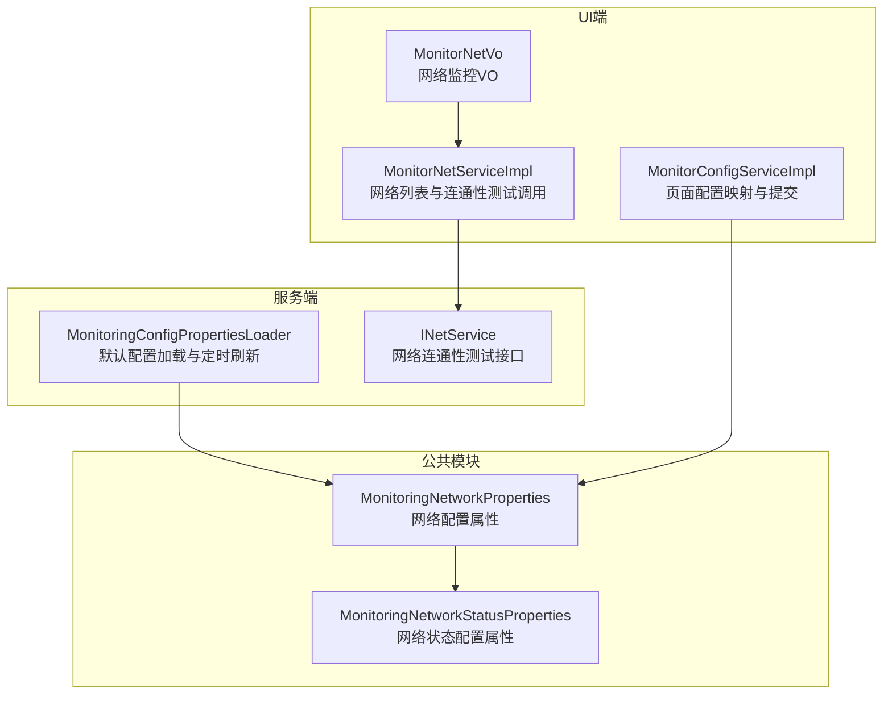
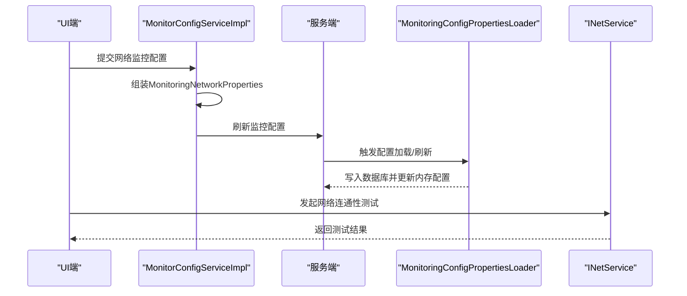
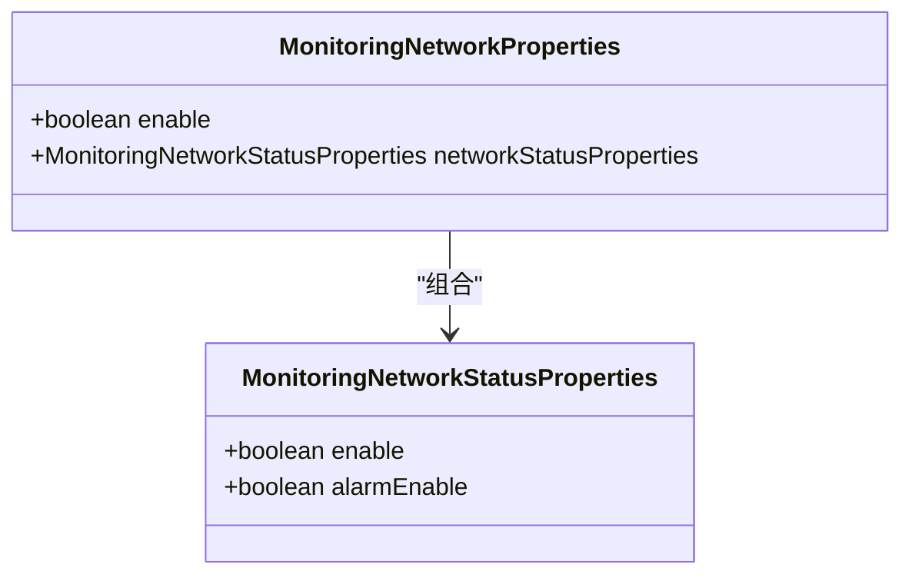
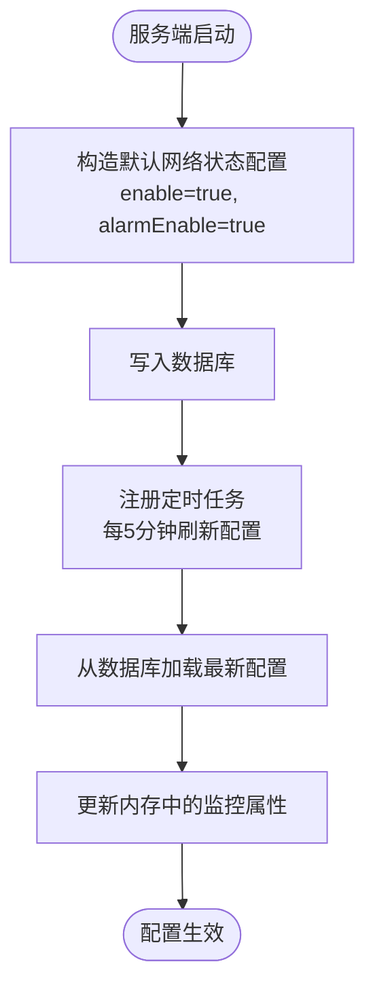
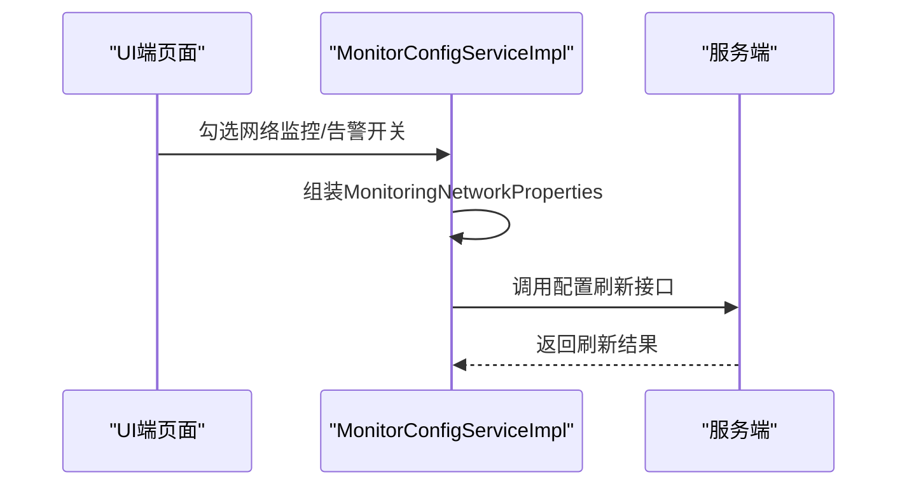
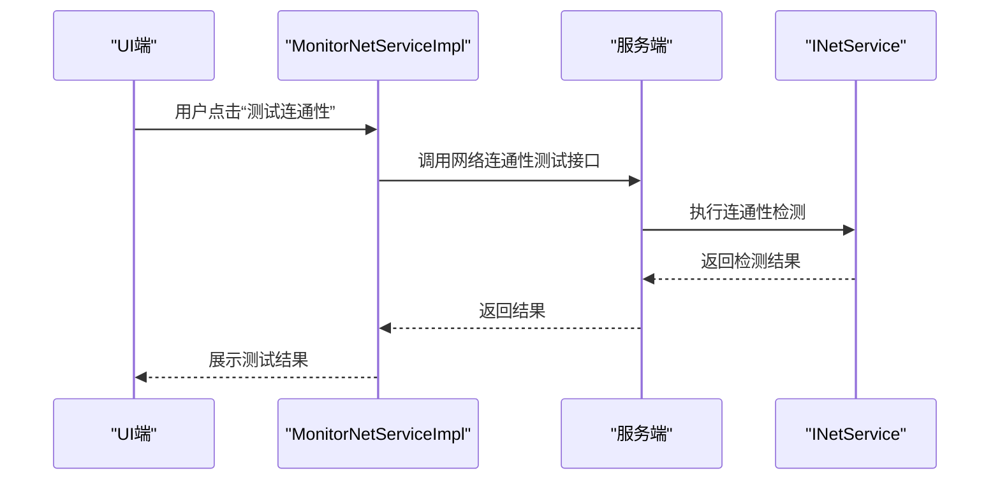
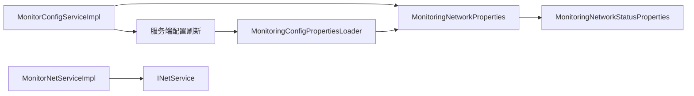

# 网络状态监控参数

<cite>
**本文引用的文件**
- [MonitoringNetworkStatusProperties.java](file://phoenix-common\phoenix-common-core\src\main\java\com\gitee\pifeng\monitoring\common\property\server\MonitoringNetworkStatusProperties.java)
- [MonitoringNetworkProperties.java](file://phoenix-common\phoenix-common-core\src\main\java\com\gitee\pifeng\monitoring\common\property\server\MonitoringNetworkProperties.java)
- [MonitoringConfigPropertiesLoader.java](file://phoenix-server\src\main\java\com\gitee\pifeng\monitoring\server\business\server\core\MonitoringConfigPropertiesLoader.java)
- [MonitorConfigServiceImpl.java](file://phoenix-ui\src\main\java\com\gitee\pifeng\monitoring\ui\business\web\service\impl\MonitorConfigServiceImpl.java)
- [INetService.java](file://phoenix-server\src\main\java\com\gitee\pifeng\monitoring\server\business\server\service\INetService.java)
- [MonitorNetServiceImpl.java](file://phoenix-ui\src\main\java\com\gitee\pifeng\monitoring\ui\business\web\service\impl\MonitorNetServiceImpl.java)
- [MonitorNetVo.java](file://phoenix-ui\src\main\java\com\gitee\pifeng\monitoring\ui\business\web\vo\MonitorNetVo.java)
- [application.yml（服务端）](file://phoenix-server\src\main\resources\application.yml)
- [application.yml（UI端）](file://phoenix-ui\src\main\resources\application.yml)
</cite>

## 目录
1. [简介](#简介)
2. [项目结构](#项目结构)
3. [核心组件](#核心组件)
4. [架构总览](#架构总览)
5. [详细组件分析](#详细组件分析)
6. [依赖关系分析](#依赖关系分析)
7. [性能考量](#性能考量)
8. [故障排查指南](#故障排查指南)
9. [结论](#结论)
10. [附录](#附录)

## 简介
本文件聚焦于Phoenix监控系统中的“网络状态监控参数”配置与使用，围绕MonitoringNetworkStatusProperties类及其父级MonitoringNetworkProperties展开，系统性说明网络连通性检查、路由监控、DNS解析监控等网络状态检测相关参数的配置方法与最佳实践。同时结合服务端配置加载、UI端配置下发与网络连通性测试流程，帮助读者快速理解并正确设置监控频率、阈值与告警策略，以及时发现与定位网络问题。

## 项目结构
Phoenix监控系统采用多模块架构，网络状态监控参数主要涉及以下模块与文件：
- 公共属性定义：MonitoringNetworkProperties与MonitoringNetworkStatusProperties位于公共模块，统一描述网络监控的开关与告警开关。
- 服务端配置加载：服务端在首次启动时构造默认配置并写入数据库，定时任务周期拉取最新配置到内存。
- UI端配置下发：UI端将用户在页面勾选的监控与告警开关映射为属性对象，提交后刷新服务端配置。
- 网络连通性测试：服务端提供网络连通性测试接口，UI端调用该接口进行连通性验证。

图表来源
- [MonitoringNetworkProperties.java:19-31](file://phoenix-common\phoenix-common-core\src\main\java\com\gitee\pifeng\monitoring\common\property\server\MonitoringNetworkProperties.java#L19-L31)
- [MonitoringNetworkStatusProperties.java:19-31](file://phoenix-common\phoenix-common-core\src\main\java\com\gitee\pifeng\monitoring\common\property\server\MonitoringNetworkStatusProperties.java#L19-L31)
- [MonitoringConfigPropertiesLoader.java:140-147](file://phoenix-server\src\main\java\com\gitee\pifeng\monitoring\server\business\server\core\MonitoringConfigPropertiesLoader.java#L140-L147)
- [MonitorConfigServiceImpl.java:159-166](file://phoenix-ui\src\main\java\com\gitee\pifeng\monitoring\ui\business\web\service\impl\MonitorConfigServiceImpl.java#L159-L166)
- [INetService.java:15-40](file://phoenix-server\src\main\java\com\gitee\pifeng\monitoring\server\business\server\service\INetService.java#L15-L40)
- [MonitorNetServiceImpl.java:346-349](file://phoenix-ui\src\main\java\com\gitee\pifeng\monitoring\ui\business\web\service\impl\MonitorNetServiceImpl.java#L346-L349)

章节来源
- [MonitoringNetworkProperties.java:19-31](file://phoenix-common\phoenix-common-core\src\main\java\com\gitee\pifeng\monitoring\common\property\server\MonitoringNetworkProperties.java#L19-L31)
- [MonitoringNetworkStatusProperties.java:19-31](file://phoenix-common\phoenix-common-core\src\main\java\com\gitee\pifeng\monitoring\common\property\server\MonitoringNetworkStatusProperties.java#L19-L31)
- [MonitoringConfigPropertiesLoader.java:140-147](file://phoenix-server\src\main\java\com\gitee\pifeng\monitoring\server\business\server\core\MonitoringConfigPropertiesLoader.java#L140-L147)
- [MonitorConfigServiceImpl.java:159-166](file://phoenix-ui\src\main\java\com\gitee\pifeng\monitoring\ui\business\web\service\impl\MonitorConfigServiceImpl.java#L159-L166)
- [INetService.java:15-40](file://phoenix-server\src\main\java\com\gitee\pifeng\monitoring\server\business\server\service\INetService.java#L15-L40)
- [MonitorNetServiceImpl.java:346-349](file://phoenix-ui\src\main\java\com\gitee\pifeng\monitoring\ui\business\web\service\impl\MonitorNetServiceImpl.java#L346-L349)

## 核心组件
- MonitoringNetworkStatusProperties：定义网络状态监控的两个关键布尔参数：
  - enable：是否启用网络状态监控
  - alarmEnable：是否启用网络状态告警
- MonitoringNetworkProperties：包含enable与networkStatusProperties，用于整体网络监控配置的封装。

章节来源
- [MonitoringNetworkStatusProperties.java:19-31](file://phoenix-common\phoenix-common-core\src\main\java\com\gitee\pifeng\monitoring\common\property\server\MonitoringNetworkStatusProperties.java#L19-L31)
- [MonitoringNetworkProperties.java:19-31](file://phoenix-common\phoenix-common-core\src\main\java\com\gitee\pifeng\monitoring\common\property\server\MonitoringNetworkProperties.java#L19-L31)

## 架构总览
网络状态监控参数在系统中的流转路径如下：
- UI端页面收集用户勾选的监控与告警开关，映射为MonitoringNetworkProperties对象并提交。
- 服务端接收后，将配置写入数据库并触发配置刷新任务，使内存中的监控属性实时生效。
- 服务端提供网络连通性测试接口，UI端可调用该接口进行连通性验证。

图表来源
- [MonitorConfigServiceImpl.java:159-166](file://phoenix-ui\src\main\java\com\gitee\pifeng\monitoring\ui\business\web\service\impl\MonitorConfigServiceImpl.java#L159-L166)
- [MonitoringConfigPropertiesLoader.java:175-186](file://phoenix-server\src\main\java\com\gitee\pifeng\monitoring\server\business\server\core\MonitoringConfigPropertiesLoader.java#L175-L186)
- [INetService.java:31-40](file://phoenix-server\src\main\java\com\gitee\pifeng\monitoring\server\business\server\service\INetService.java#L31-L40)

## 详细组件分析

### MonitoringNetworkStatusProperties 类分析
- 字段说明
  - enable：控制是否启用网络状态监控
  - alarmEnable：控制是否启用网络状态告警
- 设计要点
  - 使用Lombok注解简化getter/setter/toString等代码
  - 实现ISuperBean接口，便于作为通用配置载体

图表来源
- [MonitoringNetworkStatusProperties.java:19-31](file://phoenix-common\phoenix-common-core\src\main\java\com\gitee\pifeng\monitoring\common\property\server\MonitoringNetworkStatusProperties.java#L19-L31)
- [MonitoringNetworkProperties.java:19-31](file://phoenix-common\phoenix-common-core\src\main\java\com\gitee\pifeng\monitoring\common\property\server\MonitoringNetworkProperties.java#L19-L31)

章节来源
- [MonitoringNetworkStatusProperties.java:19-31](file://phoenix-common\phoenix-common-core\src\main\java\com\gitee\pifeng\monitoring\common\property\server\MonitoringNetworkStatusProperties.java#L19-L31)
- [MonitoringNetworkProperties.java:19-31](file://phoenix-common\phoenix-common-core\src\main\java\com\gitee\pifeng\monitoring\common\property\server\MonitoringNetworkProperties.java#L19-L31)

### 服务端配置加载与刷新
- 默认配置构造
  - 在首次启动时，服务端构造默认的MonitoringNetworkStatusProperties（enable与alarmEnable均为true），并嵌入到MonitoringNetworkProperties中，随后写入数据库。
- 定时刷新
  - 服务端通过定时任务每5分钟从数据库拉取最新配置，更新内存中的监控属性，确保配置变更即时生效。

图表来源
- [MonitoringConfigPropertiesLoader.java:140-147](file://phoenix-server\src\main\java\com\gitee\pifeng\monitoring\server\business\server\core\MonitoringConfigPropertiesLoader.java#L140-L147)
- [MonitoringConfigPropertiesLoader.java:197-200](file://phoenix-server\src\main\java\com\gitee\pifeng\monitoring\server\business\server\core\MonitoringConfigPropertiesLoader.java#L197-L200)

章节来源
- [MonitoringConfigPropertiesLoader.java:140-147](file://phoenix-server\src\main\java\com\gitee\pifeng\monitoring\server\business\server\core\MonitoringConfigPropertiesLoader.java#L140-L147)
- [MonitoringConfigPropertiesLoader.java:197-200](file://phoenix-server\src\main\java\com\gitee\pifeng\monitoring\server\business\server\core\MonitoringConfigPropertiesLoader.java#L197-L200)

### UI端配置映射与提交
- 页面开关映射
  - UI端将页面勾选的“网络监控”和“网络告警”开关映射为MonitoringNetworkStatusProperties与MonitoringNetworkProperties对象。
- 提交与刷新
  - 提交后，UI端调用服务端接口刷新配置，确保服务端即时采用最新参数。

图表来源
- [MonitorConfigServiceImpl.java:159-166](file://phoenix-ui\src\main\java\com\gitee\pifeng\monitoring\ui\business\web\service\impl\MonitorConfigServiceImpl.java#L159-L166)

章节来源
- [MonitorConfigServiceImpl.java:159-166](file://phoenix-ui\src\main\java\com\gitee\pifeng\monitoring\ui\business\web\service\impl\MonitorConfigServiceImpl.java#L159-L166)

### 网络连通性测试流程
- 服务端接口
  - INetService提供testMonitorNetwork接口，用于测试目标IP连通性。
- UI端调用
  - MonitorNetServiceImpl在页面中调用该接口进行连通性验证，返回测试结果供前端展示。

图表来源
- [INetService.java:31-40](file://phoenix-server\src\main\java\com\gitee\pifeng\monitoring\server\business\server\service\INetService.java#L31-L40)
- [MonitorNetServiceImpl.java:346-349](file://phoenix-ui\src\main\java\com\gitee\pifeng\monitoring\ui\business\web\service\impl\MonitorNetServiceImpl.java#L346-L349)

章节来源
- [INetService.java:15-40](file://phoenix-server\src\main\java\com\gitee\pifeng\monitoring\server\business\server\service\INetService.java#L15-L40)
- [MonitorNetServiceImpl.java:346-349](file://phoenix-ui\src\main\java\com\gitee\pifeng\monitoring\ui\business\web\service\impl\MonitorNetServiceImpl.java#L346-L349)

## 依赖关系分析
- MonitoringNetworkProperties 组合 MonitoringNetworkStatusProperties，形成层级化的网络监控配置结构。
- 服务端通过MonitoringConfigPropertiesLoader负责默认配置与定时刷新，确保配置一致性。
- UI端通过MonitorConfigServiceImpl将页面配置映射为属性对象并提交，驱动服务端配置更新。
- 网络连通性测试由服务端INetService提供，UI端MonitorNetServiceImpl调用。

图表来源
- [MonitoringNetworkProperties.java:19-31](file://phoenix-common\phoenix-common-core\src\main\java\com\gitee\pifeng\monitoring\common\property\server\MonitoringNetworkProperties.java#L19-L31)
- [MonitoringNetworkStatusProperties.java:19-31](file://phoenix-common\phoenix-common-core\src\main\java\com\gitee\pifeng\monitoring\common\property\server\MonitoringNetworkStatusProperties.java#L19-L31)
- [MonitoringConfigPropertiesLoader.java:140-147](file://phoenix-server\src\main\java\com\gitee\pifeng\monitoring\server\business\server\core\MonitoringConfigPropertiesLoader.java#L140-L147)
- [MonitorConfigServiceImpl.java:159-166](file://phoenix-ui\src\main\java\com\gitee\pifeng\monitoring\ui\business\web\service\impl\MonitorConfigServiceImpl.java#L159-L166)
- [INetService.java:15-40](file://phoenix-server\src\main\java\com\gitee\pifeng\monitoring\server\business\server\service\INetService.java#L15-L40)
- [MonitorNetServiceImpl.java:346-349](file://phoenix-ui\src\main\java\com\gitee\pifeng\monitoring\ui\business\web\service\impl\MonitorNetServiceImpl.java#L346-L349)

章节来源
- [MonitoringNetworkProperties.java:19-31](file://phoenix-common\phoenix-common-core\src\main\java\com\gitee\pifeng\monitoring\common\property\server\MonitoringNetworkProperties.java#L19-L31)
- [MonitoringNetworkStatusProperties.java:19-31](file://phoenix-common\phoenix-common-core\src\main\java\com\gitee\pifeng\monitoring\common\property\server\MonitoringNetworkStatusProperties.java#L19-L31)
- [MonitoringConfigPropertiesLoader.java:140-147](file://phoenix-server\src\main\java\com\gitee\pifeng\monitoring\server\business\server\core\MonitoringConfigPropertiesLoader.java#L140-L147)
- [MonitorConfigServiceImpl.java:159-166](file://phoenix-ui\src\main\java\com\gitee\pifeng\monitoring\ui\business\web\service\impl\MonitorConfigServiceImpl.java#L159-L166)
- [INetService.java:15-40](file://phoenix-server\src\main\java\com\gitee\pifeng\monitoring\server\business\server\service\INetService.java#L15-L40)
- [MonitorNetServiceImpl.java:346-349](file://phoenix-ui\src\main\java\com\gitee\pifeng\monitoring\ui\business\web\service\impl\MonitorNetServiceImpl.java#L346-L349)

## 性能考量
- 监控频率与刷新机制
  - 服务端定时任务固定周期拉取配置，避免频繁IO与重复计算，建议根据业务规模与资源占用评估刷新频率。
- 连接超时与重试
  - 服务端与UI端的application.yml中均配置了接口访问超时时间，有助于在网络波动时快速失败并减少资源占用。
- DNS解析与网络探测
  - DNS解析与网络探测属于外部依赖，建议在高并发场景下适当增加探测间隔，避免对上游DNS与目标网络造成压力。

章节来源
- [application.yml（服务端）:44-47](file://phoenix-server\src\main\resources\application.yml#L44-L47)
- [application.yml（UI端）:53-56](file://phoenix-ui\src\main\resources\application.yml#L53-L56)

## 故障排查指南
- 配置未生效
  - 检查服务端定时刷新任务是否运行，确认数据库中是否存在最新配置记录。
  - 确认UI端提交后是否调用了配置刷新接口并收到成功响应。
- 连通性测试失败
  - 使用INetService提供的testMonitorNetwork接口进行复测，关注异常日志与网络链路。
  - 检查目标IP可达性、防火墙策略与DNS解析情况。
- 告警未触发
  - 确认MonitoringNetworkStatusProperties的alarmEnable是否为true。
  - 检查告警通道配置与阈值设置是否合理。

章节来源
- [MonitoringConfigPropertiesLoader.java:197-200](file://phoenix-server\src\main\java\com\gitee\pifeng\monitoring\server\business\server\core\MonitoringConfigPropertiesLoader.java#L197-L200)
- [MonitorConfigServiceImpl.java:265-278](file://phoenix-ui\src\main\java\com\gitee\pifeng\monitoring\ui\business\web\service\impl\MonitorConfigServiceImpl.java#L265-L278)
- [INetService.java:31-40](file://phoenix-server\src\main\java\com\gitee\pifeng\monitoring\server\business\server\service\INetService.java#L31-L40)

## 结论
MonitoringNetworkStatusProperties与MonitoringNetworkProperties共同构成了Phoenix网络状态监控的核心参数体系。通过服务端默认配置与定时刷新机制，配合UI端的可视化配置与网络连通性测试，系统实现了灵活、可追溯的网络监控能力。建议在实际部署中结合业务流量与SLA要求，合理设置监控频率与告警阈值，确保既能及时发现问题，又不会对系统与网络造成额外负担。

## 附录
- 参数清单与含义
  - enable：是否启用网络状态监控
  - alarmEnable：是否启用网络状态告警
- 关键流程参考
  - 服务端默认配置与定时刷新：[MonitoringConfigPropertiesLoader.java:140-147](file://phoenix-server\src\main\java\com\gitee\pifeng\monitoring\server\business\server\core\MonitoringConfigPropertiesLoader.java#L140-L147)
  - UI端配置映射与提交：[MonitorConfigServiceImpl.java:159-166](file://phoenix-ui\src\main\java\com\gitee\pifeng\monitoring\ui\business\web\service\impl\MonitorConfigServiceImpl.java#L159-L166)
  - 网络连通性测试：[INetService.java:31-40](file://phoenix-server\src\main\java\com\gitee\pifeng\monitoring\server\business\server\service\INetService.java#L31-L40)