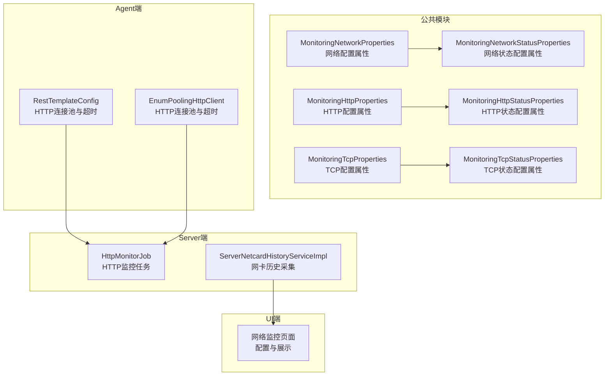
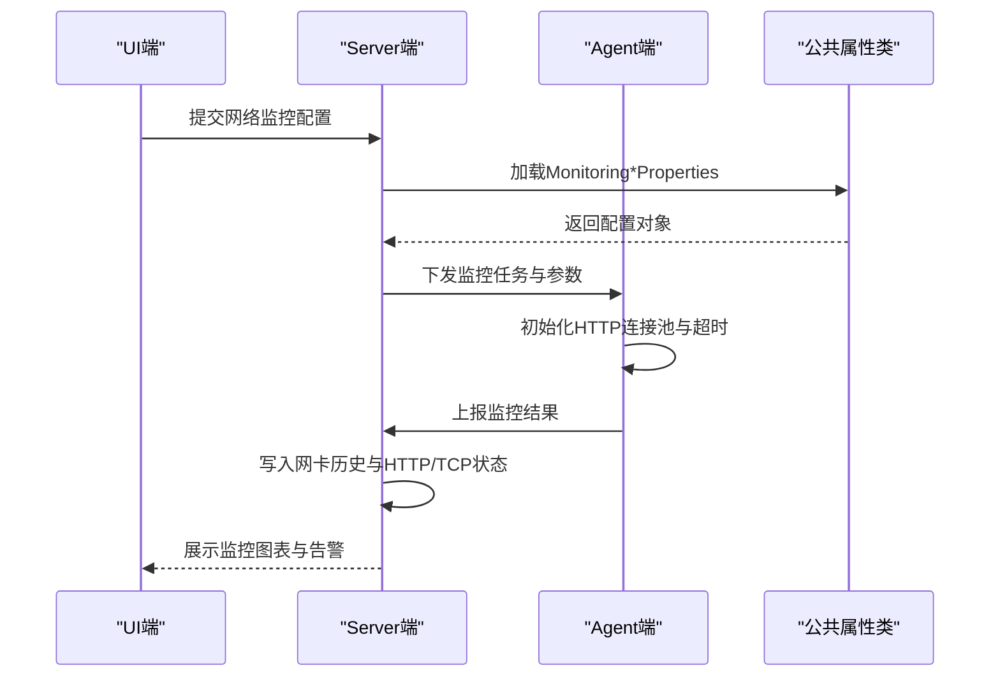
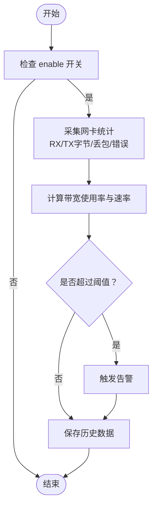
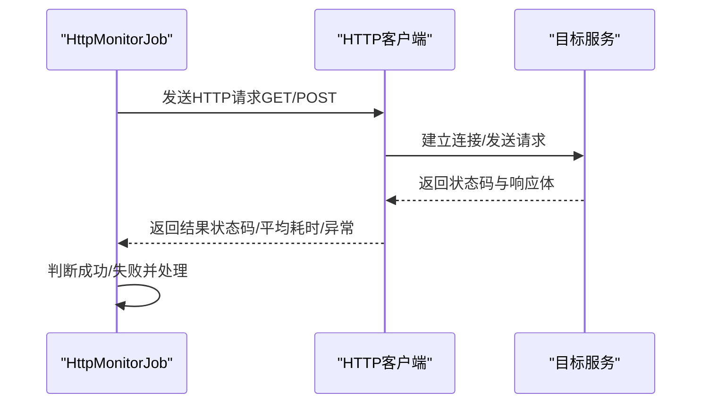
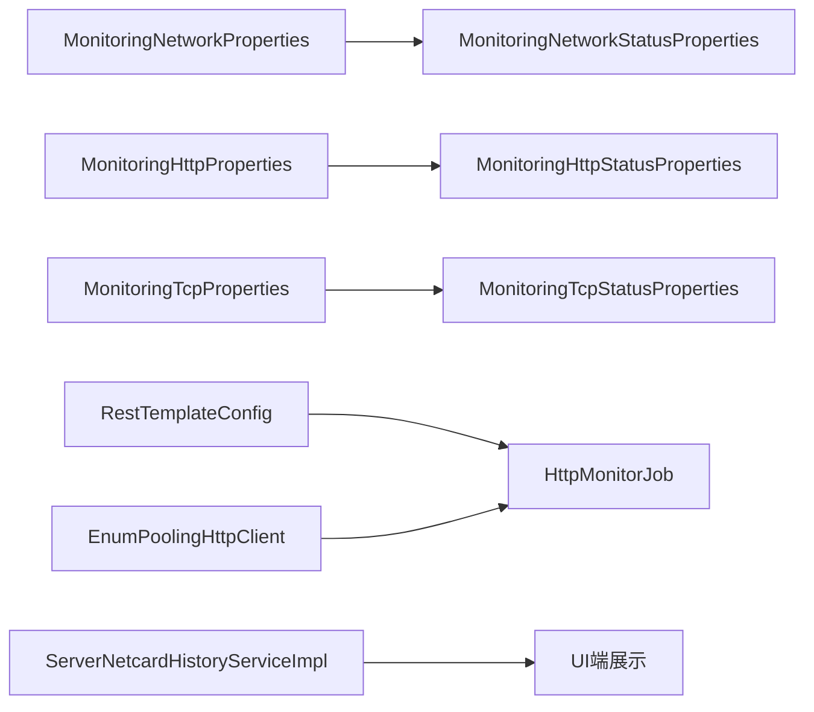

# 网络监控参数

<cite>
**本文引用的文件**
- [MonitoringNetworkProperties.java](file://phoenix-common/phoenix-common-core/src/main/java/com/gitee/pifeng/monitoring/common/property/server/MonitoringNetworkProperties.java)
- [MonitoringNetworkStatusProperties.java](file://phoenix-common/phoenix-common-core/src/main/java/com/gitee/pifeng/monitoring/common/property/server/MonitoringNetworkStatusProperties.java)
- [MonitoringHttpProperties.java](file://phoenix-common/phoenix-common-core/src/main/java/com/gitee/pifeng/monitoring/common/property/server/MonitoringHttpProperties.java)
- [MonitoringHttpStatusProperties.java](file://phoenix-common/phoenix-common-core/src/main/java/com/gitee/pifeng/monitoring/common/property/server/MonitoringHttpStatusProperties.java)
- [MonitoringTcpProperties.java](file://phoenix-common/phoenix-common-core/src/main/java/com/gitee/pifeng/monitoring/common/property/server/MonitoringTcpProperties.java)
- [MonitoringTcpStatusProperties.java](file://phoenix-common/phoenix-common-core/src/main/java/com/gitee/pifeng/monitoring/common/property/server/MonitoringTcpStatusProperties.java)
- [RestTemplateConfig.java](file://phoenix-agent/src/main/java/com/gitee/pifeng/monitoring/agent/config/RestTemplateConfig.java)
- [EnumPoolingHttpClient.java](file://phoenix-client/phoenix-client-core/src/main/java/com/gitee/pifeng/monitoring/plug/core/EnumPoolingHttpClient.java)
- [HttpMonitorJob.java](file://phoenix-server/src/main/java/com/gitee/pifeng/monitoring/server/business/server/monitor/http/HttpMonitorJob.java)
- [NetInterfaceUtils.java（SIGAR实现）](file://phoenix-common/phoenix-common-core/src/main/java/com/gitee/pifeng/monitoring/common/util/server/sigar/NetInterfaceUtils.java)
- [NetInterfaceUtils.java（OSHI实现）](file://phoenix-common/phoenix-common-core/src/main/java/com/gitee/pifeng/monitoring/common/util/server/oshi/NetInterfaceUtils.java)
- [ServerNetcardHistoryServiceImpl.java](file://phoenix-server/src/main/java/com/gitee/pifeng/monitoring/server/business/server/service/impl/ServerNetcardHistoryServiceImpl.java)
- [application.yml（agent）](file://phoenix-agent/src/main/resources/application.yml)
- [application.yml（server）](file://phoenix-server/src/main/resources/application.yml)
- [application.yml（ui）](file://phoenix-ui/src/main/resources/application.yml)
</cite>

## 目录
1. [简介](#简介)
2. [项目结构](#项目结构)
3. [核心组件](#核心组件)
4. [架构总览](#架构总览)
5. [详细组件分析](#详细组件分析)
6. [依赖关系分析](#依赖关系分析)
7. [性能考量](#性能考量)
8. [故障排查指南](#故障排查指南)
9. [结论](#结论)
10. [附录](#附录)

## 简介
本文件面向Phoenix监控系统中“网络监控参数”的配置与使用，围绕以下目标展开：
- 网络接口监控参数（MonitoringNetworkProperties）：网络接口选择、带宽使用率阈值、网络延迟监控、丢包率检测等。
- 网络状态监控参数（MonitoringNetworkStatusProperties）：网络连通性检查、路由监控、DNS解析监控等。
- HTTP监控参数（MonitoringHttpProperties）：HTTP请求监控、响应时间阈值、错误率监控、并发连接数控制等。
- HTTP状态监控参数（MonitoringHttpStatusProperties）：HTTP状态码统计、慢请求检测、接口可用性监控等。
- TCP监控参数（MonitoringTcpProperties）：TCP连接监控、连接状态检测、连接超时设置等。
- TCP状态监控参数（MonitoringTcpStatusProperties）：TCP三次握手监控、四次挥手检测、连接池管理等。

同时结合代码实现，给出最佳实践与故障排查建议，帮助用户建立完善的网络监控体系。

## 项目结构
Phoenix监控系统采用多模块架构，网络监控参数主要定义在公共模块的属性类中，并在Agent端进行HTTP/TCP连接池与超时配置，在Server端执行监控任务与历史数据采集，在UI端提供可视化与配置入口。

**图表来源**
- [MonitoringNetworkProperties.java:19-31](file://phoenix-common/phoenix-common-core/src/main/java/com/gitee/pifeng/monitoring/common/property/server/MonitoringNetworkProperties.java#L19-L31)
- [MonitoringNetworkStatusProperties.java:19-31](file://phoenix-common/phoenix-common-core/src/main/java/com/gitee/pifeng/monitoring/common/property/server/MonitoringNetworkStatusProperties.java#L19-L31)
- [MonitoringHttpProperties.java:18-30](file://phoenix-common/phoenix-common-core/src/main/java/com/gitee/pifeng/monitoring/common/property/server/MonitoringHttpProperties.java#L18-L30)
- [MonitoringHttpStatusProperties.java:18-30](file://phoenix-common/phoenix-common-core/src/main/java/com/gitee/pifeng/monitoring/common/property/server/MonitoringHttpStatusProperties.java#L18-L30)
- [MonitoringTcpProperties.java:18-30](file://phoenix-common/phoenix-common-core/src/main/java/com/gitee/pifeng/monitoring/common/property/server/MonitoringTcpProperties.java#L18-L30)
- [MonitoringTcpStatusProperties.java:18-30](file://phoenix-common/phoenix-common-core/src/main/java/com/gitee/pifeng/monitoring/common/property/server/MonitoringTcpStatusProperties.java#L18-L30)
- [RestTemplateConfig.java:98-138](file://phoenix-agent/src/main/java/com/gitee/pifeng/monitoring/agent/config/RestTemplateConfig.java#L98-L138)
- [EnumPoolingHttpClient.java:157-177](file://phoenix-client/phoenix-client-core/src/main/java/com/gitee/pifeng/monitoring/plug/core/EnumPoolingHttpClient.java#L157-L177)
- [HttpMonitorJob.java:196-279](file://phoenix-server/src/main/java/com/gitee/pifeng/monitoring/server/business/server/monitor/http/HttpMonitorJob.java#L196-L279)
- [ServerNetcardHistoryServiceImpl.java:60-76](file://phoenix-server/src/main/java/com/gitee/pifeng/monitoring/server/business/server/service/impl/ServerNetcardHistoryServiceImpl.java#L60-L76)

**章节来源**
- [MonitoringNetworkProperties.java:1-32](file://phoenix-common/phoenix-common-core/src/main/java/com/gitee/pifeng/monitoring/common/property/server/MonitoringNetworkProperties.java#L1-L32)
- [MonitoringNetworkStatusProperties.java:1-32](file://phoenix-common/phoenix-common-core/src/main/java/com/gitee/pifeng/monitoring/common/property/server/MonitoringNetworkStatusProperties.java#L1-L32)
- [MonitoringHttpProperties.java:1-31](file://phoenix-common/phoenix-common-core/src/main/java/com/gitee/pifeng/monitoring/common/property/server/MonitoringHttpProperties.java#L1-L31)
- [MonitoringHttpStatusProperties.java:1-31](file://phoenix-common/phoenix-common-core/src/main/java/com/gitee/pifeng/monitoring/common/property/server/MonitoringHttpStatusProperties.java#L1-L31)
- [MonitoringTcpProperties.java:1-31](file://phoenix-common/phoenix-common-core/src/main/java/com/gitee/pifeng/monitoring/common/property/server/MonitoringTcpProperties.java#L1-L31)
- [MonitoringTcpStatusProperties.java:1-31](file://phoenix-common/phoenix-common-core/src/main/java/com/gitee/pifeng/monitoring/common/property/server/MonitoringTcpStatusProperties.java#L1-L31)

## 核心组件
本节对网络监控相关的核心属性类进行逐项解读，明确各字段含义与配置要点。

- MonitoringNetworkProperties（网络配置属性）
  - enable：是否启用网络监控总开关。
  - networkStatusProperties：嵌套的网络状态监控配置对象。

- MonitoringNetworkStatusProperties（网络状态配置属性）
  - enable：是否启用网络状态监控。
  - alarmEnable：是否启用网络状态告警。

- MonitoringHttpProperties（HTTP配置属性）
  - enable：是否启用HTTP服务监控。
  - httpStatusProperties：嵌套的HTTP状态监控配置对象。

- MonitoringHttpStatusProperties（HTTP状态配置属性）
  - enable：是否启用HTTP状态监控。
  - alarmEnable：是否启用HTTP状态告警。

- MonitoringTcpProperties（TCP配置属性）
  - enable：是否启用TCP服务监控。
  - tcpStatusProperties：嵌套的TCP状态监控配置对象。

- MonitoringTcpStatusProperties（TCP状态配置属性）
  - enable：是否启用TCP状态监控。
  - alarmEnable：是否启用TCP状态告警。

上述属性类均实现了统一的标记接口，便于在系统中作为“超级Bean”被识别与注入。

**章节来源**
- [MonitoringNetworkProperties.java:19-31](file://phoenix-common/phoenix-common-core/src/main/java/com/gitee/pifeng/monitoring/common/property/server/MonitoringNetworkProperties.java#L19-L31)
- [MonitoringNetworkStatusProperties.java:19-31](file://phoenix-common/phoenix-common-core/src/main/java/com/gitee/pifeng/monitoring/common/property/server/MonitoringNetworkStatusProperties.java#L19-L31)
- [MonitoringHttpProperties.java:18-30](file://phoenix-common/phoenix-common-core/src/main/java/com/gitee/pifeng/monitoring/common/property/server/MonitoringHttpProperties.java#L18-L30)
- [MonitoringHttpStatusProperties.java:18-30](file://phoenix-common/phoenix-common-core/src/main/java/com/gitee/pifeng/monitoring/common/property/server/MonitoringHttpStatusProperties.java#L18-L30)
- [MonitoringTcpProperties.java:18-30](file://phoenix-common/phoenix-common-core/src/main/java/com/gitee/pifeng/monitoring/common/property/server/MonitoringTcpProperties.java#L18-L30)
- [MonitoringTcpStatusProperties.java:18-30](file://phoenix-common/phoenix-common-core/src/main/java/com/gitee/pifeng/monitoring/common/property/server/MonitoringTcpStatusProperties.java#L18-L30)

## 架构总览
下图展示了网络监控参数在系统中的流转路径：属性类定义于公共模块，Agent端负责HTTP/TCP连接池与超时配置，Server端执行监控任务并写入历史数据，UI端提供配置界面与可视化。

**图表来源**
- [RestTemplateConfig.java:98-138](file://phoenix-agent/src/main/java/com/gitee/pifeng/monitoring/agent/config/RestTemplateConfig.java#L98-L138)
- [EnumPoolingHttpClient.java:157-177](file://phoenix-client/phoenix-client-core/src/main/java/com/gitee/pifeng/monitoring/plug/core/EnumPoolingHttpClient.java#L157-L177)
- [HttpMonitorJob.java:196-279](file://phoenix-server/src/main/java/com/gitee/pifeng/monitoring/server/business/server/monitor/http/HttpMonitorJob.java#L196-L279)
- [ServerNetcardHistoryServiceImpl.java:60-76](file://phoenix-server/src/main/java/com/gitee/pifeng/monitoring/server/business/server/service/impl/ServerNetcardHistoryServiceImpl.java#L60-L76)

## 详细组件分析

### 网络接口监控参数（MonitoringNetworkProperties）
- 配置要点
  - enable：总开关，关闭后不进行任何网络接口层面的监控。
  - networkStatusProperties.enable：启用网络状态监控后，可进一步细化连通性、路由、DNS等检测。
  - networkStatusProperties.alarmEnable：开启告警后，网络状态异常会触发告警流程。

- 实现关联
  - 网卡统计采集：通过SIGAR或OSHI实现网卡统计，包含接收/发送字节数、丢包、错误计数等，用于计算带宽与丢包率。
  - 历史数据写入：Server端将网卡统计与速率指标持久化，供UI展示与趋势分析。

- 参数建议
  - 带宽使用率阈值：结合业务峰值与SLA设定，建议以95分位或峰值为基础制定阈值。
  - 丢包率阈值：通常小于0.1%，异常时需联动路由与链路质量检查。
  - 网络延迟监控：结合HTTP/TCP监控任务的响应时间阈值，形成闭环。

**图表来源**
- [NetInterfaceUtils.java（SIGAR实现）:71-99](file://phoenix-common/phoenix-common-core/src/main/java/com/gitee/pifeng/monitoring/common/util/server/sigar/NetInterfaceUtils.java#L71-L99)
- [NetInterfaceUtils.java（OSHI实现）:71-96](file://phoenix-common/phoenix-common-core/src/main/java/com/gitee/pifeng/monitoring/common/util/server/oshi/NetInterfaceUtils.java#L71-L96)
- [ServerNetcardHistoryServiceImpl.java:60-76](file://phoenix-server/src/main/java/com/gitee/pifeng/monitoring/server/business/server/service/impl/ServerNetcardHistoryServiceImpl.java#L60-L76)

**章节来源**
- [MonitoringNetworkProperties.java:19-31](file://phoenix-common/phoenix-common-core/src/main/java/com/gitee/pifeng/monitoring/common/property/server/MonitoringNetworkProperties.java#L19-L31)
- [MonitoringNetworkStatusProperties.java:19-31](file://phoenix-common/phoenix-common-core/src/main/java/com/gitee/pifeng/monitoring/common/property/server/MonitoringNetworkStatusProperties.java#L19-L31)
- [NetInterfaceUtils.java（SIGAR实现）:71-99](file://phoenix-common/phoenix-common-core/src/main/java/com/gitee/pifeng/monitoring/common/util/server/sigar/NetInterfaceUtils.java#L71-L99)
- [NetInterfaceUtils.java（OSHI实现）:71-96](file://phoenix-common/phoenix-common-core/src/main/java/com/gitee/pifeng/monitoring/common/util/server/oshi/NetInterfaceUtils.java#L71-L96)
- [ServerNetcardHistoryServiceImpl.java:60-76](file://phoenix-server/src/main/java/com/gitee/pifeng/monitoring/server/business/server/service/impl/ServerNetcardHistoryServiceImpl.java#L60-L76)

### 网络状态监控参数（MonitoringNetworkStatusProperties）
- 配置要点
  - enable：启用后执行网络连通性、路由可达性、DNS解析等基础检测。
  - alarmEnable：开启后异常状态将触发告警。

- 实现关联
  - 连通性检查：通常通过ICMP或TCP端口探测实现。
  - 路由监控：结合系统路由表与探测结果评估路径质量。
  - DNS解析监控：记录解析耗时与成功率，异常时定位DNS服务问题。

- 参数建议
  - 探测间隔：建议10–30秒，避免频繁探测造成网络压力。
  - 超时时间：根据网络RTT设定，避免长尾阻塞影响整体健康度判断。

**章节来源**
- [MonitoringNetworkStatusProperties.java:19-31](file://phoenix-common/phoenix-common-core/src/main/java/com/gitee/pifeng/monitoring/common/property/server/MonitoringNetworkStatusProperties.java#L19-L31)

### HTTP监控参数（MonitoringHttpProperties）
- 配置要点
  - enable：启用HTTP服务监控。
  - httpStatusProperties.enable/alarmEnable：分别控制HTTP状态与告警。

- 实现关联
  - 连接池与超时：Agent端通过连接池管理器设置连接总数、每路由最大连接、连接超时、Socket超时、请求等待超时等。
  - 监控任务：Server端的HTTP监控任务循环发送GET/POST请求，统计状态码、平均响应时间、异常信息，并据此更新状态。

**图表来源**
- [HttpMonitorJob.java:196-279](file://phoenix-server/src/main/java/com/gitee/pifeng/monitoring/server/business/server/monitor/http/HttpMonitorJob.java#L196-L279)
- [RestTemplateConfig.java:98-138](file://phoenix-agent/src/main/java/com/gitee/pifeng/monitoring/agent/config/RestTemplateConfig.java#L98-L138)
- [EnumPoolingHttpClient.java:157-177](file://phoenix-client/phoenix-client-core/src/main/java/com/gitee/pifeng/monitoring/plug/core/EnumPoolingHttpClient.java#L157-L177)

**章节来源**
- [MonitoringHttpProperties.java:18-30](file://phoenix-common/phoenix-common-core/src/main/java/com/gitee/pifeng/monitoring/common/property/server/MonitoringHttpProperties.java#L18-L30)
- [MonitoringHttpStatusProperties.java:18-30](file://phoenix-common/phoenix-common-core/src/main/java/com/gitee/pifeng/monitoring/common/property/server/MonitoringHttpStatusProperties.java#L18-L30)
- [HttpMonitorJob.java:196-279](file://phoenix-server/src/main/java/com/gitee/pifeng/monitoring/server/business/server/monitor/http/HttpMonitorJob.java#L196-L279)
- [RestTemplateConfig.java:98-138](file://phoenix-agent/src/main/java/com/gitee/pifeng/monitoring/agent/config/RestTemplateConfig.java#L98-L138)
- [EnumPoolingHttpClient.java:157-177](file://phoenix-client/phoenix-client-core/src/main/java/com/gitee/pifeng/monitoring/plug/core/EnumPoolingHttpClient.java#L157-L177)

### HTTP状态监控参数（MonitoringHttpStatusProperties）
- 配置要点
  - enable：启用HTTP状态统计与慢请求检测。
  - alarmEnable：开启后异常状态触发告警。

- 实现关联
  - 状态码统计：Server端按状态码聚合，辅助定位服务异常类型。
  - 慢请求检测：基于平均响应时间阈值识别慢接口，结合重试次数与阈值判定。

- 参数建议
  - 响应时间阈值：结合SLA设定，如P95/P99延迟阈值。
  - 错误率阈值：如连续失败次数或错误占比超过阈值即告警。

**章节来源**
- [MonitoringHttpStatusProperties.java:18-30](file://phoenix-common/phoenix-common-core/src/main/java/com/gitee/pifeng/monitoring/common/property/server/MonitoringHttpStatusProperties.java#L18-L30)
- [HttpMonitorJob.java:196-279](file://phoenix-server/src/main/java/com/gitee/pifeng/monitoring/server/business/server/monitor/http/HttpMonitorJob.java#L196-L279)

### TCP监控参数（MonitoringTcpProperties）
- 配置要点
  - enable：启用TCP服务监控。
  - tcpStatusProperties.enable/alarmEnable：分别控制TCP状态与告警。

- 实现关联
  - 连接监控：通过连接池管理器设置连接总数、每路由最大连接、空闲回收策略等。
  - 超时设置：连接超时、Socket超时、请求等待超时共同决定TCP连接的稳定性与吞吐。

- 参数建议
  - 连接池大小：根据并发量与RTT估算，避免过小导致排队超时。
  - 空闲回收：合理设置空闲与过期连接回收，降低资源占用。

**章节来源**
- [MonitoringTcpProperties.java:18-30](file://phoenix-common/phoenix-common-core/src/main/java/com/gitee/pifeng/monitoring/common/property/server/MonitoringTcpProperties.java#L18-L30)
- [MonitoringTcpStatusProperties.java:18-30](file://phoenix-common/phoenix-common-core/src/main/java/com/gitee/pifeng/monitoring/common/property/server/MonitoringTcpStatusProperties.java#L18-L30)
- [RestTemplateConfig.java:98-138](file://phoenix-agent/src/main/java/com/gitee/pifeng/monitoring/agent/config/RestTemplateConfig.java#L98-L138)
- [EnumPoolingHttpClient.java:157-177](file://phoenix-client/phoenix-client-core/src/main/java/com/gitee/pifeng/monitoring/plug/core/EnumPoolingHttpClient.java#L157-L177)

### TCP状态监控参数（MonitoringTcpStatusProperties）
- 配置要点
  - enable：启用TCP状态监控。
  - alarmEnable：开启后异常状态触发告警。

- 实现关联
  - 三次握手监控：通过连接建立阶段的超时与失败率识别异常。
  - 四次挥手检测：关注连接释放阶段的耗时与失败，避免资源泄漏。
  - 连接池管理：结合连接池参数与回收策略，确保连接健康与复用效率。

- 参数建议
  - 握手/挥手超时：根据网络质量与服务端处理能力调整。
  - 连接复用：启用Keep-Alive并设置合理的保活周期，减少频繁建连成本。

**章节来源**
- [MonitoringTcpStatusProperties.java:18-30](file://phoenix-common/phoenix-common-core/src/main/java/com/gitee/pifeng/monitoring/common/property/server/MonitoringTcpStatusProperties.java#L18-L30)
- [RestTemplateConfig.java:98-138](file://phoenix-agent/src/main/java/com/gitee/pifeng/monitoring/agent/config/RestTemplateConfig.java#L98-L138)
- [EnumPoolingHttpClient.java:157-177](file://phoenix-client/phoenix-client-core/src/main/java/com/gitee/pifeng/monitoring/plug/core/EnumPoolingHttpClient.java#L157-L177)

## 依赖关系分析
- 属性类依赖
  - MonitoringNetworkProperties 依赖 MonitoringNetworkStatusProperties。
  - MonitoringHttpProperties 依赖 MonitoringHttpStatusProperties。
  - MonitoringTcpProperties 依赖 MonitoringTcpStatusProperties。
- Agent端依赖
  - RestTemplateConfig 与 EnumPoolingHttpClient 提供HTTP连接池与超时配置，直接影响监控任务的稳定性与性能。
- Server端依赖
  - HttpMonitorJob 执行HTTP监控任务，ServerNetcardHistoryServiceImpl 采集网卡统计并写入历史。
- UI端依赖
  - UI端提供网络监控页面，用于配置与展示监控结果。

**图表来源**
- [MonitoringNetworkProperties.java:19-31](file://phoenix-common/phoenix-common-core/src/main/java/com/gitee/pifeng/monitoring/common/property/server/MonitoringNetworkProperties.java#L19-L31)
- [MonitoringHttpProperties.java:18-30](file://phoenix-common/phoenix-common-core/src/main/java/com/gitee/pifeng/monitoring/common/property/server/MonitoringHttpProperties.java#L18-L30)
- [MonitoringTcpProperties.java:18-30](file://phoenix-common/phoenix-common-core/src/main/java/com/gitee/pifeng/monitoring/common/property/server/MonitoringTcpProperties.java#L18-L30)
- [RestTemplateConfig.java:98-138](file://phoenix-agent/src/main/java/com/gitee/pifeng/monitoring/agent/config/RestTemplateConfig.java#L98-L138)
- [EnumPoolingHttpClient.java:157-177](file://phoenix-client/phoenix-client-core/src/main/java/com/gitee/pifeng/monitoring/plug/core/EnumPoolingHttpClient.java#L157-L177)
- [HttpMonitorJob.java:196-279](file://phoenix-server/src/main/java/com/gitee/pifeng/monitoring/server/business/server/monitor/http/HttpMonitorJob.java#L196-L279)
- [ServerNetcardHistoryServiceImpl.java:60-76](file://phoenix-server/src/main/java/com/gitee/pifeng/monitoring/server/business/server/service/impl/ServerNetcardHistoryServiceImpl.java#L60-L76)

**章节来源**
- [MonitoringNetworkProperties.java:19-31](file://phoenix-common/phoenix-common-core/src/main/java/com/gitee/pifeng/monitoring/common/property/server/MonitoringNetworkProperties.java#L19-L31)
- [MonitoringHttpProperties.java:18-30](file://phoenix-common/phoenix-common-core/src/main/java/com/gitee/pifeng/monitoring/common/property/server/MonitoringHttpProperties.java#L18-L30)
- [MonitoringTcpProperties.java:18-30](file://phoenix-common/phoenix-common-core/src/main/java/com/gitee/pifeng/monitoring/common/property/server/MonitoringTcpProperties.java#L18-L30)
- [RestTemplateConfig.java:98-138](file://phoenix-agent/src/main/java/com/gitee/pifeng/monitoring/agent/config/RestTemplateConfig.java#L98-L138)
- [EnumPoolingHttpClient.java:157-177](file://phoenix-client/phoenix-client-core/src/main/java/com/gitee/pifeng/monitoring/plug/core/EnumPoolingHttpClient.java#L157-L177)
- [HttpMonitorJob.java:196-279](file://phoenix-server/src/main/java/com/gitee/pifeng/monitoring/server/business/server/monitor/http/HttpMonitorJob.java#L196-L279)
- [ServerNetcardHistoryServiceImpl.java:60-76](file://phoenix-server/src/main/java/com/gitee/pifeng/monitoring/server/business/server/service/impl/ServerNetcardHistoryServiceImpl.java#L60-L76)

## 性能考量
- 连接池与超时
  - 连接池大小：根据并发量与RTT估算，避免过小导致排队超时，过大导致资源浪费。
  - 每路由最大连接：限制热点目标的连接数，防止资源倾斜。
  - 超时参数：连接超时、Socket超时、请求等待超时需协同设置，避免长尾阻塞。
- 采样与阈值
  - 网络接口采样间隔：建议10–30秒，兼顾实时性与开销。
  - 带宽使用率与丢包率阈值：以95分位或峰值为基础制定，避免误报。
- 监控任务调度
  - HTTP/TCP监控任务的重试次数与阈值需与超时参数匹配，避免无效重试消耗资源。

[本节为通用指导，无需特定文件引用]

## 故障排查指南
- HTTP监控异常
  - 现象：状态码非200、平均响应时间异常升高。
  - 排查：检查连接池参数、超时设置、目标服务健康状况与限流策略。
  - 参考实现：监控任务在多次尝试后仍失败时，按异常处理逻辑更新状态。
- TCP连接问题
  - 现象：连接池耗尽、连接超时、握手失败。
  - 排查：检查连接池大小、每路由最大连接、空闲回收策略与目标服务端配置。
- 网络接口异常
  - 现象：带宽使用率飙升、丢包率升高、延迟异常。
  - 排查：结合网卡统计与链路质量检查，定位瓶颈与异常流量。

**章节来源**
- [HttpMonitorJob.java:196-279](file://phoenix-server/src/main/java/com/gitee/pifeng/monitoring/server/business/server/monitor/http/HttpMonitorJob.java#L196-L279)
- [RestTemplateConfig.java:98-138](file://phoenix-agent/src/main/java/com/gitee/pifeng/monitoring/agent/config/RestTemplateConfig.java#L98-L138)
- [EnumPoolingHttpClient.java:157-177](file://phoenix-client/phoenix-client-core/src/main/java/com/gitee/pifeng/monitoring/plug/core/EnumPoolingHttpClient.java#L157-L177)
- [NetInterfaceUtils.java（SIGAR实现）:71-99](file://phoenix-common/phoenix-common-core/src/main/java/com/gitee/pifeng/monitoring/common/util/server/sigar/NetInterfaceUtils.java#L71-L99)
- [NetInterfaceUtils.java（OSHI实现）:71-96](file://phoenix-common/phoenix-common-core/src/main/java/com/gitee/pifeng/monitoring/common/util/server/oshi/NetInterfaceUtils.java#L71-L96)

## 结论
通过将“网络接口监控参数”“网络状态监控参数”“HTTP监控参数”“HTTP状态监控参数”“TCP监控参数”“TCP状态监控参数”有机组合，Phoenix监控系统能够覆盖从底层网卡到上层HTTP/TCP的全链路监控。结合合理的连接池与超时配置、科学的阈值设定以及完善的告警机制，可有效提升网络监控的准确性与稳定性，为生产环境提供可靠的网络健康保障。

[本节为总结性内容，无需特定文件引用]

## 附录
- 配置文件位置参考
  - Agent端：application.yml
  - Server端：application.yml
  - UI端：application.yml

**章节来源**
- [application.yml（agent）](file://phoenix-agent/src/main/resources/application.yml)
- [application.yml（server）](file://phoenix-server/src/main/resources/application.yml)
- [application.yml（ui）](file://phoenix-ui/src/main/resources/application.yml)