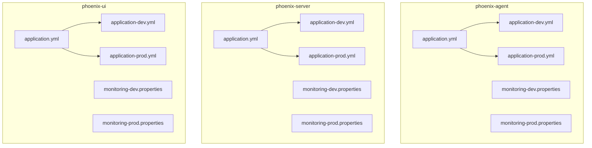
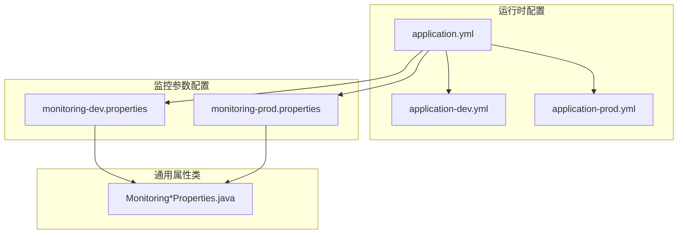
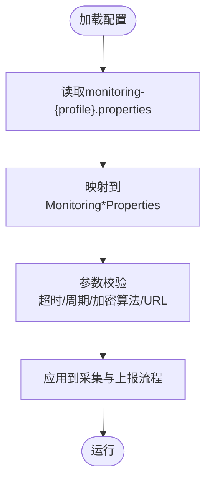
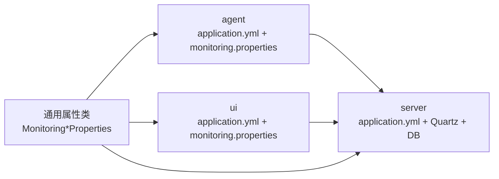

# 配置管理

<cite>
**本文引用的文件**
- [phoenix-agent 应用配置](file://phoenix-agent/src/main/resources/application.yml)
- [phoenix-agent 开发环境配置](file://phoenix-agent/src/main/resources/application-dev.yml)
- [phoenix-agent 生产环境配置](file://phoenix-agent/src/main/resources/application-prod.yml)
- [phoenix-agent 监控配置（开发）](file://phoenix-agent/src/main/resources/monitoring-dev.properties)
- [phoenix-agent 监控配置（生产）](file://phoenix-agent/src/main/resources/monitoring-prod.properties)
- [phoenix-server 应用配置](file://phoenix-server/src/main/resources/application.yml)
- [phoenix-server 开发环境配置](file://phoenix-server/src/main/resources/application-dev.yml)
- [phoenix-server 生产环境配置](file://phoenix-server/src/main/resources/application-prod.yml)
- [phoenix-server 监控配置（开发）](file://phoenix-server/src/main/resources/monitoring-dev.properties)
- [phoenix-server 监控配置（生产）](file://phoenix-server/src/main/resources/monitoring-prod.properties)
- [phoenix-ui 应用配置](file://phoenix-ui/src/main/resources/application.yml)
- [phoenix-ui 开发环境配置](file://phoenix-ui/src/main/resources/application-dev.yml)
- [phoenix-ui 生产环境配置](file://phoenix-ui/src/main/resources/application-prod.yml)
- [phoenix-ui 监控配置（开发）](file://phoenix-ui/src/main/resources/monitoring-dev.properties)
- [phoenix-ui 监控配置（生产）](file://phoenix-ui/src/main/resources/monitoring-prod.properties)
- [客户端属性定义（Spring Boot）](file://phoenix-client/phoenix-client-spring-boot-starter/src/main/java/com/gitee/pifeng/monitoring/starter/property/MonitoringSpringBootProperties.java)
- [通用属性：通信HTTP](file://phoenix-common/phoenix-common-core/src/main/java/com/gitee/pifeng/monitoring/common/property/client/MonitoringCommHttpProperties.java)
- [通用属性：实例信息](file://phoenix-common/phoenix-common-core/src/main/java/com/gitee/pifeng/monitoring/common/property/client/MonitoringInstanceProperties.java)
- [通用属性：心跳](file://phoenix-common/phoenix-common-core/src/main/java/com/gitee/pifeng/monitoring/common/property/client/MonitoringHeartbeatProperties.java)
- [通用属性：JVM信息](file://phoenix-common/phoenix-common-core/src/main/java/com/gitee/pifeng/monitoring/common/property/client/MonitoringJvmInfoProperties.java)
- [通用属性：服务器信息](file://phoenix-common/phoenix-common-core/src/main/java/com/gitee/pifeng/monitoring/common/property/client/MonitoringServerInfoProperties.java)
- [通用属性：安全-AES](file://phoenix-common/phoenix-common-core/src/main/java/com/gitee/pifeng/monitoring/common/property/client/MonitoringSecureAesProperties.java)
- [通用属性：安全-DES](file://phoenix-common/phoenix-common-core/src/main/java/com/gitee/pifeng/monitoring/common/property/client/MonitoringSecureDesProperties.java)
- [通用属性：安全-SM4](file://phoenix-common/phoenix-common-core/src/main/java/com/gitee/pifeng/monitoring/common/property/client/MonitoringSecureSm4Properties.java)
- [通用属性：安全总览](file://phoenix-common/phoenix-common-core/src/main/java/com/gitee/pifeng/monitoring/common/property/client/MonitoringSecureProperties.java)
- [通用属性：告警-邮件](file://phoenix-common/phoenix-common-core/src/main/java/com/gitee/pifeng/monitoring/common/property/server/MonitoringAlarmMailProperties.java)
- [通用属性：告警-短信](file://phoenix-common/phoenix-common-core/src/main/java/com/gitee/pifeng/monitoring/common/property/server/MonitoringAlarmSmsProperties.java)
- [通用属性：数据库](file://phoenix-common/phoenix-common-core/src/main/java/com/gitee/pifeng/monitoring/common/property/server/MonitoringDbProperties.java)
- [通用属性：数据库状态](file://phoenix-common/phoenix-common-core/src/main/java/com/gitee/pifeng/monitoring/common/property/server/MonitoringDbStatusProperties.java)
- [通用属性：数据库表空间](file://phoenix-common/phoenix-common-core/src/main/java/com/gitee/pifeng/monitoring/common/property/server/MonitoringDbTableSpaceProperties.java)
- [通用属性：HTTP](file://phoenix-common/phoenix-common-core/src/main/java/com/gitee/pifeng/monitoring/common/property/server/MonitoringHttpProperties.java)
- [通用属性：HTTP状态](file://phoenix-common/phoenix-common-core/src/main/java/com/gitee/pifeng/monitoring/common/property/server/MonitoringHttpStatusProperties.java)
- [phoenix-server 开发配置类](file://phoenix-server/src/main/java/com/gitee/pifeng/monitoring/server/config/phoenix/MonitoringServerDevConfig.java)
- [phoenix-server 生产配置类](file://phoenix-server/src/main/java/com/gitee/pifeng/monitoring/server/config/phoenix/MonitoringServerProdConfig.java)
- [phoenix-ui 开发配置类](file://phoenix-ui/src/main/java/com/gitee/pifeng/monitoring/ui/config/phoenix/MonitoringUiDevConfig.java)
- [phoenix-ui 生产配置类](file://phoenix-ui/src/main/java/com/gitee/pifeng/monitoring/ui/config/phoenix/MonitoringUiProdConfig.java)
</cite>

## 目录
1. [简介](#简介)
2. [项目结构](#项目结构)
3. [核心组件](#核心组件)
4. [架构总览](#架构总览)
5. [详细组件分析](#详细组件分析)
6. [依赖关系分析](#依赖关系分析)
7. [性能考量](#性能考量)
8. [故障排查指南](#故障排查指南)
9. [结论](#结论)
10. [附录](#附录)

## 简介
本文件面向Phoenix监控系统的配置管理，围绕以下目标展开：
- 环境配置管理：开发、测试、生产三套环境的配置差异、文件组织与环境切换机制
- 监控参数配置：监控开关、采样频率、上报周期、告警阈值等关键参数的配置方法与最佳实践
- 安全配置：数据加密、访问控制、SSL、安全审计等安全相关参数
- 分布式部署：集群、负载均衡、数据同步、故障转移等分布式环境配置要点
- 动态配置与热更新：在不重启服务的前提下更新配置的可行方案
- 配置验证与检查：确保配置正确性与有效性的方法
- 配置备份与回滚：版本管理、变更追踪与回滚策略

## 项目结构
Phoenix由三个子模块构成：phoenix-agent（监控代理）、phoenix-server（监控服务端）、phoenix-ui（监控UI）。每个模块均采用Spring Boot标准结构，包含application.yml与application-{profile}.yml以及monitoring-{profile}.properties两类配置文件，分别负责运行时配置与监控参数。

图表来源
- [phoenix-agent 应用配置](file://phoenix-agent/src/main/resources/application.yml)
- [phoenix-agent 开发环境配置](file://phoenix-agent/src/main/resources/application-dev.yml)
- [phoenix-agent 生产环境配置](file://phoenix-agent/src/main/resources/application-prod.yml)
- [phoenix-server 应用配置](file://phoenix-server/src/main/resources/application.yml)
- [phoenix-server 开发环境配置](file://phoenix-server/src/main/resources/application-dev.yml)
- [phoenix-server 生产环境配置](file://phoenix-server/src/main/resources/application-prod.yml)
- [phoenix-ui 应用配置](file://phoenix-ui/src/main/resources/application.yml)
- [phoenix-ui 开发环境配置](file://phoenix-ui/src/main/resources/application-dev.yml)
- [phoenix-ui 生产环境配置](file://phoenix-ui/src/main/resources/application-prod.yml)

章节来源
- [phoenix-agent 应用配置](file://phoenix-agent/src/main/resources/application.yml)
- [phoenix-server 应用配置](file://phoenix-server/src/main/resources/application.yml)
- [phoenix-ui 应用配置](file://phoenix-ui/src/main/resources/application.yml)

## 核心组件
- 运行时配置（application.yml + application-{profile}.yml）
  - 包含服务器端口、上下文路径、日志级别、Spring配置、管理端点、接口文档等
  - 通过spring.profiles.active选择当前环境
- 监控配置（monitoring-{profile}.properties）
  - 包含加密算法与密钥、通信URL与超时、实例元信息、心跳与采集频率、JVM/服务器信息采集开关与周期等
- 属性类（Java Bean）
  - 将配置映射到强类型对象，便于在业务层直接使用与校验

章节来源
- [phoenix-agent 监控配置（开发）](file://phoenix-agent/src/main/resources/monitoring-dev.properties)
- [phoenix-agent 监控配置（生产）](file://phoenix-agent/src/main/resources/monitoring-prod.properties)
- [phoenix-server 监控配置（开发）](file://phoenix-server/src/main/resources/monitoring-dev.properties)
- [phoenix-server 监控配置（生产）](file://phoenix-server/src/main/resources/monitoring-prod.properties)
- [phoenix-ui 监控配置（开发）](file://phoenix-ui/src/main/resources/monitoring-dev.properties)
- [phoenix-ui 监控配置（生产）](file://phoenix-ui/src/main/resources/monitoring-prod.properties)

## 架构总览
Phoenix的配置体系遵循“运行时配置 + 监控参数配置”的双轨制，运行时配置决定进程行为（端口、日志、管理端点、数据源等），监控参数配置决定采集与上报行为（加密、通信、心跳、采集周期等）。三模块共享通用属性类，确保配置一致性与可扩展性。

图表来源
- [phoenix-agent 应用配置](file://phoenix-agent/src/main/resources/application.yml)
- [phoenix-agent 监控配置（开发）](file://phoenix-agent/src/main/resources/monitoring-dev.properties)
- [phoenix-agent 监控配置（生产）](file://phoenix-agent/src/main/resources/monitoring-prod.properties)
- [phoenix-server 应用配置](file://phoenix-server/src/main/resources/application.yml)
- [phoenix-server 监控配置（开发）](file://phoenix-server/src/main/resources/monitoring-dev.properties)
- [phoenix-server 监控配置（生产）](file://phoenix-server/src/main/resources/monitoring-prod.properties)
- [phoenix-ui 应用配置](file://phoenix-ui/src/main/resources/application.yml)
- [phoenix-ui 监控配置（开发）](file://phoenix-ui/src/main/resources/monitoring-dev.properties)
- [phoenix-ui 监控配置（生产）](file://phoenix-ui/src/main/resources/monitoring-prod.properties)

## 详细组件分析

### 环境配置管理（开发/测试/生产）
- 文件组织
  - application.yml：公共默认配置
  - application-{dev|prod}.yml：差异化配置（端口、数据源、邮件、认证等）
  - monitoring-{dev|prod}.properties：监控参数（加密、通信、心跳、采集周期等）
- 环境切换
  - 通过spring.profiles.active激活对应环境
  - 各模块独立维护profile，避免相互影响
- 差异对照
  - 端口：agent/dev=12000、server/dev=16000、ui/dev=80；prod端口一致
  - 数据源：server/dev/prod分别指向不同数据库实例与凭据
  - 认证：ui在dev/prod中配置了self-auth与CAS相关参数
  - SSL：ui在dev/prod中保留SSL开关占位，便于后续启用
  - 管理端点：仅暴露health/shutdown，限制访问地址为本地

章节来源
- [phoenix-agent 应用配置](file://phoenix-agent/src/main/resources/application.yml)
- [phoenix-agent 开发环境配置](file://phoenix-agent/src/main/resources/application-dev.yml)
- [phoenix-agent 生产环境配置](file://phoenix-agent/src/main/resources/application-prod.yml)
- [phoenix-server 应用配置](file://phoenix-server/src/main/resources/application.yml)
- [phoenix-server 开发环境配置](file://phoenix-server/src/main/resources/application-dev.yml)
- [phoenix-server 生产环境配置](file://phoenix-server/src/main/resources/application-prod.yml)
- [phoenix-ui 应用配置](file://phoenix-ui/src/main/resources/application.yml)
- [phoenix-ui 开发环境配置](file://phoenix-ui/src/main/resources/application-dev.yml)
- [phoenix-ui 生产环境配置](file://phoenix-ui/src/main/resources/application-prod.yml)

### 监控参数配置（采集与上报）
- 关键参数类别
  - 加密与安全：encryption-algorithm-type与AES/DES/SM4密钥
  - 通信：http.url、connect-timeout、socket-timeout、connection-request-timeout
  - 实例：endpoint、name、order、language、desc、ip
  - 心跳与采集：heartbeat.rate、server-info.enable/rate、jvm-info.enable/rate
- 参数最佳实践
  - 心跳与采集周期：建议心跳≥30秒，server-info/jvm-info≥30秒，避免过度采集
  - 超时设置：socket-timeout应高于业务处理耗时，避免误判超时
  - 加密密钥：生产环境务必使用强随机密钥并妥善保管，定期轮换
  - 通信URL：agent/server/ui需指向正确的服务端上下文路径
- 参数映射
  - 通过通用属性类将monitoring.properties映射到强类型对象，便于在代码中使用与校验

图表来源
- [phoenix-agent 监控配置（开发）](file://phoenix-agent/src/main/resources/monitoring-dev.properties)
- [phoenix-agent 监控配置（生产）](file://phoenix-agent/src/main/resources/monitoring-prod.properties)
- [phoenix-server 监控配置（开发）](file://phoenix-server/src/main/resources/monitoring-dev.properties)
- [phoenix-server 监控配置（生产）](file://phoenix-server/src/main/resources/monitoring-prod.properties)
- [phoenix-ui 监控配置（开发）](file://phoenix-ui/src/main/resources/monitoring-dev.properties)
- [phoenix-ui 监控配置（生产）](file://phoenix-ui/src/main/resources/monitoring-prod.properties)
- [通用属性：通信HTTP](file://phoenix-common/phoenix-common-core/src/main/java/com/gitee/pifeng/monitoring/common/property/client/MonitoringCommHttpProperties.java)
- [通用属性：实例信息](file://phoenix-common/phoenix-common-core/src/main/java/com/gitee/pifeng/monitoring/common/property/client/MonitoringInstanceProperties.java)
- [通用属性：心跳](file://phoenix-common/phoenix-common-core/src/main/java/com/gitee/pifeng/monitoring/common/property/client/MonitoringHeartbeatProperties.java)
- [通用属性：JVM信息](file://phoenix-common/phoenix-common-core/src/main/java/com/gitee/pifeng/monitoring/common/property/client/MonitoringJvmInfoProperties.java)
- [通用属性：服务器信息](file://phoenix-common/phoenix-common-core/src/main/java/com/gitee/pifeng/monitoring/common/property/client/MonitoringServerInfoProperties.java)
- [通用属性：安全-AES](file://phoenix-common/phoenix-common-core/src/main/java/com/gitee/pifeng/monitoring/common/property/client/MonitoringSecureAesProperties.java)
- [通用属性：安全-DES](file://phoenix-common/phoenix-common-core/src/main/java/com/gitee/pifeng/monitoring/common/property/client/MonitoringSecureDesProperties.java)
- [通用属性：安全-SM4](file://phoenix-common/phoenix-common-core/src/main/java/com/gitee/pifeng/monitoring/common/property/client/MonitoringSecureSm4Properties.java)
- [通用属性：安全总览](file://phoenix-common/phoenix-common-core/src/main/java/com/gitee/pifeng/monitoring/common/property/client/MonitoringSecureProperties.java)

章节来源
- [phoenix-agent 监控配置（开发）](file://phoenix-agent/src/main/resources/monitoring-dev.properties)
- [phoenix-agent 监控配置（生产）](file://phoenix-agent/src/main/resources/monitoring-prod.properties)
- [phoenix-server 监控配置（开发）](file://phoenix-server/src/main/resources/monitoring-dev.properties)
- [phoenix-server 监控配置（生产）](file://phoenix-server/src/main/resources/monitoring-prod.properties)
- [phoenix-ui 监控配置（开发）](file://phoenix-ui/src/main/resources/monitoring-dev.properties)
- [phoenix-ui 监控配置（生产）](file://phoenix-ui/src/main/resources/monitoring-prod.properties)

### 安全配置
- 数据加密
  - 支持AES/DES/SM4三种算法，需同时配置算法类型与对应密钥
  - 建议生产环境使用AES并定期轮换密钥
- 访问控制
  - 管理端点仅暴露health/shutdown，且限制本地访问
  - 接口文档Knife4j/Swagger提供Basic认证
- SSL
  - ui模块保留SSL开关与证书配置占位，便于按需启用
- 安全审计
  - Undertow访问日志开启，便于审计与排障
  - Druid监控页面提供登录与重置能力

章节来源
- [phoenix-agent 应用配置](file://phoenix-agent/src/main/resources/application.yml)
- [phoenix-server 应用配置](file://phoenix-server/src/main/resources/application.yml)
- [phoenix-ui 应用配置](file://phoenix-ui/src/main/resources/application.yml)
- [phoenix-ui 开发环境配置](file://phoenix-ui/src/main/resources/application-dev.yml)
- [phoenix-ui 生产环境配置](file://phoenix-ui/src/main/resources/application-prod.yml)

### 分布式部署配置
- 集群与Quartz
  - server模块启用Quartz集群模式，配置了分布式节点检查间隔、线程池大小等
  - 通过LocalDataSourceJobStore与JDBC持久化，确保任务在多实例间可靠分发
- 数据源与连接池
  - 使用Druid连接池，配置初始大小、最大活跃数、超时与慢SQL统计
  - 提供Druid监控页面与过滤器，便于运维观测
- 负载均衡与故障转移
  - 通过统一的服务端口与上下文路径对外提供服务，结合反向代理实现LB
  - agent/server/ui通过monitoring.http.url指向统一的服务端入口，便于故障切换

章节来源
- [phoenix-server 应用配置](file://phoenix-server/src/main/resources/application.yml)
- [phoenix-server 开发环境配置](file://phoenix-server/src/main/resources/application-dev.yml)
- [phoenix-server 生产环境配置](file://phoenix-server/src/main/resources/application-prod.yml)

### 配置热更新与动态配置
- 可行方案
  - 运行时配置：通过Spring Cloud Config或Nacos等外部配置中心，结合refresh事件实现部分配置热更新
  - 监控参数：将monitoring.properties映射为可刷新的Bean，结合事件监听在运行时重新加载
- 注意事项
  - 心跳与采集周期调整需谨慎，避免频繁重启线程/定时任务
  - 加密密钥更换需配合密钥轮换流程，确保新旧密钥过渡期数据兼容

章节来源
- [phoenix-agent 监控配置（开发）](file://phoenix-agent/src/main/resources/monitoring-dev.properties)
- [phoenix-server 监控配置（开发）](file://phoenix-server/src/main/resources/monitoring-dev.properties)
- [phoenix-ui 监控配置（开发）](file://phoenix-ui/src/main/resources/monitoring-dev.properties)

### 配置验证与检查
- 参数校验清单
  - 必填项：http.url、instance.name、encryption-algorithm-type与对应密钥
  - 合法范围：heartbeat.rate≥30、server-info.rate≥30、jvm-info.rate≥30
  - 通信超时：socket-timeout应大于业务处理耗时
- 检查方法
  - 启动阶段打印配置摘要
  - 单元测试覆盖关键属性类的默认值与异常场景
  - 运行时通过管理端点health/status确认服务可用性

章节来源
- [通用属性：通信HTTP](file://phoenix-common/phoenix-common-core/src/main/java/com/gitee/pifeng/monitoring/common/property/client/MonitoringCommHttpProperties.java)
- [通用属性：心跳](file://phoenix-common/phoenix-common-core/src/main/java/com/gitee/pifeng/monitoring/common/property/client/MonitoringHeartbeatProperties.java)
- [通用属性：服务器信息](file://phoenix-common/phoenix-common-core/src/main/java/com/gitee/pifeng/monitoring/common/property/client/MonitoringServerInfoProperties.java)
- [通用属性：JVM信息](file://phoenix-common/phoenix-common-core/src/main/java/com/gitee/pifeng/monitoring/common/property/client/MonitoringJvmInfoProperties.java)

### 配置备份与回滚
- 版本管理
  - 将application.yml与monitoring.properties纳入版本控制系统，记录每次变更
- 变更追踪
  - 在提交信息中明确变更内容与影响范围
- 回滚策略
  - 通过版本控制系统快速回退到上一稳定版本
  - 对于关键配置（密钥、URL、端口），提供灰度发布与快速回滚预案

## 依赖关系分析
- 组件耦合
  - 各模块的application.yml与monitoring.properties相互独立，耦合度低
  - 通用属性类为跨模块共享契约，确保配置语义一致
- 外部依赖
  - server模块依赖数据库与Quartz集群，需确保网络连通与权限正确
  - agent/ui通过HTTP与server交互，需关注网络延迟与超时设置

图表来源
- [phoenix-agent 应用配置](file://phoenix-agent/src/main/resources/application.yml)
- [phoenix-agent 监控配置（开发）](file://phoenix-agent/src/main/resources/monitoring-dev.properties)
- [phoenix-server 应用配置](file://phoenix-server/src/main/resources/application.yml)
- [phoenix-ui 应用配置](file://phoenix-ui/src/main/resources/application.yml)
- [phoenix-ui 监控配置（开发）](file://phoenix-ui/src/main/resources/monitoring-dev.properties)

## 性能考量
- 采集频率与超时
  - 合理设置heartbeat与server-info/jvm-info的rate，避免过高导致资源消耗
  - socket-timeout应覆盖峰值业务耗时，减少误报
- 连接池与线程池
  - Druid连接池参数需根据QPS与并发调整，避免连接争用
  - Quartz线程池大小与clusterCheckinInterval需与实例规模匹配
- 日志与监控
  - Undertow访问日志开启有助于定位问题，但需关注磁盘占用
  - Druid监控页面仅限本地访问，避免暴露敏感信息

## 故障排查指南
- 启动失败
  - 检查spring.profiles.active与对应profile文件是否存在
  - 核对端口占用与上下文路径冲突
- 通信异常
  - 确认monitoring.http.url正确且可达
  - 检查connect-timeout/socket-timeout是否过短
- 采集异常
  - 检查server-info/jvm-info的enable与rate设置
  - 关注操作系统权限与Sigar依赖（如启用）
- 安全问题
  - 管理端点仅本地访问，避免远程调用
  - SSL未启用时，建议通过反向代理提供TLS终止

章节来源
- [phoenix-agent 监控配置（开发）](file://phoenix-agent/src/main/resources/monitoring-dev.properties)
- [phoenix-server 应用配置](file://phoenix-server/src/main/resources/application.yml)
- [phoenix-ui 应用配置](file://phoenix-ui/src/main/resources/application.yml)

## 结论
Phoenix的配置管理体系以“运行时配置 + 监控参数配置”为核心，辅以通用属性类实现强类型映射与一致性保障。通过profile机制实现环境隔离，结合Quartz集群与Druid连接池满足分布式与高可用需求。建议在生产环境中强化密钥轮换、超时与周期参数校验，并建立完善的版本管理与回滚机制，确保配置的正确性、安全性与可维护性。

## 附录
- 配置参数速查
  - 加密：encryption-algorithm-type、aes.key、des.key、sm4.key
  - 通信：http.url、connect-timeout、socket-timeout、connection-request-timeout
  - 实例：endpoint、name、order、language、desc、ip
  - 心跳与采集：heartbeat.rate、server-info.enable/rate、jvm-info.enable/rate
- 模块映射
  - agent：负责采集并上报至server
  - server：接收数据、存储与告警
  - ui：提供可视化与配置管理界面