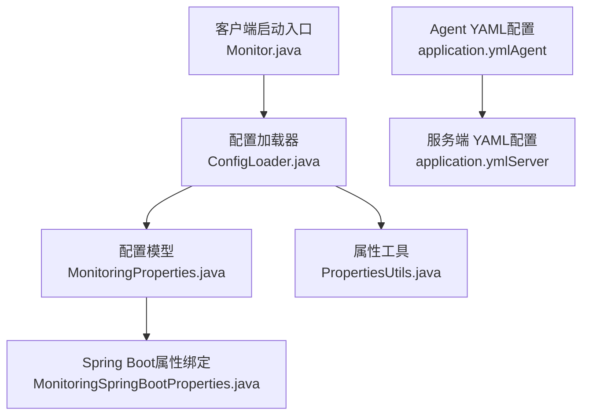
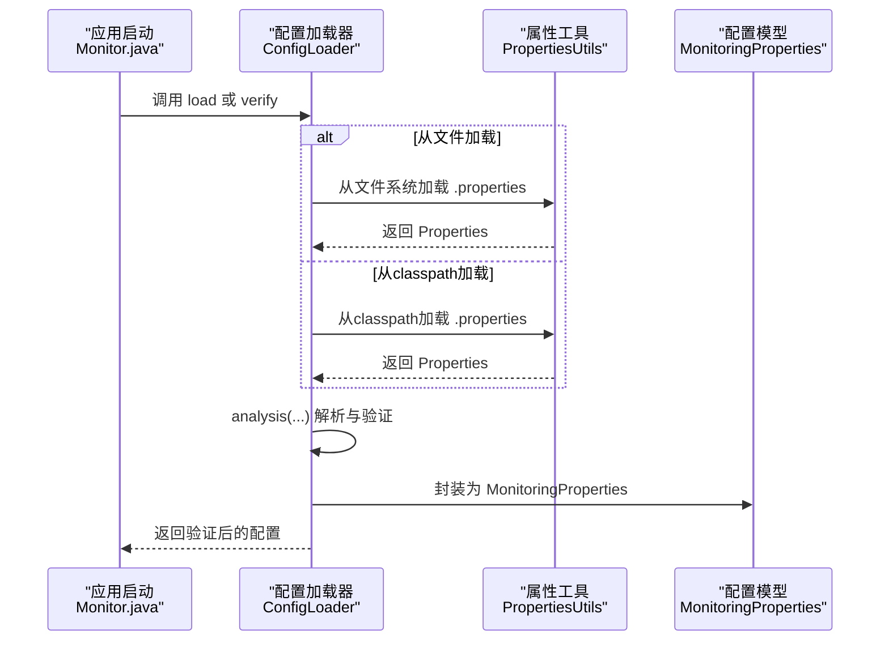
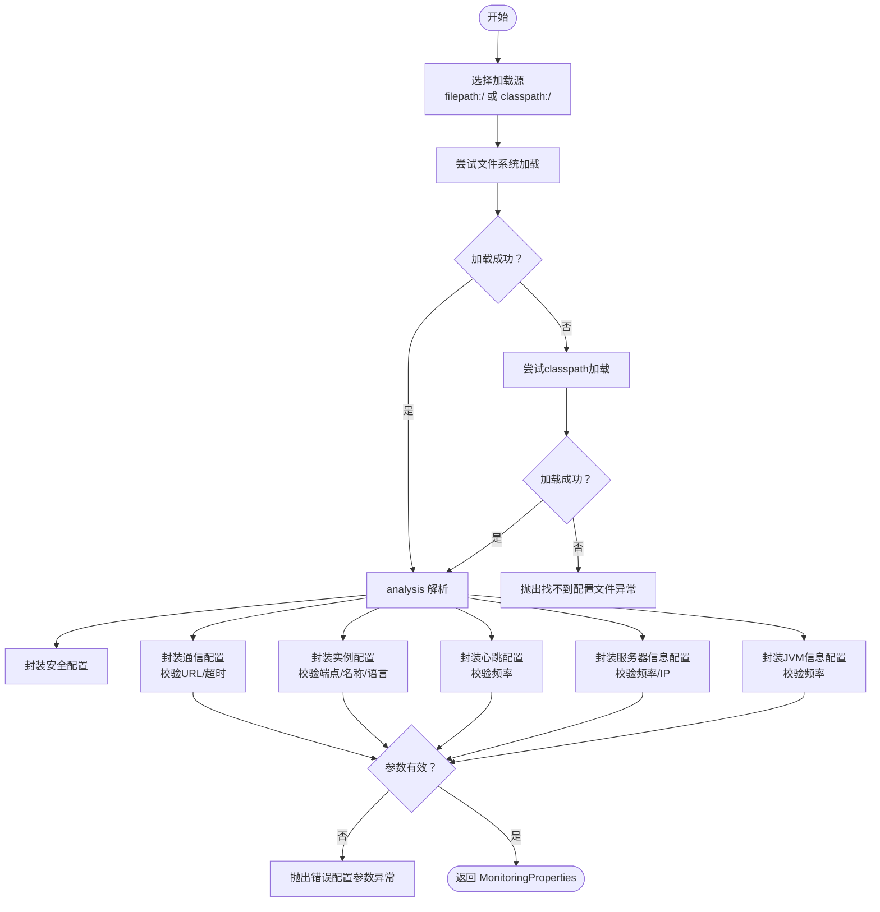
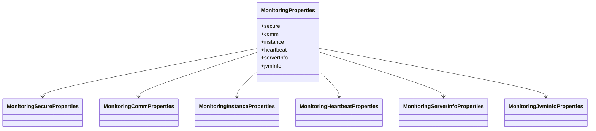
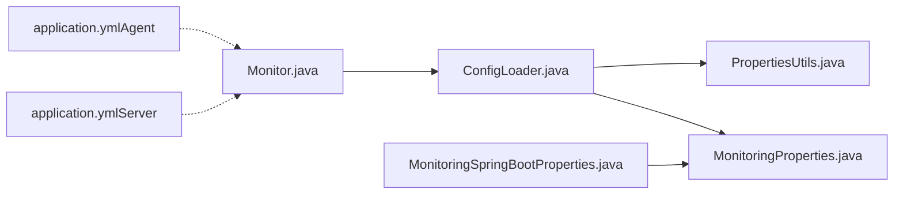

# 配置验证与检查

<cite>
**本文引用的文件**   
- [ConfigLoader.java](file://phoenix-client/phoenix-client-core/src/main/java/com/gitee/pifeng/monitoring/plug/core/ConfigLoader.java)
- [MonitoringProperties.java](file://phoenix-common/phoenix-common-core/src/main/java/com/gitee/pifeng/monitoring/common/property/client/MonitoringProperties.java)
- [MonitoringSpringBootProperties.java](file://phoenix-client/phoenix-client-spring-boot-starter/src/main/java/com/gitee/pifeng/monitoring/starter/property/MonitoringSpringBootProperties.java)
- [PropertiesUtils.java](file://phoenix-common/phoenix-common-core/src/main/java/com/gitee/pifeng/monitoring/common/util/PropertiesUtils.java)
- [ErrorConfigParamException.java](file://phoenix-common/phoenix-common-core/src/main/java/com/gitee/pifeng/monitoring/common/exception/ErrorConfigParamException.java)
- [NotFoundConfigParamException.java](file://phoenix-common/phoenix-common-core/src/main/java/com/gitee/pifeng/monitoring/common/exception/NotFoundConfigParamException.java)
- [NotFoundConfigFileException.java](file://phoenix-common/phoenix-common-core/src/main/java/com/gitee/pifeng/monitoring/common/exception/NotFoundConfigFileException.java)
- [MonitoringUniversalException.java](file://phoenix-common/phoenix-common-core/src/main/java/com/gitee/pifeng/monitoring/common/exception/MonitoringUniversalException.java)
- [application.yml（Agent）](file://phoenix-agent/src/main/resources/application.yml)
- [application.yml（Server）](file://phoenix-server/src/main/resources/application.yml)
- [Monitor.java](file://phoenix-client/phoenix-client-core/src/main/java/com/gitee/pifeng/monitoring/plug/Monitor.java)
- [EndpointTypeEnums.java](file://phoenix-common/phoenix-common-core/src/main/java/com/gitee/pifeng/monitoring/common/constant/EndpointTypeEnums.java)
</cite>

## 更新摘要
**变更内容**   
- 更新了配置验证中端点类型验证的实现细节，从大小写敏感改为大小写不敏感的验证方式
- 增强了配置验证的灵活性和用户友好性说明
- 补充了端点类型验证的改进对用户体验的影响分析

## 目录
1. [简介](#简介)
2. [项目结构](#项目结构)
3. [核心组件](#核心组件)
4. [架构总览](#架构总览)
5. [详细组件分析](#详细组件分析)
6. [依赖分析](#依赖分析)
7. [性能考量](#性能考量)
8. [故障排查指南](#故障排查指南)
9. [结论](#结论)
10. [附录](#附录)

## 简介
本文件面向Phoenix监控系统的配置验证与检查，围绕以下目标展开：
- 配置文件语法与参数验证：YAML格式检查、参数类型校验、必填项检查、数值范围与格式验证、依赖关系验证。
- 配置加载失败诊断：错误日志分析、冲突检测、环境兼容性检查。
- 配置热更新验证：如何确认更新已生效。
- 配置备份与恢复验证：文件完整性、一致性与回滚验证。
- 配置变更影响评估：变更前风险与影响预判。

## 项目结构
Phoenix监控系统在客户端侧通过统一的配置加载与验证模块完成配置解析与校验，服务端与Agent侧通过YAML配置文件承载运行参数。关键位置如下：
- 客户端配置加载与验证：phoenix-client-core 的 ConfigLoader 负责解析与校验。
- 配置模型：common-core 的 MonitoringProperties 及其子属性类承载配置结构。
- Spring Boot集成：phoenix-client-spring-boot-starter 提供基于前缀的属性绑定。
- 配置文件来源：PropertiesUtils 支持从classpath与文件系统加载 .properties；YAML配置位于各模块 resources 下。
- 异常体系：统一的 MonitoringUniversalException 及其子类用于配置错误分类抛出。

**图表来源**
- [Monitor.java:113-140](file://phoenix-client/phoenix-client-core/src/main/java/com/gitee/pifeng/monitoring/plug/Monitor.java#L113-L140)
- [ConfigLoader.java:95-155](file://phoenix-client/phoenix-client-core/src/main/java/com/gitee/pifeng/monitoring/plug/core/ConfigLoader.java#L95-L155)
- [MonitoringProperties.java:18-55](file://phoenix-common/phoenix-common-core/src/main/java/com/gitee/pifeng/monitoring/common/property/client/MonitoringProperties.java#L18-L55)
- [PropertiesUtils.java:47-87](file://phoenix-common/phoenix-common-core/src/main/java/com/gitee/pifeng/monitoring/common/util/PropertiesUtils.java#L47-L87)
- [MonitoringSpringBootProperties.java:17-22](file://phoenix-client/phoenix-client-spring-boot-starter/src/main/java/com/gitee/pifeng/monitoring/starter/property/MonitoringSpringBootProperties.java#L17-L22)
- [application.yml（Agent）:1-111](file://phoenix-agent/src/main/resources/application.yml#L1-L111)
- [application.yml（Server）:1-271](file://phoenix-server/src/main/resources/application.yml#L1-L271)

**章节来源**
- [Monitor.java:113-140](file://phoenix-client/phoenix-client-core/src/main/java/com/gitee/pifeng/monitoring/plug/Monitor.java#L113-L140)
- [ConfigLoader.java:95-155](file://phoenix-client/phoenix-client-core/src/main/java/com/gitee/pifeng/monitoring/plug/core/ConfigLoader.java#L95-L155)
- [MonitoringProperties.java:18-55](file://phoenix-common/phoenix-common-core/src/main/java/com/gitee/pifeng/monitoring/common/property/client/MonitoringProperties.java#L18-L55)
- [PropertiesUtils.java:47-87](file://phoenix-common/phoenix-common-core/src/main/java/com/gitee/pifeng/monitoring/common/util/PropertiesUtils.java#L47-L87)
- [MonitoringSpringBootProperties.java:17-22](file://phoenix-client/phoenix-client-spring-boot-starter/src/main/java/com/gitee/pifeng/monitoring/starter/property/MonitoringSpringBootProperties.java#L17-L22)
- [application.yml（Agent）:1-111](file://phoenix-agent/src/main/resources/application.yml#L1-L111)
- [application.yml（Server）:1-271](file://phoenix-server/src/main/resources/application.yml#L1-L271)

## 核心组件
- 配置加载器（ConfigLoader）：负责从多种来源加载配置（文件系统、classpath），解析为 MonitoringProperties 并执行验证。
- 配置模型（MonitoringProperties）：集中定义安全、通信、实例、心跳、服务器信息、JVM信息等配置域。
- 属性工具（PropertiesUtils）：提供从classpath与文件系统加载 .properties 的能力。
- Spring Boot属性绑定（MonitoringSpringBootProperties）：将外部配置映射到 MonitoringProperties。
- 异常体系：ErrorConfigParamException、NotFoundConfigParamException、NotFoundConfigFileException 统一捕获与报告配置问题。

**章节来源**
- [ConfigLoader.java:71-155](file://phoenix-client/phoenix-client-core/src/main/java/com/gitee/pifeng/monitoring/plug/core/ConfigLoader.java#L71-L155)
- [MonitoringProperties.java:18-55](file://phoenix-common/phoenix-common-core/src/main/java/com/gitee/pifeng/monitoring/common/property/client/MonitoringProperties.java#L18-L55)
- [PropertiesUtils.java:47-87](file://phoenix-common/phoenix-common-core/src/main/java/com/gitee/pifeng/monitoring/common/util/PropertiesUtils.java#L47-L87)
- [MonitoringSpringBootProperties.java:17-22](file://phoenix-client/phoenix-client-spring-boot-starter/src/main/java/com/gitee/pifeng/monitoring/starter/property/MonitoringSpringBootProperties.java#L17-L22)
- [ErrorConfigParamException.java:11-25](file://phoenix-common/phoenix-common-core/src/main/java/com/gitee/pifeng/monitoring/common/exception/ErrorConfigParamException.java#L11-L25)
- [NotFoundConfigParamException.java:11-26](file://phoenix-common/phoenix-common-core/src/main/java/com/gitee/pifeng/monitoring/common/exception/NotFoundConfigParamException.java#L11-L26)
- [NotFoundConfigFileException.java:11-27](file://phoenix-common/phoenix-common-core/src/main/java/com/gitee/pifeng/monitoring/common/exception/NotFoundConfigFileException.java#L11-L27)

## 架构总览
配置从加载到验证的关键流程如下：

**图表来源**
- [Monitor.java:119-140](file://phoenix-client/phoenix-client-core/src/main/java/com/gitee/pifeng/monitoring/plug/Monitor.java#L119-L140)
- [ConfigLoader.java:95-155](file://phoenix-client/phoenix-client-core/src/main/java/com/gitee/pifeng/monitoring/plug/core/ConfigLoader.java#L95-L155)
- [PropertiesUtils.java:47-87](file://phoenix-common/phoenix-common-core/src/main/java/com/gitee/pifeng/monitoring/common/util/PropertiesUtils.java#L47-L87)

## 详细组件分析

### 配置加载与验证流程（ConfigLoader）
- 加载顺序与容错：优先按 filepath: 或 classpath: 前缀尝试，随后回退到常见路径（config/、jar同级、根路径、classpath:/config/、classpath:/）。若均失败则抛出"找不到配置文件"异常。
- 解析与封装：analysis 调用多个 wrap 方法，分别封装安全、通信、实例、心跳、服务器信息、JVM信息等配置域。
- 参数验证：
  - 必填项：实例名称、HTTP(S) 服务端URL。
  - 类型与范围：超时时间、心跳频率、服务器信息频率必须大于等于阈值；实例端点类型限定于 server/agent/client/ui；IP地址合法性校验。
  - 格式与依赖：URL末尾去除多余斜杠；端点类型枚举校验；未配置时采用默认值。

**更新** 端点类型验证现采用大小写不敏感的方式，提高了配置验证的灵活性和用户友好性

**图表来源**
- [ConfigLoader.java:95-155](file://phoenix-client/phoenix-client-core/src/main/java/com/gitee/pifeng/monitoring/plug/core/ConfigLoader.java#L95-L155)
- [ConfigLoader.java:170-179](file://phoenix-client/phoenix-client-core/src/main/java/com/gitee/pifeng/monitoring/plug/core/ConfigLoader.java#L170-L179)
- [ConfigLoader.java:377-427](file://phoenix-client/phoenix-client-core/src/main/java/com/gitee/pifeng/monitoring/plug/core/ConfigLoader.java#L377-L427)
- [ConfigLoader.java:442-495](file://phoenix-client/phoenix-client-core/src/main/java/com/gitee/pifeng/monitoring/plug/core/ConfigLoader.java#L442-L495)
- [ConfigLoader.java:509-531](file://phoenix-client/phoenix-client-core/src/main/java/com/gitee/pifeng/monitoring/plug/core/ConfigLoader.java#L509-L531)
- [ConfigLoader.java:545-591](file://phoenix-client/phoenix-client-core/src/main/java/com/gitee/pifeng/monitoring/plug/core/ConfigLoader.java#L545-L591)
- [ConfigLoader.java:605-634](file://phoenix-client/phoenix-client-core/src/main/java/com/gitee/pifeng/monitoring/plug/core/ConfigLoader.java#L605-L634)

**章节来源**
- [ConfigLoader.java:95-155](file://phoenix-client/phoenix-client-core/src/main/java/com/gitee/pifeng/monitoring/plug/core/ConfigLoader.java#L95-L155)
- [ConfigLoader.java:170-179](file://phoenix-client/phoenix-client-core/src/main/java/com/gitee/pifeng/monitoring/plug/core/ConfigLoader.java#L170-L179)
- [ConfigLoader.java:377-427](file://phoenix-client/phoenix-client-core/src/main/java/com/gitee/pifeng/monitoring/plug/core/ConfigLoader.java#L377-L427)
- [ConfigLoader.java:442-495](file://phoenix-client/phoenix-client-core/src/main/java/com/gitee/pifeng/monitoring/plug/core/ConfigLoader.java#L442-L495)
- [ConfigLoader.java:509-531](file://phoenix-client/phoenix-client-core/src/main/java/com/gitee/pifeng/monitoring/plug/core/ConfigLoader.java#L509-L531)
- [ConfigLoader.java:545-591](file://phoenix-client/phoenix-client-core/src/main/java/com/gitee/pifeng/monitoring/plug/core/ConfigLoader.java#L545-L591)
- [ConfigLoader.java:605-634](file://phoenix-client/phoenix-client-core/src/main/java/com/gitee/pifeng/monitoring/plug/core/ConfigLoader.java#L605-L634)

### 配置模型（MonitoringProperties）
- 结构化配置：包含 secure、comm、instance、heartbeat、serverInfo、jvmInfo 等域，便于分组验证与管理。
- 与Spring Boot集成：MonitoringSpringBootProperties 通过 @ConfigurationProperties(prefix = "phoenix.monitoring") 绑定外部配置。

**图表来源**
- [MonitoringProperties.java:18-55](file://phoenix-common/phoenix-common-core/src/main/java/com/gitee/pifeng/monitoring/common/property/client/MonitoringProperties.java#L18-L55)
- [MonitoringSpringBootProperties.java:17-22](file://phoenix-client/phoenix-client-spring-boot-starter/src/main/java/com/gitee/pifeng/monitoring/starter/property/MonitoringSpringBootProperties.java#L17-L22)

**章节来源**
- [MonitoringProperties.java:18-55](file://phoenix-common/phoenix-common-core/src/main/java/com/gitee/pifeng/monitoring/common/property/client/MonitoringProperties.java#L18-L55)
- [MonitoringSpringBootProperties.java:17-22](file://phoenix-client/phoenix-client-spring-boot-starter/src/main/java/com/gitee/pifeng/monitoring/starter/property/MonitoringSpringBootProperties.java#L17-L22)

### Spring Boot属性绑定（MonitoringSpringBootProperties）
- 作用：将外部配置（如 application.yml 中的 phoenix.monitoring.*）映射到 MonitoringProperties，便于在Spring环境中直接使用。
- 使用场景：UI、Agent、Server 等模块可直接注入 MonitoringSpringBootProperties 获取配置。

**章节来源**
- [MonitoringSpringBootProperties.java:17-22](file://phoenix-client/phoenix-client-spring-boot-starter/src/main/java/com/gitee/pifeng/monitoring/starter/property/MonitoringSpringBootProperties.java#L17-L22)

### 属性文件加载工具（PropertiesUtils）
- 功能：从classpath与文件系统加载 .properties，统一编码为UTF-8，避免乱码。
- 用途：ConfigLoader 在不同加载路径失败时回退使用。

**章节来源**
- [PropertiesUtils.java:47-87](file://phoenix-common/phoenix-common-core/src/main/java/com/gitee/pifeng/monitoring/common/util/PropertiesUtils.java#L47-L87)

### 异常体系
- MonitoringUniversalException：通用异常基类。
- ErrorConfigParamException：参数错误（如超时时间非正、频率过低、IP非法等）。
- NotFoundConfigParamException：缺少必要参数（如实例名称、HTTP(S) URL）。
- NotFoundConfigFileException：找不到配置文件。

**章节来源**
- [MonitoringUniversalException.java:11-30](file://phoenix-common/phoenix-common-core/src/main/java/com/gitee/pifeng/monitoring/common/exception/MonitoringUniversalException.java#L11-L30)
- [ErrorConfigParamException.java:11-25](file://phoenix-common/phoenix-common-core/src/main/java/com/gitee/pifeng/monitoring/common/exception/ErrorConfigParamException.java#L11-L25)
- [NotFoundConfigParamException.java:11-26](file://phoenix-common/phoenix-common-core/src/main/java/com/gitee/pifeng/monitoring/common/exception/NotFoundConfigParamException.java#L11-L26)
- [NotFoundConfigFileException.java:11-27](file://phoenix-common/phoenix-common-core/src/main/java/com/gitee/pifeng/monitoring/common/exception/NotFoundConfigFileException.java#L11-L27)

### 端点类型验证的改进
**更新** ConfigLoader中的端点类型验证采用了大小写不敏感的比较方式，显著提升了配置验证的灵活性和用户友好性。

- **改进前**：使用大小写敏感的 `equals()` 方法进行端点类型比较，要求配置值必须与枚举常量完全匹配（server、agent、client、ui）。
- **改进后**：使用大小写不敏感的 `equalsIgnoreCase()` 方法进行端点类型比较，支持任意大小写的输入格式。
- **用户收益**：用户可以使用 Server、SERVER、Server、sErVeR 等任意大小写组合，无需严格遵循特定格式。

**章节来源**
- [ConfigLoader.java:473-480](file://phoenix-client/phoenix-client-core/src/main/java/com/gitee/pifeng/monitoring/plug/core/ConfigLoader.java#L473-L480)
- [EndpointTypeEnums.java:18-38](file://phoenix-common/phoenix-common-core/src/main/java/com/gitee/pifeng/monitoring/common/constant/EndpointTypeEnums.java#L18-L38)

## 依赖分析
- 启动入口 Monitor.java 调用 ConfigLoader 进行加载/验证。
- ConfigLoader 依赖 PropertiesUtils 进行文件加载，依赖 MonitoringProperties 作为结果载体。
- Spring Boot属性绑定通过 MonitoringSpringBootProperties 间接依赖 MonitoringProperties。
- Agent/Server 的 application.yml 提供运行期环境配置（端口、日志、管理端点等），与配置验证逻辑互补。

**图表来源**
- [Monitor.java:119-140](file://phoenix-client/phoenix-client-core/src/main/java/com/gitee/pifeng/monitoring/plug/Monitor.java#L119-L140)
- [ConfigLoader.java:95-155](file://phoenix-client/phoenix-client-core/src/main/java/com/gitee/pifeng/monitoring/plug/core/ConfigLoader.java#L95-L155)
- [PropertiesUtils.java:47-87](file://phoenix-common/phoenix-common-core/src/main/java/com/gitee/pifeng/monitoring/common/util/PropertiesUtils.java#L47-L87)
- [MonitoringProperties.java:18-55](file://phoenix-common/phoenix-common-core/src/main/java/com/gitee/pifeng/monitoring/common/property/client/MonitoringProperties.java#L18-L55)
- [MonitoringSpringBootProperties.java:17-22](file://phoenix-client/phoenix-client-spring-boot-starter/src/main/java/com/gitee/pifeng/monitoring/starter/property/MonitoringSpringBootProperties.java#L17-L22)
- [application.yml（Agent）:1-111](file://phoenix-agent/src/main/resources/application.yml#L1-L111)
- [application.yml（Server）:1-271](file://phoenix-server/src/main/resources/application.yml#L1-L271)

**章节来源**
- [Monitor.java:119-140](file://phoenix-client/phoenix-client-core/src/main/java/com/gitee/pifeng/monitoring/plug/Monitor.java#L119-L140)
- [ConfigLoader.java:95-155](file://phoenix-client/phoenix-client-core/src/main/java/com/gitee/pifeng/monitoring/plug/core/ConfigLoader.java#L95-L155)
- [PropertiesUtils.java:47-87](file://phoenix-common/phoenix-common-core/src/main/java/com/gitee/pifeng/monitoring/common/util/PropertiesUtils.java#L47-L87)
- [MonitoringProperties.java:18-55](file://phoenix-common/phoenix-common-core/src/main/java/com/gitee/pifeng/monitoring/common/property/client/MonitoringProperties.java#L18-L55)
- [MonitoringSpringBootProperties.java:17-22](file://phoenix-client/phoenix-client-spring-boot-starter/src/main/java/com/gitee/pifeng/monitoring/starter/property/MonitoringSpringBootProperties.java#L17-L22)
- [application.yml（Agent）:1-111](file://phoenix-agent/src/main/resources/application.yml#L1-L111)
- [application.yml（Server）:1-271](file://phoenix-server/src/main/resources/application.yml#L1-L271)

## 性能考量
- 配置加载仅在启动阶段执行，对运行时性能影响极小。
- 验证逻辑集中在 analysis 与各 wrap 方法内，分支清晰，复杂度可控。
- 日志记录在验证成功与失败时均有输出，便于快速定位问题。

## 故障排查指南

### 1. 配置文件语法与参数验证
- YAML格式检查：确保缩进与键值对正确，避免混合缩进与Tab。
- 参数类型验证：超时时间、频率等数值需为整数且大于阈值；IP地址需符合IPv4格式。
- 必填项检查：实例名称、HTTP(S) 服务端URL为必填。
- 依赖关系验证：URL末尾不应有多余斜杠；端点类型必须为 server/agent/client/ui 之一。

**更新** 端点类型验证现支持任意大小写输入，用户无需再担心大小写格式问题

**章节来源**
- [ConfigLoader.java:377-427](file://phoenix-client/phoenix-client-core/src/main/java/com/gitee/pifeng/monitoring/plug/core/ConfigLoader.java#L377-L427)
- [ConfigLoader.java:442-495](file://phoenix-client/phoenix-client-core/src/main/java/com/gitee/pifeng/monitoring/plug/core/ConfigLoader.java#L442-L495)
- [ConfigLoader.java:509-531](file://phoenix-client/phoenix-client-core/src/main/java/com/gitee/pifeng/monitoring/plug/core/ConfigLoader.java#L509-L531)
- [ConfigLoader.java:545-591](file://phoenix-client/phoenix-client-core/src/main/java/com/gitee/pifeng/monitoring/plug/core/ConfigLoader.java#L545-L591)
- [ConfigLoader.java:605-634](file://phoenix-client/phoenix-client-core/src/main/java/com/gitee/pifeng/monitoring/plug/core/ConfigLoader.java#L605-L634)

### 2. 配置加载失败诊断
- 错误日志分析：关注启动日志中"监控配置项"、"验证监控配置成功"等输出，以及异常堆栈。
- 冲突检测：确认同一配置项未在多处重复定义且值冲突；例如端点类型与实例名称同时缺失。
- 环境兼容性检查：classpath 与文件系统路径是否正确；权限是否允许读取；编码是否为UTF-8。

**章节来源**
- [ConfigLoader.java:95-155](file://phoenix-client/phoenix-client-core/src/main/java/com/gitee/pifeng/monitoring/plug/core/ConfigLoader.java#L95-L155)
- [PropertiesUtils.java:47-87](file://phoenix-common/phoenix-common-core/src/main/java/com/gitee/pifeng/monitoring/common/util/PropertiesUtils.java#L47-L87)
- [application.yml（Agent）:24-30](file://phoenix-agent/src/main/resources/application.yml#L24-L30)
- [application.yml（Server）:24-31](file://phoenix-server/src/main/resources/application.yml#L24-L31)

### 3. 配置热更新验证
- 验证方法：在运行时重新调用验证流程（verify），或重启客户端以应用新配置；观察日志输出确认新配置生效。
- 关注点：通信超时、心跳频率、服务器信息采集频率等关键参数更新后是否按预期工作。

**章节来源**
- [Monitor.java:119-140](file://phoenix-client/phoenix-client-core/src/main/java/com/gitee/pifeng/monitoring/plug/Monitor.java#L119-L140)
- [ConfigLoader.java:71-78](file://phoenix-client/phoenix-client-core/src/main/java/com/gitee/pifeng/monitoring/plug/core/ConfigLoader.java#L71-L78)

### 4. 配置备份与恢复验证
- 备份：保存当前配置文件（YAML或Properties），记录关键键值。
- 恢复：替换为备份文件后，执行验证流程；核对日志输出与运行行为是否一致。
- 一致性验证：对比恢复前后配置模型（MonitoringProperties）关键字段是否一致。

**章节来源**
- [ConfigLoader.java:71-78](file://phoenix-client/phoenix-client-core/src/main/java/com/gitee/pifeng/monitoring/plug/core/ConfigLoader.java#L71-L78)
- [MonitoringProperties.java:18-55](file://phoenix-common/phoenix-common-core/src/main/java/com/gitee/pifeng/monitoring/common/property/client/MonitoringProperties.java#L18-L55)

### 5. 配置变更影响评估
- 影响面：通信超时影响网络稳定性；心跳频率影响告警与存活检测；服务器/JVM信息采集频率影响资源占用与数据新鲜度。
- 风险控制：变更前先在测试环境验证；对关键参数设置合理阈值；准备回滚方案。

## 结论
Phoenix监控系统的配置验证与检查以 ConfigLoader 为核心，结合 MonitoringProperties 模型与 Spring Boot 绑定，实现了从加载、解析到验证的完整闭环。通过明确的异常分类与日志输出，能够高效定位配置问题；配合YAML与Properties双通道加载，满足多样化部署需求。

**更新** 最新的改进将端点类型验证从大小写敏感改为大小写不敏感，显著提升了配置验证的灵活性和用户友好性，用户可以使用任意大小写的端点类型值而无需担心格式问题。

建议在生产环境中严格执行"变更前评估—验证—回滚预案"的流程，确保配置变更的安全与稳定。

## 附录
- Agent与Server的 application.yml 提供了运行期环境配置参考，包括日志级别、管理端点、Swagger文档等，有助于整体系统健康检查与排障。

**章节来源**
- [application.yml（Agent）:1-111](file://phoenix-agent/src/main/resources/application.yml#L1-L111)
- [application.yml（Server）:1-271](file://phoenix-server/src/main/resources/application.yml#L1-L271)