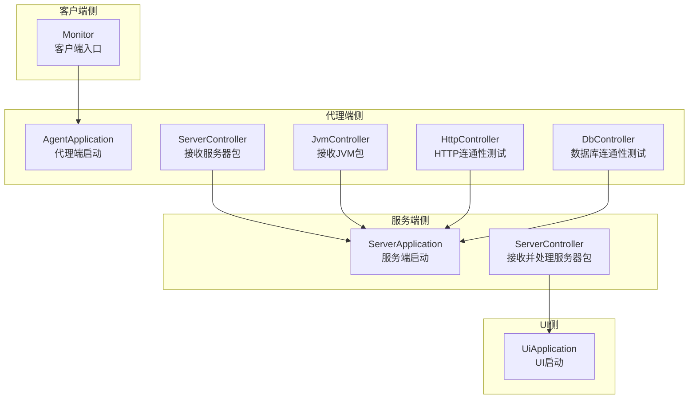
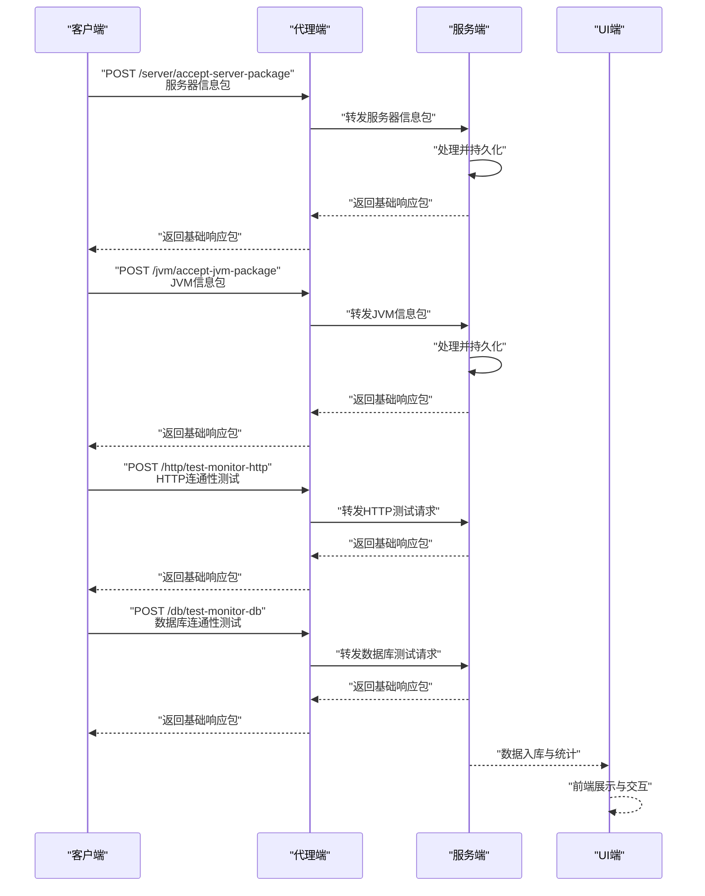
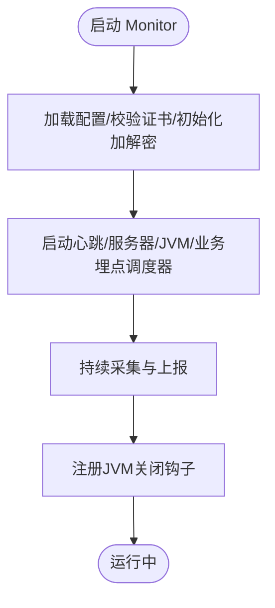
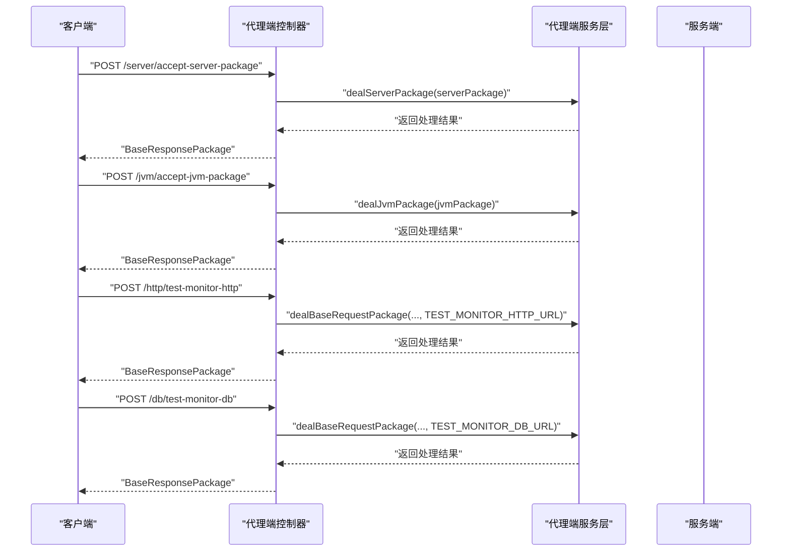
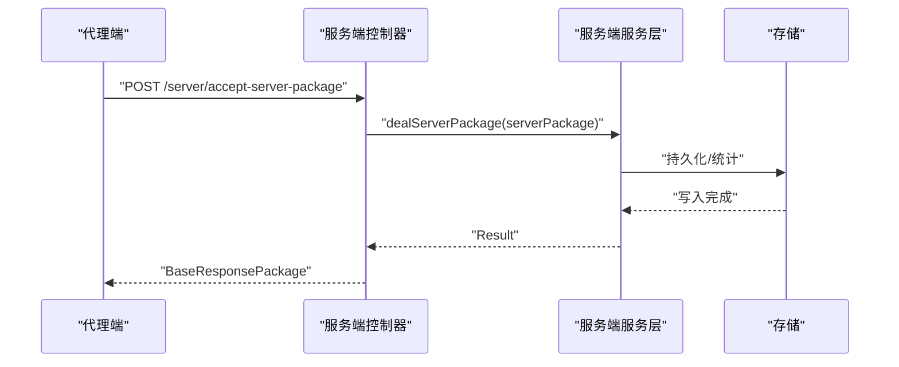
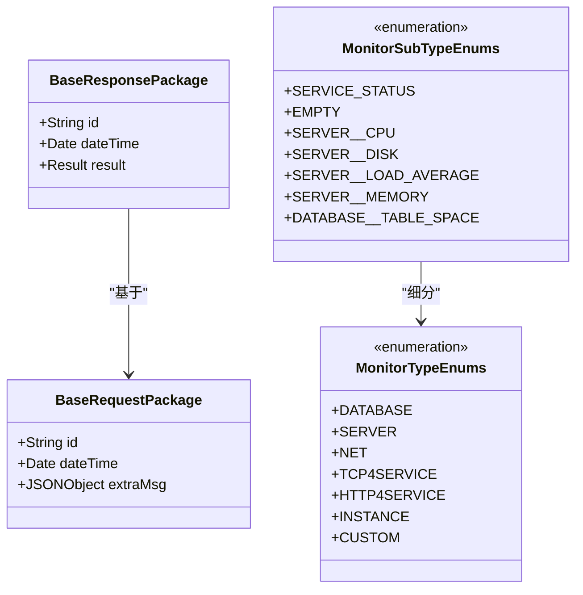
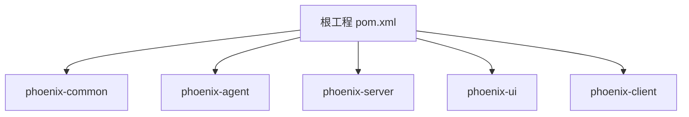

# 项目概述

<cite>
**本文档引用的文件**
- [pom.xml](file://pom.xml)
- [AgentApplication.java](file://phoenix-agent/src/main/java/com/gitee/pifeng/monitoring/agent/AgentApplication.java)
- [ServerApplication.java](file://phoenix-server/src/main/java/com/gitee/pifeng/monitoring/server/ServerApplication.java)
- [UiApplication.java](file://phoenix-ui/src/main/java/com/gitee/pifeng/monitoring/ui/UiApplication.java)
- [Monitor.java](file://phoenix-client/phoenix-client-core/src/main/java/com/gitee/pifeng/monitoring/plug/Monitor.java)
- [ServerController.java（代理端）](file://phoenix-agent/src/main/java/com/gitee/pifeng/monitoring/agent/business/client/controller/ServerController.java)
- [JvmController.java（代理端）](file://phoenix-agent/src/main/java/com/gitee/pifeng/monitoring/agent/business/client/controller/JvmController.java)
- [HttpController.java（代理端）](file://phoenix-agent/src/main/java/com/gitee/pifeng/monitoring/agent/business/client/controller/HttpController.java)
- [DbController.java（代理端）](file://phoenix-agent/src/main/java/com/gitee/pifeng/monitoring/agent/business/client/controller/DbController.java)
- [ServerController.java（服务端）](file://phoenix-server/src/main/java/com/gitee/pifeng/monitoring/server/business/server/controller/ServerController.java)
- [MonitorTypeEnums.java](file://phoenix-common/phoenix-common-core/src/main/java/com/gitee/pifeng/monitoring/common/constant/MonitorTypeEnums.java)
- [MonitorSubTypeEnums.java](file://phoenix-common/phoenix-common-core/src/main/java/com/gitee/pifeng/monitoring/common/constant/monitortype/MonitorSubTypeEnums.java)
- [BaseRequestPackage.java](file://phoenix-common/phoenix-common-core/src/main/java/com/gitee/pifeng/monitoring/common/dto/BaseRequestPackage.java)
- [BaseResponsePackage.java](file://phoenix-common/phoenix-common-core/src/main/java/com/gitee/pifeng/monitoring/common/dto/BaseResponsePackage.java)
- [InitOshi.java](file://phoenix-common/phoenix-common-core/src/main/java/com/gitee/pifeng/monitoring/common/init/InitOshi.java)
- [ServerUtils.java](file://phoenix-common/phoenix-common-core/src/main/java/com/gitee/pifeng/monitoring/common/util/server/ServerUtils.java)
</cite>

## 目录
1. [引言](#引言)
2. [项目结构](#项目结构)
3. [核心组件](#核心组件)
4. [架构总览](#架构总览)
5. [详细组件分析](#详细组件分析)
6. [依赖分析](#依赖分析)
7. [性能考虑](#性能考虑)
8. [故障排查指南](#故障排查指南)
9. [结论](#结论)
10. [附录](#附录)

## 引言
Phoenix 监控系统是一个面向全栈场景的开源监控平台，覆盖“客户端采集—代理端汇聚—服务端存储与计算—UI端可视化”的完整链路。项目通过统一的数据包协议、可扩展的监控类型枚举与多维度监控能力，支持服务器资源、数据库、网络、HTTP 请求、应用实例等多维监控，满足从单体到分布式环境的可观测性需求。

## 项目结构
Phoenix 采用多模块聚合工程组织，四大核心模块分别承担不同职责：
- 客户端（phoenix-client）：提供监控采集与上报能力，内置心跳、服务器、JVM、业务埋点等调度器。
- 代理端（phoenix-agent）：接收来自客户端的数据包，进行解密/加密处理与业务转发，暴露REST接口供客户端/服务端调用。
- 服务端（phoenix-server）：承接代理端/客户端数据，完成持久化、统计与告警联动，提供统一的业务接口。
- UI端（phoenix-ui）：提供管理与可视化界面，支持实例管理、数据库监控、HTTP/TCP监控、告警记录等。

图表来源
- [AgentApplication.java:28-37](file://phoenix-agent/src/main/java/com/gitee/pifeng/monitoring/agent/AgentApplication.java#L28-L37)
- [ServerApplication.java:35-45](file://phoenix-server/src/main/java/com/gitee/pifeng/monitoring/server/ServerApplication.java#L35-L45)
- [UiApplication.java:36-46](file://phoenix-ui/src/main/java/com/gitee/pifeng/monitoring/ui/UiApplication.java#L36-L46)
- [ServerController.java（代理端）:26-53](file://phoenix-agent/src/main/java/com/gitee/pifeng/monitoring/agent/business/client/controller/ServerController.java#L26-L53)
- [JvmController.java（代理端）:26-53](file://phoenix-agent/src/main/java/com/gitee/pifeng/monitoring/agent/business/client/controller/JvmController.java#L26-L53)
- [HttpController.java（代理端）:29-58](file://phoenix-agent/src/main/java/com/gitee/pifeng/monitoring/agent/business/client/controller/HttpController.java#L29-L58)
- [DbController.java（代理端）:29-57](file://phoenix-agent/src/main/java/com/gitee/pifeng/monitoring/agent/business/client/controller/DbController.java#L29-L57)
- [ServerController.java（服务端）:31-74](file://phoenix-server/src/main/java/com/gitee/pifeng/monitoring/server/business/server/controller/ServerController.java#L31-L74)

章节来源
- [pom.xml:11-22](file://pom.xml#L11-L22)

## 核心组件
- 统一数据包模型：客户端/代理端/服务端共享基础请求包与响应包，确保跨模块协议一致性。
- 监控类型枚举：涵盖数据库、服务器、网络、TCP服务、HTTP服务、应用实例、自定义等类型，便于扩展与治理。
- OSHI 系统信息采集：通过 InitOshi 初始化系统信息，ServerUtils 聚合 CPU、内存、磁盘、网络、进程等多维指标。
- 启动入口：四端均提供标准 Spring Boot 启动类，集中化配置 Undertow Web 容器与组件扫描策略。

章节来源
- [BaseRequestPackage.java:18-41](file://phoenix-common/phoenix-common-core/src/main/java/com/gitee/pifeng/monitoring/common/dto/BaseRequestPackage.java#L18-L41)
- [BaseResponsePackage.java:18-41](file://phoenix-common/phoenix-common-core/src/main/java/com/gitee/pifeng/monitoring/common/dto/BaseResponsePackage.java#L18-L41)
- [MonitorTypeEnums.java:11-48](file://phoenix-common/phoenix-common-core/src/main/java/com/gitee/pifeng/monitoring/common/constant/MonitorTypeEnums.java#L11-L48)
- [MonitorSubTypeEnums.java:11-51](file://phoenix-common/phoenix-common-core/src/main/java/com/gitee/pifeng/monitoring/common/constant/monitortype/MonitorSubTypeEnums.java#L11-L51)
- [InitOshi.java:15-38](file://phoenix-common/phoenix-common-core/src/main/java/com/gitee/pifeng/monitoring/common/init/InitOshi.java#L15-L38)
- [ServerUtils.java:68-76](file://phoenix-common/phoenix-common-core/src/main/java/com/gitee/pifeng/monitoring/common/util/server/ServerUtils.java#L68-L76)
- [AgentApplication.java:28-37](file://phoenix-agent/src/main/java/com/gitee/pifeng/monitoring/agent/AgentApplication.java#L28-L37)
- [ServerApplication.java:35-45](file://phoenix-server/src/main/java/com/gitee/pifeng/monitoring/server/ServerApplication.java#L35-L45)
- [UiApplication.java:36-46](file://phoenix-ui/src/main/java/com/gitee/pifeng/monitoring/ui/UiApplication.java#L36-L46)

## 架构总览
Phoenix 的整体数据流从“客户端采集”开始，经“代理端汇聚与转发”，再到“服务端存储与处理”，最终由“UI端展示”。各模块通过统一的数据包协议与 REST 接口协同工作，形成闭环的可观测体系。

图表来源
- [ServerController.java（代理端）:47-52](file://phoenix-agent/src/main/java/com/gitee/pifeng/monitoring/agent/business/client/controller/ServerController.java#L47-L52)
- [JvmController.java（代理端）:47-52](file://phoenix-agent/src/main/java/com/gitee/pifeng/monitoring/agent/business/client/controller/JvmController.java#L47-L52)
- [HttpController.java（代理端）:52-57](file://phoenix-agent/src/main/java/com/gitee/pifeng/monitoring/agent/business/client/controller/HttpController.java#L52-L57)
- [DbController.java（代理端）:52-57](file://phoenix-agent/src/main/java/com/gitee/pifeng/monitoring/agent/business/client/controller/DbController.java#L52-L57)
- [ServerController.java（服务端）:59-73](file://phoenix-server/src/main/java/com/gitee/pifeng/monitoring/server/business/server/controller/ServerController.java#L59-L73)

## 详细组件分析

### 客户端入口与采集调度
- Monitor 提供统一的启动入口，负责加载配置、校验证书、初始化加解密、启动心跳/服务器/JVM等定时任务，并注册 JVM 关闭钩子。
- 业务埋点通过受监控的调度线程池实现，支持自定义周期与线程类型，便于对关键业务进行持续观测。

图表来源
- [Monitor.java:67-150](file://phoenix-client/phoenix-client-core/src/main/java/com/gitee/pifeng/monitoring/plug/Monitor.java#L67-L150)

章节来源
- [Monitor.java:39-151](file://phoenix-client/phoenix-client-core/src/main/java/com/gitee/pifeng/monitoring/plug/Monitor.java#L39-L151)

### 代理端控制器与数据包处理
- 服务器信息控制器：接收客户端发送的服务器信息包，交由服务层处理并返回基础响应包。
- JVM 信息控制器：接收客户端发送的 JVM 信息包，交由服务层处理并返回基础响应包。
- HTTP/数据库测试控制器：接收基础请求包，调用通用服务进行连通性测试并返回结果。

图表来源
- [ServerController.java（代理端）:47-52](file://phoenix-agent/src/main/java/com/gitee/pifeng/monitoring/agent/business/client/controller/ServerController.java#L47-L52)
- [JvmController.java（代理端）:47-52](file://phoenix-agent/src/main/java/com/gitee/pifeng/monitoring/agent/business/client/controller/JvmController.java#L47-L52)
- [HttpController.java（代理端）:52-57](file://phoenix-agent/src/main/java/com/gitee/pifeng/monitoring/agent/business/client/controller/HttpController.java#L52-L57)
- [DbController.java（代理端）:52-57](file://phoenix-agent/src/main/java/com/gitee/pifeng/monitoring/agent/business/client/controller/DbController.java#L52-L57)

章节来源
- [ServerController.java（代理端）:26-53](file://phoenix-agent/src/main/java/com/gitee/pifeng/monitoring/agent/business/client/controller/ServerController.java#L26-L53)
- [JvmController.java（代理端）:26-53](file://phoenix-agent/src/main/java/com/gitee/pifeng/monitoring/agent/business/client/controller/JvmController.java#L26-L53)
- [HttpController.java（代理端）:29-58](file://phoenix-agent/src/main/java/com/gitee/pifeng/monitoring/agent/business/client/controller/HttpController.java#L29-L58)
- [DbController.java（代理端）:29-57](file://phoenix-agent/src/main/java/com/gitee/pifeng/monitoring/agent/business/client/controller/DbController.java#L29-L57)

### 服务端处理与持久化
- 服务端控制器接收来自代理端/客户端的服务器信息包，进行处理并构造基础响应包返回。
- 控制器内包含耗时统计逻辑，超过阈值时输出告警日志，便于定位性能瓶颈。

图表来源
- [ServerController.java（服务端）:59-73](file://phoenix-server/src/main/java/com/gitee/pifeng/monitoring/server/business/server/controller/ServerController.java#L59-L73)

章节来源
- [ServerController.java（服务端）:31-74](file://phoenix-server/src/main/java/com/gitee/pifeng/monitoring/server/business/server/controller/ServerController.java#L31-L74)

### 监控范围与数据模型
- 监控类型：数据库、服务器、网络、TCP服务、HTTP服务、应用实例、自定义。
- 监控子类型：如服务器 CPU/磁盘/负载/内存，数据库表空间等。
- 数据包模型：基础请求包与基础响应包，承载 ID、时间戳与附加信息/结果。

图表来源
- [BaseRequestPackage.java:18-41](file://phoenix-common/phoenix-common-core/src/main/java/com/gitee/pifeng/monitoring/common/dto/BaseRequestPackage.java#L18-L41)
- [BaseResponsePackage.java:18-41](file://phoenix-common/phoenix-common-core/src/main/java/com/gitee/pifeng/monitoring/common/dto/BaseResponsePackage.java#L18-L41)
- [MonitorTypeEnums.java:11-48](file://phoenix-common/phoenix-common-core/src/main/java/com/gitee/pifeng/monitoring/common/constant/MonitorTypeEnums.java#L11-L48)
- [MonitorSubTypeEnums.java:11-51](file://phoenix-common/phoenix-common-core/src/main/java/com/gitee/pifeng/monitoring/common/constant/monitortype/MonitorSubTypeEnums.java#L11-L51)

章节来源
- [MonitorTypeEnums.java:11-48](file://phoenix-common/phoenix-common-core/src/main/java/com/gitee/pifeng/monitoring/common/constant/MonitorTypeEnums.java#L11-L48)
- [MonitorSubTypeEnums.java:11-51](file://phoenix-common/phoenix-common-core/src/main/java/com/gitee/pifeng/monitoring/common/constant/monitortype/MonitorSubTypeEnums.java#L11-L51)
- [BaseRequestPackage.java:18-41](file://phoenix-common/phoenix-common-core/src/main/java/com/gitee/pifeng/monitoring/common/dto/BaseRequestPackage.java#L18-L41)
- [BaseResponsePackage.java:18-41](file://phoenix-common/phoenix-common-core/src/main/java/com/gitee/pifeng/monitoring/common/dto/BaseResponsePackage.java#L18-L41)

### 技术选型与设计动机
- Spring Boot：统一的微服务开发体验，简化配置与部署，四端均采用标准启动类。
- MyBatis-Plus：提升数据库访问效率与可维护性，配合代码生成器与注入器，降低样板代码。
- OSHI：跨平台系统信息采集，提供 CPU、内存、磁盘、网络、进程等指标，支撑服务器资源监控。
- Knife4j：OpenAPI 文档增强，便于前后端联调与接口治理。
- Undertow：默认 Web 容器定制化，兼顾性能与稳定性。
- Hutool：常用工具集，简化日期、字符串、加密等常见操作。

章节来源
- [pom.xml:272-390](file://pom.xml#L272-L390)
- [InitOshi.java:15-38](file://phoenix-common/phoenix-common-core/src/main/java/com/gitee/pifeng/monitoring/common/init/InitOshi.java#L15-L38)

## 依赖分析
- 模块间依赖：pom.xml 明确声明四大模块与公共模块的父子关系，确保版本与依赖统一。
- 外部依赖：JSON 解析、加解密、ORM、数据库驱动、文档工具、系统信息采集等，均通过依赖管理集中控制。

图表来源
- [pom.xml:11-22](file://pom.xml#L11-L22)

章节来源
- [pom.xml:132-391](file://pom.xml#L132-L391)

## 性能考虑
- 启动耗时监控：四端启动类均记录启动耗时，便于评估部署与优化。
- 处理耗时告警：服务端控制器对耗时较长的请求包处理输出告警日志，辅助定位性能瓶颈。
- 线程池与调度：客户端提供受监控的调度线程池，支持业务埋点的周期性执行，避免阻塞主线程。
- 系统信息采集：通过 OSHI 初始化全局配置，减少重复初始化开销。

章节来源
- [AgentApplication.java:30-36](file://phoenix-agent/src/main/java/com/gitee/pifeng/monitoring/agent/AgentApplication.java#L30-L36)
- [ServerApplication.java:38-44](file://phoenix-server/src/main/java/com/gitee/pifeng/monitoring/server/ServerApplication.java#L38-L44)
- [UiApplication.java:39-45](file://phoenix-ui/src/main/java/com/gitee/pifeng/monitoring/ui/UiApplication.java#L39-L45)
- [ServerController.java（服务端）:64-72](file://phoenix-server/src/main/java/com/gitee/pifeng/monitoring/server/business/server/controller/ServerController.java#L64-L72)
- [Monitor.java:190-192](file://phoenix-client/phoenix-client-core/src/main/java/com/gitee/pifeng/monitoring/plug/Monitor.java#L190-L192)
- [InitOshi.java:32-38](file://phoenix-common/phoenix-common-core/src/main/java/com/gitee/pifeng/monitoring/common/init/InitOshi.java#L32-L38)

## 故障排查指南
- 配置与证书：客户端启动阶段会加载配置并校验证书，若失败将立即终止进程，需检查配置文件与证书有效性。
- 网络异常：HTTP/数据库测试控制器在处理过程中可能抛出网络异常，需检查目标地址可达性与认证信息。
- 处理耗时：服务端控制器对超时请求输出告警日志，建议结合数据库索引、SQL 执行计划与线程池配置进行优化。
- 日志与监控：四端均输出启动耗时与处理耗时日志，便于快速定位问题。

章节来源
- [Monitor.java:124-138](file://phoenix-client/phoenix-client-core/src/main/java/com/gitee/pifeng/monitoring/plug/Monitor.java#L124-L138)
- [HttpController.java（代理端）:52-57](file://phoenix-agent/src/main/java/com/gitee/pifeng/monitoring/agent/business/client/controller/HttpController.java#L52-L57)
- [DbController.java（代理端）:52-57](file://phoenix-agent/src/main/java/com/gitee/pifeng/monitoring/agent/business/client/controller/DbController.java#L52-L57)
- [ServerController.java（服务端）:64-72](file://phoenix-server/src/main/java/com/gitee/pifeng/monitoring/server/business/server/controller/ServerController.java#L64-L72)

## 结论
Phoenix 监控系统通过清晰的模块划分、统一的数据包协议与丰富的监控类型，构建了覆盖全栈的可观测能力。依托 Spring Boot 生态与 OSHI 等成熟组件，系统在易用性、可扩展性与性能方面取得平衡，适用于中小规模到中大型分布式场景的监控需求。

## 附录
- 适用场景：需要统一采集服务器、数据库、网络、HTTP/TCP 等指标，并通过 UI 进行集中管理与可视化展示。
- 优势特点：模块化设计、协议统一、采集与展示分离、可扩展的监控类型、完善的启动与处理耗时监控。
- 差异化对比：相较单一组件方案，Phoenix 更强调“采集—汇聚—存储—展示”的全链路协同；相较通用商业方案，更强调开源、可定制与跨平台系统信息采集能力。